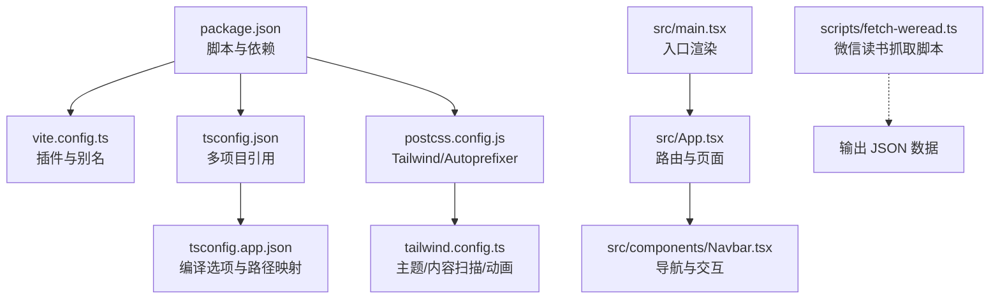
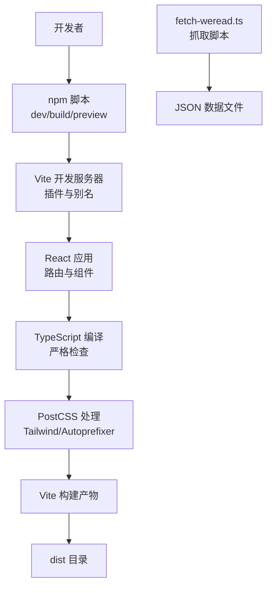
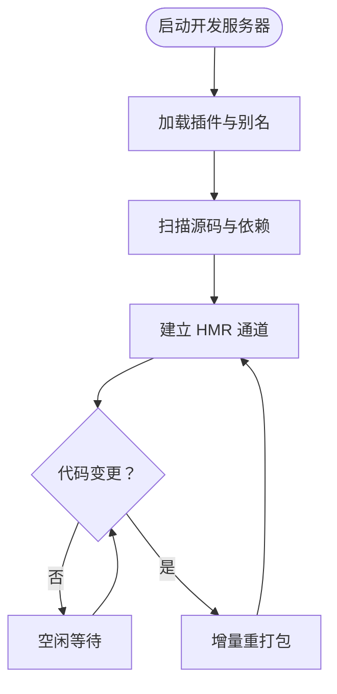
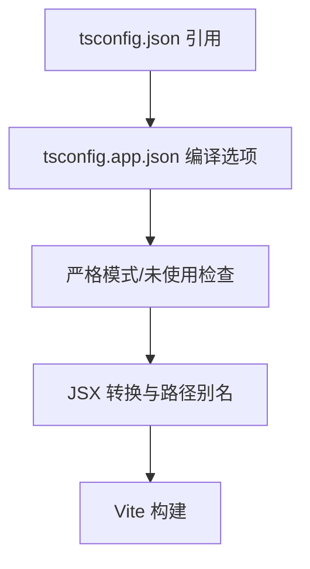
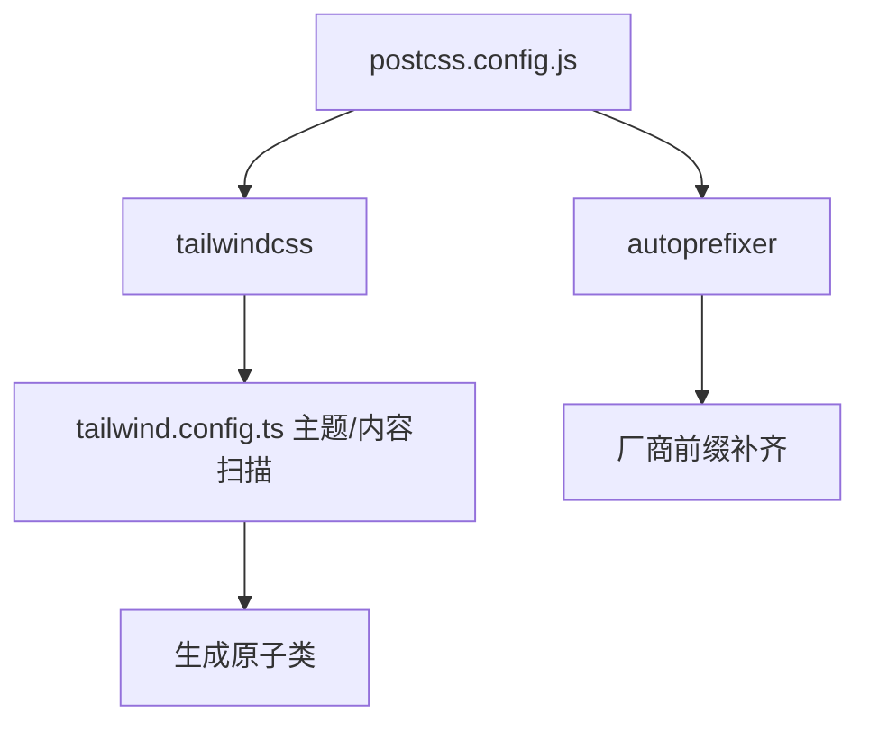
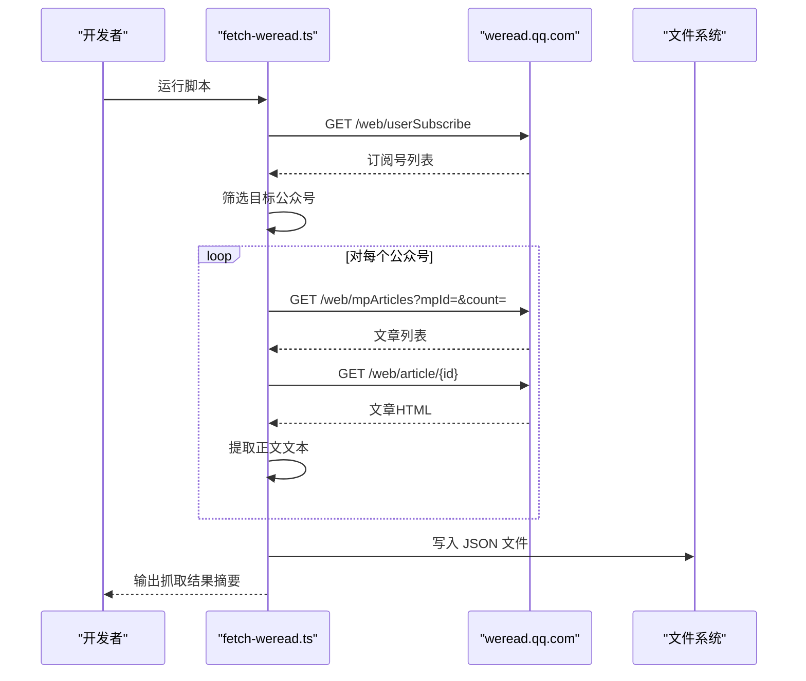
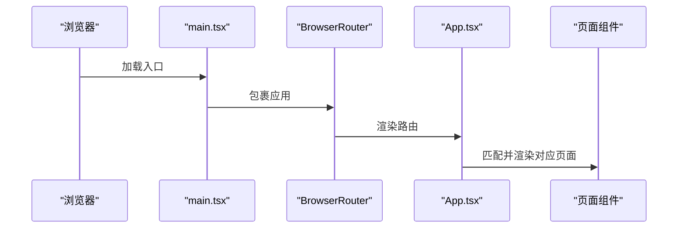
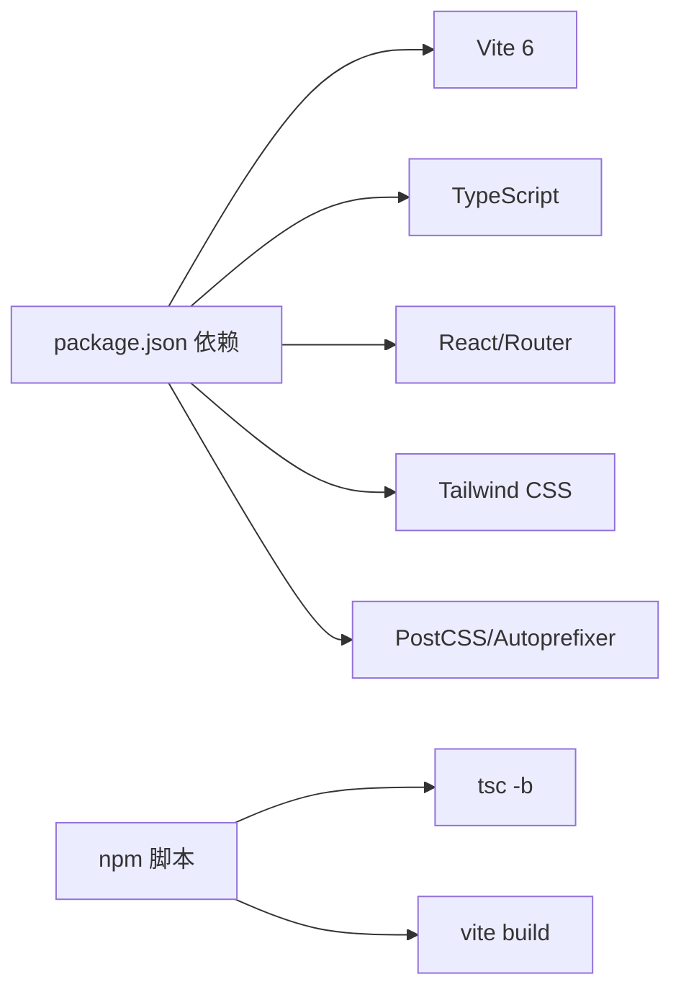

# 开发工具

<cite>
**本文引用的文件**
- [vite.config.ts](file://vite.config.ts)
- [package.json](file://package.json)
- [tsconfig.json](file://tsconfig.json)
- [tsconfig.app.json](file://tsconfig.app.json)
- [postcss.config.js](file://postcss.config.js)
- [tailwind.config.ts](file://tailwind.config.ts)
- [src/main.tsx](file://src/main.tsx)
- [src/App.tsx](file://src/App.tsx)
- [src/components/Navbar.tsx](file://src/components/Navbar.tsx)
- [src/lib/utils.ts](file://src/lib/utils.ts)
- [scripts/fetch-weread.ts](file://scripts/fetch-weread.ts)
- [.gitignore](file://.gitignore)
</cite>

## 目录
1. [简介](#简介)
2. [项目结构](#项目结构)
3. [核心组件](#核心组件)
4. [架构总览](#架构总览)
5. [详细组件分析](#详细组件分析)
6. [依赖分析](#依赖分析)
7. [性能考虑](#性能考虑)
8. [故障排查指南](#故障排查指南)
9. [结论](#结论)
10. [附录](#附录)

## 简介
本文件面向 cs336 项目的开发与构建流程，系统梳理 Vite 构建工具的配置与优化（开发服务器、构建优化、热重载）、TypeScript 编译与类型检查、PostCSS/Tailwind 配置、自动化脚本（微信读书数据抓取）以及开发调试与质量保障工具链。文档同时给出构建流程优化、打包策略建议与部署前检查清单，并总结开发工作流最佳实践。

## 项目结构
该项目采用前端单页应用（SPA）架构，基于 React 18 与 React Router DOM v7，使用 Vite 6 作为构建与开发服务器，TypeScript 提供类型安全，Tailwind CSS 与 PostCSS 实现样式管线，组件通过路径别名 @/src 简化导入。

图示来源
- [package.json:1-32](file://package.json#L1-L32)
- [vite.config.ts:1-13](file://vite.config.ts#L1-L13)
- [tsconfig.json:1-5](file://tsconfig.json#L1-L5)
- [tsconfig.app.json:1-26](file://tsconfig.app.json#L1-L26)
- [postcss.config.js:1-7](file://postcss.config.js#L1-L7)
- [tailwind.config.ts:1-104](file://tailwind.config.ts#L1-L104)
- [src/main.tsx:1-14](file://src/main.tsx#L1-L14)
- [src/App.tsx:1-45](file://src/App.tsx#L1-L45)
- [src/components/Navbar.tsx:1-143](file://src/components/Navbar.tsx#L1-L143)
- [scripts/fetch-weread.ts:1-206](file://scripts/fetch-weread.ts#L1-L206)

章节来源
- [package.json:1-32](file://package.json#L1-L32)
- [vite.config.ts:1-13](file://vite.config.ts#L1-L13)
- [tsconfig.json:1-5](file://tsconfig.json#L1-L5)
- [tsconfig.app.json:1-26](file://tsconfig.app.json#L1-L26)
- [postcss.config.js:1-7](file://postcss.config.js#L1-L7)
- [tailwind.config.ts:1-104](file://tailwind.config.ts#L1-L104)
- [src/main.tsx:1-14](file://src/main.tsx#L1-L14)
- [src/App.tsx:1-45](file://src/App.tsx#L1-L45)
- [src/components/Navbar.tsx:1-143](file://src/components/Navbar.tsx#L1-L143)
- [scripts/fetch-weread.ts:1-206](file://scripts/fetch-weread.ts#L1-L206)

## 核心组件
- Vite 构建与开发服务器
  - 插件：@vitejs/plugin-react
  - 路径别名：@ 指向 src
  - 开发命令：vite；预览命令：vite preview
- TypeScript
  - 多项目引用：tsconfig.json 引用 tsconfig.app.json
  - app 编译配置：ESNext 模块、React JSX、严格模式、路径别名等
- 样式管线
  - PostCSS：tailwindcss + autoprefixer
  - Tailwind：dark 模式、内容扫描、主题变量、动画
- 自动化脚本
  - 微信读书公众号文章抓取：支持订阅号筛选、文章列表与正文提取、结果持久化

章节来源
- [vite.config.ts:1-13](file://vite.config.ts#L1-L13)
- [package.json:6-10](file://package.json#L6-L10)
- [tsconfig.json:1-5](file://tsconfig.json#L1-L5)
- [tsconfig.app.json:1-26](file://tsconfig.app.json#L1-L26)
- [postcss.config.js:1-7](file://postcss.config.js#L1-L7)
- [tailwind.config.ts:1-104](file://tailwind.config.ts#L1-L104)
- [scripts/fetch-weread.ts:1-206](file://scripts/fetch-weread.ts#L1-L206)

## 架构总览
下图展示从开发到构建的关键流程与工具链交互：

图示来源
- [package.json:6-10](file://package.json#L6-L10)
- [vite.config.ts:1-13](file://vite.config.ts#L1-L13)
- [tsconfig.app.json:1-26](file://tsconfig.app.json#L1-L26)
- [postcss.config.js:1-7](file://postcss.config.js#L1-L7)
- [tailwind.config.ts:1-104](file://tailwind.config.ts#L1-L104)
- [scripts/fetch-weread.ts:1-206](file://scripts/fetch-weread.ts#L1-L206)

## 详细组件分析

### Vite 配置与优化
- 插件与别名
  - 使用 @vitejs/plugin-react，提升 React 开发体验
  - 配置路径别名 @ 指向 src，简化导入路径
- 开发服务器
  - 默认端口与热重载由 Vite 提供；无额外代理或中间件配置
- 构建优化
  - 使用 Vite 原生 esbuild 进行打包与压缩
  - 生产构建自动进行资源分包与最小化
- 热重载机制
  - 基于浏览器 WebSocket 的模块热替换，组件更新即时生效

图示来源
- [vite.config.ts:1-13](file://vite.config.ts#L1-L13)

章节来源
- [vite.config.ts:1-13](file://vite.config.ts#L1-L13)
- [package.json:6-10](file://package.json#L6-L10)

### TypeScript 编译与类型检查
- 多项目配置
  - 根 tsconfig.json 通过 references 引入 tsconfig.app.json
- app 编译选项
  - 目标 ES2020，模块系统 ESNext，严格模式开启
  - 启用 JSX 转换（react-jsx），路径别名 @/*
  - 关闭 emit 并启用 bundler 模式以配合 Vite
- 类型检查与转换
  - 构建脚本先执行 tsc -b（增量编译），再由 Vite 进行打包
  - 严格模式与未使用变量/参数检查有助于早期发现潜在问题

图示来源
- [tsconfig.json:1-5](file://tsconfig.json#L1-L5)
- [tsconfig.app.json:1-26](file://tsconfig.app.json#L1-L26)

章节来源
- [tsconfig.json:1-5](file://tsconfig.json#L1-L5)
- [tsconfig.app.json:1-26](file://tsconfig.app.json#L1-L26)
- [package.json:8](file://package.json#L8)

### 样式与 Tailwind 配置
- PostCSS
  - 启用 tailwindcss 与 autoprefixer，确保现代浏览器兼容与原子类生成
- Tailwind
  - darkMode 使用 class 策略
  - content 扫描根目录与 src 下的 ts/tsx 文件，保证按需生成样式
  - 主题扩展：字体、颜色、圆角、阴影、动画等
  - 插件：tailwindcss-animate

图示来源
- [postcss.config.js:1-7](file://postcss.config.js#L1-L7)
- [tailwind.config.ts:1-104](file://tailwind.config.ts#L1-L104)

章节来源
- [postcss.config.js:1-7](file://postcss.config.js#L1-L7)
- [tailwind.config.ts:1-104](file://tailwind.config.ts#L1-L104)

### 自动化脚本：微信读书数据抓取
- 功能概述
  - 通过 Cookie 认证访问 weread.qq.com 接口
  - 获取关注公众号列表、筛选目标公众号、抓取文章列表与正文
  - 将结果写入 JSON 文件，便于后续数据消费
- 关键流程
  - 订阅号列表 → 筛选 → 文章列表 → 正文提取 → 结果汇总 → 写文件
- 安全与合规
  - 脚本内置 Cookie，请在本地使用并注意账号安全与服务条款

图示来源
- [scripts/fetch-weread.ts:1-206](file://scripts/fetch-weread.ts#L1-L206)

章节来源
- [scripts/fetch-weread.ts:1-206](file://scripts/fetch-weread.ts#L1-L206)

### 应用入口与路由
- 入口渲染
  - main.tsx 中使用 ReactDOM.createRoot 渲染 App，并包裹 BrowserRouter
- 路由组织
  - App.tsx 定义多条路由，覆盖首页、会议、深度解读、开源项目、团队、归档等页面
- 组件与工具
  - Navbar 提供导航与搜索栏；utils 提供分类标签映射、日期格式化等通用方法

图示来源
- [src/main.tsx:1-14](file://src/main.tsx#L1-L14)
- [src/App.tsx:1-45](file://src/App.tsx#L1-L45)
- [src/components/Navbar.tsx:1-143](file://src/components/Navbar.tsx#L1-L143)
- [src/lib/utils.ts:1-58](file://src/lib/utils.ts#L1-L58)

章节来源
- [src/main.tsx:1-14](file://src/main.tsx#L1-L14)
- [src/App.tsx:1-45](file://src/App.tsx#L1-L45)
- [src/components/Navbar.tsx:1-143](file://src/components/Navbar.tsx#L1-L143)
- [src/lib/utils.ts:1-58](file://src/lib/utils.ts#L1-L58)

## 依赖分析
- 开发依赖
  - Vite 6、@vitejs/plugin-react、TypeScript ~5.6、Tailwind CSS、PostCSS、Autoprefixer
- 运行时依赖
  - React 18、React Router DOM 7、Tailwind 相关工具与图标库
- 构建链路
  - npm 脚本先执行 tsc -b，再执行 vite build，确保类型检查与打包顺序正确

图示来源
- [package.json:11-30](file://package.json#L11-L30)
- [package.json:6-10](file://package.json#L6-L10)

章节来源
- [package.json:11-30](file://package.json#L11-L30)
- [package.json:6-10](file://package.json#L6-L10)

## 性能考虑
- 构建性能
  - 使用 Vite 的原生 esbuild，具备极快的打包速度；生产构建自动进行代码分割与压缩
- 开发体验
  - HMR 即时反馈；合理设置内容扫描范围可减少 Tailwind 样式生成开销
- 类型检查
  - 在构建前执行 tsc -b，提前暴露类型问题，避免运行时错误
- 样式体积
  - Tailwind content 扫描仅生成实际使用的类，结合 autoprefixer 与 minification 控制体积

[本节为通用指导，无需特定文件引用]

## 故障排查指南
- 开发服务器无法启动
  - 检查端口占用与网络权限；确认 Vite 插件与别名配置无误
- 热重载不生效
  - 确认编辑器保存行为与文件监听；检查组件是否正确导出与引入
- 构建失败
  - 先执行 tsc -b 查看类型错误；再执行 vite build 排查打包问题
- 样式异常
  - 检查 tailwind.config.ts 的 content 路径是否包含新增文件；清理缓存后重试
- 抓取脚本报错
  - 检查 Cookie 是否有效；确认目标接口返回结构是否变化；查看控制台错误日志

章节来源
- [vite.config.ts:1-13](file://vite.config.ts#L1-L13)
- [tsconfig.app.json:1-26](file://tsconfig.app.json#L1-L26)
- [tailwind.config.ts:1-104](file://tailwind.config.ts#L1-L104)
- [scripts/fetch-weread.ts:1-206](file://scripts/fetch-weread.ts#L1-L206)

## 结论
本项目以 Vite 为核心，结合 TypeScript、Tailwind 与 PostCSS，形成高效、可维护的前端工程化体系。通过严格的类型检查与按需样式生成，兼顾开发效率与运行性能。自动化脚本为内容数据注入提供了便捷手段。建议在现有基础上完善 CI/CD 流程与静态分析工具，进一步提升交付质量与一致性。

[本节为总结，无需特定文件引用]

## 附录

### 开发工作流最佳实践
- 代码格式化与 Lint
  - 建议引入 ESLint 与 Prettier，统一风格与规则
- 持续集成
  - 在 CI 中执行：安装依赖、类型检查、构建、测试（如有）、静态分析
- 部署前检查
  - 构建产物体积分析、关键页面首屏性能、可访问性检查

[本节为通用指导，无需特定文件引用]