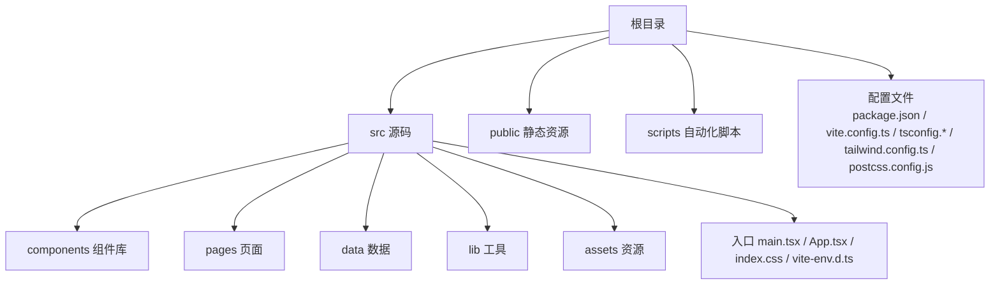
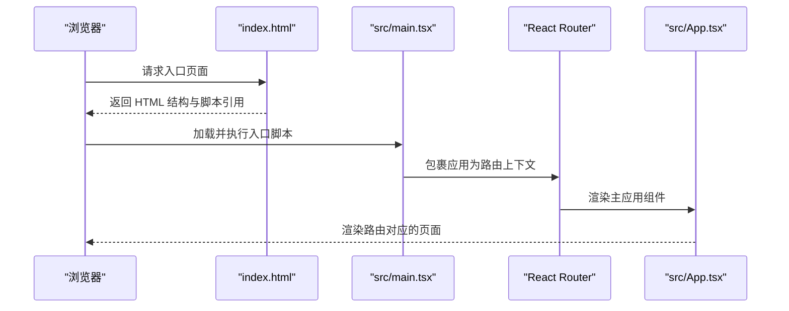
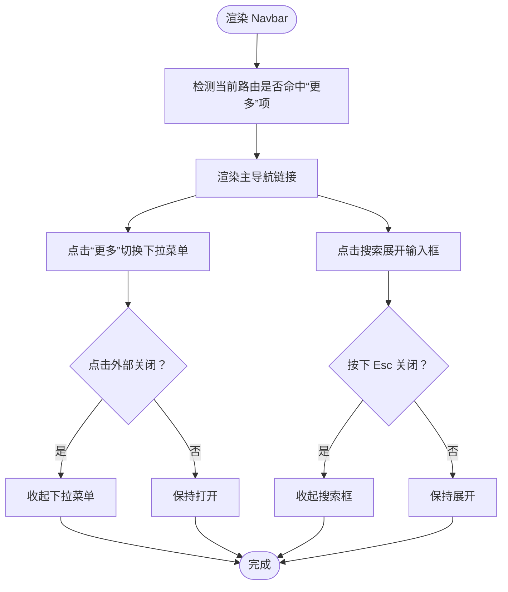
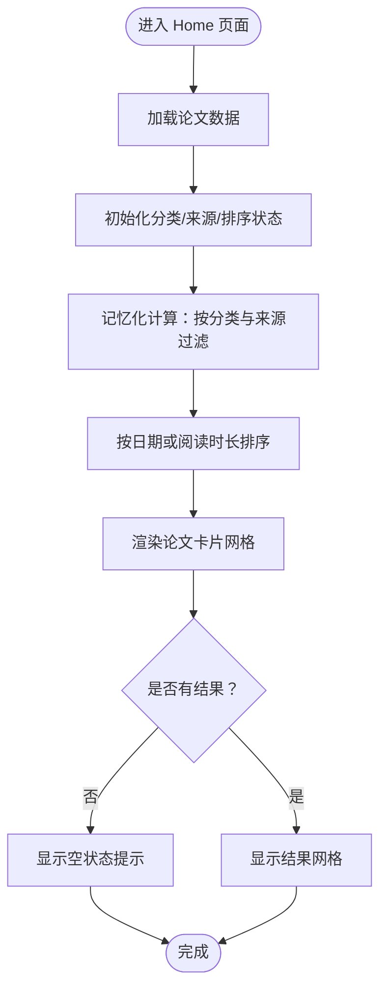
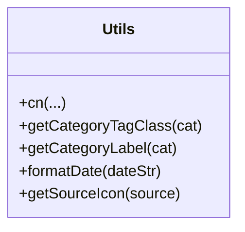
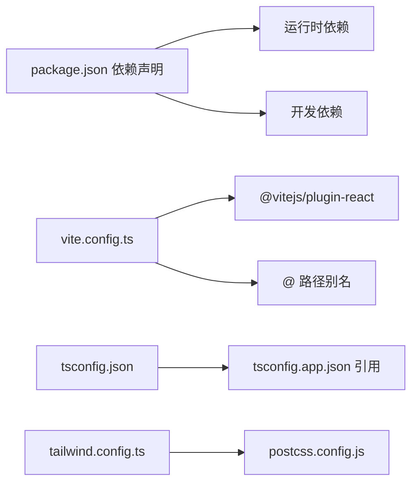

# 快速开始

<cite>
**本文引用的文件**
- [package.json](file://package.json)
- [vite.config.ts](file://vite.config.ts)
- [tsconfig.json](file://tsconfig.json)
- [tsconfig.app.json](file://tsconfig.app.json)
- [tailwind.config.ts](file://tailwind.config.ts)
- [postcss.config.js](file://postcss.config.js)
- [index.html](file://index.html)
- [src/main.tsx](file://src/main.tsx)
- [src/App.tsx](file://src/App.tsx)
- [src/pages/Home.tsx](file://src/pages/Home.tsx)
- [src/components/Navbar.tsx](file://src/components/Navbar.tsx)
- [src/lib/utils.ts](file://src/lib/utils.ts)
- [src/data/papers.ts](file://src/data/papers.ts)
- [scripts/fetch-weread.ts](file://scripts/fetch-weread.ts)
</cite>

## 目录
1. [简介](#简介)
2. [项目结构](#项目结构)
3. [核心组件](#核心组件)
4. [架构总览](#架构总览)
5. [详细组件分析](#详细组件分析)
6. [依赖分析](#依赖分析)
7. [性能考虑](#性能考虑)
8. [故障排除指南](#故障排除指南)
9. [结论](#结论)
10. [附录](#附录)

## 简介
本指南面向初学者，帮助你在最短时间内完成 cs336 项目的本地开发环境搭建与运行。你将学到：
- 环境要求与工具链版本
- 项目克隆与依赖安装
- 启动开发服务器、构建生产包与预览部署包
- 关键配置文件的作用与常用选项
- 常见问题排查方法

## 项目结构
该项目是一个基于 React 18、TypeScript、Vite 6、TailwindCSS 的前端项目，采用模块化目录组织，页面与组件分离，数据以静态文件形式提供。

图表来源
- [src/main.tsx:1-14](file://src/main.tsx#L1-L14)
- [src/App.tsx:1-45](file://src/App.tsx#L1-L45)
- [index.html:1-17](file://index.html#L1-L17)

章节来源
- [src/main.tsx:1-14](file://src/main.tsx#L1-L14)
- [src/App.tsx:1-45](file://src/App.tsx#L1-L45)
- [index.html:1-17](file://index.html#L1-L17)

## 核心组件
- 应用入口与路由
  - 入口文件负责挂载 React 根节点并包裹路由容器，随后渲染主应用组件。
  - 主应用组件集中声明所有页面路由，形成站点导航骨架。
- 页面与组件
  - 页面组件负责展示具体业务内容（如首页、归档、团队详情等）。
  - UI 组件提供可复用的交互元素（如导航栏、标签、卡片等）。
- 工具与样式
  - 工具函数提供类名合并、分类标签映射、日期格式化等通用能力。
  - TailwindCSS 与 PostCSS 配置统一管理主题、动画与字体。

章节来源
- [src/main.tsx:1-14](file://src/main.tsx#L1-L14)
- [src/App.tsx:1-45](file://src/App.tsx#L1-L45)
- [src/components/Navbar.tsx:1-143](file://src/components/Navbar.tsx#L1-L143)
- [src/lib/utils.ts:1-58](file://src/lib/utils.ts#L1-L58)

## 架构总览
下面的时序图展示了从浏览器加载到页面渲染的关键流程：

图表来源
- [index.html:12-14](file://index.html#L12-L14)
- [src/main.tsx:7-13](file://src/main.tsx#L7-L13)
- [src/App.tsx:19-42](file://src/App.tsx#L19-L42)

## 详细组件分析

### 组件：导航栏（Navbar）
导航栏提供顶部主导航与“更多”下拉菜单，并支持展开搜索框。它通过路由状态判断当前激活项，保证视觉反馈一致。

图表来源
- [src/components/Navbar.tsx:22-143](file://src/components/Navbar.tsx#L22-L143)

章节来源
- [src/components/Navbar.tsx:1-143](file://src/components/Navbar.tsx#L1-L143)

### 组件：首页（Home）
首页负责展示论文列表、筛选与排序、热门专题卡片等。它从数据模块导入论文集合，并通过状态与记忆化计算实现高效筛选与排序。

图表来源
- [src/pages/Home.tsx:15-209](file://src/pages/Home.tsx#L15-L209)
- [src/data/papers.ts:1-200](file://src/data/papers.ts#L1-L200)

章节来源
- [src/pages/Home.tsx:1-209](file://src/pages/Home.tsx#L1-L209)
- [src/data/papers.ts:1-200](file://src/data/papers.ts#L1-L200)

### 组件：工具函数（utils）
工具函数提供类名合并、分类标签映射、日期格式化与来源图标选择等能力，贯穿于组件与页面中。

图表来源
- [src/lib/utils.ts:1-58](file://src/lib/utils.ts#L1-L58)

章节来源
- [src/lib/utils.ts:1-58](file://src/lib/utils.ts#L1-L58)

## 依赖分析
项目采用现代化前端技术栈，核心依赖与开发依赖如下：
- 运行时依赖：React、React DOM、React Router、TailwindCSS 相关工具与图标库
- 开发依赖：Vite、React 插件、TypeScript、PostCSS、TailwindCSS、Autoprefixer 等

图表来源
- [package.json:6-30](file://package.json#L6-L30)
- [vite.config.ts:5-12](file://vite.config.ts#L5-L12)
- [tsconfig.json:1-5](file://tsconfig.json#L1-L5)
- [tsconfig.app.json:1-26](file://tsconfig.app.json#L1-L26)
- [tailwind.config.ts:1-104](file://tailwind.config.ts#L1-L104)
- [postcss.config.js:1-7](file://postcss.config.js#L1-L7)

章节来源
- [package.json:1-32](file://package.json#L1-L32)
- [vite.config.ts:1-13](file://vite.config.ts#L1-L13)
- [tsconfig.json:1-5](file://tsconfig.json#L1-L5)
- [tsconfig.app.json:1-26](file://tsconfig.app.json#L1-L26)
- [tailwind.config.ts:1-104](file://tailwind.config.ts#L1-L104)
- [postcss.config.js:1-7](file://postcss.config.js#L1-L7)

## 性能考虑
- 路由懒加载：可通过拆分页面组件并配合动态导入进一步优化首屏加载。
- 图片与静态资源：合理设置图片尺寸与格式，避免不必要的重绘与回流。
- Tailwind 实用类：避免过度生成未使用的类，保持构建产物体积可控。
- TypeScript 编译：启用严格模式与未使用变量检查，减少潜在运行时问题。

## 故障排除指南
- 端口冲突
  - 现象：开发服务器启动时报端口被占用。
  - 处理：在配置文件中修改默认端口，或终止占用进程。
  - 参考：开发服务器默认端口由构建工具决定，可在配置文件中调整。
- 依赖安装失败
  - 现象：安装依赖报错或缓存损坏。
  - 处理：清理缓存并重试；若网络受限，可切换镜像源；必要时删除锁定文件后重装。
- 类型检查错误
  - 现象：TypeScript 编译报错。
  - 处理：根据错误信息修正类型；确保路径别名与引用一致。
- 样式不生效
  - 现象：Tailwind 或 PostCSS 生成的样式未应用。
  - 处理：确认内容扫描路径、插件顺序与主题配置；重启开发服务器。
- 路由跳转异常
  - 现象：页面无法正确渲染或空白。
  - 处理：检查路由定义与组件导出；确认入口文件正确挂载路由上下文。

章节来源
- [vite.config.ts:5-12](file://vite.config.ts#L5-L12)
- [postcss.config.js:1-7](file://postcss.config.js#L1-L7)
- [tailwind.config.ts:1-104](file://tailwind.config.ts#L1-L104)
- [src/main.tsx:7-13](file://src/main.tsx#L7-L13)

## 结论
通过本指南，你可以快速完成 cs336 项目的本地开发环境搭建与运行。建议在熟悉基础流程后，逐步探索配置文件的高级选项与组件的扩展实践，以提升开发效率与维护性。

## 附录

### 环境要求与工具链
- Node.js：建议使用 LTS 版本（如 18.x 或 20.x）
- npm：建议使用 8.x 及以上
- yarn：可选，如使用请确保版本兼容
- Git：用于克隆仓库

### 克隆与安装
- 克隆仓库
  - git clone <仓库地址>
- 安装依赖
  - npm install
  - 或使用 yarn：yarn install

### 开发与构建命令
- 启动开发服务器
  - npm run dev
- 构建生产包
  - npm run build
- 预览部署包
  - npm run preview

章节来源
- [package.json:6-10](file://package.json#L6-L10)

### 关键配置文件说明

- package.json
  - 作用：定义项目元信息、脚本命令、运行时与开发依赖。
  - 常用选项：name、version、scripts、dependencies、devDependencies。
- vite.config.ts
  - 作用：配置 Vite 插件与路径别名。
  - 常用选项：plugins、resolve.alias。
- tsconfig.json / tsconfig.app.json
  - 作用：管理 TypeScript 编译选项与引用关系。
  - 常用选项：compilerOptions（target、module、jsx、baseUrl、paths）、references、include。
- tailwind.config.ts
  - 作用：定义 Tailwind 的主题、颜色、字体、动画与插件。
  - 常用选项：content、theme.extend、plugins。
- postcss.config.js
  - 作用：配置 PostCSS 插件链（如 TailwindCSS、Autoprefixer）。

章节来源
- [package.json:1-32](file://package.json#L1-L32)
- [vite.config.ts:1-13](file://vite.config.ts#L1-L13)
- [tsconfig.json:1-5](file://tsconfig.json#L1-L5)
- [tsconfig.app.json:1-26](file://tsconfig.app.json#L1-L26)
- [tailwind.config.ts:1-104](file://tailwind.config.ts#L1-L104)
- [postcss.config.js:1-7](file://postcss.config.js#L1-L7)

### 自动化脚本
- 微信读书文章抓取脚本
  - 作用：通过 Cookie 认证抓取目标公众号文章列表与部分正文，输出 JSON 并保存到文件。
  - 使用：在本地运行脚本，确保网络与 Cookie 有效。

章节来源
- [scripts/fetch-weread.ts:1-206](file://scripts/fetch-weread.ts#L1-L206)