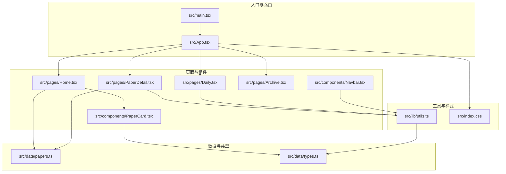
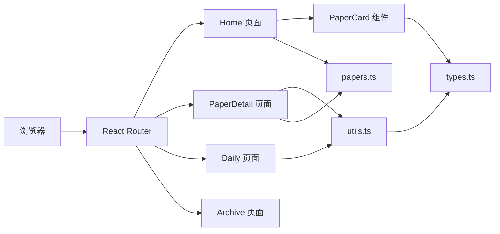
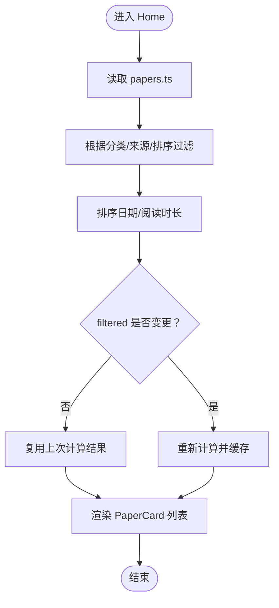
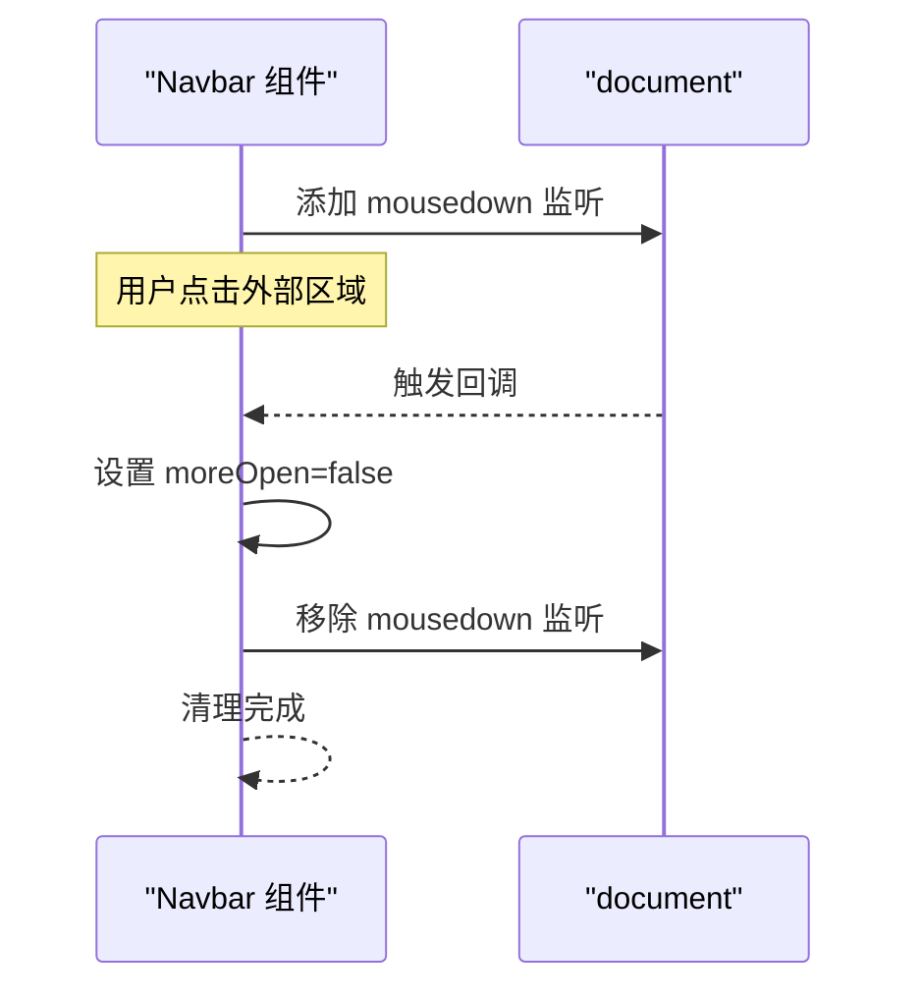
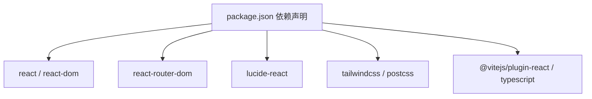

# 内存管理

<cite>
**本文引用的文件**
- [src/data/papers.ts](file://src/data/papers.ts)
- [src/data/types.ts](file://src/data/types.ts)
- [src/components/PaperCard.tsx](file://src/components/PaperCard.tsx)
- [src/pages/Home.tsx](file://src/pages/Home.tsx)
- [src/pages/PaperDetail.tsx](file://src/pages/PaperDetail.tsx)
- [src/pages/Daily.tsx](file://src/pages/Daily.tsx)
- [src/pages/Archive.tsx](file://src/pages/Archive.tsx)
- [src/components/Navbar.tsx](file://src/components/Navbar.tsx)
- [src/lib/utils.ts](file://src/lib/utils.ts)
- [src/App.tsx](file://src/App.tsx)
- [src/main.tsx](file://src/main.tsx)
- [src/index.css](file://src/index.css)
- [package.json](file://package.json)
</cite>

## 目录
1. [简介](#简介)
2. [项目结构](#项目结构)
3. [核心组件](#核心组件)
4. [架构总览](#架构总览)
5. [详细组件分析](#详细组件分析)
6. [依赖关系分析](#依赖关系分析)
7. [性能考量](#性能考量)
8. [故障排查指南](#故障排查指南)
9. [结论](#结论)
10. [附录](#附录)

## 简介
本指南围绕 cs336 项目的内存管理优化展开，目标是在大数据集（papers 数据）处理、React 组件生命周期与状态管理、图片资源加载与缓存、以及开发与调试工具使用等方面，提供系统化的优化策略与实操建议。文档同时给出面向性能测试与监控的实践方法，帮助在前端工程中实现更稳健的内存占用与更流畅的用户体验。

## 项目结构
该项目采用 Vite + React 18 + TypeScript 的现代前端架构，页面与组件按功能模块组织，数据模型集中于 data 目录，通用工具函数位于 lib 目录，样式通过 TailwindCSS 与自定义 CSS 变量实现。

**图表来源**
- [src/main.tsx:1-14](file://src/main.tsx#L1-L14)
- [src/App.tsx:1-45](file://src/App.tsx#L1-L45)
- [src/pages/Home.tsx:1-209](file://src/pages/Home.tsx#L1-L209)
- [src/pages/PaperDetail.tsx:1-151](file://src/pages/PaperDetail.tsx#L1-L151)
- [src/pages/Daily.tsx:1-107](file://src/pages/Daily.tsx#L1-L107)
- [src/pages/Archive.tsx:1-130](file://src/pages/Archive.tsx#L1-L130)
- [src/components/Navbar.tsx:1-143](file://src/components/Navbar.tsx#L1-L143)
- [src/components/PaperCard.tsx:1-73](file://src/components/PaperCard.tsx#L1-L73)
- [src/data/papers.ts:1-815](file://src/data/papers.ts#L1-L815)
- [src/data/types.ts:1-49](file://src/data/types.ts#L1-L49)
- [src/lib/utils.ts:1-58](file://src/lib/utils.ts#L1-L58)
- [src/index.css:1-158](file://src/index.css#L1-L158)

**章节来源**
- [src/main.tsx:1-14](file://src/main.tsx#L1-L14)
- [src/App.tsx:1-45](file://src/App.tsx#L1-L45)
- [src/index.css:1-158](file://src/index.css#L1-L158)

## 核心组件
- 数据模型与大数据集
  - papers.ts 包含大量论文条目，字段丰富，包含标题、作者、摘要、标签、来源、阅读时长等，是典型的“大数据集”场景。
  - 类型定义集中在 types.ts，确保数据结构稳定与可维护。
- 页面与组件
  - Home：首页聚合展示，包含过滤、排序、懒加载占位等。
  - PaperDetail：详情页，包含图片懒加载与外链跳转。
  - Daily：按日期分组的时间线展示。
  - Navbar：导航栏，包含下拉菜单与点击外部关闭逻辑。
  - PaperCard：卡片组件，渲染列表项。
- 工具函数
  - utils.ts 提供分类标签映射、格式化、图标映射等纯函数，避免重复计算与副作用。

**章节来源**
- [src/data/papers.ts:1-815](file://src/data/papers.ts#L1-L815)
- [src/data/types.ts:1-49](file://src/data/types.ts#L1-L49)
- [src/pages/Home.tsx:1-209](file://src/pages/Home.tsx#L1-L209)
- [src/pages/PaperDetail.tsx:1-151](file://src/pages/PaperDetail.tsx#L1-L151)
- [src/pages/Daily.tsx:1-107](file://src/pages/Daily.tsx#L1-L107)
- [src/components/Navbar.tsx:1-143](file://src/components/Navbar.tsx#L1-L143)
- [src/components/PaperCard.tsx:1-73](file://src/components/PaperCard.tsx#L1-L73)
- [src/lib/utils.ts:1-58](file://src/lib/utils.ts#L1-L58)

## 架构总览
整体采用单页应用（SPA）架构，路由由 react-router-dom 管理，组件通过 props 传递数据，页面内使用 useMemo 进行筛选与排序的计算优化。

**图表来源**
- [src/App.tsx:1-45](file://src/App.tsx#L1-L45)
- [src/pages/Home.tsx:1-209](file://src/pages/Home.tsx#L1-L209)
- [src/pages/PaperDetail.tsx:1-151](file://src/pages/PaperDetail.tsx#L1-L151)
- [src/pages/Daily.tsx:1-107](file://src/pages/Daily.tsx#L1-L107)
- [src/components/PaperCard.tsx:1-73](file://src/components/PaperCard.tsx#L1-L73)
- [src/data/papers.ts:1-815](file://src/data/papers.ts#L1-L815)
- [src/data/types.ts:1-49](file://src/data/types.ts#L1-L49)
- [src/lib/utils.ts:1-58](file://src/lib/utils.ts#L1-L58)

## 详细组件分析

### 大数据集处理与内存优化（papers 数据）
- 数据体量与结构
  - papers.ts 包含数百条论文记录，每条记录包含字符串数组（authors、tags）、可选字段（titleZh、coverImage、images、sections）等，属于典型的“大对象数组”场景。
- 内存优化策略
  - 列表渲染优化：使用稳定的 key（如 paper.id），避免不必要的重排与重渲染。
  - 计算优化：在 Home 中使用 useMemo 对过滤与排序进行缓存，避免每次渲染都重新计算。
  - 数据裁剪：只渲染当前可见区域内的卡片，减少 DOM 数量。
  - 图片懒加载：详情页对架构图使用 lazy 加载，降低初始内存压力。
  - 事件与副作用：Navbar 使用 useEffect 注册/注销点击外部关闭事件，防止内存泄漏。
- 性能测试建议
  - 使用 Chrome DevTools Memory 面板捕获堆快照，观察 papers 数据在不同筛选条件下的内存占用。
  - 使用 React DevTools Profiler 分析 Home 渲染路径，确认 useMemo 生效。

**图表来源**
- [src/pages/Home.tsx:20-33](file://src/pages/Home.tsx#L20-L33)
- [src/data/papers.ts:1-815](file://src/data/papers.ts#L1-L815)

**章节来源**
- [src/pages/Home.tsx:1-209](file://src/pages/Home.tsx#L1-L209)
- [src/data/papers.ts:1-815](file://src/data/papers.ts#L1-L815)

### React 组件内存泄漏预防
- 事件监听器清理
  - Navbar 在 useEffect 中注册 document 点击事件，退出时必须移除监听器，避免悬挂引用导致内存泄漏。
- 定时器管理
  - 当前组件未使用 setTimeout/setInterval，若后续引入，应确保在组件卸载时清理。
- DOM 引用释放
  - 使用 useRef 获取 DOM 引用时，注意在不需要时及时置空或在清理函数中释放。
- 事件委托与受控组件
  - 使用受控组件与事件委托减少额外的 DOM 附加属性，降低内存占用。

**图表来源**
- [src/components/Navbar.tsx:28-37](file://src/components/Navbar.tsx#L28-L37)

**章节来源**
- [src/components/Navbar.tsx:1-143](file://src/components/Navbar.tsx#L1-L143)

### 状态管理的内存优化（useState、useMemo、useCallback）
- useState
  - 将过滤条件（分类、来源、排序）拆分为独立状态，避免无关状态变更触发重渲染。
- useMemo
  - Home 对过滤与排序结果进行 memo 化，减少重复计算与中间数组创建。
- useCallback
  - 若后续在子组件中传递回调函数，建议使用 useCallback 包裹，避免父组件重渲染导致子组件接收新引用引发不必要的重渲染。
- 优化建议
  - 将重型计算拆分为独立函数，结合 useMemo/useCallback 使用。
  - 对于频繁更新的状态，考虑拆分为更细粒度的状态，减少无关更新。

**章节来源**
- [src/pages/Home.tsx:16-33](file://src/pages/Home.tsx#L16-L33)

### 图片资源的内存管理（懒加载、预加载与缓存）
- 懒加载
  - PaperDetail 对架构图使用 lazy 加载，减少首屏内存占用。
- 预加载
  - 对于高频访问的封面图或列表缩略图，可在进入页面时进行预加载，提升滚动体验。
- 缓存策略
  - 利用浏览器缓存与 CDN 缓存，避免重复下载。
  - 对于大图，建议提供多尺寸版本，按设备像素比选择合适尺寸。
- 优化建议
  - 使用 loading="lazy" 与合适的 alt 文本。
  - 对 SVG 或图标使用内联或雪碧图，减少请求数量。

**章节来源**
- [src/pages/PaperDetail.tsx:112-118](file://src/pages/PaperDetail.tsx#L112-L118)

### 组件渲染与样式对内存的影响
- 样式体积
  - index.css 定义了大量变量与组件样式，建议在生产环境启用 Tree Shaking 与 CSS 压缩，避免注入冗余样式。
- 动画与阴影
  - 过多的动画与阴影可能增加合成层与重绘成本，建议在低端设备上适度简化。
- 组件复用
  - PaperCard 与 Navbar 等组件复用度高，统一抽象可减少重复实例化带来的内存压力。

**章节来源**
- [src/index.css:1-158](file://src/index.css#L1-L158)
- [src/components/PaperCard.tsx:1-73](file://src/components/PaperCard.tsx#L1-L73)
- [src/components/Navbar.tsx:1-143](file://src/components/Navbar.tsx#L1-L143)

## 依赖关系分析
- 运行时依赖
  - React、react-router-dom、lucide-react、tailwind 系列等，均属于轻量级库，对内存影响较小。
- 构建与开发
  - Vite 提供快速热更新与打包优化；TailwindCSS 通过 purge 机制减少无效样式。
- 优化建议
  - 对第三方库进行按需引入，避免整包导入。
  - 使用 React.lazy 与 Suspense 对非关键页面进行分割加载。

**图表来源**
- [package.json:1-32](file://package.json#L1-L32)

**章节来源**
- [package.json:1-32](file://package.json#L1-L32)

## 性能考量
- 大数据集渲染
  - 使用虚拟列表（如 react-window 或 react-virtual）替代完整列表渲染，显著降低 DOM 与内存占用。
- 计算与缓存
  - 将过滤、排序、分组等计算逻辑放入 useMemo/useCallback，并设置合理的依赖数组。
- 图片与媒体
  - 采用响应式图片与懒加载，避免一次性加载过多资源。
- 样式与动画
  - 减少强制同步布局与复杂阴影，避免主线程阻塞。
- 构建优化
  - 启用生产模式构建，开启 Tree Shaking 与代码分割，减小包体与初始内存占用。

## 故障排查指南
- 常见问题
  - 内存泄漏：检查是否存在未移除的事件监听器或定时器。
  - 渲染抖动：确认是否在渲染过程中进行昂贵计算，必要时迁移至 Web Worker。
  - 图片加载异常：检查资源路径与缓存策略，确保跨域与 HTTPS 正确配置。
- 工具使用
  - Chrome DevTools Memory 面板
    - 使用“堆快照”对比不同交互前后的内存占用，定位大对象与泄漏点。
    - 使用“记录分配调用栈”追踪对象创建来源。
  - React DevTools Profiler
    - 分析渲染次数与耗时，识别不必要的重渲染与深层组件更新。
  - Performance 面板
    - 关注主线程占用与长任务，优化计算密集型逻辑。
- 实操步骤
  - 在 Home 页面切换分类/来源/排序，观察内存曲线变化。
  - 在 PaperDetail 页面滚动查看图片懒加载效果。
  - 使用 Network 面板检查图片与静态资源的缓存命中情况。

**章节来源**
- [src/components/Navbar.tsx:28-37](file://src/components/Navbar.tsx#L28-L37)
- [src/pages/PaperDetail.tsx:112-118](file://src/pages/PaperDetail.tsx#L112-L118)

## 结论
通过对 papers 数据的大集合处理、React 组件的生命周期与状态管理、图片资源的懒加载与缓存策略，以及开发与调试工具的系统化使用，cs336 项目可以在保证功能完整性的同时，显著降低内存占用与提升渲染性能。建议持续关注构建优化与运行时性能监控，形成闭环的性能保障体系。

## 附录
- 术语
  - 大数据集：指数据体量较大、字段较多的对象数组，渲染与交互成本较高。
  - 懒加载：延迟加载资源，减少初始内存与网络压力。
  - 计算缓存：通过 memo 化避免重复计算，降低 CPU 与内存压力。
- 参考文件
  - [src/data/papers.ts](file://src/data/papers.ts)
  - [src/data/types.ts](file://src/data/types.ts)
  - [src/pages/Home.tsx](file://src/pages/Home.tsx)
  - [src/pages/PaperDetail.tsx](file://src/pages/PaperDetail.tsx)
  - [src/components/Navbar.tsx](file://src/components/Navbar.tsx)
  - [src/lib/utils.ts](file://src/lib/utils.ts)
  - [src/index.css](file://src/index.css)
  - [package.json](file://package.json)