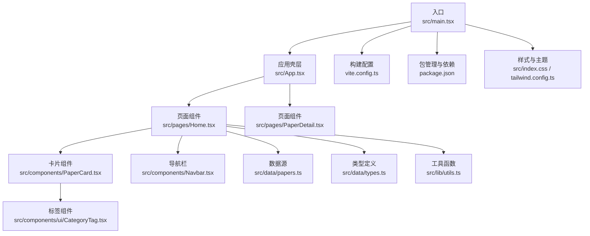
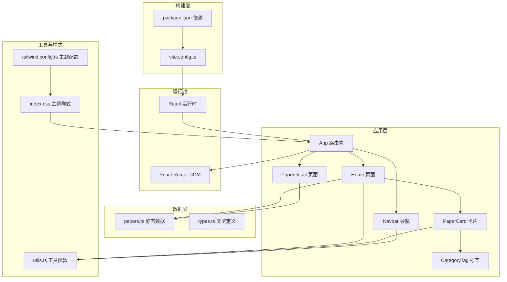
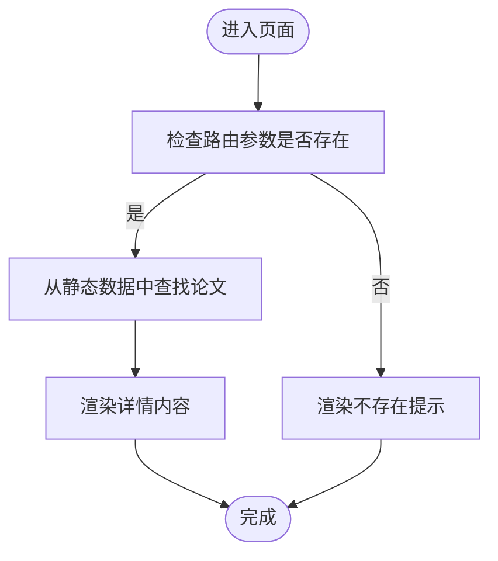
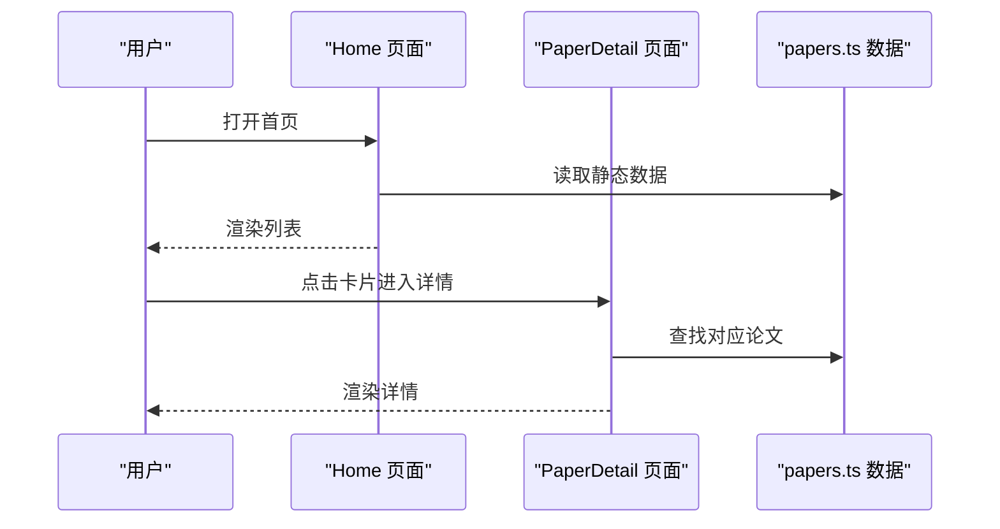
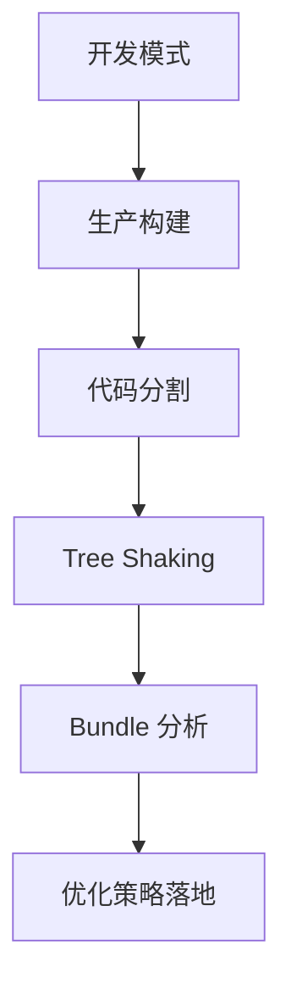
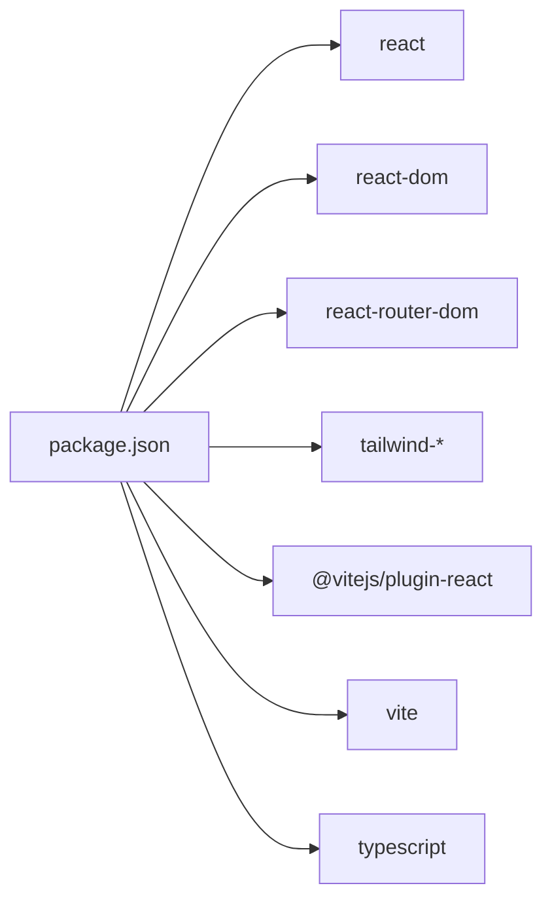

# 性能优化

<cite>
**本文引用的文件**
- [vite.config.ts](file://vite.config.ts)
- [package.json](file://package.json)
- [src/main.tsx](file://src/main.tsx)
- [src/App.tsx](file://src/App.tsx)
- [tailwind.config.ts](file://tailwind.config.ts)
- [src/index.css](file://src/index.css)
- [src/components/Navbar.tsx](file://src/components/Navbar.tsx)
- [src/components/PaperCard.tsx](file://src/components/PaperCard.tsx)
- [src/components/ui/CategoryTag.tsx](file://src/components/ui/CategoryTag.tsx)
- [src/pages/Home.tsx](file://src/pages/Home.tsx)
- [src/pages/PaperDetail.tsx](file://src/pages/PaperDetail.tsx)
- [src/data/papers.ts](file://src/data/papers.ts)
- [src/data/types.ts](file://src/data/types.ts)
- [src/lib/utils.ts](file://src/lib/utils.ts)
</cite>

## 目录
1. [简介](#简介)
2. [项目结构](#项目结构)
3. [核心组件](#核心组件)
4. [架构总览](#架构总览)
5. [详细组件分析](#详细组件分析)
6. [依赖分析](#依赖分析)
7. [性能考量](#性能考量)
8. [故障排查指南](#故障排查指南)
9. [结论](#结论)
10. [附录](#附录)

## 简介
本指南面向 cs336 前端应用，系统性梳理性能优化策略，覆盖组件渲染优化、数据加载优化、内存管理、构建优化、网络优化、用户体验优化以及性能监控与诊断。文档以仓库现有代码为依据，结合 React 与 Vite 生态的最佳实践，给出可落地的优化建议与可视化图示。

## 项目结构
该项目采用 Vite + React + TypeScript + Tailwind CSS 的现代化前端栈，路由基于 React Router DOM。页面组件集中在 pages 目录，通用 UI 组件位于 components 目录，数据模型与静态数据在 data 目录，工具函数与样式在 lib 与 index.css 中。

**图表来源**
- [src/main.tsx:1-14](file://src/main.tsx#L1-L14)
- [src/App.tsx:1-45](file://src/App.tsx#L1-L45)
- [src/pages/Home.tsx:1-209](file://src/pages/Home.tsx#L1-L209)
- [src/pages/PaperDetail.tsx:1-151](file://src/pages/PaperDetail.tsx#L1-L151)
- [src/components/PaperCard.tsx:1-73](file://src/components/PaperCard.tsx#L1-L73)
- [src/components/Navbar.tsx:1-143](file://src/components/Navbar.tsx#L1-L143)
- [src/components/ui/CategoryTag.tsx:1-25](file://src/components/ui/CategoryTag.tsx#L1-L25)
- [src/data/papers.ts:1-815](file://src/data/papers.ts#L1-L815)
- [src/data/types.ts:1-49](file://src/data/types.ts#L1-L49)
- [src/lib/utils.ts:1-58](file://src/lib/utils.ts#L1-L58)
- [vite.config.ts:1-13](file://vite.config.ts#L1-L13)
- [package.json:1-32](file://package.json#L1-L32)
- [src/index.css:1-158](file://src/index.css#L1-L158)
- [tailwind.config.ts:1-104](file://tailwind.config.ts#L1-L104)

**章节来源**
- [src/main.tsx:1-14](file://src/main.tsx#L1-L14)
- [src/App.tsx:1-45](file://src/App.tsx#L1-L45)
- [vite.config.ts:1-13](file://vite.config.ts#L1-L13)
- [package.json:1-32](file://package.json#L1-L32)
- [tailwind.config.ts:1-104](file://tailwind.config.ts#L1-L104)
- [src/index.css:1-158](file://src/index.css#L1-L158)

## 核心组件
- 应用入口与路由：入口在 main.tsx 创建根容器并挂载 App；App 使用 React Router DOM 壳层组织页面路由。
- 页面组件：
  - Home：聚合论文列表，提供分类筛选、来源过滤与排序，渲染 PaperCard 列表。
  - PaperDetail：根据路由参数加载单篇论文详情，展示摘要、核心贡献、架构图与标签。
- 通用组件：
  - PaperCard：展示论文卡片，包含标题、摘要、标签、作者、日期与阅读时长。
  - CategoryTag：按类别生成带颜色与样式的标签。
  - Navbar：主导航、更多下拉菜单、搜索展开区域，含点击外部关闭逻辑。
- 数据与工具：
  - papers.ts：包含大量论文数据，类型由 types.ts 定义。
  - utils.ts：类名合并、类别映射、格式化与图标映射等工具函数。

**章节来源**
- [src/main.tsx:1-14](file://src/main.tsx#L1-L14)
- [src/App.tsx:1-45](file://src/App.tsx#L1-L45)
- [src/pages/Home.tsx:1-209](file://src/pages/Home.tsx#L1-L209)
- [src/pages/PaperDetail.tsx:1-151](file://src/pages/PaperDetail.tsx#L1-L151)
- [src/components/PaperCard.tsx:1-73](file://src/components/PaperCard.tsx#L1-L73)
- [src/components/ui/CategoryTag.tsx:1-25](file://src/components/ui/CategoryTag.tsx#L1-L25)
- [src/components/Navbar.tsx:1-143](file://src/components/Navbar.tsx#L1-L143)
- [src/data/papers.ts:1-815](file://src/data/papers.ts#L1-L815)
- [src/data/types.ts:1-49](file://src/data/types.ts#L1-L49)
- [src/lib/utils.ts:1-58](file://src/lib/utils.ts#L1-L58)

## 架构总览
应用采用“页面组件 + 通用 UI 组件 + 数据与工具”的分层结构，页面组件通过 props 与工具函数组合渲染，数据来自本地静态数组。构建与打包由 Vite 驱动，Tailwind 提供原子化样式与主题变量。

**图表来源**
- [src/main.tsx:1-14](file://src/main.tsx#L1-L14)
- [src/App.tsx:1-45](file://src/App.tsx#L1-L45)
- [src/pages/Home.tsx:1-209](file://src/pages/Home.tsx#L1-L209)
- [src/pages/PaperDetail.tsx:1-151](file://src/pages/PaperDetail.tsx#L1-L151)
- [src/components/Navbar.tsx:1-143](file://src/components/Navbar.tsx#L1-L143)
- [src/components/PaperCard.tsx:1-73](file://src/components/PaperCard.tsx#L1-L73)
- [src/components/ui/CategoryTag.tsx:1-25](file://src/components/ui/CategoryTag.tsx#L1-L25)
- [src/data/papers.ts:1-815](file://src/data/papers.ts#L1-L815)
- [src/data/types.ts:1-49](file://src/data/types.ts#L1-L49)
- [src/lib/utils.ts:1-58](file://src/lib/utils.ts#L1-L58)
- [src/index.css:1-158](file://src/index.css#L1-L158)
- [tailwind.config.ts:1-104](file://tailwind.config.ts#L1-L104)
- [vite.config.ts:1-13](file://vite.config.ts#L1-L13)
- [package.json:1-32](file://package.json#L1-L32)

## 详细组件分析

### 组件渲染优化
- 渲染路径与键值：PaperCard 与 Home 列表均使用唯一 id 作为 key，避免列表重排与不必要的子树更新。
- 条件渲染：PaperDetail 对不存在的论文 ID 返回占位内容；Home 在空结果时显示提示文案，避免渲染空列表造成的误判。
- 状态收敛：Navbar 将下拉开关与点击外部关闭逻辑收敛在组件内部，减少父组件状态压力。
- 样式与动画：PaperCard 使用淡入动画，Navbar 使用过渡与旋转动画，整体视觉反馈良好但注意避免过度动画造成掉帧。

**图表来源**
- [src/pages/PaperDetail.tsx:7-21](file://src/pages/PaperDetail.tsx#L7-L21)

**章节来源**
- [src/pages/Home.tsx:194-205](file://src/pages/Home.tsx#L194-L205)
- [src/pages/PaperDetail.tsx:7-21](file://src/pages/PaperDetail.tsx#L7-L21)
- [src/components/Navbar.tsx:28-37](file://src/components/Navbar.tsx#L28-L37)

### 数据加载优化
- 当前实现：所有论文数据直接导入到内存，首页一次性渲染列表。该方式在数据量较小的情况下具备较低延迟，但随着数据增长，首屏渲染与内存占用会成为瓶颈。
- 建议策略：
  - 分页/虚拟化：对长列表采用虚拟滚动，仅渲染可视区域元素。
  - 懒加载：按需加载详情页数据，避免预取全部数据。
  - 缓存：对已渲染的详情页进行缓存，减少重复请求。
  - 预取：对即将访问的页面进行预取，缩短交互等待。

**图表来源**
- [src/pages/Home.tsx:15-33](file://src/pages/Home.tsx#L15-L33)
- [src/pages/PaperDetail.tsx:7-21](file://src/pages/PaperDetail.tsx#L7-L21)
- [src/data/papers.ts:1-815](file://src/data/papers.ts#L1-L815)

**章节来源**
- [src/pages/Home.tsx:15-33](file://src/pages/Home.tsx#L15-L33)
- [src/data/papers.ts:1-815](file://src/data/papers.ts#L1-L815)

### 内存管理
- 当前实现：静态数据常驻内存，组件卸载时未做特殊清理。
- 建议策略：
  - 避免在组件内创建大对象或闭包缓存；必要时使用 useRef 或自定义 Hook 管理生命周期。
  - 对图片与富文本内容，确保在组件卸载时取消订阅或清理定时器。
  - 使用 React DevTools Profiler 检测长列表与深层嵌套带来的内存压力。

**章节来源**
- [src/components/Navbar.tsx:28-37](file://src/components/Navbar.tsx#L28-L37)

### React 组件性能优化技巧
- memoization：对 PaperCard 与 CategoryTag 等纯展示组件，可考虑使用 memo 包裹 props 比较，减少无关重渲染。
- 懒加载：将大型页面或重型组件按需加载，降低首屏 JS 体积。
- 虚拟化列表：对 Home 的论文列表采用虚拟滚动，仅渲染可见项。
- 合理拆分：将高频交互区域（如搜索、筛选）拆分为独立组件，避免整页重渲染。

**章节来源**
- [src/components/PaperCard.tsx:11-72](file://src/components/PaperCard.tsx#L11-L72)
- [src/components/ui/CategoryTag.tsx:11-24](file://src/components/ui/CategoryTag.tsx#L11-L24)

### 构建优化配置
- 代码分割：Vite 默认启用按需打包，建议结合路由拆分页面，实现按需加载。
- Tree Shaking：确保模块导出为命名导出，避免副作用；使用 ES 模块语法。
- Bundle 分析：使用 rollup-plugin-visualizer 或 vite-bundle-analyzer 生成依赖关系图，识别大体积依赖。
- 插件与别名：vite.config.ts 已配置 react 插件与路径别名，可继续引入压缩与分析插件。

**图表来源**
- [vite.config.ts:1-13](file://vite.config.ts#L1-L13)
- [package.json:1-32](file://package.json#L1-L32)

**章节来源**
- [vite.config.ts:1-13](file://vite.config.ts#L1-L13)
- [package.json:1-32](file://package.json#L1-L32)

### 网络性能优化
- 资源压缩：启用 gzip 或 brotli 压缩；确保静态资源（图片、字体）已压缩。
- CDN 配置：将图片与第三方资源指向 CDN，结合缓存头与版本化路径。
- 缓存策略：合理设置 Cache-Control 与 ETag；对静态资源采用长期缓存。
- 图片优化：使用现代格式（WebP/AVIF）与懒加载；为关键首屏资源添加 loading="eager"。

**章节来源**
- [src/pages/Home.tsx:42-46](file://src/pages/Home.tsx#L42-L46)
- [src/pages/PaperDetail.tsx:112-117](file://src/pages/PaperDetail.tsx#L112-L117)

### 用户体验优化
- 首屏加载时间：减少首屏 JS 体积，延迟加载非关键资源；使用骨架屏或占位符。
- 交互响应速度：避免在渲染阶段进行昂贵计算；使用 requestIdleCallback 或 Web Workers 处理离屏任务。
- 滚动性能：对长列表使用虚拟滚动；避免在滚动事件中进行重计算或 DOM 查询。

**章节来源**
- [src/pages/Home.tsx:194-198](file://src/pages/Home.tsx#L194-L198)
- [src/components/Navbar.tsx:118-139](file://src/components/Navbar.tsx#L118-L139)

## 依赖分析
- 运行时依赖：React、React DOM、React Router DOM、Tailwind 相关工具与图标库。
- 开发依赖：Vite、@vitejs/plugin-react、Tailwind、PostCSS、TypeScript。
- 构建与打包：Vite 负责开发服务器、热更新与生产构建；Tailwind 生成原子化样式。

**图表来源**
- [package.json:11-30](file://package.json#L11-L30)

**章节来源**
- [package.json:1-32](file://package.json#L1-L32)

## 性能考量
- 组件渲染
  - 使用 useMemo/useCallback 缓存计算结果与回调，避免重复渲染。
  - 控制组件层级，减少不必要的包裹与重复渲染。
- 数据加载
  - 首屏只渲染必要数据；后续再加载次要内容。
  - 对高频筛选与排序，使用稳定的时间复杂度算法。
- 内存管理
  - 避免在渲染期间创建临时对象；及时清理事件监听与定时器。
- 构建与网络
  - 通过代码分割与 Tree Shaking 降低包体；启用压缩与缓存。
- 用户体验
  - 骨架屏与占位符提升感知性能；滚动与交互尽量无阻塞。

[本节为通用指导，不直接分析具体文件]

## 故障排查指南
- 性能监控
  - 使用浏览器开发者工具的 Performance 与 Memory 面板记录渲染与内存峰值。
  - 使用 React DevTools Profiler 分析组件渲染次数与耗时。
- 关键指标
  - 首屏时间（FCP/LCP）、交互时间（INP）、内存峰值、JS 包体积。
- 常见问题
  - 列表渲染卡顿：启用虚拟滚动或减少单帧渲染元素数量。
  - 白屏或闪烁：检查条件渲染与懒加载时机。
  - 内存泄漏：确认事件监听与定时器在组件卸载时清理。

**章节来源**
- [src/components/Navbar.tsx:28-37](file://src/components/Navbar.tsx#L28-L37)

## 结论
本指南基于现有代码结构，提出从组件渲染、数据加载、内存管理、构建优化、网络优化到用户体验的全方位性能优化策略。建议优先实施虚拟化列表、按需加载与 Tree Shaking，随后逐步引入缓存与 CDN，最终通过监控体系持续迭代。

[本节为总结，不直接分析具体文件]

## 附录
- 术语
  - 首屏时间：用户看到页面主要内容的时间点。
  - 交互响应时间：从用户操作到界面响应的时间。
  - 虚拟化列表：仅渲染可视区域元素，提升长列表性能。
- 参考实现位置
  - 首屏图片与懒加载：参考 Home 与 PaperDetail 中的图片加载属性。
  - 样式主题与动画：参考 index.css 与 tailwind.config.ts。

**章节来源**
- [src/pages/Home.tsx:42-46](file://src/pages/Home.tsx#L42-L46)
- [src/pages/PaperDetail.tsx:112-117](file://src/pages/PaperDetail.tsx#L112-L117)
- [src/index.css:1-158](file://src/index.css#L1-L158)
- [tailwind.config.ts:1-104](file://tailwind.config.ts#L1-L104)