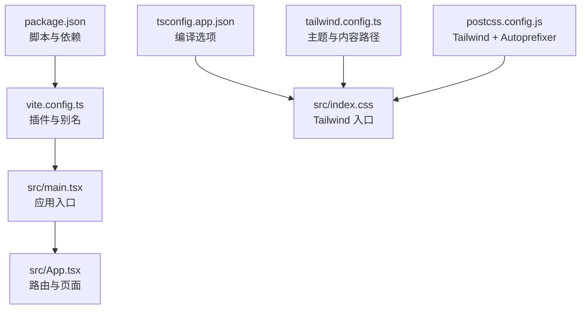
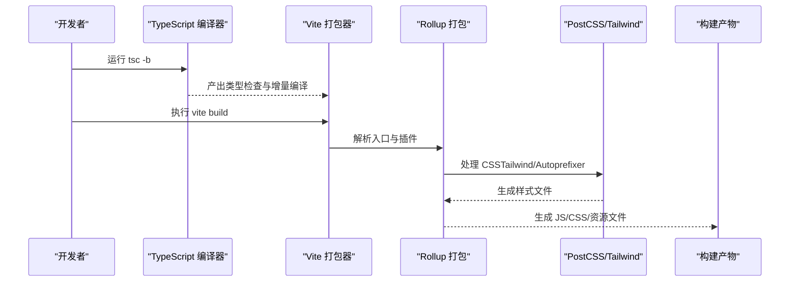
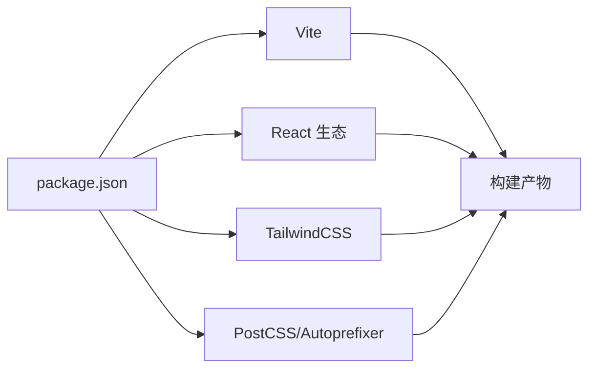

# 构建优化

<cite>
**本文引用的文件**
- [vite.config.ts](file://vite.config.ts)
- [package.json](file://package.json)
- [tsconfig.json](file://tsconfig.json)
- [tsconfig.app.json](file://tsconfig.app.json)
- [tailwind.config.ts](file://tailwind.config.ts)
- [postcss.config.js](file://postcss.config.js)
- [src/index.css](file://src/index.css)
- [src/main.tsx](file://src/main.tsx)
- [src/App.tsx](file://src/App.tsx)
</cite>

## 目录
1. [引言](#引言)
2. [项目结构](#项目结构)
3. [核心组件](#核心组件)
4. [架构总览](#架构总览)
5. [详细组件分析](#详细组件分析)
6. [依赖关系分析](#依赖关系分析)
7. [性能考量](#性能考量)
8. [故障排查指南](#故障排查指南)
9. [结论](#结论)
10. [附录](#附录)

## 引言
本指南面向 cs336 项目的构建优化，聚焦 Vite 构建配置的性能优化策略（代码分割、Tree Shaking、Bundle 分析）、TypeScript 编译优化（moduleResolution、target 设置、增量编译）、静态资源优化（图片、字体、CSS 提取）以及生产环境最佳实践（gzip/Brotli 压缩与缓存策略）。同时提供构建性能监控工具的使用方法与可落地的配置建议，帮助在保证开发体验的同时提升构建效率与运行时性能。

## 项目结构
该项目采用 Vite + React + TypeScript + TailwindCSS 技术栈，核心目录与文件如下：
- 构建与脚本：vite.config.ts、package.json
- 类型与编译：tsconfig.json、tsconfig.app.json
- 样式与工具链：tailwind.config.ts、postcss.config.js、src/index.css
- 应用入口与路由：src/main.tsx、src/App.tsx

图表来源
- [package.json:1-32](file://package.json#L1-L32)
- [vite.config.ts:1-13](file://vite.config.ts#L1-L13)
- [tsconfig.app.json:1-26](file://tsconfig.app.json#L1-L26)
- [tailwind.config.ts:1-104](file://tailwind.config.ts#L1-L104)
- [postcss.config.js:1-7](file://postcss.config.js#L1-L7)
- [src/index.css:1-158](file://src/index.css#L1-L158)
- [src/main.tsx:1-14](file://src/main.tsx#L1-L14)
- [src/App.tsx:1-45](file://src/App.tsx#L1-L45)

章节来源
- [package.json:1-32](file://package.json#L1-L32)
- [vite.config.ts:1-13](file://vite.config.ts#L1-L13)
- [tsconfig.app.json:1-26](file://tsconfig.app.json#L1-L26)
- [tailwind.config.ts:1-104](file://tailwind.config.ts#L1-L104)
- [postcss.config.js:1-7](file://postcss.config.js#L1-L7)
- [src/index.css:1-158](file://src/index.css#L1-L158)
- [src/main.tsx:1-14](file://src/main.tsx#L1-L14)
- [src/App.tsx:1-45](file://src/App.tsx#L1-L45)

## 核心组件
- Vite 配置与插件
  - 使用 React 插件与路径别名，便于模块解析与开发体验。
  - 可扩展 Rollup 输出配置以实现代码分割与产物优化。
- TypeScript 编译配置
  - 目标与模块：ES2020 + ESNext，配合 bundler 模块解析，利于 Tree Shaking。
  - 严格模式与未使用项检查，减少冗余代码。
  - 路径映射与 JSX 配置，统一工程化规范。
- 样式与工具链
  - TailwindCSS 内容扫描路径覆盖 src 与模板，确保按需生成样式。
  - PostCSS 启用 Tailwind 与 Autoprefixer，保障兼容性与体积控制。

章节来源
- [vite.config.ts:1-13](file://vite.config.ts#L1-L13)
- [tsconfig.app.json:1-26](file://tsconfig.app.json#L1-L26)
- [tailwind.config.ts:1-104](file://tailwind.config.ts#L1-L104)
- [postcss.config.js:1-7](file://postcss.config.js#L1-L7)

## 架构总览
下图展示从源码到构建产物的关键流程：TypeScript 编译、Vite 打包、PostCSS/Tailwind 处理与最终产物输出。

图表来源
- [package.json:6-10](file://package.json#L6-L10)
- [tsconfig.app.json:1-26](file://tsconfig.app.json#L1-L26)
- [postcss.config.js:1-7](file://postcss.config.js#L1-L7)
- [tailwind.config.ts:1-104](file://tailwind.config.ts#L1-L104)

## 详细组件分析

### Vite 构建配置与代码分割
- 当前配置要点
  - 已启用 React 插件与路径别名，便于模块解析与开发体验。
  - 未显式配置 Rollup 输出选项，意味着默认行为由 Vite/ Rollup 组合决定。
- 优化建议
  - 通过 Rollup 输出配置进行手动分包（manualChunks），将第三方库与业务代码分离，提升缓存命中率。
  - 针对动态导入的页面路由（如多页面应用）利用动态导入实现按需加载，结合 manualChunks 稳定第三方库分组。
  - 启用构建分析器（参见“性能监控”章节），识别大体积模块与重复依赖，指导分包策略。
- 关键参考位置
  - [vite.config.ts:5-12](file://vite.config.ts#L5-L12)

章节来源
- [vite.config.ts:1-13](file://vite.config.ts#L1-L13)

### TypeScript 编译优化
- 目标与模块
  - target 为 ES2020，module 为 ESNext，有利于现代打包器进行 Tree Shaking。
- 模块解析
  - moduleResolution 设为 bundler，与 Vite/ESBuild 协同更佳，减少非必要模块包裹。
- 增量编译
  - 通过 tsc -b 与 Vite 并行工作，TypeScript 仅做类型检查与增量编译，Vite 负责打包与优化。
- 严格性与副作用
  - 严格模式与未使用项检查有助于消除冗余代码；noUncheckedSideEffectImports 限制副作用导入风险。
- 关键参考位置
  - [tsconfig.app.json:2-23](file://tsconfig.app.json#L2-L23)
  - [package.json:8](file://package.json#L8)

章节来源
- [tsconfig.app.json:1-26](file://tsconfig.app.json#L1-L26)
- [package.json:6-10](file://package.json#L6-L10)

### 静态资源与 CSS 优化
- CSS 按需生成
  - Tailwind 的 content 覆盖模板与 src 下的 TS/TSX 文件，确保仅生成实际使用的样式类。
- PostCSS 链
  - Tailwind 与 Autoprefixer 组合，自动处理浏览器前缀与最小化，降低手写兼容成本。
- 样式入口
  - 通过 src/index.css 引入 Tailwind 指令，集中管理主题变量与动画。
- 图片与字体
  - 建议在构建阶段引入压缩插件（如 LightningCSS 或 Vite 图片/字体优化插件），并结合 CDN 缓存策略。
- 关键参考位置
  - [tailwind.config.ts:5-8](file://tailwind.config.ts#L5-L8)
  - [postcss.config.js:1-7](file://postcss.config.js#L1-L7)
  - [src/index.css:1-3](file://src/index.css#L1-L3)

章节来源
- [tailwind.config.ts:1-104](file://tailwind.config.ts#L1-L104)
- [postcss.config.js:1-7](file://postcss.config.js#L1-L7)
- [src/index.css:1-158](file://src/index.css#L1-L158)

### 生产环境最佳实践
- 压缩策略
  - gzip 与 Brotli 压缩：在服务器或边缘网络开启，优先选择 Brotli（体积更优），回退至 gzip。
  - 静态资源压缩：对 JS/CSS/HTML 启用压缩，图片使用现代格式（WebP/AVIF）并按需加载。
- 缓存策略
  - 长缓存：将第三方库与稳定内容（如 vendor）与业务代码分离，独立命名以长期缓存。
  - 启用 ETag/Last-Modified，避免重复传输。
- 服务端配置
  - 在 Nginx/Apache/Istio 等网关层配置压缩与缓存头，确保跨域与安全头正确。
- 关键参考位置
  - [vite.config.ts:5-12](file://vite.config.ts#L5-L12)

章节来源
- [vite.config.ts:1-13](file://vite.config.ts#L1-L13)

### 构建性能监控与分析
- Vite 内置分析器
  - 通过命令行参数或插件启用分析器，查看模块大小与依赖关系，定位大体积模块与重复依赖。
- webpack-bundle-analyzer（可选）
  - 若需要对比分析，可在构建后使用该工具生成交互式报告。
- 性能测试建议
  - 对比开启/关闭 Tree Shaking、代码分割与压缩前后的产物体积与首屏时间。
  - 使用 Lighthouse/ WebPageTest 等工具评估实际用户体验指标。
- 关键参考位置
  - [package.json:6-10](file://package.json#L6-L10)

章节来源
- [package.json:6-10](file://package.json#L6-L10)

## 依赖关系分析
- 开发脚本与构建流程
  - dev：启动 Vite 开发服务器
  - build：先执行 tsc -b 进行增量编译，再执行 vite build 生成生产包
  - preview：预览生产包
- 依赖与版本
  - React、React DOM、React Router DOM 为核心运行时依赖
  - Vite、@vitejs/plugin-react、TailwindCSS、PostCSS、Autoprefixer 为构建与样式工具链
- 关键参考位置
  - [package.json:6-29](file://package.json#L6-L29)

图表来源
- [package.json:1-32](file://package.json#L1-L32)

章节来源
- [package.json:1-32](file://package.json#L1-L32)

## 性能考量
- 代码分割
  - 将大型第三方库与业务代码分离，结合持久化缓存提升二次加载速度。
  - 动态导入页面路由，实现按需加载，缩短首屏渲染时间。
- Tree Shaking
  - 使用 ES 模块语法与 bundler 模块解析，确保未使用代码被移除。
  - 避免副作用导入与全局副作用，减少打包器误判。
- 增量编译
  - 利用 tsc -b 与 Vite 并行，缩短开发迭代周期。
- 样式体积
  - 通过 Tailwind 的 content 扫描与 PostCSS 最小化，避免无用样式进入产物。
- 资源优化
  - 图片与字体在构建阶段压缩与格式转换，结合 CDN 与缓存策略。
- 关键参考位置
  - [tsconfig.app.json:2-23](file://tsconfig.app.json#L2-L23)
  - [tailwind.config.ts:5-8](file://tailwind.config.ts#L5-L8)
  - [postcss.config.js:1-7](file://postcss.config.js#L1-L7)

章节来源
- [tsconfig.app.json:1-26](file://tsconfig.app.json#L1-L26)
- [tailwind.config.ts:1-104](file://tailwind.config.ts#L1-L104)
- [postcss.config.js:1-7](file://postcss.config.js#L1-L7)

## 故障排查指南
- 构建失败或警告
  - 检查 TypeScript 编译选项是否与打包器兼容（如 moduleResolution、moduleDetection）。
  - 确认路径别名与模块解析规则一致，避免运行时模块解析错误。
- 样式异常
  - 确保 Tailwind content 路径覆盖到所有使用样式的文件。
  - 检查 PostCSS 插件顺序与版本兼容性。
- 产物过大
  - 使用分析器定位大体积模块，调整代码分割策略与依赖剔除。
  - 检查是否存在重复依赖或未使用的第三方库。
- 关键参考位置
  - [tsconfig.app.json:2-23](file://tsconfig.app.json#L2-L23)
  - [tailwind.config.ts:5-8](file://tailwind.config.ts#L5-L8)
  - [postcss.config.js:1-7](file://postcss.config.js#L1-L7)

章节来源
- [tsconfig.app.json:1-26](file://tsconfig.app.json#L1-L26)
- [tailwind.config.ts:1-104](file://tailwind.config.ts#L1-L104)
- [postcss.config.js:1-7](file://postcss.config.js#L1-L7)

## 结论
通过对 Vite 配置、TypeScript 编译与 Tailwind/PostCSS 工具链的系统性优化，结合代码分割、Tree Shaking 与静态资源压缩，可在保证开发体验的同时显著提升构建效率与运行时性能。建议在生产环境中启用 Brotli/gzip 压缩与合理的缓存策略，并持续使用构建分析工具监控体积与加载表现。

## 附录
- 配置示例与路径
  - Vite 配置与别名：[vite.config.ts:5-12](file://vite.config.ts#L5-L12)
  - TypeScript 编译选项：[tsconfig.app.json:2-23](file://tsconfig.app.json#L2-L23)
  - Tailwind 内容扫描：[tailwind.config.ts:5-8](file://tailwind.config.ts#L5-L8)
  - PostCSS 插件链：[postcss.config.js:1-7](file://postcss.config.js#L1-L7)
  - 样式入口与指令：[src/index.css:1-3](file://src/index.css#L1-L3)
  - 应用入口与路由：[src/main.tsx:1-14](file://src/main.tsx#L1-L14)、[src/App.tsx:1-45](file://src/App.tsx#L1-L45)
- 性能测试建议
  - 使用分析器与 Lighthouse 对比优化前后体积与首屏时间。
  - 在不同网络条件下验证缓存与压缩效果。