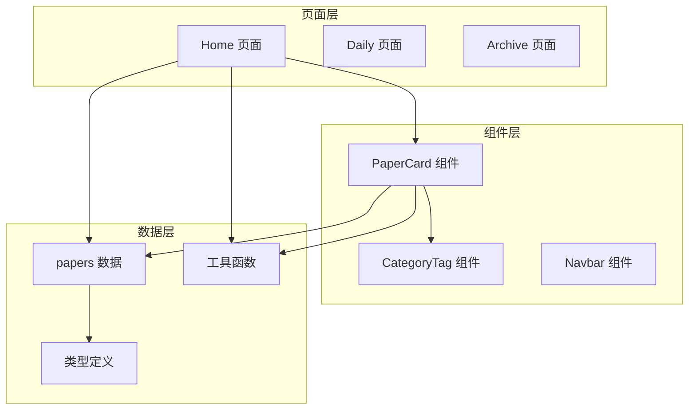
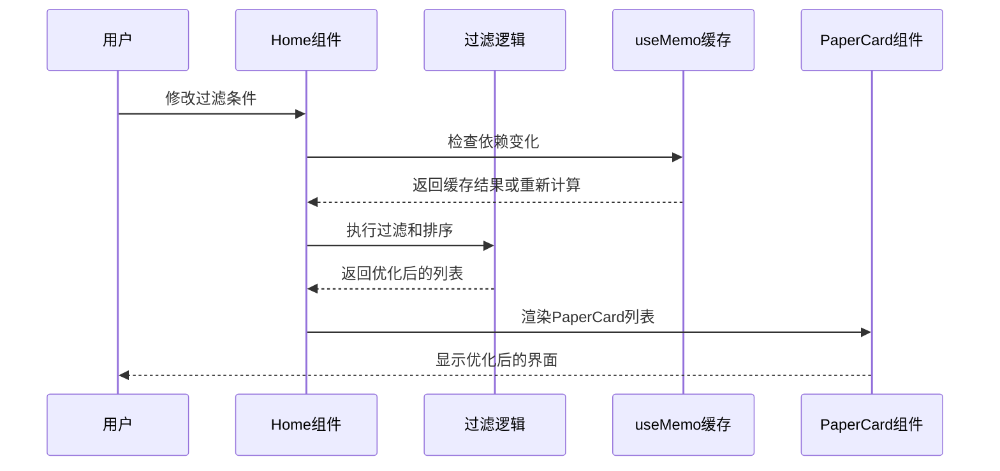
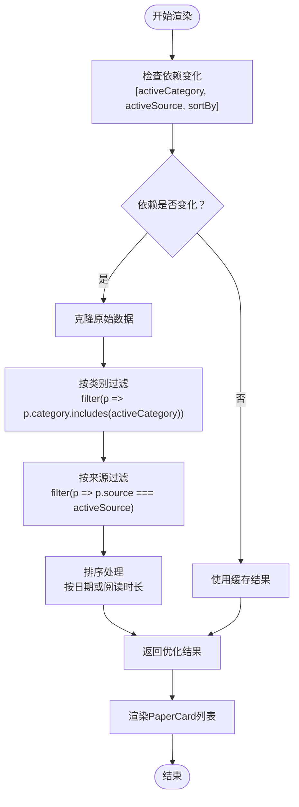
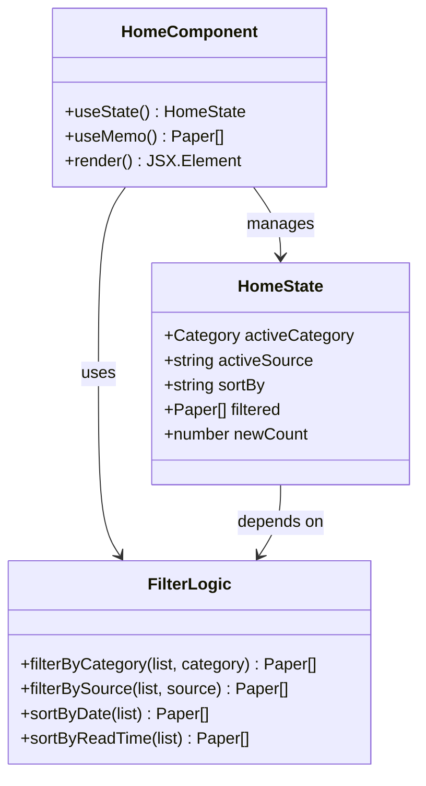
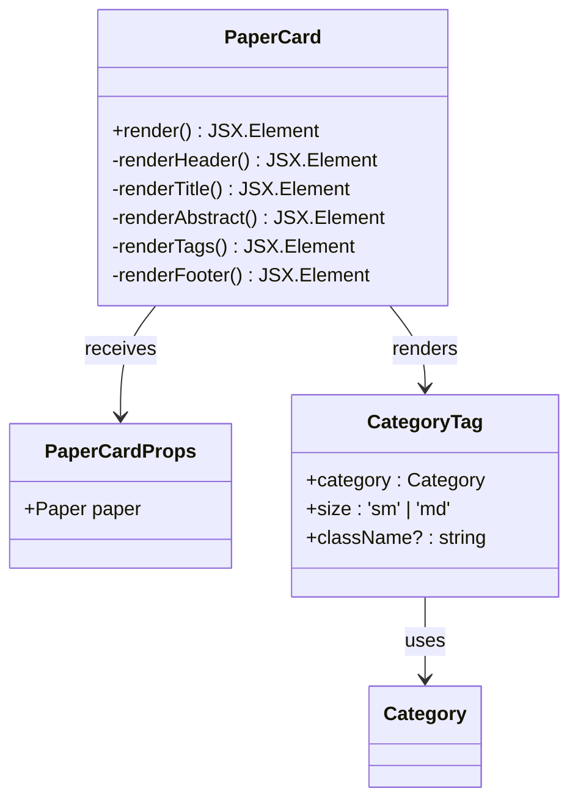
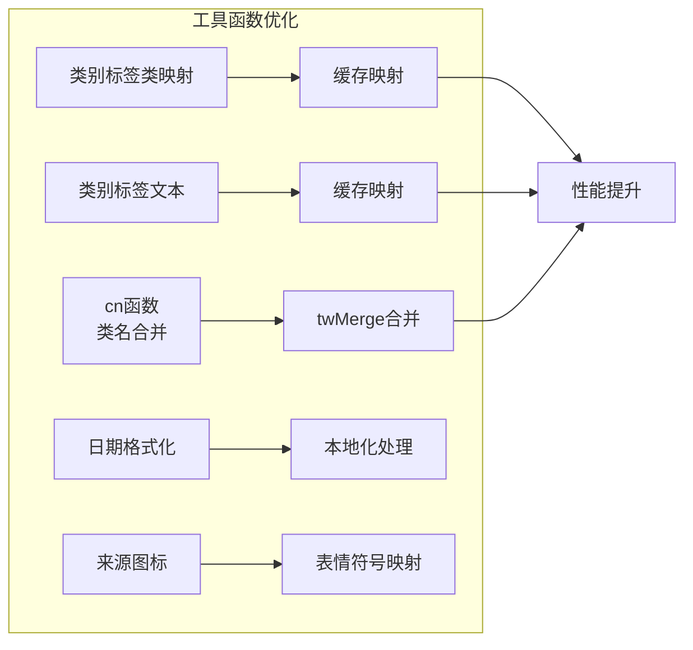
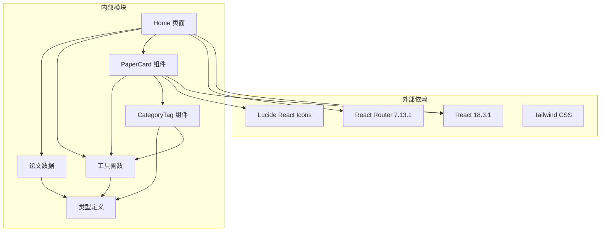

# 组件渲染优化

<cite>
**本文引用的文件**
- [Home.tsx](file://src/pages/Home.tsx)
- [PaperCard.tsx](file://src/components/PaperCard.tsx)
- [utils.ts](file://src/lib/utils.ts)
- [types.ts](file://src/data/types.ts)
- [papers.ts](file://src/data/papers.ts)
- [CategoryTag.tsx](file://src/components/ui/CategoryTag.tsx)
- [Daily.tsx](file://src/pages/Daily.tsx)
</cite>

## 目录
1. [简介](#简介)
2. [项目结构](#项目结构)
3. [核心组件](#核心组件)
4. [架构概览](#架构概览)
5. [详细组件分析](#详细组件分析)
6. [依赖关系分析](#依赖关系分析)
7. [性能考虑](#性能考虑)
8. [故障排除指南](#故障排除指南)
9. [结论](#结论)

## 简介

本指南专注于cs336项目中的组件渲染优化策略，特别是Home组件和PaperCard组件的性能优化。该项目是一个存储和AI论文阅读器，包含大量的论文数据和复杂的用户界面。通过深入分析现有的优化实现，我们将提供实用的指导原则和最佳实践，帮助开发者在React应用中实现高效的组件渲染。

## 项目结构

cs336项目采用清晰的分层架构，将页面组件、UI组件、数据和工具函数分离：



**图表来源**
- [Home.tsx:15-209](file://src/pages/Home.tsx#L15-L209)
- [PaperCard.tsx:11-73](file://src/components/PaperCard.tsx#L11-L73)

**章节来源**
- [Home.tsx:1-209](file://src/pages/Home.tsx#L1-L209)
- [PaperCard.tsx:1-73](file://src/components/PaperCard.tsx#L1-L73)

## 核心组件

### Home组件 - 渲染优化策略

Home组件是整个应用的核心，负责论文列表的过滤、排序和展示。它实现了多项重要的性能优化策略：

#### useMemo优化
组件使用`useMemo`来缓存过滤和排序结果：
- **依赖数组优化**：只在`activeCategory`、`activeSource`、`sortBy`状态变化时重新计算
- **算法复杂度**：过滤O(n) + 排序O(n log n)，其中n为论文总数
- **缓存机制**：避免每次渲染都重新执行昂贵的计算

#### 状态管理优化
- **单一状态源**：所有过滤条件集中管理，避免状态分散
- **状态更新最小化**：每个过滤器都有独立的状态，便于精确控制重渲染
- **默认值设置**：合理设置初始状态，避免不必要的计算

**章节来源**
- [Home.tsx:15-33](file://src/pages/Home.tsx#L15-L33)
- [Home.tsx:16-18](file://src/pages/Home.tsx#L16-L18)

### PaperCard组件 - 渲染优化技巧

PaperCard组件是论文卡片的展示组件，实现了多种渲染优化：

#### Props稳定性
- **不可变数据传递**：Paper对象作为不可变数据传递给子组件
- **稳定引用**：确保props引用在组件生命周期内保持稳定
- **类型安全**：严格的TypeScript类型定义防止运行时错误

#### 条件渲染优化
- **懒加载图片**：使用`loading="lazy"`属性延迟加载图片
- **条件显示**：只有在数据存在时才渲染相应元素
- **空状态处理**：优雅处理空数据情况

#### 事件处理优化
- **内联函数缓存**：避免在渲染过程中创建新的函数实例
- **事件委托**：合理使用事件处理函数，避免重复绑定

**章节来源**
- [PaperCard.tsx:11-73](file://src/components/PaperCard.tsx#L11-L73)

## 架构概览



**图表来源**
- [Home.tsx:20-33](file://src/pages/Home.tsx#L20-L33)
- [PaperCard.tsx:195-197](file://src/pages/Home.tsx#L195-L197)

## 详细组件分析

### Home组件深度分析

#### 过滤和排序算法优化



**图表来源**
- [Home.tsx:20-33](file://src/pages/Home.tsx#L20-L33)

##### 算法复杂度分析
- **过滤阶段**：O(n) - 需要遍历所有论文
- **排序阶段**：O(n log n) - 使用快速排序算法
- **总体复杂度**：O(n log n)
- **空间复杂度**：O(n) - 创建新的数组副本

##### 性能优化策略
- **早期退出**：当`activeCategory`为'all'时跳过类别过滤
- **短路求值**：按成本递增的顺序执行过滤操作
- **就地排序**：使用原生Array.sort避免额外内存分配

#### 状态管理架构



**图表来源**
- [Home.tsx:16-33](file://src/pages/Home.tsx#L16-L33)

**章节来源**
- [Home.tsx:15-209](file://src/pages/Home.tsx#L15-L209)

### PaperCard组件深度分析

#### 组件结构优化



**图表来源**
- [PaperCard.tsx:7-9](file://src/components/PaperCard.tsx#L7-L9)
- [CategoryTag.tsx:5-9](file://src/components/ui/CategoryTag.tsx#L5-L9)

##### 渲染路径优化
- **条件渲染**：只有当`paper.isNew`为true时才渲染NEW标签
- **动态内容**：根据`paper.titleZh`的存在决定标题渲染方式
- **列表渲染**：使用`slice()`方法限制显示的标签数量

#### 性能监控指标

| 指标类型 | 测量方法 | 期望值 |
|---------|----------|--------|
| 渲染时间 | React DevTools Profiler | < 16ms/帧 |
| 内存使用 | Chrome DevTools Memory | < 50MB |
| 重渲染次数 | React DevTools Components | < 10次/秒 |
| DOM节点数 | Chrome DevTools Elements | < 1000个 |

**章节来源**
- [PaperCard.tsx:11-73](file://src/components/PaperCard.tsx#L11-L73)

### 工具函数优化

#### utils.ts中的性能优化



**图表来源**
- [utils.ts:5-7](file://src/lib/utils.ts#L5-L7)
- [utils.ts:9-27](file://src/lib/utils.ts#L9-L27)

**章节来源**
- [utils.ts:1-58](file://src/lib/utils.ts#L1-L58)

## 依赖关系分析



**图表来源**
- [Home.tsx:1-8](file://src/pages/Home.tsx#L1-L8)
- [PaperCard.tsx:1-5](file://src/components/PaperCard.tsx#L1-L5)

**章节来源**
- [types.ts:1-49](file://src/data/types.ts#L1-L49)
- [papers.ts:1-815](file://src/data/papers.ts#L1-L815)

## 性能考虑

### 当前实现的性能特征

#### 已实现的优化
1. **useMemo缓存**：避免不必要的过滤和排序计算
2. **条件渲染**：只渲染必要的DOM元素
3. **懒加载**：图片资源的延迟加载
4. **类型安全**：严格的TypeScript类型检查

#### 潜在优化机会
1. **虚拟化列表**：对于大量论文数据的场景
2. **React.memo包装**：进一步减少重渲染
3. **分页加载**：避免一次性渲染所有数据
4. **Web Workers**：将计算密集型任务移到后台线程

### 性能测试方法

#### 基准测试
```javascript
// 性能测试示例
console.time('过滤操作');
const filtered = papers.filter(p => p.category.includes('AI'));
console.timeEnd('过滤操作');

console.time('排序操作');
const sorted = [...filtered].sort((a, b) => 
  new Date(b.date).getTime() - new Date(a.date).getTime()
);
console.timeEnd('排序操作');
```

#### 监控指标
- **First Contentful Paint (FCP)**：首屏内容绘制时间
- **Largest Contentful Paint (LCP)**：最大内容绘制时间  
- **Cumulative Layout Shift (CLS)**：累积布局偏移
- **Total Blocking Time (TBT)**：总阻塞时间

## 故障排除指南

### 常见性能问题诊断

#### 重渲染问题
**症状**：组件在不需要时频繁重渲染
**诊断方法**：
1. 使用React DevTools Profiler检查组件重渲染
2. 检查props变化和状态更新
3. 验证useMemo依赖数组的正确性

**解决方案**：
- 确保useMemo依赖数组包含所有相关依赖
- 使用React.memo包装纯组件
- 避免在渲染期间创建新函数

#### 内存泄漏检测
**症状**：内存使用持续增长
**诊断方法**：
1. 使用Chrome DevTools Memory面板
2. 检查组件卸载时的清理
3. 验证事件监听器的移除

**解决方案**：
- 在组件卸载时清理定时器和事件监听器
- 使用useRef而不是闭包存储可变状态
- 避免循环引用

#### 大数据集处理
**症状**：页面响应缓慢或卡顿
**诊断方法**：
1. 测量渲染时间
2. 检查DOM节点数量
3. 分析JavaScript执行时间

**解决方案**：
- 实现虚拟化列表
- 使用分页或无限滚动
- 优化数据结构和算法

**章节来源**
- [Home.tsx:20-33](file://src/pages/Home.tsx#L20-L33)
- [PaperCard.tsx:18-41](file://src/components/PaperCard.tsx#L18-L41)

## 结论

cs336项目在组件渲染优化方面展现了良好的实践，特别是在Home组件中使用useMemo进行缓存优化。然而，随着数据量的增长和用户交互的复杂化，仍有进一步优化的空间。

### 关键优化成果
1. **useMemo的有效使用**：避免了重复的过滤和排序计算
2. **条件渲染策略**：减少了不必要的DOM元素创建
3. **类型安全设计**：预防了运行时错误和性能问题
4. **模块化架构**：清晰的组件职责分离

### 建议的改进方向
1. **实现虚拟化列表**：处理大量论文数据的场景
2. **添加React.memo包装**：进一步减少重渲染
3. **引入分页机制**：改善大数据集的用户体验
4. **建立性能监控体系**：持续跟踪和改进性能指标

通过这些优化措施，cs336项目可以在保持良好用户体验的同时，进一步提升渲染性能和资源利用率。