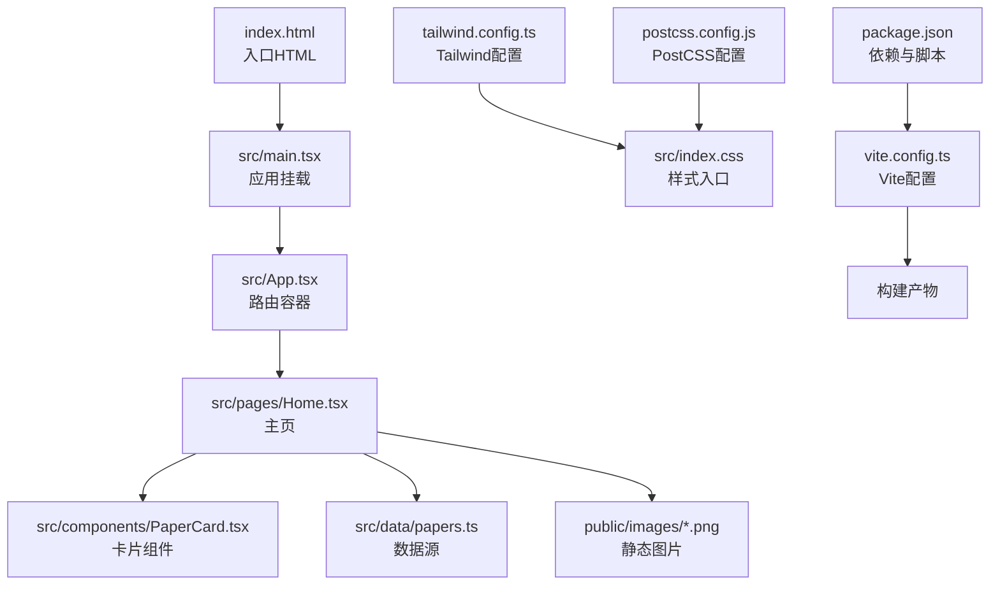
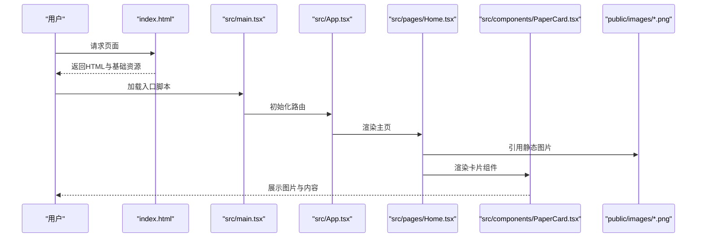
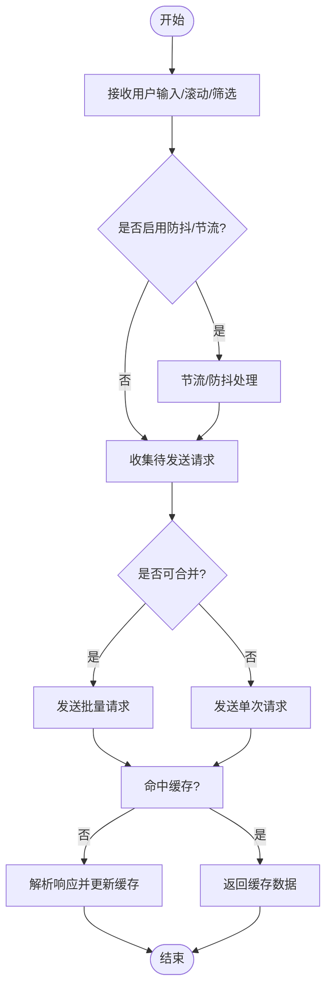
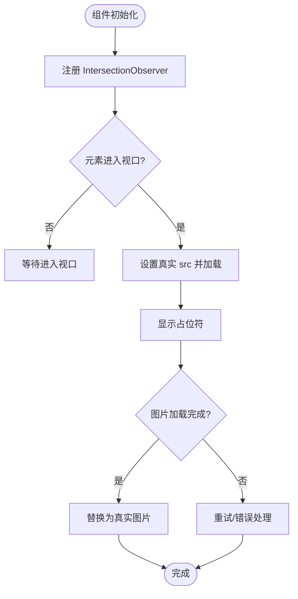
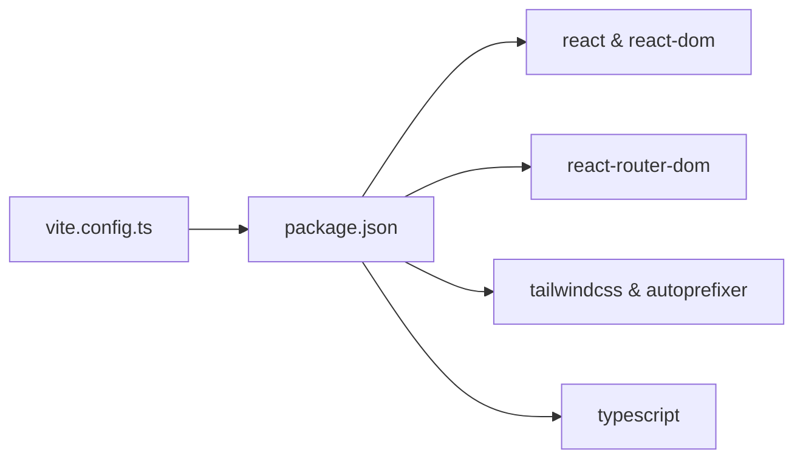

# 网络性能优化

<cite>
**本文引用的文件**
- [package.json](file://package.json)
- [vite.config.ts](file://vite.config.ts)
- [index.html](file://index.html)
- [src/main.tsx](file://src/main.tsx)
- [src/App.tsx](file://src/App.tsx)
- [src/pages/Home.tsx](file://src/pages/Home.tsx)
- [src/components/PaperCard.tsx](file://src/components/PaperCard.tsx)
- [src/lib/utils.ts](file://src/lib/utils.ts)
- [tailwind.config.ts](file://tailwind.config.ts)
- [postcss.config.js](file://postcss.config.js)
- [src/data/papers.ts](file://src/data/papers.ts)
- [scripts/fetch-weread.ts](file://scripts/fetch-weread.ts)
</cite>

## 目录
1. [简介](#简介)
2. [项目结构](#项目结构)
3. [核心组件](#核心组件)
4. [架构总览](#架构总览)
5. [详细组件分析](#详细组件分析)
6. [依赖分析](#依赖分析)
7. [性能考量](#性能考量)
8. [故障排查指南](#故障排查指南)
9. [结论](#结论)
10. [附录](#附录)

## 简介
本指南面向 cs336 项目，围绕前端网络性能优化展开，覆盖静态资源优化（图片压缩、CDN、缓存头）、API 请求优化（合并、防抖/节流）、图片懒加载（Intersection Observer 与占位符）、CSS/JS 加载优化（关键 CSS 与异步加载），并提供 Lighthouse、WebPageTest、浏览器开发者工具等监控手段与可落地的配置示例与性能提升参考。

## 项目结构
该项目采用 Vite + React + TailwindCSS 技术栈，构建产物由 Vite 管理，页面通过 React Router 渲染，样式通过 TailwindCSS 生成并按需裁剪。静态图片位于 public/images，部分页面使用了图片资源，首页包含多处图片渲染与交互。

图表来源
- [index.html:1-17](file://index.html#L1-L17)
- [src/main.tsx:1-14](file://src/main.tsx#L1-L14)
- [src/App.tsx:1-45](file://src/App.tsx#L1-L45)
- [src/pages/Home.tsx:1-209](file://src/pages/Home.tsx#L1-L209)
- [src/components/PaperCard.tsx:1-73](file://src/components/PaperCard.tsx#L1-L73)
- [src/data/papers.ts:1-815](file://src/data/papers.ts#L1-L815)
- [tailwind.config.ts:1-104](file://tailwind.config.ts#L1-L104)
- [postcss.config.js:1-7](file://postcss.config.js#L1-L7)
- [vite.config.ts:1-13](file://vite.config.ts#L1-L13)
- [package.json:1-32](file://package.json#L1-L32)

章节来源
- [index.html:1-17](file://index.html#L1-L17)
- [src/main.tsx:1-14](file://src/main.tsx#L1-L14)
- [src/App.tsx:1-45](file://src/App.tsx#L1-L45)
- [vite.config.ts:1-13](file://vite.config.ts#L1-L13)
- [package.json:1-32](file://package.json#L1-L32)

## 核心组件
- 入口与路由
  - index.html：设置视口、描述、字体预连接与图标链接，引入应用入口脚本。
  - src/main.tsx：创建根节点并挂载 BrowserRouter 与 App。
  - src/App.tsx：集中声明路由与页面组件。
- 页面与组件
  - src/pages/Home.tsx：主页包含多张图片、筛选与排序逻辑，是图片与网络优化的重点页面。
  - src/components/PaperCard.tsx：卡片组件，复用图片与标签渲染。
- 样式与构建
  - tailwind.config.ts：定义字体、动画、颜色与阴影等主题变量。
  - postcss.config.js：启用 Tailwind 与 Autoprefixer。
  - vite.config.ts：配置 React 插件与路径别名。
  - package.json：定义开发与构建脚本。
- 数据与脚本
  - src/data/papers.ts：包含大量文章数据，含图片字段与封面图 URL。
  - scripts/fetch-weread.ts：抓取微信读书文章的脚本，演示 API 请求模式。

章节来源
- [index.html:1-17](file://index.html#L1-L17)
- [src/main.tsx:1-14](file://src/main.tsx#L1-L14)
- [src/App.tsx:1-45](file://src/App.tsx#L1-L45)
- [src/pages/Home.tsx:1-209](file://src/pages/Home.tsx#L1-L209)
- [src/components/PaperCard.tsx:1-73](file://src/components/PaperCard.tsx#L1-L73)
- [tailwind.config.ts:1-104](file://tailwind.config.ts#L1-L104)
- [postcss.config.js:1-7](file://postcss.config.js#L1-L7)
- [vite.config.ts:1-13](file://vite.config.ts#L1-L13)
- [package.json:1-32](file://package.json#L1-L32)
- [src/data/papers.ts:1-815](file://src/data/papers.ts#L1-L815)
- [scripts/fetch-weread.ts:1-206](file://scripts/fetch-weread.ts#L1-L206)

## 架构总览
以下序列图展示从用户访问到页面渲染的关键网络与渲染路径，突出静态资源加载、路由切换与图片渲染的性能关注点。

图表来源
- [index.html:1-17](file://index.html#L1-L17)
- [src/main.tsx:1-14](file://src/main.tsx#L1-L14)
- [src/App.tsx:1-45](file://src/App.tsx#L1-L45)
- [src/pages/Home.tsx:1-209](file://src/pages/Home.tsx#L1-L209)
- [src/components/PaperCard.tsx:1-73](file://src/components/PaperCard.tsx#L1-L73)

## 详细组件分析

### 静态资源网络优化（图片压缩、CDN、缓存头）
- 现状与问题
  - 首页与卡片组件中存在多处图片引用，部分图片尺寸较大，可能影响首屏加载与带宽占用。
  - 当前未见 CDN 配置与明确的缓存头策略。
- 优化策略
  - 图片压缩与格式选择
    - 使用现代格式（如 WebP 或 AVIF）并提供降级方案（JPEG/PNG）。
    - 对首屏关键图片采用更高分辨率，对非关键图片采用较低分辨率或懒加载。
  - CDN 与缓存头
    - 将静态图片托管至 CDN，启用长期缓存（如一年），并为资源路径加入内容指纹（content-hash）以实现不可变缓存。
    - 设置合理的缓存头（Cache-Control: public, max-age=31536000, immutable）。
  - 响应式图片
    - 使用 srcset 与 sizes，按设备像素比与视口宽度提供合适尺寸的图片。
  - 占位符与骨架屏
    - 为图片设置占位符（低质量占位图或纯色背景），改善感知性能。
- 实施建议（配置示例）
  - Vite 插件：使用构建期图片优化插件（如引入图片压缩与格式转换），并在生产构建中输出带内容指纹的文件名。
  - 服务器/CDN：为 /images/* 设置长期缓存与 ETag/Last-Modified，启用 Gzip/Brotli 压缩。
  - HTML：为关键图片添加 loading="eager"，其余图片使用 loading="lazy"。

章节来源
- [src/pages/Home.tsx:40-144](file://src/pages/Home.tsx#L40-L144)
- [src/components/PaperCard.tsx:11-72](file://src/components/PaperCard.tsx#L11-L72)
- [src/data/papers.ts:1-815](file://src/data/papers.ts#L1-L815)

### API 请求性能优化（合并、防抖、节流）
- 现状与问题
  - 项目中存在抓取微信读书文章的脚本，演示了多次 GET 请求与 JSON 解析。
  - 页面侧未见对 API 请求的合并、防抖/节流策略。
- 优化策略
  - 请求合并
    - 将多个相似请求合并为单次批量请求，减少握手与往返次数。
  - 防抖/节流
    - 对高频输入（如搜索、筛选）使用防抖（debounce）减少无效请求。
    - 对滚动、窗口大小变化等事件使用节流（throttle）控制请求频率。
  - 缓存与条件请求
    - 利用 ETag/If-None-Match 或 Last-Modified/If-Modified-Since 实现 304 响应。
    - 对静态数据建立内存缓存与失效策略。
- 实施建议（代码级流程）

图表来源
- [scripts/fetch-weread.ts:133-204](file://scripts/fetch-weread.ts#L133-L204)

章节来源
- [scripts/fetch-weread.ts:1-206](file://scripts/fetch-weread.ts#L1-L206)

### 图片懒加载（Intersection Observer 与占位符）
- 现状与问题
  - 首页与卡片组件中存在多张图片，但未使用懒加载与占位符。
- 优化策略
  - Intersection Observer
    - 为不在首屏的图片注册 IntersectionObserver，进入视口后再加载真实图片。
  - 占位符与骨架
    - 使用低质量占位图（LQIP）或纯色背景，图片加载完成后渐隐替换。
  - 预加载与预连接
    - 对即将进入视口的图片使用 <link rel="prefetch/preconnect"> 提前建立连接。
- 实施建议（组件级流程）

图表来源
- [src/pages/Home.tsx:40-144](file://src/pages/Home.tsx#L40-L144)
- [src/components/PaperCard.tsx:11-72](file://src/components/PaperCard.tsx#L11-L72)

章节来源
- [src/pages/Home.tsx:1-209](file://src/pages/Home.tsx#L1-L209)
- [src/components/PaperCard.tsx:1-73](file://src/components/PaperCard.tsx#L1-L73)

### CSS 与 JavaScript 加载优化（关键 CSS 与异步加载）
- 现状与问题
  - 样式通过 TailwindCSS 生成，按需构建；脚本为单入口。
- 优化策略
  - 关键 CSS 提取
    - 将首屏渲染必需的 CSS 提取为内联样式，减少阻塞。
  - 非关键 CSS 延迟加载
    - 将非首屏样式延迟加载，或拆分为独立 CSS 文件并按需加载。
  - JavaScript 异步加载
    - 将非关键 JS 设置为 async/defer，或将路由组件拆分为动态导入（React.lazy + Suspense）。
  - 构建优化
    - 启用代码分割与最小化，确保产物体积最小化。
- 实施建议（配置示例）
  - Vite：使用动态导入拆分路由组件，减少首屏 JS 体积。
  - Tailwind：保持按需扫描范围合理，避免引入未使用的类名。

章节来源
- [tailwind.config.ts:1-104](file://tailwind.config.ts#L1-L104)
- [postcss.config.js:1-7](file://postcss.config.js#L1-L7)
- [vite.config.ts:1-13](file://vite.config.ts#L1-L13)
- [src/App.tsx:1-45](file://src/App.tsx#L1-L45)

### 网络性能监控与工具使用
- Lighthouse
  - 在本地或 CI 中运行 Lighthouse，重点关注 Largest Contentful Paint、Cumulative Layout Shift、Total Blocking Time 等指标。
- WebPageTest
  - 使用多地点、多网络条件测试，观察瀑布图与关键渲染路径。
- 浏览器开发者工具
  - Network 面板：查看请求耗时、缓存命中、MIME 类型与编码。
  - Performance 面板：识别主线程阻塞与长任务。
  - Coverage 面板：发现未使用的 CSS/JS，指导按需加载与清理。

章节来源
- [index.html:1-17](file://index.html#L1-L17)

## 依赖分析
- 构建与打包
  - Vite 负责开发服务器与生产构建，React 插件提供 JSX 支持，路径别名简化导入。
- 样式管线
  - TailwindCSS 与 Autoprefixer 组合，按需生成样式，减少体积。
- 运行时
  - React 与 React Router DOM 提供路由与组件渲染。

图表来源
- [vite.config.ts:1-13](file://vite.config.ts#L1-L13)
- [package.json:1-32](file://package.json#L1-L32)

章节来源
- [vite.config.ts:1-13](file://vite.config.ts#L1-L13)
- [package.json:1-32](file://package.json#L1-L32)

## 性能考量
- 首屏性能
  - 关键资源内联与最小化，非关键资源延迟加载。
  - 图片懒加载与占位符，减少 CLS 与感知延迟。
- 网络往返
  - 合并请求、启用缓存与条件请求，减少不必要的重复下载。
- 渲染性能
  - 动态导入与代码分割，避免一次性加载过多 JS。
  - 合理使用 CSS 动画与过渡，避免布局抖动。

## 故障排查指南
- 常见问题
  - 图片加载慢：检查是否使用懒加载、占位符与合适的图片格式。
  - 首屏阻塞：确认关键 CSS 是否内联，非关键 CSS 是否延迟加载。
  - 请求过多：检查是否存在未合并的请求或未启用防抖/节流。
- 排查步骤
  - 使用浏览器 Network 面板分析请求与缓存命中。
  - 使用 Performance 面板定位长任务与主线程阻塞。
  - 使用 Lighthouse 生成报告，逐项优化。

章节来源
- [src/pages/Home.tsx:1-209](file://src/pages/Home.tsx#L1-L209)
- [src/components/PaperCard.tsx:1-73](file://src/components/PaperCard.tsx#L1-L73)
- [scripts/fetch-weread.ts:1-206](file://scripts/fetch-weread.ts#L1-L206)

## 结论
通过对 cs336 项目的网络性能优化，可在不改变业务逻辑的前提下显著提升首屏速度与交互流畅度。建议优先实施图片懒加载与占位符、关键 CSS 内联、非关键资源延迟加载与请求合并/防抖/节流策略，并结合 Lighthouse、WebPageTest 与浏览器开发者工具持续监控与迭代。

## 附录
- 可落地的配置示例（路径指引）
  - Vite 动态导入与代码分割：[src/App.tsx:19-42](file://src/App.tsx#L19-L42)
  - Tailwind 按需构建与主题扩展：[tailwind.config.ts:1-104](file://tailwind.config.ts#L1-L104)
  - PostCSS 自动前缀与 Tailwind 集成：[postcss.config.js:1-7](file://postcss.config.js#L1-L7)
  - 入口 HTML 与字体预连接：[index.html:1-17](file://index.html#L1-L17)
  - 图片懒加载与占位符（组件级实现）：[src/pages/Home.tsx:40-144](file://src/pages/Home.tsx#L40-L144)、[src/components/PaperCard.tsx:11-72](file://src/components/PaperCard.tsx#L11-L72)
  - API 请求合并与防抖/节流（脚本级示例）：[scripts/fetch-weread.ts:133-204](file://scripts/fetch-weread.ts#L133-L204)