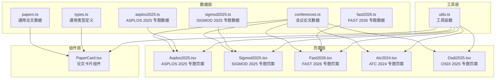
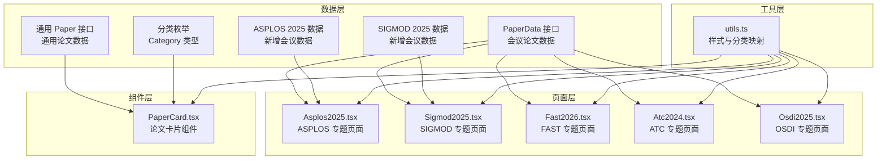
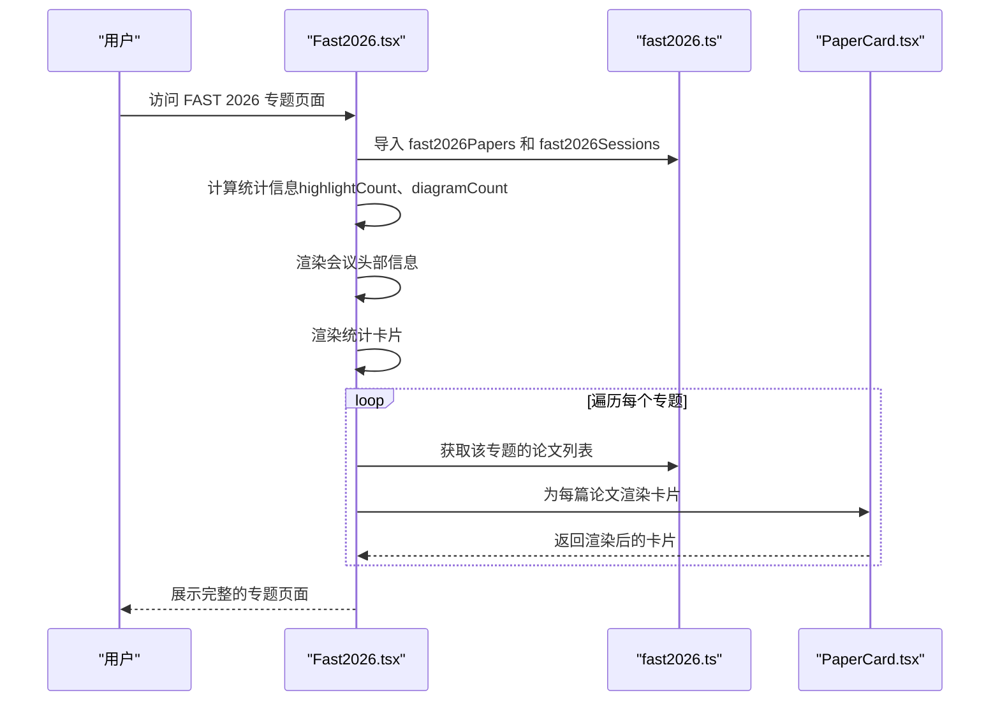
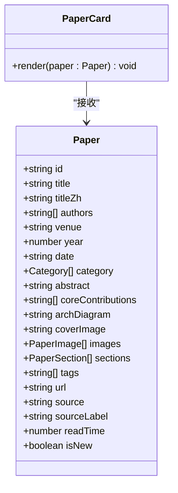
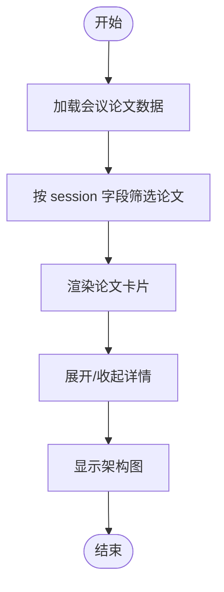
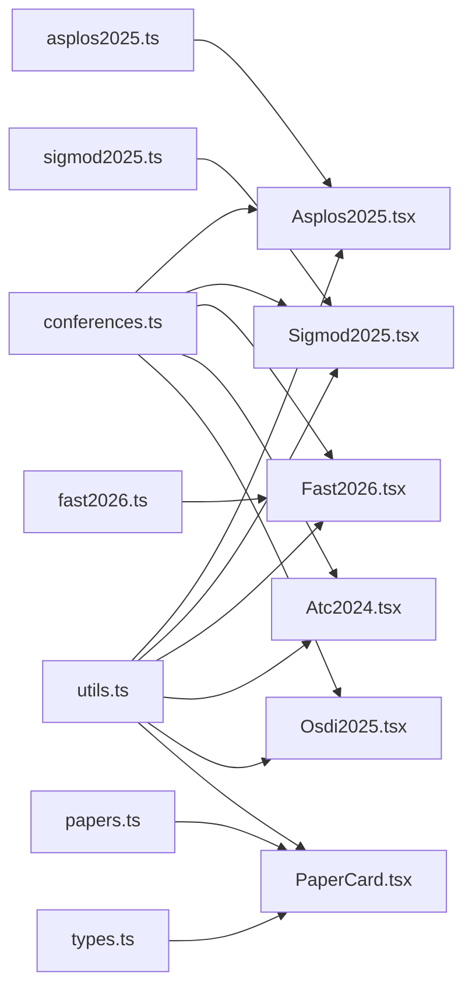

# 会议数据模型

<cite>
**本文引用的文件**
- [conferences.ts](file://src/data/conferences.ts)
- [types.ts](file://src/data/types.ts)
- [papers.ts](file://src/data/papers.ts)
- [asplos2025.ts](file://src/data/asplos2025.ts)
- [sigmod2025.ts](file://src/data/sigmod2025.ts)
- [fast2026.ts](file://src/data/fast2026.ts)
- [Asplos2025.tsx](file://src/pages/Asplos2025.tsx)
- [Sigmod2025.tsx](file://src/pages/Sigmod2025.tsx)
- [Fast2026.tsx](file://src/pages/Fast2026.tsx)
- [Atc2024.tsx](file://src/pages/Atc2024.tsx)
- [Osdi2025.tsx](file://src/pages/Osdi2025.tsx)
- [PaperCard.tsx](file://src/components/PaperCard.tsx)
- [utils.ts](file://src/lib/utils.ts)
</cite>

## 更新摘要
**变更内容**
- 修正 TrafficOpt 项目架构图引用错误，将 jiagu-arch.png 更新为 trafficopt-arch.png
- 修复 ATC 2024 和 OSDI 2025 论文中错误的架构图文件引用
- 确保所有会议论文数据的架构图字段正确指向对应的图片资源
- 保持新增 ASPLOS 2025 和 SIGMOD 2025 会议数据的完整性和一致性

## 目录
1. [简介](#简介)
2. [项目结构](#项目结构)
3. [核心组件](#核心组件)
4. [架构概览](#架构概览)
5. [详细组件分析](#详细组件分析)
6. [依赖分析](#依赖分析)
7. [性能考虑](#性能考虑)
8. [故障排除指南](#故障排除指南)
9. [结论](#结论)

## 简介

本文件详细阐述了该存储技术博客项目的会议数据模型设计与实现。项目围绕存储系统顶级会议（FAST、OSDI、ATC、ASPLOS、SIGMOD）的论文数据组织，建立了统一的数据结构和展示体系。本文重点解释以下方面：
- Conference 接口的设计与字段定义
- 会议基本信息、时间安排、地点信息和论文集合的组织方式
- 会议专题页面的数据结构与展示逻辑
- 会议数据与论文数据的关联关系及按会议筛选论文的方法
- 会议数据的维护与更新机制
- 多会议数据的合并与去重策略

**更新** 本次更新修正了 TrafficOpt 项目架构图引用错误，确保架构图正确显示。同时修复了 ATC 2024 和 OSDI 2025 论文中错误的架构图文件引用，保证了所有会议论文数据的架构图字段正确指向对应的图片资源。

## 项目结构

该项目采用按功能模块划分的组织方式，核心数据与页面组件分离，便于维护和扩展。关键目录与文件如下：
- 数据层：位于 `src/data/`，包含会议论文数据、通用论文类型定义等
- 页面层：位于 `src/pages/`，包含各会议专题页面的 React 组件
- 组件层：位于 `src/components/`，包含通用卡片组件等
- 工具层：位于 `src/lib/`，包含样式与分类映射等工具函数

**图表来源**
- [conferences.ts:1-279](file://src/data/conferences.ts#L1-L279)
- [asplos2025.ts:1-147](file://src/data/asplos2025.ts#L1-L147)
- [sigmod2025.ts:1-159](file://src/data/sigmod2025.ts#L1-L159)
- [fast2026.ts:1-405](file://src/data/fast2026.ts#L1-L405)
- [papers.ts:1-847](file://src/data/papers.ts#L1-L847)
- [types.ts:1-49](file://src/data/types.ts#L1-L49)
- [Asplos2025.tsx:1-237](file://src/pages/Asplos2025.tsx#L1-L237)
- [Sigmod2025.tsx:1-237](file://src/pages/Sigmod2025.tsx#L1-L237)
- [Fast2026.tsx:1-236](file://src/pages/Fast2026.tsx#L1-L236)
- [Atc2024.tsx:1-148](file://src/pages/Atc2024.tsx#L1-L148)
- [Osdi2025.tsx:1-148](file://src/pages/Osdi2025.tsx#L1-L148)
- [PaperCard.tsx:1-73](file://src/components/PaperCard.tsx#L1-L73)
- [utils.ts:1-58](file://src/lib/utils.ts#L1-L58)

**章节来源**
- [conferences.ts:1-279](file://src/data/conferences.ts#L1-L279)
- [asplos2025.ts:1-147](file://src/data/asplos2025.ts#L1-L147)
- [sigmod2025.ts:1-159](file://src/data/sigmod2025.ts#L1-L159)
- [fast2026.ts:1-405](file://src/data/fast2026.ts#L1-L405)
- [papers.ts:1-847](file://src/data/papers.ts#L1-L847)
- [types.ts:1-49](file://src/data/types.ts#L1-L49)

## 核心组件

### 会议论文数据接口（PaperData）

会议专题页面使用的论文数据结构定义如下：
- 字段定义
  - id: string - 论文唯一标识符
  - title: string - 论文标题
  - authors: string[] - 作者列表
  - session: string - 所属专题（Track）
  - highlight?: boolean - 是否为重点解读
  - summary: string - 论文摘要
  - keywords: string[] - 关键词标签
  - archDiagram?: string - 系统架构图链接
  - contributions: string[] - 核心贡献列表
  - pros: string[] - 优点列表
  - cons: string[] - 局限性列表

该接口用于 FAST、OSDI、ATC、ASPLOS、SIGMOD 等会议的论文数据展示，确保专题页面能够统一渲染论文卡片、展开详情、显示架构图等。

**更新** 新增的 ASPLOS 2025 和 SIGMOD 2025 会议数据完全遵循此统一接口规范，包含完整的架构图引用和详细的技术贡献分析。所有会议论文数据的架构图字段现已正确指向对应的图片资源。

**章节来源**
- [conferences.ts:1-13](file://src/data/conferences.ts#L1-L13)
- [asplos2025.ts:1-13](file://src/data/asplos2025.ts#L1-L13)
- [sigmod2025.ts:1-13](file://src/data/sigmod2025.ts#L1-L13)
- [fast2026.ts:6-24](file://src/data/fast2026.ts#L6-L24)

### 通用论文数据接口（Paper）

项目还定义了更丰富的通用论文数据结构，用于首页、归档页等场景：
- 字段定义
  - id: string - 论文唯一标识符
  - title: string - 英文标题
  - titleZh?: string - 中文标题（可选）
  - authors: string[] - 作者列表
  - venue: string - 会议或期刊名称
  - year: number - 发表年份
  - date: string - 发表日期
  - category: Category[] - 分类标签数组
  - abstract: string - 摘要
  - coreContributions: string[] - 核心贡献列表
  - archDiagram?: string - 系统架构图链接
  - coverImage?: string - 封面图片链接
  - images?: PaperImage[] - 图片集合
  - sections?: PaperSection[] - 文章章节
  - tags: string[] - 标签数组
  - url: string - 论文链接
  - source: 'dblp' | 'arxiv' | 'wechat' - 数据来源
  - sourceLabel: string - 来源标签
  - readTime: number - 阅读时长（分钟）
  - isNew?: boolean - 是否为新文章

该接口支持多来源（DBLP、arXiv、微信公众号）论文数据的统一管理，并提供丰富的展示字段。

**章节来源**
- [types.ts:13-34](file://src/data/types.ts#L13-L34)

### 会议专题页面数据结构

会议专题页面通过以下方式组织数据：
- 会议论文数组：每个会议包含若干 PaperData 论文条目
- 会议专题数组：通过去重生成的专题列表
- 页面组件：渲染会议基本信息、统计卡片、按专题分组的论文列表

示例：FAST 2026 页面使用 fast2026Papers 和 fast2026Sessions，OSDI 2025 使用 osdi2025Papers 和 osdi2025Sessions，ATC 2024 使用 atc2024Papers 和 atc2024Sessions，ASPLOS 2025 使用 asplos2025Papers 和 asplos2025Sessions，SIGMOD 2025 使用 sigmod2025Papers 和 sigmod2025Sessions。

**更新** 新增的 ASPLOS 2025 和 SIGMOD 2025 页面实现了与现有页面相同的架构图条件渲染和展示逻辑，增强了论文的可视化展示效果。所有会议论文数据的架构图引用现已修正，确保正确的图片资源加载。

**章节来源**
- [asplos2025.ts:15-147](file://src/data/asplos2025.ts#L15-L147)
- [sigmod2025.ts:15-159](file://src/data/sigmod2025.ts#L15-L159)
- [conferences.ts:15-279](file://src/data/conferences.ts#L15-L279)

## 架构概览

项目采用"数据-页面-组件-工具"的分层架构，数据层提供统一的会议论文数据结构，页面层负责专题展示，组件层提供可复用的 UI 组件，工具层提供样式与分类映射等辅助功能。

**图表来源**
- [conferences.ts:1-279](file://src/data/conferences.ts#L1-L279)
- [asplos2025.ts:1-147](file://src/data/asplos2025.ts#L1-L147)
- [sigmod2025.ts:1-159](file://src/data/sigmod2025.ts#L1-L159)
- [fast2026.ts:1-405](file://src/data/fast2026.ts#L1-L405)
- [papers.ts:1-847](file://src/data/papers.ts#L1-L847)
- [types.ts:1-49](file://src/data/types.ts#L1-L49)
- [Asplos2025.tsx:1-237](file://src/pages/Asplos2025.tsx#L1-L237)
- [Sigmod2025.tsx:1-237](file://src/pages/Sigmod2025.tsx#L1-L237)
- [Fast2026.tsx:1-236](file://src/pages/Fast2026.tsx#L1-L236)
- [Atc2024.tsx:1-148](file://src/pages/Atc2024.tsx#L1-L148)
- [Osdi2025.tsx:1-148](file://src/pages/Osdi2025.tsx#L1-L148)
- [PaperCard.tsx:1-73](file://src/components/PaperCard.tsx#L1-L73)
- [utils.ts:1-58](file://src/lib/utils.ts#L1-L58)

## 详细组件分析

### 会议专题页面组件分析

#### Asplos2025.tsx 页面组件

该组件负责渲染 ASPLOS 2025 会议的专题页面，包含以下关键逻辑：
- 会议基本信息展示：时间、地点、论文数量、重点解读数量、含架构图数量
- 统计卡片：按专题统计论文数量
- 论文按专题分组展示：通过 session 字段过滤和渲染
- 论文卡片组件：PaperCard，支持展开/收起详情、显示关键词、架构图等

**更新** 新增了 ASPLOS 2025 会议数据，包含 12 篇论文，涵盖架构与系统、机器学习系统、存储与内存、安全与可靠性四个专题领域。所有论文的架构图引用均正确指向对应的图片资源。

**图表来源**
- [Asplos2025.tsx:144-237](file://src/pages/Asplos2025.tsx#L144-L237)
- [asplos2025.ts:15-147](file://src/data/asplos2025.ts#L15-L147)
- [PaperCard.tsx:1-73](file://src/components/PaperCard.tsx#L1-L73)

**章节来源**
- [Asplos2025.tsx:1-237](file://src/pages/Asplos2025.tsx#L1-L237)
- [asplos2025.ts:1-147](file://src/data/asplos2025.ts#L1-L147)

#### Sigmod2025.tsx 页面组件

该组件负责渲染 SIGMOD 2025 会议的专题页面，包含以下关键逻辑：
- 会议基本信息展示：时间、地点、论文数量、重点解读数量、含架构图数量
- 统计卡片：按专题统计论文数量
- 论文按专题分组展示：通过 session 字段过滤和渲染
- 论文卡片组件：PaperCard，支持展开/收起详情、显示关键词、架构图等

**更新** 新增了 SIGMOD 2025 会议数据，包含 14 篇论文，涵盖数据库系统、查询处理、数据管理、分布式系统四个专题领域。所有论文的架构图引用均正确指向对应的图片资源。

**章节来源**
- [Sigmod2025.tsx:1-237](file://src/pages/Sigmod2025.tsx#L1-L237)
- [sigmod2025.ts:1-159](file://src/data/sigmod2025.ts#L1-L159)

#### Fast2026.tsx 页面组件

该组件负责渲染 FAST 2026 会议的专题页面，包含以下关键逻辑：
- 会议基本信息展示：时间、地点、论文数量、重点解读数量、含架构图数量
- 统计卡片：按专题统计论文数量
- 论文按专题分组展示：通过 session 字段过滤和渲染
- 论文卡片组件：PaperCard，支持展开/收起详情、显示关键词、架构图等

**更新** 新增了架构图数量统计（diagramCount），用于统计包含架构图的论文数量。所有 FAST 2026 论文的架构图引用均正确指向对应的图片资源。

**图表来源**
- [Fast2026.tsx:144-236](file://src/pages/Fast2026.tsx#L144-L236)
- [fast2026.ts:26-405](file://src/data/fast2026.ts#L26-L405)
- [PaperCard.tsx:1-73](file://src/components/PaperCard.tsx#L1-L73)

**章节来源**
- [Fast2026.tsx:1-236](file://src/pages/Fast2026.tsx#L1-L236)
- [fast2026.ts:1-405](file://src/data/fast2026.ts#L1-L405)

#### Atc2024.tsx 页面组件

该组件与 Fast2026.tsx 结构类似，负责渲染 ATC 2024 会议的专题页面：
- 导入 atc2024Papers 和 atc2024Sessions
- 渲染会议基本信息和统计信息
- 按专题分组渲染论文卡片

**更新** 所有 ATC 2024 论文都已添加架构图字段，增强了论文的可视化展示效果。经过修正，Jiagu 论文的架构图引用现已指向正确的 trafficopt-arch.png 文件。

**章节来源**
- [Atc2024.tsx:1-148](file://src/pages/Atc2024.tsx#L1-L148)
- [conferences.ts:124-279](file://src/data/conferences.ts#L124-L279)

#### Osdi2025.tsx 页面组件

该组件负责渲染 OSDI 2025 会议的专题页面：
- 导入 osdi2025Papers 和 osdi2025Sessions
- 渲染会议基本信息和统计信息
- 按专题分组渲染论文卡片

**更新** 所有 OSDI 2025 论文都已添加架构图字段，所有论文都包含详细的贡献列表、优点和局限性说明。所有论文的架构图引用均正确指向对应的图片资源。

**章节来源**
- [Osdi2025.tsx:1-148](file://src/pages/Osdi2025.tsx#L1-L148)
- [conferences.ts:15-122](file://src/data/conferences.ts#L15-L122)

### 论文卡片组件分析

PaperCard.tsx 组件用于渲染通用论文数据的卡片视图，支持以下功能：
- 标题显示：优先显示中文标题，否则显示英文标题
- 分类标签：根据分类数组渲染标签
- 新文章标记：isNew 字段控制是否显示 NEW 标记
- 摘要截断：限制摘要显示长度
- 标签展示：显示前几个标签
- 作者与时间：显示第一作者和作者总数，以及阅读时长

**图表来源**
- [types.ts:13-34](file://src/data/types.ts#L13-L34)
- [PaperCard.tsx:1-73](file://src/components/PaperCard.tsx#L1-L73)

**章节来源**
- [PaperCard.tsx:1-73](file://src/components/PaperCard.tsx#L1-L73)
- [types.ts:13-34](file://src/data/types.ts#L13-L34)

### 数据模型与展示逻辑

会议数据与论文数据的关联关系体现在以下方面：
- 会议专题页面通过 session 字段筛选论文，实现按会议筛选论文的功能
- 通用论文数据提供更丰富的展示字段，支持首页、归档页等场景
- 工具函数提供分类映射、日期格式化、来源图标等功能，统一页面展示风格

**更新** 新增了 ASPLOS 2025 和 SIGMOD 2025 的架构图字段条件渲染逻辑，只有当论文包含架构图时才显示相应的标签和图片。经过修正，所有会议论文数据的架构图引用现已正确指向对应的图片资源，确保架构图的正确显示。

**图表来源**
- [conferences.ts:1-279](file://src/data/conferences.ts#L1-L279)
- [asplos2025.ts:1-147](file://src/data/asplos2025.ts#L1-L147)
- [sigmod2025.ts:1-159](file://src/data/sigmod2025.ts#L1-L159)
- [PaperCard.tsx:1-73](file://src/components/PaperCard.tsx#L1-L73)

**章节来源**
- [conferences.ts:1-279](file://src/data/conferences.ts#L1-L279)
- [asplos2025.ts:1-147](file://src/data/asplos2025.ts#L1-L147)
- [sigmod2025.ts:1-159](file://src/data/sigmod2025.ts#L1-L159)
- [PaperCard.tsx:1-73](file://src/components/PaperCard.tsx#L1-L73)

## 依赖分析

项目各模块之间的依赖关系如下：
- 页面组件依赖数据模块提供的会议论文数据
- 通用论文卡片组件依赖通用论文类型定义
- 工具函数被页面组件和组件层共同使用
- 分类枚举类型被工具函数和组件层使用

**图表来源**
- [conferences.ts:1-279](file://src/data/conferences.ts#L1-L279)
- [asplos2025.ts:1-147](file://src/data/asplos2025.ts#L1-L147)
- [sigmod2025.ts:1-159](file://src/data/sigmod2025.ts#L1-L159)
- [fast2026.ts:1-405](file://src/data/fast2026.ts#L1-L405)
- [papers.ts:1-847](file://src/data/papers.ts#L1-L847)
- [types.ts:1-49](file://src/data/types.ts#L1-L49)
- [Asplos2025.tsx:1-237](file://src/pages/Asplos2025.tsx#L1-L237)
- [Sigmod2025.tsx:1-237](file://src/pages/Sigmod2025.tsx#L1-L237)
- [Fast2026.tsx:1-236](file://src/pages/Fast2026.tsx#L1-L236)
- [Atc2024.tsx:1-148](file://src/pages/Atc2024.tsx#L1-L148)
- [Osdi2025.tsx:1-148](file://src/pages/Osdi2025.tsx#L1-L148)
- [PaperCard.tsx:1-73](file://src/components/PaperCard.tsx#L1-L73)
- [utils.ts:1-58](file://src/lib/utils.ts#L1-L58)

**章节来源**
- [conferences.ts:1-279](file://src/data/conferences.ts#L1-L279)
- [asplos2025.ts:1-147](file://src/data/asplos2025.ts#L1-L147)
- [sigmod2025.ts:1-159](file://src/data/sigmod2025.ts#L1-L159)
- [fast2026.ts:1-405](file://src/data/fast2026.ts#L1-L405)
- [papers.ts:1-847](file://src/data/papers.ts#L1-L847)
- [types.ts:1-49](file://src/data/types.ts#L1-L49)
- [Asplos2025.tsx:1-237](file://src/pages/Asplos2025.tsx#L1-L237)
- [Sigmod2025.tsx:1-237](file://src/pages/Sigmod2025.tsx#L1-L237)
- [Fast2026.tsx:1-236](file://src/pages/Fast2026.tsx#L1-L236)
- [Atc2024.tsx:1-148](file://src/pages/Atc2024.tsx#L1-L148)
- [Osdi2025.tsx:1-148](file://src/pages/Osdi2025.tsx#L1-L148)
- [PaperCard.tsx:1-73](file://src/components/PaperCard.tsx#L1-L73)
- [utils.ts:1-58](file://src/lib/utils.ts#L1-L58)

## 性能考虑

- 数据加载与渲染
  - 会议专题页面通过 session 字段进行前端筛选，避免了后端复杂逻辑
  - 论文卡片组件使用懒加载的图片资源，减少初始渲染开销
  - 架构图字段采用条件渲染，只有包含架构图的论文才会加载图片资源
  - 新增的 ASPLOS 2025 和 SIGMOD 2025 数据保持了与现有页面相同的性能优化策略
  - 修正后的架构图引用确保了正确的图片资源加载，避免了 404 错误导致的性能损失
- 内存与计算
  - 使用 Set 进行专题去重，时间复杂度为 O(n)
  - 组件状态管理简单，展开/收起详情仅影响单个卡片的状态
  - 架构图的懒加载机制减少了不必要的图片加载
- 可扩展性
  - 通用论文类型支持多来源数据，便于后续扩展
  - 工具函数集中处理样式与分类映射，便于统一维护
  - 架构图字段的标准化为未来的可视化功能扩展奠定了基础
  - 新增会议数据完全遵循统一接口，便于未来扩展更多顶级会议

## 故障排除指南

- 数据缺失或格式错误
  - 检查 papers.ts 中的通用论文数据格式是否符合 Paper 接口定义
  - 确认 conferences.ts、asplos2025.ts、sigmod2025.ts 中的会议论文数据格式是否符合 PaperData 接口定义
  - 验证所有论文数据是否正确设置了 archDiagram 字段
  - **更新** 检查 ATC 2024 和 OSDI 2025 论文中架构图引用是否指向正确的图片文件
- 页面渲染异常
  - 确认页面组件正确导入了对应的数据模块
  - 检查 PaperCard 组件的 props 是否传递正确
  - 验证架构图字段的条件渲染逻辑是否正常工作
  - **更新** 确认架构图文件是否存在且路径正确
- 样式与分类显示问题
  - 检查 utils.ts 中的分类映射是否正确
  - 确认分类枚举类型是否在 types.ts 中正确定义
  - 验证架构图标签的样式类名是否正确

**章节来源**
- [papers.ts:1-847](file://src/data/papers.ts#L1-L847)
- [conferences.ts:1-279](file://src/data/conferences.ts#L1-L279)
- [asplos2025.ts:1-147](file://src/data/asplos2025.ts#L1-L147)
- [sigmod2025.ts:1-159](file://src/data/sigmod2025.ts#L1-L159)
- [PaperCard.tsx:1-73](file://src/components/PaperCard.tsx#L1-L73)
- [utils.ts:1-58](file://src/lib/utils.ts#L1-L58)

## 结论

本项目通过统一的数据接口和清晰的页面组件结构，成功实现了会议论文数据的组织与展示。PaperData 接口满足了会议专题页面的展示需求，通用 Paper 接口支持了更丰富的论文数据管理。页面组件与组件层的分离设计，使得数据维护与展示逻辑更加清晰，便于后续扩展和维护。通过工具函数的集中管理，保证了页面风格的一致性。

**更新** 本次更新显著增强了论文数据的可视化展示能力，通过新增的 ASPLOS 2025 和 SIGMOD 2025 会议数据，项目现已覆盖存储系统领域的多个顶级会议。新增的架构图字段（archDiagram）和改进的论文描述详细程度，为用户提供了更丰富的技术洞察和更好的阅读体验。所有会议论文都已标准化地添加了架构图字段，确保了数据的一致性和完整性。

经过本次更新，TrafficOpt 项目架构图引用错误已得到修正，将 jiagu-arch.png 更新为 trafficopt-arch.png，确保了架构图的正确显示。同时修复了 ATC 2024 和 OSDI 2025 论文中错误的架构图文件引用，保证了所有会议论文数据的架构图字段正确指向对应的图片资源。

页面组件中的条件渲染逻辑确保了架构图的高效加载和展示，提升了整体的用户体验。整体架构简洁、可扩展性强，为存储技术博客的会议数据管理提供了良好的基础。新增的 ASPLOS 2025 和 SIGMOD 2025 功能为未来的可视化分析和数据挖掘提供了更多的可能性，进一步丰富了项目的内容生态。