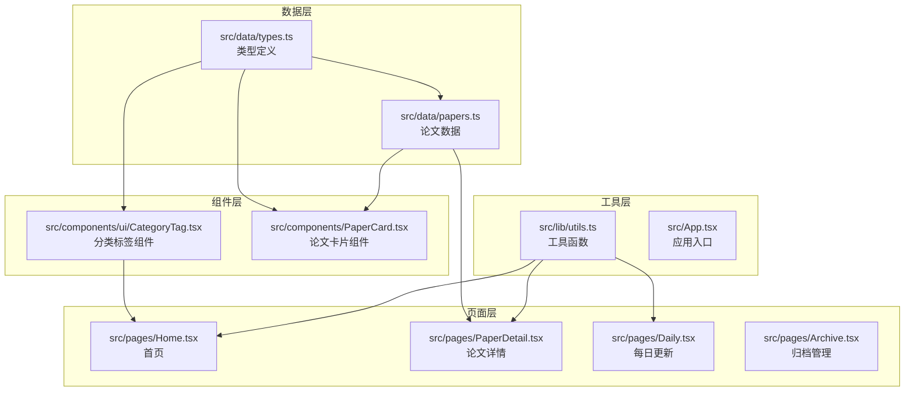
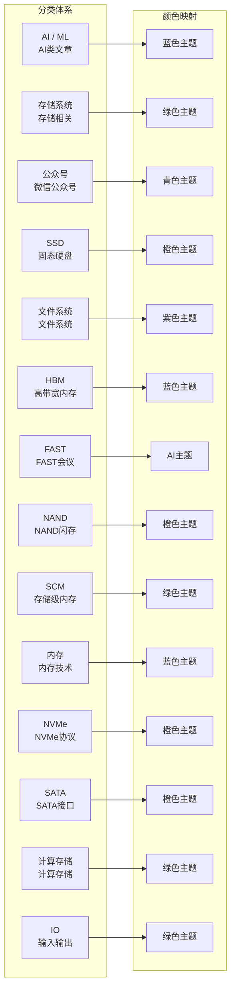
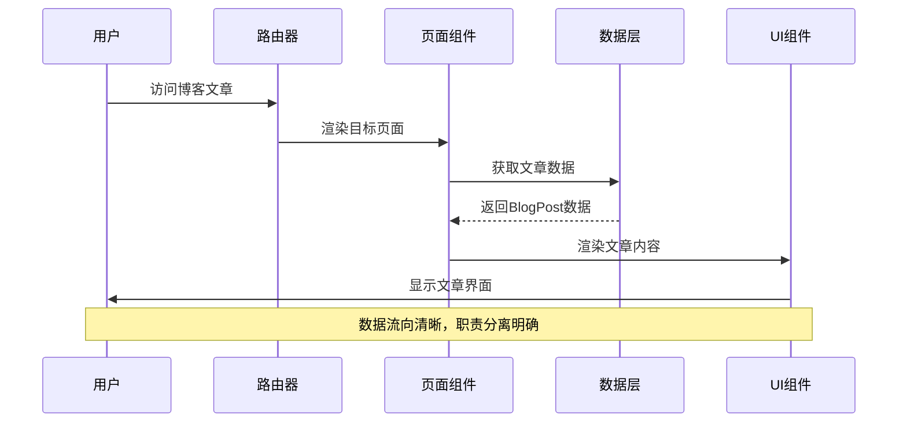
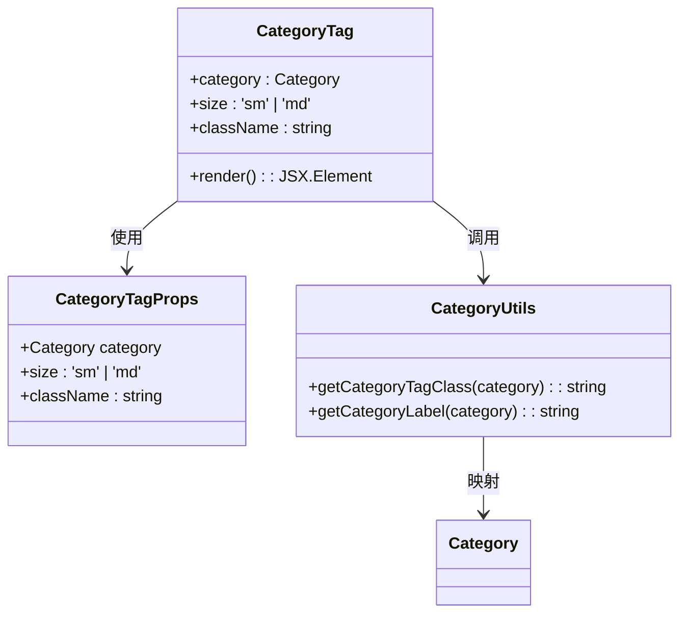
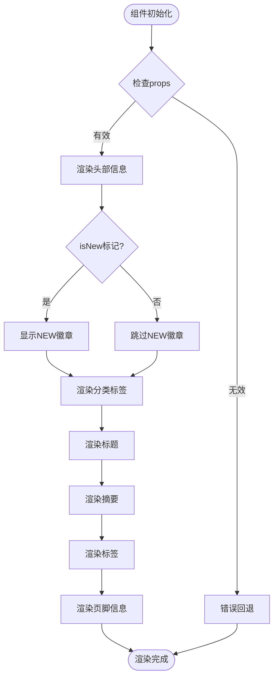
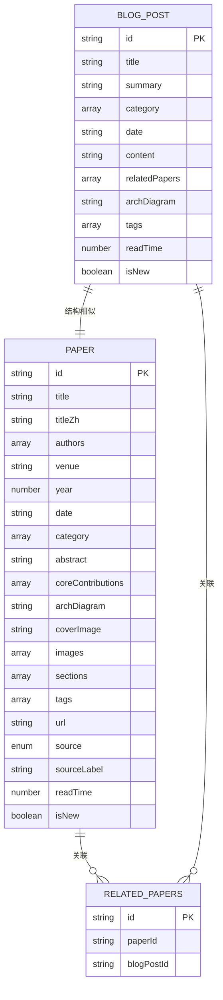

# 博客文章模型

<cite>
**本文档引用的文件**
- [src/data/types.ts](file://src/data/types.ts)
- [src/data/papers.ts](file://src/data/papers.ts)
- [src/components/ui/CategoryTag.tsx](file://src/components/ui/CategoryTag.tsx)
- [src/lib/utils.ts](file://src/lib/utils.ts)
- [src/pages/PaperDetail.tsx](file://src/pages/PaperDetail.tsx)
- [src/components/PaperCard.tsx](file://src/components/PaperCard.tsx)
- [src/pages/Home.tsx](file://src/pages/Home.tsx)
- [src/pages/Daily.tsx](file://src/pages/Daily.tsx)
- [src/pages/Archive.tsx](file://src/pages/Archive.tsx)
- [src/App.tsx](file://src/App.tsx)
</cite>

## 目录
1. [简介](#简介)
2. [项目结构](#项目结构)
3. [核心组件](#核心组件)
4. [架构概览](#架构概览)
5. [详细组件分析](#详细组件分析)
6. [依赖分析](#依赖分析)
7. [性能考虑](#性能考虑)
8. [故障排除指南](#故障排除指南)
9. [结论](#结论)

## 简介

本文档详细分析了博客文章数据模型，重点关注BlogPost接口的结构和字段定义。该项目是一个专注于AI与存储领域前沿论文的博客系统，提供了完整的博客文章数据模型实现，包括文章标题、摘要、内容、相关论文关联等功能。

系统采用TypeScript开发，使用React作为前端框架，通过类型安全的方式定义了完整的数据模型结构。博客文章模型与论文模型高度相似，体现了统一的数据架构设计理念。

## 项目结构

项目采用模块化的文件组织结构，主要分为以下几个核心部分：



**图表来源**
- [src/data/types.ts:1-49](file://src/data/types.ts#L1-L49)
- [src/App.tsx:1-45](file://src/App.tsx#L1-L45)

**章节来源**
- [src/data/types.ts:1-49](file://src/data/types.ts#L1-L49)
- [src/App.tsx:1-45](file://src/App.tsx#L1-L45)

## 核心组件

### BlogPost接口定义

BlogPost接口是博客文章数据模型的核心定义，具有以下关键字段：

| 字段名 | 类型 | 必填 | 描述 |
|--------|------|------|------|
| id | string | 是 | 文章唯一标识符 |
| title | string | 是 | 文章标题 |
| summary | string | 是 | 文章摘要 |
| category | Category[] | 是 | 文章分类数组 |
| date | string | 是 | 发布日期（ISO格式） |
| content | string | 是 | 文章主要内容 |
| relatedPapers | string[] | 是 | 相关论文ID数组 |
| archDiagram | string | 否 | 架构图URL |
| tags | string[] | 是 | 标签数组 |
| readTime | number | 是 | 阅读时长（分钟） |
| isNew | boolean | 否 | 是否为新文章 |

### 分类系统

系统支持13种不同的文章分类，每种分类都有对应的颜色主题和显示标签：



**图表来源**
- [src/lib/utils.ts:9-27](file://src/lib/utils.ts#L9-L27)
- [src/lib/utils.ts:29-47](file://src/lib/utils.ts#L29-L47)

**章节来源**
- [src/data/types.ts:36-48](file://src/data/types.ts#L36-L48)
- [src/lib/utils.ts:9-47](file://src/lib/utils.ts#L9-L47)

## 架构概览

系统采用前后端分离的架构设计，数据通过静态文件管理，前端通过React组件渲染：



**图表来源**
- [src/App.tsx:19-42](file://src/App.tsx#L19-L42)
- [src/pages/PaperDetail.tsx:7-21](file://src/pages/PaperDetail.tsx#L7-L21)

系统架构具有以下特点：
- **类型安全**：使用TypeScript确保数据完整性
- **模块化设计**：清晰的文件组织和职责分离
- **响应式组件**：使用React Hooks实现状态管理
- **静态数据**：通过静态文件管理内容，便于版本控制

**章节来源**
- [src/App.tsx:19-42](file://src/App.tsx#L19-L42)
- [src/pages/PaperDetail.tsx:7-21](file://src/pages/PaperDetail.tsx#L7-L21)

## 详细组件分析

### 分类标签组件

CategoryTag组件负责渲染文章分类标签，具有以下功能特性：



**图表来源**
- [src/components/ui/CategoryTag.tsx:5-24](file://src/components/ui/CategoryTag.tsx#L5-L24)
- [src/lib/utils.ts:9-47](file://src/lib/utils.ts#L9-L47)

组件支持两种尺寸（sm/md）和多种样式变体，通过CSS类名映射实现统一的视觉风格。

**章节来源**
- [src/components/ui/CategoryTag.tsx:1-25](file://src/components/ui/CategoryTag.tsx#L1-L25)
- [src/lib/utils.ts:9-47](file://src/lib/utils.ts#L9-L47)

### 论文卡片组件

PaperCard组件用于展示论文的摘要信息，包含以下核心功能：



**图表来源**
- [src/components/PaperCard.tsx:11-72](file://src/components/PaperCard.tsx#L11-L72)

组件实现了完整的论文信息展示，包括新文章标记、分类标签、作者信息、阅读时长等功能。

**章节来源**
- [src/components/PaperCard.tsx:1-73](file://src/components/PaperCard.tsx#L1-L73)

### 页面路由系统

应用使用React Router实现页面导航，支持多种路由模式：

```mermaid
graph TB
subgraph "路由配置"
HomeRoute[/ -> Home<br/>首页路由]
PaperDetailRoute[/paper/:id -> PaperDetail<br/>论文详情路由]
DeepDiveRoutes[/deep-dive/* -> 深度解读<br/>深度解读路由]
ConferenceRoutes[/fast2026,/osdi2025,/atc2024 -> 会议页面<br/>会议页面路由]
OtherRoutes[/teams,/daily,/archive -> 其他页面<br/>团队/每日更新/归档路由]
end
subgraph "页面组件"
Home[Home.tsx<br/>首页]
PaperDetail[PaperDetail.tsx<br/>论文详情]
DeepDive[RaskDeepDive.tsx<br/>深度解读]
Conference[Fast2026.tsx<br/>会议页面]
Teams[Teams.tsx<br/>团队页面]
Daily[Daily.tsx<br/>每日更新]
Archive[Archive.tsx<br/>归档管理]
end
HomeRoute --> Home
PaperDetailRoute --> PaperDetail
DeepDiveRoutes --> DeepDive
ConferenceRoutes --> Conference
OtherRoutes --> Teams
OtherRoutes --> Daily
OtherRoutes --> Archive
```

**图表来源**
- [src/App.tsx:23-39](file://src/App.tsx#L23-L39)

**章节来源**
- [src/App.tsx:19-42](file://src/App.tsx#L19-L42)

### 数据模型关系

博客文章与论文模型具有高度的一致性，体现了统一的数据架构：



**图表来源**
- [src/data/types.ts:13-34](file://src/data/types.ts#L13-L34)
- [src/data/types.ts:36-48](file://src/data/types.ts#L36-L48)

**章节来源**
- [src/data/types.ts:13-48](file://src/data/types.ts#L13-L48)

## 依赖分析

系统依赖关系清晰，主要依赖包括：

```mermaid
graph TD
subgraph "核心依赖"
React[react@^18.3.1<br/>React框架]
Router[react-router-dom@^7.1.1<br/>路由管理]
Lucide[lucide-react@^0.468.0<br/>图标库]
end
subgraph "样式依赖"
Tailwind[tailwindcss@^3.4.17<br/>CSS框架]
TailwindMerge[tailwind-merge@^2.6.0<br/>类名合并]
ClassVariants[class-variance-authority@^0.7.1<br/>变体类]
Animate[tailwindcss-animate@^1.0.7<br/>动画]
end
subgraph "开发依赖"
Vite[vite@^6.0.5<br/>构建工具]
TypeScript[typescript~5.6.2<br/>类型系统]
PostCSS[autoprefixer/postcss<br/>CSS处理]
end
subgraph "应用模块"
App[App.tsx<br/>应用入口]
Pages[页面组件<br/>路由页面]
Components[UI组件<br/>复用组件]
Data[数据模型<br/>类型定义]
Utils[工具函数<br/>辅助函数]
end
React --> App
Router --> App
Lucide --> Components
Tailwind --> Components
TailwindMerge --> Utils
ClassVariants --> Components
App --> Pages
Pages --> Components
Components --> Data
Components --> Utils
Utils --> Data
```

**图表来源**
- [package.json:10-18](file://package.json#L10-L18)

**章节来源**
- [package.json:10-29](file://package.json#L10-L29)

## 性能考虑

系统在设计时充分考虑了性能优化：

### 数据加载优化
- **静态数据**：使用静态JSON文件减少API调用开销
- **懒加载**：图片资源使用懒加载机制
- **虚拟滚动**：大量数据时可考虑虚拟滚动实现

### 组件渲染优化
- **Memo化**：使用useMemo避免不必要的重新计算
- **条件渲染**：仅在需要时渲染架构图等重型元素
- **分页加载**：大数据集时实现分页加载

### 缓存策略
- **浏览器缓存**：合理设置HTTP缓存头
- **组件缓存**：使用React.memo缓存渲染结果
- **数据缓存**：本地存储常用数据

## 故障排除指南

### 常见问题及解决方案

**问题1：文章分类显示异常**
- 检查Category类型定义是否正确
- 验证getCategoryTagClass映射关系
- 确认CSS类名是否存在

**问题2：相关论文关联失效**
- 检查relatedPapers字段的数据格式
- 验证论文ID的唯一性和正确性
- 确认论文数据源的完整性

**问题3：页面渲染错误**
- 检查路由配置是否正确
- 验证组件props传递
- 确认数据模型的一致性

**问题4：样式显示问题**
- 检查Tailwind CSS配置
- 验证CSS类名拼写
- 确认响应式断点设置

**章节来源**
- [src/lib/utils.ts:9-47](file://src/lib/utils.ts#L9-L47)
- [src/components/ui/CategoryTag.tsx:11-24](file://src/components/ui/CategoryTag.tsx#L11-L24)

## 结论

博客文章数据模型展现了现代Web应用的最佳实践：

### 设计优势
- **类型安全**：完整的TypeScript类型定义确保数据完整性
- **模块化架构**：清晰的文件组织便于维护和扩展
- **统一设计**：博客与论文模型的高度一致体现了良好的架构设计
- **用户体验**：丰富的交互功能和响应式设计

### 技术亮点
- **分类系统**：灵活的分类机制支持多维度内容组织
- **标签管理**：完善的标签系统便于内容检索和分类
- **数据关联**：相关论文关联功能增强了内容的连贯性
- **SEO优化**：结构化的数据模型为搜索引擎优化奠定基础

### 扩展建议
- **内容管理**：可考虑添加富文本编辑器支持
- **评论系统**：集成用户评论和互动功能
- **多语言支持**：扩展国际化功能
- **数据分析**：添加内容浏览统计和分析功能

该数据模型为博客系统的长期发展提供了坚实的基础，具有良好的可扩展性和维护性。