# 团队数据模型

<cite>
**本文档引用的文件**
- [types.ts](file://src/data/types.ts)
- [teams.ts](file://src/data/teams.ts)
- [Teams.tsx](file://src/pages/Teams.tsx)
- [TeamDetail.tsx](file://src/pages/TeamDetail.tsx)
- [PaperCard.tsx](file://src/components/PaperCard.tsx)
- [utils.ts](file://src/lib/utils.ts)
</cite>

## 目录
1. [简介](#简介)
2. [项目结构](#项目结构)
3. [核心组件](#核心组件)
4. [架构概览](#架构概览)
5. [详细组件分析](#详细组件分析)
6. [依赖分析](#依赖分析)
7. [性能考虑](#性能考虑)
8. [故障排除指南](#故障排除指南)
9. [结论](#结论)

## 简介

本文件详细阐述了研究团队数据模型的设计与实现，重点关注ResearchTeam接口的结构定义、团队与论文之间的关联关系、数据完整性保证机制，以及团队信息的展示模式和交互设计考虑。该数据模型为存储与系统领域的研究团队提供了统一的数据结构，支持团队基本信息、成员结构、论文统计和联系方式的完整管理。

## 项目结构

该项目采用模块化架构，将数据模型与UI组件分离，确保数据结构的独立性和可维护性。

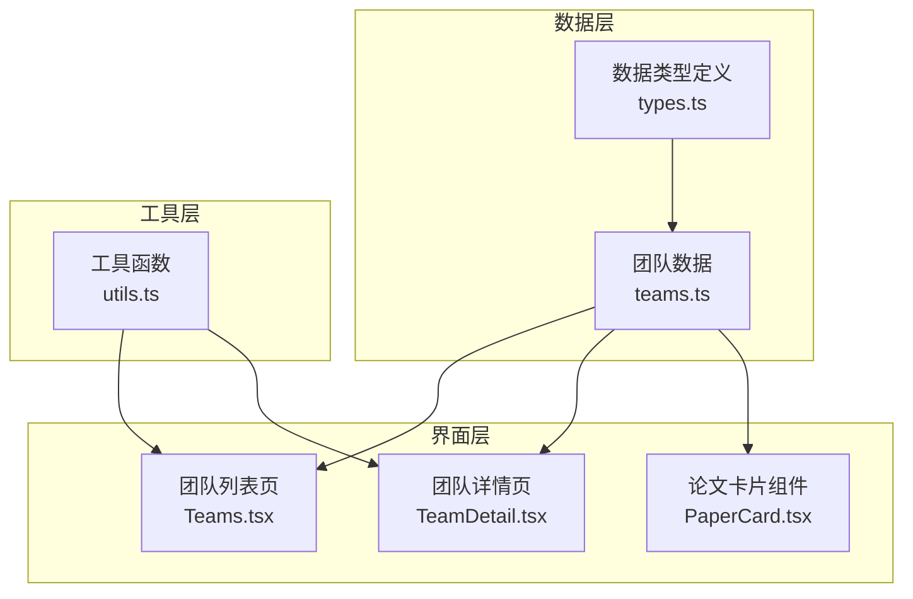

**图表来源**
- [types.ts:1-49](file://src/data/types.ts#L1-L49)
- [teams.ts:19-37](file://src/data/teams.ts#L19-L37)
- [Teams.tsx:1-134](file://src/pages/Teams.tsx#L1-L134)
- [TeamDetail.tsx:1-194](file://src/pages/TeamDetail.tsx#L1-L194)

**章节来源**
- [types.ts:1-49](file://src/data/types.ts#L1-L49)
- [teams.ts:19-37](file://src/data/teams.ts#L19-L37)

## 核心组件

### ResearchTeam接口结构

ResearchTeam接口是整个团队数据模型的核心，定义了完整的团队信息结构：

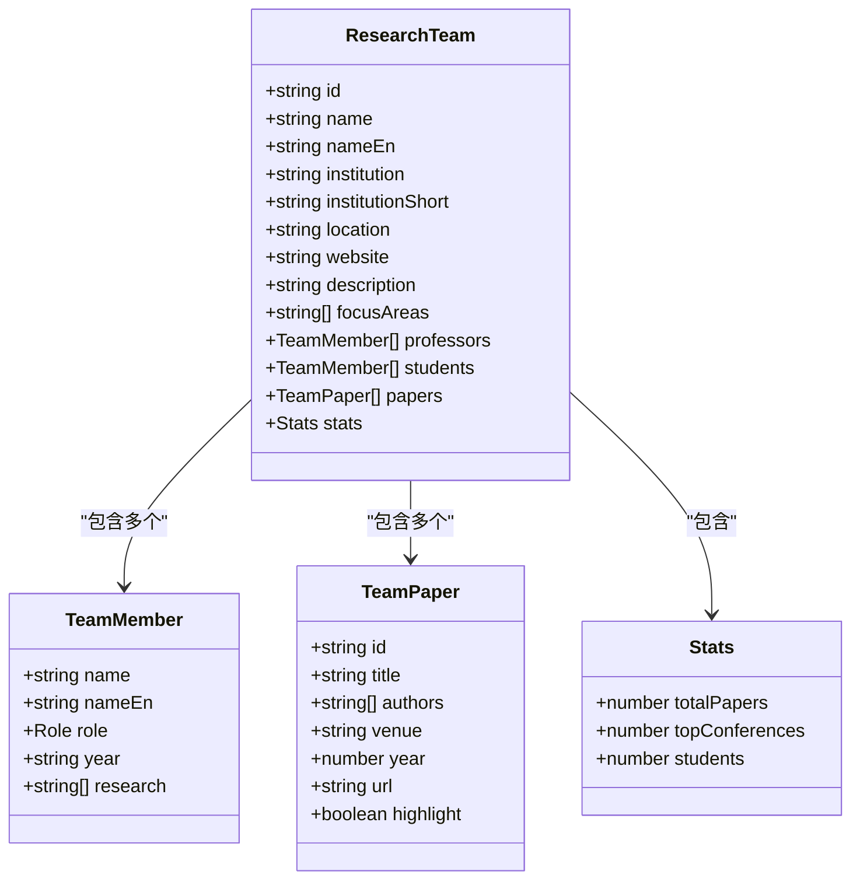

**图表来源**
- [teams.ts:19-37](file://src/data/teams.ts#L19-L37)
- [teams.ts:1-7](file://src/data/teams.ts#L1-L7)
- [teams.ts:9-17](file://src/data/teams.ts#L9-L17)

### 数据字段定义详解

#### 基本信息字段
- `id`: 团队唯一标识符，用于路由导航和数据检索
- `name`: 中文团队名称，如"舒继武教授团队"
- `nameEn`: 英文团队名称，如"Shu Jiwu Research Group"
- `institution`: 完整机构名称
- `institutionShort`: 机构简称，用于显示
- `location`: 团队所在城市
- `website`: 团队官方网站链接
- `description`: 团队简介描述

#### 成员结构字段
- `focusAreas`: 研究方向数组，支持多领域覆盖
- `professors`: 教授团队列表，包含姓名、角色、研究方向等信息
- `students`: 学生团队列表，包含在读学生信息

#### 论文统计字段
- `papers`: 论文列表，包含论文ID、标题、作者、会议、年份等
- `stats`: 统计信息对象，包含总数统计

**章节来源**
- [teams.ts:19-37](file://src/data/teams.ts#L19-L37)

## 架构概览

团队数据模型采用扁平化设计，避免复杂的嵌套关系，确保数据访问的高效性。

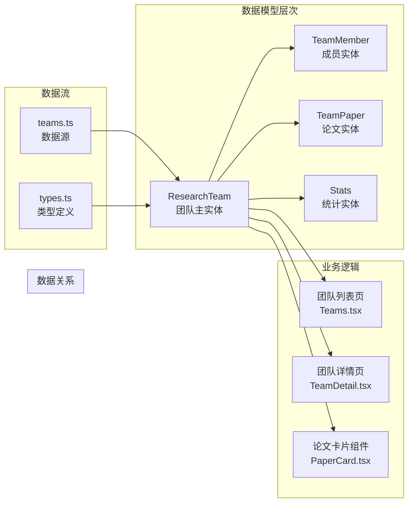

**图表来源**
- [teams.ts:39-168](file://src/data/teams.ts#L39-L168)
- [Teams.tsx:3](file://src/pages/Teams.tsx#L3)
- [TeamDetail.tsx:3](file://src/pages/TeamDetail.tsx#L3)

## 详细组件分析

### 团队数据模型实现

#### ResearchTeam接口实现
团队数据模型通过TypeScript接口定义，确保类型安全和开发体验：

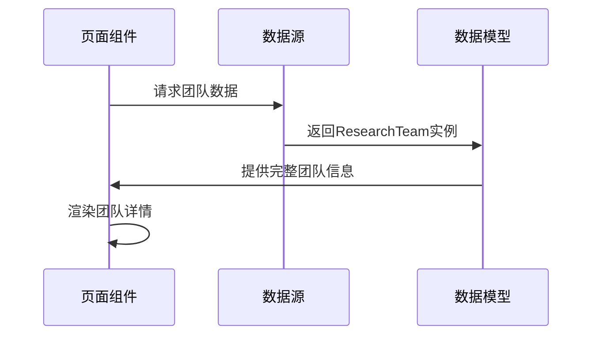

**图表来源**
- [teams.ts:39-168](file://src/data/teams.ts#L39-L168)
- [TeamDetail.tsx:7-20](file://src/pages/TeamDetail.tsx#L7-L20)

#### 团队成员结构
成员数据采用统一的TeamMember接口，支持不同角色的差异化展示：

| 角色类型 | 描述 | 展示特点 |
|---------|------|----------|
| professor | 教授 | 大头像展示，突出显示 |
| associate_prof | 副教授 | 中等头像，常规展示 |
| assistant_prof | 助理教授 | 小头像，基础展示 |
| phd | 博士生 | 小头像，标注年级 |
| master | 硕士生 | 小头像，标注年级 |

**章节来源**
- [teams.ts:1-7](file://src/data/teams.ts#L1-L7)

#### 论文关联关系
团队与论文之间建立直接关联，通过论文ID实现快速检索：

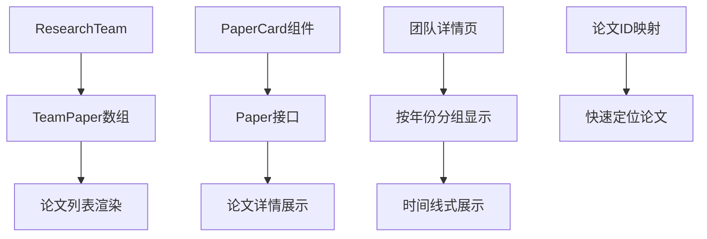

**图表来源**
- [teams.ts:9-17](file://src/data/teams.ts#L9-L17)
- [PaperCard.tsx:7-9](file://src/components/PaperCard.tsx#L7-L9)

**章节来源**
- [teams.ts:9-17](file://src/data/teams.ts#L9-L17)
- [TeamDetail.tsx:22-28](file://src/pages/TeamDetail.tsx#L22-L28)

### 团队信息展示模式

#### 列表页展示设计
团队列表页采用卡片式布局，提供团队基本信息的快速浏览：

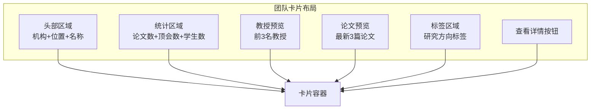

**图表来源**
- [Teams.tsx:24-123](file://src/pages/Teams.tsx#L24-L123)

#### 详情页展示设计
团队详情页提供完整的团队信息展示，支持多维度数据呈现：

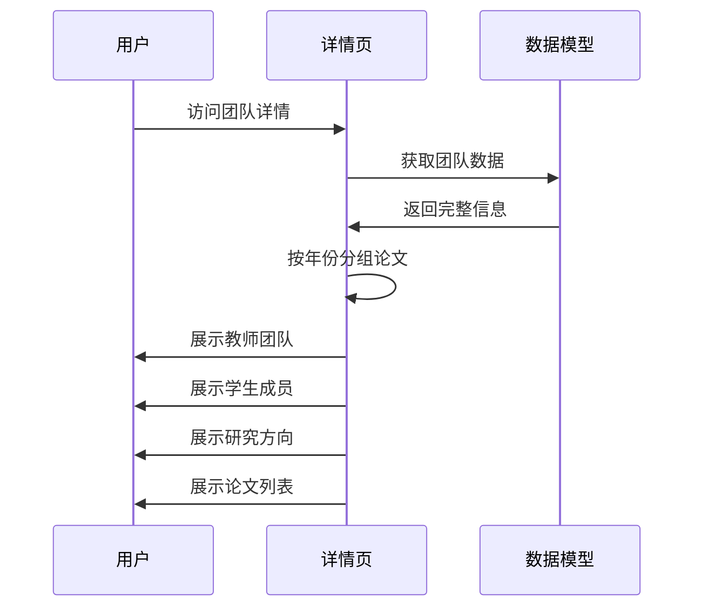

**图表来源**
- [TeamDetail.tsx:30-191](file://src/pages/TeamDetail.tsx#L30-L191)

**章节来源**
- [Teams.tsx:6-134](file://src/pages/Teams.tsx#L6-L134)
- [TeamDetail.tsx:6-194](file://src/pages/TeamDetail.tsx#L6-L194)

### 数据完整性保证

#### 类型安全机制
通过TypeScript接口定义，确保数据结构的一致性和完整性：

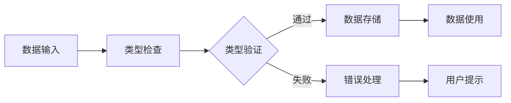

#### 必填字段约束
关键字段采用强制要求，确保核心信息的完整性：
- 团队ID：唯一标识符
- 中英文名称：双语支持
- 机构信息：完整标识
- 研究方向：至少一个
- 统计信息：数值完整性

**章节来源**
- [types.ts:13-34](file://src/data/types.ts#L13-L34)
- [teams.ts:19-37](file://src/data/teams.ts#L19-L37)

## 依赖分析

### 组件间依赖关系

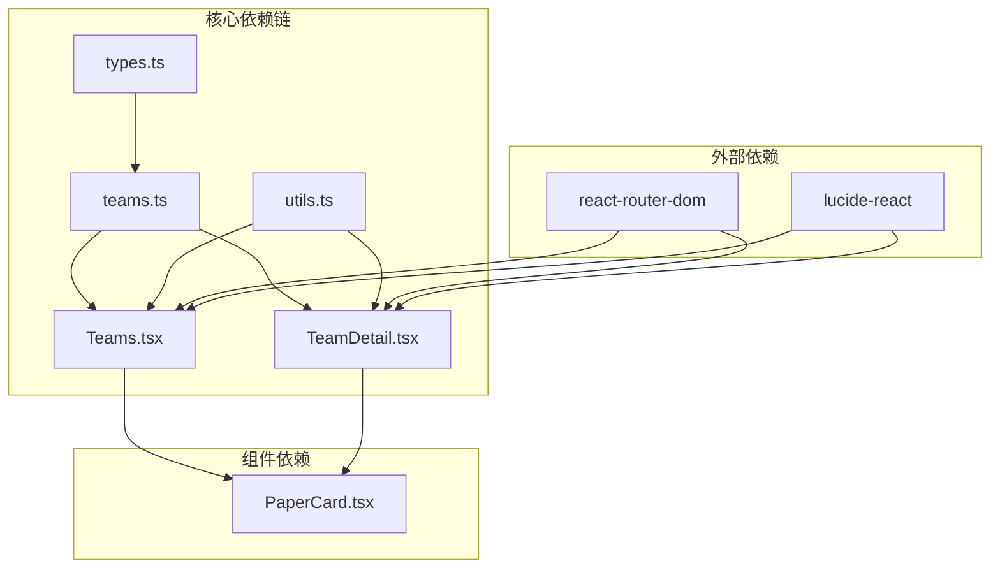

**图表来源**
- [teams.ts:3](file://src/data/teams.ts#L3)
- [Teams.tsx:1-4](file://src/pages/Teams.tsx#L1-L4)
- [TeamDetail.tsx:1-4](file://src/pages/TeamDetail.tsx#L1-L4)

### 数据流向分析

团队数据从数据源到UI组件的完整流程：

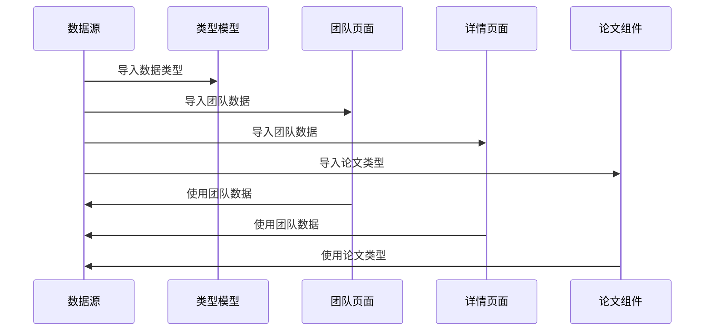

**图表来源**
- [teams.ts:39-168](file://src/data/teams.ts#L39-L168)
- [Teams.tsx:3](file://src/pages/Teams.tsx#L3)
- [TeamDetail.tsx:3](file://src/pages/TeamDetail.tsx#L3)

**章节来源**
- [teams.ts:39-168](file://src/data/teams.ts#L39-L168)
- [Teams.tsx:1-134](file://src/pages/Teams.tsx#L1-L134)
- [TeamDetail.tsx:1-194](file://src/pages/TeamDetail.tsx#L1-L194)

## 性能考虑

### 查询优化策略

#### 数据预处理优化
- **按年份分组**：在详情页中对论文按年份进行预分组，减少运行时计算
- **数据切片**：列表页仅显示部分论文和教授信息，提升初始加载速度
- **懒加载机制**：详情页按需加载完整数据

#### 内存使用优化
- **扁平化设计**：避免深层嵌套，减少内存占用
- **数据复用**：相同数据在多个页面间共享使用
- **组件缓存**：React组件自动缓存渲染结果

### 性能提升方案

#### 前端性能优化
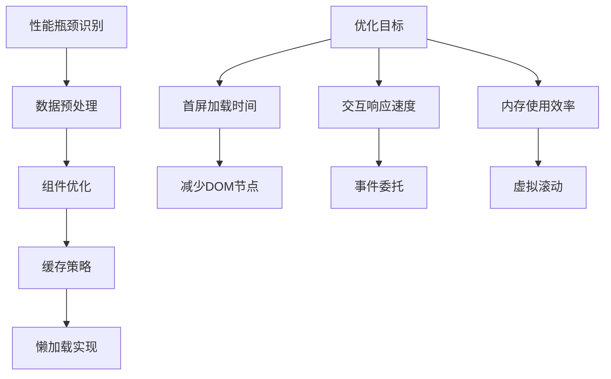

#### 数据访问优化
- **索引字段**：使用团队ID作为主要索引
- **查询缓存**：缓存常用查询结果
- **批量操作**：支持批量数据处理

**章节来源**
- [TeamDetail.tsx:22-28](file://src/pages/TeamDetail.tsx#L22-L28)
- [Teams.tsx:89-102](file://src/pages/Teams.tsx#L89-L102)

## 故障排除指南

### 常见问题及解决方案

#### 数据缺失问题
- **症状**：团队详情页显示为空或部分信息缺失
- **原因**：数据源中的必填字段未正确填充
- **解决**：检查teams.ts中的数据完整性，确保所有必填字段都有值

#### 类型不匹配问题
- **症状**：TypeScript编译错误或运行时类型异常
- **原因**：数据结构与接口定义不一致
- **解决**：对照types.ts中的接口定义，修正数据格式

#### 性能问题
- **症状**：页面加载缓慢或交互卡顿
- **原因**：数据量过大或渲染复杂度过高
- **解决**：实施数据分页、虚拟滚动等优化措施

### 调试技巧

#### 开发环境调试
- 使用浏览器开发者工具监控网络请求
- 检查控制台中的JavaScript错误
- 利用React DevTools分析组件渲染

#### 数据验证方法
- 在数据导入时进行类型检查
- 实施单元测试验证数据结构
- 使用TypeScript严格模式

**章节来源**
- [teams.ts:39-168](file://src/data/teams.ts#L39-L168)
- [utils.ts:9-27](file://src/lib/utils.ts#L9-L27)

## 结论

研究团队数据模型通过清晰的接口定义、合理的数据结构设计和完善的类型安全机制，为存储与系统领域的研究团队管理提供了可靠的技术支撑。该模型具有以下优势：

1. **结构清晰**：采用扁平化设计，避免复杂的嵌套关系
2. **类型安全**：通过TypeScript接口确保数据完整性
3. **扩展性强**：支持新增字段和功能模块
4. **性能友好**：优化的数据访问模式和渲染策略
5. **用户体验佳**：直观的展示设计和交互流程

该数据模型不仅满足当前的功能需求，还为未来的功能扩展和技术演进奠定了坚实的基础。通过持续的优化和完善，该模型将成为存储与系统领域研究团队信息管理的最佳实践。