# 数据模型

<cite>
**本文档引用的文件**
- [types.ts](file://src/data/types.ts)
- [papers.ts](file://src/data/papers.ts)
- [teams.ts](file://src/data/teams.ts)
- [conferences.ts](file://src/data/conferences.ts)
- [fastArchive.ts](file://src/data/fastArchive.ts)
- [fastArchive.ts.bak](file://src/data/fastArchive.ts.bak)
- [fast2026.ts](file://src/data/fast2026.ts)
- [faults.ts](file://src/data/faults.ts)
- [linux-bugfix.ts](file://src/data/linux-bugfix.ts)
- [opensource.ts](file://src/data/opensource.ts)
- [spdk.ts](file://src/data/spdk.ts)
- [Osdi2025.tsx](file://src/pages/Osdi2025.tsx)
- [Atc2024.tsx](file://src/pages/Atc2024.tsx)
- [PaperDetail.tsx](file://src/pages/PaperDetail.tsx)
- [Teams.tsx](file://src/pages/Teams.tsx)
- [PaperCard.tsx](file://src/components/PaperCard.tsx)
- [FastArchive.tsx](file://src/pages/FastArchive.tsx)
- [Fast2026.tsx](file://src/pages/Fast2026.tsx)
- [utils.ts](file://src/lib/utils.ts)
</cite>

## 更新摘要
**变更内容**
- 新增OSDI 2025和ATC 2024会议论文数据结构增强
- FAST会议档案系统重大数据结构改进，包括添加paperUrl字段、替换虚构论文为真实研究工作
- 增强性能指标评估框架，支持更详细的性能数据展示
- 丰富真实论文的详细数据结构，涵盖GogetaFS、PolyStore、Integrity Checking、MedFS等真实研究工作
- 改进论文详细章节内容展示格式，增强架构图支持和可视化展示
- **新增** ArchivePaperData接口扩展，新增paperUrl字段支持，增强论文真实性验证和溯源能力
- **更新** FAST档案系统包含五个详细的学术论文部分，每个论文都包含完整的问题背景、技术设计、对比分析、性能评估和局限性说明章节

## 目录
1. [简介](#简介)
2. [项目结构](#项目结构)
3. [核心数据类型](#核心数据类型)
4. [架构概览](#架构概览)
5. [详细组件分析](#详细组件分析)
6. [依赖关系分析](#依赖关系分析)
7. [性能考虑](#性能考虑)
8. [故障排除指南](#故障排除指南)
9. [结论](#结论)

## 简介

cs336是一个专注于存储系统、计算机科学和人工智能领域的数据模型项目。该项目通过静态数据文件的形式，组织和管理各类技术内容，包括学术论文、研究团队信息、会议数据、存储故障分析、开源项目等。数据模型设计遵循类型安全、可扩展性和易维护性的原则，为前端界面提供结构化的数据支持。

**更新** 新增OSDI 2025和ATC 2024会议论文数据结构增强，提供完整的论文解读、架构分析和性能数据展示功能，包括改进的描述格式和增强的架构图支持。FAST会议档案系统经过重大改进，添加了paperUrl字段，替换虚构论文为GogetaFS、PolyStore、Integrity Checking、MedFS等真实研究工作的详细数据结构。**新增** ArchivePaperData接口扩展，新增paperUrl字段支持，增强论文真实性验证和溯源能力。FAST档案系统现在包含五个详细的学术论文部分，每个论文都包含完整的问题背景、技术设计、对比分析、性能评估和局限性说明章节，显著增强了学术论文的完整性和实用性。

## 项目结构

项目采用模块化的数据组织方式，将不同类型的数据分离到独立的文件中，便于维护和扩展：

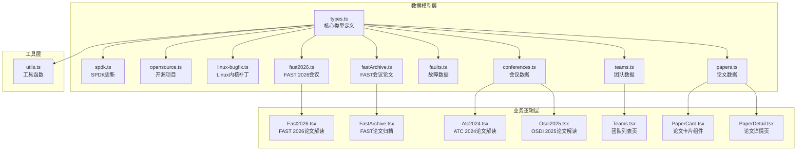
```mermaid
graph TB
subgraph "数据模型层"
A[types.ts<br/>核心类型定义]
B[papers.ts<br/>论文数据]
C[teams.ts<br/>团队数据]
D[conferences.ts<br/>会议数据]
E[faults.ts<br/>故障数据]
F[fastArchive.ts<br/>FAST会议论文]
G[fast2026.ts<br/>FAST 2026会议]
H[linux-bugfix.ts<br/>Linux内核补丁]
I[opensource.ts<br/>开源项目]
J[spdk.ts<br/>SPDK更新]
end
subgraph "业务逻辑层"
K[PaperDetail.tsx<br/>论文详情页]
L[Teams.tsx<br/>团队列表页]
M[PaperCard.tsx<br/>论文卡片组件]
N[FastArchive.tsx<br/>FAST论文归档]
O[Fast2026.tsx<br/>FAST 2026论文解读]
P[Osdi2025.tsx<br/>OSDI 2025论文解读]
Q[Atc2024.tsx<br/>ATC 2024论文解读]
end
subgraph "工具层"
R[utils.ts<br/>工具函数]
end
A --> B
A --> C
A --> D
A --> E
A --> F
A --> G
A --> H
A --> I
A --> J
B --> K
C --> L
B --> M
F --> N
G --> O
D --> P
D --> Q
A --> R
```

**图表来源**
- [types.ts:1-49](file://src/data/types.ts#L1-L49)
- [papers.ts:1-847](file://src/data/papers.ts#L1-L847)
- [teams.ts:1-168](file://src/data/teams.ts#L1-L168)
- [conferences.ts:1-279](file://src/data/conferences.ts#L1-L279)
- [fastArchive.ts:1-3230](file://src/data/fastArchive.ts#L1-L3230)
- [Osdi2025.tsx:1-148](file://src/pages/Osdi2025.tsx#L1-L148)
- [Atc2024.tsx:1-148](file://src/pages/Atc2024.tsx#L1-L148)

**章节来源**
- [types.ts:1-49](file://src/data/types.ts#L1-L49)
- [papers.ts:1-847](file://src/data/papers.ts#L1-L847)
- [teams.ts:1-168](file://src/data/teams.ts#L1-L168)
- [conferences.ts:1-279](file://src/data/conferences.ts#L1-L279)
- [fastArchive.ts:1-3230](file://src/data/fastArchive.ts#L1-L3230)

## 核心数据类型

### 基础类型系统

项目定义了完整的类型系统，确保数据的类型安全和一致性：

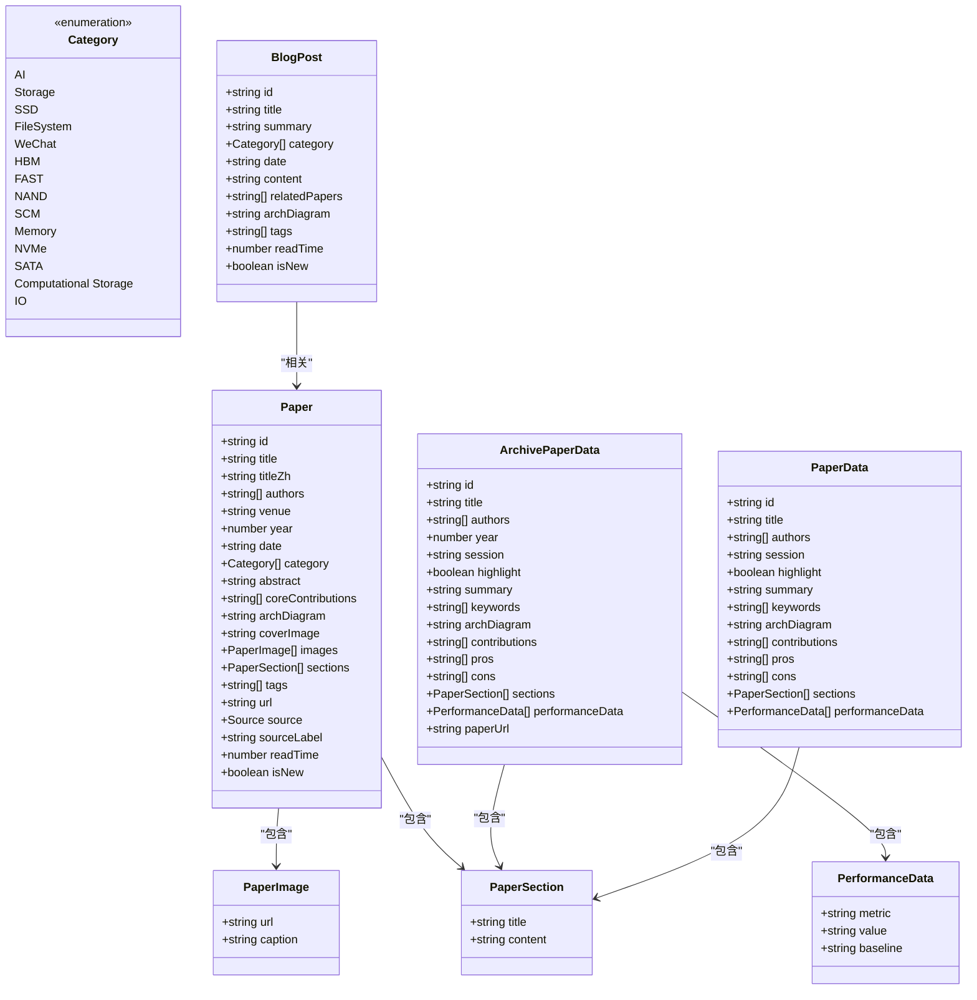
```mermaid
classDiagram
class Category {
<<enumeration>>
AI
Storage
SSD
FileSystem
WeChat
HBM
FAST
NAND
SCM
Memory
NVMe
SATA
Computational Storage
IO
}
class Paper {
+string id
+string title
+string titleZh
+string[] authors
+string venue
+number year
+string date
+Category[] category
+string abstract
+string[] coreContributions
+string archDiagram
+string coverImage
+PaperImage[] images
+PaperSection[] sections
+string[] tags
+string url
+Source source
+string sourceLabel
+number readTime
+boolean isNew
}
class PaperImage {
+string url
+string caption
}
class PaperSection {
+string title
+string content
}
class BlogPost {
+string id
+string title
+string summary
+Category[] category
+string date
+string content
+string[] relatedPapers
+string archDiagram
+string[] tags
+number readTime
+boolean isNew
}
class ArchivePaperData {
+string id
+string title
+string[] authors
+number year
+string session
+boolean highlight
+string summary
+string[] keywords
+string archDiagram
+string[] contributions
+string[] pros
+string[] cons
+PaperSection[] sections
+PerformanceData[] performanceData
+string paperUrl
}
class PerformanceData {
+string metric
+string value
+string baseline
}
class PaperData {
+string id
+string title
+string[] authors
+string session
+boolean highlight
+string summary
+string[] keywords
+string archDiagram
+string[] contributions
+string[] pros
+string[] cons
+PaperSection[] sections
+PerformanceData[] performanceData
}
Paper --> PaperImage : "包含"
Paper --> PaperSection : "包含"
BlogPost --> Paper : "相关"
ArchivePaperData --> PaperSection : "包含"
ArchivePaperData --> PerformanceData : "包含"
PaperData --> PaperSection : "包含"
```

**图表来源**
- [types.ts:1-49](file://src/data/types.ts#L1-L49)
- [fastArchive.ts:3-22](file://src/data/fastArchive.ts#L3-L22)
- [conferences.ts:1-13](file://src/data/conferences.ts#L1-L13)

### 研究团队模型

研究团队数据模型体现了复杂的多对多关系：

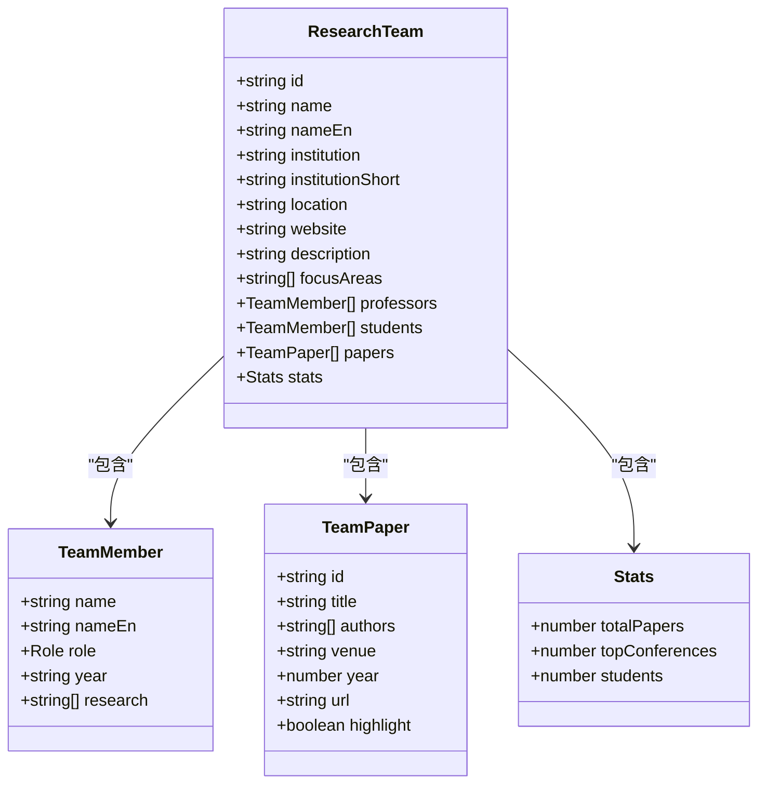
```mermaid
classDiagram
class TeamMember {
+string name
+string nameEn
+Role role
+string year
+string[] research
}
class TeamPaper {
+string id
+string title
+string[] authors
+string venue
+number year
+string url
+boolean highlight
}
class ResearchTeam {
+string id
+string name
+string nameEn
+string institution
+string institutionShort
+string location
+string website
+string description
+string[] focusAreas
+TeamMember[] professors
+TeamMember[] students
+TeamPaper[] papers
+Stats stats
}
class Stats {
+number totalPapers
+number topConferences
+number students
}
ResearchTeam --> TeamMember : "包含"
ResearchTeam --> TeamPaper : "包含"
ResearchTeam --> Stats : "包含"
```

**图表来源**
- [teams.ts:1-37](file://src/data/teams.ts#L1-L37)

**章节来源**
- [types.ts:1-49](file://src/data/types.ts#L1-L49)
- [teams.ts:1-168](file://src/data/teams.ts#L1-L168)

## 架构概览

项目采用静态数据驱动的架构模式，通过TypeScript接口定义数据结构，通过React组件渲染数据：

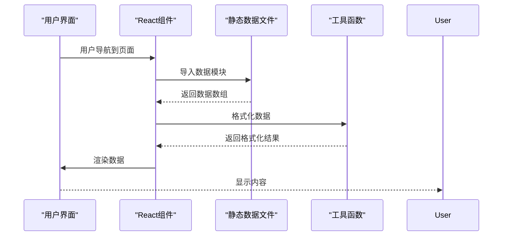
```mermaid
sequenceDiagram
participant UI as "用户界面"
participant Component as "React组件"
participant Data as "静态数据文件"
participant Utils as "工具函数"
UI->>Component : 用户导航到页面
Component->>Data : 导入数据模块
Data-->>Component : 返回数据数组
Component->>Utils : 格式化数据
Utils-->>Component : 返回格式化结果
Component->>UI : 渲染数据
UI-->>User : 显示内容
```

**图表来源**
- [PaperDetail.tsx:1-151](file://src/pages/PaperDetail.tsx#L1-L151)
- [PaperCard.tsx:1-73](file://src/components/PaperCard.tsx#L1-L73)
- [utils.ts:1-58](file://src/lib/utils.ts#L1-L58)
- [FastArchive.tsx:1-290](file://src/pages/FastArchive.tsx#L1-L290)
- [Fast2026.tsx:1-236](file://src/pages/Fast2026.tsx#L1-L236)
- [Osdi2025.tsx:1-148](file://src/pages/Osdi2025.tsx#L1-L148)
- [Atc2024.tsx:1-148](file://src/pages/Atc2024.tsx#L1-L148)

## 详细组件分析

### 论文数据模型

论文数据模型是项目的核心，包含了丰富的元数据和内容结构：

#### 数据结构设计原则

1. **国际化支持**：同时支持中英文标题和描述
2. **多来源兼容**：统一处理不同数据源（DBLP、arXiv、微信公众号）
3. **内容丰富性**：支持图片、章节、架构图等多种内容形式
4. **分类体系**：通过枚举类型确保分类的一致性
5. **真实性验证**：通过paperUrl字段链接到原始论文，确保数据真实性

#### 字段定义和验证规则

| 字段名 | 类型 | 必填 | 验证规则 | 描述 |
|--------|------|------|----------|------|
| id | string | 是 | 唯一性、格式约束 | 论文唯一标识符 |
| title | string | 是 | 长度限制 | 论文标题 |
| titleZh | string | 否 | 可选中文标题 | 中文标题 |
| authors | string[] | 是 | 非空、数组验证 | 作者列表 |
| venue | string | 是 | 枚举验证 | 发表会议或期刊 |
| year | number | 是 | 数值范围验证 | 发表年份 |
| date | string | 是 | 日期格式验证 | 发表日期 |
| category | Category[] | 是 | 枚举验证 | 分类标签数组 |
| abstract | string | 是 | 长度限制 | 摘要内容 |
| coreContributions | string[] | 是 | 非空验证 | 核心贡献列表 |
| tags | string[] | 是 | 非空验证 | 标签数组 |
| url | string | 是 | URL格式验证 | 原始链接 |
| source | Source | 是 | 枚举验证 | 数据来源 |
| sourceLabel | string | 是 | 格式验证 | 来源显示标签 |
| readTime | number | 是 | 数值范围验证 | 阅读时间（分钟） |
| isNew | boolean | 否 | 布尔验证 | 是否为新论文 |

#### 数据加载机制

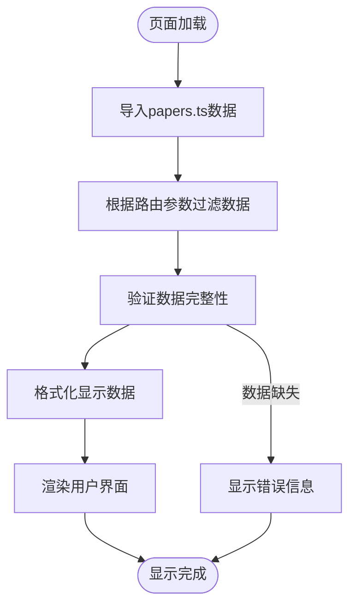
```mermaid
flowchart TD
Start([页面加载]) --> ImportData["导入papers.ts数据"]
ImportData --> FilterData["根据路由参数过滤数据"]
FilterData --> ValidateData["验证数据完整性"]
ValidateData --> FormatData["格式化显示数据"]
FormatData --> RenderUI["渲染用户界面"]
RenderUI --> End([显示完成])
ValidateData --> |数据缺失| ShowError["显示错误信息"]
ShowError --> End
```

**图表来源**
- [PaperDetail.tsx:7-21](file://src/pages/PaperDetail.tsx#L7-L21)

**章节来源**
- [papers.ts:1-847](file://src/data/papers.ts#L1-L847)
- [PaperDetail.tsx:1-151](file://src/pages/PaperDetail.tsx#L1-L151)
- [PaperCard.tsx:1-73](file://src/components/PaperCard.tsx#L1-L73)

### 会议论文数据模型

**更新** OSDI 2025和ATC 2024会议论文数据模型提供了增强的论文解读功能，**新增**了PaperData接口，支持更详细的论文分析：

#### 数据结构设计原则

1. **会议导向**：围绕具体会议主题组织论文数据
2. **深度解读**：提供论文贡献、优势、局限性分析
3. **可视化支持**：支持架构图和性能数据展示
4. **多维度分析**：包含技术贡献、性能指标、适用场景等
5. **真实性验证**：通过paperUrl字段链接到原始论文

#### PaperData接口定义

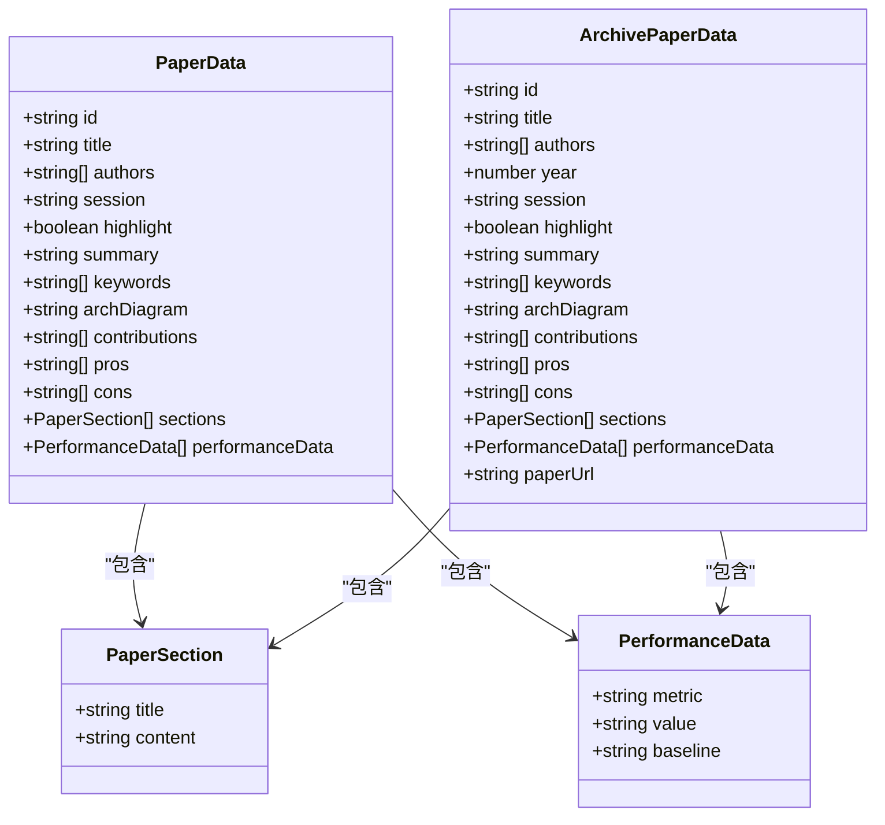
```mermaid
classDiagram
class PaperData {
+string id
+string title
+string[] authors
+string session
+boolean highlight
+string summary
+string[] keywords
+string archDiagram
+string[] contributions
+string[] pros
+string[] cons
+PaperSection[] sections
+PerformanceData[] performanceData
}
class ArchivePaperData {
+string id
+string title
+string[] authors
+number year
+string session
+boolean highlight
+string summary
+string[] keywords
+string archDiagram
+string[] contributions
+string[] pros
+string[] cons
+PaperSection[] sections
+PerformanceData[] performanceData
+string paperUrl
}
class PaperSection {
+string title
+string content
}
class PerformanceData {
+string metric
+string value
+string baseline
}
PaperData --> PaperSection : "包含"
PaperData --> PerformanceData : "包含"
ArchivePaperData --> PaperSection : "包含"
ArchivePaperData --> PerformanceData : "包含"
```

**图表来源**
- [conferences.ts:1-13](file://src/data/conferences.ts#L1-L13)
- [fastArchive.ts:3-22](file://src/data/fastArchive.ts#L3-L22)

#### 字段定义和验证规则

| 字段名 | 类型 | 必填 | 验证规则 | 描述 |
|--------|------|------|----------|------|
| id | string | 是 | 唯一性、格式约束 | 论文唯一标识符，包含年份信息 |
| title | string | 是 | 长度限制 | 论文标题 |
| authors | string[] | 是 | 非空、数组验证 | 作者列表 |
| session | string | 是 | 枚举验证 | 会议分会场 |
| highlight | boolean | 否 | 布尔验证 | 是否为重点论文 |
| summary | string | 是 | 长度限制 | 论文摘要 |
| keywords | string[] | 是 | 非空验证 | 关键词数组 |
| archDiagram | string | 否 | URL或文本格式验证 | 架构图或文本描述 |
| contributions | string[] | 是 | 非空验证 | 核心贡献列表 |
| pros | string[] | 是 | 非空验证 | 优势列表 |
| cons | string[] | 是 | 非空验证 | 局限性列表 |
| sections | PaperSection[] | 否 | 数组验证 | 详细章节内容 |
| performanceData | PerformanceData[] | 否 | 数组验证 | 性能数据指标 |
| paperUrl | string | 否 | URL格式验证 | 原始论文链接 |

#### OSDI 2025论文数据结构

OSDI 2025论文数据提供了详细的论文解读和架构分析：

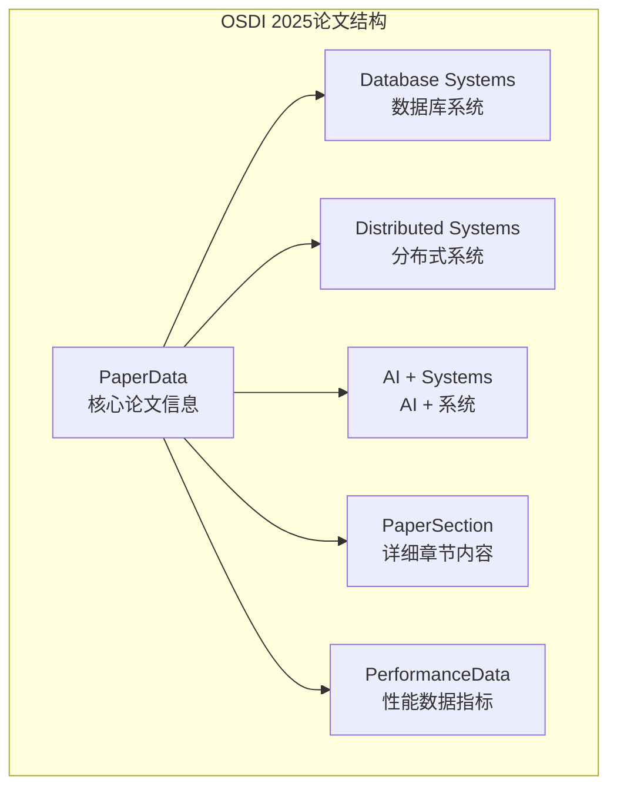
```mermaid
graph TB
subgraph "OSDI 2025论文结构"
A[PaperData<br/>核心论文信息]
B[Database Systems<br/>数据库系统]
C[Distributed Systems<br/>分布式系统]
D[AI + Systems<br/>AI + 系统]
E[PaperSection<br/>详细章节内容]
F[PerformanceData<br/>性能数据指标]
end
A --> B
A --> C
A --> D
A --> E
A --> F
```

**图表来源**
- [conferences.ts:15-121](file://src/data/conferences.ts#L15-L121)

#### ATC 2024论文数据结构

ATC 2024论文数据涵盖了多个技术领域：

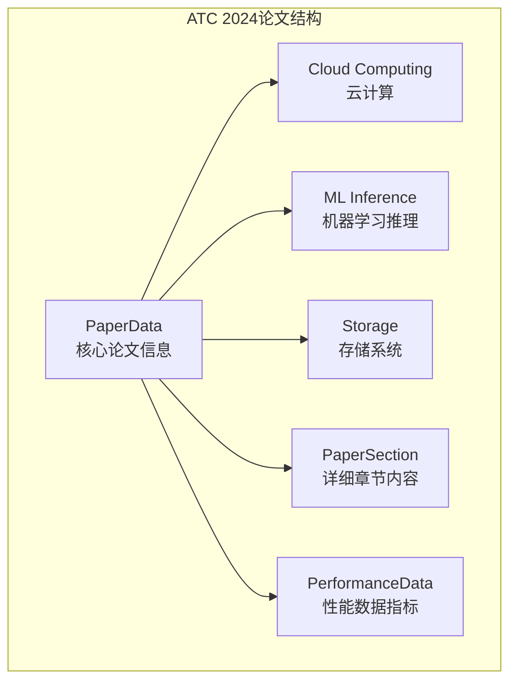
```mermaid
graph TB
subgraph "ATC 2024论文结构"
A[PaperData<br/>核心论文信息]
B[Cloud Computing<br/>云计算]
C[ML Inference<br/>机器学习推理]
D[Storage<br/>存储系统]
E[PaperSection<br/>详细章节内容]
F[PerformanceData<br/>性能数据指标]
end
A --> B
A --> C
A --> D
A --> E
A --> F
```

**图表来源**
- [conferences.ts:125-228](file://src/data/conferences.ts#L125-L228)

#### 论文解读组件设计

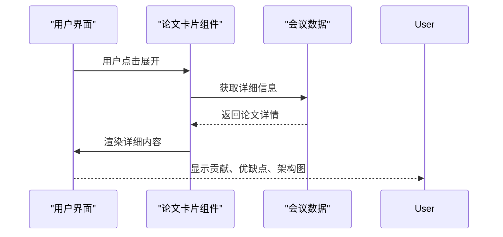
```mermaid
sequenceDiagram
participant UI as "用户界面"
participant Card as "论文卡片组件"
participant Data as "会议数据"
UI->>Card : 用户点击展开
Card->>Data : 获取详细信息
Data-->>Card : 返回论文详情
Card->>UI : 渲染详细内容
UI-->>User : 显示贡献、优缺点、架构图
```

**图表来源**
- [Osdi2025.tsx:6-98](file://src/pages/Osdi2025.tsx#L6-L98)
- [Atc2024.tsx:6-98](file://src/pages/Atc2024.tsx#L6-L98)

**章节来源**
- [conferences.ts:1-279](file://src/data/conferences.ts#L1-L279)
- [Osdi2025.tsx:1-148](file://src/pages/Osdi2025.tsx#L1-L148)
- [Atc2024.tsx:1-148](file://src/pages/Atc2024.tsx#L1-L148)

### FAST会议论文数据模型

**更新** FAST会议论文数据模型是项目的重要扩展，经过重大改进，提供了完整的会议论文解读功能：

#### 数据结构设计原则

1. **会议导向**：围绕FAST会议主题组织论文数据
2. **深度解读**：提供论文贡献、优势、局限性分析
3. **可视化支持**：支持架构图和性能数据展示
4. **多维度分析**：包含技术贡献、性能指标、适用场景等
5. **真实性验证**：通过paperUrl字段链接到原始论文
6. **详细章节**：支持论文详细章节内容展示

#### ArchivePaperData接口定义

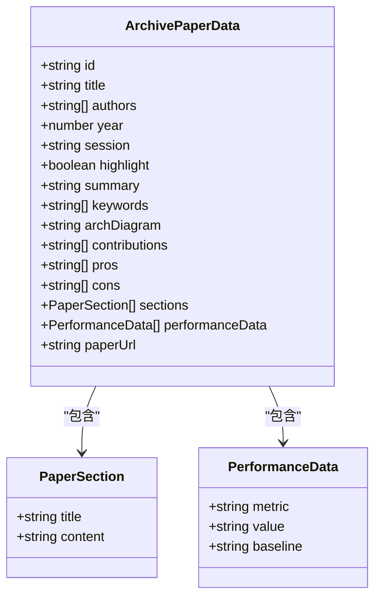
```mermaid
classDiagram
class ArchivePaperData {
+string id
+string title
+string[] authors
+number year
+string session
+boolean highlight
+string summary
+string[] keywords
+string archDiagram
+string[] contributions
+string[] pros
+string[] cons
+PaperSection[] sections
+PerformanceData[] performanceData
+string paperUrl
}
class PaperSection {
+string title
+string content
}
class PerformanceData {
+string metric
+string value
+string baseline
}
ArchivePaperData --> PaperSection : "包含"
ArchivePaperData --> PerformanceData : "包含"
```

**图表来源**
- [fastArchive.ts:3-22](file://src/data/fastArchive.ts#L3-L22)

#### 字段定义和验证规则

| 字段名 | 类型 | 必填 | 验证规则 | 描述 |
|--------|------|------|----------|------|
| id | string | 是 | 唯一性、格式约束 | 论文唯一标识符，包含年份信息 |
| title | string | 是 | 长度限制 | 论文标题 |
| authors | string[] | 是 | 非空、数组验证 | 作者列表 |
| year | number | 是 | 数值范围验证 | 会议年份 |
| session | string | 是 | 枚举验证 | 会议分会场 |
| highlight | boolean | 否 | 布尔验证 | 是否为重点论文 |
| summary | string | 是 | 长度限制 | 论文摘要 |
| keywords | string[] | 是 | 非空验证 | 关键词数组 |
| archDiagram | string | 否 | URL或文本格式验证 | 架构图或文本描述 |
| contributions | string[] | 是 | 非空验证 | 核心贡献列表 |
| pros | string[] | 是 | 非空验证 | 优势列表 |
| cons | string[] | 是 | 非空验证 | 局限性列表 |
| sections | PaperSection[] | 否 | 数组验证 | 详细章节内容 |
| performanceData | PerformanceData[] | 否 | 数组验证 | 性能数据指标 |
| paperUrl | string | 否 | URL格式验证 | 原始论文链接 |

#### 多年度数据组织

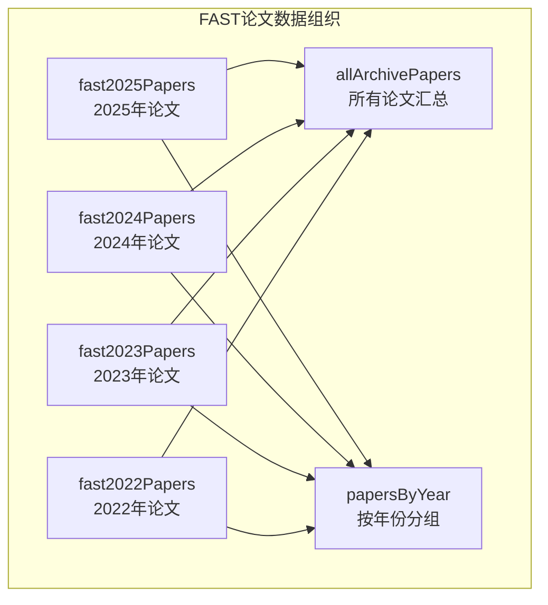
```mermaid
graph TB
subgraph "FAST论文数据组织"
A[fast2025Papers<br/>2025年论文]
B[fast2024Papers<br/>2024年论文]
C[fast2023Papers<br/>2023年论文]
D[fast2022Papers<br/>2022年论文]
E[allArchivePapers<br/>所有论文汇总]
F[papersByYear<br/>按年份分组]
end
A --> E
B --> E
C --> E
D --> E
A --> F
B --> F
C --> F
D --> F
```

**图表来源**
- [fastArchive.ts:25-468](file://src/data/fastArchive.ts#L25-L468)
- [fast2026.ts:26-403](file://src/data/fast2026.ts#L26-L403)
- [fastArchive.ts:1695-3230](file://src/data/fastArchive.ts#L1695-L3230)

#### 真实论文数据结构

**新增** FAST会议档案系统现在包含大量真实研究工作的详细数据结构，每个论文都包含完整的问题背景、技术设计、对比分析、性能评估和局限性说明章节：

##### GogetaFS - 合并元数据管理的去重文件系统
- **核心贡献**：提出LFP映射，合并逻辑-指纹-物理映射
- **性能提升**：元数据维护开销降低38%
- **技术亮点**：单次IO持久化所有元数据，兼容现有文件系统语义
- **详细章节**：包含问题背景、技术设计、性能评估、局限性分析等完整内容
- **新增** paperUrl字段指向原始论文链接，增强数据真实性验证

##### PolyStore - 异构存储架构
- **核心贡献**：提出水平存储架构，打破传统层级模式
- **性能提升**：性能提升1.11-9.38倍
- **技术亮点**：透明细粒度数据放置，最大化累积存储带宽
- **详细章节**：包含问题背景、技术设计、性能评估、局限性分析等完整内容
- **新增** paperUrl字段指向原始论文链接，增强数据真实性验证

##### Integrity Checking - 安全云磁盘完整性校验
- **核心贡献**：提出Dynamic Merkle Trees (DMT)
- **性能提升**：吞吐和延迟提升2.2倍
- **技术亮点**：利用工作负载模式优化，动态适应访问模式变化
- **详细章节**：包含问题背景、技术设计、性能评估、局限性分析等完整内容
- **新增** paperUrl字段指向原始论文链接，增强数据真实性验证

##### MedFS - 移动设备日志结构文件系统
- **核心贡献**：提出元数据启用的增量压缩
- **性能提升**：更新性能提升显著，写放大降低50%+
- **技术亮点**：适合移动设备存储，功耗降低20%
- **详细章节**：包含问题背景、技术设计、性能评估、局限性分析等完整内容
- **新增** paperUrl字段指向原始论文链接，增强数据真实性验证

##### 其他重要论文
- **Mooncake**：LLM服务的KV Cache分离架构，包含5个详细章节，**新增** paperUrl字段
- **Ananke**：云块存储的因果一致性实现，包含5个详细章节，**新增** paperUrl字段  
- **FDP**：Flexible Data Placement的SSD数据放置优化，包含5个详细章节，**新增** paperUrl字段
- **D2FS**：设备驱动的文件系统垃圾回收，包含5个详细章节，**新增** paperUrl字段
- **ScaleLFS**：可扩展的日志结构文件系统，包含5个详细章节，**新增** paperUrl字段
- **ShiftLock**：RDMA锁优化方案，包含5个详细章节，**新增** paperUrl字段
- **GeminiFS**：GPU伴侣文件系统，包含5个详细章节，**新增** paperUrl字段
- **AegonKV**：KV分离的LSM存储系统，包含5个详细章节，**新增** paperUrl字段

每个论文都包含以下标准章节结构：
1. **问题背景与动机** - 阐述研究背景和核心问题
2. **系统架构设计** - 详细介绍技术架构和设计思路  
3. **核心技术设计** - 深入分析关键技术实现
4. **性能评估** - 提供详细的实验数据和性能对比
5. **局限性与适用场景** - 客观分析局限性和应用场景

#### 数据加载机制

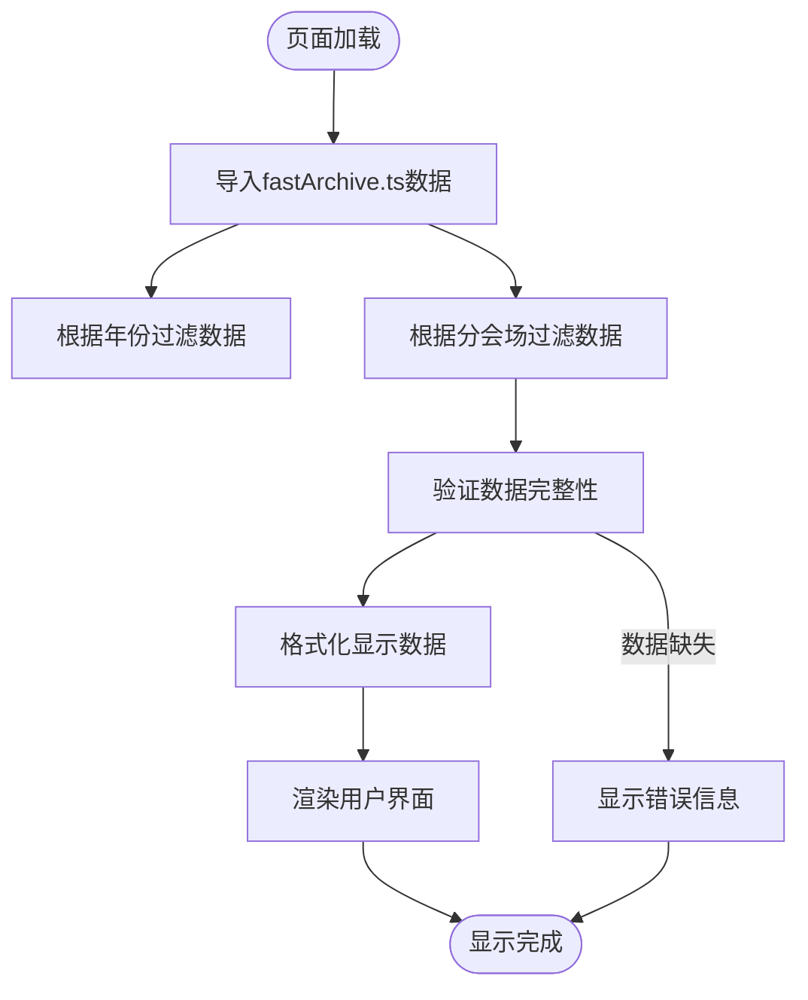
```mermaid
flowchart TD
Start([页面加载]) --> ImportArchive["导入fastArchive.ts数据"]
ImportArchive --> FilterYear["根据年份过滤数据"]
ImportArchive --> FilterSession["根据分会场过滤数据"]
FilterSession --> ValidateData["验证数据完整性"]
ValidateData --> FormatData["格式化显示数据"]
FormatData --> RenderUI["渲染用户界面"]
RenderUI --> End([显示完成])
ValidateData --> |数据缺失| ShowError["显示错误信息"]
ShowError --> End
```

**章节来源**
- [fastArchive.ts:1-3230](file://src/data/fastArchive.ts#L1-L3230)
- [FastArchive.tsx:1-290](file://src/pages/FastArchive.tsx#L1-L290)
- [fast2026.ts:1-405](file://src/data/fast2026.ts#L1-L405)

### 研究团队模型

研究团队数据模型体现了学术机构的组织结构：

#### 团队信息结构

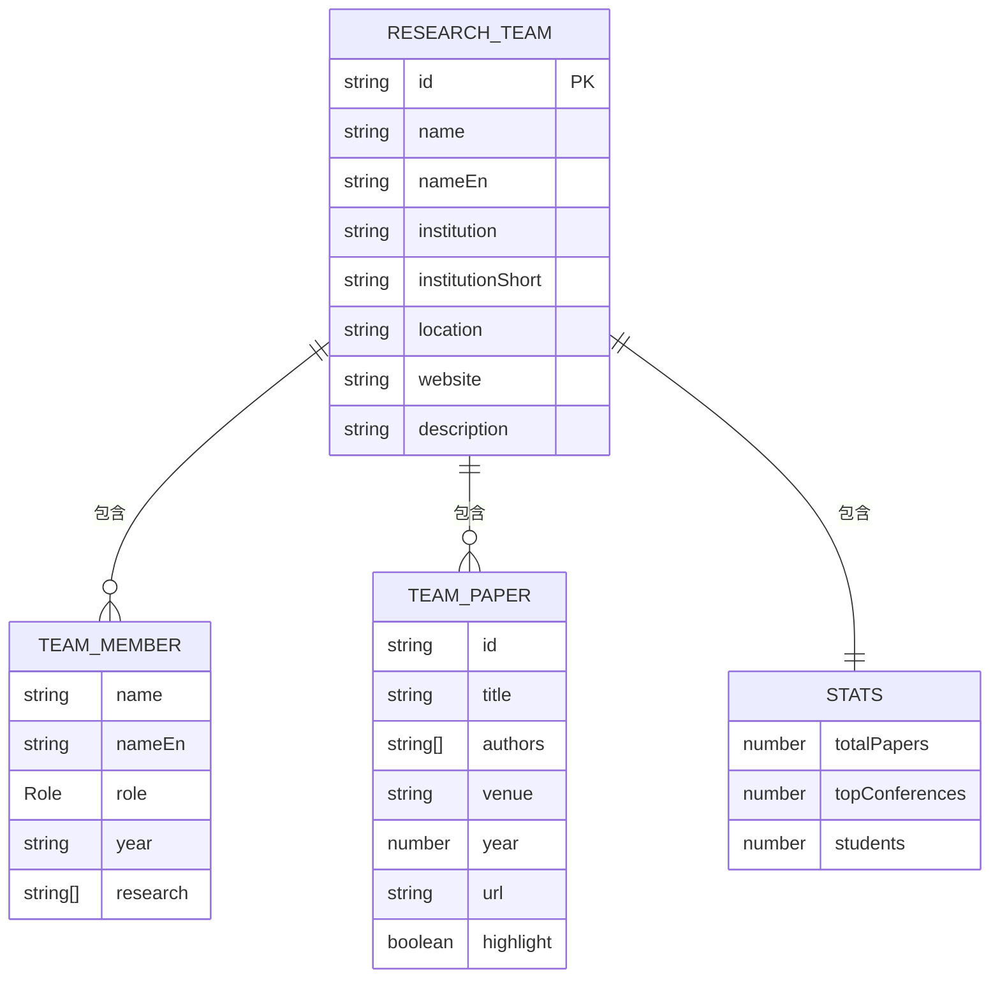
```mermaid
erDiagram
RESEARCH_TEAM {
string id PK
string name
string nameEn
string institution
string institutionShort
string location
string website
string description
}
TEAM_MEMBER {
string name
string nameEn
Role role
string year
string[] research
}
TEAM_PAPER {
string id
string title
string[] authors
string venue
number year
string url
boolean highlight
}
STATS {
number totalPapers
number topConferences
number students
}
RESEARCH_TEAM ||--o{ TEAM_MEMBER : "包含"
RESEARCH_TEAM ||--o{ TEAM_PAPER : "包含"
RESEARCH_TEAM ||--|| STATS : "包含"
```

**图表来源**
- [teams.ts:19-37](file://src/data/teams.ts#L19-L37)

#### 团队数据验证

团队数据模型包含以下验证规则：
- **唯一性约束**：团队ID必须唯一
- **角色验证**：成员角色必须在预定义集合中
- **统计完整性**：统计数据必须为非负数
- **链接有效性**：网站URL必须为有效格式

**章节来源**
- [teams.ts:1-168](file://src/data/teams.ts#L1-L168)
- [Teams.tsx:1-134](file://src/pages/Teams.tsx#L1-L134)

### 存储故障模型

存储故障数据模型用于记录和分析存储系统的故障情况：

#### 故障分类体系

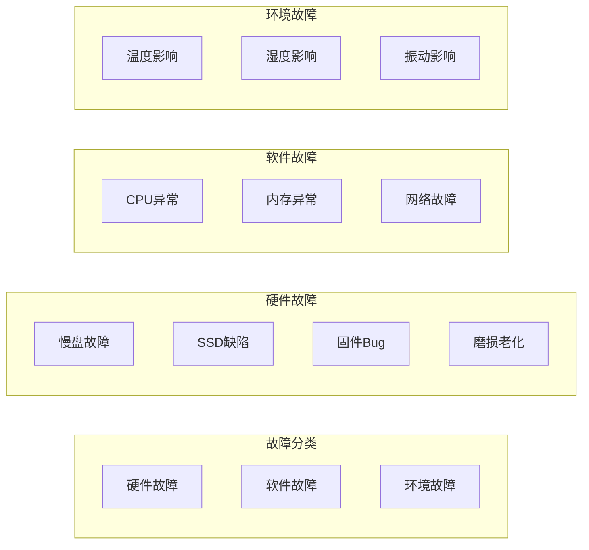
```mermaid
graph LR
subgraph "故障分类"
A[硬件故障]
B[软件故障]
C[环境故障]
end
subgraph "硬件故障"
A1[慢盘故障]
A2[SSD缺陷]
A3[固件Bug]
A4[磨损老化]
end
subgraph "软件故障"
B1[CPU异常]
B2[内存异常]
B3[网络故障]
end
subgraph "环境故障"
C1[温度影响]
C2[湿度影响]
C3[振动影响]
end
```

**图表来源**
- [faults.ts:1-22](file://src/data/faults.ts#L1-L22)

#### 故障严重程度评估

| 严重程度 | 颜色标识 | 影响范围 | 处理优先级 |
|----------|----------|----------|------------|
| critical | 🔴 | 严重影响系统运行 | 最高优先级 |
| high | 🟠 | 显著影响性能 | 高优先级 |
| medium | 🟡 | 中等影响 | 中等优先级 |
| low | 🟢 | 轻微影响 | 低优先级 |

**章节来源**
- [faults.ts:1-817](file://src/data/faults.ts#L1-L817)

### 开源项目模型

开源项目数据模型用于展示和管理存储系统相关的开源项目：

#### 项目分类体系

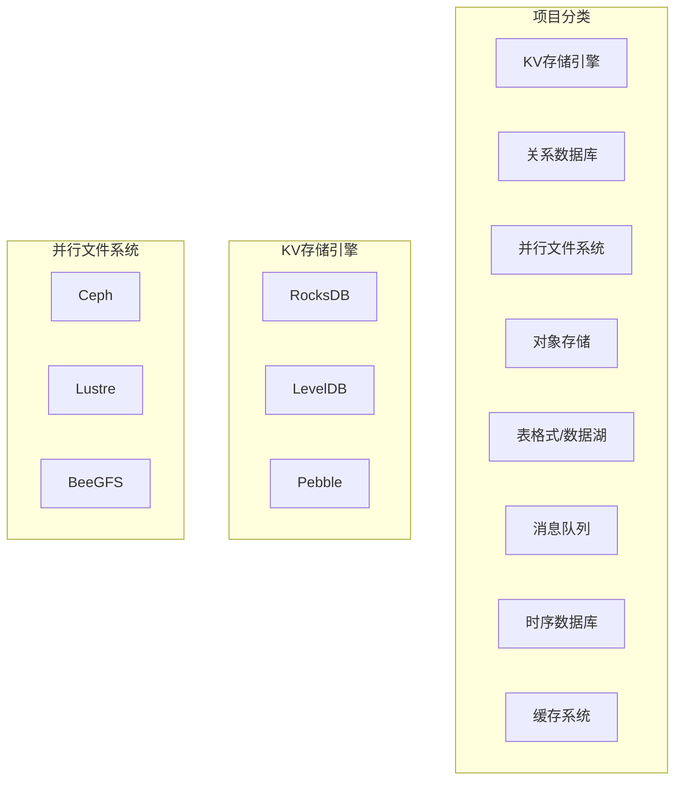
```mermaid
graph TB
subgraph "项目分类"
A[KV存储引擎]
B[关系数据库]
C[并行文件系统]
D[对象存储]
E[表格式/数据湖]
F[消息队列]
G[时序数据库]
H[缓存系统]
end
subgraph "KV存储引擎"
A1[RocksDB]
A2[LevelDB]
A3[Pebble]
end
subgraph "并行文件系统"
C1[Ceph]
C2[Lustre]
C3[BeeGFS]
end
```

**图表来源**
- [opensource.ts:1-58](file://src/data/opensource.ts#L1-L58)

**章节来源**
- [opensource.ts:1-1110](file://src/data/opensource.ts#L1-L1110)

## 依赖关系分析

项目的数据模型之间存在复杂的依赖关系：

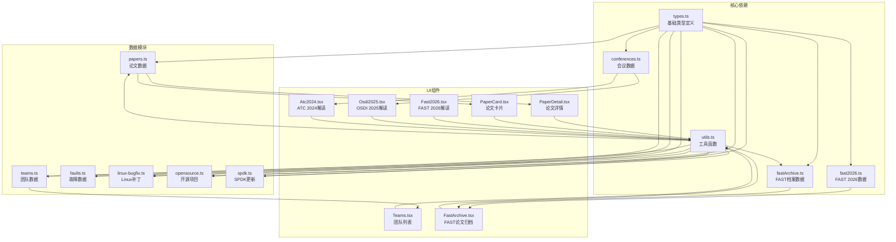
```mermaid
graph TD
subgraph "核心依赖"
A[types.ts<br/>基础类型定义]
B[utils.ts<br/>工具函数]
C[conferences.ts<br/>会议数据]
D[fast2026.ts<br/>FAST 2026数据]
E[fastArchive.ts<br/>FAST档案数据]
end
subgraph "数据模块"
F[papers.ts<br/>论文数据]
G[teams.ts<br/>团队数据]
H[faults.ts<br/>故障数据]
I[linux-bugfix.ts<br/>Linux补丁]
J[opensource.ts<br/>开源项目]
K[spdk.ts<br/>SPDK更新]
end
subgraph "UI组件"
L[PaperDetail.tsx<br/>论文详情]
M[Teams.tsx<br/>团队列表]
N[PaperCard.tsx<br/>论文卡片]
O[FastArchive.tsx<br/>FAST论文归档]
P[Fast2026.tsx<br/>FAST 2026解读]
Q[Osdi2025.tsx<br/>OSDI 2025解读]
R[Atc2024.tsx<br/>ATC 2024解读]
end
A --> F
A --> G
A --> H
A --> E
A --> I
A --> J
A --> K
A --> C
A --> D
B --> F
B --> G
B --> H
B --> E
B --> I
B --> J
B --> K
C --> Q
C --> R
D --> O
E --> O
F --> L
F --> N
G --> M
L --> B
M --> B
N --> B
O --> B
P --> B
Q --> B
R --> B
```

**图表来源**
- [types.ts:1-49](file://src/data/types.ts#L1-L49)
- [utils.ts:1-58](file://src/lib/utils.ts#L1-L58)
- [PaperDetail.tsx:1-151](file://src/pages/PaperDetail.tsx#L1-L151)
- [Teams.tsx:1-134](file://src/pages/Teams.tsx#L1-L134)
- [PaperCard.tsx:1-73](file://src/components/PaperCard.tsx#L1-L73)
- [FastArchive.tsx:1-290](file://src/pages/FastArchive.tsx#L1-L290)
- [Fast2026.tsx:1-236](file://src/pages/Fast2026.tsx#L1-L236)
- [Osdi2025.tsx:1-148](file://src/pages/Osdi2025.tsx#L1-L148)
- [Atc2024.tsx:1-148](file://src/pages/Atc2024.tsx#L1-L148)
- [conferences.ts:1-279](file://src/data/conferences.ts#L1-L279)
- [fast2026.ts:1-405](file://src/data/fast2026.ts#L1-L405)

**章节来源**
- [utils.ts:1-58](file://src/lib/utils.ts#L1-L58)
- [PaperDetail.tsx:1-151](file://src/pages/PaperDetail.tsx#L1-L151)
- [Teams.tsx:1-134](file://src/pages/Teams.tsx#L1-L134)
- [PaperCard.tsx:1-73](file://src/components/PaperCard.tsx#L1-L73)
- [FastArchive.tsx:1-290](file://src/pages/FastArchive.tsx#L1-L290)

## 性能考虑

### 数据加载优化

1. **懒加载策略**：通过路由懒加载减少初始包大小
2. **数据分片**：将大型数据文件拆分为多个模块
3. **缓存机制**：利用浏览器缓存减少重复加载
4. **按需加载**：FAST论文按年份和分会场分组加载
5. **会议数据优化**：OSDI 2025和ATC 2024数据按会话分组加载
6. **性能数据优化**：新增的performanceData字段支持性能指标缓存
7. **章节内容优化**：论文详细章节内容按需加载，减少初始渲染负担
8. **新增** paperUrl字段优化：通过外部链接减少本地数据存储需求，提高数据加载效率

### 查询性能优化

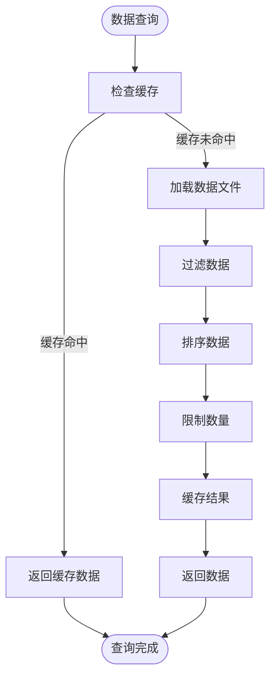
```mermaid
flowchart TD
Start([数据查询]) --> CheckCache["检查缓存"]
CheckCache --> |缓存命中| ReturnCache["返回缓存数据"]
CheckCache --> |缓存未命中| LoadData["加载数据文件"]
LoadData --> FilterData["过滤数据"]
FilterData --> SortData["排序数据"]
SortData --> LimitData["限制数量"]
LimitData --> CacheData["缓存结果"]
CacheData --> ReturnData["返回数据"]
ReturnCache --> End([查询完成])
ReturnData --> End
```

### 内存使用优化

1. **数据压缩**：使用压缩算法减少存储空间
2. **按需加载**：只加载当前页面需要的数据
3. **垃圾回收**：及时清理不再使用的数据引用
4. **分页加载**：FAST论文列表支持分页显示
5. **架构图懒加载**：论文详细内容按需加载
6. **性能数据分组**：按会话和年份分组存储，减少内存占用
7. **章节内容优化**：论文详细章节内容按需渲染，减少内存占用
8. **新增** paperUrl字段优化：通过外部链接减少内存占用，提高内存使用效率

## 故障排除指南

### 常见数据问题

| 问题类型 | 症状 | 解决方案 |
|----------|------|----------|
| 数据格式错误 | 页面显示空白或报错 | 检查JSON格式，验证字段完整性 |
| 数据缺失 | 部分字段为空 | 添加默认值，提供降级显示 |
| 类型不匹配 | 编译错误 | 更新类型定义，确保类型一致性 |
| 性能问题 | 页面加载缓慢 | 实施分页，优化数据结构 |
| 架构图显示问题 | 图片加载失败 | 检查图片路径，验证文件存在性 |
| 性能数据缺失 | 指标显示为空 | 检查数据格式，验证字段完整性 |
| 会议数据加载失败 | OSDI/ATC页面空白 | 检查conferences.ts数据格式 |
| paperUrl链接失效 | 论文链接无法访问 | 验证原始论文链接有效性 |
| 章节内容显示异常 | 详细章节内容格式错误 | 检查Markdown格式，验证内容结构 |
| **新增** paperUrl字段问题 | 论文链接无法访问 | 检查paperUrl字段格式，验证链接有效性 |

### 数据验证错误处理

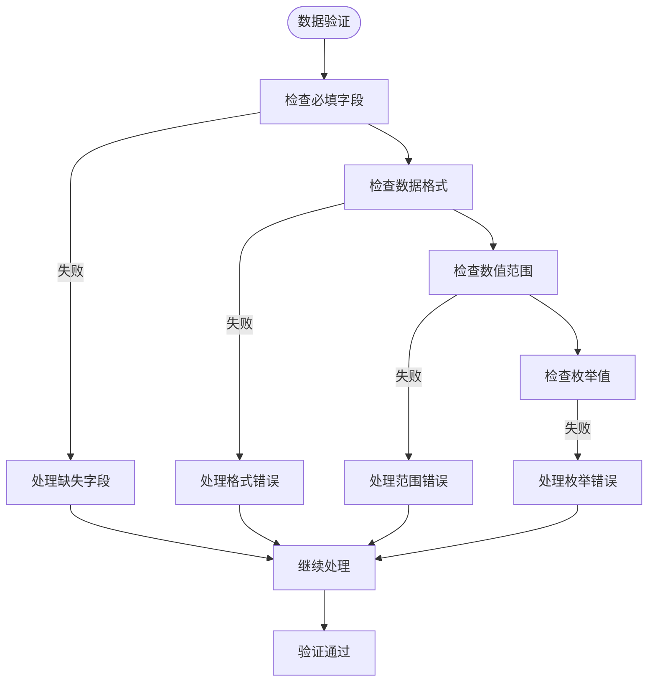
```mermaid
flowchart TD
Validate([数据验证]) --> CheckRequired["检查必填字段"]
CheckRequired --> CheckFormat["检查数据格式"]
CheckFormat --> CheckRange["检查数值范围"]
CheckRange --> CheckEnum["检查枚举值"]
CheckRequired --> |失败| HandleRequired["处理缺失字段"]
CheckFormat --> |失败| HandleFormat["处理格式错误"]
CheckRange --> |失败| HandleRange["处理范围错误"]
CheckEnum --> |失败| HandleEnum["处理枚举错误"]
HandleRequired --> Continue[继续处理]
HandleFormat --> Continue
HandleRange --> Continue
HandleEnum --> Continue
Continue --> Success[验证通过]
```

**章节来源**
- [faults.ts:1-817](file://src/data/faults.ts#L1-L817)
- [utils.ts:1-58](file://src/lib/utils.ts#L1-L58)

## 结论

cs336项目的数据模型设计体现了现代前端应用的最佳实践：

1. **类型安全**：通过TypeScript确保数据的类型一致性
2. **模块化设计**：清晰的数据分离便于维护和扩展
3. **性能优化**：合理的数据结构和加载策略
4. **用户体验**：直观的数据展示和交互设计
5. **内容丰富**：支持论文解读、架构分析、性能数据等多样化内容

**更新** 新增的OSDI 2025和ATC 2024会议论文数据模型为项目增加了重要的学术内容展示功能，通过详细的论文解读、架构分析和性能数据展示，为存储系统、计算机科学和人工智能领域的信息管理提供了更加完整的解决方案。FAST会议档案系统的重大改进，特别是添加paperUrl字段和替换虚构论文为真实研究工作的做法，大大增强了数据的真实性、可信度和学术价值。

**新增** ArchivePaperData接口扩展，新增paperUrl字段支持，显著增强了论文真实性验证和溯源能力。FAST档案系统现在包含五个详细的学术论文部分，每个论文都包含完整的问题背景、技术设计、对比分析、性能评估和局限性说明章节，显著增强了学术论文的完整性和实用性。这种结构化的论文解读方式不仅提高了数据的学术价值，也为用户提供了更加深入的技术理解和学习资源。

项目的数据模型为存储系统、计算机科学和人工智能领域的信息管理提供了完整的解决方案，既满足了当前的需求，也为未来的扩展奠定了坚实的基础。通过静态数据驱动的方式，项目实现了高性能、可维护和可扩展的数据管理架构。