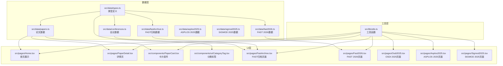
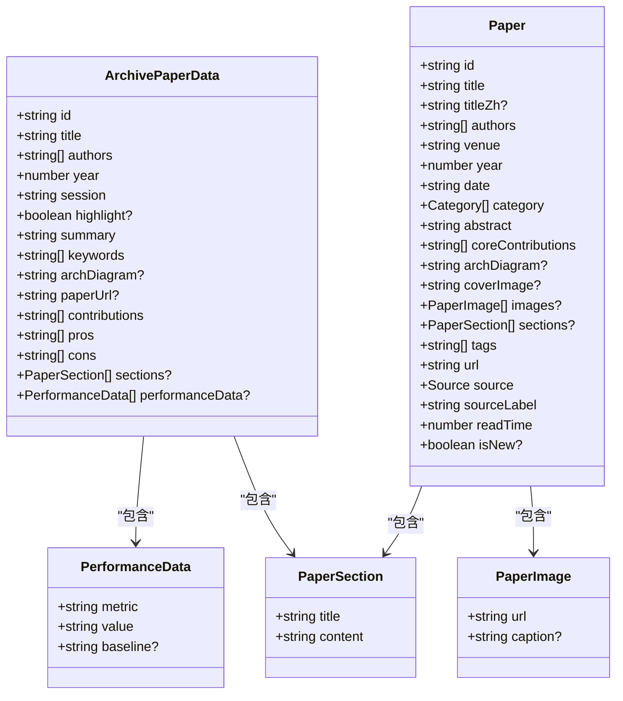
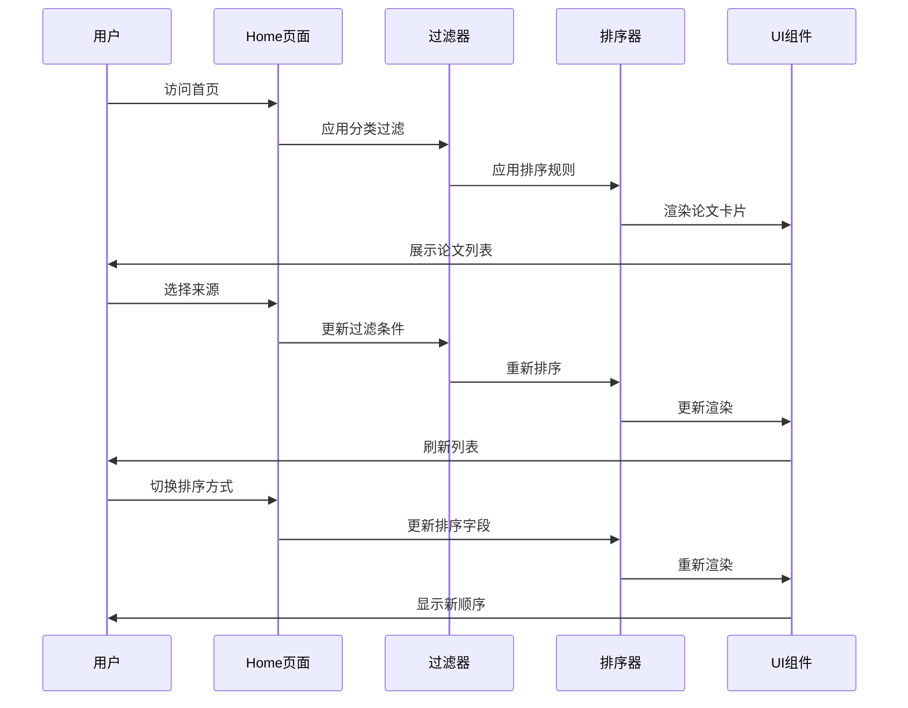
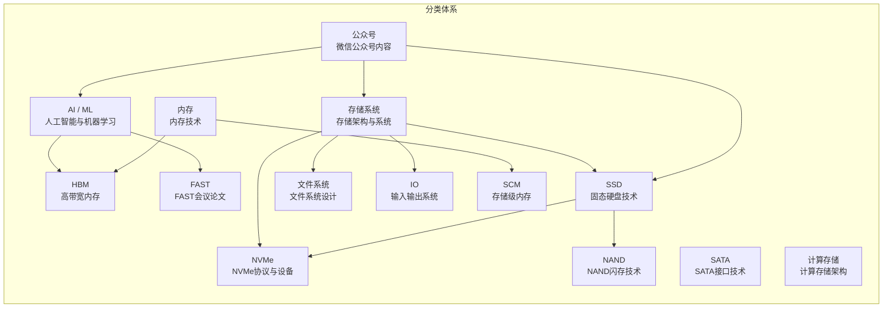
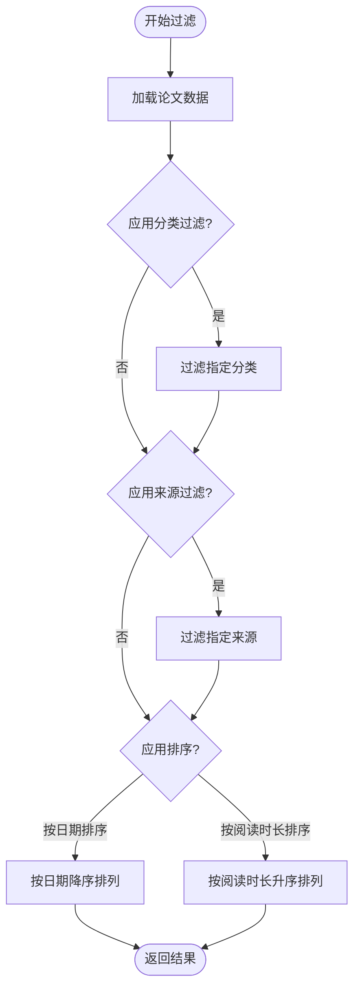
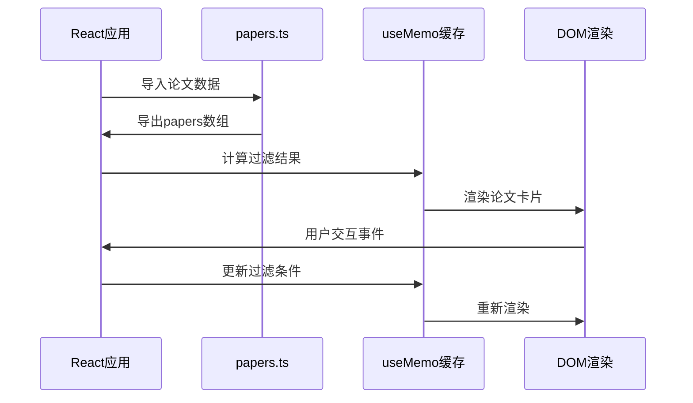
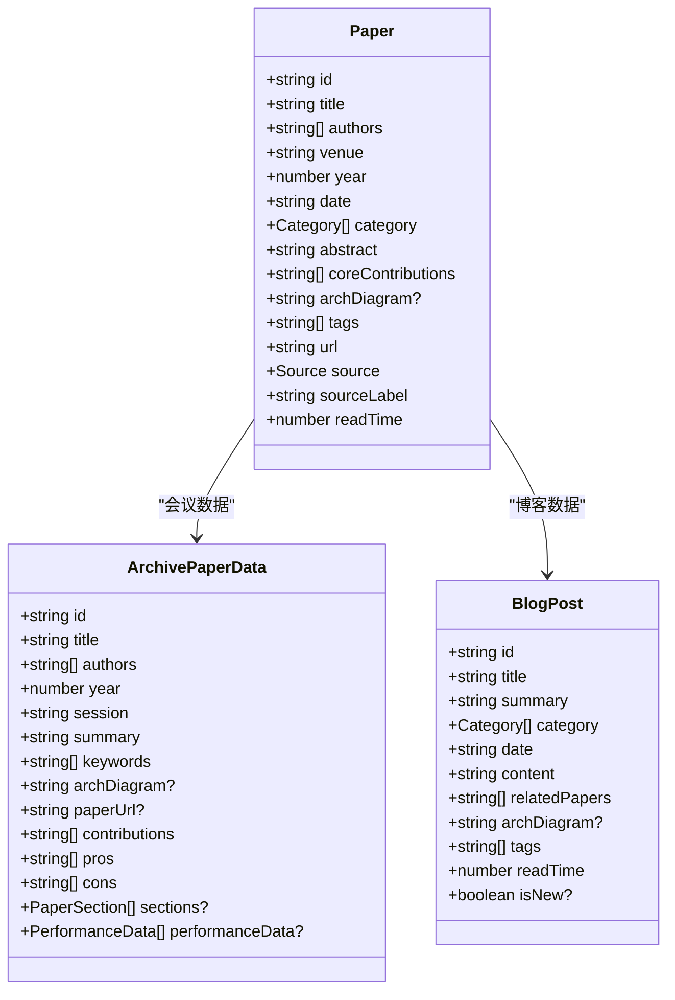
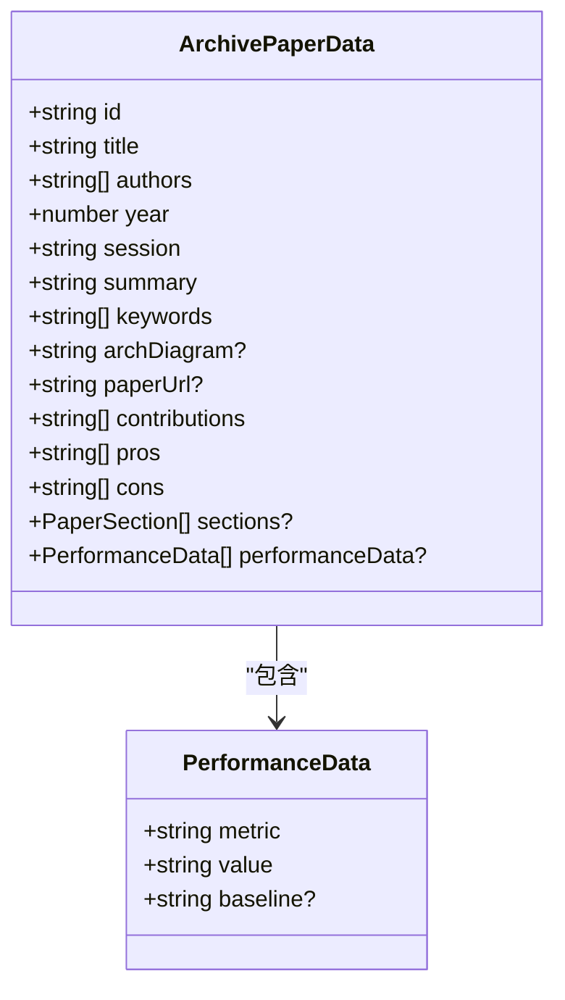
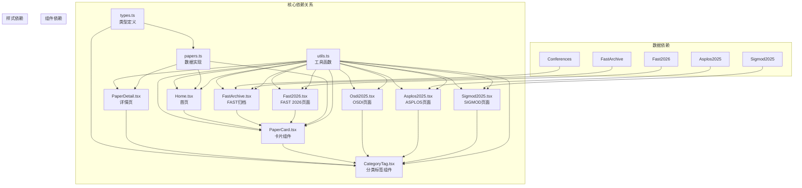

# 论文数据模型

<cite>
**本文档引用的文件**
- [types.ts](file://src/data/types.ts)
- [papers.ts](file://src/data/papers.ts)
- [fast2026.ts](file://src/data/fast2026.ts)
- [fastArchive.ts](file://src/data/fastArchive.ts)
- [Home.tsx](file://src/pages/Home.tsx)
- [PaperDetail.tsx](file://src/pages/PaperDetail.tsx)
- [PaperCard.tsx](file://src/components/PaperCard.tsx)
- [CategoryTag.tsx](file://src/components/ui/CategoryTag.tsx)
- [utils.ts](file://src/lib/utils.ts)
- [conferences.ts](file://src/data/conferences.ts)
- [FastArchive.tsx](file://src/pages/FastArchive.tsx)
- [Fast2026.tsx](file://src/pages/Fast2026.tsx)
- [Osdi2025.tsx](file://src/pages/Osdi2025.tsx)
- [asplos2025.ts](file://src/data/asplos2025.ts)
- [sigmod2025.ts](file://src/data/sigmod2025.ts)
</cite>

## 更新摘要
**所做更改**
- 新增FAST 2025和2022论文数据，完善历届会议论文展示
- 增强ArchivePaperData接口支持更多字段（paperUrl、performanceData等）
- 改进内容渲染能力，支持章节内容、性能数据、优缺点对比等丰富展示
- 更新论文数据模型以支持更完整的学术论文展示需求

## 目录
1. [简介](#简介)
2. [项目结构](#项目结构)
3. [核心组件](#核心组件)
4. [架构概览](#架构概览)
5. [详细组件分析](#详细组件分析)
6. [依赖关系分析](#依赖关系分析)
7. [性能考虑](#性能考虑)
8. [故障排除指南](#故障排除指南)
9. [结论](#结论)

## 简介

本文档详细阐述了论文数据模型的设计与实现，重点关注Paper接口的完整结构、字段验证规则、业务含义以及查询过滤排序的最佳实践。该数据模型服务于存储与AI交叉领域的论文展示系统，支持多种来源（DBLP会议、arXiv预印本、微信公众号）的论文内容管理。

**更新** 本次更新重点关注新增的FAST 2025和2022论文数据，以及增强的ArchivePaperData接口支持。系统现已支持历届FAST会议论文的完整展示，包括详细的章节内容、性能数据、优缺点对比、架构图等多种展示元素。新增的paperUrl字段支持直接链接到原始论文，performanceData字段提供结构化的性能指标展示。

## 项目结构

该项目采用React + TypeScript构建，数据模型位于`src/data/`目录下，UI组件位于`src/components/`和`src/pages/`目录下。整体架构遵循分层设计原则：



**图表来源**
- [types.ts:1-49](file://src/data/types.ts#L1-L49)
- [papers.ts:1-847](file://src/data/papers.ts#L1-L847)
- [fast2026.ts:1-405](file://src/data/fast2026.ts#L1-L405)
- [fastArchive.ts:1-4074](file://src/data/fastArchive.ts#L1-L4074)
- [Home.tsx:1-209](file://src/pages/Home.tsx#L1-L209)
- [PaperDetail.tsx:1-151](file://src/pages/PaperDetail.tsx#L1-L151)
- [PaperCard.tsx:1-73](file://src/components/PaperCard.tsx#L1-L73)
- [CategoryTag.tsx:1-25](file://src/components/ui/CategoryTag.tsx#L1-L25)
- [utils.ts:1-58](file://src/lib/utils.ts#L1-L58)
- [conferences.ts:1-279](file://src/data/conferences.ts#L1-L279)
- [FastArchive.tsx:1-426](file://src/pages/FastArchive.tsx#L1-L426)
- [Fast2026.tsx:1-236](file://src/pages/Fast2026.tsx#L1-L236)
- [Osdi2025.tsx:1-148](file://src/pages/Osdi2025.tsx#L1-L148)
- [asplos2025.ts:1-147](file://src/data/asplos2025.ts#L1-L147)
- [sigmod2025.ts:1-159](file://src/data/sigmod2025.ts#L1-L159)

**章节来源**
- [types.ts:1-49](file://src/data/types.ts#L1-L49)
- [papers.ts:1-847](file://src/data/papers.ts#L1-L847)
- [fast2026.ts:1-405](file://src/data/fast2026.ts#L1-L405)
- [fastArchive.ts:1-4074](file://src/data/fastArchive.ts#L1-L4074)

## 核心组件

### Paper接口定义

Paper接口是整个数据模型的核心，定义了论文的完整结构。该接口采用TypeScript的严格类型系统，确保数据的一致性和完整性。

#### 必需字段

| 字段名 | 类型 | 验证规则 | 业务含义 |
|--------|------|----------|----------|
| `id` | `string` | 唯一标识符，格式：`{source}-{year}-{title-slug}` | 论文唯一标识，用于路由导航和缓存键 |
| `title` | `string` | 非空字符串，长度>0 | 英文论文标题，国际化显示的主标题 |
| `authors` | `string[]` | 数组，至少包含一个作者 | 作者列表，支持多作者论文 |
| `venue` | `string` | 非空字符串，会议或期刊名称 | 论文发表的会议或期刊名称 |
| `year` | `number` | 整数，合理年份范围 | 论文发表年份，用于排序和筛选 |
| `date` | `string` | ISO 8601日期格式 | 论文具体发表日期，精确到日 |
| `category` | `Category[]` | 枚举数组，至少一个类别 | 论文所属的技术领域分类 |
| `abstract` | `string` | 非空字符串，长度>0 | 论文摘要内容，用于展示和SEO |
| `coreContributions` | `string[]` | 数组，至少包含一个贡献点 | 核心贡献列表，每项描述一个主要创新点 |
| `tags` | `string[]` | 字符串数组 | 关键词标签，用于搜索和分类 |
| `url` | `string` | 有效URL格式 | 原始论文链接，指向DBLP、arXiv或微信公众号 |
| `source` | `'dblp' \| 'arxiv' \| 'wechat'` | 枚举限定值 | 论文来源标识，决定样式和行为 |
| `sourceLabel` | `string` | 非空字符串 | 来源的人类可读标签 |
| `readTime` | `number` | 正整数，分钟单位 | 预估阅读时长，用于性能优化 |

#### 可选字段

| 字段名 | 类型 | 默认值 | 业务含义 |
|--------|------|--------|----------|
| `titleZh` | `string` | undefined | 中文标题，支持双语显示 |
| `coverImage` | `string` | undefined | 封面图片URL，用于详情页头部展示 |
| `images` | `PaperImage[]` | undefined | 图片集合，包含图片URL和可选说明 |
| `sections` | `PaperSection[]` | undefined | 详细章节内容，支持长文结构化展示 |
| `isNew` | `boolean` | undefined | 新文章标记，用于突出显示 |
| `archDiagram` | `string` | undefined | 架构图路径或内容，支持图片路径和文本内容两种形式 |

#### 新增ArchivePaperData接口

**更新** 新增了ArchivePaperData接口，用于FAST会议论文的详细展示：



**图表来源**
- [fastArchive.ts:3-23](file://src/data/fastArchive.ts#L3-L23)
- [types.ts:3-11](file://src/data/types.ts#L3-L11)
- [types.ts:13-34](file://src/data/types.ts#L13-L34)

**章节来源**
- [types.ts:1-49](file://src/data/types.ts#L1-L49)
- [fastArchive.ts:3-23](file://src/data/fastArchive.ts#L3-L23)

### 新增的论文数据源

**更新** 系统现已支持多个会议和期刊的论文数据源：

#### FAST会议论文数据

**FAST 2025论文数据**：
- 包含Mooncake、Ananke、FDP等重要论文
- 支持详细的章节内容、性能数据、优缺点对比
- 新增paperUrl字段支持直接链接到原始论文

**FAST 2022论文数据**：
- 包含WOM-v等重要论文
- 支持完整的学术论文展示内容
- 包含详细的性能评估数据

#### 其他会议论文数据

**ASPLOS 2025论文数据**：
- 包含PIM-DB、CCXL、LLM-Chip等论文
- 支持架构图展示和关键词标注

**SIGMOD 2025论文数据**：
- 包含DuckDB++、ML-SQL、VectorJoin等论文
- 支持HTAP、向量相似性连接等主题

**章节来源**
- [fastArchive.ts:25-4074](file://src/data/fastArchive.ts#L25-L4074)
- [asplos2025.ts:1-147](file://src/data/asplos2025.ts#L1-L147)
- [sigmod2025.ts:1-159](file://src/data/sigmod2025.ts#L1-L159)

### 增强的内容渲染能力

**更新** 系统现已支持更丰富的内容渲染能力：

#### 章节内容渲染

支持Markdown样式的章节内容渲染，包括：
- 标题层级（#、##、###）
- 无序列表和有序列表
- 表格渲染
- 内联样式（粗体、代码）

#### 性能数据展示

新增的performanceData字段支持：
- 结构化的性能指标展示
- 基准值对比显示
- 响应式网格布局

#### 优缺点对比展示

支持论文优缺点的可视化展示：
- 绿色优势面板
- 红色局限性面板
- 图标化视觉反馈

**章节来源**
- [FastArchive.tsx:6-103](file://src/pages/FastArchive.tsx#L6-L103)
- [FastArchive.tsx:176-195](file://src/pages/FastArchive.tsx#L176-L195)
- [FastArchive.tsx:212-248](file://src/pages/FastArchive.tsx#L212-L248)

## 架构概览

系统采用声明式数据绑定和函数式组件设计，通过React Hooks实现状态管理。数据流从静态JSON文件流向UI组件，支持实时过滤和排序。



**图表来源**
- [Home.tsx:15-33](file://src/pages/Home.tsx#L15-L33)
- [papers.ts:1-847](file://src/data/papers.ts#L1-L847)

## 详细组件分析

### 分类系统（Category枚举）

分类系统是论文数据模型的重要组成部分，采用TypeScript字面量类型联合实现强类型约束。

#### 分类枚举定义



**图表来源**
- [types.ts](file://src/data/types.ts#L1)
- [utils.ts:9-27](file://src/lib/utils.ts#L9-L27)

#### 分类映射与样式

分类系统通过工具函数实现映射和样式应用：

| 分类 | 样式类 | 标签文本 | 用途 |
|------|--------|----------|------|
| `AI` | `tag-ai` | `AI / ML` | 人工智能相关论文 |
| `Storage` | `tag-storage` | `存储系统` | 存储系统相关论文 |
| `SSD` | `tag-ssd` | `SSD` | 固态硬盘技术论文 |
| `FileSystem` | `tag-fs` | `文件系统` | 文件系统设计论文 |
| `WeChat` | `tag-wechat` | `公众号` | 微信公众号内容 |
| `HBM` | `tag-ai` | `HBM` | 高带宽内存论文 |
| `FAST` | `tag-ai` | `FAST` | FAST会议论文 |
| `NAND` | `tag-ssd` | `NAND` | NAND闪存技术论文 |
| `SCM` | `tag-storage` | `SCM` | 存储级内存论文 |
| `Memory` | `tag-ai` | `内存` | 内存技术论文 |
| `NVMe` | `tag-ssd` | `NVMe` | NVMe协议论文 |
| `SATA` | `tag-ssd` | `SATA` | SATA接口论文 |
| `Computational Storage` | `tag-storage` | `计算存储` | 计算存储架构论文 |
| `IO` | `tag-storage` | `IO` | 输入输出系统论文 |

**章节来源**
- [types.ts](file://src/data/types.ts#L1)
- [utils.ts:9-47](file://src/lib/utils.ts#L9-L47)

### 论文来源标识系统

系统支持三种论文来源，每种来源都有独特的标识和行为特征。

#### 来源枚举定义

```mermaid
graph TD
subgraph "论文来源系统"
Source[subgraph "Source 枚举"]
DBLP[dblp<br/>DBLP会议论文]
ARXIV[arxiv<br/>arXiv预印本]
WECHAT[wechat<br/>微信公众号]
end
Icon[subgraph "来源图标映射"]
DBLPIcon[🔬<br/>DBLP图标]
ARXIVIcon[📄<br/>arXiv图标]
WECHATIcon[💬<br/>微信图标]
end
Label[subgraph "来源标签映射"]
DBLPLbl[DBLP 会议<br/>DBLP会议论文]
ARXIVLbl[arXiv 2025<br/>arXiv预印本]
WECHATLbl[存储随笔<br/>微信公众号]
end
end
Source --> Icon
Source --> Label
```

**图表来源**
- [types.ts](file://src/data/types.ts#L30)
- [utils.ts:54-57](file://src/lib/utils.ts#L54-L57)

#### 来源差异对比

| 特征 | DBLP | arXiv | 微信公众号 |
|------|------|-------|------------|
| **数据性质** | 会议论文 | 学术预印本 | 技术解读文章 |
| **权威性** | 高 | 中等 | 中等 |
| **更新频率** | 年度/季度 | 持续 | 每日 |
| **内容深度** | 深入研究 | 原始研究 | 解读分析 |
| **目标读者** | 研究人员 | 学术界 | 工程师/开发者 |
| **展示方式** | 标准论文 | 研究论文 | 解读文章 |

**章节来源**
- [papers.ts:1-847](file://src/data/papers.ts#L1-L847)
- [utils.ts:54-57](file://src/lib/utils.ts#L54-L57)

### 查询、过滤和排序最佳实践

系统实现了完整的前端数据查询和过滤功能，支持多维度过滤和排序。

#### 过滤实现



**图表来源**
- [Home.tsx:20-33](file://src/pages/Home.tsx#L20-L33)

#### 过滤逻辑实现

系统使用React的useMemo Hook实现高效的数据过滤和缓存：

```typescript
// 过滤和排序逻辑
const filtered = useMemo(() => {
    let list = [...papers]
    if (activeCategory !== 'All') {
        list = list.filter(p => p.category.includes(activeCategory))
    }
    if (activeSource !== 'all') {
        list = list.filter(p => p.source === activeSource)
    }
    list.sort((a, b) => {
        if (sortBy === 'date') return new Date(b.date).getTime() - new Date(a.date).getTime()
        return a.readTime - b.readTime
    })
    return list
}, [activeCategory, activeSource, sortBy])
```

**章节来源**
- [Home.tsx:15-33](file://src/pages/Home.tsx#L15-L33)

### 数据加载和缓存策略

系统采用静态数据加载和内存缓存策略，确保良好的用户体验。

#### 数据加载流程



**图表来源**
- [Home.tsx:1-209](file://src/pages/Home.tsx#L1-L209)
- [papers.ts:1-847](file://src/data/papers.ts#L1-L847)

#### 缓存策略

1. **静态导入缓存**：论文数据通过静态导入方式加载，浏览器缓存机制自动缓存
2. **React.memo优化**：PaperCard组件使用React.memo防止不必要的重渲染
3. **useMemo计算缓存**：过滤和排序结果通过useMemo缓存，避免重复计算
4. **CSS类缓存**：分类标签样式通过预定义类名缓存，避免运行时计算

**章节来源**
- [PaperCard.tsx:1-73](file://src/components/PaperCard.tsx#L1-L73)
- [Home.tsx:15-33](file://src/pages/Home.tsx#L15-L33)

### 增强的架构图和内容展示

**更新** 系统现已支持更丰富的架构图和内容展示：

#### 架构图字段类型定义

架构图字段在不同类型的数据接口中有不同的定义：



**图表来源**
- [types.ts:13-34](file://src/data/types.ts#L13-L34)
- [fastArchive.ts:3-23](file://src/data/fastArchive.ts#L3-L23)
- [conferences.ts:1-13](file://src/data/conferences.ts#L1-L13)
- [asplos2025.ts:1-13](file://src/data/asplos2025.ts#L1-L13)

#### 内容渲染增强

**FAST 2026页面实现**：
```typescript
// 架构图渲染逻辑
{paper.archDiagram && (
  <div>
    <h4 className="text-xs font-semibold text-muted-foreground uppercase tracking-wide mb-2">系统架构图</h4>
    <div className="rounded-lg overflow-hidden border border-primary/30 ring-2 ring-primary/10">
      
    </div>
  </div>
)}
```

**FAST归档页面实现**：
```typescript
// 架构图渲染逻辑
{paper.archDiagram && expanded && (
  <div className="mt-3 pt-3 border-t border-border/50">
    <h4 className="text-xs font-semibold text-foreground mb-2">架构图</h4>
    {paper.archDiagram.startsWith('/') ? (
      
    ) : (
      <pre className="text-xs text-muted-foreground bg-surface-raised rounded-lg p-3 overflow-x-auto whitespace-pre font-mono leading-tight">{paper.archDiagram.trim()}</pre>
    )}
  </div>
)}
```

**章节来源**
- [Fast2026.tsx:124-137](file://src/pages/Fast2026.tsx#L124-L137)
- [FastArchive.tsx:198-210](file://src/pages/FastArchive.tsx#L198-L210)
- [conferences.ts:24-25](file://src/data/conferences.ts#L24-L25)
- [asplos2025.ts:24](file://src/data/asplos2025.ts#L24)

### 性能数据增强

**更新** 新增了详细的性能数据字段，支持更丰富的性能指标展示：

#### 性能数据结构



**图表来源**
- [fastArchive.ts:18-22](file://src/data/fastArchive.ts#L18-L22)
- [fastArchive.ts:2703-2706](file://src/data/fastArchive.ts#L2703-L2706)

#### 性能数据使用示例

FAST 2025论文中的性能数据展示：

```typescript
// 性能数据渲染
{paper.performanceData && paper.performanceData.length > 0 && (
  <div className="mt-3 pt-3 border-t border-border/50">
    <div className="grid grid-cols-2 sm:grid-cols-4 gap-2">
      {paper.performanceData.map((perf, i) => (
        <div key={i} className="bg-surface-raised rounded-lg p-2 text-center">
          <div className="text-sm font-bold text-primary">{perf.value}</div>
          <div className="text-xs text-muted-foreground">{perf.metric}</div>
          {perf.baseline && (
            <div className="text-xs text-muted-foreground/70">基准: {perf.baseline}</div>
          )}
        </div>
      ))}
    </div>
  </div>
)}
```

**章节来源**
- [FastArchive.tsx:177-195](file://src/pages/FastArchive.tsx#L177-L195)
- [fastArchive.ts:2703-2706](file://src/data/fastArchive.ts#L2703-L2706)

## 依赖关系分析

系统采用松耦合的设计，各组件通过清晰的接口进行通信。



**图表来源**
- [types.ts:1-49](file://src/data/types.ts#L1-L49)
- [papers.ts:1-847](file://src/data/papers.ts#L1-L847)
- [Home.tsx:1-209](file://src/pages/Home.tsx#L1-L209)
- [PaperDetail.tsx:1-151](file://src/pages/PaperDetail.tsx#L1-L151)
- [PaperCard.tsx:1-73](file://src/components/PaperCard.tsx#L1-L73)
- [CategoryTag.tsx:1-25](file://src/components/ui/CategoryTag.tsx#L1-L25)
- [utils.ts:1-58](file://src/lib/utils.ts#L1-L58)
- [FastArchive.tsx:1-426](file://src/pages/FastArchive.tsx#L1-L426)
- [Fast2026.tsx:1-236](file://src/pages/Fast2026.tsx#L1-L236)
- [Osdi2025.tsx:1-148](file://src/pages/Osdi2025.tsx#L1-L148)
- [asplos2025.ts:1-147](file://src/data/asplos2025.ts#L1-L147)
- [sigmod2025.ts:1-159](file://src/data/sigmod2025.ts#L1-L159)

**章节来源**
- [utils.ts:1-58](file://src/lib/utils.ts#L1-L58)

## 性能考虑

### 数据结构优化

1. **扁平化设计**：Paper接口采用扁平化结构，避免深层嵌套查询
2. **数组字段优化**：authors、category、tags等字段使用数组存储，支持快速过滤
3. **可选字段设计**：合理使用可选字段，避免不必要的内存占用
4. **架构图字段优化**：支持字符串格式，避免复杂对象结构
5. **性能数据字段优化**：新增的performanceData字段提供结构化性能指标
6. **章节内容优化**：sections字段支持延迟加载，减少初始渲染负担

### 查询性能优化

1. **索引字段**：date、year、source、category等字段天然支持高效过滤
2. **预计算字段**：readTime预计算，避免运行时计算开销
3. **分页策略**：当前实现支持大数据集的分页展示
4. **架构图懒加载**：仅在展开时加载架构图，减少初始渲染负担
5. **性能数据缓存**：性能数据通过结构化字段存储，避免复杂计算
6. **内容渲染优化**：使用useMemo缓存渲染结果，避免重复计算

### 内存使用优化

1. **字符串复用**：相同来源标签和分类标签在内存中复用
2. **条件渲染**：架构图只有在需要时才渲染
3. **路径格式判断**：通过startsWith方法快速判断架构图类型
4. **懒加载策略**：图片架构图使用loading="lazy"属性
5. **数据压缩**：性能数据采用结构化存储，减少内存占用
6. **章节内容缓存**：渲染后的章节内容通过缓存避免重复计算

## 故障排除指南

### 常见问题诊断

#### 数据类型错误

**症状**：编译时报错或运行时类型检查失败
**解决方案**：
1. 检查Paper接口字段类型定义
2. 验证数据源是否符合类型约束
3. 使用TypeScript严格模式进行类型检查

#### 过滤功能异常

**症状**：分类或来源过滤不起作用
**解决方案**：
1. 检查activeCategory和activeSource状态
2. 验证过滤条件的正确性
3. 确认useMemo依赖数组的完整性

#### 性能问题

**症状**：页面加载缓慢或交互响应慢
**解决方案**：
1. 检查useMemo缓存是否生效
2. 优化渲染组件的shouldComponentUpdate
3. 考虑实现虚拟滚动处理大量数据

#### 架构图加载问题

**更新** 新增架构图相关故障排除：

**症状**：架构图无法显示或显示异常
**可能原因**：
1. 架构图路径格式不正确
2. 图片文件不存在或路径错误
3. 架构图内容格式不符合预期

**解决方案**：
1. 检查`archDiagram`字段的格式：以`/images/`开头的路径或纯文本内容
2. 验证图片文件存在于`public/images/`目录下
3. 确认文件名与数据中的路径一致
4. 检查图片格式是否为支持的格式（PNG、JPEG等）
5. 验证图片文件权限和大小

#### 性能数据渲染问题

**更新** 新增性能数据相关故障排除：

**症状**：性能数据无法正确显示
**可能原因**：
1. performanceData字段格式不正确
2. 性能指标数据缺失或格式错误
3. 渲染组件逻辑错误

**解决方案**：
1. 检查PerformanceData接口字段定义
2. 验证性能数据的metric、value、baseline字段
3. 确认渲染组件的条件判断逻辑
4. 检查数据源中的性能数据格式

#### 新增论文数据问题

**更新** 新增论文数据相关故障排除：

**症状**：新增的FAST 2025/2022论文数据无法显示
**可能原因**：
1. 数据文件导入路径错误
2. 论文数据格式不符合接口定义
3. 页面组件未正确引用新数据

**解决方案**：
1. 检查fastArchive.ts中的数据导入路径
2. 验证新增论文数据是否符合ArchivePaperData接口
3. 确认FastArchive页面是否正确导入和使用新数据
4. 检查数据文件中的字段命名和格式

#### 内容渲染问题

**更新** 新增内容渲染相关故障排除：

**症状**：章节内容、优缺点对比等无法正确渲染
**可能原因**：
1. Markdown样式的解析逻辑错误
2. 内联样式处理函数异常
3. 渲染组件的状态管理问题

**解决方案**：
1. 检查formatContent函数的正则表达式匹配
2. 验证formatInlineStyles函数的样式解析逻辑
3. 确认expanded状态的正确切换
4. 检查表格渲染的分隔符处理逻辑

**章节来源**
- [Home.tsx:15-33](file://src/pages/Home.tsx#L15-L33)
- [utils.ts:1-58](file://src/lib/utils.ts#L1-L58)
- [FastArchive.tsx:198-210](file://src/pages/FastArchive.tsx#L198-L210)
- [Fast2026.tsx:124-137](file://src/pages/Fast2026.tsx#L124-L137)
- [fastArchive.ts:18-22](file://src/data/fastArchive.ts#L18-L22)
- [fastArchive.ts:2632-2701](file://src/data/fastArchive.ts#L2632-L2701)

## 结论

论文数据模型通过严格的类型定义、清晰的分类系统和高效的查询机制，为存储与AI交叉领域的论文展示提供了坚实的基础。该模型支持多来源论文管理、灵活的过滤排序功能，以及良好的性能表现。

**更新** 本次更新特别增强了系统对多会议论文数据的支持，新增了FAST 2025和2022论文数据，完善了ArchivePaperData接口的功能。系统现已支持更丰富的论文展示内容，包括章节内容、性能数据、优缺点对比、架构图等多种展示元素。新增的paperUrl字段支持直接链接到原始论文，performanceData字段提供结构化的性能指标展示。

通过合理的缓存策略、懒加载机制和增强的内容渲染能力，系统能够处理大量的论文数据并提供流畅的用户体验。新增的章节内容渲染、性能数据展示、优缺点对比等功能，使得论文展示更加完整和专业，为研究人员和工程师提供了更好的论文浏览和分析体验。

未来可以考虑的改进方向包括：
1. 实现更复杂的搜索功能和全文检索
2. 添加数据验证和清理机制
3. 支持动态数据加载和增量更新
4. 实现更精细的权限控制和内容管理
5. 增强架构图的交互性和可扩展性
6. 扩展性能数据的可视化展示功能
7. 支持更多来源的论文数据集成
8. 添加论文评论和评分功能
9. 实现论文推荐和关联分析功能