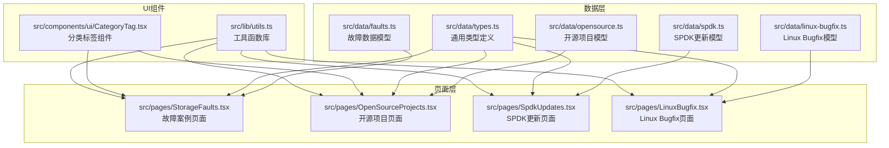
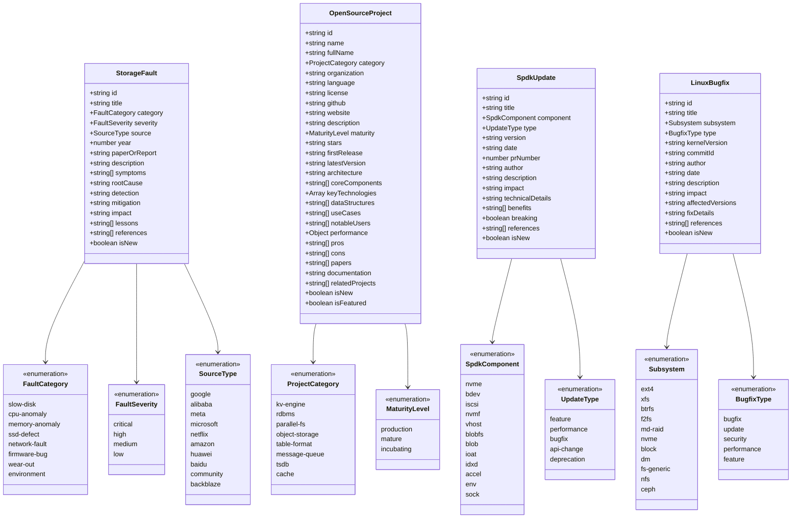
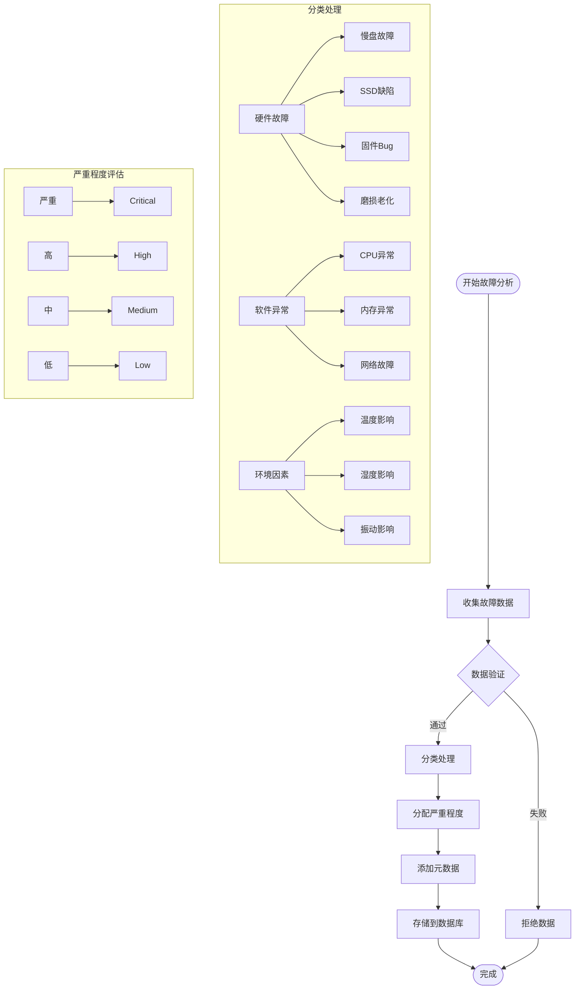
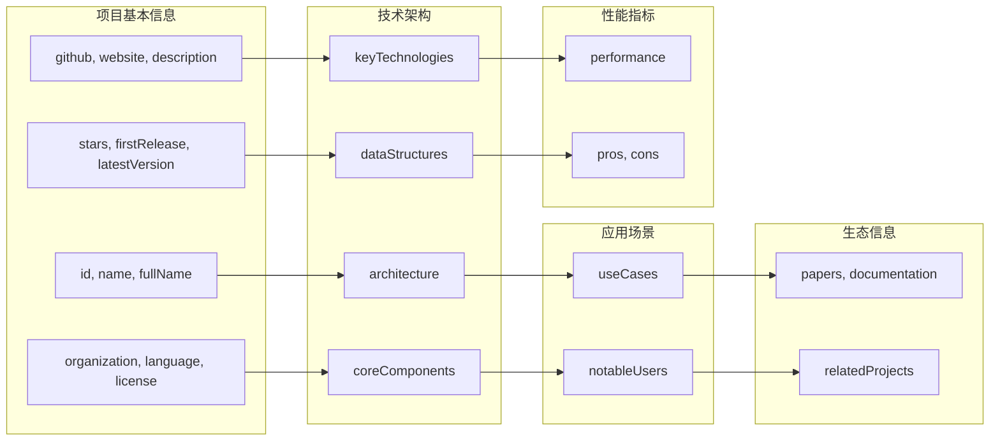
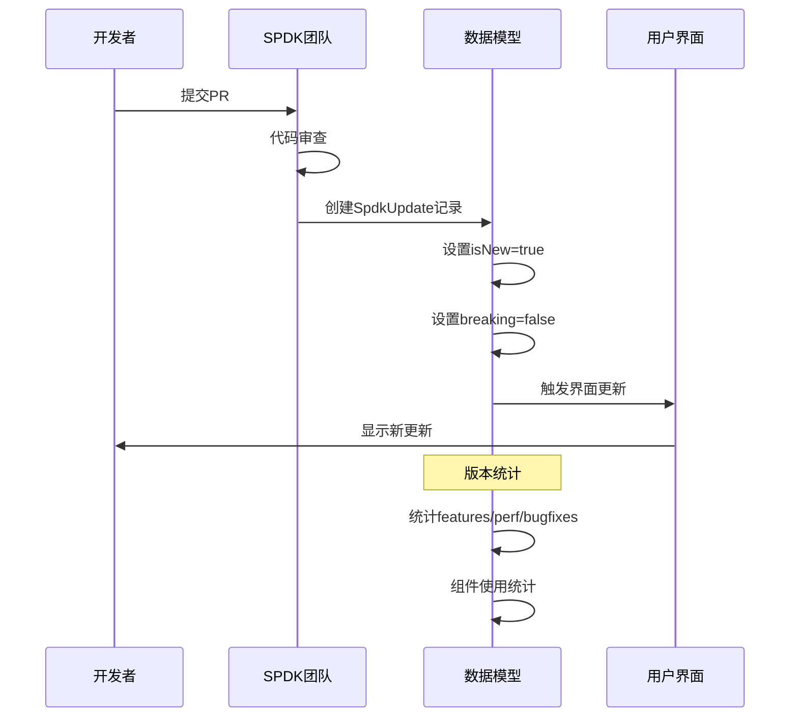
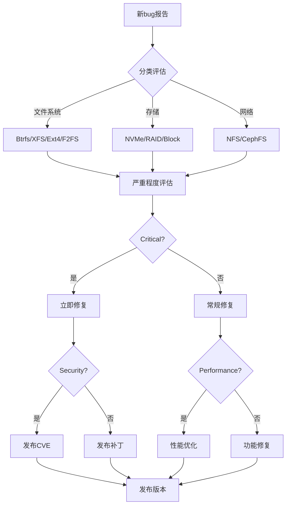
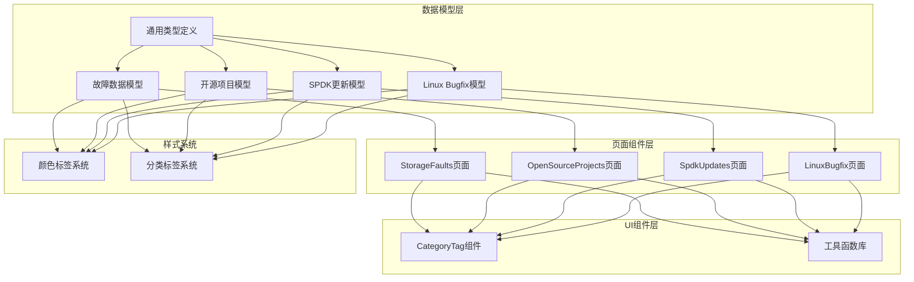

# 辅助数据模型

<cite>
**本文档引用的文件**
- [src/data/faults.ts](file://src/data/faults.ts)
- [src/data/opensource.ts](file://src/data/opensource.ts)
- [src/data/spdk.ts](file://src/data/spdk.ts)
- [src/data/linux-bugfix.ts](file://src/data/linux-bugfix.ts)
- [src/data/types.ts](file://src/data/types.ts)
- [src/pages/StorageFaults.tsx](file://src/pages/StorageFaults.tsx)
- [src/pages/OpenSourceProjects.tsx](file://src/pages/OpenSourceProjects.tsx)
- [src/pages/SpdkUpdates.tsx](file://src/pages/SpdkUpdates.tsx)
- [src/pages/LinuxBugfix.tsx](file://src/pages/LinuxBugfix.tsx)
- [src/components/ui/CategoryTag.tsx](file://src/components/ui/CategoryTag.tsx)
- [src/lib/utils.ts](file://src/lib/utils.ts)
</cite>

## 目录
1. [简介](#简介)
2. [项目结构](#项目结构)
3. [核心组件](#核心组件)
4. [架构概览](#架构概览)
5. [详细组件分析](#详细组件分析)
6. [依赖分析](#依赖分析)
7. [性能考虑](#性能考虑)
8. [故障排查指南](#故障排查指南)
9. [结论](#结论)
10. [附录](#附录)

## 简介

本项目提供了四个核心的辅助数据模型，用于存储和展示存储领域的专业知识。这些模型包括：
- **故障数据模型（Fault）**：记录存储系统中的各种故障案例
- **开源项目模型（OpenSourceProject）**：描述存储相关的开源项目信息
- **SPDK相关数据模型**：跟踪SPDK（Storage Performance Development Kit）的关键更新
- **Linux Bugfix数据模型**：收集Linux内核文件系统和存储相关的bug修复

这些辅助数据模型为用户提供了一个全面的存储技术知识库，涵盖了从硬件故障到软件优化的各个层面。

## 项目结构

项目采用模块化的数据组织方式，每个辅助数据模型都独立存储在对应的文件中：

**图表来源**
- [src/data/faults.ts:1-817](file://src/data/faults.ts#L1-L817)
- [src/data/opensource.ts:1-1110](file://src/data/opensource.ts#L1-L1110)
- [src/data/spdk.ts:1-575](file://src/data/spdk.ts#L1-L575)
- [src/data/linux-bugfix.ts:1-609](file://src/data/linux-bugfix.ts#L1-L609)

**章节来源**
- [src/data/faults.ts:1-817](file://src/data/faults.ts#L1-L817)
- [src/data/opensource.ts:1-1110](file://src/data/opensource.ts#L1-L1110)
- [src/data/spdk.ts:1-575](file://src/data/spdk.ts#L1-L575)
- [src/data/linux-bugfix.ts:1-609](file://src/data/linux-bugfix.ts#L1-L609)

## 核心组件

### 故障数据模型（StorageFault）

故障数据模型专门用于记录和分析存储系统中的各种故障案例，包括硬件故障、软件异常和环境因素等。

**核心字段定义**：
- `id`: 唯一标识符
- `title`: 故障标题
- `category`: 故障分类（8种类型）
- `severity`: 严重程度（4个等级）
- `source`: 信息来源（10个来源）
- `year`: 发现年份
- `paperOrReport`: 相关论文或报告
- `description`: 详细描述
- `symptoms`: 故障症状数组
- `rootCause`: 根本原因
- `detection`: 检测方法
- `mitigation`: 缓解措施
- `impact`: 影响范围
- `lessons`: 经验教训
- `references`: 参考资料链接
- `isNew`: 是否为最新案例

**分类系统**：
- 慢盘故障（slow-disk）
- CPU异常（cpu-anomaly）
- 内存异常（memory-anomaly）
- SSD缺陷（ssd-defect）
- 网络故障（network-fault）
- 固件Bug（firmware-bug）
- 磨损老化（wear-out）
- 环境因素（environment）

**章节来源**
- [src/data/faults.ts:5-22](file://src/data/faults.ts#L5-L22)
- [src/data/faults.ts:24-64](file://src/data/faults.ts#L24-L64)

### 开源项目模型（OpenSourceProject）

开源项目模型用于描述存储相关的开源项目，涵盖从KV存储引擎到分布式数据库的完整生态系统。

**核心字段定义**：
- `id`: 项目唯一标识符
- `name`: 项目名称
- `fullName`: 完整项目名称
- `category`: 项目分类（8种类型）
- `organization`: 开发组织
- `language`: 主要编程语言
- `license`: 许可证类型
- `github`: GitHub链接
- `website`: 官方网站
- `description`: 项目描述
- `maturity`: 成熟度等级
- `stars`: GitHub星标数量
- `firstRelease`: 首次发布时间
- `latestVersion`: 最新版本

**架构信息**：
- `architecture`: 核心架构描述
- `coreComponents`: 核心组件列表
- `keyTechnologies`: 关键技术列表
- `dataStructures`: 数据结构列表
- `useCases`: 应用场景列表
- `notableUsers`: 知名用户列表

**性能特点**：
- `throughput`: 吞吐量指标
- `latency`: 延迟指标
- `scalability`: 扩展性描述
- `notes`: 性能备注

**章节来源**
- [src/data/opensource.ts:4-58](file://src/data/opensource.ts#L4-L58)
- [src/data/opensource.ts:88-1110](file://src/data/opensource.ts#L88-L1110)

### SPDK相关数据模型

SPDK更新模型跟踪SPDK（Storage Performance Development Kit）的关键更新，包括新特性、性能优化和API变更。

**核心字段定义**：
- `id`: 更新唯一标识符
- `title`: 更新标题
- `component`: SPDK组件（11个组件）
- `type`: 更新类型（5种类型）
- `version`: 版本号
- `date`: 更新日期
- `prNumber`: PR编号
- `author`: 作者
- `description`: 更新描述
- `impact`: 影响程度
- `technicalDetails`: 技术细节
- `benefits`: 主要收益
- `breaking`: 是否为破坏性变更
- `references`: 参考链接
- `isNew`: 是否为最新更新

**组件分类**：
- NVMe驱动（nvme）
- 块设备（bdev）
- iSCSI目标（iscsi）
- NVMe-oF目标（nvmf）
- vhost目标（vhost）
- BlobFS（blobfs）
- Blob存储（blob）
- IOAT DMA（ioat）
- IDXD/DSA（idxd）
- 加速器（accel）
- 环境（env）
- Socket（sock）

**章节来源**
- [src/data/spdk.ts:4-20](file://src/data/spdk.ts#L4-L20)
- [src/data/spdk.ts:53-575](file://src/data/spdk.ts#L53-L575)

### Linux Bugfix数据模型

Linux Bugfix模型收集Linux内核文件系统和存储相关的bug修复与更新，提供完整的故障修复追踪。

**核心字段定义**：
- `id`: 记录唯一标识符
- `title`: 问题标题
- `subsystem`: 子系统（11个子系统）
- `type`: 问题类型（5种类型）
- `kernelVersion`: 内核版本
- `commitId`: 提交ID
- `author`: 作者
- `date`: 发布日期
- `description`: 问题描述
- `impact`: 影响程度
- `affectedVersions`: 受影响版本
- `fixDetails`: 修复详情
- `references`: 参考链接
- `isNew`: 是否为最新

**子系统分类**：
- Ext4文件系统（ext4）
- XFS文件系统（xfs）
- Btrfs文件系统（btrfs）
- F2FS文件系统（f2fs）
- MD/RAID（md-raid）
- NVMe驱动（nvme）
- 块层（block）
- 设备映射器（dm）
- VFS/Generic（fs-generic）
- NFS网络文件系统（nfs）
- CephFS（ceph）

**章节来源**
- [src/data/linux-bugfix.ts:4-19](file://src/data/linux-bugfix.ts#L4-L19)
- [src/data/linux-bugfix.ts:58-609](file://src/data/linux-bugfix.ts#L58-L609)

## 架构概览

四个辅助数据模型遵循统一的架构设计原则，确保数据的一致性和可扩展性：

**图表来源**
- [src/data/faults.ts:1-3](file://src/data/faults.ts#L1-L3)
- [src/data/faults.ts:5-22](file://src/data/faults.ts#L5-L22)
- [src/data/opensource.ts:1-2](file://src/data/opensource.ts#L1-L2)
- [src/data/opensource.ts:4-58](file://src/data/opensource.ts#L4-L58)
- [src/data/spdk.ts:1-2](file://src/data/spdk.ts#L1-L2)
- [src/data/spdk.ts:4-20](file://src/data/spdk.ts#L4-L20)
- [src/data/linux-bugfix.ts:1-2](file://src/data/linux-bugfix.ts#L1-L2)
- [src/data/linux-bugfix.ts:4-19](file://src/data/linux-bugfix.ts#L4-L19)

## 详细组件分析

### 故障数据模型详细分析

故障数据模型采用了层次化的数据结构设计，支持复杂的故障分析和分类。

**图表来源**
- [src/data/faults.ts:66-792](file://src/data/faults.ts#L66-L792)

**章节来源**
- [src/data/faults.ts:66-792](file://src/data/faults.ts#L66-L792)

### 开源项目模型详细分析

开源项目模型采用了丰富的元数据结构，支持全面的项目信息展示和分析。

**图表来源**
- [src/data/opensource.ts:4-58](file://src/data/opensource.ts#L4-L58)

**章节来源**
- [src/data/opensource.ts:88-1110](file://src/data/opensource.ts#L88-L1110)

### SPDK更新模型详细分析

SPDK更新模型提供了完整的版本追踪和变更管理功能。

**图表来源**
- [src/data/spdk.ts:53-575](file://src/data/spdk.ts#L53-L575)

**章节来源**
- [src/data/spdk.ts:53-575](file://src/data/spdk.ts#L53-L575)

### Linux Bugfix模型详细分析

Linux Bugfix模型实现了完整的bug追踪和影响评估机制。

**图表来源**
- [src/data/linux-bugfix.ts:58-586](file://src/data/linux-bugfix.ts#L58-L586)

**章节来源**
- [src/data/linux-bugfix.ts:58-586](file://src/data/linux-bugfix.ts#L58-L586)

## 依赖分析

四个辅助数据模型之间存在清晰的依赖关系和相互作用：

**图表来源**
- [src/data/faults.ts:1-817](file://src/data/faults.ts#L1-L817)
- [src/data/opensource.ts:1-1110](file://src/data/opensource.ts#L1-L1110)
- [src/data/spdk.ts:1-575](file://src/data/spdk.ts#L1-L575)
- [src/data/linux-bugfix.ts:1-609](file://src/data/linux-bugfix.ts#L1-L609)
- [src/data/types.ts:1-49](file://src/data/types.ts#L1-L49)

**章节来源**
- [src/data/types.ts:1-49](file://src/data/types.ts#L1-L49)
- [src/components/ui/CategoryTag.tsx:1-25](file://src/components/ui/CategoryTag.tsx#L1-L25)
- [src/lib/utils.ts:9-47](file://src/lib/utils.ts#L9-L47)

## 性能考虑

### 数据加载优化

所有辅助数据模型都经过精心设计以确保最佳性能：

1. **静态数据加载**：所有数据模型都是静态定义，避免了运行时的网络请求
2. **内存优化**：数据结构紧凑，避免不必要的内存占用
3. **懒加载支持**：页面组件使用React.memo和useMemo优化渲染性能

### 查询优化策略

1. **索引字段设计**：关键字段如id、category、type等便于快速查询
2. **分组统计**：提供专门的统计函数用于快速获取分类信息
3. **缓存机制**：使用useMemo避免重复计算

### 渲染优化

1. **虚拟滚动**：对于大量数据的列表使用虚拟滚动技术
2. **条件渲染**：只在需要时渲染详细内容
3. **防抖处理**：搜索和过滤操作使用防抖优化

## 故障排查指南

### 常见问题及解决方案

**问题1：数据加载失败**
- 检查数据文件是否正确导入
- 验证类型定义是否匹配
- 确认路径引用是否正确

**问题2：分类标签显示异常**
- 检查标签映射表是否完整
- 验证CSS类名是否存在
- 确认颜色配置是否正确

**问题3：页面渲染性能问题**
- 检查useMemo使用是否合理
- 验证数据过滤逻辑是否优化
- 确认组件是否正确使用React.memo

**章节来源**
- [src/pages/StorageFaults.tsx:36-49](file://src/pages/StorageFaults.tsx#L36-L49)
- [src/pages/OpenSourceProjects.tsx:37-60](file://src/pages/OpenSourceProjects.tsx#L37-L60)
- [src/pages/SpdkUpdates.tsx:43-52](file://src/pages/SpdkUpdates.tsx#L43-L52)
- [src/pages/LinuxBugfix.tsx:42-56](file://src/pages/LinuxBugfix.tsx#L42-L56)

## 结论

本项目提供的辅助数据模型体系具有以下特点：

1. **完整性**：涵盖了存储领域的各个方面，从硬件故障到软件优化
2. **一致性**：统一的数据结构和分类标准确保了数据的可比较性
3. **可扩展性**：模块化设计便于添加新的数据模型和功能
4. **实用性**：直接服务于用户需求，提供有价值的技术知识

这些辅助数据模型为存储技术的学习和研究提供了坚实的基础，有助于用户更好地理解和应用存储系统知识。

## 附录

### 扩展和定制方案

#### 添加新的数据模型
1. 在src/data目录下创建新的数据模型文件
2. 定义类型和接口结构
3. 实现必要的统计函数
4. 在相应的页面组件中集成

#### 自定义分类系统
1. 修改types.ts中的Category枚举
2. 更新CategoryTag组件的映射表
3. 在utils.ts中添加相应的标签样式
4. 更新所有使用该分类的组件

#### 数据格式扩展
1. 在对应的数据模型中添加新的字段
2. 更新数据导入逻辑
3. 修改页面组件以支持新字段
4. 更新统计和过滤功能

#### 样式定制
1. 在src/lib/utils.ts中添加新的样式映射
2. 更新CSS变量和主题配置
3. 修改组件的样式类名
4. 确保响应式设计的兼容性