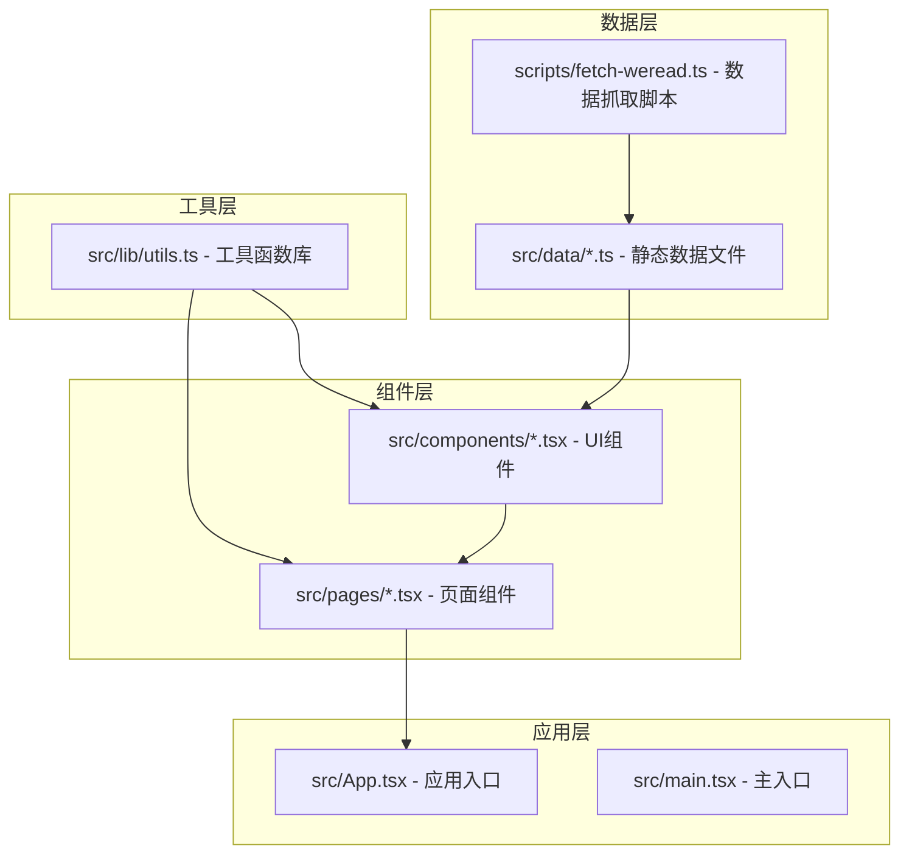
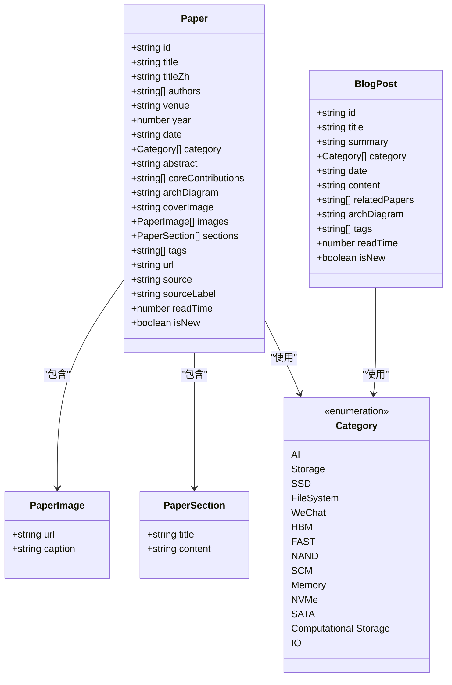
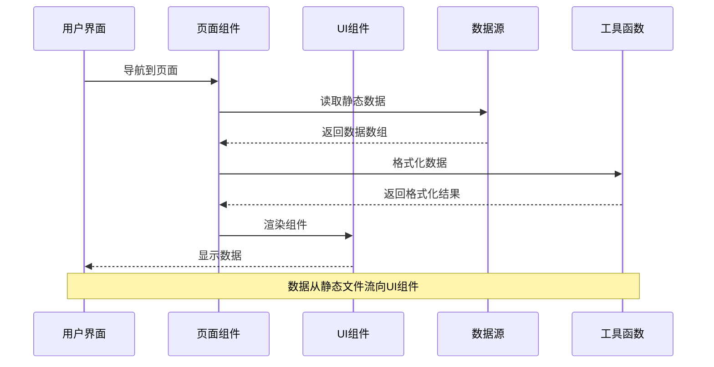
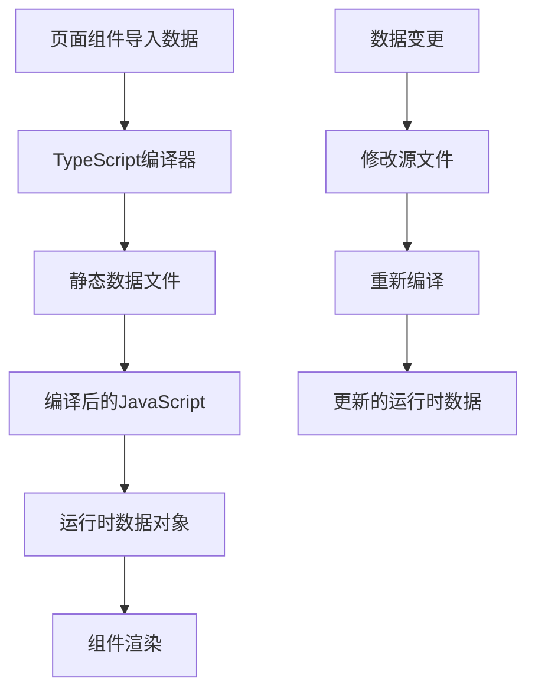
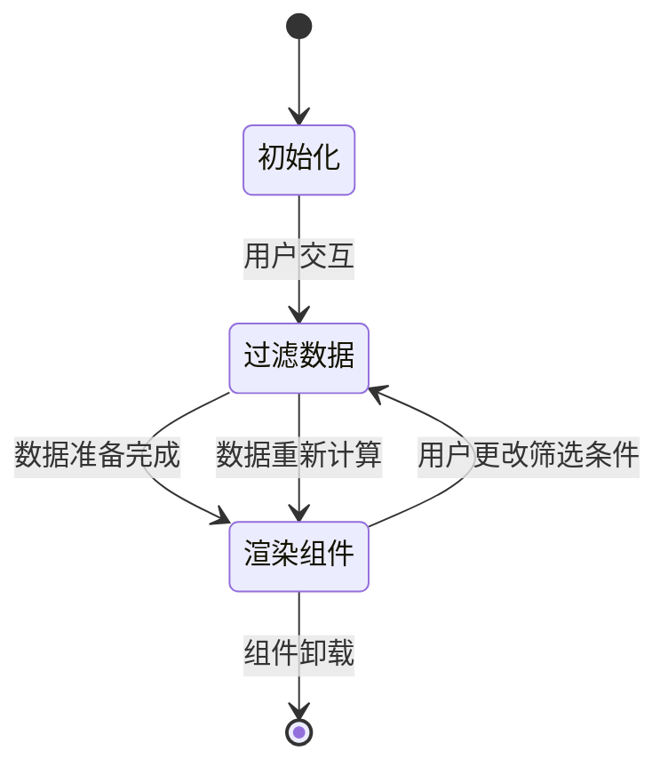
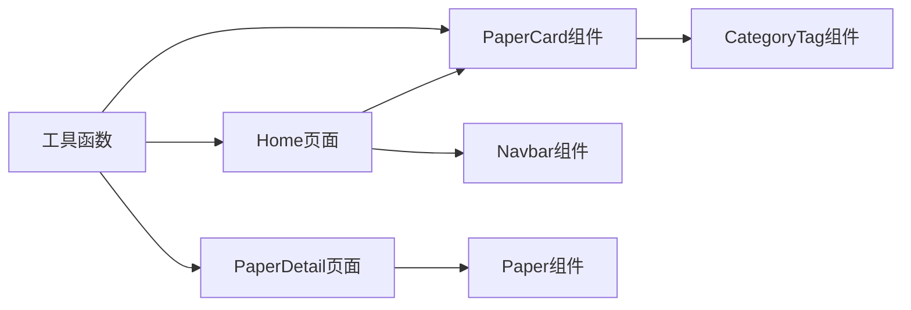
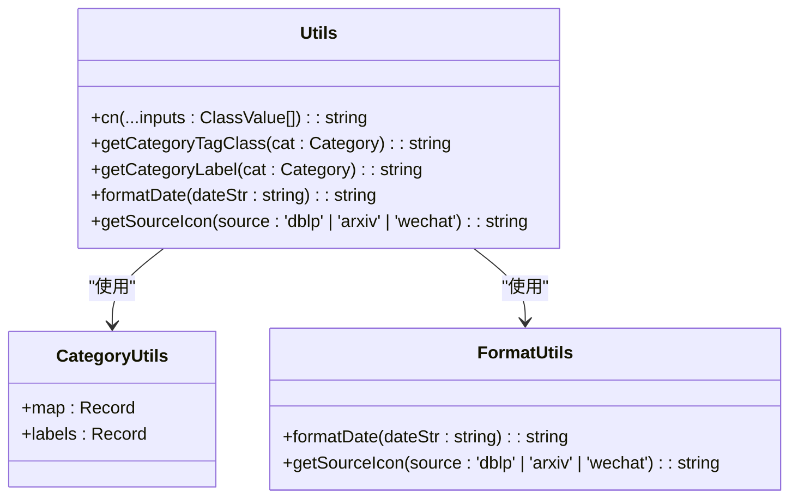
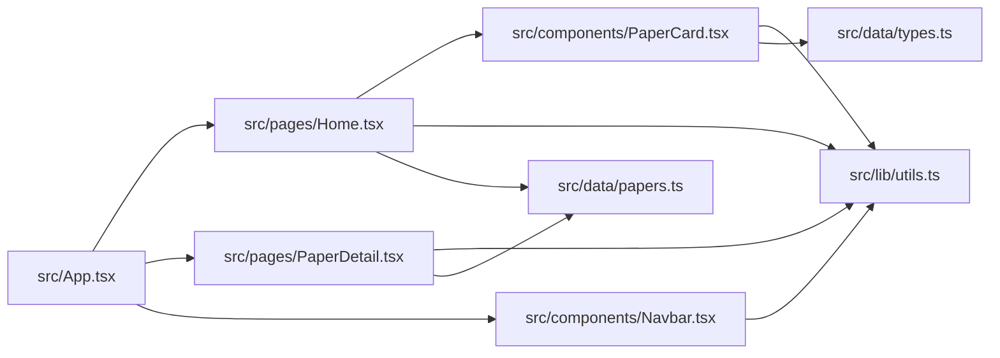

# 数据流架构

<cite>
**本文档引用的文件**
- [src/data/types.ts](file://src/data/types.ts)
- [src/data/papers.ts](file://src/data/papers.ts)
- [src/data/conferences.ts](file://src/data/conferences.ts)
- [src/data/teams.ts](file://src/data/teams.ts)
- [src/data/linux-bugfix.ts](file://src/data/linux-bugfix.ts)
- [src/data/opensource.ts](file://src/data/opensource.ts)
- [src/lib/utils.ts](file://src/lib/utils.ts)
- [src/App.tsx](file://src/App.tsx)
- [src/pages/Home.tsx](file://src/pages/Home.tsx)
- [src/pages/PaperDetail.tsx](file://src/pages/PaperDetail.tsx)
- [src/components/PaperCard.tsx](file://src/components/PaperCard.tsx)
- [src/components/Navbar.tsx](file://src/components/Navbar.tsx)
- [scripts/fetch-weread.ts](file://scripts/fetch-weread.ts)
- [package.json](file://package.json)
</cite>

## 目录
1. [简介](#简介)
2. [项目结构](#项目结构)
3. [核心组件](#核心组件)
4. [架构概览](#架构概览)
5. [详细组件分析](#详细组件分析)
6. [依赖分析](#依赖分析)
7. [性能考虑](#性能考虑)
8. [故障排除指南](#故障排除指南)
9. [结论](#结论)
10. [附录](#附录)

## 简介

cs336项目是一个专注于存储系统和人工智能交叉领域的数据展示平台。该项目通过精心设计的数据流架构，实现了从静态数据文件到动态用户界面的完整数据管道。本文档深入分析了应用中的数据流向、状态管理机制、组件间数据传递方式，以及TypeScript类型系统在数据架构中的应用。

项目的核心价值在于为用户提供了一个统一的入口，追踪AI训练系统、SSD、文件系统、HBM存储等前沿论文与公众号精华内容。通过模块化的数据源组织和类型安全的架构设计，确保了数据的一致性和可维护性。

## 项目结构

cs336项目采用了清晰的分层架构，将不同类型的数据源和功能模块进行了合理的组织：



**图表来源**
- [src/data/types.ts:1-49](file://src/data/types.ts#L1-L49)
- [src/lib/utils.ts:1-58](file://src/lib/utils.ts#L1-L58)
- [src/App.tsx:1-45](file://src/App.tsx#L1-L45)

项目结构的主要特点包括：

- **数据源分离**：不同类型的数据源被组织在独立的文件中，便于维护和扩展
- **类型系统驱动**：通过TypeScript接口和类型定义确保数据结构的一致性
- **组件化设计**：UI组件与业务逻辑分离，提高了代码的可重用性
- **工具函数集中**：通用的数据处理和格式化功能集中在工具库中

**章节来源**
- [src/App.tsx:1-45](file://src/App.tsx#L1-L45)
- [package.json:1-32](file://package.json#L1-L32)

## 核心组件

### 数据模型体系

项目建立了完整的TypeScript类型系统，为所有数据结构提供了严格的类型约束：



**图表来源**
- [src/data/types.ts:1-49](file://src/data/types.ts#L1-L49)

### 数据源组织结构

项目的数据源主要分为以下几类：

1. **论文数据**：包含学术论文、博客文章和公众号内容
2. **会议数据**：OSDI、FAST、ATC等顶级会议的论文信息
3. **团队数据**：研究团队成员和论文列表
4. **Linux内核数据**：存储相关的bugfix和更新
5. **开源项目数据**：存储领域的开源项目信息

**章节来源**
- [src/data/types.ts:1-49](file://src/data/types.ts#L1-L49)
- [src/data/papers.ts:1-815](file://src/data/papers.ts#L1-L815)
- [src/data/conferences.ts:1-213](file://src/data/conferences.ts#L1-L213)
- [src/data/teams.ts:1-168](file://src/data/teams.ts#L1-L168)
- [src/data/linux-bugfix.ts:1-609](file://src/data/linux-bugfix.ts#L1-L609)
- [src/data/opensource.ts:1-1110](file://src/data/opensource.ts#L1-L1110)

## 架构概览

cs336项目采用React + TypeScript构建，实现了清晰的数据流架构：



**图表来源**
- [src/pages/Home.tsx:1-209](file://src/pages/Home.tsx#L1-L209)
- [src/components/PaperCard.tsx:1-73](file://src/components/PaperCard.tsx#L1-L73)
- [src/lib/utils.ts:1-58](file://src/lib/utils.ts#L1-L58)

### 数据流处理流程

项目的数据流遵循以下处理模式：

1. **数据获取**：页面组件从对应的静态数据文件导入数据
2. **数据处理**：使用工具函数进行数据格式化和转换
3. **状态管理**：通过React hooks管理组件状态
4. **数据渲染**：UI组件接收处理后的数据并渲染

**章节来源**
- [src/pages/Home.tsx:15-33](file://src/pages/Home.tsx#L15-L33)
- [src/pages/PaperDetail.tsx:1-151](file://src/pages/PaperDetail.tsx#L1-L151)

## 详细组件分析

### 数据获取与状态管理

#### 静态数据导入模式

项目采用静态导入的方式获取数据，这种方式具有以下优势：

- **编译时优化**：数据在构建时被内联到bundle中
- **类型安全**：TypeScript在编译时验证数据结构
- **运行时性能**：避免了网络请求的开销



**图表来源**
- [src/pages/Home.tsx:2-4](file://src/pages/Home.tsx#L2-L4)
- [src/pages/PaperDetail.tsx:1-2](file://src/pages/PaperDetail.tsx#L1-L2)

#### 组件状态管理

页面组件使用React hooks进行状态管理：



**图表来源**
- [src/pages/Home.tsx:16-33](file://src/pages/Home.tsx#L16-L33)

**章节来源**
- [src/pages/Home.tsx:1-209](file://src/pages/Home.tsx#L1-L209)

### 组件间数据传递机制

#### 父子组件数据传递

项目中的组件间数据传递遵循React的标准模式：



**图表来源**
- [src/components/PaperCard.tsx:1-73](file://src/components/PaperCard.tsx#L1-L73)
- [src/components/Navbar.tsx:1-143](file://src/components/Navbar.tsx#L1-L143)
- [src/lib/utils.ts:1-58](file://src/lib/utils.ts#L1-L58)

#### 数据传递参数设计

每个组件都通过props接收必要的数据：

- **PaperCard**: 接收完整的Paper对象
- **CategoryTag**: 接收Category类型
- **Navbar**: 接收导航配置和状态

**章节来源**
- [src/components/PaperCard.tsx:7-9](file://src/components/PaperCard.tsx#L7-L9)
- [src/components/Navbar.tsx:6-20](file://src/components/Navbar.tsx#L6-L20)

### 工具函数库分析

#### 数据处理与格式化

工具函数库提供了统一的数据处理和格式化功能：



**图表来源**
- [src/lib/utils.ts:1-58](file://src/lib/utils.ts#L1-L58)

#### 类别映射系统

工具函数库实现了类别到CSS类名和标签文本的映射：

| Category | CSS类名 | 中文标签 |
|----------|---------|----------|
| AI | tag-ai | AI / ML |
| Storage | tag-storage | 存储系统 |
| SSD | tag-ssd | SSD |
| FileSystem | tag-fs | 文件系统 |
| WeChat | tag-wechat | 公众号 |

**章节来源**
- [src/lib/utils.ts:9-47](file://src/lib/utils.ts#L9-L47)

### 数据缓存与性能优化

#### 静态数据缓存

项目采用静态导入的方式实现数据缓存：

- **编译时缓存**：数据在构建时被内联到bundle中
- **运行时缓存**：浏览器缓存机制
- **内存缓存**：JavaScript对象存在于内存中

#### 渲染优化策略

项目实施了多种渲染优化：

1. **虚拟滚动**：对于大量数据的场景，可以考虑实现虚拟滚动
2. **懒加载**：图片和其他资源使用懒加载
3. **组件记忆化**：使用useMemo和useCallback优化重渲染

**章节来源**
- [src/pages/Home.tsx:20-33](file://src/pages/Home.tsx#L20-L33)

## 依赖分析

### 外部依赖关系

项目依赖关系如下所示：

```mermaid
graph TB
subgraph "运行时依赖"
A[react]
B[react-dom]
C[react-router-dom]
D[lucide-react]
E[clsx]
F[tailwind-merge]
end
subgraph "开发时依赖"
G[@types/react]
H[@types/react-dom]
I[@vitejs/plugin-react]
J[tailwindcss]
K[typescript]
L[vite]
end
M[项目代码] --> A
M --> B
M --> C
M --> D
M --> E
M --> F
```

**图表来源**
- [package.json:11-30](file://package.json#L11-L30)

### 内部模块依赖

项目内部模块的依赖关系：



**图表来源**
- [src/App.tsx:1-45](file://src/App.tsx#L1-L45)
- [src/pages/Home.tsx:1-9](file://src/pages/Home.tsx#L1-L9)
- [src/pages/PaperDetail.tsx:1-6](file://src/pages/PaperDetail.tsx#L1-L6)

**章节来源**
- [package.json:1-32](file://package.json#L1-L32)

## 性能考虑

### 数据加载性能

项目采用静态数据导入的方式，具有以下性能优势：

- **零网络延迟**：数据直接从bundle中加载
- **类型安全**：编译时验证数据结构
- **缓存友好**：浏览器缓存机制生效

### 渲染性能优化

为了优化渲染性能，项目实施了以下策略：

1. **组件拆分**：将大组件拆分为更小的可复用组件
2. **条件渲染**：只渲染必要的DOM元素
3. **事件委托**：减少事件监听器的数量
4. **CSS类名合并**：使用clsx和tailwind-merge优化样式类

### 内存管理

项目在内存管理方面的考虑：

- **数据不可变性**：使用展开运算符创建新的数组和对象
- **清理机制**：及时清理不需要的数据引用
- **垃圾回收**：依赖JavaScript引擎的垃圾回收机制

## 故障排除指南

### 常见数据类型错误

当遇到TypeScript类型错误时，通常是因为数据结构不符合预期：

1. **字段缺失**：检查数据源文件中的字段定义
2. **类型不匹配**：确认字段的数据类型是否正确
3. **枚举值错误**：验证Category枚举值的正确性

### 组件渲染问题

如果组件无法正确渲染，检查以下方面：

1. **数据导入**：确认数据文件是否正确导入
2. **props传递**：验证组件接收的props是否完整
3. **条件渲染**：检查条件渲染逻辑是否正确

### 工具函数错误

工具函数相关的错误通常出现在：

1. **映射表不完整**：检查Category到CSS类名的映射
2. **日期格式化**：验证日期字符串的格式
3. **图标映射**：确认数据源到图标符号的映射

**章节来源**
- [src/lib/utils.ts:9-57](file://src/lib/utils.ts#L9-L57)

## 结论

cs336项目通过精心设计的数据流架构，成功实现了从静态数据源到动态用户界面的完整数据管道。项目的主要优势包括：

1. **类型安全**：完整的TypeScript类型系统确保了数据结构的一致性
2. **模块化设计**：清晰的数据源组织和组件分离提高了代码的可维护性
3. **性能优化**：静态数据导入和组件优化策略确保了良好的用户体验
4. **扩展性**：模块化的架构为未来的功能扩展奠定了基础

项目的架构设计体现了现代前端开发的最佳实践，为类似的数据展示项目提供了优秀的参考模板。

## 附录

### 数据扩展最佳实践

#### 新数据源接入流程

1. **定义数据模型**：在types.ts中定义新的接口
2. **创建数据文件**：在src/data目录下创建新的数据文件
3. **实现数据处理**：在utils.ts中添加必要的处理函数
4. **更新组件**：修改相关组件以支持新数据
5. **测试验证**：确保新功能正常工作

#### 数据验证规则

- **必需字段**：确保所有必需字段都存在
- **类型检查**：验证字段类型符合预期
- **范围验证**：检查数值字段在合理范围内
- **格式验证**：验证日期、URL等格式正确

#### 错误处理机制

项目采用渐进式增强的方式处理错误：

1. **类型错误**：在编译时捕获
2. **运行时错误**：通过条件渲染处理
3. **用户反馈**：提供友好的错误提示