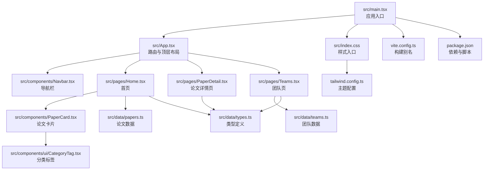
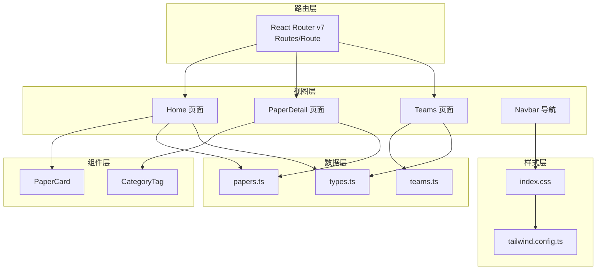
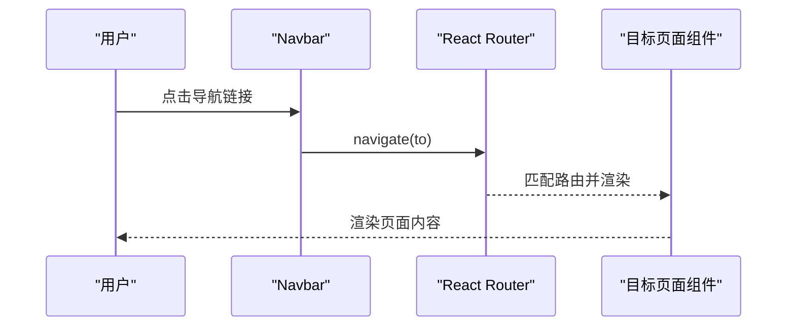
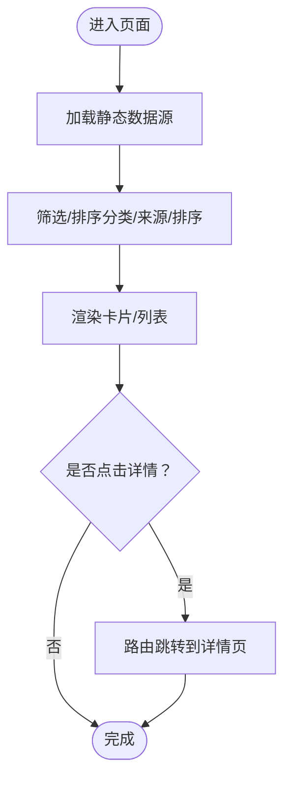
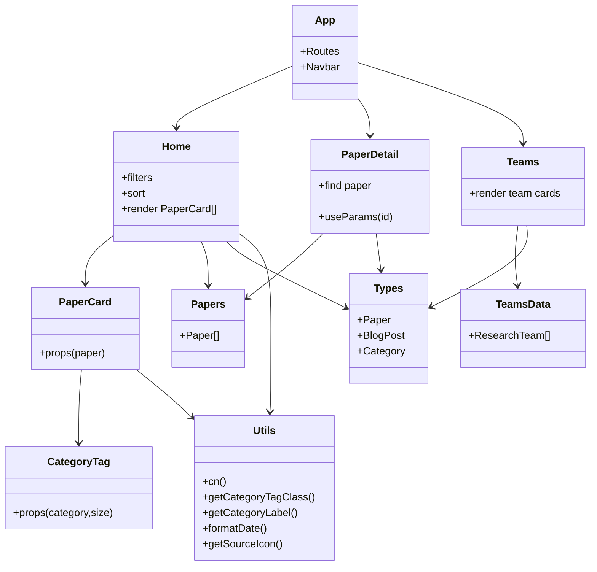
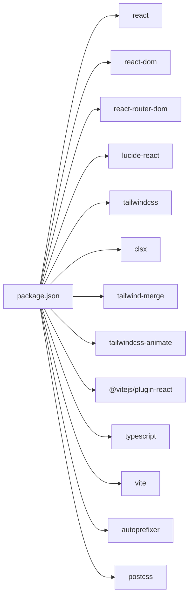

# 架构设计

<cite>
**本文引用的文件**
- [src/App.tsx](file://src/App.tsx)
- [src/main.tsx](file://src/main.tsx)
- [src/components/Navbar.tsx](file://src/components/Navbar.tsx)
- [src/components/PaperCard.tsx](file://src/components/PaperCard.tsx)
- [src/components/ui/CategoryTag.tsx](file://src/components/ui/CategoryTag.tsx)
- [src/pages/Home.tsx](file://src/pages/Home.tsx)
- [src/pages/PaperDetail.tsx](file://src/pages/PaperDetail.tsx)
- [src/pages/Teams.tsx](file://src/pages/Teams.tsx)
- [src/data/types.ts](file://src/data/types.ts)
- [src/data/papers.ts](file://src/data/papers.ts)
- [src/data/teams.ts](file://src/data/teams.ts)
- [src/lib/utils.ts](file://src/lib/utils.ts)
- [src/index.css](file://src/index.css)
- [tailwind.config.ts](file://tailwind.config.ts)
- [vite.config.ts](file://vite.config.ts)
- [package.json](file://package.json)
</cite>

## 目录
1. [简介](#简介)
2. [项目结构](#项目结构)
3. [核心组件](#核心组件)
4. [架构总览](#架构总览)
5. [详细组件分析](#详细组件分析)
6. [依赖关系分析](#依赖关系分析)
7. [性能考虑](#性能考虑)
8. [故障排查指南](#故障排查指南)
9. [结论](#结论)
10. [附录](#附录)

## 简介
本项目是一个面向存储与AI交叉领域的知识阅读与发现平台，采用 React + TypeScript + Tailwind CSS 技术栈构建。前端采用组件化设计，通过 React Router v7 实现页面级路由与参数传递；数据层以静态数据为主，类型系统由 TypeScript 提供保障；样式体系基于 Tailwind CSS，结合主题变量与动画插件，实现深色学术风格的主题与一致的视觉语言。

## 项目结构
项目采用“按功能域分层”的目录组织方式：
- src/main.tsx：应用入口，包裹 BrowserRouter 并挂载根组件
- src/App.tsx：路由配置与顶层布局容器
- src/components：通用 UI 组件（如 Navbar、PaperCard、CategoryTag）
- src/pages：页面级组件（Home、PaperDetail、Teams 等）
- src/data：静态数据与类型定义（papers、teams、types）
- src/lib：工具函数（cn、分类映射、格式化等）
- src/index.css：Tailwind 基础层与组件层样式
- tailwind.config.ts：主题、颜色、字体、动画等配置
- vite.config.ts：开发别名与插件配置
- package.json：依赖与脚本

**图表来源**
- [src/main.tsx:1-14](file://src/main.tsx#L1-L14)
- [src/App.tsx:1-45](file://src/App.tsx#L1-L45)
- [src/components/Navbar.tsx:1-143](file://src/components/Navbar.tsx#L1-L143)
- [src/pages/Home.tsx:1-209](file://src/pages/Home.tsx#L1-L209)
- [src/pages/PaperDetail.tsx:1-151](file://src/pages/PaperDetail.tsx#L1-L151)
- [src/pages/Teams.tsx:1-134](file://src/pages/Teams.tsx#L1-L134)
- [src/components/PaperCard.tsx:1-73](file://src/components/PaperCard.tsx#L1-L73)
- [src/components/ui/CategoryTag.tsx:1-25](file://src/components/ui/CategoryTag.tsx#L1-L25)
- [src/data/papers.ts:1-815](file://src/data/papers.ts#L1-L815)
- [src/data/teams.ts:1-168](file://src/data/teams.ts#L1-L168)
- [src/data/types.ts:1-49](file://src/data/types.ts#L1-L49)
- [src/index.css:1-158](file://src/index.css#L1-L158)
- [tailwind.config.ts:1-104](file://tailwind.config.ts#L1-L104)
- [vite.config.ts:1-13](file://vite.config.ts#L1-L13)
- [package.json:1-32](file://package.json#L1-L32)

**章节来源**
- [src/main.tsx:1-14](file://src/main.tsx#L1-L14)
- [src/App.tsx:1-45](file://src/App.tsx#L1-L45)
- [vite.config.ts:1-13](file://vite.config.ts#L1-L13)
- [package.json:1-32](file://package.json#L1-L32)

## 核心组件
- 应用根组件与路由
  - App：集中声明所有路由与顶层布局容器，包含导航栏与路由集合
  - main：包裹 BrowserRouter，启用严格模式渲染
- 导航组件
  - Navbar：包含主导航、下拉“更多”菜单、搜索展开区，使用 useLocation 判断激活状态
- 页面组件
  - Home：论文列表页，含分类筛选、来源过滤、排序、新文计数与卡片网格
  - PaperDetail：论文详情页，根据路由参数 id 查询并渲染
  - Teams：团队列表页，展示团队信息、统计与论文预览
- UI 组件
  - PaperCard：论文卡片，包含分类标签、作者、摘要、标签、阅读时长等
  - CategoryTag：分类标签，按类别映射不同样式类
- 工具与类型
  - utils：cn 合并类名、分类映射、日期格式化、来源图标
  - types：Paper、BlogPost、Category 等类型定义
  - papers、teams：静态数据源

**章节来源**
- [src/App.tsx:19-42](file://src/App.tsx#L19-L42)
- [src/main.tsx:7-13](file://src/main.tsx#L7-L13)
- [src/components/Navbar.tsx:22-142](file://src/components/Navbar.tsx#L22-L142)
- [src/pages/Home.tsx:15-208](file://src/pages/Home.tsx#L15-L208)
- [src/pages/PaperDetail.tsx:7-150](file://src/pages/PaperDetail.tsx#L7-L150)
- [src/pages/Teams.tsx:6-133](file://src/pages/Teams.tsx#L6-L133)
- [src/components/PaperCard.tsx:11-72](file://src/components/PaperCard.tsx#L11-L72)
- [src/components/ui/CategoryTag.tsx:11-24](file://src/components/ui/CategoryTag.tsx#L11-L24)
- [src/lib/utils.ts:5-57](file://src/lib/utils.ts#L5-L57)
- [src/data/types.ts:1-49](file://src/data/types.ts#L1-L49)
- [src/data/papers.ts:1-815](file://src/data/papers.ts#L1-L815)
- [src/data/teams.ts:19-37](file://src/data/teams.ts#L19-L37)

## 架构总览
前端采用“路由驱动的页面级组件 + 组合式 UI 组件 + 类型化数据”的架构模式：
- 路由系统：基于 React Router v7 的 Routes/Route，支持路径参数与嵌套路由
- 数据流：页面组件通过 props 与静态数据源交互，少量状态在组件内部维护
- 样式体系：Tailwind CSS + 主题变量 + 动画插件，统一视觉与交互体验
- 构建与别名：Vite + alias '@' 指向 src，提升导入可读性

**图表来源**
- [src/App.tsx:23-39](file://src/App.tsx#L23-L39)
- [src/pages/Home.tsx:3-6](file://src/pages/Home.tsx#L3-L6)
- [src/pages/PaperDetail.tsx:1-5](file://src/pages/PaperDetail.tsx#L1-L5)
- [src/pages/Teams.tsx:1-4](file://src/pages/Teams.tsx#L1-L4)
- [src/components/PaperCard.tsx:1-6](file://src/components/PaperCard.tsx#L1-L6)
- [src/components/ui/CategoryTag.tsx:1-3](file://src/components/ui/CategoryTag.tsx#L1-L3)
- [src/data/papers.ts:1-3](file://src/data/papers.ts#L1-L3)
- [src/data/teams.ts:19-37](file://src/data/teams.ts#L19-L37)
- [src/data/types.ts:1-49](file://src/data/types.ts#L1-L49)
- [src/index.css:1-3](file://src/index.css#L1-L3)
- [tailwind.config.ts:1-104](file://tailwind.config.ts#L1-L104)

## 详细组件分析

### 路由系统与导航
- 路由设计
  - 根组件集中声明所有页面路由，包含首页、论文详情、深度解读、会议专题、开源项目、团队、日常、归档等
  - 论论文详情路由使用路径参数 :id，Teams 详情路由使用 :id
- 导航行为
  - Navbar 使用 useLocation 判断当前激活项，支持“更多”下拉菜单与点击外部关闭
  - 搜索栏支持展开与 ESC 关闭，键盘快捷键提示
- URL 结构
  - 清晰的语义化路径，便于 SEO 与分享
  - 参数化路径用于详情页，保证可复用与可分享

**图表来源**
- [src/components/Navbar.tsx:22-142](file://src/components/Navbar.tsx#L22-L142)
- [src/App.tsx:23-39](file://src/App.tsx#L23-L39)

**章节来源**
- [src/App.tsx:19-42](file://src/App.tsx#L19-L42)
- [src/components/Navbar.tsx:22-142](file://src/components/Navbar.tsx#L22-L142)

### 数据流与页面渲染
- Home 页面
  - 从静态数据源 papers 中读取数据，使用 useMemo 进行筛选与排序
  - 支持分类标签、来源过滤、排序方式切换
  - 使用 PaperCard 渲染卡片，点击进入详情页
- PaperDetail 页面
  - 通过 useParams 获取 id，从 papers 中查找对应论文
  - 若未找到，显示“论文不存在”，并提供返回链接
- Teams 页面
  - 展示团队列表，包含机构、地点、官网、统计信息、教授与论文预览
  - 点击进入团队详情页

**图表来源**
- [src/pages/Home.tsx:20-33](file://src/pages/Home.tsx#L20-L33)
- [src/pages/Home.tsx:194-198](file://src/pages/Home.tsx#L194-L198)
- [src/pages/PaperDetail.tsx:7-21](file://src/pages/PaperDetail.tsx#L7-L21)

**章节来源**
- [src/pages/Home.tsx:15-208](file://src/pages/Home.tsx#L15-L208)
- [src/pages/PaperDetail.tsx:7-150](file://src/pages/PaperDetail.tsx#L7-L150)
- [src/pages/Teams.tsx:6-133](file://src/pages/Teams.tsx#L6-L133)

### 组件关系与依赖
- 组件树
  - App 为根容器，包含 Navbar 与 Routes
  - Home 依赖 PaperCard 与 CategoryTag
  - PaperDetail 依赖类型与数据源
  - Teams 依赖类型与数据源
- 依赖关系
  - 组件通过 props 传递数据，少量状态在组件内部维护
  - 工具函数集中于 lib/utils，避免重复逻辑
  - 类型定义集中在 data/types，确保数据一致性

**图表来源**
- [src/App.tsx:19-42](file://src/App.tsx#L19-L42)
- [src/pages/Home.tsx:1-8](file://src/pages/Home.tsx#L1-L8)
- [src/pages/PaperDetail.tsx:1-5](file://src/pages/PaperDetail.tsx#L1-L5)
- [src/pages/Teams.tsx:1-4](file://src/pages/Teams.tsx#L1-L4)
- [src/components/PaperCard.tsx:7-9](file://src/components/PaperCard.tsx#L7-L9)
- [src/components/ui/CategoryTag.tsx:5-9](file://src/components/ui/CategoryTag.tsx#L5-L9)
- [src/lib/utils.ts:5-57](file://src/lib/utils.ts#L5-L57)
- [src/data/types.ts:1-49](file://src/data/types.ts#L1-L49)
- [src/data/papers.ts:1-3](file://src/data/papers.ts#L1-L3)
- [src/data/teams.ts:19-37](file://src/data/teams.ts#L19-L37)

**章节来源**
- [src/App.tsx:19-42](file://src/App.tsx#L19-L42)
- [src/pages/Home.tsx:1-8](file://src/pages/Home.tsx#L1-L8)
- [src/pages/PaperDetail.tsx:1-5](file://src/pages/PaperDetail.tsx#L1-L5)
- [src/pages/Teams.tsx:1-4](file://src/pages/Teams.tsx#L1-L4)
- [src/components/PaperCard.tsx:7-9](file://src/components/PaperCard.tsx#L7-L9)
- [src/components/ui/CategoryTag.tsx:5-9](file://src/components/ui/CategoryTag.tsx#L5-L9)
- [src/lib/utils.ts:5-57](file://src/lib/utils.ts#L5-L57)
- [src/data/types.ts:1-49](file://src/data/types.ts#L1-L49)
- [src/data/papers.ts:1-3](file://src/data/papers.ts#L1-L3)
- [src/data/teams.ts:19-37](file://src/data/teams.ts#L19-L37)

### TypeScript 类型系统
- 类型定义
  - Category：论文分类联合类型
  - Paper：论文对象，包含标题、作者、会议、年份、分类、摘要、核心贡献、图片、章节、标签、来源、阅读时长等
  - BlogPost：博客文章对象
- 类型安全保障
  - 页面组件通过类型定义接收 props，避免运行时字段缺失
  - 工具函数参数与返回值均带有明确类型约束
- 可扩展性
  - 新增字段时只需在类型定义中扩展，组件与页面即可自动获得类型提示与校验

**章节来源**
- [src/data/types.ts:1-49](file://src/data/types.ts#L1-L49)
- [src/lib/utils.ts:3-7](file://src/lib/utils.ts#L3-L7)

### Tailwind CSS 样式架构
- 主题系统
  - 通过 CSS 变量定义主题色板与阴影，支持深色学术风格
  - 分类标签使用独立色值，确保视觉区分度
- 响应式设计
  - 使用容器、网格与断点类实现自适应布局
- 组件样式组织
  - 基础层：全局背景、字体、渐变
  - 组件层：卡片、标签、导航链接、滚动条等复用样式
- 动画与交互
  - 集成 tailwindcss-animate 插件，提供折叠、淡入、脉冲等动画
- 构建与别名
  - Tailwind 配置扫描 src 与 index.html，确保按需生成样式
  - Vite 别名 '@' 指向 src，简化导入路径

**章节来源**
- [src/index.css:5-158](file://src/index.css#L5-L158)
- [tailwind.config.ts:10-101](file://tailwind.config.ts#L10-L101)
- [vite.config.ts:7-11](file://vite.config.ts#L7-L11)

## 依赖关系分析
- 运行时依赖
  - React、React DOM、React Router DOM：构建组件树与路由
  - Lucide React：图标库
  - Tailwind 生态：clsx、tailwind-merge、tailwindcss-animate
- 开发依赖
  - Vite、TypeScript、Tailwind CSS、PostCSS、Autoprefixer
- 依赖关系可视化

**图表来源**
- [package.json:11-31](file://package.json#L11-L31)

**章节来源**
- [package.json:11-31](file://package.json#L11-L31)

## 性能考虑
- 渲染性能
  - Home 使用 useMemo 对筛选与排序进行缓存，避免不必要的重渲染
  - PaperCard 与 CategoryTag 为纯展示组件，减少副作用
- 资源加载
  - 图片懒加载与占位策略，Hero 区域 eager 加载以提升首屏体验
- 样式体积
  - Tailwind 按需扫描，结合动画插件，避免引入未使用样式
- 构建优化
  - Vite 快速冷启动与热更新，alias '@' 提升开发体验

**章节来源**
- [src/pages/Home.tsx:20-33](file://src/pages/Home.tsx#L20-L33)
- [src/components/PaperCard.tsx:13-71](file://src/components/PaperCard.tsx#L13-L71)
- [src/index.css:1-3](file://src/index.css#L1-L3)
- [tailwind.config.ts:5-8](file://tailwind.config.ts#L5-L8)
- [vite.config.ts:7-11](file://vite.config.ts#L7-L11)

## 故障排查指南
- 路由跳转无效
  - 检查 App 中路由路径与页面组件导出是否一致
  - 确认 BrowserRouter 是否正确包裹根组件
- 参数路由 404
  - 确认 PaperDetail 使用 useParams 获取 id，并在 papers 中存在对应项
  - 检查 teams 详情路由是否正确配置
- 样式异常
  - 确认 index.css 已正确引入
  - 检查 tailwind.config.ts 的 content 扫描路径与插件注册
- 构建失败
  - 检查 alias '@' 配置与相对路径导入
  - 确认依赖安装与版本兼容

**章节来源**
- [src/App.tsx:23-39](file://src/App.tsx#L23-L39)
- [src/main.tsx:7-13](file://src/main.tsx#L7-L13)
- [src/pages/PaperDetail.tsx:7-21](file://src/pages/PaperDetail.tsx#L7-L21)
- [tailwind.config.ts:5-101](file://tailwind.config.ts#L5-L101)
- [vite.config.ts:7-11](file://vite.config.ts#L7-L11)

## 结论
本项目通过清晰的组件化设计、稳定的路由系统与严格的类型约束，构建了一个可维护、可扩展的知识阅读平台。Tailwind CSS 的主题化与按需生成策略，确保了样式的一致性与体积控制。未来可在以下方面持续演进：
- 引入状态管理库（如 Zustand）以承载跨页面共享状态
- 将静态数据迁移至 API 或本地 IndexedDB，支持动态更新
- 增加服务端渲染（SSR）与静态站点生成（SSG），提升 SEO 与首屏性能
- 丰富测试覆盖，包含组件单元测试与端到端测试

## 附录
- 关键实现参考路径
  - 路由与入口：[src/App.tsx:19-42](file://src/App.tsx#L19-L42)、[src/main.tsx:7-13](file://src/main.tsx#L7-L13)
  - 导航与样式：[src/components/Navbar.tsx:22-142](file://src/components/Navbar.tsx#L22-L142)、[src/index.css:5-158](file://src/index.css#L5-L158)
  - 页面与数据：[src/pages/Home.tsx:15-208](file://src/pages/Home.tsx#L15-L208)、[src/pages/PaperDetail.tsx:7-150](file://src/pages/PaperDetail.tsx#L7-L150)、[src/pages/Teams.tsx:6-133](file://src/pages/Teams.tsx#L6-L133)
  - 类型与工具：[src/data/types.ts:1-49](file://src/data/types.ts#L1-L49)、[src/lib/utils.ts:5-57](file://src/lib/utils.ts#L5-L57)
  - 样式配置：[tailwind.config.ts:10-101](file://tailwind.config.ts#L10-L101)、[vite.config.ts:7-11](file://vite.config.ts#L7-L11)