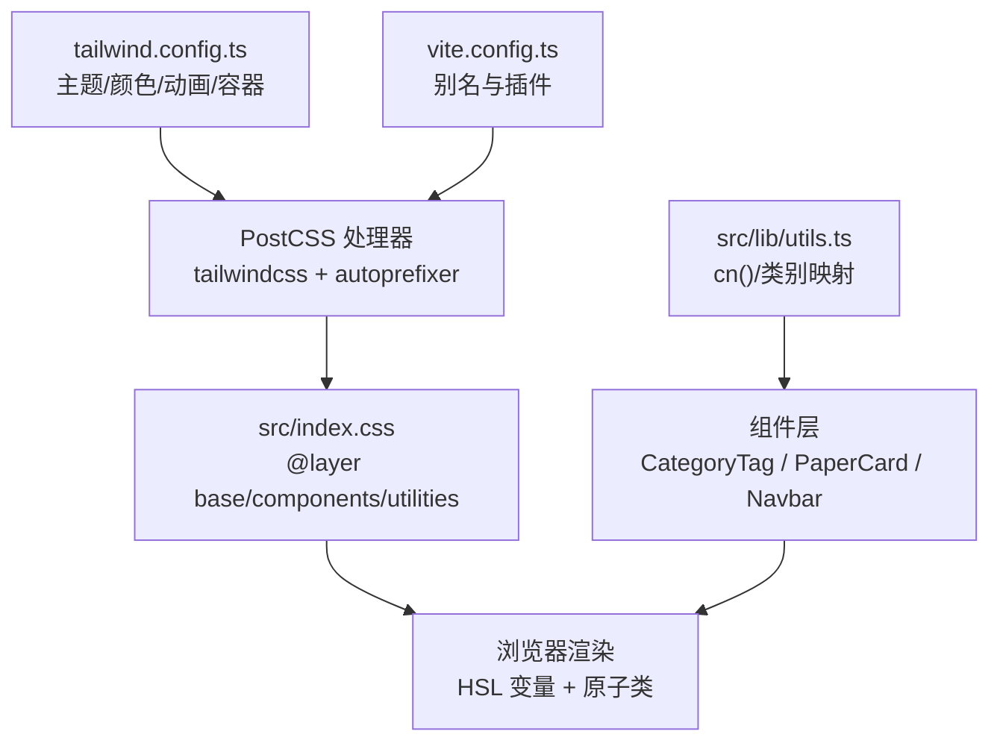
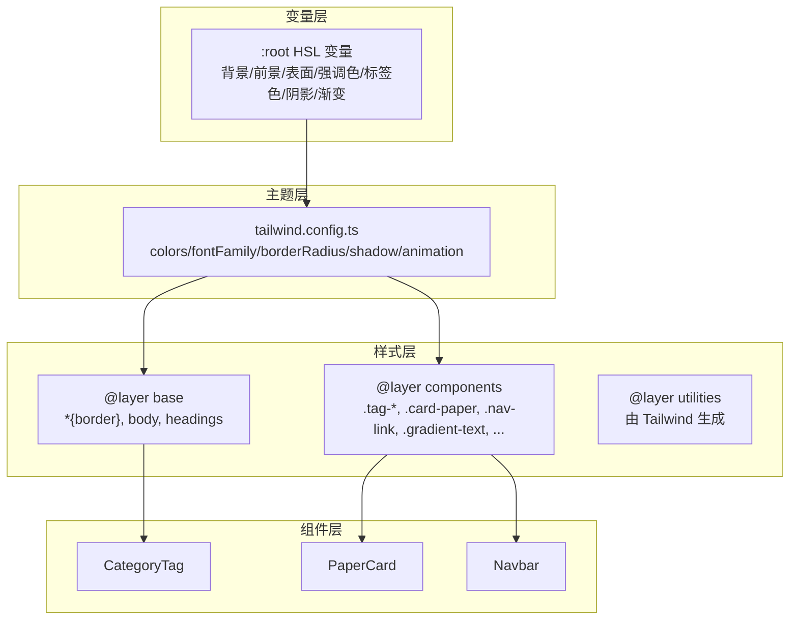
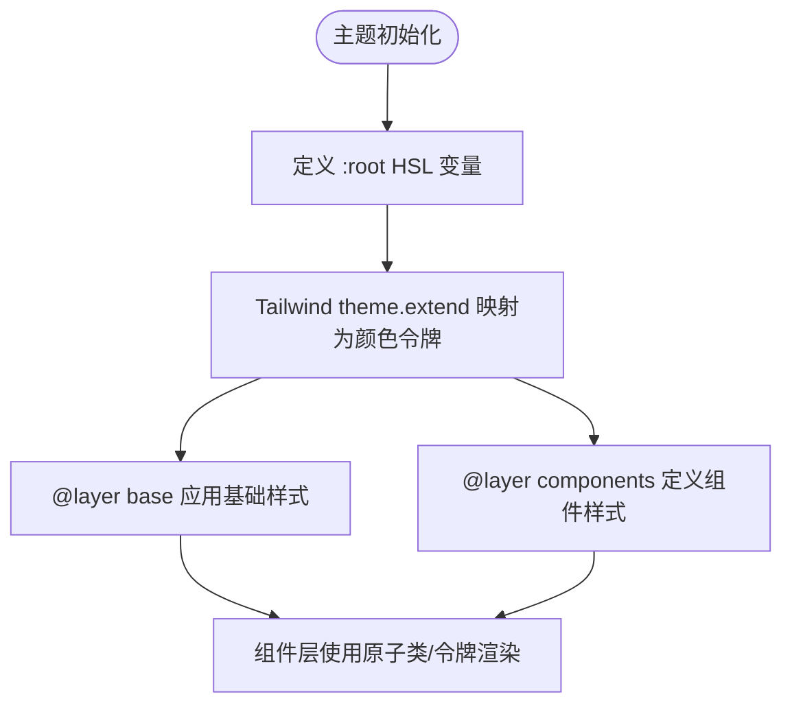
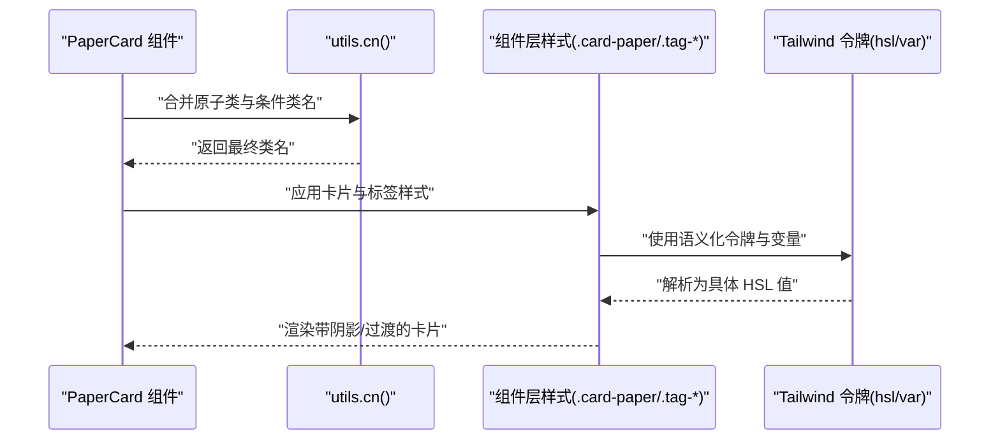
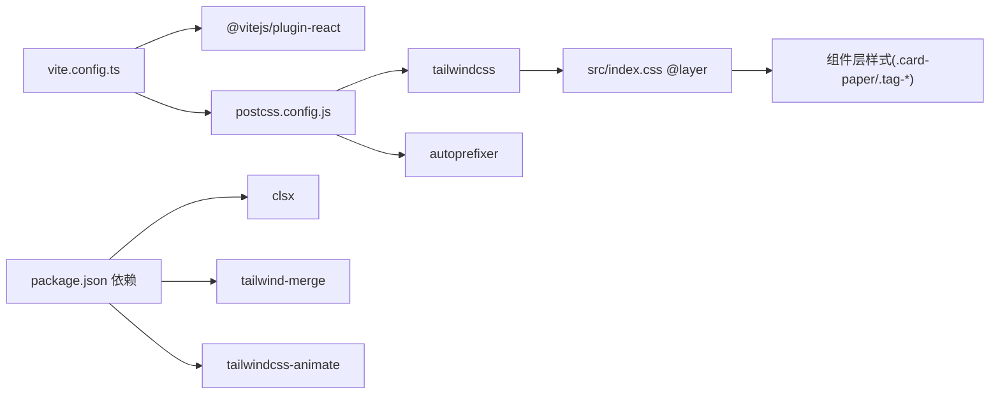

# 样式与主题架构

<cite>
**本文引用的文件**
- [tailwind.config.ts](file://tailwind.config.ts)
- [postcss.config.js](file://postcss.config.js)
- [src/index.css](file://src/index.css)
- [package.json](file://package.json)
- [vite.config.ts](file://vite.config.ts)
- [src/lib/utils.ts](file://src/lib/utils.ts)
- [src/components/ui/CategoryTag.tsx](file://src/components/ui/CategoryTag.tsx)
- [src/components/PaperCard.tsx](file://src/components/PaperCard.tsx)
- [src/components/Navbar.tsx](file://src/components/Navbar.tsx)
- [src/pages/Home.tsx](file://src/pages/Home.tsx)
- [src/App.tsx](file://src/App.tsx)
- [src/data/types.ts](file://src/data/types.ts)
</cite>

## 目录
1. [简介](#简介)
2. [项目结构](#项目结构)
3. [核心组件](#核心组件)
4. [架构总览](#架构总览)
5. [详细组件分析](#详细组件分析)
6. [依赖关系分析](#依赖关系分析)
7. [性能考量](#性能考量)
8. [故障排查指南](#故障排查指南)
9. [结论](#结论)
10. [附录：样式扩展指南](#附录样式扩展指南)

## 简介
本文件系统性梳理 cs336 项目的样式与主题架构，重点覆盖以下方面：
- Tailwind CSS 的配置与使用模式：实用类组合、原子化样式、组件层样式组织
- 主题系统：颜色变量体系、暗色模式支持、响应式与动画策略
- 样式架构设计原则：复用、隔离与全局管理
- CSS-in-JS 与传统 CSS 的混合策略：运行时样式合并与静态样式分层
- 性能优化：打包体积、按需加载与运行时计算开销
- 扩展指南：新增组件样式、主题定制与浏览器兼容

## 项目结构
项目采用“Tailwind 原子化 + PostCSS 层级 + 组件内实用类”的混合架构：
- Tailwind 配置集中于配置文件，启用暗色模式与动画插件，并通过 content 范围扫描源码以裁剪未使用样式
- 全局样式通过 PostCSS 层（base、components）统一注入，定义主题变量、基础排版与通用组件样式
- React 组件内部以原子化类名为主，配合工具函数进行运行时样式合并与条件样式拼接
- Vite 别名与构建链路确保开发体验与产物体积平衡

图表来源
- [tailwind.config.ts:1-104](file://tailwind.config.ts#L1-L104)
- [postcss.config.js:1-7](file://postcss.config.js#L1-L7)
- [src/index.css:1-158](file://src/index.css#L1-L158)
- [vite.config.ts:1-13](file://vite.config.ts#L1-L13)
- [src/lib/utils.ts:1-58](file://src/lib/utils.ts#L1-L58)

章节来源
- [tailwind.config.ts:1-104](file://tailwind.config.ts#L1-L104)
- [postcss.config.js:1-7](file://postcss.config.js#L1-L7)
- [src/index.css:1-158](file://src/index.css#L1-L158)
- [vite.config.ts:1-13](file://vite.config.ts#L1-L13)

## 核心组件
- 主题变量与颜色体系：通过 CSS 变量集中定义背景、前景、表面、卡片、强调色与标签色，Tailwind theme.extend 将其映射为语义化颜色令牌，便于跨组件一致使用
- 动画与阴影：定义一组可复用的 keyframes 与动画，以及卡片阴影与发光阴影变量，统一交互反馈
- 工具函数：cn() 使用 clsx 与 tailwind-merge 合并类名，避免冲突；类别到标签类的映射函数用于动态选择标签样式
- 组件样式：CategoryTag、PaperCard、Navbar 等组件大量使用原子类与自定义组件层样式，体现“最小必要样式”的设计

章节来源
- [src/lib/utils.ts:1-58](file://src/lib/utils.ts#L1-L58)
- [src/components/ui/CategoryTag.tsx:1-25](file://src/components/ui/CategoryTag.tsx#L1-L25)
- [src/components/PaperCard.tsx:1-73](file://src/components/PaperCard.tsx#L1-L73)
- [src/components/Navbar.tsx:1-143](file://src/components/Navbar.tsx#L1-L143)

## 架构总览
整体架构围绕“变量驱动的主题 + 原子化样式 + 组件层样式”展开：
- 变量层：在基础层定义 HSL 变量，形成暗色学术风格主题
- 组件层：在组件层定义常用组件样式（如卡片、标签、导航链接等），减少重复类名
- 组件层：在组件内部直接使用原子类与语义化令牌，保证一致性与可维护性
- 动画层：通过 Tailwind 动画令牌与 keyframes 实现统一的过渡与反馈

图表来源
- [src/index.css:1-158](file://src/index.css#L1-L158)
- [tailwind.config.ts:10-99](file://tailwind.config.ts#L10-L99)
- [src/components/ui/CategoryTag.tsx:1-25](file://src/components/ui/CategoryTag.tsx#L1-L25)
- [src/components/PaperCard.tsx:1-73](file://src/components/PaperCard.tsx#L1-L73)
- [src/components/Navbar.tsx:1-143](file://src/components/Navbar.tsx#L1-L143)

## 详细组件分析

### 主题系统与颜色方案
- 颜色令牌：通过 theme.extend.colors 定义 border/input/ring/background/foreground/surface/card 等语义化令牌，并映射到 CSS 变量，确保组件层样式无需硬编码颜色值
- 标签色：新增 tag.* 类型颜色，分别对应不同业务标签（AI、存储、微信、SSD、文件系统）
- 圆角与阴影：通过 borderRadius 与 boxShadow 将设计变量注入到 tokens，组件层仅需引用令牌即可
- 动画：定义 accordion/fade-in/pulse-dot 等动画，配合组件层使用

图表来源
- [src/index.css:5-61](file://src/index.css#L5-L61)
- [tailwind.config.ts:23-73](file://tailwind.config.ts#L23-L73)
- [src/index.css:79-157](file://src/index.css#L79-L157)

章节来源
- [tailwind.config.ts:18-99](file://tailwind.config.ts#L18-L99)
- [src/index.css:5-61](file://src/index.css#L5-L61)

### 暗色模式支持
- 配置：darkMode 设置为 class，通过给根元素或特定容器添加暗色类名即可切换
- 使用：组件层通过语义化令牌自动适配明暗两套视觉，无需重复编写明暗分支

章节来源
- [tailwind.config.ts:4](file://tailwind.config.ts#L4)

### 响应式设计策略
- 容器与断点：theme.container 定义居中容器与 2xl 屏幕断点，组件层通过 max-w-* 与 grid 响应布局
- 文本与排版：基础层对标题加粗与字距调整，确保在不同尺寸下的可读性
- 组件层：PaperCard、Home 页面网格与筛选区均采用 flex/grid 在小屏与大屏间平滑过渡

章节来源
- [tailwind.config.ts:11-17](file://tailwind.config.ts#L11-L17)
- [src/index.css:74-77](file://src/index.css#L74-L77)
- [src/pages/Home.tsx:194-198](file://src/pages/Home.tsx#L194-L198)

### 样式复用与组件样式隔离
- 复用：通过组件层样式（如 .card-paper、.tag-*、.nav-link）集中定义高频样式，组件内部仅需引用类名
- 隔离：组件内部使用原子类与 cn() 合并，避免样式串扰；组件层样式限定作用域，不污染全局
- 一致性：语义化令牌与 CSS 变量确保跨组件视觉一致

章节来源
- [src/index.css:79-157](file://src/index.css#L79-L157)
- [src/lib/utils.ts:5-7](file://src/lib/utils.ts#L5-L7)

### CSS-in-JS 与传统 CSS 的混合
- 传统 CSS：全局样式与组件层样式通过 PostCSS 注入，保证首屏与通用样式的稳定输出
- 运行时样式：cn() 用于合并类名，避免重复与冲突；类别到标签类的映射函数在运行时决定标签外观
- 渐变与动态色：部分组件使用内联 style 或 CSS 变量实现动态色（如导航徽标背景），保持灵活性

章节来源
- [src/lib/utils.ts:5-7](file://src/lib/utils.ts#L5-L7)
- [src/components/Navbar.tsx:46-52](file://src/components/Navbar.tsx#L46-L52)

### 动态样式生成与运行时计算
- cn()：在组件层根据 props 条件拼接类名，减少不必要的 CSS 文件拆分
- 类别映射：根据数据类别动态选择标签样式，避免为每个类别单独写样式文件

章节来源
- [src/lib/utils.ts:9-27](file://src/lib/utils.ts#L9-L27)
- [src/components/ui/CategoryTag.tsx:11-24](file://src/components/ui/CategoryTag.tsx#L11-L24)

### 关键流程示例：PaperCard 样式渲染

图表来源
- [src/components/PaperCard.tsx:11-72](file://src/components/PaperCard.tsx#L11-L72)
- [src/lib/utils.ts:5-7](file://src/lib/utils.ts#L5-L7)
- [src/index.css:79-157](file://src/index.css#L79-L157)
- [tailwind.config.ts:23-73](file://tailwind.config.ts#L23-L73)

## 依赖关系分析
- 构建链路：Vite + React 插件负责编译 TS/TSX；PostCSS 通过 tailwindcss 与 autoprefixer 处理样式；Tailwind 依据配置扫描源码生成所需原子类
- 运行时依赖：clsx 与 tailwind-merge 提供类名合并与冲突消除；tailwindcss-animate 提供动画令牌
- 主题依赖：CSS 变量与 Tailwind 令牌双向绑定，确保样式层与主题层协同工作

图表来源
- [vite.config.ts:1-13](file://vite.config.ts#L1-L13)
- [postcss.config.js:1-7](file://postcss.config.js#L1-L7)
- [package.json:11-20](file://package.json#L11-L20)
- [src/index.css:1-3](file://src/index.css#L1-L3)

章节来源
- [package.json:11-20](file://package.json#L11-L20)
- [postcss.config.js:1-7](file://postcss.config.js#L1-L7)
- [vite.config.ts:1-13](file://vite.config.ts#L1-L13)

## 性能考量
- 样式裁剪：Tailwind content 扫描确保未使用的类名被移除，降低产物体积
- 动画与阴影：通过变量与令牌统一管理，避免重复定义导致的体积膨胀
- 运行时合并：cn() 在组件层进行类名合并，减少额外 CSS 文件拆分带来的网络开销
- 构建优化：PostCSS 自动前缀与 Tailwind 生成的原子类，减少手写冗余样式

章节来源
- [tailwind.config.ts:5-8](file://tailwind.config.ts#L5-L8)
- [postcss.config.js:1-7](file://postcss.config.js#L1-L7)

## 故障排查指南
- 样式不生效
  - 检查是否正确引入全局样式文件与 @layer 指令
  - 确认 Tailwind 配置的 content 路径包含当前组件文件
- 类名冲突
  - 使用 cn() 合并类名，避免重复设置相同属性
- 暗色模式无效
  - 确认根元素或容器存在暗色类名，且 darkMode 配置为 class
- 动画/阴影异常
  - 检查组件层样式是否引用了正确的令牌与变量
- 浏览器兼容
  - 依赖 autoprefixer 自动添加前缀，确保目标浏览器支持

章节来源
- [src/index.css:1-3](file://src/index.css#L1-L3)
- [tailwind.config.ts:4](file://tailwind.config.ts#L4)
- [postcss.config.js:1-7](file://postcss.config.js#L1-L7)

## 结论
cs336 的样式体系以 Tailwind 原子化为核心，结合 PostCSS 层级与 CSS 变量，实现了主题统一、样式复用与组件隔离。通过 cn() 与类别映射等运行时策略，兼顾了灵活性与性能。整体架构清晰、扩展性强，适合持续演进。

## 附录：样式扩展指南
- 新增组件样式
  - 在组件层定义必要的类名，尽量复用现有令牌与变量
  - 若需要新的语义化令牌，先在 Tailwind 配置中扩展，再在组件层使用
- 主题定制
  - 修改 :root 中的 HSL 变量，或在 tailwind.config.ts 中扩展颜色与阴影
  - 通过暗色类名快速切换主题，验证明暗一致性
- 浏览器兼容
  - 依赖 autoprefixer 自动生成前缀，确保主流浏览器可用
- 性能建议
  - 控制组件层样式数量，优先使用原子类与令牌
  - 避免在组件内部频繁创建新的类名字符串，统一通过 cn() 合并

章节来源
- [src/index.css:5-61](file://src/index.css#L5-L61)
- [tailwind.config.ts:18-99](file://tailwind.config.ts#L18-L99)
- [src/lib/utils.ts:5-7](file://src/lib/utils.ts#L5-L7)