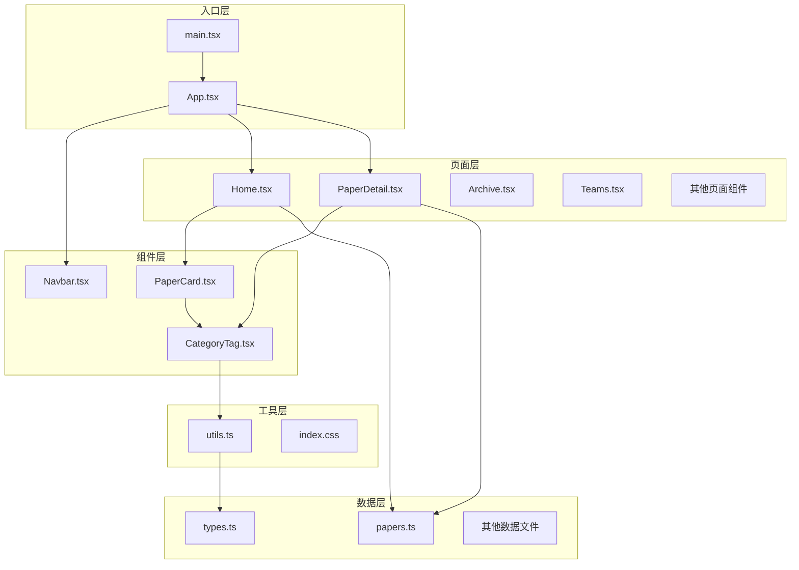
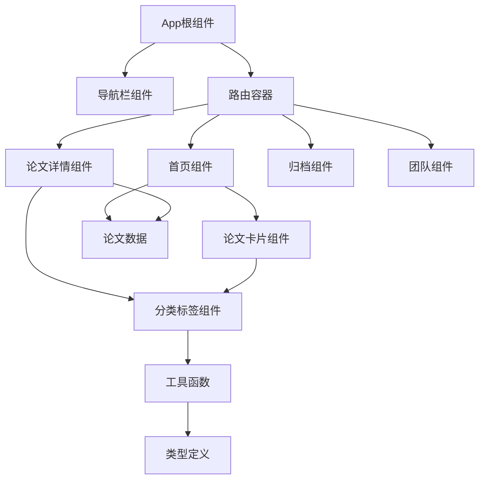
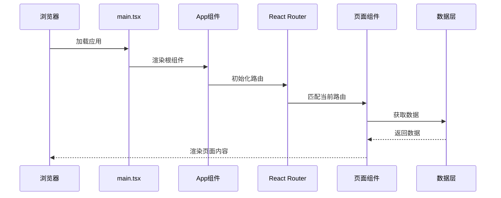
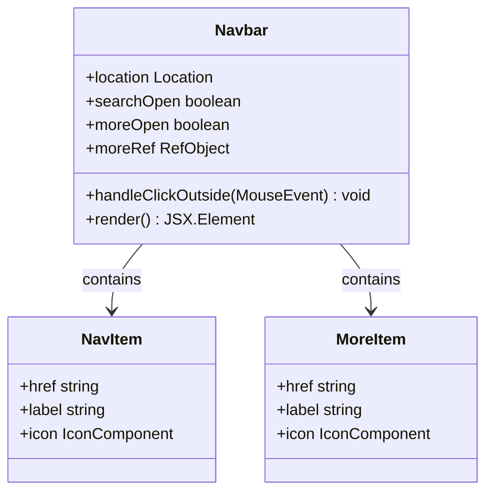
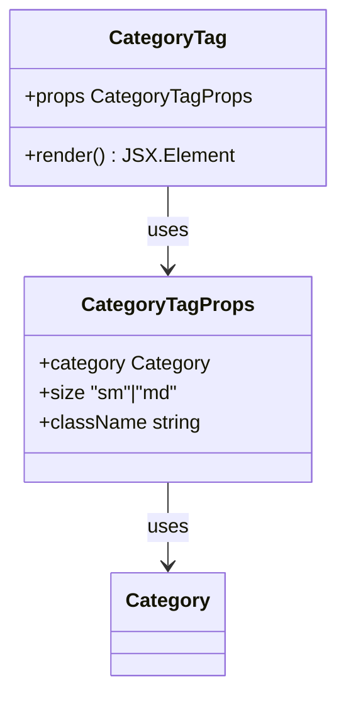
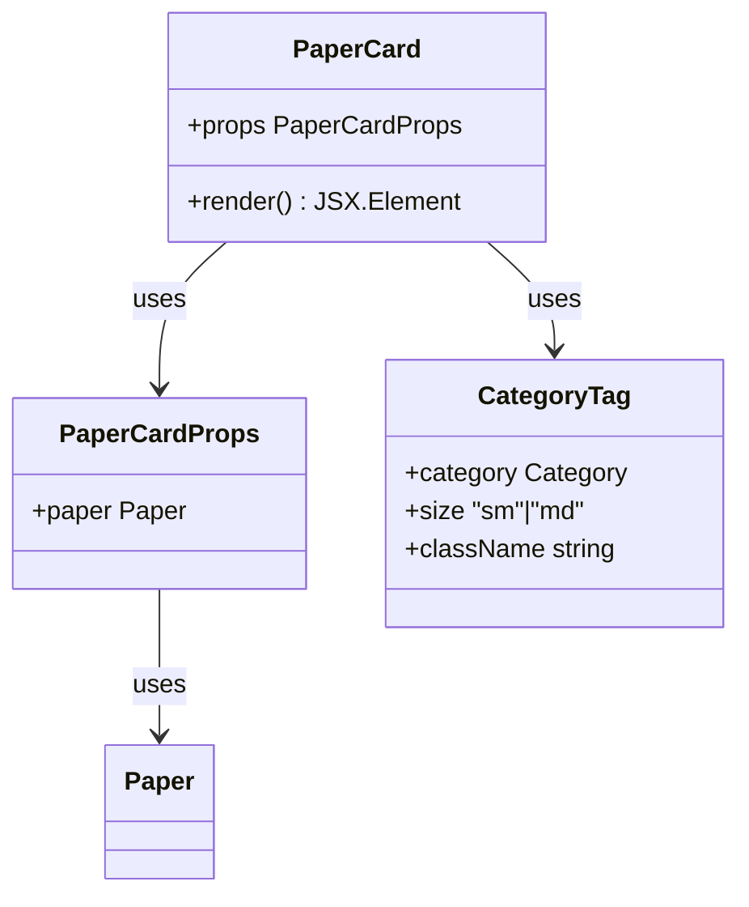
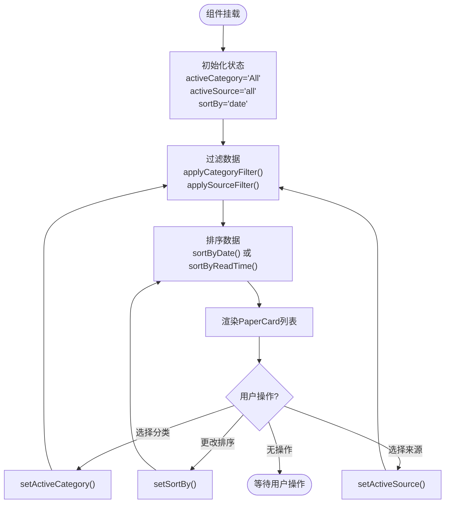
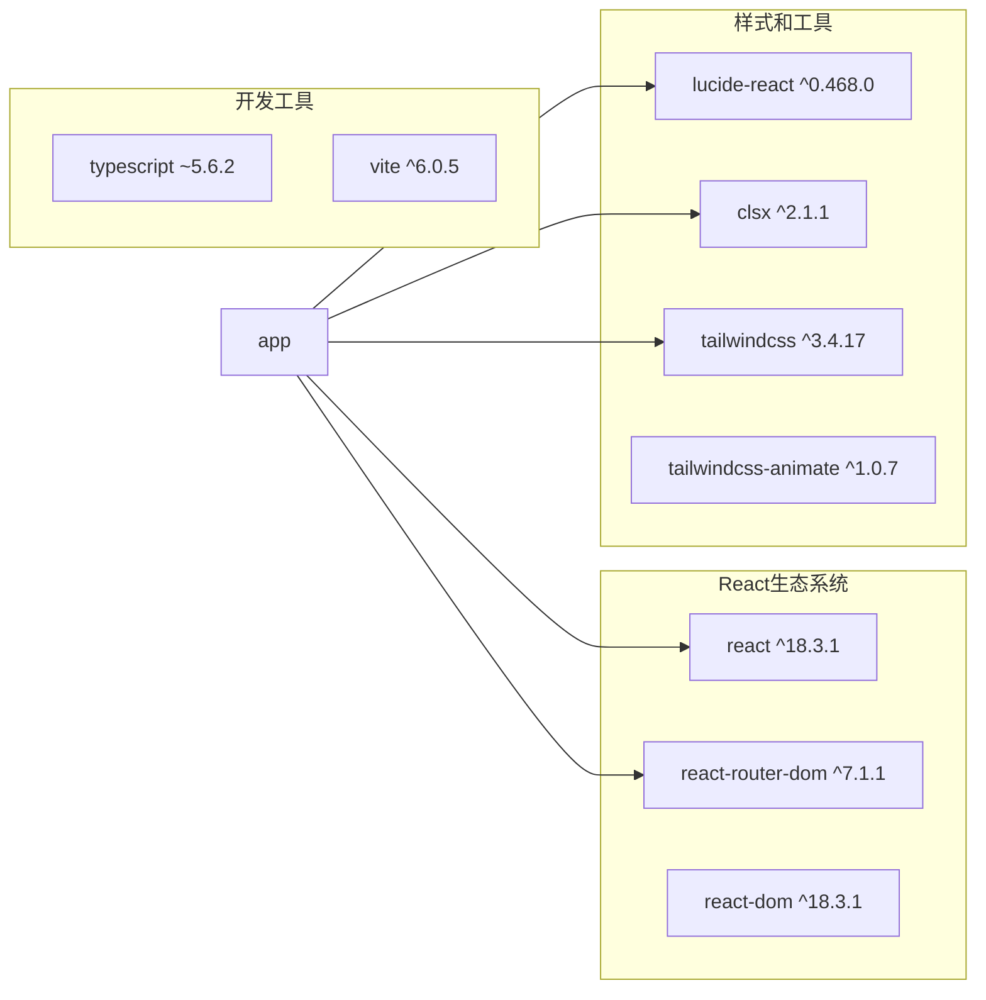
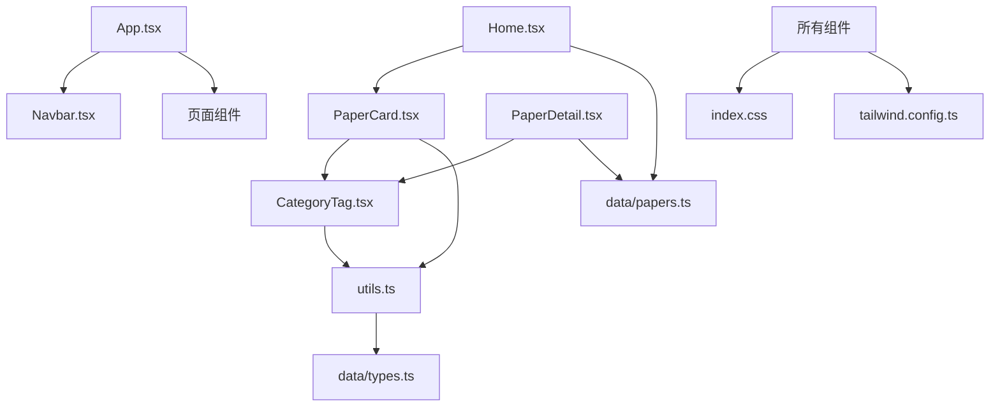

# 组件架构设计

<cite>
**本文档引用的文件**
- [src/App.tsx](file://src/App.tsx)
- [src/main.tsx](file://src/main.tsx)
- [src/components/Navbar.tsx](file://src/components/Navbar.tsx)
- [src/components/ui/CategoryTag.tsx](file://src/components/ui/CategoryTag.tsx)
- [src/components/PaperCard.tsx](file://src/components/PaperCard.tsx)
- [src/data/types.ts](file://src/data/types.ts)
- [src/lib/utils.ts](file://src/lib/utils.ts)
- [src/pages/Home.tsx](file://src/pages/Home.tsx)
- [src/pages/PaperDetail.tsx](file://src/pages/PaperDetail.tsx)
- [src/data/papers.ts](file://src/data/papers.ts)
- [package.json](file://package.json)
- [tailwind.config.ts](file://tailwind.config.ts)
- [tsconfig.json](file://tsconfig.json)
</cite>

## 目录
1. [简介](#简介)
2. [项目结构](#项目结构)
3. [核心组件](#核心组件)
4. [架构概览](#架构概览)
5. [详细组件分析](#详细组件分析)
6. [依赖关系分析](#依赖关系分析)
7. [性能考虑](#性能考虑)
8. [故障排除指南](#故障排除指南)
9. [结论](#结论)

## 简介

cs336是一个基于React和TypeScript构建的存储领域论文阅读器应用。该项目采用组件化架构设计，专注于AI与存储领域的前沿论文展示、深度解读和知识管理。应用通过React Router实现路由管理，使用Tailwind CSS进行样式设计，并通过TypeScript提供强类型安全保障。

## 项目结构

项目采用清晰的分层组织结构，按照功能模块和职责进行划分：

**图表来源**
- [src/main.tsx:1-14](file://src/main.tsx#L1-L14)
- [src/App.tsx:1-45](file://src/App.tsx#L1-L45)

**章节来源**
- [src/main.tsx:1-14](file://src/main.tsx#L1-L14)
- [src/App.tsx:1-45](file://src/App.tsx#L1-L45)

## 核心组件

### 应用根组件设计模式

应用采用单一根组件模式，通过React Router实现路由管理。根组件App负责：
- 导航栏组件的渲染
- 路由配置和页面映射
- 页面内容的容器布局

### 组件层次结构

组件按照职责进行分层设计：

**图表来源**
- [src/App.tsx:19-42](file://src/App.tsx#L19-L42)
- [src/components/Navbar.tsx:22-142](file://src/components/Navbar.tsx#L22-L142)

**章节来源**
- [src/App.tsx:19-42](file://src/App.tsx#L19-L42)
- [src/components/Navbar.tsx:22-142](file://src/components/Navbar.tsx#L22-L142)

## 架构概览

应用采用经典的React组件化架构，结合TypeScript类型系统和Tailwind CSS样式框架：

**图表来源**
- [src/main.tsx:7-13](file://src/main.tsx#L7-L13)
- [src/App.tsx:20-41](file://src/App.tsx#L20-L41)

### 组件通信机制

应用采用以下几种组件通信方式：

1. **Props传递**：父组件向子组件传递数据和回调函数
2. **状态提升**：在共同祖先组件中管理共享状态
3. **事件处理**：通过回调函数处理用户交互
4. **路由参数**：通过URL参数传递页面标识

**章节来源**
- [src/pages/Home.tsx:15-33](file://src/pages/Home.tsx#L15-L33)
- [src/pages/PaperDetail.tsx:7-21](file://src/pages/PaperDetail.tsx#L7-L21)

## 详细组件分析

### 导航栏组件 (Navbar)

Navbar组件实现了响应式导航栏，包含以下特性：

#### 设计特点
- **响应式布局**：支持桌面端和移动端显示
- **下拉菜单**：More按钮展开更多导航项
- **搜索功能**：可展开的搜索输入框
- **活动状态指示**：根据当前路由高亮对应导航项

#### 状态管理
- 使用useState管理展开状态
- 使用useRef获取DOM引用
- 使用useEffect处理外部点击事件

**图表来源**
- [src/components/Navbar.tsx:22-142](file://src/components/Navbar.tsx#L22-L142)

**章节来源**
- [src/components/Navbar.tsx:22-142](file://src/components/Navbar.tsx#L22-L142)

### 分类标签组件 (CategoryTag)

CategoryTag组件实现了可复用的分类标签显示功能：

#### 接口设计
- **Props接口**：定义category、size、className属性
- **类型约束**：使用Category联合类型确保类型安全
- **默认值**：size属性默认为'sm'

#### 设计理念
- **单一职责**：专门负责分类标签的渲染
- **可扩展性**：通过className属性支持样式定制
- **一致性**：统一的标签样式和行为

**图表来源**
- [src/components/ui/CategoryTag.tsx:5-9](file://src/components/ui/CategoryTag.tsx#L5-L9)

**章节来源**
- [src/components/ui/CategoryTag.tsx:5-25](file://src/components/ui/CategoryTag.tsx#L5-L25)
- [src/data/types.ts:1](file://src/data/types.ts#L1-L1)

### 论文卡片组件 (PaperCard)

PaperCard组件实现了论文信息的卡片式展示：

#### 功能特性
- **多语言支持**：支持中英文论文标题显示
- **分类标签**：显示论文的分类标签
- **作者信息**：显示作者列表和数量
- **元数据展示**：显示日期、阅读时间和来源

#### 组合模式
- **组件组合**：PaperCard内部组合使用CategoryTag
- **条件渲染**：根据数据状态动态显示内容
- **链接导航**：点击卡片跳转到论文详情页

**图表来源**
- [src/components/PaperCard.tsx:7-9](file://src/components/PaperCard.tsx#L7-L9)

**章节来源**
- [src/components/PaperCard.tsx:7-73](file://src/components/PaperCard.tsx#L7-L73)

### 首页组件 (Home)

Home组件实现了论文列表的主页面：

#### 状态管理策略
- **本地状态**：使用useState管理过滤器状态
- **计算状态**：使用useMemo优化数据过滤和排序
- **响应式更新**：状态变化触发重新渲染

#### 过滤和排序机制
- **分类过滤**：支持按论文分类筛选
- **来源过滤**：支持按数据源筛选
- **排序规则**：支持按日期或阅读时间排序

**图表来源**
- [src/pages/Home.tsx:15-33](file://src/pages/Home.tsx#L15-L33)

**章节来源**
- [src/pages/Home.tsx:15-209](file://src/pages/Home.tsx#L15-L209)

### 论文详情组件 (PaperDetail)

PaperDetail组件实现了单篇论文的详细展示：

#### 错误处理机制
- **参数验证**：检查URL参数的有效性
- **数据查找**：在数据集中查找对应论文
- **降级处理**：当论文不存在时显示友好提示

#### 内容组织结构
- **基本信息**：标题、作者、日期、来源
- **核心贡献**：论文的主要贡献点列表
- **架构图**：可选的系统架构图展示
- **标签系统**：论文相关的标签展示

**章节来源**
- [src/pages/PaperDetail.tsx:7-151](file://src/pages/PaperDetail.tsx#L7-L151)

## 依赖关系分析

### 外部依赖

应用使用以下关键技术栈：

**图表来源**
- [package.json:11-29](file://package.json#L11-L29)

### 内部依赖关系

**图表来源**
- [src/App.tsx:1-18](file://src/App.tsx#L1-L18)
- [src/components/PaperCard.tsx:1-5](file://src/components/PaperCard.tsx#L1-L5)

**章节来源**
- [package.json:11-31](file://package.json#L11-L31)

## 性能考虑

### 渲染优化

1. **记忆化计算**：使用useMemo避免不必要的数据过滤和排序
2. **条件渲染**：根据数据状态动态显示内容
3. **懒加载**：图片资源使用懒加载策略

### 状态管理优化

1. **状态最小化**：只在必要组件中维护状态
2. **状态提升**：在合适的层级管理共享状态
3. **事件防抖**：对于频繁触发的事件进行防抖处理

### 样式优化

1. **原子化CSS**：使用Tailwind CSS实现高效的样式管理
2. **条件类名**：通过cn函数动态组合样式类
3. **主题变量**：使用CSS变量实现主题切换

## 故障排除指南

### 常见问题及解决方案

#### 组件渲染问题
- **症状**：组件不显示或显示异常
- **原因**：Props类型不匹配或状态未正确初始化
- **解决**：检查TypeScript类型定义和初始状态设置

#### 路由导航问题
- **症状**：页面跳转失败或参数丢失
- **原因**：路由配置错误或参数解析问题
- **解决**：验证路由配置和参数提取逻辑

#### 样式显示问题
- **症状**：组件样式错乱或主题不一致
- **原因**：CSS类名冲突或主题变量未正确设置
- **解决**：检查Tailwind配置和CSS变量定义

**章节来源**
- [src/pages/PaperDetail.tsx:11-21](file://src/pages/PaperDetail.tsx#L11-L21)
- [src/components/Navbar.tsx:29-37](file://src/components/Navbar.tsx#L29-L37)

## 结论

cs336项目展现了良好的React组件化架构设计，具有以下特点：

### 架构优势
- **清晰的层次结构**：组件职责明确，层次清晰
- **强类型保障**：TypeScript提供编译时类型检查
- **可复用性**：组件设计遵循单一职责原则
- **响应式设计**：支持多端适配

### 改进建议
- **状态管理**：可以考虑引入状态管理库处理复杂状态
- **测试覆盖**：增加组件单元测试和集成测试
- **性能监控**：添加性能指标监控和优化
- **国际化**：支持多语言内容展示

该架构为存储领域的论文阅读应用提供了坚实的技术基础，具有良好的扩展性和维护性。