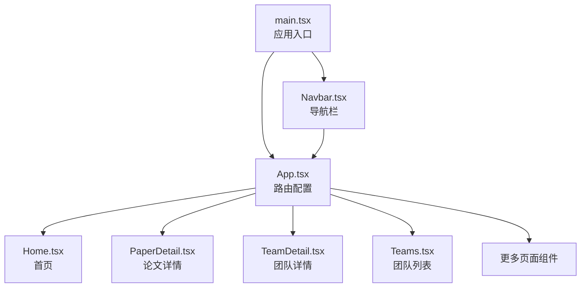
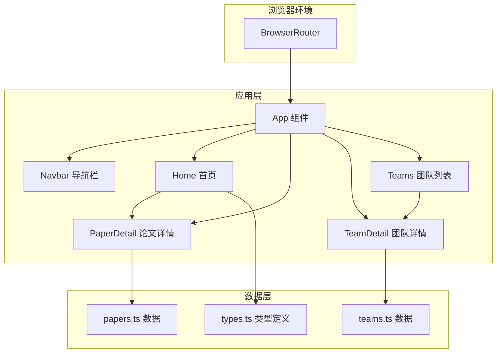
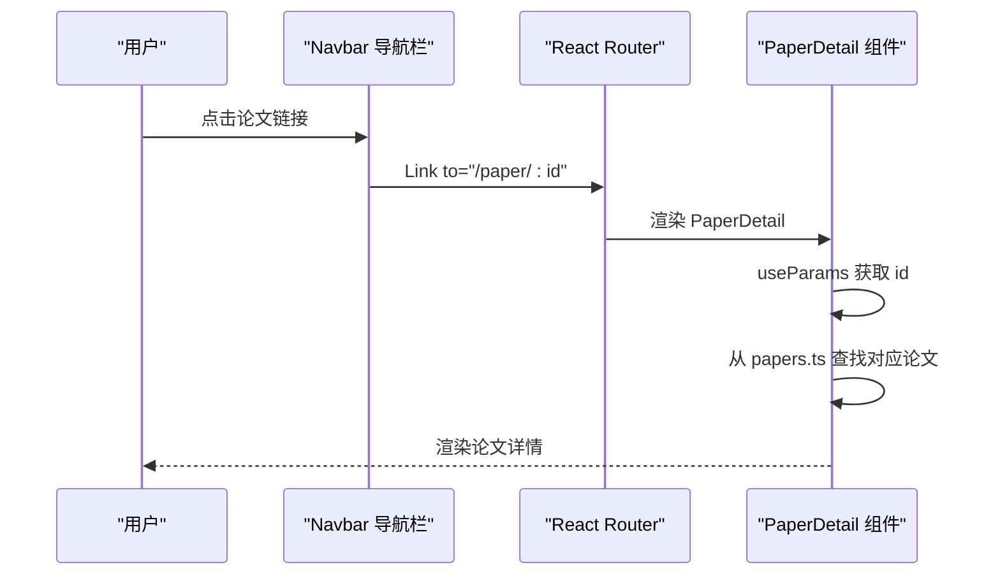
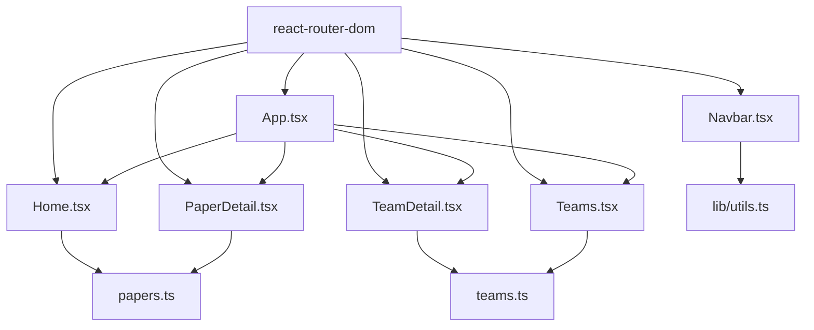

# 路由系统设计

<cite>
**本文档引用的文件**
- [src/App.tsx](file://src/App.tsx)
- [src/main.tsx](file://src/main.tsx)
- [src/components/Navbar.tsx](file://src/components/Navbar.tsx)
- [src/pages/Home.tsx](file://src/pages/Home.tsx)
- [src/pages/PaperDetail.tsx](file://src/pages/PaperDetail.tsx)
- [src/pages/TeamDetail.tsx](file://src/pages/TeamDetail.tsx)
- [src/pages/Teams.tsx](file://src/pages/Teams.tsx)
- [src/data/papers.ts](file://src/data/papers.ts)
- [src/data/teams.ts](file://src/data/teams.ts)
- [src/data/types.ts](file://src/data/types.ts)
- [src/lib/utils.ts](file://src/lib/utils.ts)
- [vite.config.ts](file://vite.config.ts)
- [package.json](file://package.json)
</cite>

## 目录
1. [简介](#简介)
2. [项目结构](#项目结构)
3. [核心组件](#核心组件)
4. [架构概览](#架构概览)
5. [详细组件分析](#详细组件分析)
6. [依赖关系分析](#依赖关系分析)
7. [性能考量](#性能考量)
8. [故障排除指南](#故障排除指南)
9. [结论](#结论)
10. [附录](#附录)

## 简介
本文件针对 cs336 项目的 React Router DOM 路由系统进行全面设计文档化，覆盖路由配置、路径匹配规则、页面导航逻辑、URL 结构设计、参数传递机制、路由守卫与页面跳转策略、性能优化（代码分割、懒加载、预加载）、以及扩展最佳实践。项目采用 React Router v7，通过 BrowserRouter 包装应用，使用静态路由与动态路由相结合的方式组织页面。

## 项目结构
cs336 项目采用按页面组织的目录结构，路由集中在应用入口进行统一配置，导航栏组件通过 Link 组件实现页面跳转，部分页面使用 useParams 获取动态路由参数。

**图表来源**
- [src/main.tsx:1-14](file://src/main.tsx#L1-L14)
- [src/App.tsx:1-45](file://src/App.tsx#L1-L45)

**章节来源**
- [src/main.tsx:1-14](file://src/main.tsx#L1-L14)
- [src/App.tsx:1-45](file://src/App.tsx#L1-L45)

## 核心组件
- 应用入口与路由容器
  - main.tsx 使用 BrowserRouter 包裹整个应用，确保路由功能生效。
  - App.tsx 中集中声明所有路由规则，包含静态路由与动态路由。
- 导航组件
  - Navbar.tsx 使用 Link 组件进行页面跳转，并通过 useLocation 判断当前激活状态，实现导航高亮。
- 页面组件
  - Home.tsx 作为首页，提供筛选与排序功能，内部通过 Link 跳转到论文详情页。
  - PaperDetail.tsx 与 TeamDetail.tsx 通过 useParams 获取动态路由参数，实现详情页渲染。
  - Teams.tsx 展示团队列表，点击卡片跳转到团队详情页。

**章节来源**
- [src/main.tsx:1-14](file://src/main.tsx#L1-L14)
- [src/App.tsx:1-45](file://src/App.tsx#L1-L45)
- [src/components/Navbar.tsx:1-143](file://src/components/Navbar.tsx#L1-L143)
- [src/pages/Home.tsx:1-209](file://src/pages/Home.tsx#L1-L209)
- [src/pages/PaperDetail.tsx:1-151](file://src/pages/PaperDetail.tsx#L1-L151)
- [src/pages/TeamDetail.tsx:1-194](file://src/pages/TeamDetail.tsx#L1-L194)
- [src/pages/Teams.tsx:1-134](file://src/pages/Teams.tsx#L1-L134)

## 架构概览
路由系统采用 React Router v7 的声明式路由配置，BrowserRouter 作为根容器，Routes/Route 定义静态与动态路由，Link 用于页面跳转，useParams 用于获取动态参数，useLocation 用于导航高亮判断。

**图表来源**
- [src/main.tsx:1-14](file://src/main.tsx#L1-L14)
- [src/App.tsx:1-45](file://src/App.tsx#L1-L45)
- [src/components/Navbar.tsx:1-143](file://src/components/Navbar.tsx#L1-L143)
- [src/pages/Home.tsx:1-209](file://src/pages/Home.tsx#L1-L209)
- [src/pages/PaperDetail.tsx:1-151](file://src/pages/PaperDetail.tsx#L1-L151)
- [src/pages/TeamDetail.tsx:1-194](file://src/pages/TeamDetail.tsx#L1-L194)
- [src/pages/Teams.tsx:1-134](file://src/pages/Teams.tsx#L1-L134)
- [src/data/papers.ts:1-815](file://src/data/papers.ts#L1-L815)
- [src/data/teams.ts:1-168](file://src/data/teams.ts#L1-L168)
- [src/data/types.ts:1-49](file://src/data/types.ts#L1-L49)

## 详细组件分析

### 路由配置与路径匹配
- 静态路由
  - 根路径 "/" 对应 Home 页面。
  - 专题活动路由如 "/fast2026"、"/osdi2025"、"/atc2024"、"/deep-dive/rask"、"/deep-dive/discogc" 等。
  - 其他静态页面如 "/linux-bugfix"、"/spdk"、"/faults"、"/opensource"、"/daily"、"/archive"。
- 动态路由
  - 论文详情路由 "/paper/:id"，团队详情路由 "/teams/:id"。
  - 动态参数通过 useParams 获取，组件内部根据参数从数据源中查找对应实体。
- 路由匹配规则
  - React Router v7 采用严格匹配，优先匹配更具体的路由。动态路由参数以冒号前缀标识，如 ":id"。
  - 未匹配到路由时，可结合 Switch/Route 的默认行为进行兜底处理（当前项目未显式配置兜底路由，可通过扩展实现）。

**章节来源**
- [src/App.tsx:23-39](file://src/App.tsx#L23-L39)
- [src/pages/PaperDetail.tsx:7-9](file://src/pages/PaperDetail.tsx#L7-L9)
- [src/pages/TeamDetail.tsx:6-8](file://src/pages/TeamDetail.tsx#L6-L8)

### URL 结构设计与路由参数传递
- URL 设计原则
  - 静态路由用于固定页面，如首页、专题活动、归档等。
  - 动态路由用于实体详情，如论文详情、团队详情，参数使用实体唯一标识符（id）。
- 参数传递机制
  - 组件通过 useParams 获取动态参数，然后在组件内部根据参数从数据源（papers.ts、teams.ts）中查找对应实体。
  - 导航组件通过 Link 将参数拼接到 URL，如 "/teams/{teamId}"。
- 参数类型与约束
  - types.ts 定义了 Paper 与 Team 的 id 类型，确保参数类型一致。
  - 数据源 papers.ts 与 teams.ts 提供 id 到实体对象的映射，便于组件快速渲染。

**图表来源**
- [src/components/Navbar.tsx:1-143](file://src/components/Navbar.tsx#L1-L143)
- [src/App.tsx:25](file://src/App.tsx#L25)
- [src/pages/PaperDetail.tsx:7-9](file://src/pages/PaperDetail.tsx#L7-L9)
- [src/data/papers.ts:1-815](file://src/data/papers.ts#L1-L815)

**章节来源**
- [src/pages/PaperDetail.tsx:1-151](file://src/pages/PaperDetail.tsx#L1-L151)
- [src/pages/TeamDetail.tsx:1-194](file://src/pages/TeamDetail.tsx#L1-L194)
- [src/pages/Teams.tsx:115-120](file://src/pages/Teams.tsx#L115-L120)
- [src/data/papers.ts:1-815](file://src/data/papers.ts#L1-L815)
- [src/data/teams.ts:1-168](file://src/data/teams.ts#L1-L168)
- [src/data/types.ts:1-49](file://src/data/types.ts#L1-L49)

### 导航状态管理与用户体验优化
- 导航高亮
  - Navbar 使用 useLocation 获取当前路径，通过比较 location.pathname 与导航项 href 决定是否高亮。
- 用户体验优化
  - 首页 Home 提供分类筛选、来源过滤与排序功能，减少用户认知负担。
  - 详情页提供返回按钮，便于用户快速回到上一页。
  - Link 组件在导航时保持页面平滑过渡，提升交互流畅度。

**章节来源**
- [src/components/Navbar.tsx:22-40](file://src/components/Navbar.tsx#L22-L40)
- [src/pages/Home.tsx:15-35](file://src/pages/Home.tsx#L15-L35)
- [src/pages/PaperDetail.tsx:23-30](file://src/pages/PaperDetail.tsx#L23-L30)

### 路由守卫与页面跳转策略
- 当前实现
  - 项目未实现显式的路由守卫（如登录态校验、权限控制）。
  - 页面跳转通过 Link 组件实现，无需额外的守卫逻辑。
- 策略建议
  - 可通过自定义 Hook 封装路由守卫，结合 useNavigate 在进入受保护路由前进行校验。
  - 对于动态路由参数非法的情况，可在组件内进行参数校验与错误处理（当前 PaperDetail/TeamDetail 已做参数不存在的处理）。

**章节来源**
- [src/pages/PaperDetail.tsx:11-21](file://src/pages/PaperDetail.tsx#L11-L21)
- [src/pages/TeamDetail.tsx:10-20](file://src/pages/TeamDetail.tsx#L10-L20)

### 性能优化策略
- 代码分割与懒加载
  - Vite 默认支持按需打包，React Router v7 支持动态导入组件以实现懒加载。
  - 建议对大型页面组件（如 Home、PaperDetail、TeamDetail）使用动态导入，减少首屏包体积。
- 路由预加载
  - 对高频访问的页面（如首页、团队列表）可采用预加载策略，提升用户交互响应速度。
- 构建优化
  - vite.config.ts 配置了路径别名 @，有助于减少打包体积与提升构建速度。
  - package.json 中的依赖版本明确，确保构建稳定性。

**章节来源**
- [vite.config.ts:1-13](file://vite.config.ts#L1-L13)
- [package.json:1-32](file://package.json#L1-L32)

### 路由扩展最佳实践
- 新增页面路由配置
  - 在 App.tsx 的 Routes/Route 中添加新的静态路由或动态路由。
  - 确保 Link 组件中的目标路径与路由配置一致。
- 路由命名规范
  - 静态路由使用名词短语，如 "/fast2026"、"/teams"。
  - 动态路由使用实体名称加参数，如 "/paper/:id"、"/teams/:id"。
  - 参数命名使用小驼峰，如 ":id"、":year"。
- 数据一致性
  - 确保数据源（papers.ts、teams.ts）中的 id 与路由参数一致，避免 404 或渲染异常。

**章节来源**
- [src/App.tsx:23-39](file://src/App.tsx#L23-L39)
- [src/pages/Teams.tsx:115-120](file://src/pages/Teams.tsx#L115-L120)
- [src/data/papers.ts:1-815](file://src/data/papers.ts#L1-L815)
- [src/data/teams.ts:1-168](file://src/data/teams.ts#L1-L168)

## 依赖关系分析
- 外部依赖
  - react-router-dom：提供 BrowserRouter、Routes、Route、Link、useParams、useLocation 等核心 API。
  - vite：构建工具，支持路径别名与按需打包。
- 内部依赖
  - App.tsx 依赖所有页面组件与 Navbar。
  - 页面组件依赖数据源（papers.ts、teams.ts）与工具函数（lib/utils.ts）。
  - Navbar 依赖 Link 与 useLocation，实现导航高亮。

**图表来源**
- [src/App.tsx:1-45](file://src/App.tsx#L1-L45)
- [src/components/Navbar.tsx:1-143](file://src/components/Navbar.tsx#L1-L143)
- [src/pages/Home.tsx:1-209](file://src/pages/Home.tsx#L1-L209)
- [src/pages/PaperDetail.tsx:1-151](file://src/pages/PaperDetail.tsx#L1-L151)
- [src/pages/TeamDetail.tsx:1-194](file://src/pages/TeamDetail.tsx#L1-L194)
- [src/pages/Teams.tsx:1-134](file://src/pages/Teams.tsx#L1-L134)
- [src/data/papers.ts:1-815](file://src/data/papers.ts#L1-L815)
- [src/data/teams.ts:1-168](file://src/data/teams.ts#L1-L168)
- [src/lib/utils.ts:1-58](file://src/lib/utils.ts#L1-L58)

**章节来源**
- [package.json:11-20](file://package.json#L11-L20)
- [vite.config.ts:1-13](file://vite.config.ts#L1-L13)

## 性能考量
- 代码分割
  - 对大型页面组件使用动态导入，减少初始包体积，提升首屏加载速度。
- 懒加载
  - 在路由层面启用懒加载，避免一次性加载所有页面组件。
- 预加载
  - 对用户可能访问的页面进行预加载，提升后续导航体验。
- 构建优化
  - 利用 Vite 的按需打包与路径别名，减少打包体积与提升构建效率。

## 故障排除指南
- 动态路由参数无效
  - 检查 Link 组件的目标路径是否与路由配置一致。
  - 确认数据源中的 id 是否存在，避免渲染空内容。
- 导航高亮不生效
  - 检查 useLocation 与 Link to 的路径是否匹配。
  - 确认 Navbar 中的导航项 href 与路由配置一致。
- 页面空白或 404
  - 检查 App.tsx 中的路由配置是否正确。
  - 确认组件内部的参数校验逻辑是否完善。

**章节来源**
- [src/pages/PaperDetail.tsx:11-21](file://src/pages/PaperDetail.tsx#L11-L21)
- [src/pages/TeamDetail.tsx:10-20](file://src/pages/TeamDetail.tsx#L10-L20)
- [src/components/Navbar.tsx:22-40](file://src/components/Navbar.tsx#L22-L40)
- [src/App.tsx:23-39](file://src/App.tsx#L23-L39)

## 结论
cs336 项目的路由系统以 React Router v7 为基础，采用集中式路由配置与 Link 导航，结合 useParams 与数据源实现动态详情页渲染。系统结构清晰、易于扩展，具备良好的性能与用户体验基础。建议在未来引入路由守卫、懒加载与预加载策略，进一步提升安全性与性能表现。

## 附录
- 路由配置清单
  - 静态路由："/"、"/fast2026"、"/osdi2025"、"/atc2024"、"/deep-dive/rask"、"/deep-dive/discogc"、"/linux-bugfix"、"/spdk"、"/faults"、"/opensource"、"/daily"、"/archive"
  - 动态路由："/paper/:id"、"/teams/:id"
- 参数来源
  - 论文详情：papers.ts 中的 Paper.id
  - 团队详情：teams.ts 中的 ResearchTeam.id

**章节来源**
- [src/App.tsx:23-39](file://src/App.tsx#L23-L39)
- [src/data/papers.ts:1-815](file://src/data/papers.ts#L1-L815)
- [src/data/teams.ts:1-168](file://src/data/teams.ts#L1-L168)