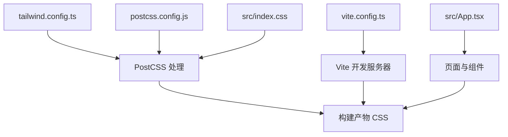
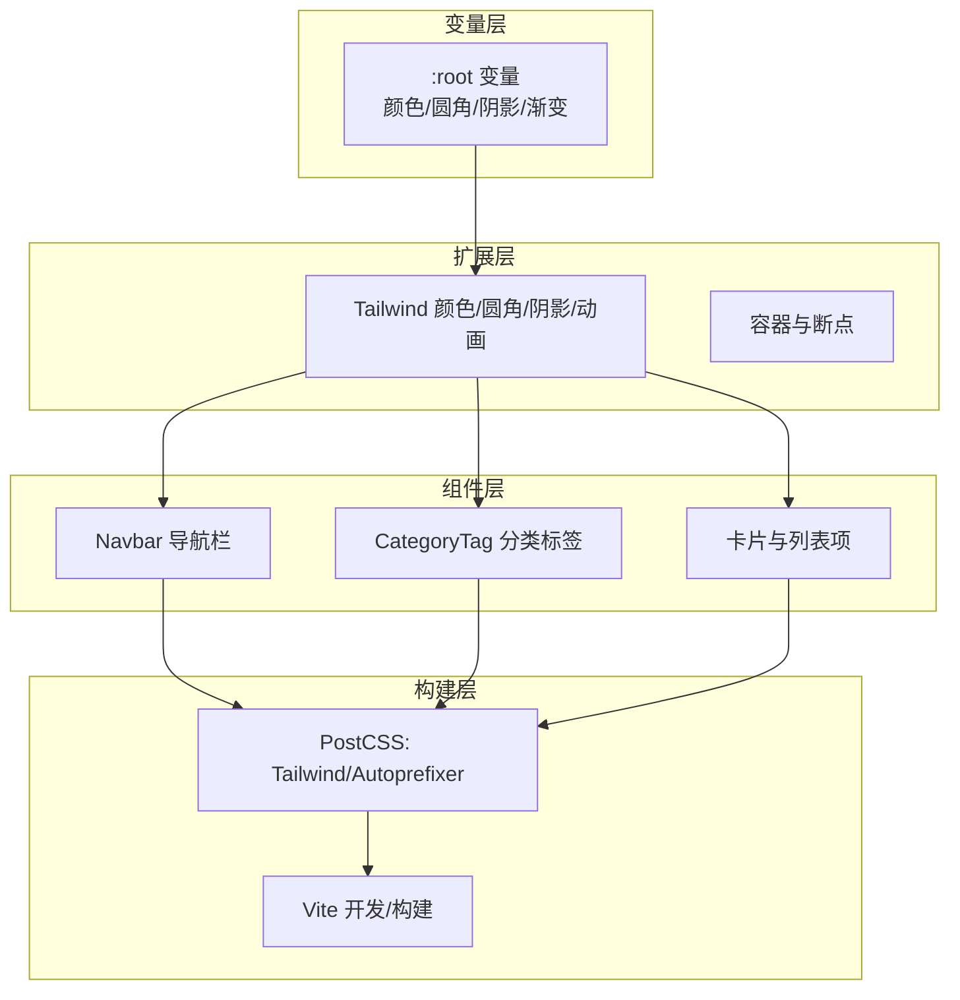
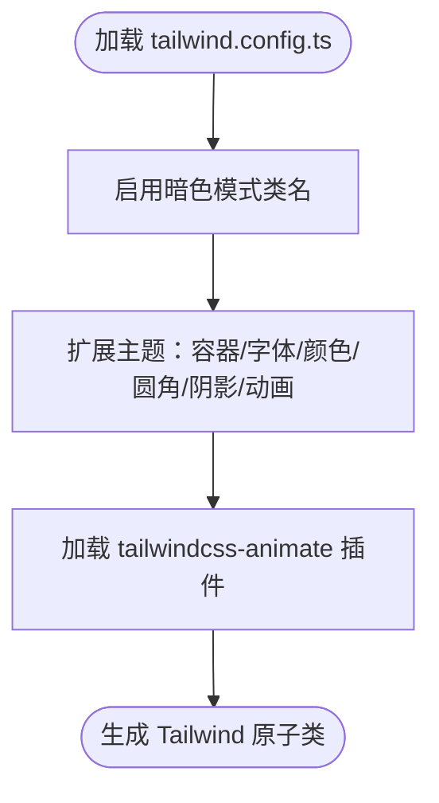
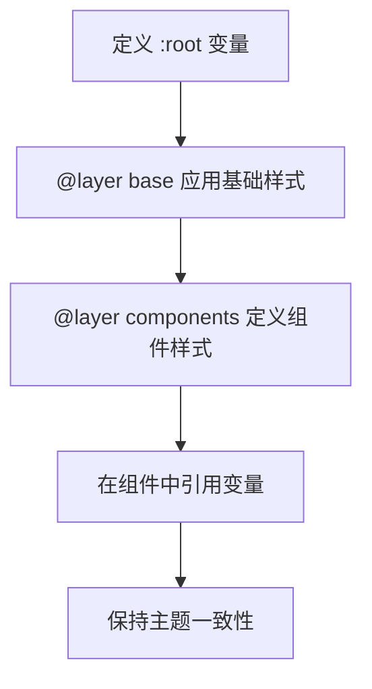
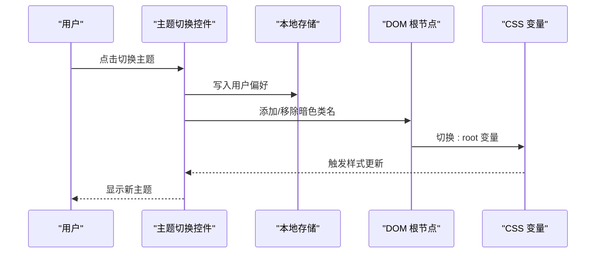
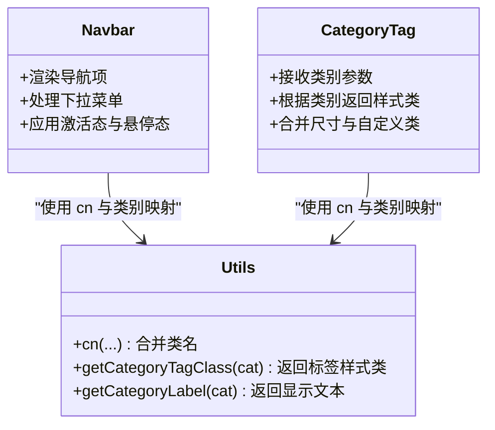
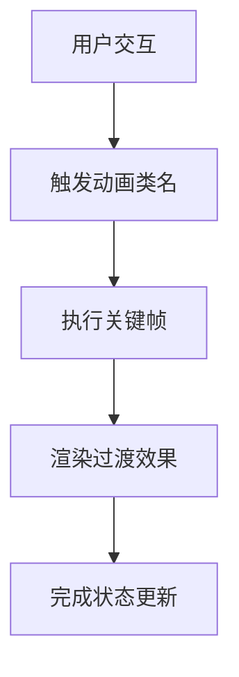
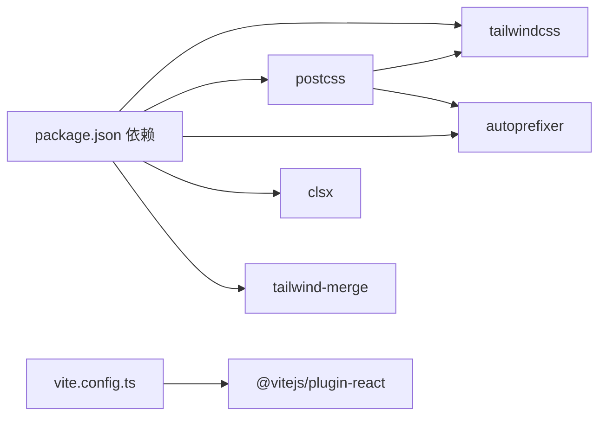

# 样式与主题

<cite>
**本文引用的文件**
- [tailwind.config.ts](file://tailwind.config.ts)
- [postcss.config.js](file://postcss.config.js)
- [src/index.css](file://src/index.css)
- [package.json](file://package.json)
- [vite.config.ts](file://vite.config.ts)
- [src/App.tsx](file://src/App.tsx)
- [src/components/Navbar.tsx](file://src/components/Navbar.tsx)
- [src/components/ui/CategoryTag.tsx](file://src/components/ui/CategoryTag.tsx)
- [src/lib/utils.ts](file://src/lib/utils.ts)
- [src/pages/StorageFaults.tsx](file://src/pages/StorageFaults.tsx)
- [src/pages/OpenSourceProjects.tsx](file://src/pages/OpenSourceProjects.tsx)
- [src/pages/SpdkUpdates.tsx](file://src/pages/SpdkUpdates.tsx)
</cite>

## 目录
1. [简介](#简介)
2. [项目结构](#项目结构)
3. [核心组件](#核心组件)
4. [架构总览](#架构总览)
5. [详细组件分析](#详细组件分析)
6. [依赖分析](#依赖分析)
7. [性能考虑](#性能考虑)
8. [故障排查指南](#故障排查指南)
9. [结论](#结论)
10. [附录](#附录)

## 简介
本文件面向 cs336 项目的样式系统与主题设计，系统性阐述 Tailwind CSS 的配置与使用、暗色主题与 CSS 变量体系、组件样式定制与隔离、PostCSS 集成与构建优化，并提供主题定制、字体系统、动画与性能优化的实践指南。

## 项目结构
样式相关的核心文件分布如下：
- Tailwind 配置：用于扩展颜色、字体、圆角、阴影、动画等，并启用暗色模式类名开关。
- PostCSS 配置：启用 Tailwind 和 Autoprefixer 插件。
- 全局样式：通过 CSS 变量定义主题色板与阴影、渐变；在基础层与组件层中声明通用样式与组件样式。
- 构建工具：Vite 集成 React 插件与路径别名；Tailwind 插件由 PostCSS 处理。
- 组件与页面：大量使用 Tailwind 工具类与 CSS 变量，配合 cn 合并工具实现动态样式组合。

图表来源
- [tailwind.config.ts:1-104](file://tailwind.config.ts#L1-L104)
- [postcss.config.js:1-7](file://postcss.config.js#L1-L7)
- [src/index.css:1-158](file://src/index.css#L1-L158)
- [vite.config.ts:1-13](file://vite.config.ts#L1-L13)

章节来源
- [tailwind.config.ts:1-104](file://tailwind.config.ts#L1-L104)
- [postcss.config.js:1-7](file://postcss.config.js#L1-L7)
- [src/index.css:1-158](file://src/index.css#L1-L158)
- [vite.config.ts:1-13](file://vite.config.ts#L1-L13)

## 核心组件
- Tailwind 主题扩展：定义容器、字体族、颜色空间（HSL 变量）、圆角半径、阴影、关键帧与动画。
- 暗色模式：通过类名控制（darkMode: ["class"]），结合 CSS 变量实现明暗主题切换。
- PostCSS 流水线：Tailwind 生成原子类，Autoprefixer 补齐浏览器前缀。
- 全局样式层：base 层统一基础元素与背景；components 层定义可复用组件样式；utilities 由 Tailwind 提供。
- 组件样式组合：使用 cn 合并工具与语义化类名，实现样式隔离与动态状态切换。

章节来源
- [tailwind.config.ts:10-99](file://tailwind.config.ts#L10-L99)
- [src/index.css:5-77](file://src/index.css#L5-L77)
- [src/index.css:79-157](file://src/index.css#L79-L157)

## 架构总览
样式系统采用“CSS 变量 + Tailwind 扩展 + PostCSS 处理”的分层架构：
- CSS 变量层：集中定义主题色板、圆角、阴影、渐变等，确保全局一致性与可替换性。
- Tailwind 扩展层：将 CSS 变量映射到语义化颜色与尺寸，提供丰富的工具类与动画。
- 组件层：以语义化类名与 cn 组合，实现组件级样式隔离与状态切换。
- 构建层：PostCSS 负责解析与优化，Vite 提供开发与打包支持。

图表来源
- [src/index.css:5-61](file://src/index.css#L5-L61)
- [tailwind.config.ts:18-99](file://tailwind.config.ts#L18-L99)
- [src/components/Navbar.tsx:42-141](file://src/components/Navbar.tsx#L42-L141)
- [src/components/ui/CategoryTag.tsx:11-24](file://src/components/ui/CategoryTag.tsx#L11-L24)
- [postcss.config.js:1-7](file://postcss.config.js#L1-L7)

## 详细组件分析

### Tailwind 配置与主题扩展
- 暗色模式：通过类名控制，便于在根节点或特定容器上切换明暗主题。
- 容器与断点：中心容器与 2xl 屏幕断点，适配桌面端布局。
- 字体系统：sans 与 mono 字体族，满足正文与代码场景。
- 颜色系统：基于 HSL 变量的颜色命名空间，覆盖背景、前景、表面、主次色、破坏性、强调色等。
- 圆角与阴影：统一圆角半径与卡片阴影，提升视觉一致性。
- 动画与关键帧：提供折叠、淡入、脉冲等动画，增强交互体验。
- 插件：tailwindcss-animate 提供更丰富的动画工具类。

图表来源
- [tailwind.config.ts:3-101](file://tailwind.config.ts#L3-L101)

章节来源
- [tailwind.config.ts:3-101](file://tailwind.config.ts#L3-L101)

### CSS 变量与样式层
- 变量定义：在 :root 中集中定义背景、前景、表面、主色、辅助色、破坏性、边框、输入、环形光晕、圆角、标签色、阴影与渐变。
- 基础层（base）：重置边框、设置背景与文字颜色、启用抗锯齿、添加径向背景图、统一标题字重与间距。
- 组件层（components）：定义分类标签、卡片、导航链接、等宽标签、实时点、滚动条等通用组件样式。
- 使用方式：颜色与阴影等通过 hsl(var(--xxx)) 引用变量，确保与主题一致。

图表来源
- [src/index.css:5-77](file://src/index.css#L5-L77)
- [src/index.css:79-157](file://src/index.css#L79-L157)

章节来源
- [src/index.css:5-77](file://src/index.css#L5-L77)
- [src/index.css:79-157](file://src/index.css#L79-L157)

### 暗色模式与主题切换机制
- 切换机制：通过在根节点或容器上添加/移除暗色模式类名，驱动 CSS 变量切换。
- 用户偏好保存：建议在本地存储中持久化用户偏好的主题值，并在应用启动时读取应用到 DOM 上。
- 切换流程：用户触发切换 → 写入偏好 → 更新根节点类名 → 触发 CSS 变量更新 → 重新渲染组件。

[本图为概念流程示意，不直接对应具体源码文件]

### 组件样式定制与隔离
- Navbar：使用语义化类名与过渡动画，突出当前路由与悬停态；使用 CSS 变量实现与主题一致的边框、背景与高亮。
- CategoryTag：通过 cn 合并与类别映射，将类别映射到对应的标签样式类，实现样式隔离与可维护性。
- 页面筛选器：在多个页面中复用相同的过滤按钮样式组合，统一使用 cn 合并工具与语义化颜色类。

图表来源
- [src/components/Navbar.tsx:22-141](file://src/components/Navbar.tsx#L22-L141)
- [src/components/ui/CategoryTag.tsx:11-24](file://src/components/ui/CategoryTag.tsx#L11-L24)
- [src/lib/utils.ts:5-27](file://src/lib/utils.ts#L5-L27)

章节来源
- [src/components/Navbar.tsx:22-141](file://src/components/Navbar.tsx#L22-L141)
- [src/components/ui/CategoryTag.tsx:11-24](file://src/components/ui/CategoryTag.tsx#L11-L24)
- [src/lib/utils.ts:5-27](file://src/lib/utils.ts#L5-L27)

### 动画与交互
- 动画定义：折叠、淡入、脉冲等关键帧，配合动画工具类实现平滑过渡。
- 交互示例：导航链接悬停态、卡片悬停态、滚动条样式、实时指示点等。

图表来源
- [tailwind.config.ts:74-97](file://tailwind.config.ts#L74-L97)
- [src/index.css:122-142](file://src/index.css#L122-L142)

章节来源
- [tailwind.config.ts:74-97](file://tailwind.config.ts#L74-L97)
- [src/index.css:122-142](file://src/index.css#L122-L142)

## 依赖分析
- Tailwind：版本与插件由 package.json 管理，PostCSS 配置启用 Tailwind 与 Autoprefixer。
- Vite：提供 React 支持与路径别名，与 Tailwind 生态无缝衔接。
- 样式工具：clsx 与 tailwind-merge 用于安全合并类名，避免冲突。

图表来源
- [package.json:11-30](file://package.json#L11-L30)
- [postcss.config.js:1-7](file://postcss.config.js#L1-L7)
- [vite.config.ts:1-13](file://vite.config.ts#L1-L13)

章节来源
- [package.json:11-30](file://package.json#L11-L30)
- [postcss.config.js:1-7](file://postcss.config.js#L1-L7)
- [vite.config.ts:1-13](file://vite.config.ts#L1-L13)

## 性能考虑
- 原子类优先：Tailwind 原子类减少重复样式，提升缓存命中率。
- 变量驱动：CSS 变量集中管理主题，避免重复定义与构建体积膨胀。
- 渐进增强：仅在需要时引入动画与阴影，避免过度渲染。
- 构建优化：PostCSS 自动补全与压缩，Vite 快速热更新与按需打包。
- 类名合并：使用 cn 与 tailwind-merge 避免冗余类名，减少最终 CSS 体积。

[本节为通用性能指导，不直接分析具体文件]

## 故障排查指南
- 样式未生效
  - 检查是否正确引入全局样式文件与 Tailwind 指令。
  - 确认 PostCSS 插件已启用 Tailwind 与 Autoprefixer。
- 暗色模式不切换
  - 确认根节点存在暗色模式类名，检查用户偏好存储与初始化逻辑。
- 动画异常
  - 检查关键帧与动画类名是否正确拼写，确认 tailwindcss-animate 插件已安装。
- 类名冲突
  - 使用 cn 与 tailwind-merge 合并类名，避免重复覆盖。

章节来源
- [postcss.config.js:1-7](file://postcss.config.js#L1-L7)
- [tailwind.config.ts:100](file://tailwind.config.ts#L100)
- [src/lib/utils.ts:5-7](file://src/lib/utils.ts#L5-L7)

## 结论
本项目通过“CSS 变量 + Tailwind 扩展 + PostCSS 处理”的架构，实现了统一的主题色板、清晰的组件样式隔离与高效的构建流程。暗色模式与用户偏好的结合为可访问性与个性化提供了基础。建议在现有基础上完善主题切换的持久化与初始化逻辑，并持续利用原子类与变量体系进行主题扩展与性能优化。

[本节为总结性内容，不直接分析具体文件]

## 附录

### 主题定制完整指南
- 品牌色彩应用
  - 在 :root 中新增或调整品牌色变量，确保与现有颜色命名空间一致。
  - 在 Tailwind 配置中扩展颜色映射，保证工具类可用。
- 字体系统配置
  - 在 Tailwind 配置中扩展字体族，确保正文与代码字体符合设计规范。
- 动画效果实现
  - 在 Tailwind 配置中新增关键帧与动画，结合组件层样式类使用。
- 样式调试技巧
  - 使用浏览器开发者工具查看最终渲染的 CSS 变量与原子类。
  - 通过临时添加高对比度边框快速定位布局问题。

章节来源
- [src/index.css:5-61](file://src/index.css#L5-L61)
- [tailwind.config.ts:18-99](file://tailwind.config.ts#L18-L99)