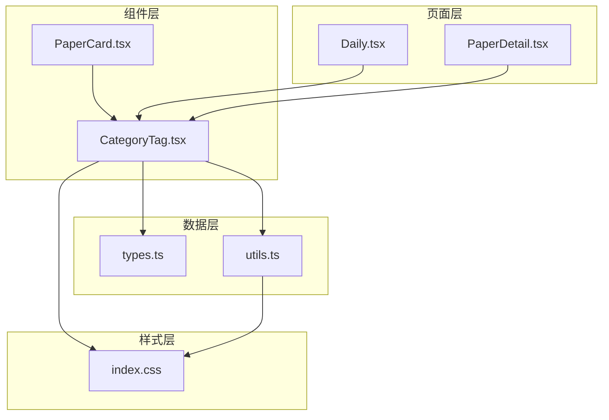
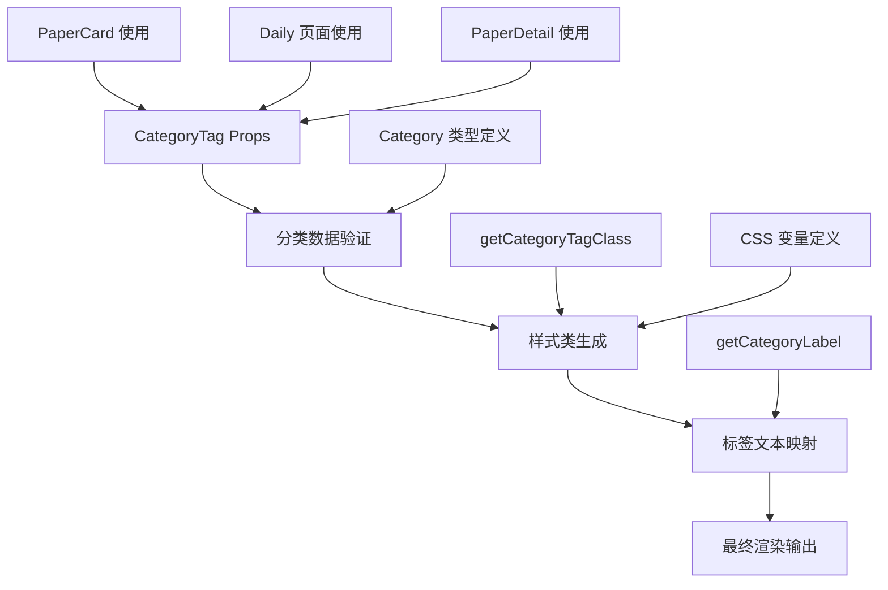
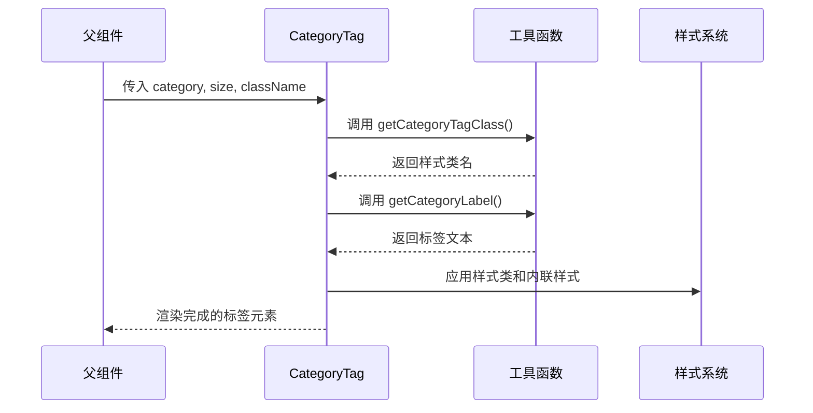
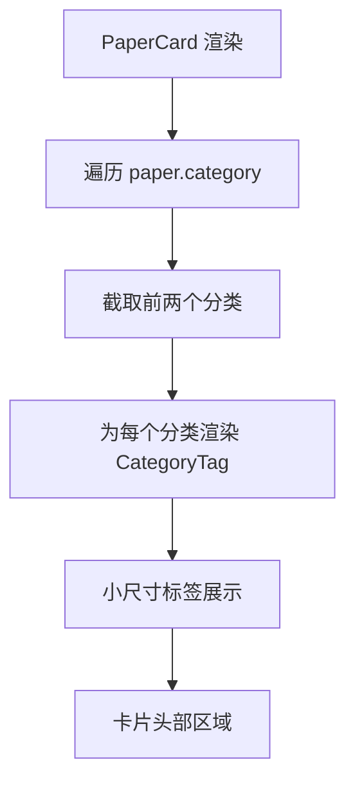
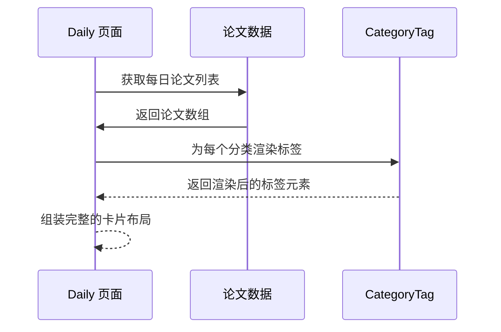
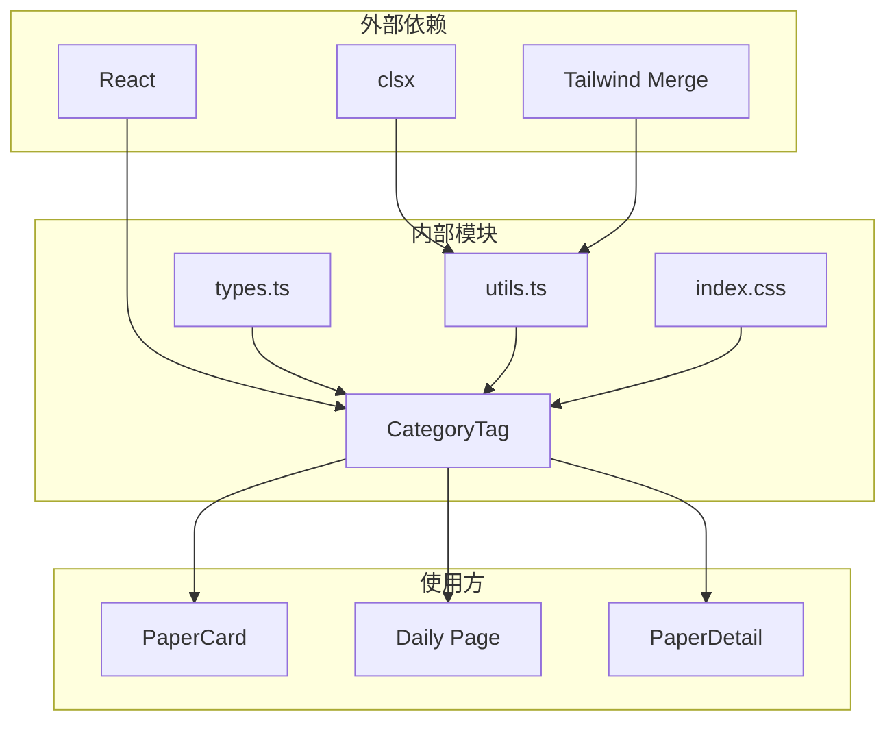

# UI装饰组件

<cite>
**本文档引用的文件**
- [CategoryTag.tsx](file://src/components/ui/CategoryTag.tsx)
- [types.ts](file://src/data/types.ts)
- [utils.ts](file://src/lib/utils.ts)
- [index.css](file://src/index.css)
- [PaperCard.tsx](file://src/components/PaperCard.tsx)
- [Daily.tsx](file://src/pages/Daily.tsx)
- [PaperDetail.tsx](file://src/pages/PaperDetail.tsx)
</cite>

## 目录
1. [简介](#简介)
2. [项目结构](#项目结构)
3. [核心组件](#核心组件)
4. [架构概览](#架构概览)
5. [详细组件分析](#详细组件分析)
6. [依赖关系分析](#依赖关系分析)
7. [性能考虑](#性能考虑)
8. [故障排除指南](#故障排除指南)
9. [结论](#结论)

## 简介

CategoryTag 是本项目中一个专门用于展示内容分类信息的UI装饰组件。该组件采用语义化设计原则，为不同类型的学术论文和博客文章提供统一的分类标签展示方案。组件支持多种尺寸规格、可定制的样式类以及丰富的颜色主题，能够适应从列表卡片到详情页面等各种展示场景。

该组件在整个UI系统中扮演着重要的视觉标识角色，帮助用户快速识别内容的主题领域和类型归属，提升了信息浏览的效率和体验。

## 项目结构

项目采用模块化的组织方式，CategoryTag 组件位于 UI 组件层，与业务逻辑和样式系统紧密集成：



**图表来源**
- [CategoryTag.tsx:1-25](file://src/components/ui/CategoryTag.tsx#L1-L25)
- [utils.ts:1-57](file://src/lib/utils.ts#L1-L57)
- [types.ts:1-49](file://src/data/types.ts#L1-L49)

**章节来源**
- [CategoryTag.tsx:1-25](file://src/components/ui/CategoryTag.tsx#L1-L25)
- [utils.ts:1-57](file://src/lib/utils.ts#L1-L57)
- [types.ts:1-49](file://src/data/types.ts#L1-L49)

## 核心组件

### CategoryTag 组件概述

CategoryTag 是一个轻量级的React函数组件，专门用于渲染学术内容的分类标签。组件设计遵循以下核心原则：

- **语义化设计**：基于内容的实际分类类型提供相应的视觉表现
- **响应式布局**：支持不同的显示尺寸以适应各种容器环境
- **可扩展性**：通过CSS类名机制支持自定义样式覆盖
- **类型安全**：利用TypeScript确保传入参数的正确性

### 主要特性

1. **多尺寸支持**：提供 'sm'（小）和 'md'（中）两种尺寸规格
2. **语义化颜色**：根据分类类型自动选择对应的颜色主题
3. **灵活的样式定制**：支持通过 className 属性进行额外样式定制
4. **国际化支持**：标签文本支持中英文双语显示

**章节来源**
- [CategoryTag.tsx:5-24](file://src/components/ui/CategoryTag.tsx#L5-L24)

## 架构概览

CategoryTag 组件的架构设计体现了清晰的关注点分离和职责划分：



**图表来源**
- [CategoryTag.tsx:11-24](file://src/components/ui/CategoryTag.tsx#L11-L24)
- [utils.ts:9-47](file://src/lib/utils.ts#L9-L47)
- [types.ts:1](file://src/data/types.ts#L1)

### 数据流分析

组件的数据流遵循单向数据绑定原则，从父组件传递分类数据，经过内部处理后渲染最终的DOM元素：



**图表来源**
- [CategoryTag.tsx:11-24](file://src/components/ui/CategoryTag.tsx#L11-L24)
- [utils.ts:9-47](file://src/lib/utils.ts#L9-L47)

## 详细组件分析

### 组件接口设计

CategoryTag 组件采用简洁明了的接口设计，确保易用性和可维护性：

```mermaid
classDiagram
class CategoryTagProps {
+Category category
+('sm'|'md') size
+string className
}
class Category {
<<enumeration>>
AI
Storage
SSD
FileSystem
WeChat
HBM
FAST
NAND
SCM
Memory
NVMe
SATA
"Computational Storage"
IO
}
CategoryTagProps --> Category : uses
```

**图表来源**
- [CategoryTag.tsx:5-9](file://src/components/ui/CategoryTag.tsx#L5-L9)
- [types.ts:1](file://src/data/types.ts#L1)

### 样式系统集成

组件的样式系统基于Tailwind CSS和CSS变量，实现了高度可定制的设计体系：

#### 颜色主题映射

| 分类类型 | CSS变量 | 颜色值 | 使用场景 |
|---------|---------|--------|----------|
| AI | --tag-ai | 265 80% 60% | 人工智能/机器学习 |
| Storage | --tag-storage | 160 70% 45% | 存储系统 |
| SSD | --tag-ssd | 38 92% 55% | 固态硬盘技术 |
| FileSystem | --tag-fs | 196 80% 50% | 文件系统 |
| WeChat | --tag-wechat | 142 76% 36% | 微信公众号 |

#### 尺寸规格

| 尺寸 | 内边距 | 字体大小 | 适用场景 |
|------|--------|----------|----------|
| sm | px-2 py-0.5 | text-xs | 列表卡片、摘要信息 |
| md | px-3 py-1 | text-sm | 详情页面、完整展示 |

**章节来源**
- [utils.ts:9-47](file://src/lib/utils.ts#L9-L47)
- [index.css:43-60](file://src/index.css#L43-L60)

### 使用场景分析

#### 在PaperCard中的应用

在论文卡片组件中，CategoryTag主要用于展示论文的主要分类信息：



**图表来源**
- [PaperCard.tsx:24-26](file://src/components/PaperCard.tsx#L24-L26)

#### 在Daily页面的应用

在每日更新页面中，CategoryTag用于展示每日精选内容的分类：



**图表来源**
- [Daily.tsx:80-82](file://src/pages/Daily.tsx#L80-L82)

#### 在PaperDetail中的应用

在论文详情页面中，CategoryTag采用大尺寸展示：

```mermaid
flowchart LR
A[PaperDetail 页面] --> B[遍历 paper.category]
B --> C[设置 size="md"]
C --> D[渲染大尺寸标签]
D --> E[详情页头部区域]
```

**图表来源**
- [PaperDetail.tsx:40-42](file://src/pages/PaperDetail.tsx#L40-L42)

### 扩展方法

#### 自定义样式实现

开发者可以通过以下方式扩展CategoryTag的功能：

1. **基础样式覆盖**：通过className属性添加自定义样式
2. **颜色主题扩展**：在CSS变量中添加新的颜色定义
3. **尺寸规格扩展**：通过工具函数扩展新的尺寸选项

#### 性能优化建议

1. **避免重复渲染**：使用React.memo包装组件
2. **懒加载优化**：对于大量分类数据的场景考虑虚拟化
3. **样式缓存**：复用已计算的样式类名

**章节来源**
- [CategoryTag.tsx:11-24](file://src/components/ui/CategoryTag.tsx#L11-L24)

## 依赖关系分析

### 组件依赖图



**图表来源**
- [CategoryTag.tsx:1-3](file://src/components/ui/CategoryTag.tsx#L1-L3)
- [utils.ts:1-7](file://src/lib/utils.ts#L1-L7)

### 数据类型依赖

组件严格依赖于预定义的分类类型枚举，确保类型安全：

```mermaid
erDiagram
CATEGORY {
string AI
string Storage
string SSD
string FileSystem
string WeChat
string HBM
string FAST
string NAND
string SCM
string Memory
string NVMe
string SATA
string "Computational Storage"
string IO
}
PAPER {
string id
string title
string[] authors
string venue
number year
string date
CATEGORY[] category
string abstract
string[] coreContributions
string[] tags
string url
string source
string sourceLabel
number readTime
}
CATEGORY ||--o{ PAPER : categorizes
```

**图表来源**
- [types.ts:1](file://src/data/types.ts#L1)
- [types.ts:13-34](file://src/data/types.ts#L13-L34)

**章节来源**
- [utils.ts:1-57](file://src/lib/utils.ts#L1-L57)
- [types.ts:1-49](file://src/data/types.ts#L1-L49)

## 性能考虑

### 渲染性能优化

1. **最小化重渲染**：组件本身无状态，天然具备良好的重渲染控制
2. **样式计算优化**：使用CSS变量减少JavaScript样式计算开销
3. **内存使用**：组件不持有状态，内存占用极低

### 用户体验优化

1. **加载速度**：组件体积小，不影响页面加载性能
2. **交互响应**：标签元素无复杂交互逻辑，响应速度快
3. **可访问性**：使用语义化的HTML结构，支持屏幕阅读器

## 故障排除指南

### 常见问题及解决方案

#### 标签颜色不正确

**问题描述**：分类标签显示为默认颜色而非预期颜色

**可能原因**：
- CSS变量未正确配置
- 分类类型不在支持的枚举范围内

**解决方法**：
1. 检查CSS变量定义是否正确
2. 确认分类类型是否在支持的枚举中
3. 验证工具函数中的映射关系

#### 标签文本显示异常

**问题描述**：标签文本显示为原始分类名称而非本地化文本

**解决方法**：
1. 检查getCategoryLabel函数的映射配置
2. 确认语言环境设置
3. 验证文本资源文件

#### 样式冲突问题

**问题描述**：自定义样式与组件默认样式产生冲突

**解决方法**：
1. 使用更具体的选择器优先级
2. 检查CSS层叠顺序
3. 避免使用 !important

**章节来源**
- [utils.ts:9-47](file://src/lib/utils.ts#L9-L47)
- [index.css:43-104](file://src/index.css#L43-L104)

## 结论

CategoryTag 组件作为UI装饰系统的重要组成部分，展现了现代前端开发的最佳实践。组件设计充分考虑了可维护性、可扩展性和用户体验，在保持简洁性的同时提供了足够的灵活性。

通过语义化的设计理念和完善的类型系统，该组件为整个项目的UI一致性奠定了坚实基础。未来可以在以下方面进一步完善：

1. **增强可访问性**：添加ARIA标签和键盘导航支持
2. **国际化扩展**：支持更多语言的标签文本
3. **动画效果**：添加平滑的过渡动画效果
4. **响应式设计**：优化在不同设备上的显示效果

该组件的成功实现证明了小型、专注的UI组件在大型项目中的价值，为后续类似组件的开发提供了优秀的参考模板。