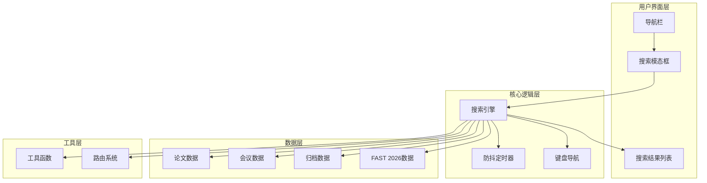
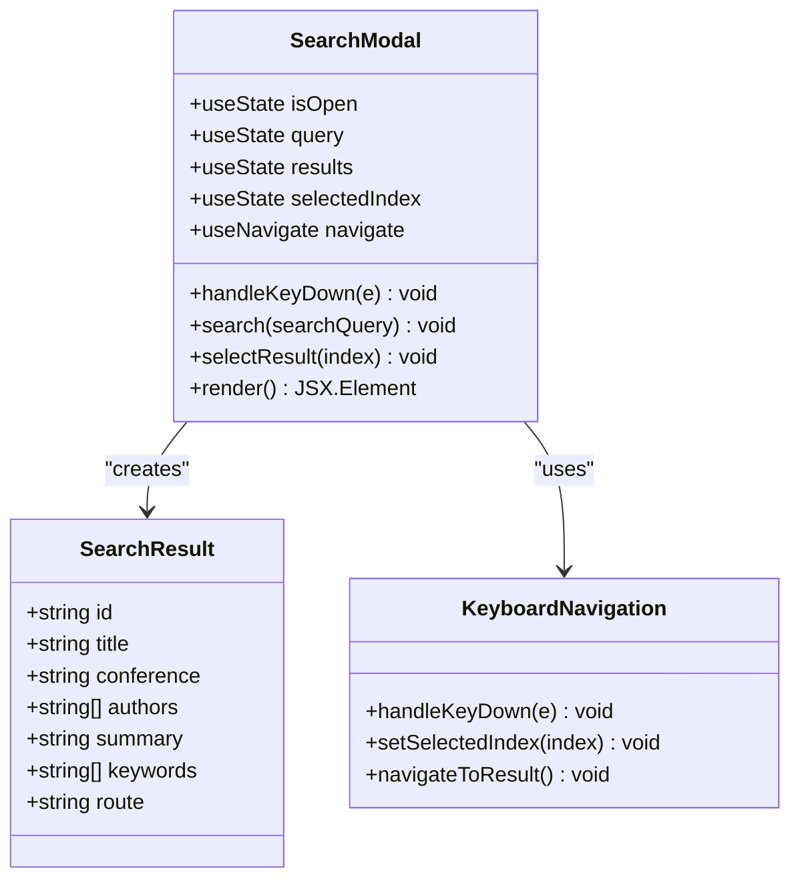
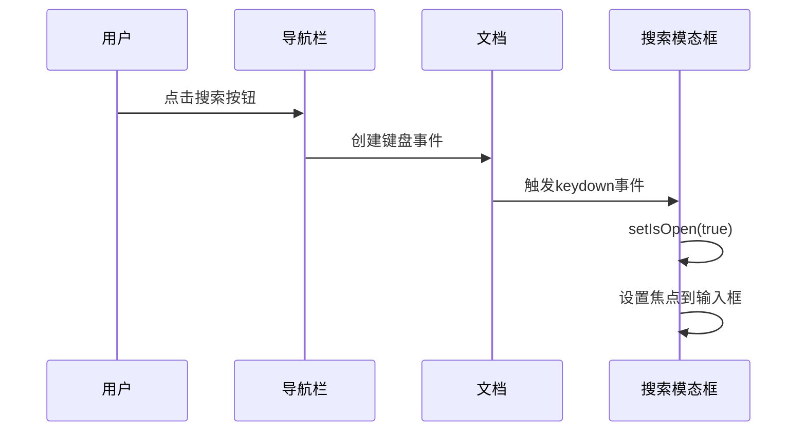
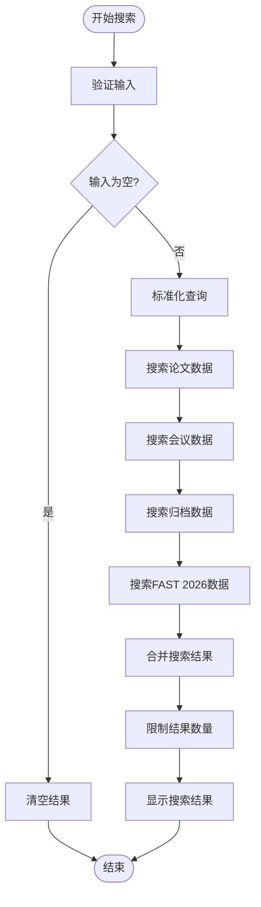
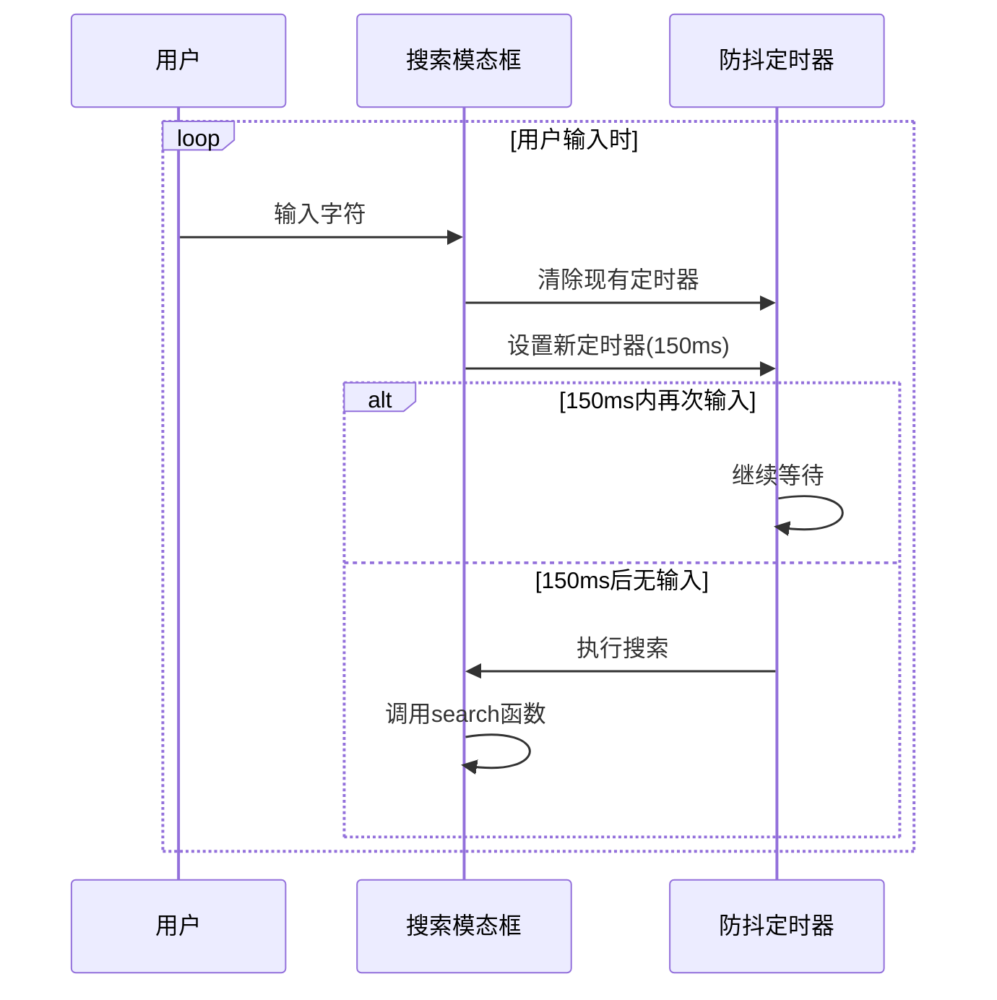
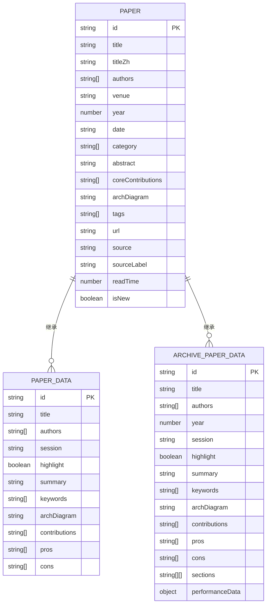
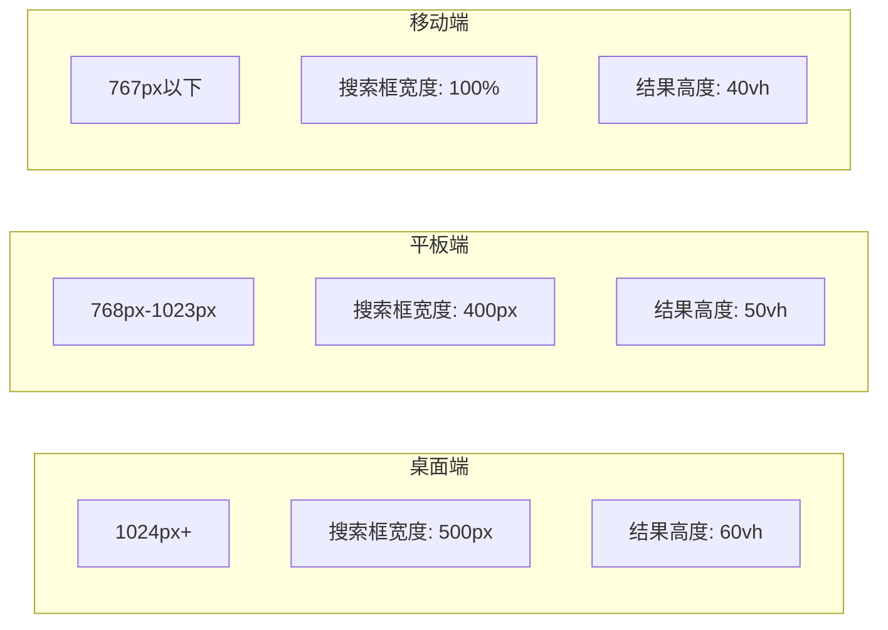
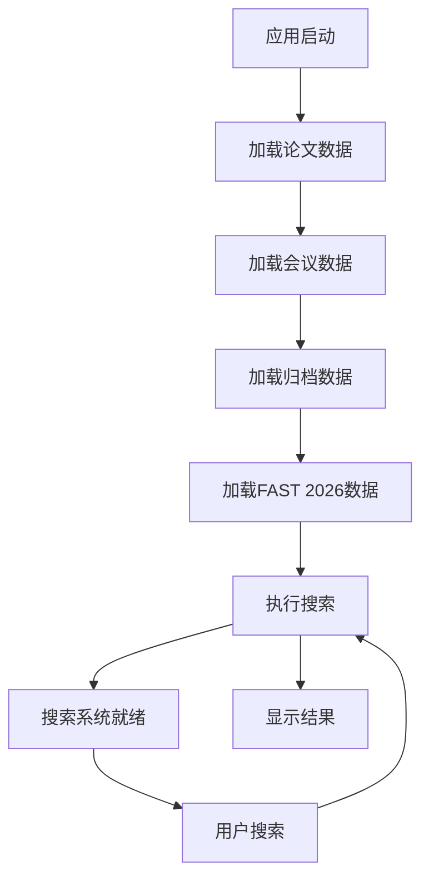

# 全局搜索系统

<cite>
**本文档引用的文件**
- [src/App.tsx](file://src/App.tsx)
- [src/components/SearchModal.tsx](file://src/components/SearchModal.tsx)
- [src/components/Navbar.tsx](file://src/components/Navbar.tsx)
- [src/lib/utils.ts](file://src/lib/utils.ts)
- [src/data/papers.ts](file://src/data/papers.ts)
- [src/data/conferences.ts](file://src/data/conferences.ts)
- [src/data/fastArchive.ts](file://src/data/fastArchive.ts)
- [src/data/fast2026.ts](file://src/data/fast2026.ts)
- [src/data/asplos2025.ts](file://src/data/asplos2025.ts)
- [src/data/sigmod2025.ts](file://src/data/sigmod2025.ts)
- [src/pages/Home.tsx](file://src/pages/Home.tsx)
- [package.json](file://package.json)
- [src/data/types.ts](file://src/data/types.ts)
</cite>

## 目录
1. [项目概述](#项目概述)
2. [系统架构](#系统架构)
3. [核心组件分析](#核心组件分析)
4. [搜索算法实现](#搜索算法实现)
5. [数据结构设计](#数据结构设计)
6. [用户界面设计](#用户界面设计)
7. [性能优化策略](#性能优化策略)
8. [扩展性分析](#扩展性分析)
9. [故障排除指南](#故障排除指南)
10. [总结](#总结)

## 项目概述

全局搜索系统是一个集成在存储技术博客网站中的全文搜索引擎，旨在为用户提供快速、准确的论文和内容搜索体验。该系统支持多会议论文、技术文章、存储技术专题等多种内容类型的搜索，并提供了直观的键盘快捷键和响应式界面设计。

### 系统特性

- **多源数据整合**：支持会议论文、技术博客、存储专题等多种内容类型
- **智能搜索算法**：基于关键词匹配和模糊搜索的综合搜索策略
- **键盘快捷键**：支持 `Cmd+K` 或 `Ctrl+K` 快速打开搜索界面
- **实时搜索**：防抖机制确保搜索体验流畅
- **结果高亮**：搜索关键词在结果中自动高亮显示
- **响应式设计**：适配各种屏幕尺寸和设备

## 系统架构

全局搜索系统采用模块化架构设计，主要由以下几个核心模块组成：



**图表来源**
- [src/components/SearchModal.tsx:24-310](file://src/components/SearchModal.tsx#L24-L310)
- [src/components/Navbar.tsx:29-141](file://src/components/Navbar.tsx#L29-L141)

## 核心组件分析

### 搜索模态框组件

搜索模态框是整个搜索系统的核心组件，负责处理用户输入、执行搜索逻辑、展示搜索结果等功能。

#### 组件结构



**图表来源**
- [src/components/SearchModal.tsx:14-310](file://src/components/SearchModal.tsx#L14-L310)

#### 关键功能实现

1. **状态管理**：使用 React Hooks 管理搜索状态，包括是否打开、搜索关键词、搜索结果等
2. **键盘事件处理**：监听键盘事件，支持 ESC 键关闭、方向键导航、Enter 键选择
3. **搜索执行**：实现防抖机制，避免频繁搜索调用
4. **结果展示**：提供友好的结果列表界面，支持高亮显示

**章节来源**
- [src/components/SearchModal.tsx:24-310](file://src/components/SearchModal.tsx#L24-L310)

### 导航栏集成

导航栏提供了搜索功能的入口点，用户可以通过点击搜索按钮或使用快捷键打开搜索模态框。

#### 快捷键实现



**图表来源**
- [src/components/Navbar.tsx:124-134](file://src/components/Navbar.tsx#L124-L134)

**章节来源**
- [src/components/Navbar.tsx:29-141](file://src/components/Navbar.tsx#L29-L141)

## 搜索算法实现

### 搜索策略

搜索系统采用了多字段、多级别的综合搜索策略，确保搜索结果的相关性和准确性。

#### 搜索字段映射

| 搜索字段 | 数据源 | 匹配方式 |
|---------|--------|----------|
| 标题 | 所有数据源 | 完全匹配 |
| 摘要 | 所有数据源 | 模糊匹配 |
| 关键词 | 所有数据源 | 模糊匹配 |
| 作者 | 论文数据源 | 模糊匹配 |

#### 搜索流程



**图表来源**
- [src/components/SearchModal.tsx:47-173](file://src/components/SearchModal.tsx#L47-L173)

### 防抖机制

为了提升用户体验和性能，搜索系统实现了防抖机制，避免频繁的搜索调用。

#### 防抖实现



**图表来源**
- [src/components/SearchModal.tsx:175-181](file://src/components/SearchModal.tsx#L175-L181)

**章节来源**
- [src/components/SearchModal.tsx:47-181](file://src/components/SearchModal.tsx#L47-L181)

## 数据结构设计

### 统一数据模型

系统采用了统一的数据模型来处理不同类型的内容，确保搜索的一致性和准确性。

#### 数据模型结构



**图表来源**
- [src/data/types.ts:13-49](file://src/data/types.ts#L13-L49)

#### 数据源组织

系统将不同类型的数据源组织在不同的文件中，便于管理和维护：

| 数据源 | 文件名 | 内容类型 | 数据量 |
|--------|--------|----------|--------|
| 论文数据 | papers.ts | 综合论文 | 800+条 |
| 会议数据 | conferences.ts | OSDI 2025, ATC 2024 | 120+条 |
| 归档数据 | fastArchive.ts | FAST 历年论文 | 400+条 |
| FAST 2026 | fast2026.ts | 顶会论文 | 400+条 |
| ASPLOS 2025 | asplos2025.ts | 体系结构会议 | 140+条 |
| SIGMOD 2025 | sigmod2025.ts | 数据库会议 | 150+条 |

**章节来源**
- [src/data/types.ts:1-49](file://src/data/types.ts#L1-L49)
- [src/data/papers.ts:1-847](file://src/data/papers.ts#L1-L847)
- [src/data/conferences.ts:1-279](file://src/data/conferences.ts#L1-L279)

## 用户界面设计

### 搜索界面组件

搜索界面采用了现代化的设计理念，提供了直观、易用的搜索体验。

#### 界面元素

| 元素 | 功能 | 快捷键 |
|------|------|--------|
| 搜索图标 | 打开搜索模态框 | ⌘K / Ctrl+K |
| 输入框 | 输入搜索关键词 | 键盘输入 |
| 清除按钮 | 清空搜索内容 | 点击 |
| ESC 按钮 | 关闭搜索模态框 | ESC |
| 结果列表 | 显示搜索结果 | 方向键导航 |
| Enter 键 | 打开选中结果 | Enter |

#### 响应式设计



**图表来源**
- [src/components/SearchModal.tsx:214-308](file://src/components/SearchModal.tsx#L214-L308)

### 键盘导航系统

系统提供了完整的键盘导航支持，确保用户可以通过键盘快速浏览和选择搜索结果。

#### 键盘快捷键

| 快捷键 | 功能 | 描述 |
|--------|------|------|
| ↓ | 下移 | 选择下一个结果 |
| ↑ | 上移 | 选择上一个结果 |
| Enter | 打开 | 导航到选中的结果页面 |
| ESC | 关闭 | 关闭搜索模态框 |
| ⌘K / Ctrl+K | 打开 | 打开搜索模态框 |

**章节来源**
- [src/components/SearchModal.tsx:192-210](file://src/components/SearchModal.tsx#L192-L210)

## 性能优化策略

### 搜索性能优化

为了确保搜索系统的高性能，采用了多种优化策略：

#### 1. 防抖机制
- **延迟时间**：150ms
- **目的**：避免频繁搜索调用，减少不必要的计算
- **效果**：显著提升搜索响应速度

#### 2. 结果数量限制
- **限制数量**：最多显示 20 个结果
- **目的**：避免大量数据渲染影响性能
- **效果**：保持界面响应速度

#### 3. 模糊匹配优化
- **匹配策略**：使用 `toLowerCase()` 进行不区分大小写的匹配
- **性能考虑**：避免复杂的正则表达式匹配
- **效果**：提升匹配速度和准确性

### 内存管理

#### 数据加载策略



**图表来源**
- [src/components/SearchModal.tsx:7-13](file://src/components/SearchModal.tsx#L7-L13)

## 扩展性分析

### 数据源扩展

系统设计具有良好的扩展性，可以轻松添加新的数据源：

#### 新数据源添加步骤

1. **创建数据文件**：在 `src/data/` 目录下创建新的数据文件
2. **定义数据结构**：确保数据结构符合统一的接口规范
3. **导入数据**：在 `SearchModal.tsx` 中导入新的数据源
4. **更新搜索逻辑**：在搜索函数中添加新的数据源搜索逻辑
5. **测试验证**：确保新数据源正常工作

#### 支持的数据类型

| 数据类型 | 支持状态 | 扩展建议 |
|----------|----------|----------|
| 论文数据 | ✅ 已支持 | 添加更多会议论文 |
| 会议数据 | ✅ 已支持 | 添加更多会议 |
| 归档数据 | ✅ 已支持 | 扩展历史论文 |
| 技术博客 | ✅ 已支持 | 添加更多博客文章 |
| 专题内容 | ✅ 已支持 | 添加更多专题 |

### 搜索功能扩展

#### 可扩展的功能点

1. **搜索过滤器**：添加按时间、作者、会议等过滤功能
2. **搜索历史**：保存用户的搜索历史记录
3. **搜索建议**：提供搜索关键词建议
4. **高级搜索**：支持布尔搜索语法
5. **搜索结果排序**：支持按相关性、时间等排序

## 故障排除指南

### 常见问题及解决方案

#### 1. 搜索无结果

**问题描述**：输入关键词后没有任何搜索结果

**可能原因**：
- 关键词过于具体或拼写错误
- 数据源中不存在相关数据
- 搜索算法匹配不到相关内容

**解决方案**：
- 尝试使用更通用的关键词
- 检查关键词拼写
- 尝试不同的关键词组合

#### 2. 搜索响应慢

**问题描述**：搜索结果返回延迟较长

**可能原因**：
- 数据量过大导致搜索时间增加
- 防抖机制设置不合理
- 浏览器性能问题

**解决方案**：
- 优化搜索算法
- 调整防抖延迟时间
- 清理浏览器缓存

#### 3. 键盘快捷键无效

**问题描述**：`Cmd+K` 或 `Ctrl+K` 无法打开搜索框

**可能原因**：
- 浏览器扩展阻止了快捷键
- 键盘布局问题
- JavaScript 事件绑定失败

**解决方案**：
- 检查浏览器扩展设置
- 尝试使用不同的浏览器
- 刷新页面重新加载

#### 4. 搜索结果不准确

**问题描述**：搜索结果与预期不符

**可能原因**：
- 搜索算法匹配逻辑问题
- 数据源质量问题
- 关键词理解偏差

**解决方案**：
- 检查搜索算法实现
- 验证数据源完整性
- 优化关键词匹配策略

### 调试技巧

#### 1. 开发者工具使用

- **控制台**：查看 JavaScript 错误和警告
- **网络面板**：监控数据加载状态
- **性能面板**：分析搜索性能瓶颈

#### 2. 日志记录

在关键函数中添加适当的日志记录，帮助诊断问题：

```javascript
console.log('搜索关键词:', query);
console.log('匹配到的结果数量:', results.length);
console.log('搜索耗时:', endTime - startTime, 'ms');
```

## 总结

全局搜索系统是一个功能完善、性能优秀的全文搜索引擎，具有以下特点：

### 技术优势

1. **模块化设计**：清晰的组件分离和职责划分
2. **性能优化**：防抖机制、结果限制等多重优化策略
3. **用户体验**：键盘快捷键、响应式设计、直观界面
4. **扩展性**：良好的架构设计支持功能扩展

### 应用价值

1. **提升用户体验**：快速定位所需内容
2. **提高内容可发现性**：帮助用户发现相关技术内容
3. **增强平台价值**：为存储技术博客提供重要的导航功能

### 未来发展

1. **智能化搜索**：集成机器学习算法提升搜索准确性
2. **个性化推荐**：基于用户行为提供个性化搜索结果
3. **多语言支持**：扩展支持更多语言的搜索
4. **语音搜索**：添加语音输入和搜索功能

该搜索系统为存储技术博客提供了强大的内容导航能力，是整个平台的重要组成部分，为用户提供了优质的搜索体验。