# 内容展示组件

<cite>
**本文档引用的文件**
- [PaperCard.tsx](file://src/components/PaperCard.tsx)
- [papers.ts](file://src/data/papers.ts)
- [types.ts](file://src/data/types.ts)
- [Home.tsx](file://src/pages/Home.tsx)
- [App.tsx](file://src/App.tsx)
- [utils.ts](file://src/lib/utils.ts)
- [CategoryTag.tsx](file://src/components/ui/CategoryTag.tsx)
- [PaperDetail.tsx](file://src/pages/PaperDetail.tsx)
- [index.css](file://src/index.css)
- [tailwind.config.ts](file://tailwind.config.ts)
</cite>

## 目录
1. [简介](#简介)
2. [项目结构](#项目结构)
3. [核心组件](#核心组件)
4. [架构概览](#架构概览)
5. [详细组件分析](#详细组件分析)
6. [依赖关系分析](#依赖关系分析)
7. [性能考虑](#性能考虑)
8. [故障排除指南](#故障排除指南)
9. [结论](#结论)

## 简介

PaperCard 组件是本项目的核心内容展示组件，采用卡片式设计为论文信息提供直观、美观的展示界面。该组件实现了现代化的响应式布局，结合精心设计的交互效果，为用户提供优秀的阅读体验。组件支持多种论文类型（学术论文、技术博客、会议论文等），并具备完整的数据绑定和路由导航功能。

该组件的设计理念围绕"信息层次清晰、视觉引导明确、交互自然流畅"展开，通过合理的排版结构和色彩搭配，确保用户能够快速获取关键信息并进行深度阅读。

## 项目结构

项目采用模块化的组织方式，PaperCard 组件位于组件层，与数据层、页面层和工具层形成清晰的分层架构：

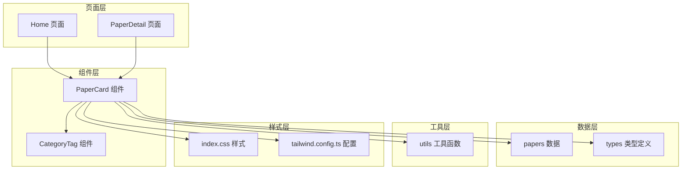

**图表来源**
- [Home.tsx:15-209](file://src/pages/Home.tsx#L15-L209)
- [PaperCard.tsx:1-73](file://src/components/PaperCard.tsx#L1-L73)
- [papers.ts:1-815](file://src/data/papers.ts#L1-L815)

**章节来源**
- [Home.tsx:1-209](file://src/pages/Home.tsx#L1-L209)
- [App.tsx:1-45](file://src/App.tsx#L1-L45)

## 核心组件

### PaperCard 组件概述

PaperCard 组件是一个高度模块化的 React 组件，专门用于展示论文信息。组件采用卡片式设计，结合响应式布局和丰富的交互效果，为用户提供直观的信息浏览体验。

#### 主要特性

- **卡片式设计**：采用圆角卡片布局，提供良好的视觉层次感
- **响应式布局**：支持桌面端和移动端的自适应显示
- **丰富的交互效果**：包含悬停动画、过渡效果和状态指示
- **多源数据支持**：兼容学术论文、技术博客、会议论文等多种内容类型
- **国际化支持**：同时支持中英文标题的显示

#### 核心接口设计

组件通过简洁明了的 props 接口实现数据传递：

```typescript
interface PaperCardProps {
  paper: Paper
}
```

其中 `Paper` 类型定义了完整的论文数据结构，包括标题、作者、摘要、标签等核心字段。

**章节来源**
- [PaperCard.tsx:7-9](file://src/components/PaperCard.tsx#L7-L9)
- [types.ts:13-34](file://src/data/types.ts#L13-L34)

## 架构概览

PaperCard 组件在整个应用架构中扮演着重要的桥梁角色，连接数据层和用户界面层：

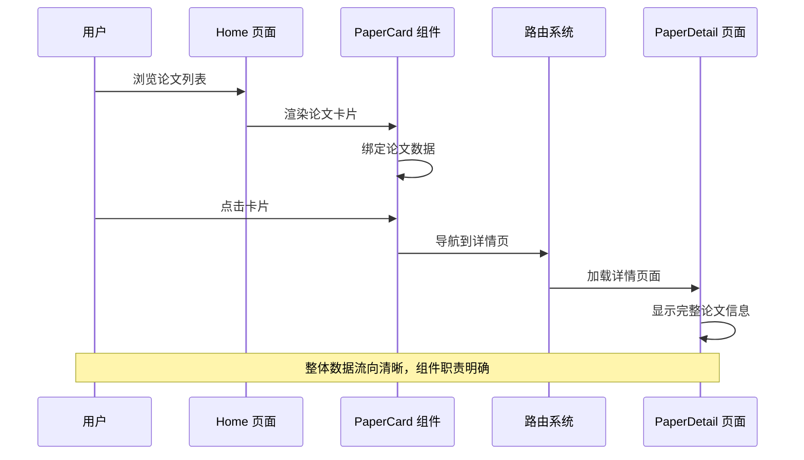

**图表来源**
- [Home.tsx:194-198](file://src/pages/Home.tsx#L194-L198)
- [PaperCard.tsx:13](file://src/components/PaperCard.tsx#L13)
- [App.tsx:24-38](file://src/App.tsx#L24-L38)

## 详细组件分析

### 组件结构设计

PaperCard 组件采用了精心设计的层次化结构，确保信息的有效组织和用户的良好体验：

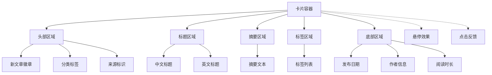

**图表来源**
- [PaperCard.tsx:12-71](file://src/components/PaperCard.tsx#L12-L71)

#### 数据流分析

组件内部的数据处理流程体现了清晰的职责分离：

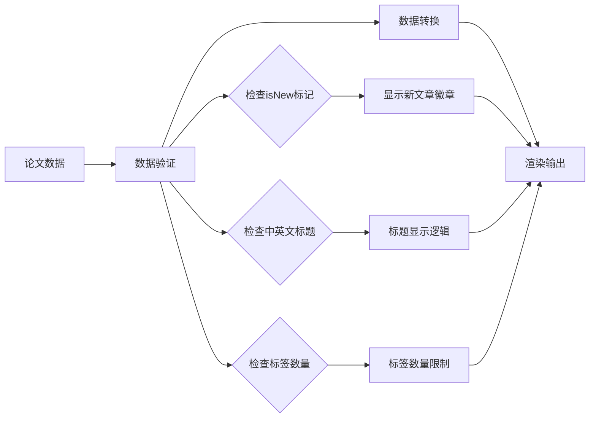

**图表来源**
- [PaperCard.tsx:18-26](file://src/components/PaperCard.tsx#L18-L26)
- [PaperCard.tsx:34-41](file://src/components/PaperCard.tsx#L34-L41)
- [PaperCard.tsx:49-55](file://src/components/PaperCard.tsx#L49-L55)

### 样式系统集成

PaperCard 组件深度集成了 Tailwind CSS 和自定义样式系统：

#### 主题系统

组件使用了基于 CSS 变量的主题系统，支持深色模式和颜色定制：

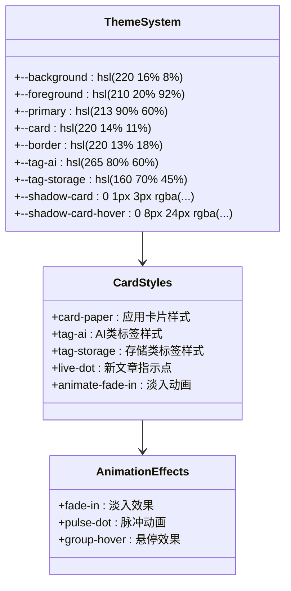

**图表来源**
- [index.css:5-61](file://src/index.css#L5-L61)
- [index.css:105-115](file://src/index.css#L105-L115)
- [tailwind.config.ts:23-68](file://src/tailwind.config.ts#L23-L68)

#### 响应式设计

组件实现了完整的响应式设计，适配不同屏幕尺寸：

| 断点 | 最小宽度 | 布局特性 |
|------|----------|----------|
| 移动端 | 0px | 单列布局，紧凑间距 |
| 平板端 | 768px | 双列布局，适度间距 |
| 桌面端 | 1024px | 两列布局，充足间距 |

**章节来源**
- [PaperCard.tsx:14](file://src/components/PaperCard.tsx#L14)
- [index.css:105-115](file://src/index.css#L105-L115)
- [tailwind.config.ts:92-97](file://src/tailwind.config.ts#L92-L97)

### 交互设计分析

#### 悬停效果系统

组件实现了多层次的悬停交互效果：

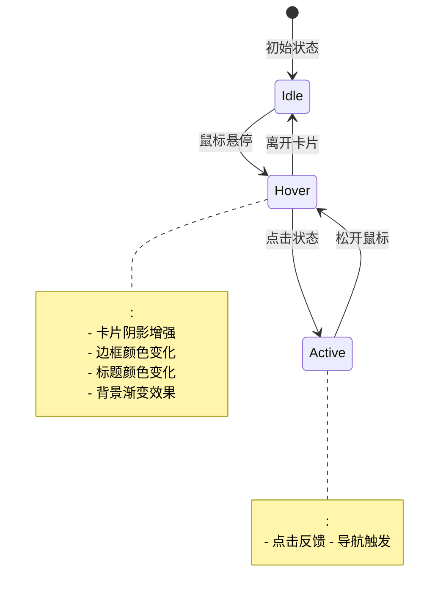

**图表来源**
- [PaperCard.tsx:34](file://src/components/PaperCard.tsx#L34)
- [index.css:111-115](file://src/index.css#L111-L115)

#### 状态管理机制

组件通过 React 的状态管理实现动态交互：

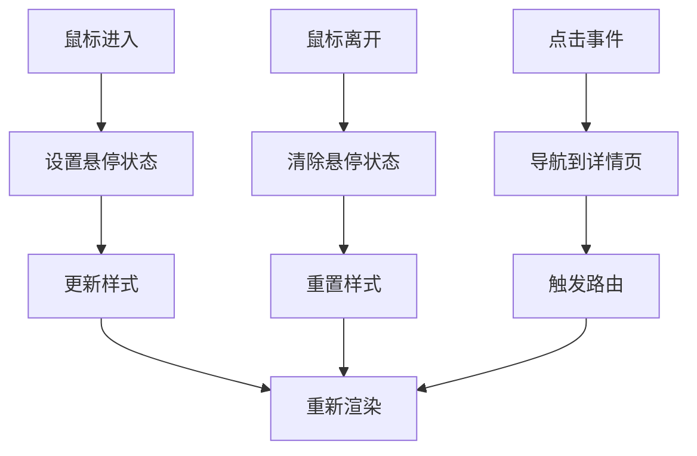

**图表来源**
- [PaperCard.tsx:13](file://src/components/PaperCard.tsx#L13)
- [PaperCard.tsx:34](file://src/components/PaperCard.tsx#L34)

### 数据绑定与渲染

#### 数据结构映射

组件将复杂的论文数据结构映射到可视化的 UI 元素：

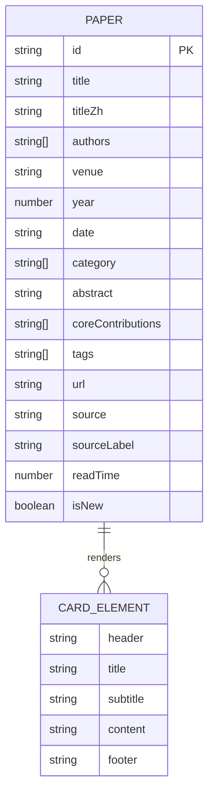

**图表来源**
- [types.ts:13-34](file://src/data/types.ts#L13-L34)
- [PaperCard.tsx:16-68](file://src/components/PaperCard.tsx#L16-L68)

#### 动态内容生成

组件实现了灵活的内容生成机制：

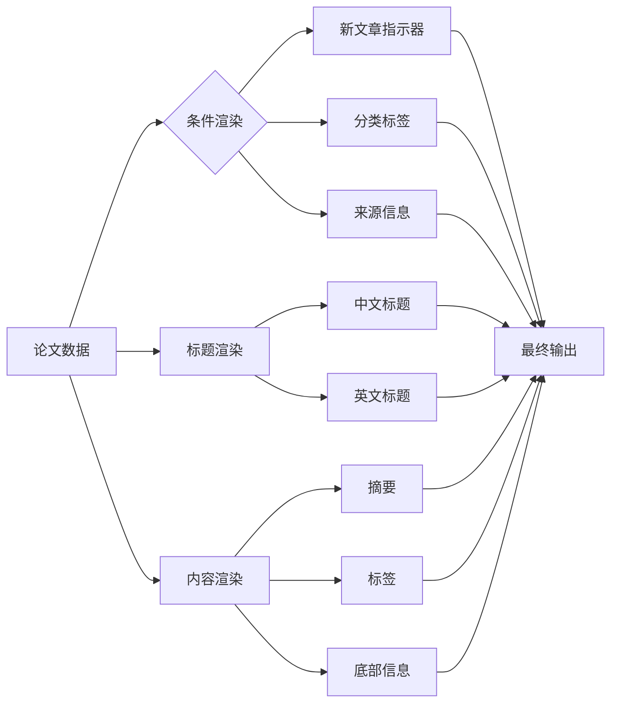

**图表来源**
- [PaperCard.tsx:18-26](file://src/components/PaperCard.tsx#L18-L26)
- [PaperCard.tsx:34-41](file://src/components/PaperCard.tsx#L34-L41)
- [PaperCard.tsx:44-55](file://src/components/PaperCard.tsx#L44-L55)

**章节来源**
- [PaperCard.tsx:11-72](file://src/components/PaperCard.tsx#L11-L72)
- [papers.ts:3-121](file://src/data/papers.ts#L3-L121)

## 依赖关系分析

### 组件依赖图

PaperCard 组件的依赖关系体现了清晰的模块化设计：

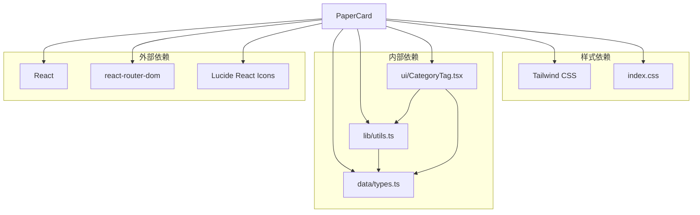

**图表来源**
- [PaperCard.tsx:1-6](file://src/components/PaperCard.tsx#L1-L6)
- [CategoryTag.tsx:1-4](file://src/components/ui/CategoryTag.tsx#L1-L4)
- [utils.ts:1-7](file://src/lib/utils.ts#L1-L7)

### 数据流依赖

组件的数据流依赖关系展现了完整的数据处理链条：

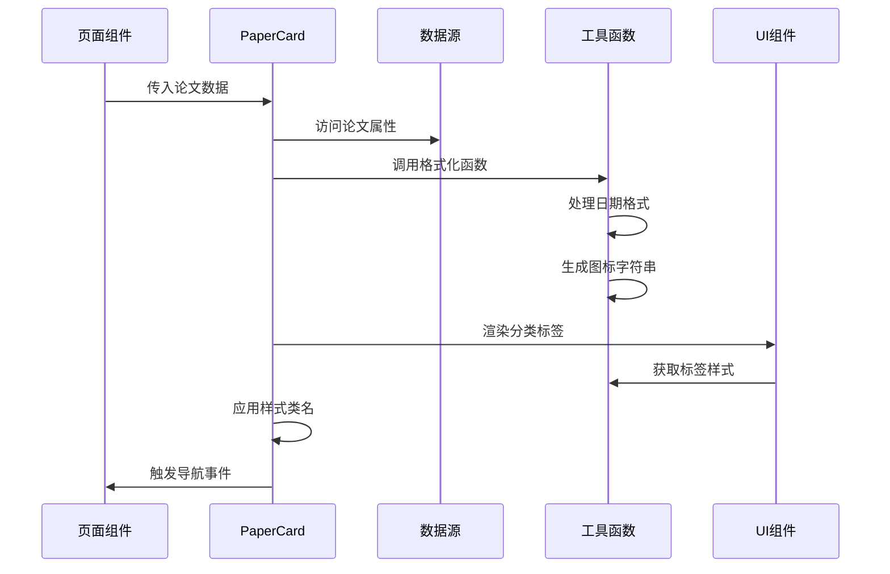

**图表来源**
- [Home.tsx:195-197](file://src/pages/Home.tsx#L195-L197)
- [PaperCard.tsx:13](file://src/components/PaperCard.tsx#L13)
- [utils.ts:49-57](file://src/lib/utils.ts#L49-L57)

**章节来源**
- [PaperCard.tsx:1-6](file://src/components/PaperCard.tsx#L1-L6)
- [Home.tsx:194-198](file://src/pages/Home.tsx#L194-L198)

## 性能考虑

### 渲染性能优化

PaperCard 组件在设计时充分考虑了渲染性能：

#### 虚拟化支持

组件天然支持虚拟化列表渲染，适用于大数据集场景：

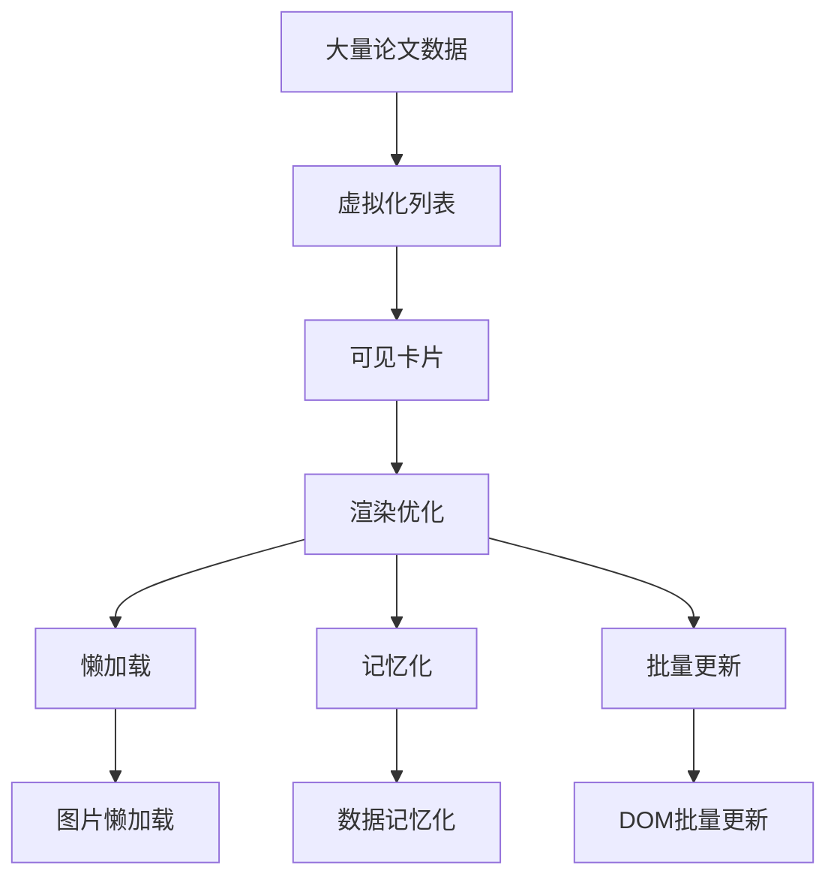

#### 样式性能

组件的样式系统经过精心优化，确保良好的性能表现：

- 使用 CSS 变量减少样式计算
- 合理的盒阴影和过渡效果
- 避免不必要的重绘和回流

### 交互性能

#### 动画优化

组件的动画效果经过性能优化：

```mermaid
stateDiagram-v2
[*] --> Idle : 初始状态
Idle --> Hover : 悬停触发
Hover --> Transition : 过渡动画
Transition --> Hover : 动画完成
Hover --> Idle : 离开触发
note over Transition :
- 使用 GPU 加速
- 控制动画时长
- 优化关键帧
end note
```

**图表来源**
- [tailwind.config.ts:92-97](file://src/tailwind.config.ts#L92-L97)
- [index.css:111-115](file://src/index.css#L111-L115)

### 内存管理

组件在内存使用方面也进行了优化：

- 合理的事件监听器管理
- 避免内存泄漏
- 及时清理定时器和订阅

## 故障排除指南

### 常见问题诊断

#### 样式问题

**问题症状**：组件样式异常或显示不正确

**可能原因**：
- Tailwind CSS 配置问题
- CSS 变量未正确设置
- 样式类名冲突

**解决方案**：
1. 检查 Tailwind 配置文件
2. 验证 CSS 变量定义
3. 确认样式类名唯一性

#### 数据渲染问题

**问题症状**：论文数据未正确显示

**可能原因**：
- 数据类型不匹配
- 缺少必要的数据字段
- 数据格式错误

**解决方案**：
1. 验证数据结构符合类型定义
2. 检查必需字段是否完整
3. 确认数据格式正确

#### 交互问题

**问题症状**：点击事件无效或导航失败

**可能原因**：
- 路由配置错误
- 事件处理函数问题
- 组件状态管理异常

**解决方案**：
1. 检查路由配置
2. 验证事件处理逻辑
3. 调试组件状态

### 性能问题排查

#### 渲染性能问题

**症状**：页面滚动卡顿或响应缓慢

**排查步骤**：
1. 使用浏览器开发者工具分析渲染性能
2. 检查是否有过多的重绘和回流
3. 评估组件的复杂度

**优化建议**：
- 实施虚拟化渲染
- 减少不必要的 re-render
- 优化样式计算

#### 内存泄漏问题

**症状**：长时间使用后内存占用持续增长

**排查方法**：
1. 使用内存分析工具检测泄漏
2. 检查事件监听器是否正确清理
3. 验证定时器和订阅是否及时销毁

**预防措施**：
- 在组件卸载时清理所有资源
- 使用正确的生命周期管理
- 避免闭包捕获不必要的变量

**章节来源**
- [PaperCard.tsx:13](file://src/components/PaperCard.tsx#L13)
- [utils.ts:49-57](file://src/lib/utils.ts#L49-L57)

## 结论

PaperCard 组件作为项目的核心内容展示组件，展现了优秀的前端工程实践。组件在设计理念、实现方式和用户体验方面都达到了较高水准。

### 设计优势

- **模块化设计**：清晰的职责分离和依赖管理
- **响应式布局**：适配多种设备和屏幕尺寸
- **丰富的交互**：自然流畅的用户交互体验
- **性能优化**：经过精心优化的渲染和交互性能
- **可维护性**：良好的代码结构和文档支持

### 技术亮点

- **类型安全**：完整的 TypeScript 类型定义
- **样式系统**：基于 CSS 变量的主题系统
- **动画效果**：流畅的过渡和悬停动画
- **数据绑定**：灵活的数据映射和渲染机制
- **路由集成**：无缝的页面导航体验

### 改进建议

尽管组件已经相当完善，但仍有一些可以改进的地方：

1. **可访问性增强**：添加更多的无障碍支持
2. **国际化扩展**：支持更多语言的本地化
3. **性能监控**：集成性能指标监控
4. **测试覆盖**：增加单元测试和集成测试
5. **文档完善**：补充更详细的使用文档

PaperCard 组件为整个项目的用户界面提供了坚实的基础，其设计理念和实现方式值得在类似的项目中借鉴和参考。通过持续的优化和改进，该组件将继续为用户提供优秀的阅读体验。