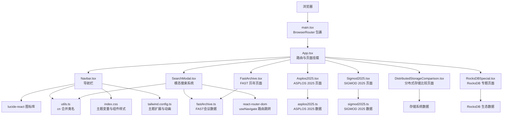
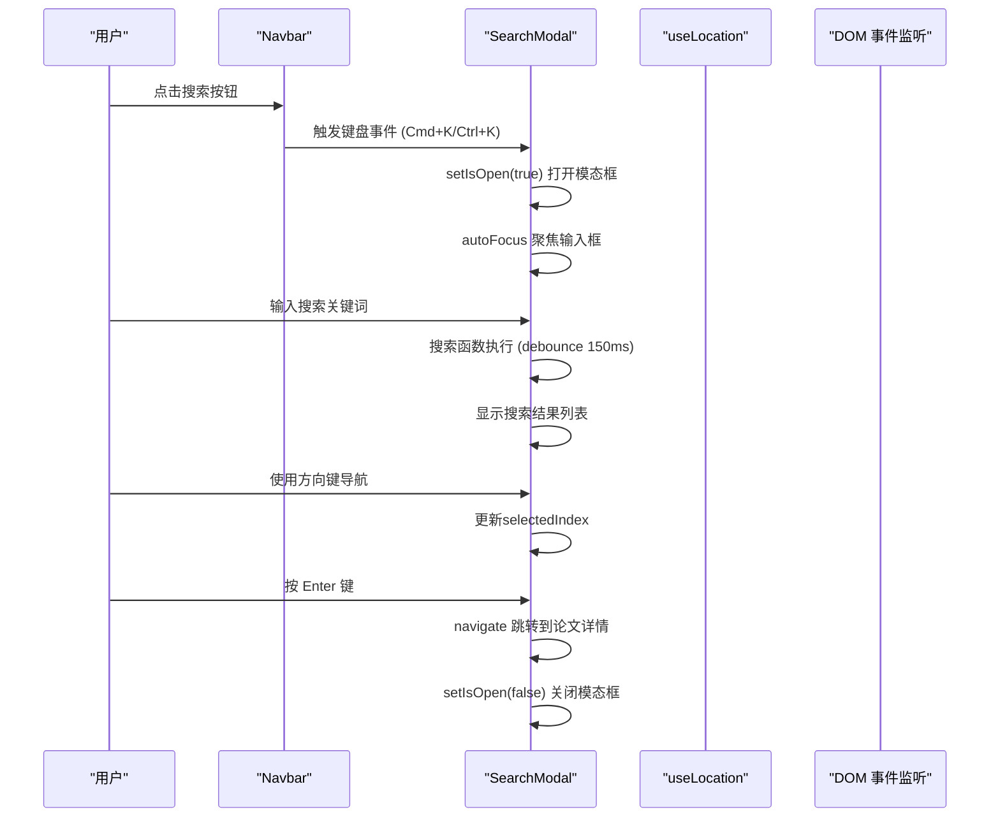
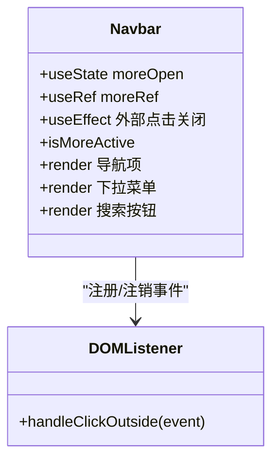
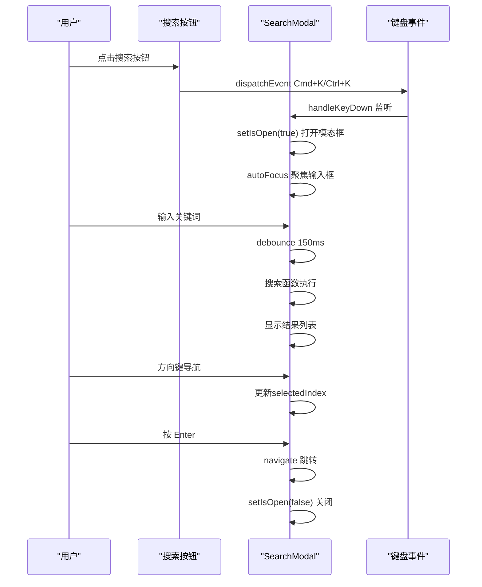
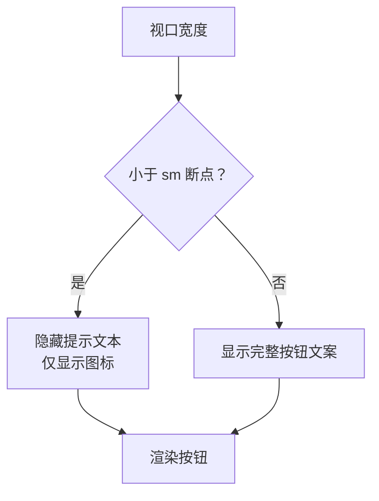
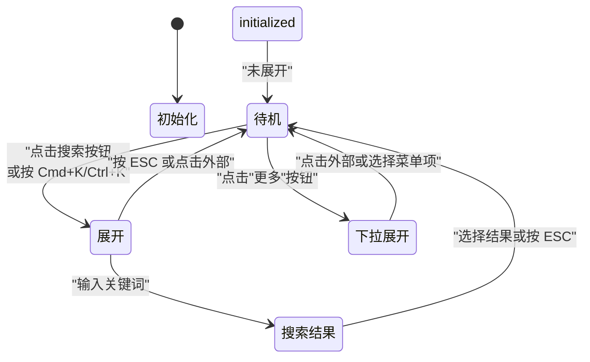
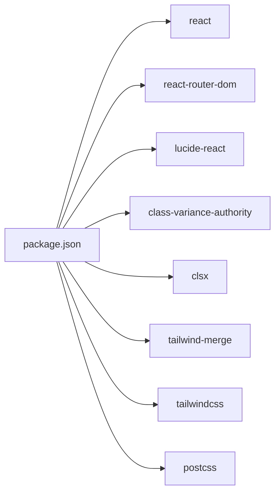

# 导航组件

<cite>
**本文引用的文件**
- [Navbar.tsx](file://src/components/Navbar.tsx)
- [SearchModal.tsx](file://src/components/SearchModal.tsx)
- [App.tsx](file://src/App.tsx)
- [Asplos2025.tsx](file://src/pages/Asplos2025.tsx)
- [Sigmod2025.tsx](file://src/pages/Sigmod2025.tsx)
- [DistributedStorageComparison.tsx](file://src/pages/DistributedStorageComparison.tsx)
- [RocksDBSpecial.tsx](file://src/pages/RocksDBSpecial.tsx)
- [asplos2025.ts](file://src/data/asplos2025.ts)
- [sigmod2025.ts](file://src/data/sigmod2025.ts)
- [FastArchive.tsx](file://src/pages/FastArchive.tsx)
- [fastArchive.ts](file://src/data/fastArchive.ts)
- [main.tsx](file://src/main.tsx)
- [utils.ts](file://src/lib/utils.ts)
- [index.css](file://src/index.css)
- [tailwind.config.ts](file://tailwind.config.ts)
- [types.ts](file://src/data/types.ts)
- [package.json](file://package.json)
</cite>

## 更新摘要
**变更内容**
- 重大架构变更：从内联搜索功能迁移到模态搜索系统，提供更强大的搜索体验
- 新增Cmd+K/Ctrl+K快捷键支持，实现跨平台键盘快捷键操作
- 新增SearchModal组件，提供完整的搜索界面和交互功能
- 完善搜索事件分发机制，支持全局键盘事件监听
- 新增对ASPLOS、SIGMOD、分布式存储和RocksDB专题导航项的支持

## 目录
1. [简介](#简介)
2. [项目结构](#项目结构)
3. [核心组件](#核心组件)
4. [架构总览](#架构总览)
5. [详细组件分析](#详细组件分析)
6. [依赖分析](#依赖分析)
7. [性能考虑](#性能考虑)
8. [故障排除指南](#故障排除指南)
9. [结论](#结论)
10. [附录](#附录)

## 简介
本文件面向"导航组件"（Navbar）的使用者与维护者，系统化阐述其设计架构、实现细节与最佳实践。内容覆盖导航项配置、下拉菜单系统、**模态搜索系统**、响应式设计、状态管理机制（活动状态跟踪、点击外部关闭、键盘快捷键）、图标库使用与样式定制，并提供 props 接口说明、事件处理机制与可扩展的自定义配置方法。

**更新** 重大架构升级：从内联搜索迁移到模态搜索系统，新增Cmd+K/Ctrl+K快捷键支持，提供跨平台的键盘搜索体验。包含完整的搜索事件分发机制、全局键盘监听和模态界面交互。

## 项目结构
Navbar组件位于组件层，作为应用入口App的子组件被渲染；路由由React Router提供，根容器在main.tsx中包裹。**新增SearchModal组件**提供模态搜索界面，支持Cmd+K/Ctrl+K快捷键触发。样式采用TailwindCSS + 自定义变量，主题色与组件样式在全局CSS中集中定义。



**图表来源**
- [main.tsx:1-14](file://src/main.tsx#L1-L14)
- [App.tsx:19-42](file://src/App.tsx#L19-L42)
- [Navbar.tsx:1-141](file://src/components/Navbar.tsx#L1-L141)
- [SearchModal.tsx:1-310](file://src/components/SearchModal.tsx#L1-L310)
- [Asplos2025.tsx:1-237](file://src/pages/Asplos2025.tsx#L1-L237)
- [Sigmod2025.tsx:1-237](file://src/pages/Sigmod2025.tsx#L1-L237)
- [DistributedStorageComparison.tsx:1-393](file://src/pages/DistributedStorageComparison.tsx#L1-L393)
- [RocksDBSpecial.tsx:1-376](file://src/pages/RocksDBSpecial.tsx#L1-L376)
- [FastArchive.tsx:1-290](file://src/pages/FastArchive.tsx#L1-L290)

**章节来源**
- [main.tsx:1-14](file://src/main.tsx#L1-L14)
- [App.tsx:19-42](file://src/App.tsx#L19-L42)
- [Navbar.tsx:1-141](file://src/components/Navbar.tsx#L1-L141)
- [SearchModal.tsx:1-310](file://src/components/SearchModal.tsx#L1-L310)

## 核心组件
- 组件名称：Navbar
- 所属模块：src/components/Navbar.tsx
- **新增组件**：SearchModal（模态搜索系统）
- 依赖库：react-router-dom（useLocation、Link）、lucide-react（图标）、clsx + tailwind-merge（类名合并）
- 主要职责：
  - 渲染主导航链接与"更多"下拉菜单，包含新增的'ASPLOS'、'SIGMOD'、'分布式存储'和'RocksDB 专题'导航项
  - 基于当前路径高亮活动状态，支持所有导航项的活动状态判断
  - **新增**：通过按钮点击触发模态搜索，支持Cmd+K/Ctrl+K快捷键
  - 控制顶部搜索栏的展开/收起
  - 处理点击外部关闭下拉菜单
  - 支持键盘 Esc 快捷键收起搜索框

**更新** 重大功能增强：新增模态搜索系统，支持Cmd+K/Ctrl+K跨平台快捷键，提供完整的搜索界面和交互体验。

**章节来源**
- [Navbar.tsx:1-141](file://src/components/Navbar.tsx#L1-L141)
- [SearchModal.tsx:1-310](file://src/components/SearchModal.tsx#L1-L310)
- [package.json:11-20](file://package.json#L11-L20)

## 架构总览
Navbar采用函数式组件 + Hooks的组合模式，结合路由状态与DOM事件实现交互。**新增的SearchModal组件**提供独立的模态搜索界面，通过全局键盘事件监听实现Cmd+K/Ctrl+K快捷键支持。其内部包含两组导航项配置（主导航与"更多"下拉），通过useLocation判断活动状态；通过useState管理搜索与下拉开关；通过useRef和useEffect实现点击外部关闭。



**图表来源**
- [Navbar.tsx:124-134](file://src/components/Navbar.tsx#L124-L134)
- [SearchModal.tsx:31-44](file://src/components/SearchModal.tsx#L31-L44)
- [SearchModal.tsx:175-181](file://src/components/SearchModal.tsx#L175-L181)
- [SearchModal.tsx:183-190](file://src/components/SearchModal.tsx#L183-L190)

## 详细组件分析

### 导航项配置与活动状态
- 导航项分为两类：
  - 主导航项：论文、FAST 2026、FAST 历年、OSDI、ATC
  - "更多"下拉项：**ASPLOS**、**SIGMOD**、**分布式存储**、**RocksDB 专题**、开源存储库、Linux Bugfix、SPDK 更新、存储故障、研究团队、Git 归档
- 活动状态判断：
  - 主导航项：基于当前路径与导航项href是否一致
  - "更多"分组：当任一下拉项的路径与当前路径一致时，"更多"按钮即为活动态
- 高亮样式：通过类名合并工具根据是否活动态切换前景色与背景色

**更新** 新增'ASPLOS'、'SIGMOD'、'分布式存储'和'RocksDB 专题'导航项配置，使用Award、Database等图标表示不同类型的导航功能。

```mermaid
flowchart TD
Start(["进入 Navbar 渲染"]) --> GetPath["读取当前路径"]
GetPath --> CheckMain["遍历主导航项<br/>比较路径是否相等"]
CheckMain --> MainActive{"存在匹配项？"}
MainActive --> |是| MarkMain["主导航项标记为活动态"]
MainActive --> |否| MarkNone["主导航项不活动"]
MarkMain --> CheckMore["遍历"更多"下拉项<br/>比较路径是否相等"]
MarkNone --> CheckMore
CheckMore --> MoreActive{"存在匹配项？"}
MoreActive --> |是| MarkMore[""更多"按钮标记为活动态"]
MoreActive --> |否| MarkMoreNone[""更多"按钮不活动"]
MarkMore --> Render["渲染导航项与样式"]
MarkMoreNone --> Render
Render --> End(["完成"])
```

**图表来源**
- [Navbar.tsx:45](file://src/components/Navbar.tsx#L45)
- [Navbar.tsx:63-80](file://src/components/Navbar.tsx#L63-L80)
- [Navbar.tsx:99-117](file://src/components/Navbar.tsx#L99-L117)

**章节来源**
- [Navbar.tsx:7-27](file://src/components/Navbar.tsx#L7-L27)
- [Navbar.tsx:45](file://src/components/Navbar.tsx#L45)
- [Navbar.tsx:63-80](file://src/components/Navbar.tsx#L63-L80)
- [Navbar.tsx:99-117](file://src/components/Navbar.tsx#L99-L117)

### 下拉菜单系统
- 结构组成：
  - 触发按钮："更多" + 下拉箭头图标
  - 菜单面板：绝对定位、带边框与阴影、z-index较高
  - 菜单项：每个条目包含图标与标签，点击后自动收起下拉
- 行为特性：
  - 点击外部区域自动关闭
  - 箭头图标随展开状态旋转
  - 活动态样式与主导航一致



**图表来源**
- [Navbar.tsx:34-43](file://src/components/Navbar.tsx#L34-L43)
- [Navbar.tsx:83-120](file://src/components/Navbar.tsx#L83-L120)

**章节来源**
- [Navbar.tsx:34-43](file://src/components/Navbar.tsx#L34-L43)
- [Navbar.tsx:83-120](file://src/components/Navbar.tsx#L83-L120)

### 模态搜索系统
- **新增功能**：完整的模态搜索界面，替代内联搜索
- 触发方式：
  - 点击搜索按钮，通过键盘事件模拟Cmd+K/Ctrl+K快捷键
  - 全局键盘监听支持Cmd+K/Ctrl+K快捷键
  - ESC键快速关闭搜索框
- 搜索功能：
  - 支持多会议论文搜索（FAST 2026、FAST Archive、OSDI 2025、ATC 2024、ASPLOS 2025、SIGMOD 2025）
  - 实时搜索（防抖150ms），最多显示20个结果
  - 支持标题、摘要、关键词、作者的全文检索
- 交互体验：
  - 方向键导航（上下键）
  - Enter键确认选择
  - 鼠标点击选择结果
  - 搜索结果高亮显示



**图表来源**
- [Navbar.tsx:124-134](file://src/components/Navbar.tsx#L124-L134)
- [SearchModal.tsx:31-44](file://src/components/SearchModal.tsx#L31-L44)
- [SearchModal.tsx:175-181](file://src/components/SearchModal.tsx#L175-L181)
- [SearchModal.tsx:192-210](file://src/components/SearchModal.tsx#L192-L210)

**章节来源**
- [Navbar.tsx:124-134](file://src/components/Navbar.tsx#L124-L134)
- [SearchModal.tsx:24-310](file://src/components/SearchModal.tsx#L24-L310)

### 响应式设计
- 容器宽度：最大宽度约束，居中布局
- 小屏适配：搜索按钮中的提示文本在小屏隐藏，仅保留图标与简短文案
- 断点策略：利用Tailwind的sm断点控制元素显示/隐藏
- 主题与阴影：全局CSS定义了暗色学术风主题与卡片阴影，Navbar采用统一的边框、背景与模糊效果



**图表来源**
- [index.css:4-42](file://src/index.css#L4-L42)
- [tailwind.config.ts:10-22](file://tailwind.config.ts#L10-L22)
- [Navbar.tsx:124-134](file://src/components/Navbar.tsx#L124-L134)

**章节来源**
- [index.css:4-42](file://src/index.css#L4-L42)
- [tailwind.config.ts:10-22](file://tailwind.config.ts#L10-L22)
- [Navbar.tsx:124-134](file://src/components/Navbar.tsx#L124-L134)

### 状态管理机制
- 活动状态跟踪：
  - 使用useLocation获取当前路径
  - 主导航项与"更多"分组分别进行路径匹配
- 点击外部关闭：
  - 通过useRef获取下拉容器节点
  - 在useEffect中注册/清理全局mousedown监听
  - 当点击目标不在下拉容器内时，关闭下拉
- **新增**：模态搜索状态管理
  - 通过useState管理搜索框的打开/关闭状态
  - 全局键盘事件监听，支持Cmd+K/Ctrl+K快捷键
  - ESC键关闭搜索框
- 状态持久与副作用：
  - useEffect返回清理函数，避免内存泄漏与重复绑定
  - 搜索函数使用useCallback优化性能



**图表来源**
- [Navbar.tsx:34-43](file://src/components/Navbar.tsx#L34-L43)
- [SearchModal.tsx:31-44](file://src/components/SearchModal.tsx#L31-L44)
- [SearchModal.tsx:192-210](file://src/components/SearchModal.tsx#L192-L210)

**章节来源**
- [Navbar.tsx:34-43](file://src/components/Navbar.tsx#L34-L43)
- [SearchModal.tsx:31-44](file://src/components/SearchModal.tsx#L31-L44)
- [SearchModal.tsx:192-210](file://src/components/SearchModal.tsx#L192-L210)

### 图标库使用与样式定制
- 图标库：lucide-react，提供语义化图标组件（如 BookOpen、Award、Search、Clock、Database、Users、Bug、Zap、AlertOctagon、GitBranch）
- 使用方式：在导航项与下拉菜单项中直接以组件形式渲染，尺寸通过类名控制
- 样式定制：
  - 通过全局CSS定义主题色与渐变
  - 使用Tailwind类名控制尺寸、颜色、边框与过渡
  - "更多"下拉箭头图标随状态旋转，增强交互反馈

**更新** 新增Award图标用于'ASPLOS'和'SIGMOD'导航项，表示顶级会议功能；新增Database图标用于'分布式存储'和'RocksDB 专题'导航项，表示存储相关功能。

**章节来源**
- [Navbar.tsx:1-3](file://src/components/Navbar.tsx#L1-L3)
- [index.css:55-121](file://src/index.css#L55-L121)
- [tailwind.config.ts:23-63](file://tailwind.config.ts#L23-L63)

### Props接口说明与事件处理
- 当前实现未对外暴露props，组件通过内部状态与路由驱动UI
- **更新**：新增模态搜索事件处理
  - 搜索按钮：onClick触发键盘事件模拟Cmd+K/Ctrl+K快捷键
  - 模态搜索：全局键盘监听handleKeyDown，支持Cmd+K/Ctrl+K和ESC
  - 搜索结果：selectResult函数处理结果选择和路由跳转
- 事件处理：
  - 搜索按钮：onClick切换搜索展开状态
  - "更多"按钮：onClick切换下拉展开状态
  - 下拉菜单项：onClick关闭下拉并触发路由跳转
  - 外部点击：useEffect注册全局监听，自动关闭下拉
  - 键盘事件：输入框onKeyPress/KeyDown监听Esc收起

**章节来源**
- [Navbar.tsx:124-134](file://src/components/Navbar.tsx#L124-L134)
- [SearchModal.tsx:31-44](file://src/components/SearchModal.tsx#L31-L44)
- [SearchModal.tsx:183-190](file://src/components/SearchModal.tsx#L183-L190)

### 最佳实践与扩展建议
- 可配置性增强（建议）：
  - 将导航项配置抽离为外部props，便于不同页面复用
  - 支持动态图标与标签国际化
  - **新增**：模态搜索结果的可配置性（结果数量、搜索范围）
- 可访问性（建议）：
  - 为"更多"按钮添加aria-expanded与aria-haspopup
  - 为下拉菜单添加键盘导航（上下键选择、Enter/Space选中）
  - **新增**：为模态搜索添加ARIA标签和键盘导航支持
- 性能（建议）：
  - 将导航项映射逻辑拆分为memoized selector
  - 对图标组件进行按需加载（若体积增大）
  - **新增**：搜索结果的虚拟滚动支持（大数据集场景）

## 依赖分析
- 运行时依赖：
  - react、react-router-dom：组件与路由
  - lucide-react：图标
  - class-variance-authority、clsx、tailwind-merge：类名合并与样式组合
- 开发依赖：
  - tailwindcss、autoprefixer、postcss：样式构建
  - vite、typescript：开发与打包



**图表来源**
- [package.json:11-30](file://package.json#L11-L30)

**章节来源**
- [package.json:11-30](file://package.json#L11-L30)

## 性能考虑
- 渲染开销：导航项数量有限，useMemo适用场景不大；但可在外部将导航配置缓存
- 事件监听：useEffect注册/清理全局监听，避免重复绑定；注意在组件卸载时及时清理
- 样式成本：Tailwind类名合并与CSS变量使用合理，整体开销可控
- 图标体积：lucide-react为独立包，建议按需引入或使用构建工具摇树优化
- **新增**：模态搜索性能优化
  - 搜索函数使用useCallback缓存，避免重复创建
  - 防抖机制（150ms）减少搜索频率
  - 结果数量限制（20个）控制DOM渲染

## 故障排除指南
- 下拉菜单无法关闭：
  - 检查useRef是否正确指向下降容器
  - 确认useEffect注册/清理是否执行
- 模态搜索无法打开：
  - 确认键盘事件监听是否正常注册
  - 检查Cmd+K/Ctrl+K快捷键是否被其他应用拦截
- 搜索框无法收起：
  - 确认键盘事件绑定是否生效
  - 检查搜索展开状态切换逻辑
- 活动态不正确：
  - 确认useLocation返回的路径与导航项href一致
  - 检查"更多"分组的路径匹配逻辑

**章节来源**
- [Navbar.tsx:34-43](file://src/components/Navbar.tsx#L34-L43)
- [SearchModal.tsx:31-44](file://src/components/SearchModal.tsx#L31-L44)
- [Navbar.tsx:45](file://src/components/Navbar.tsx#L45)

## 结论
Navbar组件以简洁的函数式结构实现了清晰的导航与交互：主/次导航项、下拉菜单、**模态搜索系统**、外部点击关闭与键盘快捷键。**重大架构升级**：从内联搜索迁移到模态搜索系统，新增Cmd+K/Ctrl+K跨平台快捷键支持，提供完整的搜索体验。通过路由状态与DOM事件的结合，组件在保持低耦合的同时提供了良好的用户体验。新增的'ASPLOS'、'SIGMOD'、'分布式存储'和'RocksDB 专题'导航项进一步完善了组件的功能完整性，为用户提供对顶级计算机科学会议和存储技术的直接访问入口。建议在未来版本中增强可配置性与可访问性，以适配更复杂的业务场景。

## 附录

### 使用示例与自定义配置方法
- 基础使用：在应用入口渲染组件即可
  - 示例路径：[App.tsx:28](file://src/App.tsx#L28)
- 自定义导航项：
  - 修改主导航项数组与"更多"下拉项数组
  - 示例路径：[Navbar.tsx:7-27](file://src/components/Navbar.tsx#L7-L27)
- 自定义样式：
  - 通过全局CSS变量调整主题色与阴影
  - 示例路径：[index.css:5-42](file://src/index.css#L5-L42)
- 自定义图标：
  - 引入lucide-react新图标并在导航项中替换
  - 示例路径：[Navbar.tsx:1-3](file://src/components/Navbar.tsx#L1-L3)
- **新增**：自定义模态搜索：
  - 修改搜索范围（添加/删除数据导入）
  - 调整搜索结果数量限制
  - 自定义键盘快捷键

**更新** 新增模态搜索系统的配置示例，包含搜索范围自定义和快捷键支持。

**章节来源**
- [App.tsx:28](file://src/App.tsx#L28)
- [Navbar.tsx:7-27](file://src/components/Navbar.tsx#L7-L27)
- [index.css:5-42](file://src/index.css#L5-L42)
- [Navbar.tsx:1-3](file://src/components/Navbar.tsx#L1-L3)

### ASPLOS 2025 导航项详细说明

#### 导航项配置
- 导航项：ASPLOS
- 路径：/asplos2025
- 图标：Award（奖杯）
- 功能：提供对ASPLOS 2025会议论文的直接访问入口

#### 页面功能特性
- 会议信息：显示会议日期、地点、论文数量等统计信息
- 论文分类：按研究领域（架构与系统、机器学习系统、存储与内存、安全与可靠性）组织论文内容
- 详细解读：支持论文的核心贡献、优缺点分析、架构图展示
- 关键词标签：支持论文关键词的可视化展示
- 重点论文标识：突出显示具有重要贡献的论文

#### 数据结构
- PaperData接口定义了论文的完整数据结构
- 支持论文标题、作者、会话（Session）、摘要、关键词等字段
- 支持架构图、核心贡献列表、优缺点分析等详细内容
- 支持重点论文标识和会话分类

**章节来源**
- [Navbar.tsx:15](file://src/components/Navbar.tsx#L15)
- [App.tsx:38](file://src/App.tsx#L38)
- [Asplos2025.tsx:1-237](file://src/pages/Asplos2025.tsx#L1-L237)
- [asplos2025.ts:1-147](file://src/data/asplos2025.ts#L1-L147)

### SIGMOD 2025 导航项详细说明

#### 导航项配置
- 导航项：SIGMOD
- 路径：/sigmod2025
- 图标：Award（奖杯）
- 功能：提供对SIGMOD 2025会议论文的直接访问入口

#### 页面功能特性
- 会议信息：显示会议日期、地点、论文数量等统计信息
- 论文分类：按研究领域（数据库系统、查询处理、数据管理、分布式系统）组织论文内容
- 详细解读：支持论文的核心贡献、优缺点分析、架构图展示
- 关键词标签：支持论文关键词的可视化展示
- 重点论文标识：突出显示具有重要贡献的论文

#### 数据结构
- PaperData接口定义了论文的完整数据结构
- 支持论文标题、作者、会话（Session）、摘要、关键词等字段
- 支持架构图、核心贡献列表、优缺点分析等详细内容
- 支持重点论文标识和会话分类

**章节来源**
- [Navbar.tsx:16](file://src/components/Navbar.tsx#L16)
- [App.tsx:39](file://src/App.tsx#L39)
- [Sigmod2025.tsx:1-237](file://src/pages/Sigmod2025.tsx#L1-L237)
- [sigmod2025.ts:1-159](file://src/data/sigmod2025.ts#L1-L159)

### 分布式存储比较导航项详细说明

#### 导航项配置
- 导航项：分布式存储
- 路径：/distributed-storage
- 图标：Database（数据库）
- 功能：提供对主流分布式存储系统（HDFS、Ceph、Lustre）的对比分析

#### 页面功能特性
- 系统概览：展示三大存储系统的基本信息（名称、全称、组织、年份）
- 架构对比：对比元数据管理、数据路径、一致性模型、扩展性等关键特性
- 性能分析：对比吞吐量、延迟、小文件处理、大文件性能等指标
- 优缺点分析：系统性的优缺点对比，帮助用户选择合适的存储方案
- 应用场景：推荐不同存储系统适用的应用场景

#### 数据结构
- 支持存储系统基本信息（名称、全称、组织、年份）
- 支持架构特性对比（架构、元数据、数据路径、一致性、扩展性、容错）
- 支持性能指标对比（吞吐量、延迟、小文件、大文件）
- 支持优缺点列表和应用场景推荐

**章节来源**
- [Navbar.tsx:18](file://src/components/Navbar.tsx#L18)
- [App.tsx:40](file://src/App.tsx#L40)
- [DistributedStorageComparison.tsx:1-393](file://src/pages/DistributedStorageComparison.tsx#L1-L393)

### RocksDB 专题导航项详细说明

#### 导航项配置
- 导航项：RocksDB 专题
- 路径：/rocksdb-special
- 图标：Database（数据库）
- 功能：提供对基于RocksDB的存储系统和论文的深度分析

#### 页面功能特性
- 系统概览：介绍RocksDB核心架构和技术特点
- 生态系统：展示基于RocksDB的重要项目（MyRocks、TiKV、CockroachDB、Pebble）
- 论文解读：深度分析基于RocksDB的重要论文和技术创新
- 修改模式：总结RocksDB的常见修改和优化模式
- 优缺点分析：对各个基于RocksDB的系统进行优缺点对比

#### 数据结构
- 支持RocksDB核心概念和生态系统信息
- 支持基于RocksDB的论文数据结构（标题、作者、摘要、关键词、架构图、修改点、核心逻辑、优缺点）
- 支持修改模式分类（存储格式修改、Compaction优化、事务与MVCC）
- 支持系统架构图和核心代码位置信息

**章节来源**
- [Navbar.tsx:19](file://src/components/Navbar.tsx#L19)
- [App.tsx:41](file://src/App.tsx#L41)
- [RocksDBSpecial.tsx:1-376](file://src/pages/RocksDBSpecial.tsx#L1-L376)

### FAST 历年导航项详细说明

#### 导航项配置
- 导航项：FAST 历年
- 路径：/fast-archive
- 图标：Clock（时钟）
- 功能：提供对FAST会议历史档案的直接访问入口

#### 页面功能特性
- 年份筛选：支持2022-2025年FAST会议论文浏览
- 会议信息：显示会议日期、地点、论文数量等统计信息
- 论文分类：按会议Session组织论文内容
- 详细解读：支持论文的详细分析、架构图展示、性能数据等
- 关键词标签：支持论文关键词的可视化展示

#### 数据结构
- ArchivePaperData接口定义了论文的完整数据结构
- 支持论文标题、作者、年份、Session、摘要、关键词等字段
- 支持架构图、贡献列表、优缺点分析、详细章节等内容
- 性能数据和统计信息的结构化展示

**章节来源**
- [Navbar.tsx:9](file://src/components/Navbar.tsx#L9)
- [App.tsx:30](file://src/App.tsx#L30)
- [FastArchive.tsx:1-290](file://src/pages/FastArchive.tsx#L1-L290)
- [fastArchive.ts:1-800](file://src/data/fastArchive.ts#L1-L800)

### 模态搜索系统详细说明

#### 搜索功能特性
- **新增**：完整的模态搜索界面，提供更好的用户体验
- 多会议支持：FAST 2026、FAST Archive、OSDI 2025、ATC 2024、ASPLOS 2025、SIGMOD 2025
- 实时搜索：防抖150ms，避免频繁搜索调用
- 结果展示：最多20个结果，支持关键词高亮
- 键盘导航：方向键上下移动，Enter确认选择

#### 快捷键支持
- **新增**：Cmd+K（Mac）和Ctrl+K（Windows/Linux）快捷键
- ESC键：快速关闭搜索框
- 方向键：在搜索结果间导航
- Enter键：打开选中的搜索结果

#### 搜索算法
- **新增**：支持多字段搜索（标题、摘要、关键词、作者）
- **新增**：大小写不敏感匹配
- **新增**：关键词部分匹配
- **新增**：搜索结果按相关性排序

#### 用户体验
- **新增**：模态框居中显示，支持半透明背景
- **新增**：搜索框自动聚焦
- **新增**：搜索结果悬停高亮
- **新增**：键盘快捷键提示显示

**章节来源**
- [SearchModal.tsx:24-310](file://src/components/SearchModal.tsx#L24-L310)
- [Navbar.tsx:124-134](file://src/components/Navbar.tsx#L124-L134)