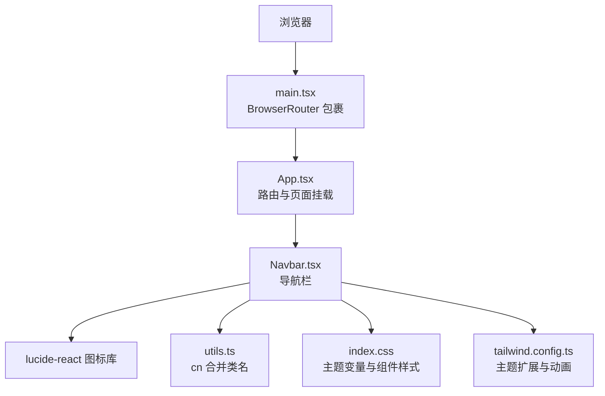
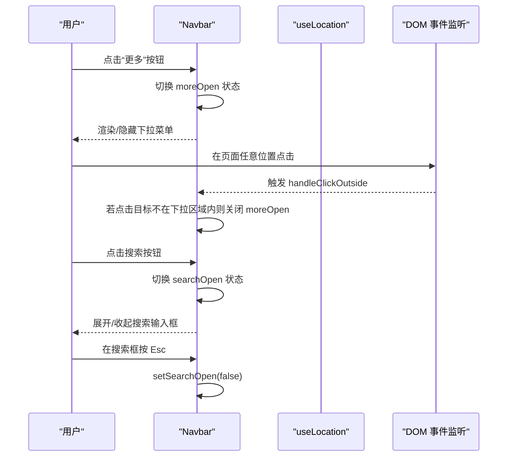
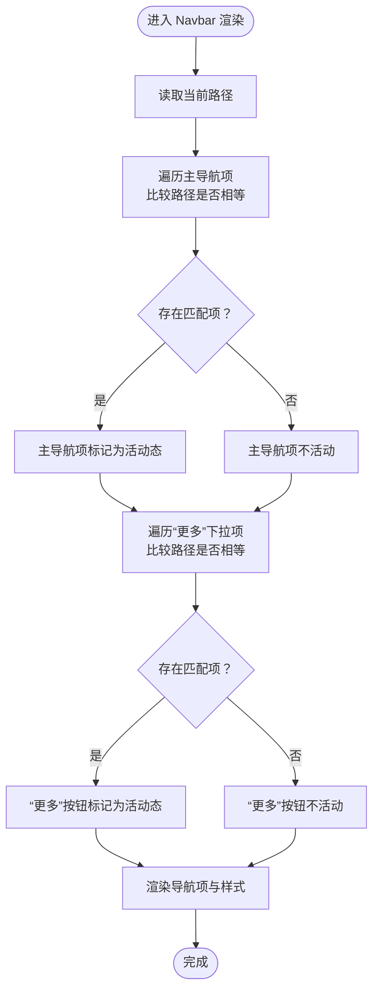
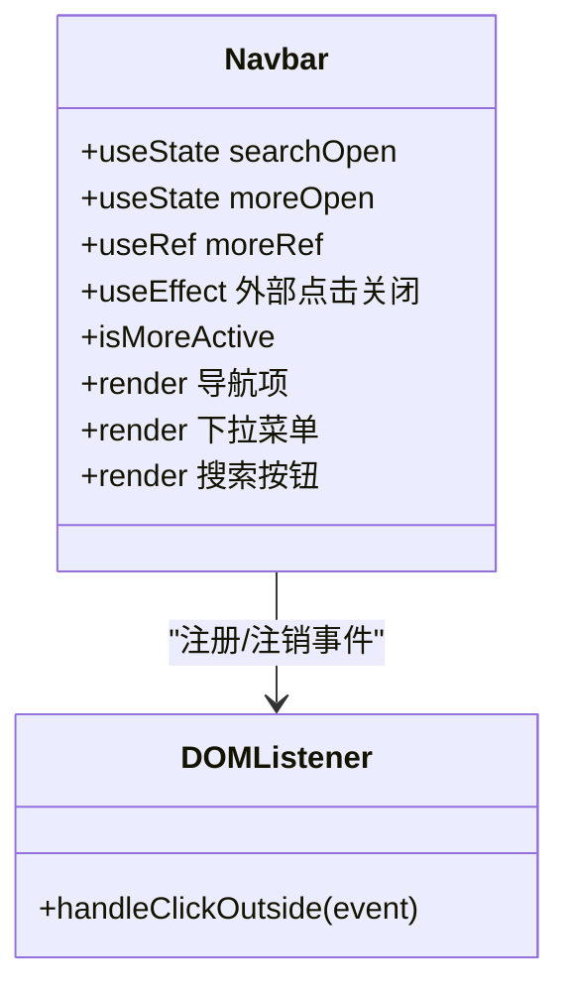
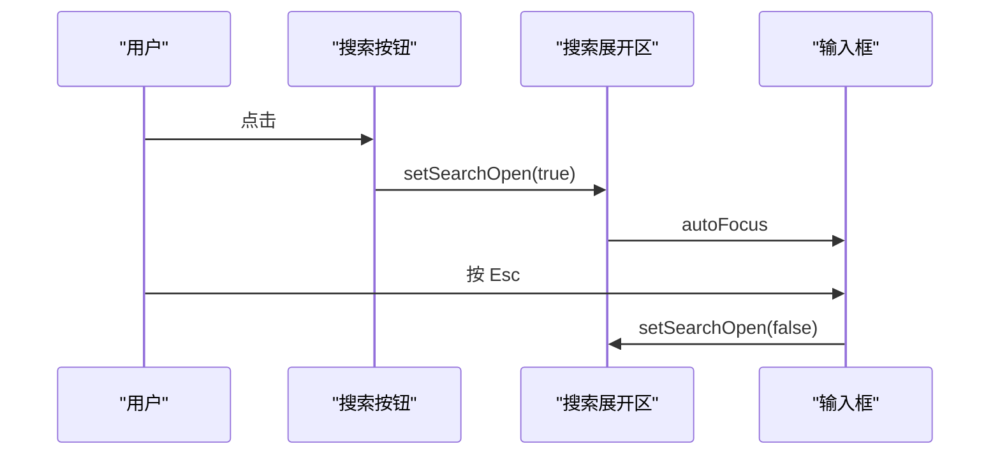
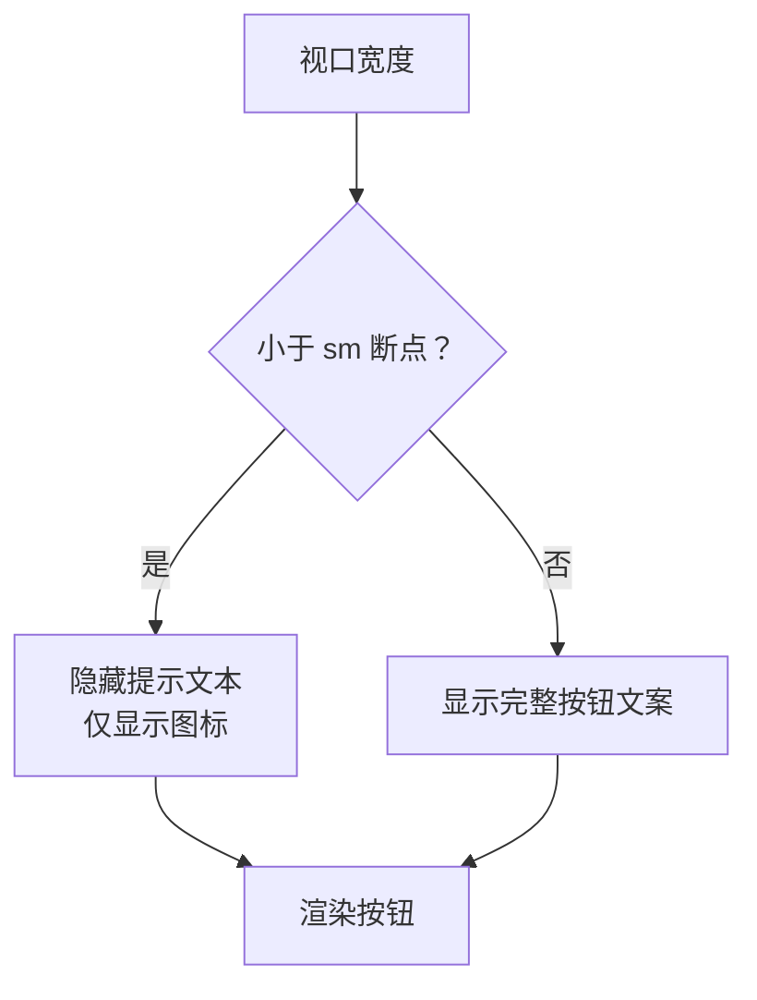
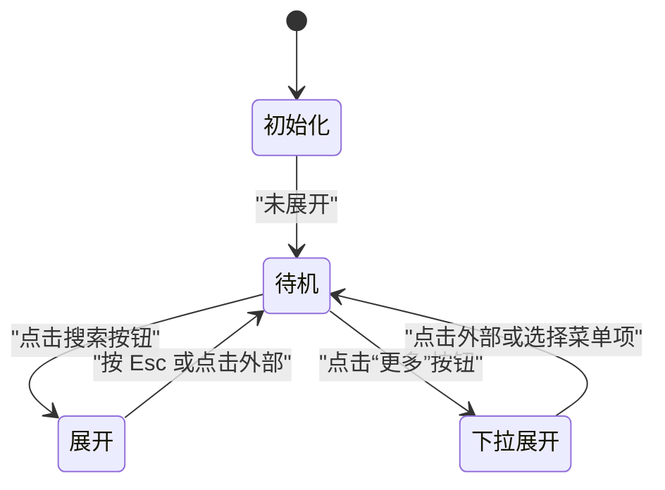
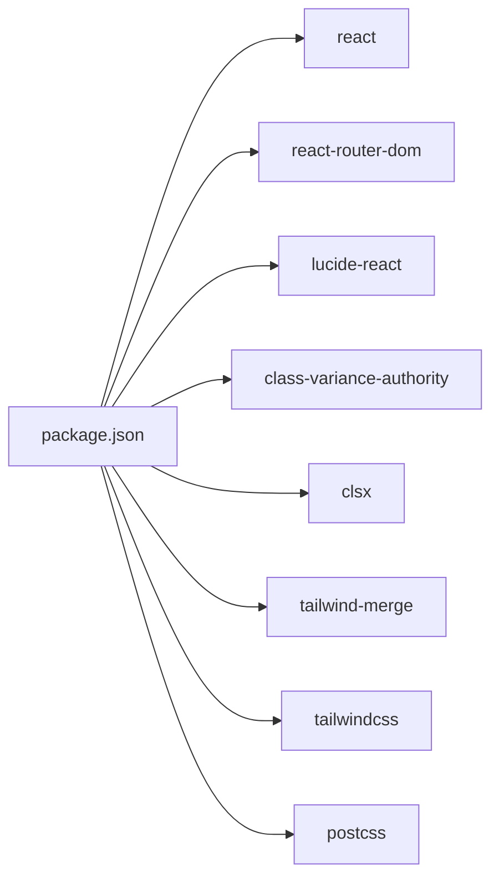

# 导航组件

<cite>
**本文引用的文件**
- [Navbar.tsx](file://src/components/Navbar.tsx)
- [App.tsx](file://src/App.tsx)
- [main.tsx](file://src/main.tsx)
- [utils.ts](file://src/lib/utils.ts)
- [index.css](file://src/index.css)
- [tailwind.config.ts](file://tailwind.config.ts)
- [types.ts](file://src/data/types.ts)
- [package.json](file://package.json)
</cite>

## 目录
1. [简介](#简介)
2. [项目结构](#项目结构)
3. [核心组件](#核心组件)
4. [架构总览](#架构总览)
5. [详细组件分析](#详细组件分析)
6. [依赖分析](#依赖分析)
7. [性能考虑](#性能考虑)
8. [故障排除指南](#故障排除指南)
9. [结论](#结论)
10. [附录](#附录)

## 简介
本文件面向“导航组件”（Navbar）的使用者与维护者，系统化阐述其设计架构、实现细节与最佳实践。内容覆盖导航项配置、下拉菜单系统、搜索功能集成、响应式设计、状态管理机制（活动状态跟踪、点击外部关闭、键盘快捷键）、图标库使用与样式定制，并提供 props 接口说明、事件处理机制与可扩展的自定义配置方法。

## 项目结构
Navbar 组件位于组件层，作为应用入口 App 的子组件被渲染；路由由 React Router 提供，根容器在 main.tsx 中包裹。样式采用 TailwindCSS + 自定义变量，主题色与组件样式在全局 CSS 中集中定义。

**图表来源**
- [main.tsx:1-14](file://src/main.tsx#L1-L14)
- [App.tsx:19-42](file://src/App.tsx#L19-L42)
- [Navbar.tsx:1-142](file://src/components/Navbar.tsx#L1-L142)
- [utils.ts:5-7](file://src/lib/utils.ts#L5-L7)
- [index.css:5-77](file://src/index.css#L5-L77)
- [tailwind.config.ts:1-104](file://tailwind.config.ts#L1-L104)

**章节来源**
- [main.tsx:1-14](file://src/main.tsx#L1-L14)
- [App.tsx:19-42](file://src/App.tsx#L19-L42)
- [Navbar.tsx:1-142](file://src/components/Navbar.tsx#L1-L142)

## 核心组件
- 组件名称：Navbar
- 所属模块：src/components/Navbar.tsx
- 依赖库：react-router-dom（useLocation、Link）、lucide-react（图标）、clsx + tailwind-merge（类名合并）
- 主要职责：
  - 渲染主导航链接与“更多”下拉菜单
  - 基于当前路径高亮活动状态
  - 控制顶部搜索栏的展开/收起
  - 处理点击外部关闭下拉菜单
  - 支持键盘 Esc 快捷键收起搜索框

**章节来源**
- [Navbar.tsx:1-142](file://src/components/Navbar.tsx#L1-L142)
- [package.json:11-20](file://package.json#L11-L20)

## 架构总览
Navbar 采用函数式组件 + Hooks 的组合模式，结合路由状态与 DOM 事件实现交互。其内部包含两组导航项配置（主导航与“更多”下拉），通过 useLocation 判断活动状态；通过 useState 管理搜索与下拉开关；通过 useRef 和 useEffect 实现点击外部关闭。

**图表来源**
- [Navbar.tsx:28-37](file://src/components/Navbar.tsx#L28-L37)
- [Navbar.tsx:77-114](file://src/components/Navbar.tsx#L77-L114)
- [Navbar.tsx:118-139](file://src/components/Navbar.tsx#L118-L139)

## 详细组件分析

### 导航项配置与活动状态
- 导航项分为两类：
  - 主导航项：论文、FAST、OSDI、ATC
  - “更多”下拉项：开源存储库、Linux Bugfix、SPDK 更新、存储故障、研究团队、Git 归档
- 活动状态判断：
  - 主导航项：基于当前路径与导航项 href 是否一致
  - “更多”分组：当任一下拉项的路径与当前路径一致时，“更多”按钮即为活动态
- 高亮样式：通过类名合并工具根据是否活动态切换前景色与背景色

**图表来源**
- [Navbar.tsx:57-74](file://src/components/Navbar.tsx#L57-L74)
- [Navbar.tsx:93-111](file://src/components/Navbar.tsx#L93-L111)
- [Navbar.tsx:39](file://src/components/Navbar.tsx#L39)

**章节来源**
- [Navbar.tsx:6-20](file://src/components/Navbar.tsx#L6-L20)
- [Navbar.tsx:57-74](file://src/components/Navbar.tsx#L57-L74)
- [Navbar.tsx:93-111](file://src/components/Navbar.tsx#L93-L111)
- [Navbar.tsx:39](file://src/components/Navbar.tsx#L39)

### 下拉菜单系统
- 结构组成：
  - 触发按钮：“更多” + 下拉箭头图标
  - 菜单面板：绝对定位、带边框与阴影、z-index 较高
  - 菜单项：每个条目包含图标与标签，点击后自动收起下拉
- 行为特性：
  - 点击外部区域自动关闭
  - 箭头图标随展开状态旋转
  - 活动态样式与主导航一致

**图表来源**
- [Navbar.tsx:22-37](file://src/components/Navbar.tsx#L22-L37)
- [Navbar.tsx:77-114](file://src/components/Navbar.tsx#L77-L114)

**章节来源**
- [Navbar.tsx:28-37](file://src/components/Navbar.tsx#L28-L37)
- [Navbar.tsx:77-114](file://src/components/Navbar.tsx#L77-L114)

### 搜索功能集成
- 触发方式：点击右侧搜索按钮，展开搜索输入框
- 交互行为：
  - 展开后自动聚焦输入框
  - 支持 Esc 键快速收起
  - 输入框样式与主题一致，具备焦点态高亮
- 设计要点：按钮包含跨平台快捷键提示（⌘K），在小屏上隐藏提示文字，保持简洁

**图表来源**
- [Navbar.tsx:118-139](file://src/components/Navbar.tsx#L118-L139)

**章节来源**
- [Navbar.tsx:118-139](file://src/components/Navbar.tsx#L118-L139)

### 响应式设计
- 容器宽度：最大宽度约束，居中布局
- 小屏适配：搜索按钮中的提示文本在小屏隐藏，仅保留图标与简短文案
- 断点策略：利用 Tailwind 的 sm 断点控制元素显示/隐藏
- 主题与阴影：全局 CSS 定义了暗色学术风主题与卡片阴影，Navbar 采用统一的边框、背景与模糊效果

**图表来源**
- [index.css:4-42](file://src/index.css#L4-L42)
- [tailwind.config.ts:10-22](file://tailwind.config.ts#L10-L22)
- [Navbar.tsx:118-125](file://src/components/Navbar.tsx#L118-L125)

**章节来源**
- [index.css:4-42](file://src/index.css#L4-L42)
- [tailwind.config.ts:10-22](file://tailwind.config.ts#L10-L22)
- [Navbar.tsx:118-125](file://src/components/Navbar.tsx#L118-L125)

### 状态管理机制
- 活动状态跟踪：
  - 使用 useLocation 获取当前路径
  - 主导航项与“更多”分组分别进行路径匹配
- 点击外部关闭：
  - 通过 useRef 获取下拉容器节点
  - 在 useEffect 中注册/清理全局 mousedown 监听
  - 当点击目标不在下拉容器内时，关闭下拉
- 键盘快捷键：
  - 搜索展开区支持 Esc 收起
- 状态持久与副作用：
  - useEffect 返回清理函数，避免内存泄漏与重复绑定

**图表来源**
- [Navbar.tsx:22-37](file://src/components/Navbar.tsx#L22-L37)
- [Navbar.tsx:118-139](file://src/components/Navbar.tsx#L118-L139)
- [Navbar.tsx:77-114](file://src/components/Navbar.tsx#L77-L114)

**章节来源**
- [Navbar.tsx:22-37](file://src/components/Navbar.tsx#L22-L37)
- [Navbar.tsx:118-139](file://src/components/Navbar.tsx#L118-L139)
- [Navbar.tsx:77-114](file://src/components/Navbar.tsx#L77-L114)

### 图标库使用与样式定制
- 图标库：lucide-react，提供语义化图标组件（如 BookOpen、Award、Search 等）
- 使用方式：在导航项与下拉菜单项中直接以组件形式渲染，尺寸通过类名控制
- 样式定制：
  - 通过全局 CSS 定义主题色与渐变
  - 使用 Tailwind 类名控制尺寸、颜色、边框与过渡
  - “更多”下拉箭头图标随状态旋转，增强交互反馈

**章节来源**
- [Navbar.tsx:1-4](file://src/components/Navbar.tsx#L1-L4)
- [index.css:55-121](file://src/index.css#L55-L121)
- [tailwind.config.ts:23-63](file://tailwind.config.ts#L23-L63)

### Props 接口说明与事件处理
- 当前实现未对外暴露 props，组件通过内部状态与路由驱动 UI
- 事件处理：
  - 搜索按钮：onClick 切换搜索展开状态
  - “更多”按钮：onClick 切换下拉展开状态
  - 下拉菜单项：onClick 关闭下拉并触发路由跳转
  - 外部点击：useEffect 注册全局监听，自动关闭下拉
  - 键盘事件：输入框 onKeyPress/KeyDown 监听 Esc 收起

**章节来源**
- [Navbar.tsx:77-114](file://src/components/Navbar.tsx#L77-L114)
- [Navbar.tsx:118-139](file://src/components/Navbar.tsx#L118-L139)
- [Navbar.tsx:28-37](file://src/components/Navbar.tsx#L28-L37)

### 最佳实践与扩展建议
- 可配置性增强（建议）：
  - 将导航项配置抽离为外部 props，便于不同页面复用
  - 支持动态图标与标签国际化
- 可访问性（建议）：
  - 为“更多”按钮添加 aria-expanded 与 aria-haspopup
  - 为下拉菜单添加键盘导航（上下键选择、Enter/Space 选中）
- 性能（建议）：
  - 将导航项映射逻辑拆分为 memoized selector
  - 对图标组件进行按需加载（若体积增大）

## 依赖分析
- 运行时依赖：
  - react、react-router-dom：组件与路由
  - lucide-react：图标
  - class-variance-authority、clsx、tailwind-merge：类名合并与样式组合
- 开发依赖：
  - tailwindcss、autoprefixer、postcss：样式构建
  - vite、typescript：开发与打包

**图表来源**
- [package.json:11-30](file://package.json#L11-L30)

**章节来源**
- [package.json:11-30](file://package.json#L11-L30)

## 性能考虑
- 渲染开销：导航项数量有限，useMemo 适用场景不大；但可在外部将导航配置缓存
- 事件监听：useEffect 注册/清理全局监听，避免重复绑定；注意在组件卸载时及时清理
- 样式成本：Tailwind 类名合并与 CSS 变量使用合理，整体开销可控
- 图标体积：lucide-react 为独立包，建议按需引入或使用构建工具摇树优化

## 故障排除指南
- 下拉菜单无法关闭：
  - 检查 useRef 是否正确指向下拉容器
  - 确认 useEffect 注册/清理是否执行
- 搜索框无法收起：
  - 确认键盘事件绑定是否生效
  - 检查搜索展开状态切换逻辑
- 活动态不正确：
  - 确认 useLocation 返回的路径与导航项 href 一致
  - 检查“更多”分组的路径匹配逻辑

**章节来源**
- [Navbar.tsx:28-37](file://src/components/Navbar.tsx#L28-L37)
- [Navbar.tsx:118-139](file://src/components/Navbar.tsx#L118-L139)
- [Navbar.tsx:39](file://src/components/Navbar.tsx#L39)

## 结论
Navbar 组件以简洁的函数式结构实现了清晰的导航与交互：主/次导航项、下拉菜单、搜索展开、外部点击关闭与键盘快捷键。通过路由状态与 DOM 事件的结合，组件在保持低耦合的同时提供了良好的用户体验。建议在未来版本中增强可配置性与可访问性，以适配更复杂的业务场景。

## 附录

### 使用示例与自定义配置方法
- 基础使用：在应用入口渲染组件即可
  - 示例路径：[App.tsx:22](file://src/App.tsx#L22)
- 自定义导航项：
  - 修改主导航项数组与“更多”下拉项数组
  - 示例路径：[Navbar.tsx:6-20](file://src/components/Navbar.tsx#L6-L20)
- 自定义样式：
  - 通过全局 CSS 变量调整主题色与阴影
  - 示例路径：[index.css:5-42](file://src/index.css#L5-L42)
- 自定义图标：
  - 引入 lucide-react 新图标并在导航项中替换
  - 示例路径：[Navbar.tsx:1-4](file://src/components/Navbar.tsx#L1-L4)

**章节来源**
- [App.tsx:22](file://src/App.tsx#L22)
- [Navbar.tsx:6-20](file://src/components/Navbar.tsx#L6-L20)
- [index.css:5-42](file://src/index.css#L5-L42)
- [Navbar.tsx:1-4](file://src/components/Navbar.tsx#L1-L4)