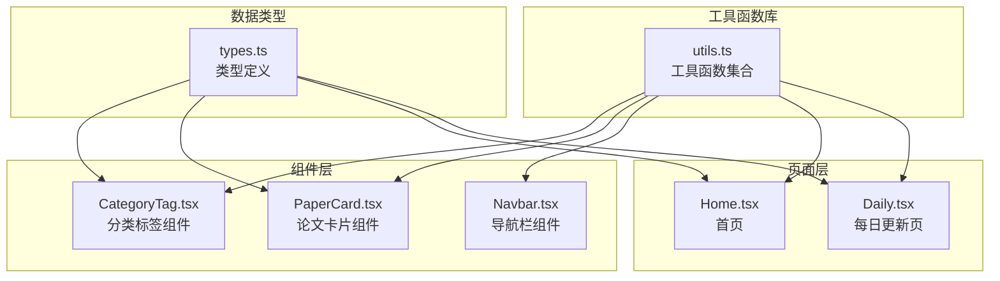
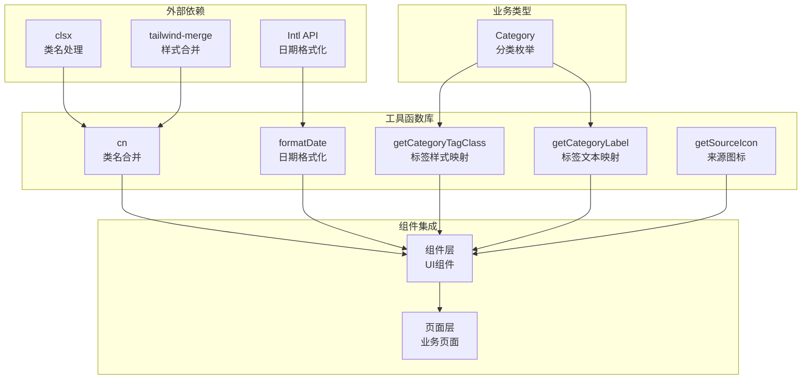
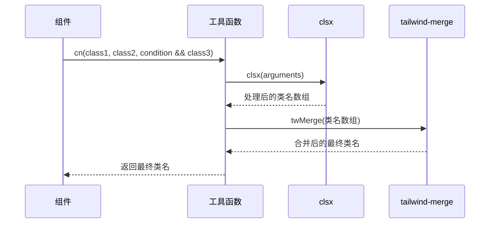
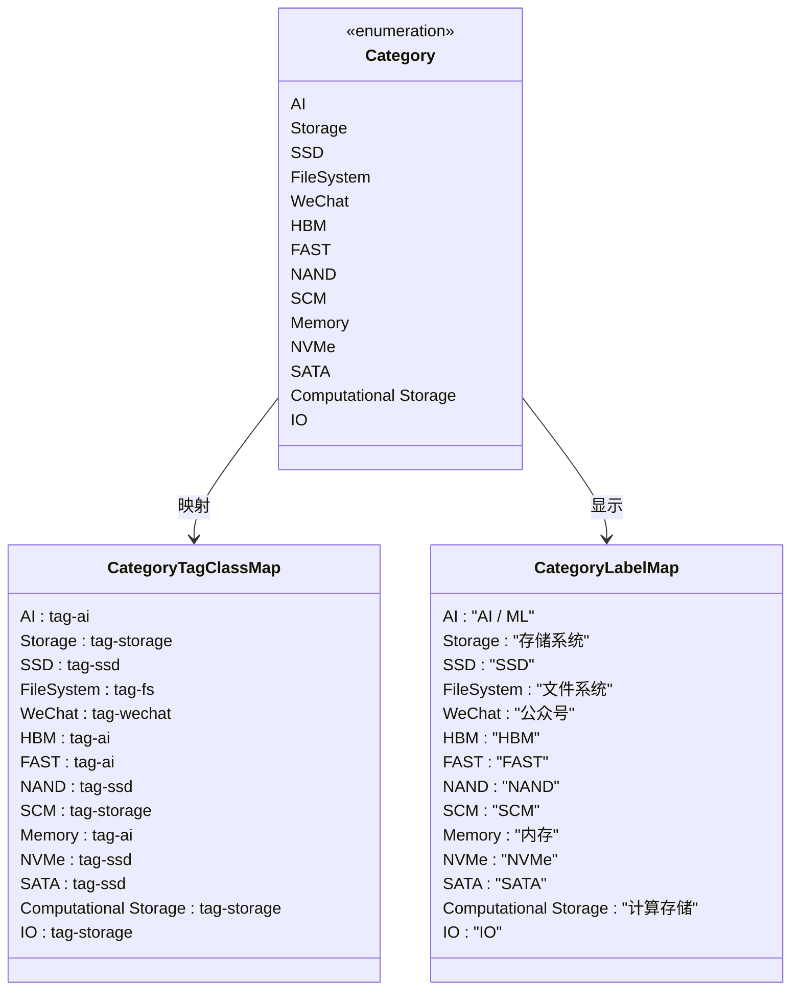
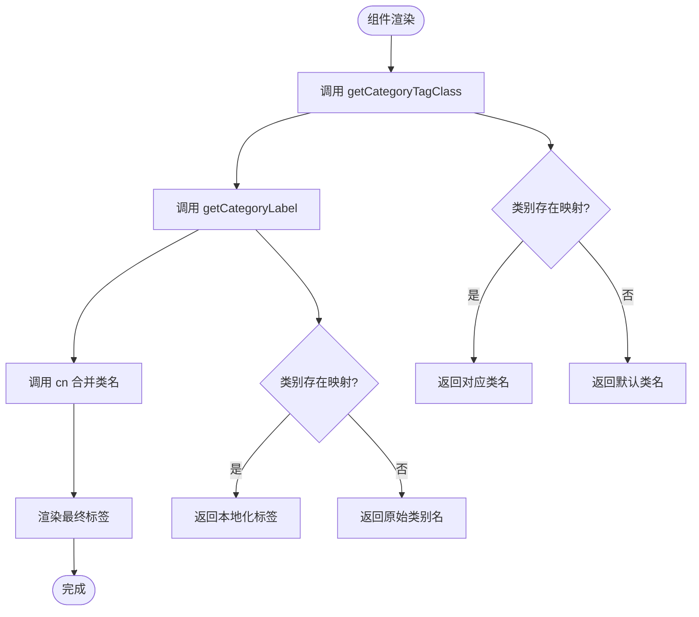
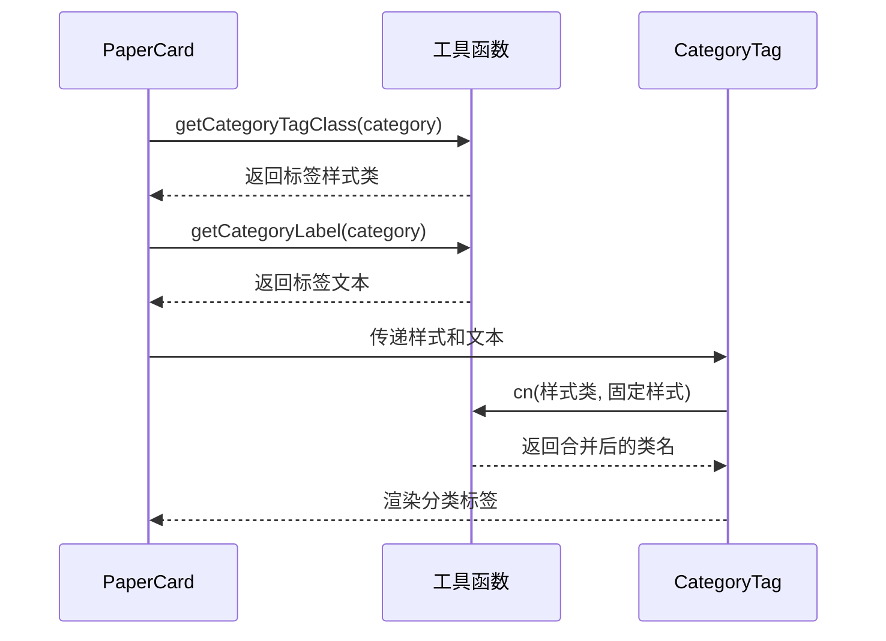
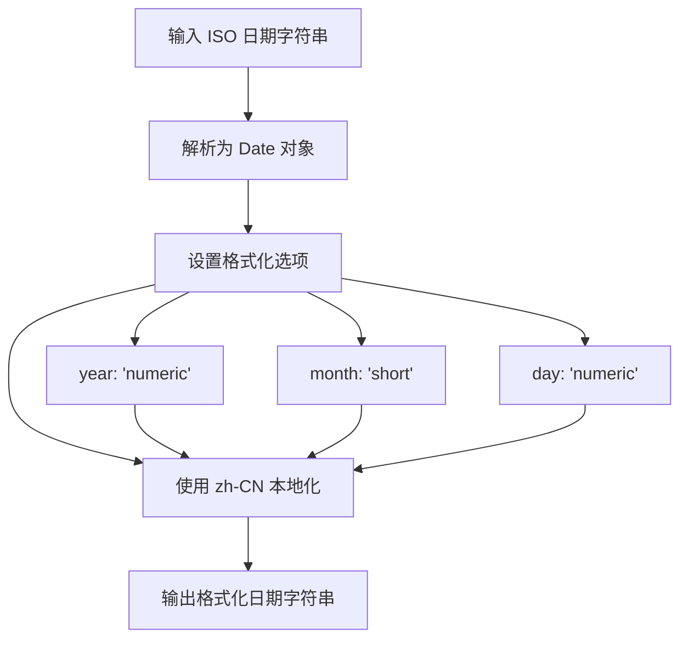
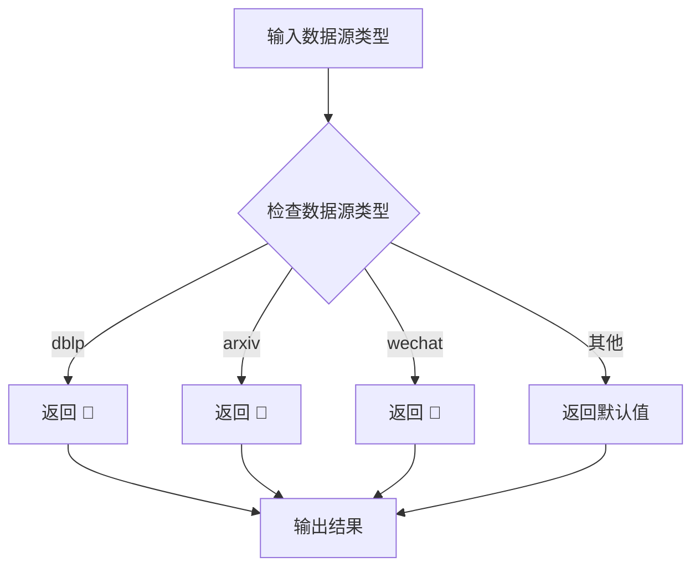
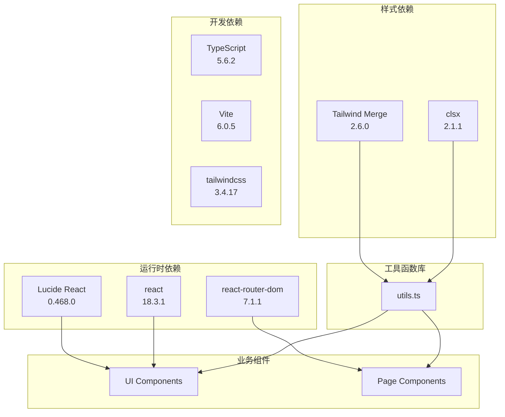

# 工具函数库

<cite>
**本文档引用的文件**
- [utils.ts](file://src/lib/utils.ts)
- [types.ts](file://src/data/types.ts)
- [CategoryTag.tsx](file://src/components/ui/CategoryTag.tsx)
- [PaperCard.tsx](file://src/components/PaperCard.tsx)
- [Navbar.tsx](file://src/components/Navbar.tsx)
- [Home.tsx](file://src/pages/Home.tsx)
- [Daily.tsx](file://src/pages/Daily.tsx)
- [package.json](file://package.json)
</cite>

## 目录
1. [简介](#简介)
2. [项目结构](#项目结构)
3. [核心组件](#核心组件)
4. [架构概览](#架构概览)
5. [详细组件分析](#详细组件分析)
6. [依赖关系分析](#依赖关系分析)
7. [性能考虑](#性能考虑)
8. [故障排除指南](#故障排除指南)
9. [结论](#结论)
10. [附录](#附录)

## 简介

工具函数库是本项目的核心基础设施，提供了统一的UI样式处理、数据格式化和分类管理功能。该库位于 `src/lib/utils.ts`，为整个React应用提供了一致的工具函数支持，确保组件间的样式一致性、数据格式标准化和业务逻辑的可维护性。

该工具函数库主要包含以下几类功能：
- **样式类名合并**：通过 `cn` 函数统一处理CSS类名的合并和冲突解决
- **分类标签管理**：提供分类到标签样式的映射和标签文本的本地化显示
- **日期格式化**：将ISO日期字符串转换为本地化的中文日期格式
- **来源图标管理**：根据数据源类型返回相应的emoji图标

## 项目结构

工具函数库在整个项目中的位置和作用如下：



**图表来源**
- [utils.ts:1-58](file://src/lib/utils.ts#L1-L58)
- [types.ts:1-49](file://src/data/types.ts#L1-L49)

**章节来源**
- [utils.ts:1-58](file://src/lib/utils.ts#L1-L58)
- [types.ts:1-49](file://src/data/types.ts#L1-L49)

## 核心组件

工具函数库包含四个核心函数，每个函数都有明确的设计目的和使用场景：

### 1. 类名合并函数 (`cn`)
- **设计目的**：统一处理CSS类名的合并，避免重复和冲突
- **实现原理**：结合 `clsx` 和 `tailwind-merge` 实现智能的类名合并
- **使用场景**：所有需要动态生成CSS类名的组件
- **返回值**：合并后的CSS类名字符串

### 2. 分类标签类名映射 (`getCategoryTagClass`)
- **设计目的**：将分类枚举映射到对应的CSS标签样式类
- **实现原理**：基于分类类型的静态映射表
- **使用场景**：分类标签组件的颜色和样式控制
- **返回值**：对应的CSS标签样式类名

### 3. 分类标签文本映射 (`getCategoryLabel`)
- **设计目的**：提供分类的本地化显示文本
- **实现原理**：支持中英文双语的分类标签映射
- **使用场景**：用户界面中显示分类名称
- **返回值**：本地化的分类标签文本

### 4. 日期格式化 (`formatDate`)
- **设计目的**：将ISO日期字符串格式化为本地化的中文日期
- **实现原理**：使用JavaScript的 `toLocaleDateString` 方法
- **使用场景**：论文发布日期、更新时间等日期显示
- **返回值**：格式化后的中文日期字符串

### 5. 来源图标映射 (`getSourceIcon`)
- **设计目的**：根据数据源类型返回相应的emoji图标
- **实现原理**：简单的字符串映射表
- **使用场景**：显示论文来源（DBLP、ArXiv、微信公众号）
- **返回值**：对应的emoji图标字符

**章节来源**
- [utils.ts:5-58](file://src/lib/utils.ts#L5-L58)

## 架构概览

工具函数库采用模块化设计，通过清晰的职责分离实现了高内聚低耦合：



**图表来源**
- [utils.ts:1-58](file://src/lib/utils.ts#L1-L58)
- [types.ts:1](file://src/data/types.ts#L1)

## 详细组件分析

### 类名合并函数 (`cn`)

#### 设计模式
该函数采用了装饰器模式和策略模式的结合：
- **装饰器模式**：包装了 `clsx` 和 `tailwind-merge` 的功能
- **策略模式**：根据不同输入类型选择不同的处理策略

#### 参数和返回值
- **参数**：可变数量的 `ClassValue` 类型参数
- **返回值**：`string` 类型的合并后类名

#### 使用模式


**图表来源**
- [utils.ts:5-7](file://src/lib/utils.ts#L5-L7)

#### 性能特性
- **时间复杂度**：O(n)，其中n为传入参数数量
- **空间复杂度**：O(n)，用于存储处理后的类名
- **优化策略**：利用 `tailwind-merge` 避免样式冲突，减少DOM重排

**章节来源**
- [utils.ts:5-7](file://src/lib/utils.ts#L5-L7)

### 分类标签管理函数组

#### 类别映射系统
该系统提供了完整的分类标签管理能力：



**图表来源**
- [utils.ts:9-47](file://src/lib/utils.ts#L9-L47)
- [types.ts:1](file://src/data/types.ts#L1)

#### 使用场景分析

##### 分类标签组件 (`CategoryTag.tsx`)
该组件展示了分类标签的最佳实践：



**图表来源**
- [CategoryTag.tsx:11-24](file://src/components/ui/CategoryTag.tsx#L11-L24)
- [utils.ts:9-47](file://src/lib/utils.ts#L9-L47)

##### 论文卡片组件 (`PaperCard.tsx`)
在论文卡片中，分类标签用于展示论文的领域分类：



**图表来源**
- [PaperCard.tsx:24-26](file://src/components/PaperCard.tsx#L24-L26)
- [utils.ts:9-47](file://src/lib/utils.ts#L9-L47)

**章节来源**
- [utils.ts:9-47](file://src/lib/utils.ts#L9-L47)
- [CategoryTag.tsx:11-24](file://src/components/ui/CategoryTag.tsx#L11-L24)
- [PaperCard.tsx:24-26](file://src/components/PaperCard.tsx#L24-L26)

### 日期格式化函数 (`formatDate`)

#### 实现机制
该函数利用了现代浏览器的国际化API来实现本地化日期格式化：



**图表来源**
- [utils.ts:49-52](file://src/lib/utils.ts#L49-L52)

#### 应用场景
- **首页论文列表**：显示论文的发布日期
- **每日更新页面**：显示论文的更新日期
- **论文详情页面**：显示论文的详细信息

**章节来源**
- [utils.ts:49-52](file://src/lib/utils.ts#L49-L52)
- [Daily.tsx:65-66](file://src/pages/Daily.tsx#L65-L66)

### 来源图标函数 (`getSourceIcon`)

#### 功能特性
该函数提供了简洁的数据源标识系统：
- **支持的数据源**：DBLP、ArXiv、微信公众号
- **视觉标识**：使用emoji字符提供直观的视觉提示
- **扩展性**：易于添加新的数据源类型

#### 使用模式


**图表来源**
- [utils.ts:54-57](file://src/lib/utils.ts#L54-L57)

**章节来源**
- [utils.ts:54-57](file://src/lib/utils.ts#L54-L57)
- [PaperCard.tsx:28-30](file://src/components/PaperCard.tsx#L28-L30)

## 依赖关系分析

工具函数库的依赖关系体现了清晰的分层架构：



**图表来源**
- [package.json:11-31](file://package.json#L11-L31)
- [utils.ts:1-2](file://src/lib/utils.ts#L1-L2)

**章节来源**
- [package.json:11-31](file://package.json#L11-L31)

## 性能考虑

### 内存优化策略
1. **函数式设计**：所有工具函数都是纯函数，无状态保持
2. **字符串复用**：分类标签类名和文本在编译时确定
3. **最小化依赖**：仅引入必要的外部依赖

### 运行时性能
1. **缓存机制**：分类映射表在模块加载时初始化，后续访问为O(1)
2. **懒加载**：日期格式化仅在需要时执行
3. **类名合并优化**：利用 `tailwind-merge` 避免重复样式

### 可扩展性考虑
1. **类型安全**：所有函数都具有完整的TypeScript类型定义
2. **向后兼容**：新增函数不影响现有接口
3. **配置灵活**：支持通过参数调整行为

## 故障排除指南

### 常见问题及解决方案

#### 1. 类名冲突问题
**问题描述**：多个CSS类同时影响同一元素样式
**解决方案**：使用 `cn` 函数自动处理类名冲突
```typescript
// 错误做法
className="btn btn-primary btn-disabled"

// 正确做法
className={cn("btn", "btn-primary", disabled && "btn-disabled")}
```

#### 2. 分类标签显示异常
**问题描述**：新添加的分类无法正确显示样式
**解决方案**：在分类映射表中添加对应的映射项
```typescript
// 在 getCategoryTagClass 中添加映射
export function getCategoryTagClass(cat: Category): string {
  const map: Record<Category, string> = {
    // ... 现有映射
    新分类: 'tag-new-category'  // 添加新映射
  }
  return map[cat] ?? 'tag-storage'
}
```

#### 3. 日期格式化错误
**问题描述**：日期显示不符合预期格式
**解决方案**：检查输入的日期字符串格式
```typescript
// 确保输入为有效的ISO日期字符串
const dateStr = paper.date // 必须是 "YYYY-MM-DD" 格式
const formattedDate = formatDate(dateStr)
```

#### 4. 来源图标不显示
**问题描述**：论文来源图标显示为问号或空格
**解决方案**：检查数据源字段的值
```typescript
// 确保 source 字段值正确
const source = paper.source // 必须是 'dblp' | 'arxiv' | 'wechat' 之一
const icon = getSourceIcon(source)
```

**章节来源**
- [utils.ts:5-58](file://src/lib/utils.ts#L5-L58)

## 结论

工具函数库通过精心设计的四个核心函数，为整个React应用提供了强大而灵活的基础设施支持。其设计特点包括：

1. **模块化设计**：每个函数职责单一，便于测试和维护
2. **类型安全**：完整的TypeScript类型定义确保编译时安全
3. **性能优化**：采用纯函数和缓存策略提升运行效率
4. **可扩展性**：清晰的接口设计支持未来功能扩展

该库的成功实施证明了工具函数库在大型前端项目中的重要价值，它不仅提高了代码的可维护性，还确保了用户体验的一致性和可靠性。

## 附录

### 扩展和自定义指南

#### 添加新的工具函数
1. **确定函数职责**：确保新函数符合现有设计原则
2. **编写类型定义**：提供完整的TypeScript类型声明
3. **实现功能逻辑**：遵循纯函数设计，避免副作用
4. **添加单元测试**：确保函数的正确性和稳定性
5. **更新文档**：记录函数的使用方法和注意事项

#### 性能监控建议
1. **函数调用频率统计**：监控高频调用的函数
2. **内存使用分析**：定期检查内存泄漏风险
3. **渲染性能评估**：关注对渲染性能的影响
4. **缓存策略优化**：根据使用模式调整缓存策略

#### 最佳实践
1. **避免全局状态**：保持函数的纯函数特性
2. **错误处理**：为边界情况提供合理的默认值
3. **文档完善**：为每个函数提供详细的使用说明
4. **版本管理**：遵循语义化版本控制原则