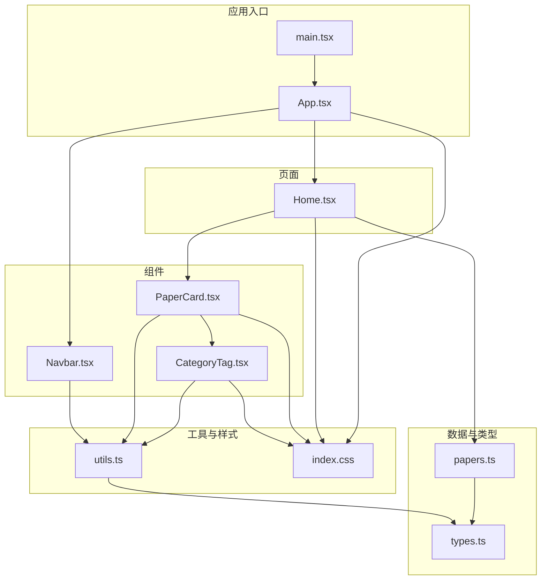
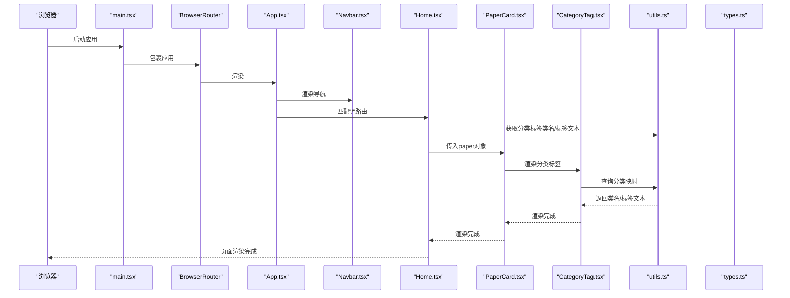
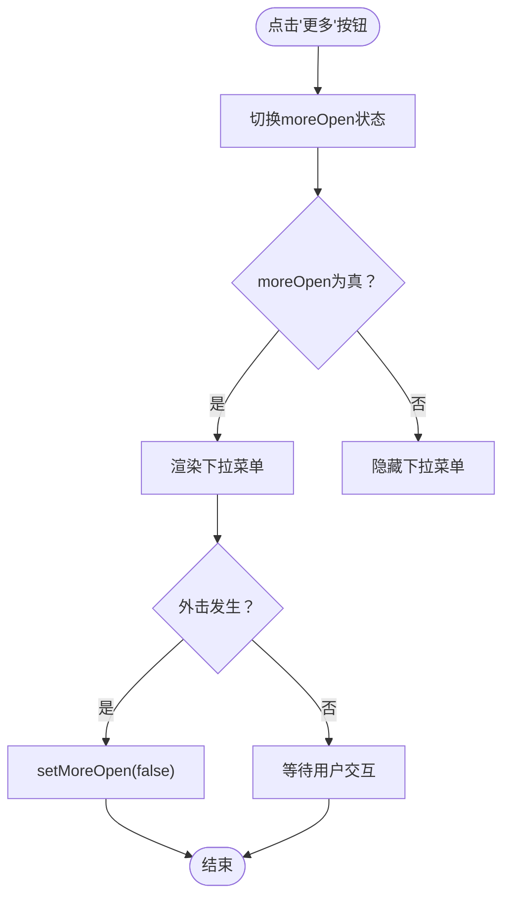
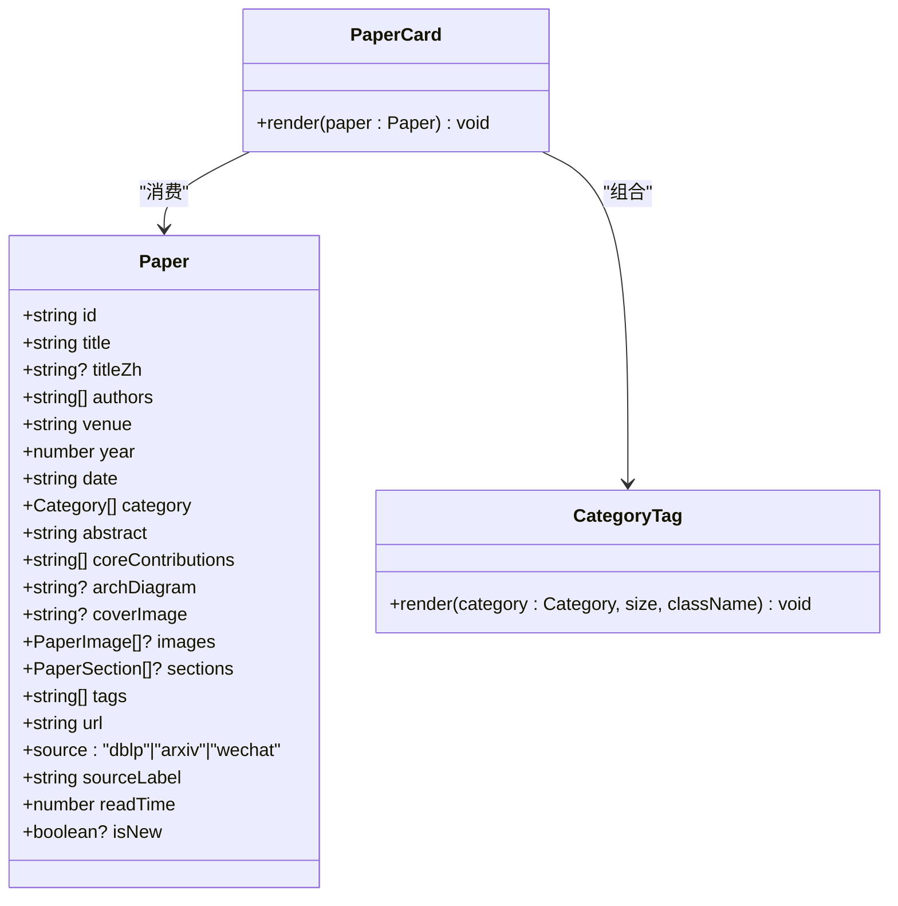
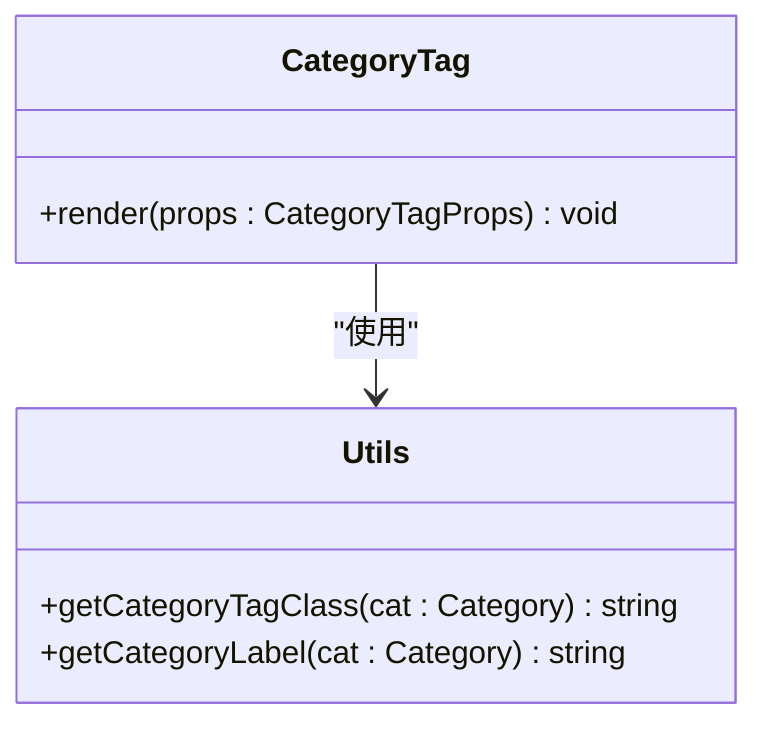
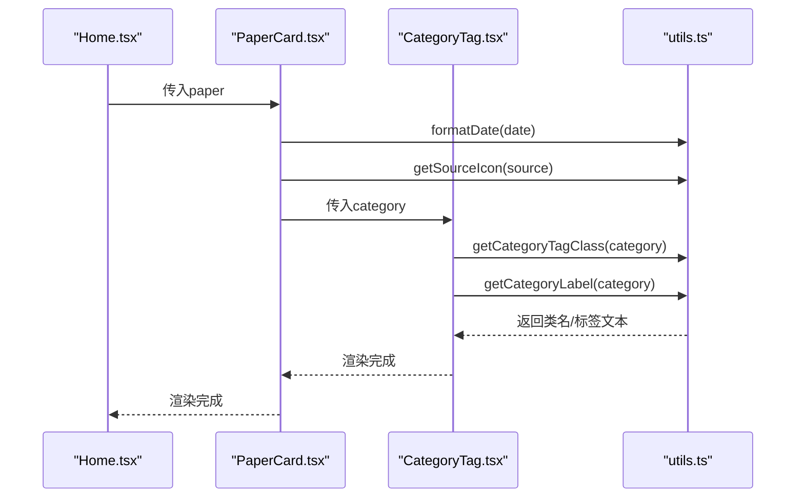
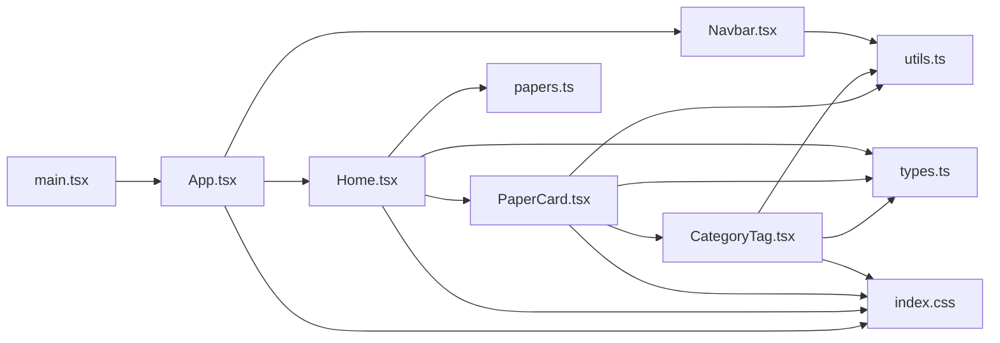

# 组件系统

<cite>
**本文引用的文件**
- [Navbar.tsx](file://src/components/Navbar.tsx)
- [CategoryTag.tsx](file://src/components/ui/CategoryTag.tsx)
- [PaperCard.tsx](file://src/components/PaperCard.tsx)
- [types.ts](file://src/data/types.ts)
- [utils.ts](file://src/lib/utils.ts)
- [Home.tsx](file://src/pages/Home.tsx)
- [App.tsx](file://src/App.tsx)
- [main.tsx](file://src/main.tsx)
- [papers.ts](file://src/data/papers.ts)
- [index.css](file://src/index.css)
</cite>

## 目录
1. [简介](#简介)
2. [项目结构](#项目结构)
3. [核心组件](#核心组件)
4. [架构总览](#架构总览)
5. [组件详细分析](#组件详细分析)
6. [依赖关系分析](#依赖关系分析)
7. [性能考量](#性能考量)
8. [故障排查指南](#故障排查指南)
9. [结论](#结论)
10. [附录](#附录)

## 简介
本文件面向cs336项目的可复用UI组件系统，围绕Navbar导航栏、PaperCard论文卡片、CategoryTag分类标签等核心组件，系统阐述设计理念、接口设计、状态管理、事件处理、组件通信与数据流、可定制性与最佳实践。文档同时给出架构图、类图、时序图与流程图，帮助开发者快速理解与高效复用这些组件。

## 项目结构
项目采用“按功能域分层”的组织方式：
- components：可复用UI组件（Navbar、PaperCard、CategoryTag）
- pages：页面级组件（Home、PaperDetail等）
- data：类型定义与静态数据（types、papers等）
- lib：通用工具函数（utils）
- 样式：Tailwind与CSS变量（index.css）

图表来源
- [main.tsx:1-14](file://src/main.tsx#L1-L14)
- [App.tsx:1-45](file://src/App.tsx#L1-L45)
- [Home.tsx:1-209](file://src/pages/Home.tsx#L1-L209)
- [Navbar.tsx:1-143](file://src/components/Navbar.tsx#L1-L143)
- [PaperCard.tsx:1-73](file://src/components/PaperCard.tsx#L1-L73)
- [CategoryTag.tsx:1-25](file://src/components/ui/CategoryTag.tsx#L1-L25)
- [types.ts:1-49](file://src/data/types.ts#L1-L49)
- [papers.ts:1-815](file://src/data/papers.ts#L1-L815)
- [utils.ts:1-58](file://src/lib/utils.ts#L1-L58)
- [index.css:1-158](file://src/index.css#L1-L158)

章节来源
- [main.tsx:1-14](file://src/main.tsx#L1-L14)
- [App.tsx:1-45](file://src/App.tsx#L1-L45)

## 核心组件
本节概述三个核心组件的职责、接口与使用场景：
- Navbar：顶部导航与搜索入口，包含“更多”下拉菜单与外击关闭逻辑
- PaperCard：论文卡片容器，聚合标题、摘要、作者、标签、分类标签、来源标识与阅读时长
- CategoryTag：分类标签展示组件，支持尺寸与类名扩展

章节来源
- [Navbar.tsx:22-143](file://src/components/Navbar.tsx#L22-L143)
- [PaperCard.tsx:7-73](file://src/components/PaperCard.tsx#L7-L73)
- [CategoryTag.tsx:5-25](file://src/components/ui/CategoryTag.tsx#L5-L25)

## 架构总览
应用通过路由组织页面，Navbar贯穿所有页面，PaperCard在Home页中被大量使用。组件间通过props向下传递数据，通过utils统一格式化与分类映射。

图表来源
- [main.tsx:7-13](file://src/main.tsx#L7-L13)
- [App.tsx:19-42](file://src/App.tsx#L19-L42)
- [Navbar.tsx:42-141](file://src/components/Navbar.tsx#L42-L141)
- [Home.tsx:15-208](file://src/pages/Home.tsx#L15-L208)
- [PaperCard.tsx:11-72](file://src/components/PaperCard.tsx#L11-L72)
- [CategoryTag.tsx:11-24](file://src/components/ui/CategoryTag.tsx#L11-L24)
- [utils.ts:9-57](file://src/lib/utils.ts#L9-L57)
- [types.ts:13-34](file://src/data/types.ts#L13-L34)

## 组件详细分析

### Navbar 导航栏组件
- 职责
  - 渲染主导航项（论文、FAST、OSDI、ATC）
  - “更多”下拉菜单（开源存储库、Linux Bugfix、SPDK 更新、存储故障、研究团队、Git 归档）
  - 搜索栏展开/收起与键盘快捷键支持
  - 外击关闭下拉菜单
  - 当前路由激活态高亮
- Props
  - 无对外props（内部使用useLocation与状态管理）
- 状态管理
  - searchOpen：控制搜索栏展开
  - moreOpen：控制“更多”下拉菜单展开
  - useRef：获取“更多”下拉容器DOM，用于外击检测
  - useEffect：注册/清理外击监听
- 事件处理
  - 点击“更多”按钮切换moreOpen
  - 点击下拉项后自动收起
  - 搜索按钮切换searchOpen
  - 输入框支持Esc键收起
- 样式与可定制性
  - 使用cn组合Tailwind类名，支持className透传
  - 主题色与阴影由CSS变量与Tailwind层控制
- 与路由集成
  - 使用react-router-dom Link与useLocation判断激活态

图表来源
- [Navbar.tsx:22-37](file://src/components/Navbar.tsx#L22-L37)
- [Navbar.tsx:77-114](file://src/components/Navbar.tsx#L77-L114)

章节来源
- [Navbar.tsx:22-143](file://src/components/Navbar.tsx#L22-L143)
- [index.css:122-131](file://src/index.css#L122-L131)

### PaperCard 论文卡片组件
- 职责
  - 展示论文标题（中英双语）、摘要、作者、标签、分类标签、来源图标与阅读时长
  - 新文章标记与截断显示
  - 作为链接跳转到论文详情页
- Props
  - paper: Paper（来自types.ts）
- 数据来源
  - 通过utils格式化日期、来源图标
  - 通过CategoryTag渲染分类标签
- 可定制性
  - 通过Link的to属性与路由约定跳转
  - 样式由index.css与Tailwind类名控制

图表来源
- [PaperCard.tsx:7-9](file://src/components/PaperCard.tsx#L7-L9)
- [types.ts:13-34](file://src/data/types.ts#L13-L34)
- [CategoryTag.tsx:5-9](file://src/components/ui/CategoryTag.tsx#L5-L9)

章节来源
- [PaperCard.tsx:11-73](file://src/components/PaperCard.tsx#L11-L73)
- [utils.ts:49-57](file://src/lib/utils.ts#L49-L57)
- [index.css:105-115](file://src/index.css#L105-L115)

### CategoryTag 分类标签组件
- 职责
  - 将Category映射为带样式的标签文本
  - 支持尺寸（sm/md）与自定义className
- Props
  - category: Category（来自types.ts）
  - size?: 'sm' | 'md'
  - className?: string
- 数据与样式
  - 通过utils.getCategoryTagClass与getCategoryLabel获取类名与标签文本
  - 类名对应CSS变量与Tailwind层定义的标签样式

图表来源
- [CategoryTag.tsx:5-9](file://src/components/ui/CategoryTag.tsx#L5-L9)
- [utils.ts:9-47](file://src/lib/utils.ts#L9-L47)

章节来源
- [CategoryTag.tsx:11-24](file://src/components/ui/CategoryTag.tsx#L11-L24)
- [utils.ts:9-47](file://src/lib/utils.ts#L9-L47)
- [types.ts:1-1](file://src/data/types.ts#L1-L1)

### 组件间通信与数据流
- 父子通信
  - Home向PaperCard传递paper对象
  - PaperCard向CategoryTag传递category
- 工具函数通信
  - utils提供分类映射、格式化与图标选择
- 路由通信
  - App集中声明路由，Navbar与页面共享导航状态（通过useLocation）

图表来源
- [Home.tsx:194-198](file://src/pages/Home.tsx#L194-L198)
- [PaperCard.tsx:11-72](file://src/components/PaperCard.tsx#L11-L72)
- [CategoryTag.tsx:11-24](file://src/components/ui/CategoryTag.tsx#L11-L24)
- [utils.ts:49-57](file://src/lib/utils.ts#L49-L57)

章节来源
- [Home.tsx:15-208](file://src/pages/Home.tsx#L15-L208)
- [PaperCard.tsx:11-73](file://src/components/PaperCard.tsx#L11-L73)
- [CategoryTag.tsx:11-24](file://src/components/ui/CategoryTag.tsx#L11-L24)
- [utils.ts:9-57](file://src/lib/utils.ts#L9-L57)

## 依赖关系分析
- 组件依赖
  - PaperCard依赖CategoryTag与utils
  - CategoryTag依赖utils与types
  - Navbar依赖utils与react-router-dom
- 数据依赖
  - Home依赖papers数据与types
- 样式依赖
  - 所有组件依赖index.css中的CSS变量与Tailwind层

图表来源
- [PaperCard.tsx:1-6](file://src/components/PaperCard.tsx#L1-L6)
- [CategoryTag.tsx:1-4](file://src/components/ui/CategoryTag.tsx#L1-L4)
- [utils.ts:1-7](file://src/lib/utils.ts#L1-L7)
- [types.ts:1-49](file://src/data/types.ts#L1-L49)
- [Home.tsx:1-8](file://src/pages/Home.tsx#L1-L8)
- [papers.ts:1-3](file://src/data/papers.ts#L1-L3)
- [Navbar.tsx:1-4](file://src/components/Navbar.tsx#L1-L4)
- [App.tsx:1-22](file://src/App.tsx#L1-L22)
- [main.tsx:1-14](file://src/main.tsx#L1-L14)
- [index.css:1-158](file://src/index.css#L1-L158)

章节来源
- [PaperCard.tsx:1-6](file://src/components/PaperCard.tsx#L1-L6)
- [CategoryTag.tsx:1-4](file://src/components/ui/CategoryTag.tsx#L1-L4)
- [utils.ts:1-7](file://src/lib/utils.ts#L1-L7)
- [types.ts:1-49](file://src/data/types.ts#L1-L49)
- [Home.tsx:1-8](file://src/pages/Home.tsx#L1-L8)
- [papers.ts:1-3](file://src/data/papers.ts#L1-L3)
- [Navbar.tsx:1-4](file://src/components/Navbar.tsx#L1-L4)
- [App.tsx:1-22](file://src/App.tsx#L1-L22)
- [main.tsx:1-14](file://src/main.tsx#L1-L14)
- [index.css:1-158](file://src/index.css#L1-L158)

## 性能考量
- 渲染性能
  - PaperCard使用Link包裹，避免重复渲染父级；PaperCard内部仅渲染必要字段，避免过度重排
  - Home中过滤与排序使用useMemo，减少不必要的重算
- 交互性能
  - Navbar下拉菜单外击关闭使用useEffect注册/清理，避免内存泄漏
  - 搜索输入框支持Esc键快速收起，提升交互效率
- 样式性能
  - 使用CSS变量与Tailwind层，减少重复类名拼接带来的开销
  - 卡片hover使用过渡动画，注意在低端设备上的性能影响
- 数据访问
  - CategoryTag与PaperCard通过utils映射，避免在组件内重复定义映射逻辑

章节来源
- [Home.tsx:20-33](file://src/pages/Home.tsx#L20-L33)
- [Navbar.tsx:28-37](file://src/components/Navbar.tsx#L28-L37)
- [PaperCard.tsx:11-73](file://src/components/PaperCard.tsx#L11-L73)
- [utils.ts:9-47](file://src/lib/utils.ts#L9-L47)
- [index.css:105-115](file://src/index.css#L105-L115)

## 故障排查指南
- 下拉菜单无法关闭
  - 检查外击监听是否正确注册与清理
  - 确认ref指向的DOM元素存在
- 搜索框无法收起
  - 检查Esc键绑定与searchOpen状态切换
- 分类标签样式异常
  - 检查Category是否在utils映射范围内
  - 确认CSS变量与Tailwind层已正确加载
- 论文卡片链接无效
  - 检查Paper.id与路由参数是否一致
  - 确认App路由配置包含对应路径

章节来源
- [Navbar.tsx:28-37](file://src/components/Navbar.tsx#L28-L37)
- [Navbar.tsx:118-139](file://src/components/Navbar.tsx#L118-L139)
- [utils.ts:9-47](file://src/lib/utils.ts#L9-L47)
- [index.css:43-104](file://src/index.css#L43-L104)
- [App.tsx:24-39](file://src/App.tsx#L24-L39)

## 结论
本组件系统以简洁的props接口、清晰的状态管理与稳定的工具函数抽象，实现了高复用与易维护的UI组件体系。Navbar提供一致的导航体验，PaperCard与CategoryTag共同构建论文信息的可读性与可识别性。通过CSS变量与Tailwind层，组件具备良好的可定制性与主题一致性。建议在扩展新组件时遵循现有模式：明确props、使用utils统一格式化、通过className扩展样式、在页面中合理使用useMemo优化性能。

## 附录

### 组件接口与属性参考
- Navbar
  - 无对外props
  - 内部状态：searchOpen、moreOpen
  - 事件：点击“更多”、点击下拉项、外击、Esc键
- PaperCard
  - props.paper: Paper
- CategoryTag
  - props.category: Category
  - props.size?: 'sm' | 'md'
  - props.className?: string

章节来源
- [Navbar.tsx:22-143](file://src/components/Navbar.tsx#L22-L143)
- [PaperCard.tsx:7-9](file://src/components/PaperCard.tsx#L7-L9)
- [CategoryTag.tsx:5-9](file://src/components/ui/CategoryTag.tsx#L5-L9)

### 使用场景与最佳实践
- 组合使用
  - 在列表页（如Home）中，PaperCard组合CategoryTag渲染分类标签
  - 在详情页中，PaperCard作为信息容器，搭配其他组件（如图片、章节）使用
- 样式覆盖
  - 通过className透传与Tailwind类名组合，实现局部样式覆盖
  - 使用CSS变量统一主题色与阴影，确保一致性
- 行为配置
  - 通过utils扩展映射（如新增Category），保持组件不变
  - 通过props扩展（如CategoryTag的size与className）满足不同布局需求
- 性能优化
  - 列表渲染时使用useMemo过滤与排序
  - 避免在组件内重复定义映射，统一使用utils
- 可访问性与兼容性
  - 使用语义化HTML与Link组件，保证键盘导航
  - Tailwind与CSS变量在主流浏览器中具备良好兼容性

章节来源
- [Home.tsx:15-208](file://src/pages/Home.tsx#L15-L208)
- [PaperCard.tsx:11-73](file://src/components/PaperCard.tsx#L11-L73)
- [CategoryTag.tsx:11-24](file://src/components/ui/CategoryTag.tsx#L11-L24)
- [utils.ts:9-47](file://src/lib/utils.ts#L9-L47)
- [index.css:1-158](file://src/index.css#L1-L158)