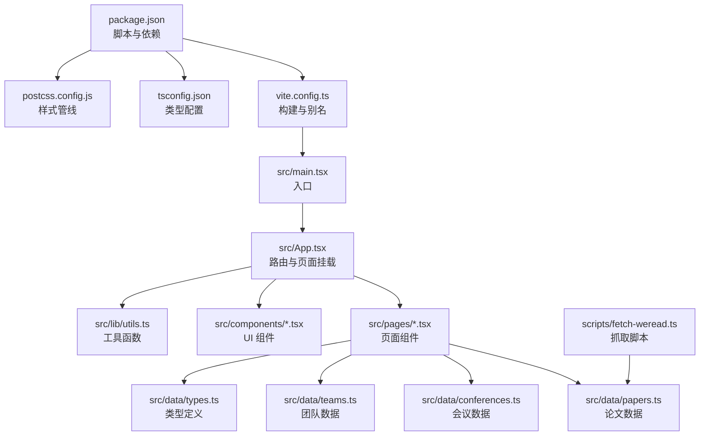
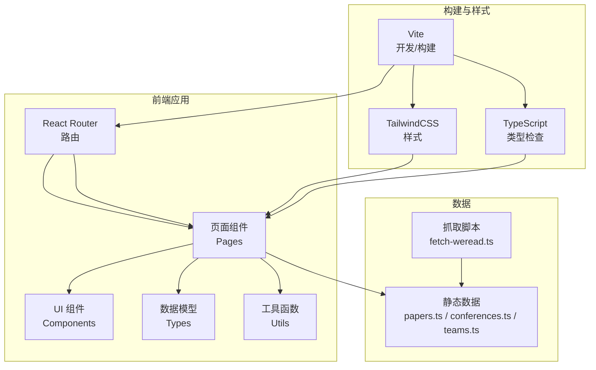
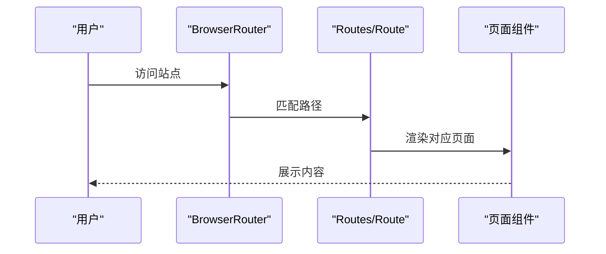
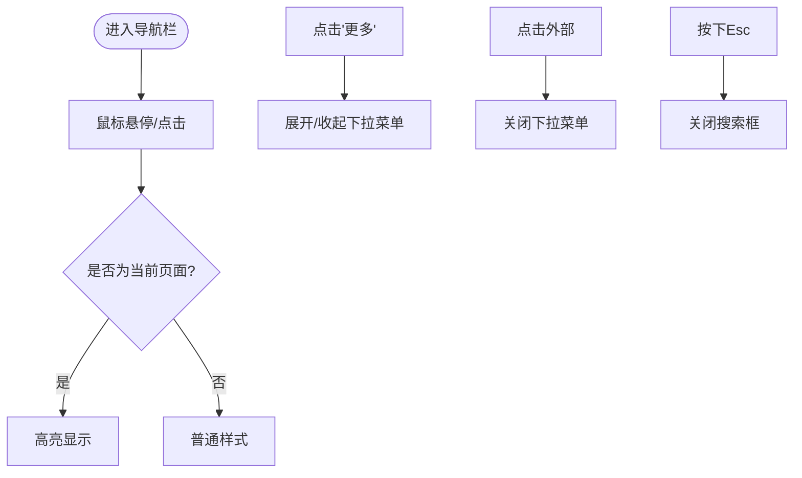
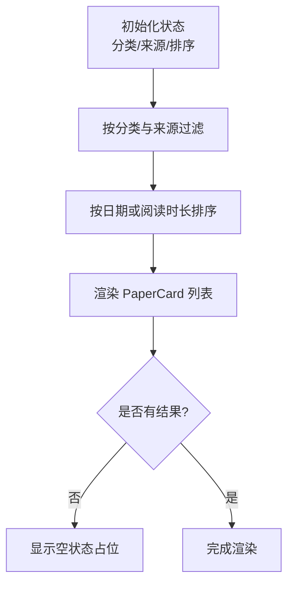
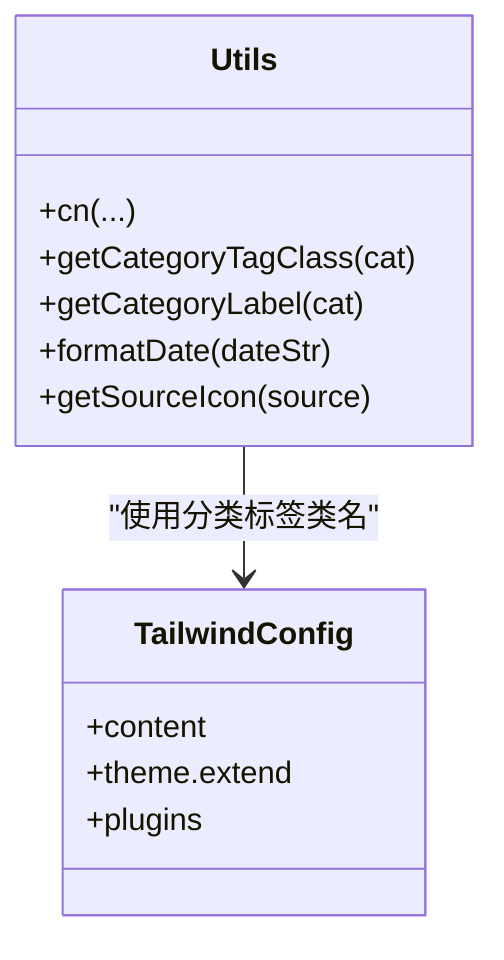
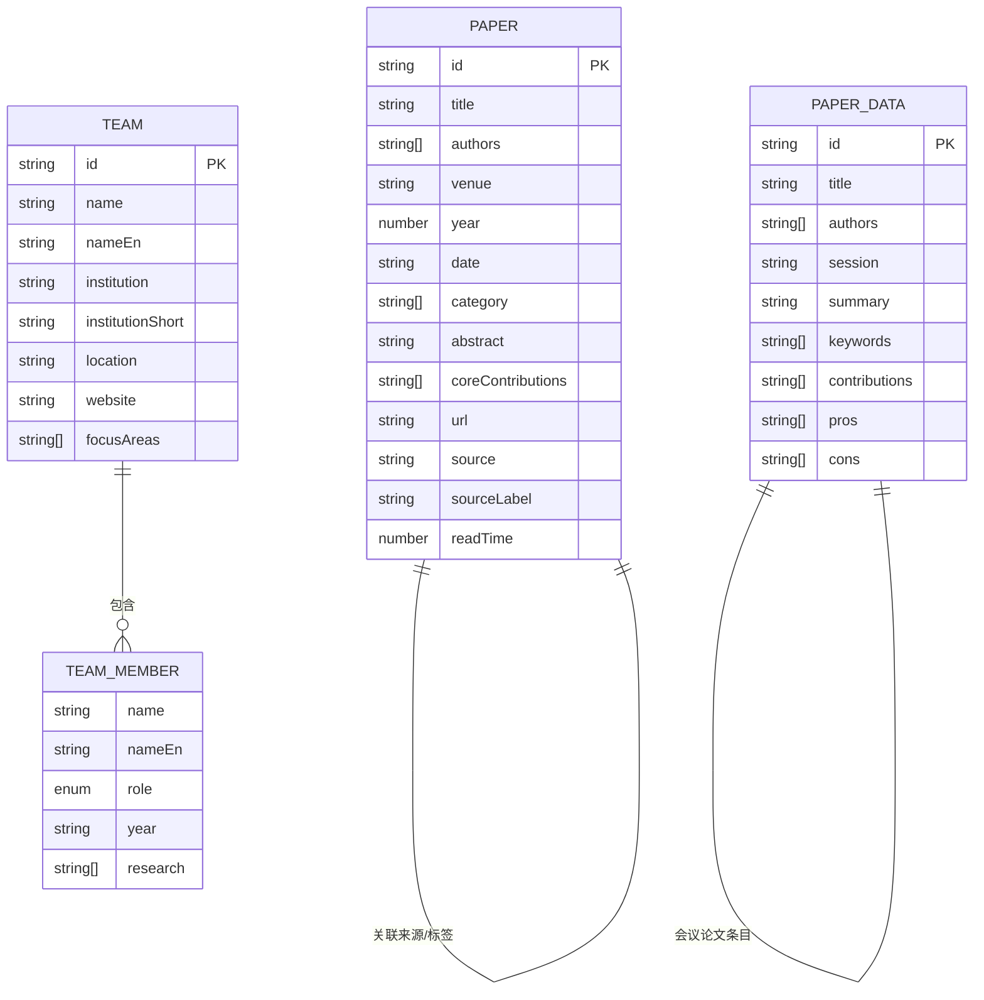
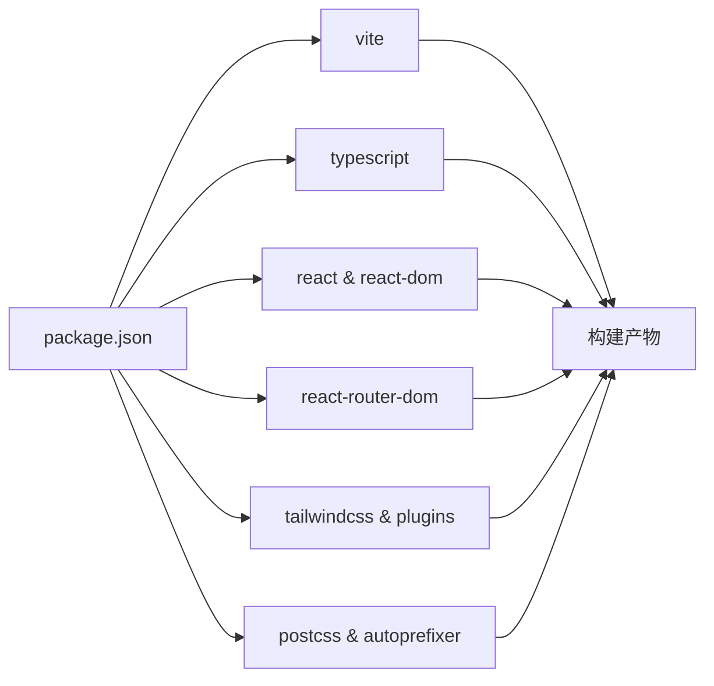

# 贡献指南

<cite>
**本文引用的文件**   
- [package.json](file://package.json)
- [vite.config.ts](file://vite.config.ts)
- [tailwind.config.ts](file://tailwind.config.ts)
- [tsconfig.json](file://tsconfig.json)
- [postcss.config.js](file://postcss.config.js)
- [src/App.tsx](file://src/App.tsx)
- [src/main.tsx](file://src/main.tsx)
- [src/components/Navbar.tsx](file://src/components/Navbar.tsx)
- [src/pages/Home.tsx](file://src/pages/Home.tsx)
- [src/lib/utils.ts](file://src/lib/utils.ts)
- [src/data/types.ts](file://src/data/types.ts)
- [src/data/papers.ts](file://src/data/papers.ts)
- [src/data/conferences.ts](file://src/data/conferences.ts)
- [src/data/teams.ts](file://src/data/teams.ts)
- [scripts/fetch-weread.ts](file://scripts/fetch-weread.ts)
</cite>

## 目录
1. [简介](#简介)
2. [项目结构](#项目结构)
3. [核心组件](#核心组件)
4. [架构总览](#架构总览)
5. [详细组件分析](#详细组件分析)
6. [依赖关系分析](#依赖关系分析)
7. [性能考虑](#性能考虑)
8. [故障排查指南](#故障排查指南)
9. [结论](#结论)
10. [附录](#附录)

## 简介
本指南面向希望参与 cs336 项目的贡献者，覆盖开发流程、代码规范、贡献方式、分支与 PR 规范、代码审查标准、测试与文档更新、新功能与 bug 修复流程、版本发布节奏、开发环境搭建、IDE 配置与调试工具使用，以及数据贡献（论文、团队、会议）的规范。目标是帮助新老贡献者快速上手并高质量协作。

## 项目结构
cs336 是一个基于 React + TypeScript + Vite + TailwindCSS 的前端项目，采用“按页面与数据模块”组织结构：
- 源码位于 src/，包含页面组件、UI 组件、数据模型与工具函数
- 数据位于 src/data/，包含论文、会议、团队等静态数据
- 构建与样式配置位于根目录的 package.json、vite.config.ts、tailwind.config.ts、tsconfig.json、postcss.config.js
- 脚本位于 scripts/，用于抓取外部数据（如微信读书）

**图表来源**
- [package.json:1-32](file://package.json#L1-L32)
- [vite.config.ts:1-13](file://vite.config.ts#L1-L13)
- [tsconfig.json:1-5](file://tsconfig.json#L1-L5)
- [postcss.config.js:1-7](file://postcss.config.js#L1-L7)
- [src/main.tsx:1-14](file://src/main.tsx#L1-L14)
- [src/App.tsx:1-45](file://src/App.tsx#L1-L45)
- [src/pages/Home.tsx:1-209](file://src/pages/Home.tsx#L1-L209)
- [src/lib/utils.ts:1-58](file://src/lib/utils.ts#L1-L58)
- [src/data/papers.ts:1-815](file://src/data/papers.ts#L1-L815)
- [src/data/conferences.ts:1-213](file://src/data/conferences.ts#L1-L213)
- [src/data/teams.ts:1-168](file://src/data/teams.ts#L1-L168)
- [scripts/fetch-weread.ts:1-206](file://scripts/fetch-weread.ts#L1-L206)

**章节来源**
- [package.json:1-32](file://package.json#L1-L32)
- [vite.config.ts:1-13](file://vite.config.ts#L1-L13)
- [tailwind.config.ts:1-104](file://tailwind.config.ts#L1-L104)
- [tsconfig.json:1-5](file://tsconfig.json#L1-L5)
- [postcss.config.js:1-7](file://postcss.config.js#L1-L7)
- [src/main.tsx:1-14](file://src/main.tsx#L1-L14)
- [src/App.tsx:1-45](file://src/App.tsx#L1-L45)
- [src/pages/Home.tsx:1-209](file://src/pages/Home.tsx#L1-L209)
- [src/lib/utils.ts:1-58](file://src/lib/utils.ts#L1-L58)
- [src/data/papers.ts:1-815](file://src/data/papers.ts#L1-L815)
- [src/data/conferences.ts:1-213](file://src/data/conferences.ts#L1-L213)
- [src/data/teams.ts:1-168](file://src/data/teams.ts#L1-L168)
- [scripts/fetch-weread.ts:1-206](file://scripts/fetch-weread.ts#L1-L206)

## 核心组件
- 页面与路由：src/App.tsx 定义路由与页面挂载；src/main.tsx 设置 BrowserRouter；src/pages/*.tsx 提供具体页面
- 导航栏：src/components/Navbar.tsx 提供主导航、下拉菜单与搜索入口
- 首页与筛选：src/pages/Home.tsx 提供论文列表、分类筛选、来源筛选与排序
- 工具函数：src/lib/utils.ts 提供类名合并、分类标签映射、格式化与图标映射
- 数据模型：src/data/types.ts 定义 Paper、BlogPost 等核心类型
- 数据源：src/data/papers.ts、src/data/conferences.ts、src/data/teams.ts 提供静态数据；scripts/fetch-weread.ts 提供抓取脚本

**章节来源**
- [src/App.tsx:1-45](file://src/App.tsx#L1-L45)
- [src/main.tsx:1-14](file://src/main.tsx#L1-L14)
- [src/components/Navbar.tsx:1-143](file://src/components/Navbar.tsx#L1-L143)
- [src/pages/Home.tsx:1-209](file://src/pages/Home.tsx#L1-L209)
- [src/lib/utils.ts:1-58](file://src/lib/utils.ts#L1-L58)
- [src/data/types.ts:1-49](file://src/data/types.ts#L1-L49)
- [src/data/papers.ts:1-815](file://src/data/papers.ts#L1-L815)
- [src/data/conferences.ts:1-213](file://src/data/conferences.ts#L1-L213)
- [src/data/teams.ts:1-168](file://src/data/teams.ts#L1-L168)
- [scripts/fetch-weread.ts:1-206](file://scripts/fetch-weread.ts#L1-L206)

## 架构总览
前端采用单页应用（SPA）架构，基于 React Router 管理页面路由，TailwindCSS 提供样式基础，Vite 提供开发与构建能力。数据通过静态文件与脚本抓取注入，页面组件负责渲染与交互。

**图表来源**
- [src/App.tsx:1-45](file://src/App.tsx#L1-L45)
- [src/main.tsx:1-14](file://src/main.tsx#L1-L14)
- [vite.config.ts:1-13](file://vite.config.ts#L1-L13)
- [tailwind.config.ts:1-104](file://tailwind.config.ts#L1-L104)
- [tsconfig.json:1-5](file://tsconfig.json#L1-L5)
- [src/data/papers.ts:1-815](file://src/data/papers.ts#L1-L815)
- [src/data/conferences.ts:1-213](file://src/data/conferences.ts#L1-L213)
- [src/data/teams.ts:1-168](file://src/data/teams.ts#L1-L168)
- [scripts/fetch-weread.ts:1-206](file://scripts/fetch-weread.ts#L1-L206)

## 详细组件分析

### 路由与页面组件
- 路由定义集中在 src/App.tsx，包含首页、论文详情、专题深度解析、会议页面、开源项目、团队、归档、日常与存档等
- 页面组件通过 React Router 动态加载，页面路径与组件一一对应
- 入口文件 src/main.tsx 使用 BrowserRouter 包裹应用

**图表来源**
- [src/main.tsx:1-14](file://src/main.tsx#L1-L14)
- [src/App.tsx:1-45](file://src/App.tsx#L1-L45)

**章节来源**
- [src/App.tsx:1-45](file://src/App.tsx#L1-L45)
- [src/main.tsx:1-14](file://src/main.tsx#L1-L14)

### 导航栏与交互
- 导航栏组件提供主导航项与“更多”下拉菜单，支持点击外部关闭、键盘 Esc 关闭搜索
- 通过 useLocation 判断当前激活项，动态高亮

**图表来源**
- [src/components/Navbar.tsx:1-143](file://src/components/Navbar.tsx#L1-L143)

**章节来源**
- [src/components/Navbar.tsx:1-143](file://src/components/Navbar.tsx#L1-L143)

### 首页筛选与排序
- 首页支持分类筛选、来源筛选（全部/DBLP/arXiv/公众号）、排序（按日期/阅读时长）
- 使用 useMemo 进行过滤与排序，保证性能与响应性

**图表来源**
- [src/pages/Home.tsx:1-209](file://src/pages/Home.tsx#L1-L209)
- [src/data/papers.ts:1-815](file://src/data/papers.ts#L1-L815)

**章节来源**
- [src/pages/Home.tsx:1-209](file://src/pages/Home.tsx#L1-L209)
- [src/data/papers.ts:1-815](file://src/data/papers.ts#L1-L815)

### 工具函数与样式
- 工具函数提供分类标签样式映射、分类中文标签、日期格式化、来源图标映射
- TailwindCSS 通过 tailwind.config.ts 配置主题、动画与插件，PostCSS 自动前缀与 Tailwind 注入

**图表来源**
- [src/lib/utils.ts:1-58](file://src/lib/utils.ts#L1-L58)
- [tailwind.config.ts:1-104](file://tailwind.config.ts#L1-L104)

**章节来源**
- [src/lib/utils.ts:1-58](file://src/lib/utils.ts#L1-L58)
- [tailwind.config.ts:1-104](file://tailwind.config.ts#L1-L104)
- [postcss.config.js:1-7](file://postcss.config.js#L1-L7)

### 数据模型与静态数据
- 类型定义集中于 src/data/types.ts，包含 Paper、BlogPost、Category 等
- 论文数据、会议数据、团队数据分别位于 papers.ts、conferences.ts、teams.ts
- 抓取脚本 scripts/fetch-weread.ts 用于从微信读书抓取公众号文章并输出 JSON

**图表来源**
- [src/data/types.ts:1-49](file://src/data/types.ts#L1-L49)
- [src/data/papers.ts:1-815](file://src/data/papers.ts#L1-L815)
- [src/data/conferences.ts:1-213](file://src/data/conferences.ts#L1-L213)
- [src/data/teams.ts:1-168](file://src/data/teams.ts#L1-L168)

**章节来源**
- [src/data/types.ts:1-49](file://src/data/types.ts#L1-L49)
- [src/data/papers.ts:1-815](file://src/data/papers.ts#L1-L815)
- [src/data/conferences.ts:1-213](file://src/data/conferences.ts#L1-L213)
- [src/data/teams.ts:1-168](file://src/data/teams.ts#L1-L168)
- [scripts/fetch-weread.ts:1-206](file://scripts/fetch-weread.ts#L1-L206)

## 依赖关系分析
- 构建与开发：Vite 提供开发服务器与打包；TypeScript 提供类型检查；TailwindCSS 与 PostCSS 提供样式管线
- 运行时依赖：React、React DOM、React Router、Tailwind 相关工具与图标库
- 开发依赖：@vitejs/plugin-react、tailwindcss、autoprefixer、typescript、vite

**图表来源**
- [package.json:1-32](file://package.json#L1-L32)
- [vite.config.ts:1-13](file://vite.config.ts#L1-L13)
- [tailwind.config.ts:1-104](file://tailwind.config.ts#L1-L104)
- [postcss.config.js:1-7](file://postcss.config.js#L1-L7)
- [tsconfig.json:1-5](file://tsconfig.json#L1-L5)

**章节来源**
- [package.json:1-32](file://package.json#L1-L32)
- [vite.config.ts:1-13](file://vite.config.ts#L1-L13)
- [tailwind.config.ts:1-104](file://tailwind.config.ts#L1-L104)
- [postcss.config.js:1-7](file://postcss.config.js#L1-L7)
- [tsconfig.json:1-5](file://tsconfig.json#L1-L5)

## 性能考虑
- 首页筛选与排序使用 useMemo，避免重复计算
- 图片懒加载与骨架屏：Hero 区域图片设置 eager，卡片图片使用懒加载与过渡动画
- 路由按需加载页面组件，减少首屏体积
- TailwindCSS 通过 content 白名单与插件优化，避免未使用样式进入产物

**章节来源**
- [src/pages/Home.tsx:1-209](file://src/pages/Home.tsx#L1-L209)
- [tailwind.config.ts:1-104](file://tailwind.config.ts#L1-L104)

## 故障排查指南
- 开发启动失败
  - 检查 Node.js 与包管理器版本，确保依赖安装完整
  - 清理 node_modules 与缓存后重装依赖
- 构建报错
  - 检查 TypeScript 配置与类型定义是否正确
  - 确认 Vite 配置与别名 @ 指向 src
- 样式异常
  - 检查 Tailwind 配置与 content 路径
  - 确认 PostCSS 插件顺序与 TailwindCSS 版本兼容
- 页面空白或路由不生效
  - 确认 BrowserRouter 包裹与路由定义一致
  - 检查页面组件导出与路径拼写

**章节来源**
- [package.json:1-32](file://package.json#L1-L32)
- [vite.config.ts:1-13](file://vite.config.ts#L1-L13)
- [tailwind.config.ts:1-104](file://tailwind.config.ts#L1-L104)
- [postcss.config.js:1-7](file://postcss.config.js#L1-L7)
- [src/main.tsx:1-14](file://src/main.tsx#L1-L14)
- [src/App.tsx:1-45](file://src/App.tsx#L1-L45)

## 结论
本指南总结了 cs336 项目的开发流程、代码规范与贡献方式。遵循本文档可确保贡献过程顺畅、代码质量稳定、协作高效。请在提交任何变更前，先阅读并遵守本指南的规范与流程。

## 附录

### 开发环境搭建
- 系统要求：Node.js 与包管理器（建议使用 npm 或 pnpm）
- 步骤
  - 安装依赖：使用包管理器安装项目依赖
  - 启动开发：运行开发服务器
  - 构建与预览：构建生产包并本地预览
- IDE 建议
  - VS Code + TypeScript Vue/React 插件
  - Tailwind IntelliSense、ESLint、Prettier 插件
- 调试工具
  - 浏览器开发者工具
  - React DevTools（可选）

**章节来源**
- [package.json:1-32](file://package.json#L1-L32)
- [vite.config.ts:1-13](file://vite.config.ts#L1-L13)
- [tsconfig.json:1-5](file://tsconfig.json#L1-L5)

### Git 工作流程与分支策略
- 分支策略
  - main：稳定发布分支
  - develop：开发集成分支
  - feature/<topic>：功能开发分支
  - hotfix/<issue>：紧急修复分支
- 提交规范
  - 标准格式：type(scope): subject
  - 示例：feat(contrib): 添加贡献指南模板
- 合并与 PR
  - PR 需要至少一名维护者审查
  - 合并前确保 CI 通过与无冲突

[本节为通用流程说明，不直接分析具体文件，故无“章节来源”]

### Pull Request 规范
- 标题清晰描述变更内容
- 描述中包含动机、改动范围与风险
- 附带截图或链接（如涉及 UI/路由）
- 通过代码审查与测试后方可合并

[本节为通用流程说明，不直接分析具体文件，故无“章节来源”]

### 代码审查标准
- 代码风格：遵循项目 ESLint/Prettier 配置
- 可读性：函数/变量命名清晰，注释必要
- 性能：避免不必要的重渲染与计算
- 兼容性：确保浏览器与依赖版本兼容

[本节为通用流程说明，不直接分析具体文件，故无“章节来源”]

### 测试要求
- 单元测试：针对工具函数与纯函数
- 集成测试：页面组件渲染与交互
- 端到端测试：关键用户流程（可选）

[本节为通用流程说明，不直接分析具体文件，故无“章节来源”]

### 文档更新规范
- 新增/修改页面：同步更新路由与导航
- 数据更新：更新对应数据文件并校验渲染
- README/贡献指南：按需更新

**章节来源**
- [src/App.tsx:1-45](file://src/App.tsx#L1-L45)
- [src/components/Navbar.tsx:1-143](file://src/components/Navbar.tsx#L1-L143)
- [src/data/papers.ts:1-815](file://src/data/papers.ts#L1-L815)
- [src/data/conferences.ts:1-213](file://src/data/conferences.ts#L1-L213)
- [src/data/teams.ts:1-168](file://src/data/teams.ts#L1-L168)

### 新功能开发流程
- 需求评审：在 issue 中明确目标与验收
- 设计：确定页面/组件结构与数据流
- 开发：feature/<topic> 分支开发
- 测试：编写单元/集成测试
- 文档：更新贡献指南与页面说明
- PR：发起 PR 并等待审查

[本节为通用流程说明，不直接分析具体文件，故无“章节来源”]

### Bug 修复标准
- 复现步骤：在 issue 中提供最小复现
- 修复：定位问题并最小化改动
- 验证：本地与测试环境验证
- 回归：确认无副作用

[本节为通用流程说明，不直接分析具体文件，故无“章节来源”]

### 版本发布周期
- 频率：按需发布，建议每月一次稳定发布
- 内容：修复累积、小功能与文档更新
- 流程：develop 合并 main，打 Tag，生成 Release Notes

[本节为通用流程说明，不直接分析具体文件，故无“章节来源”]

### 贡献者行为准则
- 尊重与包容：营造开放友好的社区氛围
- 建设性反馈：提供建设性意见与帮助
- 遵守法律与道德：不传播不当内容

[本节为通用流程说明，不直接分析具体文件，故无“章节来源”]

### 沟通渠道与社区参与
- GitHub Issues：功能请求与缺陷报告
- Discussions：想法交流与方案讨论
- 社区活动：会议与分享

[本节为通用流程说明，不直接分析具体文件，故无“章节来源”]

### 数据贡献规范

#### 论文数据添加
- 数据文件：src/data/papers.ts
- 字段要求：严格遵循 src/data/types.ts 中的 Paper 接口
- 来源标注：source/sourceLabel 与 url 必填
- 新文章标记：isNew 字段用于首页“新文章”标识
- 示例路径：[论文数据示例:1-815](file://src/data/papers.ts#L1-L815)

**章节来源**
- [src/data/types.ts:1-49](file://src/data/types.ts#L1-L49)
- [src/data/papers.ts:1-815](file://src/data/papers.ts#L1-L815)

#### 会议内容补充
- 数据文件：src/data/conferences.ts
- 字段要求：遵循 PaperData 接口
- 会议来源：osdi2025Papers/atc2024Papers
- 示例路径：[会议数据示例:1-213](file://src/data/conferences.ts#L1-L213)

**章节来源**
- [src/data/conferences.ts:1-213](file://src/data/conferences.ts#L1-L213)

#### 团队信息更新
- 数据文件：src/data/teams.ts
- 字段要求：遵循 TeamMember 与 ResearchTeam 接口
- 示例路径：[团队数据示例:1-168](file://src/data/teams.ts#L1-168)

**章节来源**
- [src/data/teams.ts:1-168](file://src/data/teams.ts#L1-L168)

#### 抓取脚本与外部数据
- 脚本：scripts/fetch-weread.ts
- 用途：抓取微信读书公众号文章并输出 JSON
- 注意：COOKIE 需替换为有效值，输出路径可按需调整
- 示例路径：[抓取脚本示例:1-206](file://scripts/fetch-weread.ts#L1-L206)

**章节来源**
- [scripts/fetch-weread.ts:1-206](file://scripts/fetch-weread.ts#L1-L206)