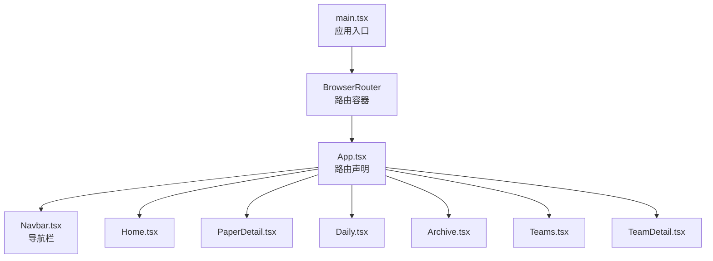
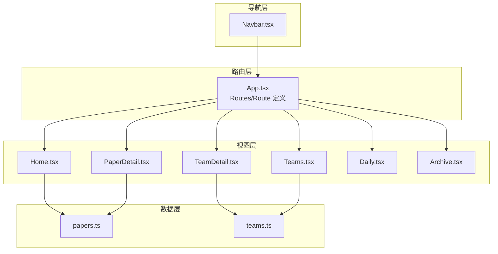
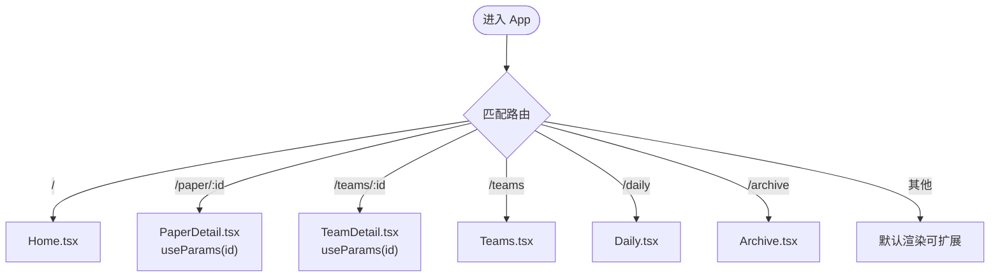
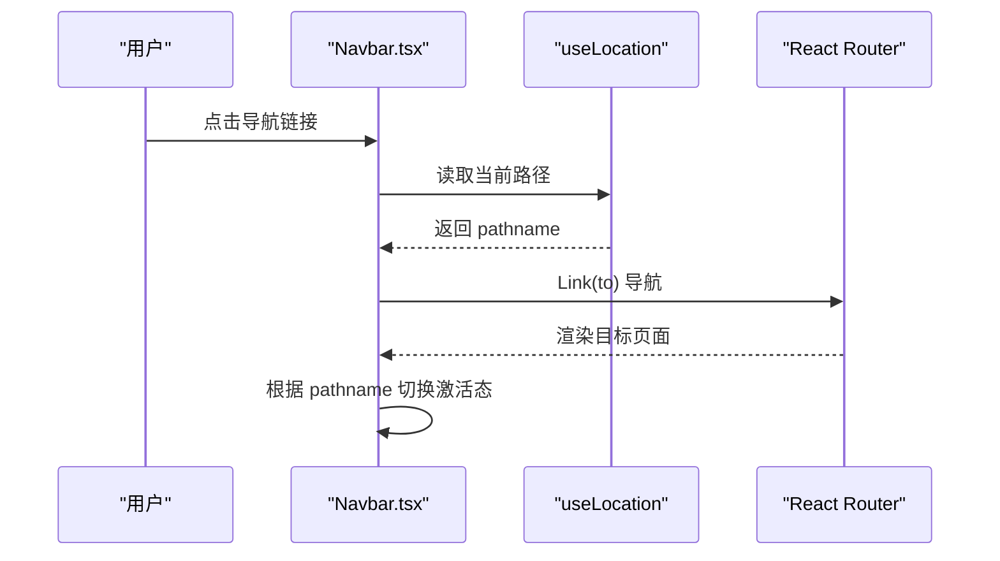
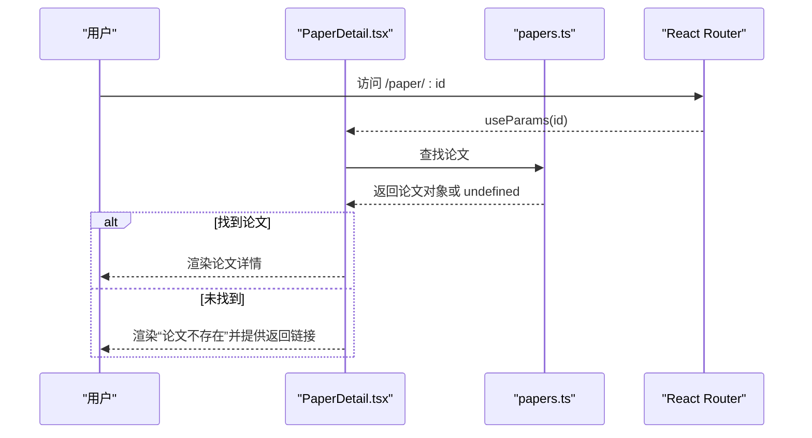
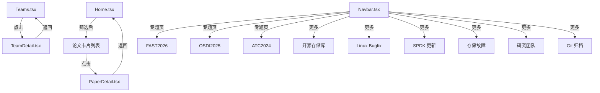
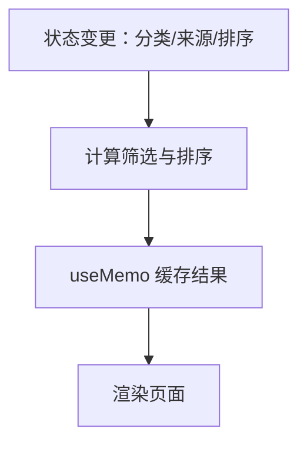
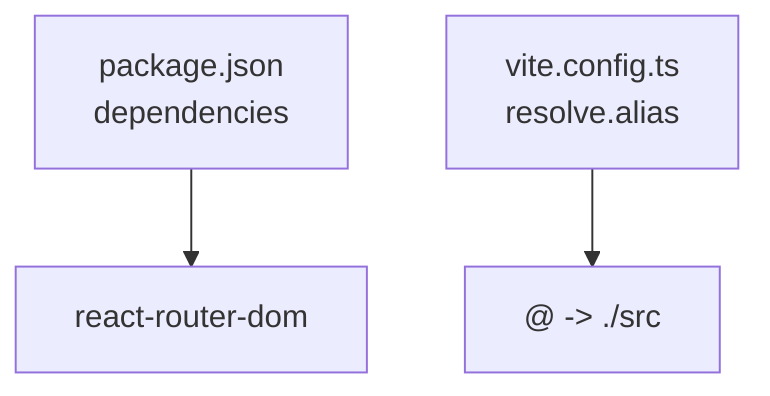

# 路由与导航

<cite>
**本文引用的文件**
- [src/main.tsx](file://src/main.tsx)
- [src/App.tsx](file://src/App.tsx)
- [src/components/Navbar.tsx](file://src/components/Navbar.tsx)
- [src/pages/Home.tsx](file://src/pages/Home.tsx)
- [src/pages/PaperDetail.tsx](file://src/pages/PaperDetail.tsx)
- [src/pages/TeamDetail.tsx](file://src/pages/TeamDetail.tsx)
- [src/pages/Teams.tsx](file://src/pages/Teams.tsx)
- [src/pages/Daily.tsx](file://src/pages/Daily.tsx)
- [src/pages/Archive.tsx](file://src/pages/Archive.tsx)
- [src/lib/utils.ts](file://src/lib/utils.ts)
- [src/data/papers.ts](file://src/data/papers.ts)
- [src/data/teams.ts](file://src/data/teams.ts)
- [vite.config.ts](file://vite.config.ts)
- [package.json](file://package.json)
</cite>

## 目录
1. [简介](#简介)
2. [项目结构](#项目结构)
3. [核心组件](#核心组件)
4. [架构总览](#架构总览)
5. [详细组件分析](#详细组件分析)
6. [依赖关系分析](#依赖关系分析)
7. [性能考量](#性能考量)
8. [故障排查指南](#故障排查指南)
9. [结论](#结论)
10. [附录](#附录)

## 简介
本文件系统性梳理 CS336 项目的路由与导航设计，围绕 React Router 的配置与使用展开，覆盖路由定义、动态路由参数、页面间导航逻辑、面包屑与状态保持、路由守卫与权限控制、URL 结构设计与 SEO 策略、性能优化与懒加载/预加载策略，以及导航组件复用与用户体验优化建议。文档面向不同技术背景读者，既提供高层概览，也给出代码级映射与可视化图表。

## 项目结构
CS336 使用 Vite + React + React Router v6（v7.1.1）搭建前端应用，采用约定式路由组织页面与导航。入口在 main.tsx 中包裹 BrowserRouter，App.tsx 统一声明 Routes 与 Route，页面组件位于 src/pages，导航组件位于 src/components。

**图表来源**
- [src/main.tsx:1-14](file://src/main.tsx#L1-L14)
- [src/App.tsx:1-45](file://src/App.tsx#L1-L45)
- [src/components/Navbar.tsx:1-143](file://src/components/Navbar.tsx#L1-L143)

**章节来源**
- [src/main.tsx:1-14](file://src/main.tsx#L1-L14)
- [src/App.tsx:1-45](file://src/App.tsx#L1-L45)
- [vite.config.ts:1-13](file://vite.config.ts#L1-L13)

## 核心组件
- 路由容器与入口
  - main.tsx 使用 BrowserRouter 包裹应用，确保所有组件可使用路由能力。
- 路由声明与页面映射
  - App.tsx 通过 Routes/Route 定义页面路由，包含首页、论文详情、团队页、每日更新、归档等。
- 导航与面包屑
  - Navbar.tsx 提供主导航与“更多”下拉菜单，使用 useLocation 判断激活状态；页面内部通过 Link 实现跨页导航。
- 动态路由参数
  - 论文详情与团队详情使用动态段（:id）传递标识符，页面通过 useParams 获取参数并渲染对应内容。
- 页面状态与筛选
  - Home.tsx 维护分类、来源、排序等本地状态；Daily.tsx 基于数据源分组展示；TeamDetail.tsx 将团队论文按年份聚合。

**章节来源**
- [src/main.tsx:1-14](file://src/main.tsx#L1-L14)
- [src/App.tsx:19-42](file://src/App.tsx#L19-L42)
- [src/components/Navbar.tsx:22-42](file://src/components/Navbar.tsx#L22-L42)
- [src/pages/PaperDetail.tsx:7-21](file://src/pages/PaperDetail.tsx#L7-L21)
- [src/pages/TeamDetail.tsx:6-20](file://src/pages/TeamDetail.tsx#L6-L20)
- [src/pages/Home.tsx:15-35](file://src/pages/Home.tsx#L15-L35)
- [src/pages/Daily.tsx:17-18](file://src/pages/Daily.tsx#L17-L18)

## 架构总览
CS336 的路由体系采用“集中声明 + 组件化导航”的模式：
- 路由声明集中在 App.tsx，便于统一维护与扩展。
- 导航组件 Navbar.tsx 通过 Link 与 useLocation 实现导航与激活态样式。
- 页面组件通过 useParams 读取动态参数，通过 Link 实现跨页面跳转。
- 数据层由 src/data/* 提供，页面组件消费数据并渲染。

**图表来源**
- [src/App.tsx:23-39](file://src/App.tsx#L23-L39)
- [src/components/Navbar.tsx:56-115](file://src/components/Navbar.tsx#L56-L115)
- [src/pages/Home.tsx:1-209](file://src/pages/Home.tsx#L1-L209)
- [src/pages/PaperDetail.tsx:1-151](file://src/pages/PaperDetail.tsx#L1-L151)
- [src/pages/TeamDetail.tsx:1-194](file://src/pages/TeamDetail.tsx#L1-L194)
- [src/pages/Teams.tsx:1-134](file://src/pages/Teams.tsx#L1-L134)
- [src/pages/Daily.tsx:1-107](file://src/pages/Daily.tsx#L1-L107)
- [src/pages/Archive.tsx:1-130](file://src/pages/Archive.tsx#L1-L130)
- [src/data/papers.ts:1-815](file://src/data/papers.ts#L1-L815)
- [src/data/teams.ts:1-168](file://src/data/teams.ts#L1-L168)

## 详细组件分析

### 路由声明与页面映射
- 静态路由
  - 根路径、会议专题页、开源/故障/归档等静态页面均以 path 明确声明。
- 动态路由
  - 论文详情使用 “/paper/:id”，团队详情使用 “/teams/:id”，通过 useParams 读取参数。
- 嵌套路由
  - 当前项目未使用 React Router 的嵌套路由语法（如 Outlet），页面间通过 Link 跳转实现导航。

**图表来源**
- [src/App.tsx:23-39](file://src/App.tsx#L23-L39)
- [src/pages/PaperDetail.tsx:7-8](file://src/pages/PaperDetail.tsx#L7-L8)
- [src/pages/TeamDetail.tsx:6-8](file://src/pages/TeamDetail.tsx#L6-L8)

**章节来源**
- [src/App.tsx:23-39](file://src/App.tsx#L23-L39)
- [src/pages/PaperDetail.tsx:7-8](file://src/pages/PaperDetail.tsx#L7-L8)
- [src/pages/TeamDetail.tsx:6-8](file://src/pages/TeamDetail.tsx#L6-L8)

### 导航组件与激活态
- Navbar.tsx 使用 Link 组件实现导航，结合 useLocation 判断当前路径，动态设置激活态样式。
- “更多”下拉菜单通过状态控制显示/隐藏，并在点击菜单项后关闭下拉。
- 搜索框为可展开区域，点击按钮切换显示状态。

**图表来源**
- [src/components/Navbar.tsx:22-42](file://src/components/Navbar.tsx#L22-L42)
- [src/components/Navbar.tsx:76-115](file://src/components/Navbar.tsx#L76-L115)

**章节来源**
- [src/components/Navbar.tsx:22-42](file://src/components/Navbar.tsx#L22-L42)
- [src/components/Navbar.tsx:76-115](file://src/components/Navbar.tsx#L76-L115)

### 动态路由参数与页面渲染
- 论文详情页
  - 通过 useParams 获取 id，从 papers.ts 中查找对应论文并渲染；若不存在则提示并返回首页。
- 团队详情页
  - 通过 useParams 获取 id，从 teams.ts 中查找团队并渲染；若不存在则提示并返回团队列表。

**图表来源**
- [src/pages/PaperDetail.tsx:7-21](file://src/pages/PaperDetail.tsx#L7-L21)
- [src/data/papers.ts:1-815](file://src/data/papers.ts#L1-L815)

**章节来源**
- [src/pages/PaperDetail.tsx:7-21](file://src/pages/PaperDetail.tsx#L7-L21)
- [src/pages/TeamDetail.tsx:6-20](file://src/pages/TeamDetail.tsx#L6-L20)
- [src/data/papers.ts:1-815](file://src/data/papers.ts#L1-L815)
- [src/data/teams.ts:1-168](file://src/data/teams.ts#L1-L168)

### 页面间导航逻辑与面包屑
- 主页 Home.tsx 提供分类、来源、排序筛选，筛选结果通过 Link 跳转到论文详情页。
- 论文详情页提供“返回论文列表”链接。
- 团队列表页 Teams.tsx 提供团队卡片，点击进入团队详情页。
- 团队详情页提供“返回团队列表”链接。
- 导航栏 Navbar.tsx 通过 Link 实现跨专题页跳转，并根据当前路径设置激活态。

**图表来源**
- [src/pages/Home.tsx:194-198](file://src/pages/Home.tsx#L194-L198)
- [src/pages/PaperDetail.tsx:24-29](file://src/pages/PaperDetail.tsx#L24-L29)
- [src/pages/Teams.tsx:114-121](file://src/pages/Teams.tsx#L114-L121)
- [src/pages/TeamDetail.tsx:30-36](file://src/pages/TeamDetail.tsx#L30-L36)
- [src/components/Navbar.tsx:6-20](file://src/components/Navbar.tsx#L6-L20)

**章节来源**
- [src/pages/Home.tsx:194-198](file://src/pages/Home.tsx#L194-L198)
- [src/pages/PaperDetail.tsx:24-29](file://src/pages/PaperDetail.tsx#L24-L29)
- [src/pages/Teams.tsx:114-121](file://src/pages/Teams.tsx#L114-L121)
- [src/pages/TeamDetail.tsx:30-36](file://src/pages/TeamDetail.tsx#L30-L36)
- [src/components/Navbar.tsx:6-20](file://src/components/Navbar.tsx#L6-L20)

### 页面状态保持与筛选
- Home.tsx 使用 useMemo 对筛选后的论文列表进行稳定化处理，避免不必要的重渲染。
- 通过 useState 维护分类、来源、排序等状态，筛选条件变更时重新计算列表。
- Daily.tsx 将论文按日期分组，展示“今日”标记与时间线样式。

**图表来源**
- [src/pages/Home.tsx:15-35](file://src/pages/Home.tsx#L15-L35)
- [src/pages/Daily.tsx:7-18](file://src/pages/Daily.tsx#L7-L18)

**章节来源**
- [src/pages/Home.tsx:15-35](file://src/pages/Home.tsx#L15-L35)
- [src/pages/Daily.tsx:7-18](file://src/pages/Daily.tsx#L7-L18)

### 路由守卫、权限控制与访问限制
- 当前项目未实现路由守卫（如基于用户态的鉴权拦截）。
- 若需实现权限控制，可在以下位置扩展：
  - 在 App.tsx 的 Route 外层包裹自定义 Guard 组件，或在页面组件中使用 Navigate 进行前置跳转。
  - 结合用户登录状态（如 localStorage/sessionStorage 或 Context）判断是否允许访问特定路由。

[本节为通用指导，不直接分析具体文件，故不附“章节来源”]

### URL 结构设计原则与 SEO 策略
- URL 设计原则
  - 语义化：使用名词短语（如 /paper/:id、/teams/:id）表达资源。
  - 一致性：专题页采用动词短语（/fast2026、/osdi2025）保持风格统一。
  - 可读性：路径简洁清晰，避免深层嵌套。
- SEO 友好建议
  - 为关键页面补充静态 HTML（SSG）或服务端渲染（SSR）以改善首屏与爬虫抓取。
  - 为页面补充 meta 标签（title/description）与结构化数据（JSON-LD）。
  - 使用 React Helmet 或同等方案动态注入 SEO 元信息。
  - 生成站点地图与 robots.txt，合理配置爬虫行为。

[本节为通用指导，不直接分析具体文件，故不附“章节来源”]

### 性能优化、懒加载与预加载策略
- 懒加载（代码分割）
  - 将大型页面组件（如 TeamDetail、PaperDetail）拆分为独立模块，使用 React.lazy 与 Suspense 实现按需加载。
- 预加载（Preload）
  - 对用户即将访问的页面（如“更多”下拉中的热门专题）使用 Link 的 rel="prefetch" 或自定义预取策略。
- 路由级别优化
  - 合理拆分路由，避免单路由包含过多组件。
  - 使用 React.memo 与 useMemo 降低渲染成本。
- 构建与别名
  - Vite 已配置 @ 别名，减少相对路径书写成本，提升开发体验。

**章节来源**
- [vite.config.ts:7-11](file://vite.config.ts#L7-L11)
- [package.json:11-19](file://package.json#L11-L19)

### 导航组件复用与用户体验优化
- 复用方案
  - Navbar.tsx 可抽取为可配置菜单项数组，便于在不同页面复用同一导航结构。
  - 将激活态逻辑抽象为 Hook，减少重复代码。
- 用户体验优化
  - 为导航按钮添加过渡动画与高亮反馈。
  - 在长列表页面（如 Daily）提供滚动到顶部的快捷按钮。
  - 为搜索框提供键盘快捷键（如 ⌘K）与自动聚焦。

**章节来源**
- [src/components/Navbar.tsx:22-42](file://src/components/Navbar.tsx#L22-L42)
- [src/components/Navbar.tsx:128-139](file://src/components/Navbar.tsx#L128-L139)

## 依赖关系分析
- 运行时依赖
  - react-router-dom：提供路由容器、导航组件与参数解析。
- 构建与别名
  - Vite 配置 @ 别名指向 src，简化导入路径。
- 版本与兼容性
  - package.json 指定 react-router-dom ^7.1.1，确保与 React 18 生态兼容。

**图表来源**
- [package.json:11-19](file://package.json#L11-L19)
- [vite.config.ts:7-11](file://vite.config.ts#L7-L11)

**章节来源**
- [package.json:11-19](file://package.json#L11-L19)
- [vite.config.ts:7-11](file://vite.config.ts#L7-L11)

## 性能考量
- 渲染性能
  - Home.tsx 使用 useMemo 缓存筛选结果，减少重渲染。
  - Daily.tsx 对数据进行分组与排序，注意在大数据量时考虑分页或虚拟化。
- 路由性能
  - 将重型页面组件懒加载，减少首屏 JS 体积。
  - 避免在路由切换时进行昂贵的副作用（如网络请求）。
- SEO 与 SSR
  - 建议引入 SSG/SSR（如 Next.js 或 VitePress）以提升 SEO 与首屏性能。

[本节为通用指导，不直接分析具体文件，故不附“章节来源”]

## 故障排查指南
- 动态路由参数为空
  - 检查 useParams 是否正确使用，确认路径与参数名一致。
  - 在页面中添加兜底逻辑（如“资源不存在”提示）并提供返回链接。
- 导航激活态异常
  - 确认 useLocation 与 Link 的 to 值一致，避免路径大小写或尾斜杠差异。
- 路由不生效或 404
  - 确认 BrowserRouter 包裹了整个应用，且 App.tsx 中已声明相应 Route。
- 构建别名无效
  - 检查 vite.config.ts 中 alias 配置，确保 @ 正确指向 src。

**章节来源**
- [src/pages/PaperDetail.tsx:7-21](file://src/pages/PaperDetail.tsx#L7-L21)
- [src/pages/TeamDetail.tsx:6-20](file://src/pages/TeamDetail.tsx#L6-L20)
- [src/components/Navbar.tsx:22-42](file://src/components/Navbar.tsx#L22-L42)
- [src/main.tsx:7-12](file://src/main.tsx#L7-L12)
- [vite.config.ts:7-11](file://vite.config.ts#L7-L11)

## 结论
CS336 的路由与导航设计遵循“集中声明 + 组件化导航”的模式，结构清晰、易于扩展。通过 Link 与 useParams 实现页面间导航与动态参数读取，结合 Navbar 的激活态逻辑提供良好的用户体验。后续可在路由守卫、SEO 优化、懒加载与预加载等方面进一步完善，以提升安全性、可访问性与性能表现。

## 附录
- 关键数据类型与工具
  - utils.ts 提供分类标签类名映射、格式化与图标映射等工具函数，辅助页面渲染。
  - papers.ts/teams.ts 提供页面所需的数据源。

**章节来源**
- [src/lib/utils.ts:9-57](file://src/lib/utils.ts#L9-L57)
- [src/data/papers.ts:1-815](file://src/data/papers.ts#L1-L815)
- [src/data/teams.ts:1-168](file://src/data/teams.ts#L1-L168)