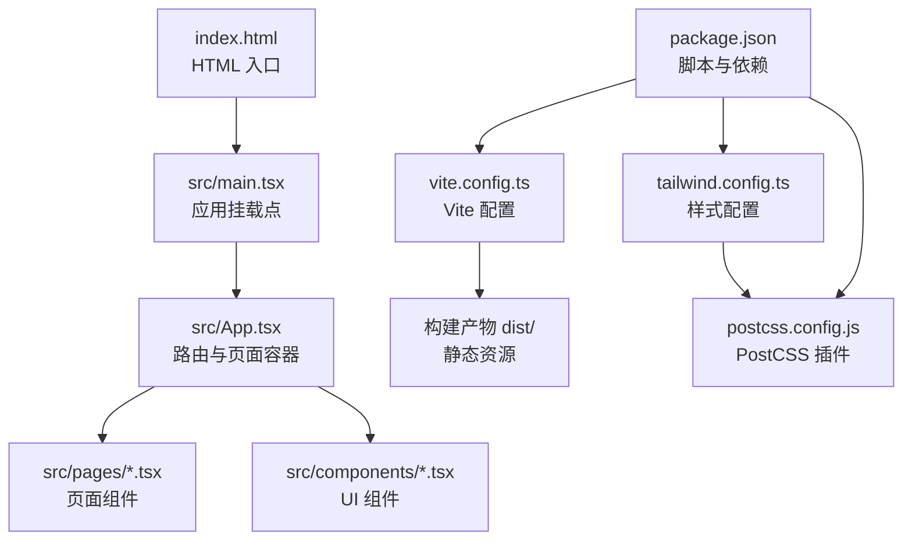
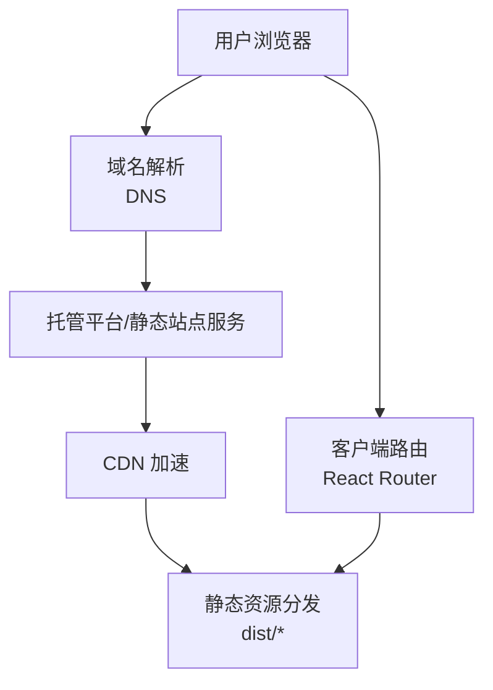
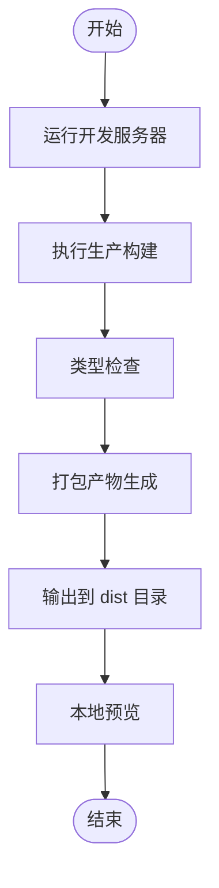
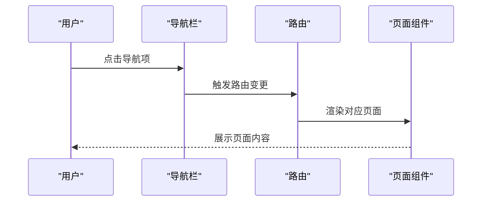
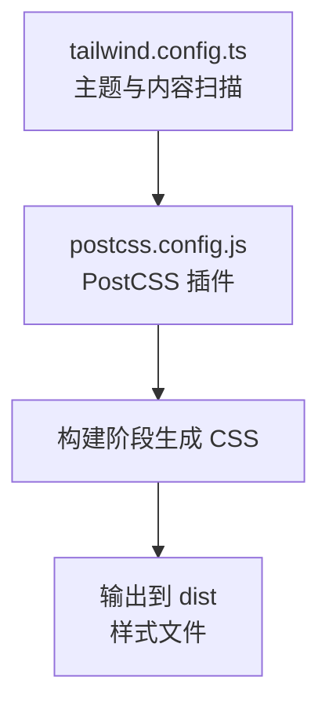
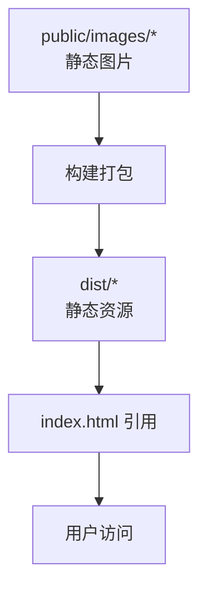
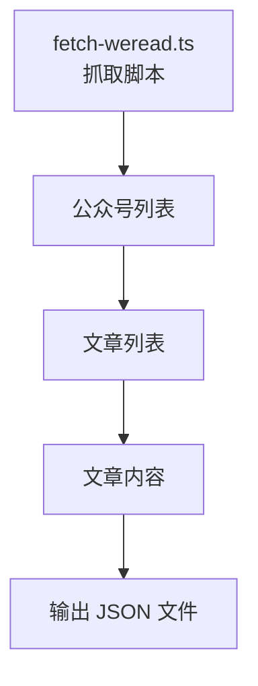
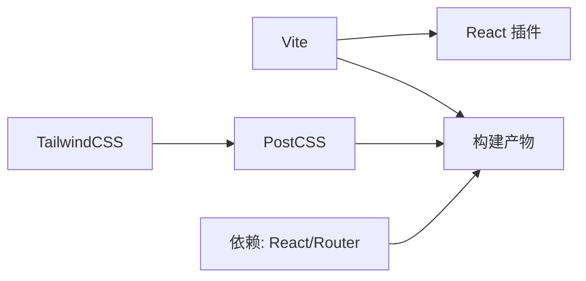

# 部署指南

<cite>
**本文引用的文件**
- [package.json](file://package.json)
- [vite.config.ts](file://vite.config.ts)
- [tailwind.config.ts](file://tailwind.config.ts)
- [postcss.config.js](file://postcss.config.js)
- [index.html](file://index.html)
- [src/main.tsx](file://src/main.tsx)
- [src/App.tsx](file://src/App.tsx)
- [src/components/Navbar.tsx](file://src/components/Navbar.tsx)
- [src/pages/Home.tsx](file://src/pages/Home.tsx)
- [src/pages/Daily.tsx](file://src/pages/Daily.tsx)
- [src/components/PaperCard.tsx](file://src/components/PaperCard.tsx)
- [scripts/fetch-weread.ts](file://scripts/fetch-weread.ts)
- [.gitignore](file://.gitignore)
</cite>

## 目录
1. [简介](#简介)
2. [项目结构](#项目结构)
3. [核心组件](#核心组件)
4. [架构总览](#架构总览)
5. [详细组件分析](#详细组件分析)
6. [依赖关系分析](#依赖关系分析)
7. [性能考虑](#性能考虑)
8. [故障排查指南](#故障排查指南)
9. [结论](#结论)
10. [附录](#附录)

## 简介
本指南面向 cs336 项目的生产环境部署，覆盖从构建到上线、从静态资源到域名与 HTTPS、从 CI/CD 到监控与运维的完整流程。项目基于 Vite + React + TailwindCSS，采用前端单页应用（SPA）模式，路由由客户端控制，适合托管在静态站点服务或反向代理后端。

## 项目结构
- 应用入口与路由：入口脚本负责挂载 React 应用；路由定义集中于应用根组件。
- 构建工具链：Vite 负责开发与打包，TailwindCSS 与 PostCSS 负责样式处理。
- 资源组织：public 目录用于放置无需构建处理的静态资源；源代码位于 src 下按功能模块组织。
- 数据与页面：页面组件与数据模型分离，页面组件通过路由进行导航。

**图表来源**
- [index.html](file://index.html)
- [src/main.tsx](file://src/main.tsx)
- [src/App.tsx](file://src/App.tsx)
- [vite.config.ts](file://vite.config.ts)
- [tailwind.config.ts](file://tailwind.config.ts)
- [postcss.config.js](file://postcss.config.js)
- [package.json](file://package.json)

**章节来源**
- [index.html](file://index.html)
- [src/main.tsx](file://src/main.tsx)
- [src/App.tsx](file://src/App.tsx)
- [vite.config.ts](file://vite.config.ts)
- [tailwind.config.ts](file://tailwind.config.ts)
- [postcss.config.js](file://postcss.config.js)
- [package.json](file://package.json)

## 核心组件
- 构建与打包
  - 使用 Vite 进行开发与生产构建，支持 TypeScript 与 React。
  - 构建脚本在 package.json 中定义，先执行类型检查再进行打包。
- 样式体系
  - TailwindCSS 与 PostCSS 配合，内容扫描路径覆盖 HTML 与 TSX 文件。
- 路由与导航
  - 客户端路由由 React Router DOM 提供，页面组件通过路由进行切换。
- 静态资源
  - 图片等静态资源建议置于 public 或通过构建打包，确保生产环境可访问。

**章节来源**
- [package.json](file://package.json)
- [vite.config.ts](file://vite.config.ts)
- [tailwind.config.ts](file://tailwind.config.ts)
- [postcss.config.js](file://postcss.config.js)
- [src/App.tsx](file://src/App.tsx)
- [src/main.tsx](file://src/main.tsx)

## 架构总览
前端 SPA 架构，静态资源由 CDN 或托管平台分发，域名通过 DNS 解析指向托管地址，HTTPS 由托管方或前置证书服务提供。

[此图为概念性架构示意，不直接映射具体源码文件，故不提供图表来源]

## 详细组件分析

### 构建与打包流程
- 开发与预览
  - 开发：使用 Vite 开发服务器，热更新与快速启动。
  - 预览：本地预览生产构建产物，验证打包效果。
- 生产构建
  - 顺序：先执行类型检查，再进行打包，输出至默认 dist 目录。
  - 产物：JS/CSS/HTML 与静态资源，按 Vite 默认策略生成。

**图表来源**
- [package.json](file://package.json)
- [vite.config.ts](file://vite.config.ts)

**章节来源**
- [package.json](file://package.json)
- [vite.config.ts](file://vite.config.ts)

### 路由与页面导航
- 路由定义集中在应用根组件中，包含首页、专题页、归档页、团队页等。
- 页面组件通过路由参数进行详情页渲染，导航栏提供主导航与下拉菜单。

**图表来源**
- [src/App.tsx](file://src/App.tsx)
- [src/components/Navbar.tsx](file://src/components/Navbar.tsx)
- [src/pages/Home.tsx](file://src/pages/Home.tsx)

**章节来源**
- [src/App.tsx](file://src/App.tsx)
- [src/components/Navbar.tsx](file://src/components/Navbar.tsx)
- [src/pages/Home.tsx](file://src/pages/Home.tsx)

### 样式与主题
- Tailwind 配置启用暗色模式、字体与动画扩展，并声明内容扫描路径。
- PostCSS 通过插件链处理 CSS，保证构建一致性。

**图表来源**
- [tailwind.config.ts](file://tailwind.config.ts)
- [postcss.config.js](file://postcss.config.js)

**章节来源**
- [tailwind.config.ts](file://tailwind.config.ts)
- [postcss.config.js](file://postcss.config.js)

### 静态资源与图片
- 首屏图片与专题图片通过相对路径引用，需确保构建后仍可正确访问。
- 建议将图片放入 public 或通过构建打包，避免运行时 404。

**图表来源**
- [index.html](file://index.html)
- [src/pages/Home.tsx](file://src/pages/Home.tsx)

**章节来源**
- [index.html](file://index.html)
- [src/pages/Home.tsx](file://src/pages/Home.tsx)

### 数据与内容抓取脚本
- 脚本用于抓取指定公众号文章列表与内容，便于离线或缓存使用。
- 注意：该脚本仅用于数据采集，不参与生产构建与运行。

**图表来源**
- [scripts/fetch-weread.ts](file://scripts/fetch-weread.ts)

**章节来源**
- [scripts/fetch-weread.ts](file://scripts/fetch-weread.ts)

## 依赖关系分析
- 构建工具链
  - Vite 作为核心构建工具，配合 React 插件与路径别名。
  - TailwindCSS 与 PostCSS 作为样式管线。
- 运行时依赖
  - React、React DOM、React Router DOM 提供视图与路由能力。
- 开发依赖
  - TypeScript、Vite、TailwindCSS、PostCSS 及相关插件。

**图表来源**
- [package.json](file://package.json)
- [vite.config.ts](file://vite.config.ts)
- [tailwind.config.ts](file://tailwind.config.ts)
- [postcss.config.js](file://postcss.config.js)

**章节来源**
- [package.json](file://package.json)
- [vite.config.ts](file://vite.config.ts)
- [tailwind.config.ts](file://tailwind.config.ts)
- [postcss.config.js](file://postcss.config.js)

## 性能考虑
- 构建优化
  - 合理拆分包与懒加载页面组件，减少首屏体积。
  - 启用压缩与资源内联策略，结合 CDN 缓存。
- 样式优化
  - Tailwind 内容扫描仅针对实际使用的文件，避免生成冗余样式。
- 资源优化
  - 图片采用现代格式与合适尺寸，开启懒加载与占位图。
- 路由与导航
  - 客户端路由切换应避免不必要的重渲染，合理使用 memo 化与状态管理。

[本节为通用性能建议，不直接分析具体源码文件，故不提供章节来源]

## 故障排查指南
- 构建失败
  - 检查类型错误与语法问题，确保类型检查通过后再打包。
  - 确认 Node 版本满足 esbuild 等工具要求。
- 路由 404
  - 在静态托管平台启用“回退到 index.html”或类似规则，确保 SPA 路由正常工作。
- 样式异常
  - 确认 Tailwind 内容扫描路径包含实际使用的文件，重新构建。
- 静态资源 404
  - 检查 public 目录下的资源是否被正确复制到 dist，或改为构建打包方式。
- 预览与生产差异
  - 使用本地预览命令验证生产构建效果，提前发现潜在问题。

**章节来源**
- [package.json](file://package.json)
- [tailwind.config.ts](file://tailwind.config.ts)
- [.gitignore](file://.gitignore)

## 结论
本指南提供了 cs336 项目从构建到上线的完整部署思路：以 Vite 为核心构建工具，结合 TailwindCSS 样式体系与 React 路由，通过静态托管平台或反向代理完成上线。建议在生产环境中启用 HTTPS、CDN 加速与健康检查，并建立完善的 CI/CD 流水线与监控告警机制，持续保障可用性与性能。

[本节为总结性内容，不直接分析具体源码文件，故不提供章节来源]

## 附录

### A. 生产环境构建与部署清单
- 准备工作
  - 确保 Node.js 版本满足构建工具要求。
  - 完成本地预览，确认路由与静态资源均正常。
- 构建产物
  - 生成 dist 目录，包含 HTML、JS、CSS 与静态资源。
- 部署位置
  - 将 dist 目录上传至静态托管平台或部署到反向代理后端。
- 路由回退
  - 在托管平台启用“回退到 index.html”，确保 SPA 路由生效。

**章节来源**
- [package.json](file://package.json)
- [index.html](file://index.html)

### B. 域名与 HTTPS 配置
- 域名解析
  - 将域名 A/AAAA 记录指向托管平台提供的 IP 或 CNAME。
- HTTPS
  - 使用托管平台提供的免费证书或前置证书服务，确保全站 HTTPS。
- CDN 加速
  - 在 CDN 上开启静态资源缓存与压缩，提升全球访问速度。

[本节为通用配置建议，不直接分析具体源码文件，故不提供章节来源]

### C. CI/CD 流水线建议
- 触发条件
  - push 到主分支或发布标签触发构建与部署。
- 步骤建议
  - 安装依赖 → 类型检查 → 构建 → 上传制品 → 部署到目标环境 → 健康检查。
- 自动化版本管理
  - 使用语义化版本号与发布标签，结合变更日志自动化产出。

[本节为通用流程建议，不直接分析具体源码文件，故不提供章节来源]

### D. 监控与日志
- 性能监控
  - 关注首屏时间、交互延迟与资源体积，结合 CDN 指标优化。
- 错误追踪
  - 在生产环境启用错误上报，记录堆栈与上下文信息。
- 用户行为分析
  - 通过埋点统计页面访问、点击与转化，指导产品迭代。

[本节为通用运维建议，不直接分析具体源码文件，故不提供章节来源]