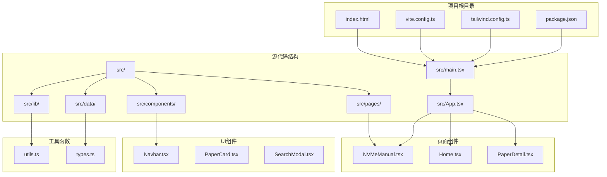
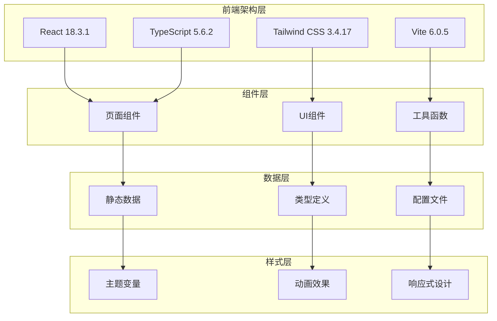
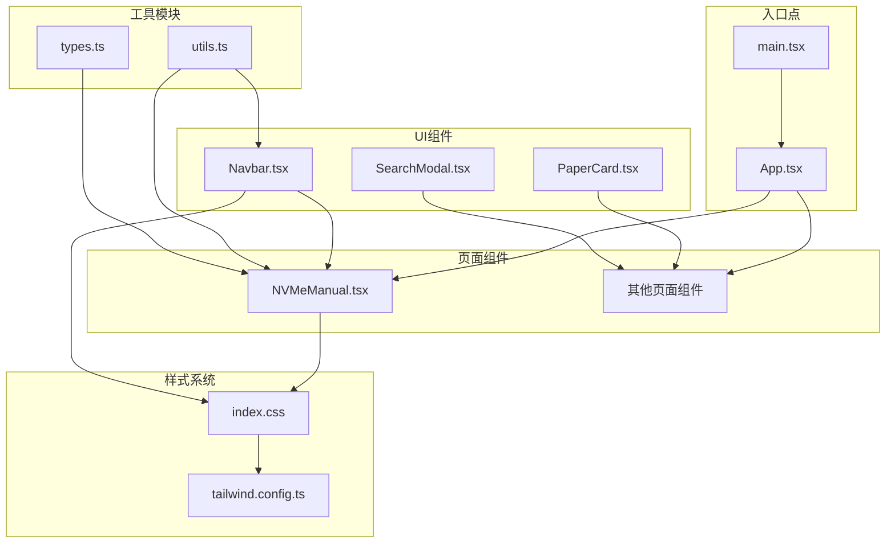

# NVMe协议手册

<cite>
**本文档引用的文件**
- [NVMeManual.tsx](file://src/pages/NVMeManual.tsx)
- [types.ts](file://src/data/types.ts)
- [utils.ts](file://src/lib/utils.ts)
- [Navbar.tsx](file://src/components/Navbar.tsx)
- [App.tsx](file://src/App.tsx)
- [main.tsx](file://src/main.tsx)
- [index.css](file://src/index.css)
- [tailwind.config.ts](file://tailwind.config.ts)
- [vite.config.ts](file://vite.config.ts)
- [package.json](file://package.json)
- [index.html](file://index.html)
</cite>

## 更新摘要
**所做更改**
- 更新了项目结构和架构概览，反映从单一Opcode查询工具到综合学习平台的转变
- 新增了三个教育标签（Opcode查询、64字节命令结构、PRP/SGL原理）的详细说明
- 增强了64字节SQE结构详解和PRP/SGL原理两大核心内容板块的描述
- 更新了导航栏和路由配置，支持新的页面结构
- 改进了样式系统和主题设计

## 目录
1. [简介](#简介)
2. [项目结构](#项目结构)
3. [核心组件](#核心组件)
4. [架构概览](#架构概览)
5. [详细组件分析](#详细组件分析)
6. [依赖关系分析](#依赖关系分析)
7. [性能考虑](#性能考虑)
8. [故障排除指南](#故障排除指南)
9. [结论](#结论)

## 简介

NVMe协议手册是一个基于React和TypeScript构建的**综合学习平台**，专门用于深入理解和学习NVMe（Non-Volatile Memory Express）协议。该项目已从单一的Opcode查询工具发展为包含三个教育标签的完整学习体系，提供从基础概念到高级特性的全面知识覆盖。

该手册的核心特色包括：
- **三重教育标签系统**：Opcode查询、64字节命令结构详解、PRP/SGL数据传输原理
- **完整的NVMe命令集参考**：从Admin Command Set到Key Value Command Set的全面覆盖
- **深度技术解析**：逐位级别的64字节Submission Queue Entry（SQE）结构分析
- **现代数据传输机制**：PRP（Physical Region Page）和SGL（Scatter Gather List）的对比深度解析
- **版本演进历史**：从NVMe 1.0到2.0的完整发展历程

## 项目结构

该项目采用现代化的前端技术栈，基于Vite构建工具和Tailwind CSS样式框架。整体项目结构清晰，遵循React组件化的最佳实践，并支持路由导航。

**图表来源**
- [main.tsx:1-14](file://src/main.tsx#L1-L14)
- [App.tsx:1-57](file://src/App.tsx#L1-L57)
- [NVMeManual.tsx:182-800](file://src/pages/NVMeManual.tsx#L182-L800)

**章节来源**
- [main.tsx:1-14](file://src/main.tsx#L1-L14)
- [App.tsx:1-57](file://src/App.tsx#L1-L57)
- [vite.config.ts:1-13](file://vite.config.ts#L1-L13)
- [tailwind.config.ts:1-104](file://tailwind.config.ts#L1-L104)

## 核心组件

### NVMeManual 主组件

NVMeManual.tsx是整个手册的核心组件，现已发展为**三标签教育平台**，实现了以下三大功能模块：

#### 标签1：Opcode查询模块
- **Admin Command Set**：控制器管理和配置命令的完整参考
- **NVM Command Set**：基本存储操作命令的详细说明  
- **Zoned Namespace Command Set**：ZNS专用命令集
- **Key Value Command Set**：键值存储命令集

#### 标签2：64字节命令结构模块
- **逐位级别解析**：DW00-DW15每个双字的详细字段分析
- **命令特定字段**：Read/Write命令的DW10-DW15特定字段详解
- **视觉化展示**：64字节结构的色彩编码可视化

#### 标签3：PRP/SGL原理模块
- **PRP机制详解**：4KB页面对齐、PRP List结构、使用场景
- **SGL机制对比**：无需对齐、链式描述符、内联数据支持
- **技术对比分析**：PRP vs SGL的详细对比表格

该组件使用React Hooks进行状态管理，包括搜索查询、分类筛选和标签页切换功能。

**章节来源**
- [NVMeManual.tsx:182-800](file://src/pages/NVMeManual.tsx#L182-L800)

### 导航栏组件

Navbar.tsx提供了统一的导航界面，包含了所有主要页面的链接，特别是新增的"NVMe手册"专门页面。

**章节来源**
- [Navbar.tsx:1-141](file://src/components/Navbar.tsx#L1-L141)

### 工具函数库

utils.ts提供了项目中常用的工具函数，包括分类标签处理、日期格式化等功能。

**章节来源**
- [utils.ts:1-58](file://src/lib/utils.ts#L1-L58)

## 架构概览

该项目采用了现代前端开发的最佳实践，结合了多种技术优势：

**图表来源**
- [package.json:11-30](file://package.json#L11-L30)
- [index.css:1-158](file://src/index.css#L1-L158)
- [tailwind.config.ts:10-104](file://tailwind.config.ts#L10-L104)

### 技术栈特点

1. **TypeScript集成**：提供类型安全和更好的开发体验
2. **Tailwind CSS**：实用优先的CSS框架，支持快速原型开发
3. **Vite构建工具**：提供快速的开发服务器和优化的生产构建
4. **React Router**：支持客户端路由和页面导航
5. **Lucide React图标库**：提供一致的图标风格

## 详细组件分析

### 三标签教育平台

NVMe手册现已成为一个**综合学习平台**，通过三个精心设计的标签为用户提供不同的学习路径：

#### 标签1：Opcode查询系统
提供完整的NVMe命令集查询功能，包含四个主要命令集：

##### Admin Command Set
包含控制器管理和配置相关的命令：
- Delete I/O Submission Queue（删除I/O提交队列）
- Create I/O Submission Queue（创建I/O提交队列）
- Identify（识别控制器和命名空间）
- Set Features / Get Features（设置和获取特性）

##### NVM Command Set
包含基本的存储操作命令：
- Flush（刷新数据到非易失性介质）
- Write / Read（数据读写操作）
- Compare（数据比较）
- Dataset Management（数据集管理，即Trim操作）

##### Zoned Namespace Command Set
针对ZNS（Zoned Namespaces）的专用命令：
- Zone Management Send/Receive（区域管理）
- Zone Append（区域追加写入）

##### Key Value Command Set
支持键值存储的命令集：
- KV Store / Retrieve / Delete（键值对操作）
- KV Format（格式化KV命名空间）

**章节来源**
- [NVMeManual.tsx:5-56](file://src/pages/NVMeManual.tsx#L5-L56)

#### 标签2：64字节SQE结构详解

NVMe协议的核心是Submission Queue Entry（SQE），这是一个64字节（16个双字）的数据结构。手册提供了逐位级别的详细解析：

##### 基础命令信息（DW00-DW03）
- DW00：命令标识符（CID）
- DW01：操作码（Opcode）、融合操作标志、PSDT选择
- DW02：命名空间标识符（NSID）
- DW03：保留字段

##### 元数据指针（DW04-DW05）
- 指向元数据缓冲区的物理地址

##### PRP/SGL指针（DW06-DW09）
- PRP1/SGL地址：主要数据缓冲区地址
- PRP2/SGL偏移：辅助数据缓冲区地址或SGL描述符

##### 命令特定字段（DW10-DW15）
根据具体命令类型而变化，包含起始LBA、传输长度等参数

**章节来源**
- [NVMeManual.tsx:68-180](file://src/pages/NVMeManual.tsx#L68-L180)

#### 标签3：PRP vs SGL 数据传输机制

这是NVMe协议中最复杂的部分之一，手册提供了深入的技术分析：

##### PRP（Physical Region Page）机制
- 基于4KB页面对齐
- 支持不连续内存区域
- 使用PRP List描述多个页面
- 最多支持511个页面条目

##### SGL（Scatter Gather List）机制
- 无需页面对齐要求
- 支持链式描述符
- 支持内联数据
- 更适合现代DMA引擎

##### 对比分析
| 特性 | PRP | SGL |
|------|-----|-----|
| 对齐要求 | 必须4KB页面对齐 | ✓ 无需对齐 |
| 描述符大小 | 8字节每页 | 16字节灵活描述 |
| 链式支持 | 有限（嵌套PRP List） | ✓ 完整链式支持 |
| 内联数据 | 不支持 | ✓ 支持内联数据 |
| NVMe版本 | 1.0+ | 1.1+ |

**章节来源**
- [NVMeManual.tsx:442-750](file://src/pages/NVMeManual.tsx#L442-L750)

### 版本演进历史

手册记录了NVMe协议的重要版本演进：

##### NVMe 2.0（2021-06）
- 模块化架构
- 支持多命令集
- ZNS正式纳入标准
- Key Value命令集

##### NVMe 1.4（2019-05）
- 持久化区域
- Sanitize操作增强
- Endurance Group
- NVMe-MI 1.1

##### NVMe 1.0（2011-03）
- 初始版本
- 基础命令集
- 队列机制
- 电源管理

**章节来源**
- [NVMeManual.tsx:58-66](file://src/pages/NVMeManual.tsx#L58-L66)

## 依赖关系分析

项目采用模块化设计，各组件之间保持松耦合：

**图表来源**
- [main.tsx:1-14](file://src/main.tsx#L1-L14)
- [App.tsx:1-57](file://src/App.tsx#L1-L57)
- [NVMeManual.tsx:1-802](file://src/pages/NVMeManual.tsx#L1-L802)

### 外部依赖

项目的主要外部依赖包括：

1. **React生态系统**：react、react-dom、react-router-dom
2. **UI库**：lucide-react提供图标支持
3. **样式框架**：tailwindcss及其插件
4. **开发工具**：typescript、vite、@vitejs/plugin-react

**章节来源**
- [package.json:11-30](file://package.json#L11-L30)

## 性能考虑

### 构建优化

1. **Tree Shaking**：TypeScript和ES模块支持自动代码分割
2. **懒加载**：React.lazy和Suspense支持组件懒加载
3. **CSS优化**：Tailwind CSS的按需生成减少CSS体积
4. **图片优化**：Vite内置的图片处理能力

### 运行时优化

1. **虚拟DOM**：React的高效更新机制
2. **状态管理**：局部状态vs全局状态的合理使用
3. **渲染优化**：useMemo和useCallback的适当使用
4. **内存管理**：避免不必要的状态存储

## 故障排除指南

### 常见问题及解决方案

##### 组件无法正确渲染
- 检查路由配置是否正确
- 确认组件导入路径
- 验证React Router版本兼容性

##### 样式显示异常
- 检查Tailwind CSS配置
- 验证CSS类名拼写
- 确认主题变量定义

##### TypeScript编译错误
- 检查类型定义文件
- 验证接口一致性
- 确认泛型参数使用

##### 性能问题
- 使用React DevTools分析组件渲染
- 检查不必要的重渲染
- 优化大型列表渲染

**章节来源**
- [index.css:1-158](file://src/index.css#L1-L158)
- [tailwind.config.ts:1-104](file://tailwind.config.ts#L1-L104)

## 结论

NVMe协议手册项目展示了现代前端开发的最佳实践，成功地将复杂的技术内容转化为用户友好的学习工具。该项目的主要成就包括：

1. **教育平台转型**：从单一工具发展为完整的三标签学习平台
2. **内容完整性**：覆盖了NVMe协议的各个方面，从基础概念到高级特性
3. **用户体验**：直观的界面设计和交互功能，支持三种不同的学习路径
4. **技术先进性**：采用最新的前端技术和工具链
5. **可维护性**：清晰的代码结构和良好的文档

该项目不仅是一个学习工具，也是一个优秀的前端开发示例，展示了如何将复杂的技术内容以简洁明了的方式呈现给用户。对于存储系统开发者、研究人员和学生来说，这都是一个宝贵的参考资料。

**更新** 项目已从单一Opcode查询工具发展为包含三个教育标签的综合学习平台，显著增强了功能性和用户体验。