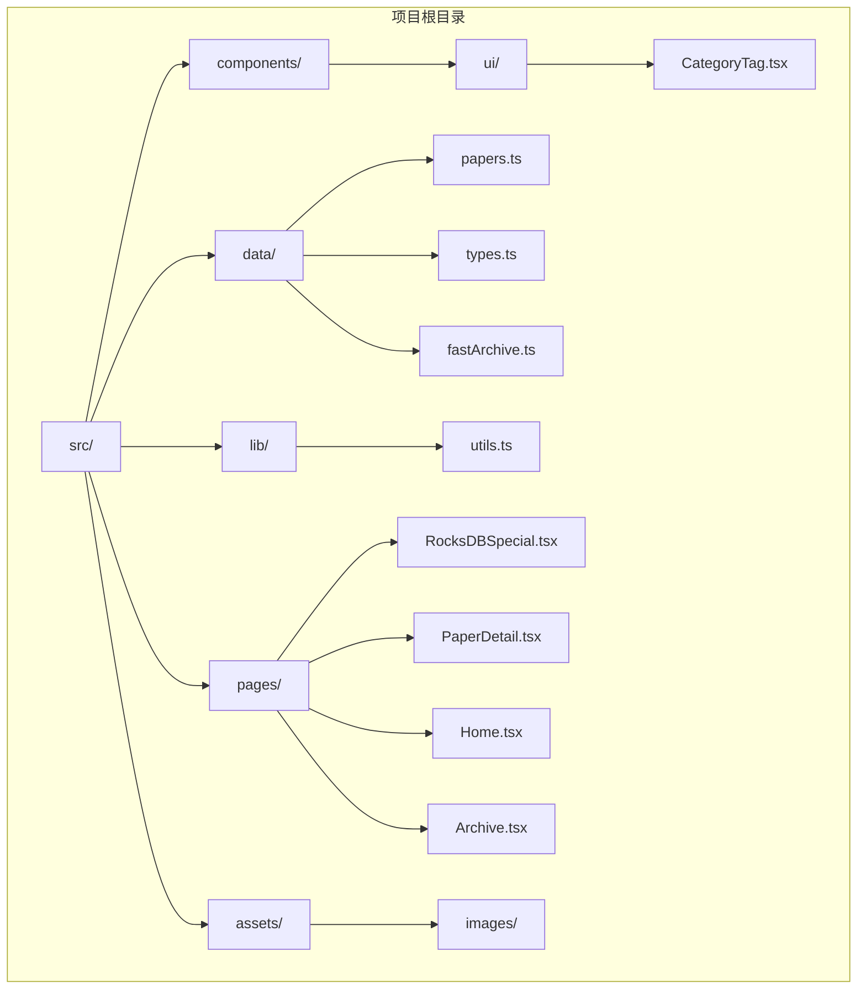
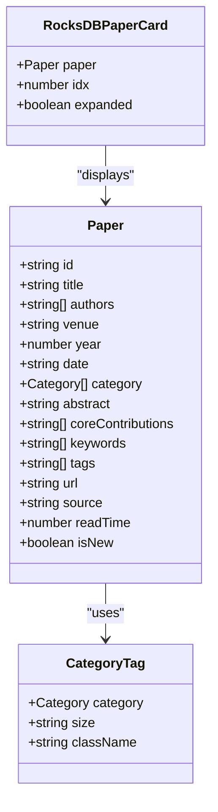
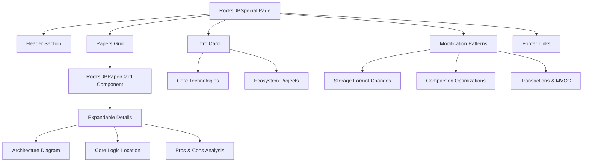
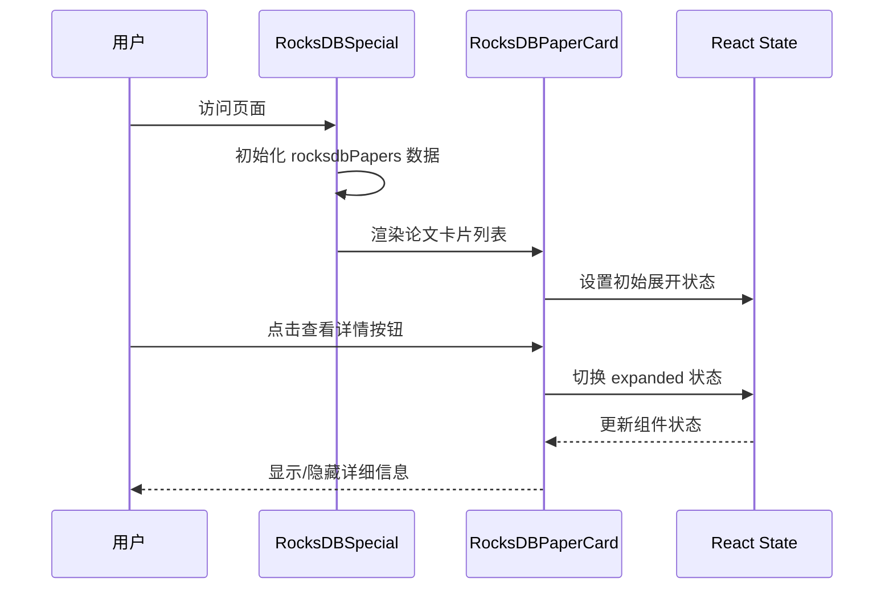
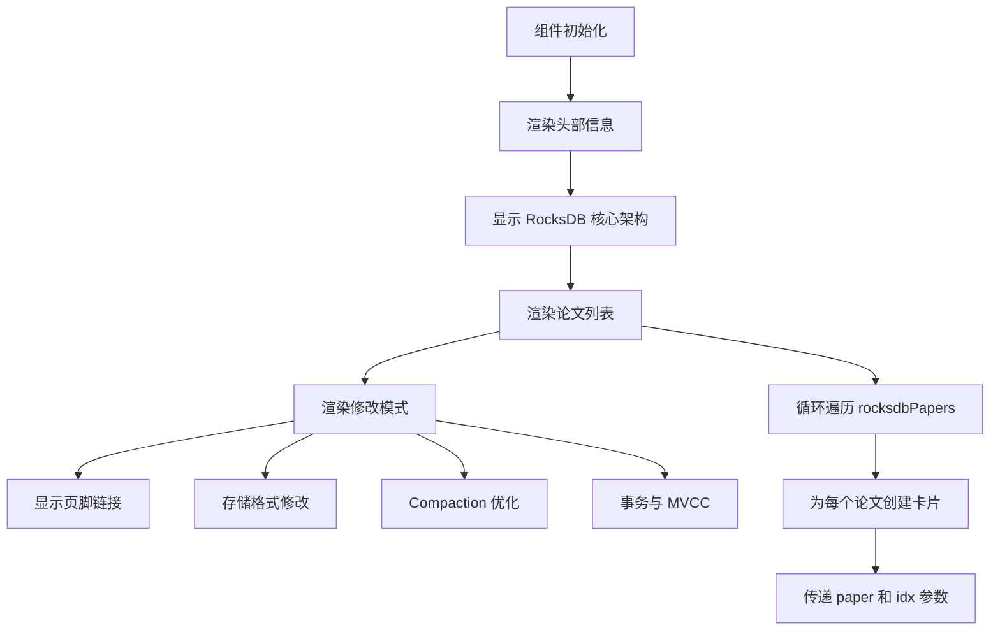
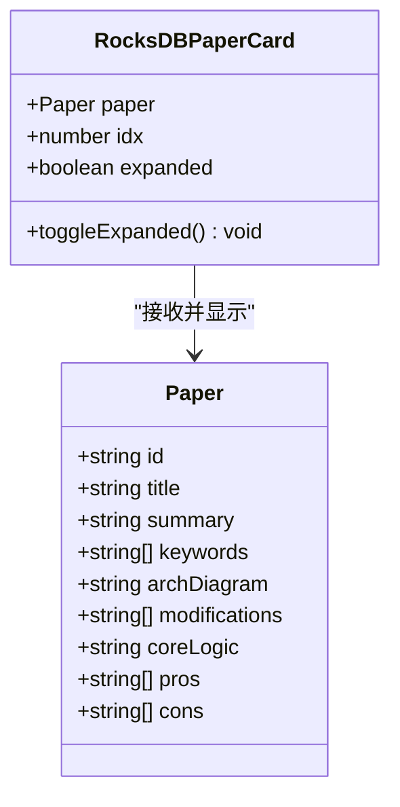
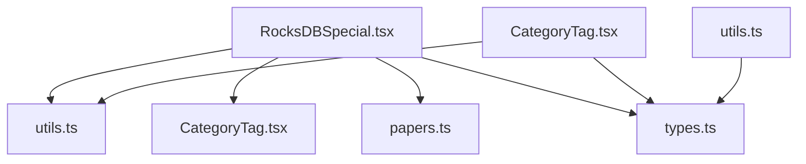

# RocksDB 特殊集合

<cite>
**本文档引用的文件**
- [RocksDBSpecial.tsx](file://src/pages/RocksDBSpecial.tsx)
- [papers.ts](file://src/data/papers.ts)
- [types.ts](file://src/data/types.ts)
- [utils.ts](file://src/lib/utils.ts)
- [CategoryTag.tsx](file://src/components/ui/CategoryTag.tsx)
- [fastArchive.ts](file://src/data/fastArchive.ts)
- [fastArchive.ts.bak](file://src/data/fastArchive.ts.bak)
- [package.json](file://package.json)
</cite>

## 目录
1. [简介](#简介)
2. [项目结构](#项目结构)
3. [核心组件](#核心组件)
4. [架构概览](#架构概览)
5. [详细组件分析](#详细组件分析)
6. [依赖关系分析](#依赖关系分析)
7. [性能考虑](#性能考虑)
8. [故障排除指南](#故障排除指南)
9. [结论](#结论)

## 简介

RocksDB Special 是一个专门介绍 RocksDB 生态系统和相关论文的专题页面。该项目展示了基于 RocksDB 的各种创新实现，包括 Titan、MyRocks、TiKV、CockroachDB 和 Pebble 等重要项目。该页面不仅介绍了这些项目的架构设计和核心修改点，还提供了详细的优缺点分析和性能数据。

该项目采用现代化的 React + TypeScript 技术栈构建，使用 Tailwind CSS 进行样式设计，通过 lucide-react 图标库提供丰富的视觉元素。整个应用专注于存储系统和数据库技术领域，特别是 LSM-Tree 存储引擎的工业实践。

## 项目结构

该项目采用基于功能的组织方式，主要目录结构如下：



**图表来源**
- [RocksDBSpecial.tsx:1-50](file://src/pages/RocksDBSpecial.tsx#L1-L50)
- [papers.ts:1-30](file://src/data/papers.ts#L1-L30)
- [types.ts:1-49](file://src/data/types.ts#L1-L49)

**章节来源**
- [RocksDBSpecial.tsx:1-376](file://src/pages/RocksDBSpecial.tsx#L1-L376)
- [package.json:1-32](file://package.json#L1-L32)

## 核心组件

### 主要数据结构

项目使用 TypeScript 定义了严格的数据类型系统，确保数据的一致性和可维护性：



**图表来源**
- [types.ts:13-34](file://src/data/types.ts#L13-L34)
- [CategoryTag.tsx:5-24](file://src/components/ui/CategoryTag.tsx#L5-L24)

### 核心数据模型

项目的核心数据模型围绕 Paper 接口构建，支持多种内容类型和分类体系：

**章节来源**
- [types.ts:1-49](file://src/data/types.ts#L1-L49)
- [papers.ts:1-847](file://src/data/papers.ts#L1-L847)

## 架构概览

### 页面架构设计

RocksDB Special 页面采用了模块化的架构设计，将不同的功能区域清晰分离：



**图表来源**
- [RocksDBSpecial.tsx:80-269](file://src/pages/RocksDBSpecial.tsx#L80-L269)
- [RocksDBSpecial.tsx:271-375](file://src/pages/RocksDBSpecial.tsx#L271-L375)

### 组件交互流程

页面组件之间的交互遵循清晰的单向数据流模式：



**图表来源**
- [RocksDBSpecial.tsx:271-375](file://src/pages/RocksDBSpecial.tsx#L271-L375)

**章节来源**
- [RocksDBSpecial.tsx:1-376](file://src/pages/RocksDBSpecial.tsx#L1-L376)

## 详细组件分析

### RocksDBSpecial 主组件

主组件负责整个页面的布局和数据管理，采用函数式组件设计：



**图表来源**
- [RocksDBSpecial.tsx:80-269](file://src/pages/RocksDBSpecial.tsx#L80-L269)

#### 核心论文数据结构

页面包含了六个基于 RocksDB 的重要项目，每个项目都有详细的技术分析：

**章节来源**
- [RocksDBSpecial.tsx:5-78](file://src/pages/RocksDBSpecial.tsx#L5-L78)

### RocksDBPaperCard 组件

这是一个高度可复用的卡片组件，支持展开/折叠功能：



**图表来源**
- [RocksDBSpecial.tsx:271-375](file://src/pages/RocksDBSpecial.tsx#L271-L375)

#### 组件状态管理

组件使用 React 的 useState Hook 来管理展开状态：

**章节来源**
- [RocksDBSpecial.tsx:271-375](file://src/pages/RocksDBSpecial.tsx#L271-L375)

### 工具函数模块

项目提供了多个实用工具函数，支持样式处理和数据格式化：

**章节来源**
- [utils.ts:1-58](file://src/lib/utils.ts#L1-L58)

## 依赖关系分析

### 外部依赖

项目使用了现代化的前端技术栈，主要依赖包括：

```mermaid
graph LR
subgraph "React 生态系统"
A[react] --> A1[18.3.1]
B[react-dom] --> B1[18.3.1]
C[react-router-dom] --> C1[7.1.1]
end
subgraph "UI 和样式"
D[lucide-react] --> D1[0.468.0]
E[class-variance-authority] --> E1[0.7.1]
F[clsx] --> F1[2.1.1]
G[tailwind-merge] --> G1[2.6.0]
H[tailwindcss-animate] --> H1[1.0.7]
end
subgraph "开发工具"
I[@types/react] --> I1[18.3.18]
J[@types/react-dom] --> J1[18.3.5]
K[@vitejs/plugin-react] --> K1[4.3.4]
L[tailwindcss] --> L1[3.4.17]
M[typescript] --> M1[5.6.2]
N[vite] --> N1[6.0.5]
end
```

**图表来源**
- [package.json:11-30](file://package.json#L11-L30)

### 内部模块依赖

项目内部模块之间的依赖关系相对简单，遵循单一职责原则：



**图表来源**
- [RocksDBSpecial.tsx:1-3](file://src/pages/RocksDBSpecial.tsx#L1-L3)
- [CategoryTag.tsx:1-4](file://src/components/ui/CategoryTag.tsx#L1-L4)

**章节来源**
- [package.json:1-32](file://package.json#L1-L32)

## 性能考虑

### 数据结构优化

项目在数据结构设计上考虑了性能因素：

1. **类型安全**: 使用 TypeScript 确保编译时类型检查
2. **模块化设计**: 将数据和 UI 组件分离，便于维护
3. **响应式更新**: 使用 React Hooks 实现高效的组件更新

### 渲染性能

页面采用了以下优化策略：

1. **条件渲染**: 仅在用户点击时渲染详细信息
2. **组件复用**: 通过 props 传递数据，避免重复渲染
3. **样式优化**: 使用 Tailwind CSS 提供的原子化类名

## 故障排除指南

### 常见问题

1. **图标不显示**: 确保 lucide-react 包正确安装
2. **样式异常**: 检查 Tailwind CSS 配置是否正确
3. **数据加载失败**: 验证 papers.ts 中的数据格式

### 调试技巧

1. **使用浏览器开发者工具**: 检查组件状态和 props
2. **启用 React DevTools**: 监控组件渲染性能
3. **检查控制台错误**: 查找 JavaScript 错误

## 结论

RocksDB Special 是一个精心设计的专题页面，成功地展示了 RocksDB 生态系统的重要组成部分。项目采用现代化的技术栈，具有良好的可维护性和扩展性。

该页面的主要优势包括：

1. **内容丰富**: 涵盖了多个基于 RocksDB 的重要项目
2. **设计优雅**: 使用简洁的卡片布局和清晰的信息层次
3. **技术先进**: 采用 React + TypeScript + Tailwind CSS 的现代技术栈
4. **易于维护**: 模块化的设计使得代码易于理解和修改

通过这个项目，开发者可以深入了解 LSM-Tree 存储引擎的工业实践，以及 RocksDB 在不同场景下的应用和优化策略。