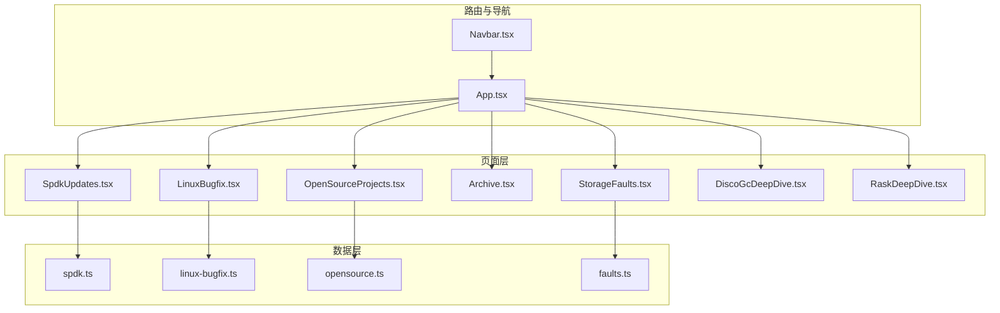
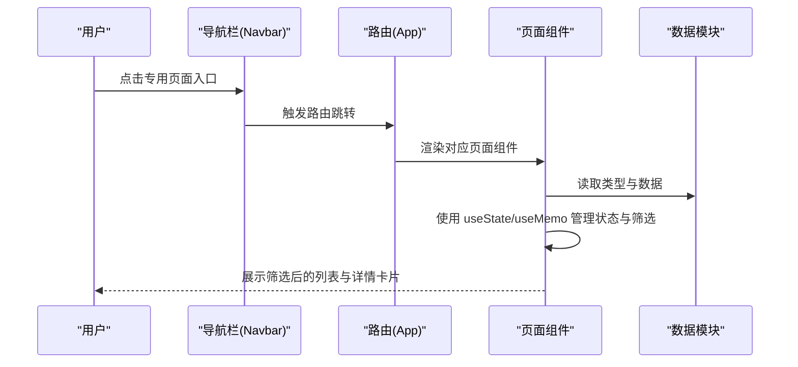
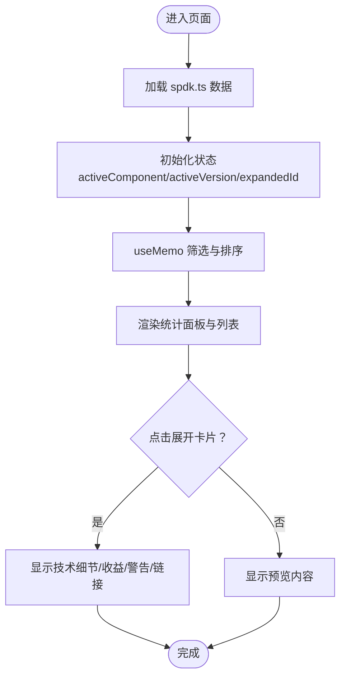
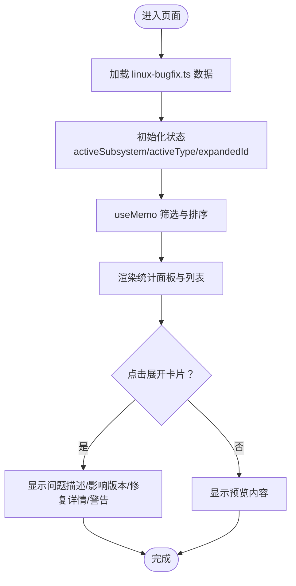
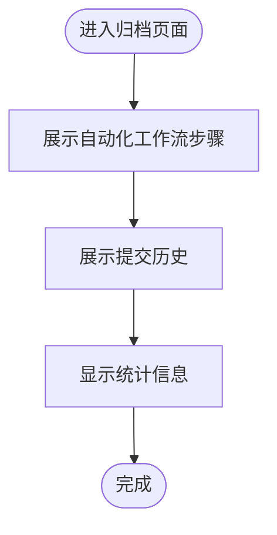
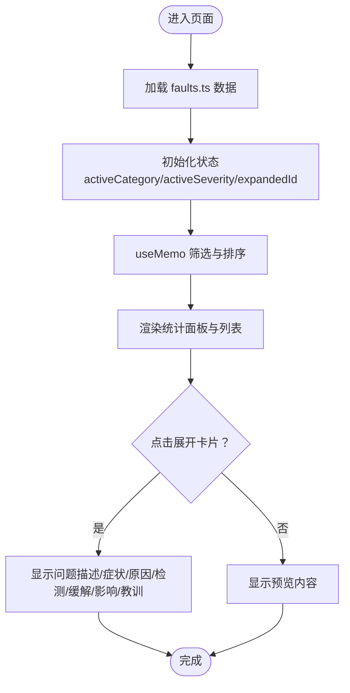
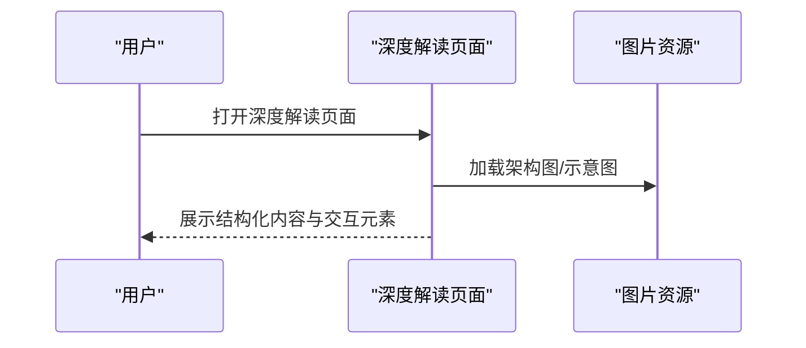
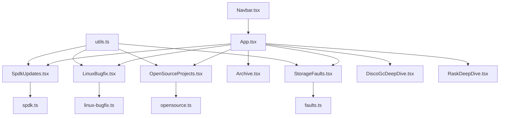

# 专用功能页面

<cite>
**本文档引用的文件**
- [SpdkUpdates.tsx](file://src/pages/SpdkUpdates.tsx)
- [spdk.ts](file://src/data/spdk.ts)
- [LinuxBugfix.tsx](file://src/pages/LinuxBugfix.tsx)
- [linux-bugfix.ts](file://src/data/linux-bugfix.ts)
- [OpenSourceProjects.tsx](file://src/pages/OpenSourceProjects.tsx)
- [opensource.ts](file://src/data/opensource.ts)
- [Archive.tsx](file://src/pages/Archive.tsx)
- [StorageFaults.tsx](file://src/pages/StorageFaults.tsx)
- [faults.ts](file://src/data/faults.ts)
- [DiscoGcDeepDive.tsx](file://src/pages/DiscoGcDeepDive.tsx)
- [RaskDeepDive.tsx](file://src/pages/RaskDeepDive.tsx)
- [App.tsx](file://src/App.tsx)
- [Navbar.tsx](file://src/components/Navbar.tsx)
- [utils.ts](file://src/lib/utils.ts)
- [package.json](file://package.json)
</cite>

## 目录
1. [简介](#简介)
2. [项目结构](#项目结构)
3. [核心组件](#核心组件)
4. [架构概览](#架构概览)
5. [详细组件分析](#详细组件分析)
6. [依赖分析](#依赖分析)
7. [性能考量](#性能考量)
8. [故障排查指南](#故障排查指南)
9. [结论](#结论)
10. [附录](#附录)

## 简介
本文件面向 cs336 项目的专用功能页面，深入解析以下专用页面的实现与设计：
- SPDK 更新（SpdkUpdates）
- Linux Bugfix（LinuxBugfix）
- 开源项目（OpenSourceProjects）
- 归档页面（Archive）
- 存储故障（StorageFaults）
- 深度解读页面（DiscoGcDeepDive、RaskDeepDive）

重点阐述每个页面的功能定位、数据来源与展示逻辑，解释深度解读页面的特殊设计模式、技术架构解读的呈现方式与复杂概念的简化处理，以及专用页面的独立性与可扩展性、新页面添加方法与内容维护策略，并给出性能优化与用户体验提升方案。

## 项目结构
专用功能页面位于 `src/pages/` 目录，数据定义位于 `src/data/` 目录，页面通过 `src/App.tsx` 的路由系统统一注册，导航栏在 `src/components/Navbar.tsx` 中配置。

**图表来源**
- [App.tsx:19-42](file://src/App.tsx#L19-L42)
- [SpdkUpdates.tsx:1-357](file://src/pages/SpdkUpdates.tsx#L1-L357)
- [LinuxBugfix.tsx:1-372](file://src/pages/LinuxBugfix.tsx#L1-L372)
- [OpenSourceProjects.tsx:1-438](file://src/pages/OpenSourceProjects.tsx#L1-L438)
- [Archive.tsx:1-130](file://src/pages/Archive.tsx#L1-L130)
- [StorageFaults.tsx:1-357](file://src/pages/StorageFaults.tsx#L1-L357)
- [DiscoGcDeepDive.tsx:1-410](file://src/pages/DiscoGcDeepDive.tsx#L1-L410)
- [RaskDeepDive.tsx:1-269](file://src/pages/RaskDeepDive.tsx#L1-L269)

**章节来源**
- [App.tsx:1-45](file://src/App.tsx#L1-L45)
- [Navbar.tsx:1-143](file://src/components/Navbar.tsx#L1-L143)

## 核心组件
- 页面组件：每个专用页面都是独立的 React 组件，负责渲染 UI、处理交互与状态管理。
- 数据模块：每个页面对应一个数据模块，定义类型、数据集合与统计函数。
- 路由注册：App.tsx 中集中注册所有专用页面路由。
- 导航集成：Navbar.tsx 中提供专用页面入口与下拉菜单。

**章节来源**
- [SpdkUpdates.tsx:1-357](file://src/pages/SpdkUpdates.tsx#L1-L357)
- [LinuxBugfix.tsx:1-372](file://src/pages/LinuxBugfix.tsx#L1-L372)
- [OpenSourceProjects.tsx:1-438](file://src/pages/OpenSourceProjects.tsx#L1-L438)
- [Archive.tsx:1-130](file://src/pages/Archive.tsx#L1-L130)
- [StorageFaults.tsx:1-357](file://src/pages/StorageFaults.tsx#L1-L357)
- [DiscoGcDeepDive.tsx:1-410](file://src/pages/DiscoGcDeepDive.tsx#L1-L410)
- [RaskDeepDive.tsx:1-269](file://src/pages/RaskDeepDive.tsx#L1-L269)
- [spdk.ts:1-575](file://src/data/spdk.ts#L1-L575)
- [linux-bugfix.ts:1-609](file://src/data/linux-bugfix.ts#L1-L609)
- [opensource.ts:1-1110](file://src/data/opensource.ts#L1-L1110)
- [faults.ts:1-817](file://src/data/faults.ts#L1-L817)

## 架构概览
专用功能页面遵循“页面组件 + 数据模块”的分层架构，页面组件通过 hooks（useState、useMemo）管理本地状态与筛选逻辑，数据模块提供类型定义与静态数据，路由与导航负责页面间的跳转与入口组织。

**图表来源**
- [App.tsx:19-42](file://src/App.tsx#L19-L42)
- [Navbar.tsx:22-114](file://src/components/Navbar.tsx#L22-L114)
- [SpdkUpdates.tsx:35-199](file://src/pages/SpdkUpdates.tsx#L35-L199)
- [LinuxBugfix.tsx:37-212](file://src/pages/LinuxBugfix.tsx#L37-L212)
- [OpenSourceProjects.tsx:29-167](file://src/pages/OpenSourceProjects.tsx#L29-L167)
- [StorageFaults.tsx:28-174](file://src/pages/StorageFaults.tsx#L28-L174)

## 详细组件分析

### SPDK 更新页面（SpdkUpdates）
- 功能定位：追踪 SPDK 近年来在 NVMe、块设备、iSCSI、NVMe-oF、vhost、BlobFS/Blobstore、IOAT/IDXD 加速器、环境与套接字等组件的关键更新，涵盖新特性、性能优化、Bug 修复、API 变更与废弃移除。
- 数据来源：spdk.ts 中的 spdkUpdates 数组与类型定义，以及版本统计函数。
- 展示逻辑：
  - 状态管理：当前激活的组件与版本、展开项 ID。
  - 筛选与排序：按组件与版本筛选，优先展示最新条目，再按日期倒序。
  - 卡片设计：支持展开查看技术细节、收益、Breaking Change 警告与参考链接。
  - 统计面板：显示总条目、最新版本条目、Breaking Change 条目与覆盖版本数。
- 性能优化：useMemo 对筛选结果进行记忆化，避免重复计算；按需渲染卡片内容。

**图表来源**
- [SpdkUpdates.tsx:35-199](file://src/pages/SpdkUpdates.tsx#L35-L199)
- [spdk.ts:53-575](file://src/data/spdk.ts#L53-L575)

**章节来源**
- [SpdkUpdates.tsx:1-357](file://src/pages/SpdkUpdates.tsx#L1-L357)
- [spdk.ts:1-575](file://src/data/spdk.ts#L1-L575)

### Linux Bugfix 页面（LinuxBugfix）
- 功能定位：追踪 Linux 内核文件系统、存储、RAID 等子系统最新 Bugfix、安全修复、性能优化、新特性与更新。
- 数据来源：linux-bugfix.ts 中的 linuxBugfixes 数组与类型定义，以及按子系统统计函数。
- 展示逻辑：
  - 状态管理：当前激活的子系统与类型、展开项 ID。
  - 筛选与排序：按子系统与类型筛选，优先展示最新条目，再按严重度排序，最后按日期倒序。
  - 卡片设计：支持展开查看问题描述、影响版本、提交 ID、修复详情与严重问题警告。
  - 统计面板：显示总条目、严重问题条目、本周新增与子系统数量。
- 性能优化：useMemo 对筛选结果进行记忆化；按子系统聚合统计。

**图表来源**
- [LinuxBugfix.tsx:37-212](file://src/pages/LinuxBugfix.tsx#L37-L212)
- [linux-bugfix.ts:58-609](file://src/data/linux-bugfix.ts#L58-L609)

**章节来源**
- [LinuxBugfix.tsx:1-372](file://src/pages/LinuxBugfix.tsx#L1-L372)
- [linux-bugfix.ts:1-609](file://src/data/linux-bugfix.ts#L1-L609)

### 开源项目页面（OpenSourceProjects）
- 功能定位：对经典开源存储库进行深度解读，涵盖 KV 引擎、关系数据库、并行文件系统、对象存储、表格式/数据湖、消息队列、时序数据库、缓存系统等类别。
- 数据来源：opensource.ts 中的 openSourceProjects 数组与类型定义，以及按类别统计函数。
- 展示逻辑：
  - 状态管理：当前激活的类别与搜索词、展开项 ID。
  - 筛选与排序：按类别与搜索词筛选，优先展示精选项目，再按 Star 数排序，最后按名称排序。
  - 卡片设计：支持展开查看架构、核心组件、关键技术、性能特点、应用场景、知名用户、优缺点与链接。
  - 统计面板：显示项目总数、精选推荐数、技术类别数与知名用户数。
- 性能优化：useMemo 对筛选结果进行记忆化；解析星数字符串进行数值比较。

**图表来源**
- [OpenSourceProjects.tsx:29-167](file://src/pages/OpenSourceProjects.tsx#L29-L167)
- [opensource.ts:88-1110](file://src/data/opensource.ts#L88-L1110)

**章节来源**
- [OpenSourceProjects.tsx:1-438](file://src/pages/OpenSourceProjects.tsx#L1-L438)
- [opensource.ts:1-1110](file://src/data/opensource.ts#L1-L1110)

### 归档页面（Archive）
- 功能定位：展示内容更新的 Git 归档流程与提交历史，体现自动化工作流与版本演进。
- 数据来源：Archive.tsx 内置的提交记录与工作流步骤数组。
- 展示逻辑：
  - 工作流步骤：每日抓取、AI 梳理、Git 归档、部署上线四个阶段。
  - 提交历史：展示最近提交、日期、消息与文章数量。
  - 统计信息：显示总提交次数与归档文章总数。
- 性能优化：静态数据直出，无动态计算。

**图表来源**
- [Archive.tsx:45-129](file://src/pages/Archive.tsx#L45-L129)

**章节来源**
- [Archive.tsx:1-130](file://src/pages/Archive.tsx#L1-L130)

### 存储故障页面（StorageFaults）
- 功能定位：收集与分析工业界大规模存储故障案例，涵盖慢盘、CPU/内存异常、SSD 缺陷、网络故障、固件 Bug、磨损老化、环境因素等类型。
- 数据来源：faults.ts 中的 storageFaults 数组与类型定义，以及按类别统计函数。
- 展示逻辑：
  - 状态管理：当前激活的类别与严重度、展开项 ID。
  - 筛选与排序：按类别与严重度筛选，优先展示最新条目，再按严重度排序，最后按年份倒序。
  - 卡片设计：支持展开查看问题描述、故障症状、根本原因、检测方法、缓解措施、影响范围与经验教训。
  - 统计面板：显示案例总数、严重问题数、最新案例数与故障类型数。
- 性能优化：useMemo 对筛选结果进行记忆化；按类别聚合统计。

**图表来源**
- [StorageFaults.tsx:28-174](file://src/pages/StorageFaults.tsx#L28-L174)
- [faults.ts:66-817](file://src/data/faults.ts#L66-L817)

**章节来源**
- [StorageFaults.tsx:1-357](file://src/pages/StorageFaults.tsx#L1-L357)
- [faults.ts:1-817](file://src/data/faults.ts#L1-L817)

### 深度解读页面（DiscoGcDeepDive、RaskDeepDive）
- 功能定位：对特定论文进行深度解读，采用“问题背景—核心创新—技术细节—实验结果—优缺点分析—相关论文”的结构化呈现，辅以架构图与可视化元素。
- 数据来源：页面组件内直接定义内容与图片资源路径。
- 展示逻辑：
  - 结构化内容：TL;DR、问题背景、核心创新、技术细节、实验结果、优缺点分析、相关论文等章节。
  - 交互设计：返回链接、外链按钮、标签分类、图标与颜色体系。
  - 复杂概念简化：通过图示、要点列表与对比表格降低理解门槛。
- 性能优化：静态内容直出，无动态计算；图片懒加载由浏览器处理。

**图表来源**
- [DiscoGcDeepDive.tsx:21-410](file://src/pages/DiscoGcDeepDive.tsx#L21-L410)
- [RaskDeepDive.tsx:4-269](file://src/pages/RaskDeepDive.tsx#L4-L269)

**章节来源**
- [DiscoGcDeepDive.tsx:1-410](file://src/pages/DiscoGcDeepDive.tsx#L1-L410)
- [RaskDeepDive.tsx:1-269](file://src/pages/RaskDeepDive.tsx#L1-L269)

## 依赖分析
- 路由依赖：App.tsx 统一注册所有专用页面路由，Navbar.tsx 提供导航入口。
- 组件依赖：各页面组件依赖对应数据模块的类型与数据集合。
- 工具依赖：utils.ts 提供通用工具函数（类名合并、分类标签与标签文本映射、日期格式化、来源图标）。
- 依赖关系图：

**图表来源**
- [App.tsx:19-42](file://src/App.tsx#L19-L42)
- [Navbar.tsx:22-114](file://src/components/Navbar.tsx#L22-L114)
- [utils.ts:1-58](file://src/lib/utils.ts#L1-L58)

**章节来源**
- [App.tsx:1-45](file://src/App.tsx#L1-L45)
- [Navbar.tsx:1-143](file://src/components/Navbar.tsx#L1-L143)
- [utils.ts:1-58](file://src/lib/utils.ts#L1-L58)

## 性能考量
- 记忆化筛选：各列表页面普遍使用 useMemo 对筛选与排序结果进行记忆化，避免重复计算，提升大数据量下的渲染性能。
- 本地状态管理：使用 useState 管理筛选条件与展开状态，减少不必要的重渲染。
- 按需渲染：卡片采用可展开设计，仅在用户交互时渲染详细内容，降低初始渲染负担。
- 静态数据直出：归档页面与深度解读页面使用静态数据与图片资源，减少网络请求与计算开销。
- 路由与导航：集中路由注册与导航入口，避免重复渲染与状态分散。

[本节为通用性能指导，无需特定文件引用]

## 故障排查指南
- 页面空白或数据未显示：
  - 检查对应数据模块是否正确导出数据集合与类型定义。
  - 确认 App.tsx 中路由注册是否包含该页面路径。
- 筛选无效或排序异常：
  - 检查页面组件中的筛选逻辑与排序规则是否与数据结构一致。
  - 确认 useMemo 的依赖数组是否包含所有相关状态。
- 图片资源加载失败：
  - 检查图片路径是否存在于 public/images 或对应的静态资源目录。
- 导航入口缺失：
  - 检查 Navbar.tsx 中的导航项是否包含该页面入口，以及样式与交互是否正常。

**章节来源**
- [SpdkUpdates.tsx:43-52](file://src/pages/SpdkUpdates.tsx#L43-L52)
- [LinuxBugfix.tsx:42-56](file://src/pages/LinuxBugfix.tsx#L42-L56)
- [OpenSourceProjects.tsx:37-60](file://src/pages/OpenSourceProjects.tsx#L37-L60)
- [StorageFaults.tsx:36-49](file://src/pages/StorageFaults.tsx#L36-L49)
- [App.tsx:19-42](file://src/App.tsx#L19-L42)
- [Navbar.tsx:13-20](file://src/components/Navbar.tsx#L13-L20)

## 结论
专用功能页面通过清晰的分层架构与模块化设计，实现了数据与视图的解耦，既保证了页面的独立性与可维护性，又提供了良好的扩展性。深度解读页面采用结构化内容与可视化手段，有效降低了复杂技术概念的理解门槛。未来可在以下方面持续优化：
- 增加搜索与标签过滤的组合筛选，提升检索效率。
- 引入分页或虚拟滚动，优化长列表性能。
- 添加内容缓存与增量更新机制，减少重复加载。
- 统一页面骨架屏与加载状态，提升用户体验。

[本节为总结性内容，无需特定文件引用]

## 附录

### 新专用页面添加方法
- 创建页面组件：在 `src/pages/` 下新建页面组件文件，定义状态管理、筛选逻辑与 UI 结构。
- 定义数据模块：在 `src/data/` 下创建对应数据模块，定义类型与数据集合，提供必要的统计函数。
- 注册路由：在 `src/App.tsx` 的 Routes 中添加新路由。
- 集成导航：在 `src/components/Navbar.tsx` 的导航项中添加入口。
- 样式与工具：复用 `src/lib/utils.ts` 中的工具函数与样式类名规范。

**章节来源**
- [App.tsx:19-42](file://src/App.tsx#L19-L42)
- [Navbar.tsx:6-20](file://src/components/Navbar.tsx#L6-L20)
- [utils.ts:1-58](file://src/lib/utils.ts#L1-L58)

### 内容维护策略
- 数据更新：在对应数据模块中维护数据集合与统计函数，确保类型与数据一致。
- 页面优化：根据用户反馈与性能指标，持续优化筛选逻辑与渲染性能。
- 内容扩展：深度解读页面可引入更多论文与案例，丰富知识体系。
- 资源管理：统一管理图片与外部链接，确保资源可用性与加载速度。

**章节来源**
- [spdk.ts:555-575](file://src/data/spdk.ts#L555-L575)
- [linux-bugfix.ts:588-609](file://src/data/linux-bugfix.ts#L588-L609)
- [opensource.ts:88-1110](file://src/data/opensource.ts#L88-L1110)
- [faults.ts:794-800](file://src/data/faults.ts#L794-L800)