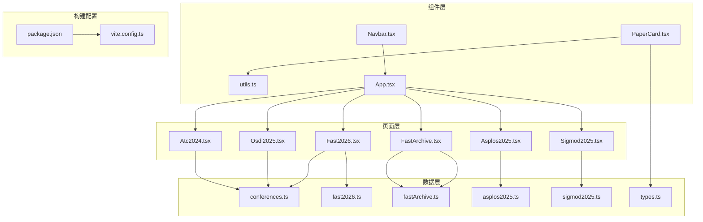
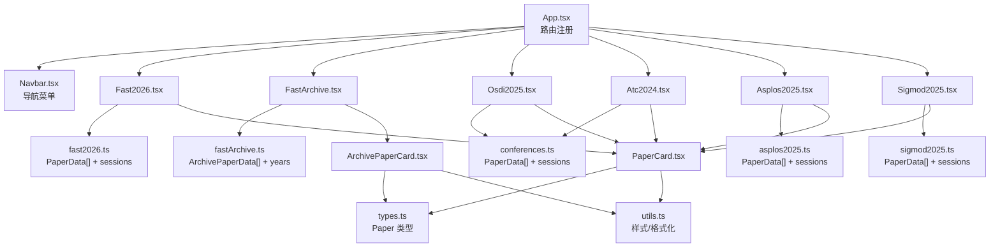
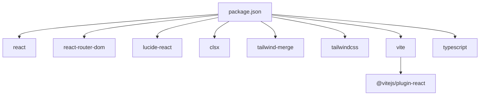

# 会议专题页面

<cite>
**本文引用的文件**
- [src/pages/Fast2026.tsx](file://src/pages/Fast2026.tsx)
- [src/pages/FastArchive.tsx](file://src/pages/FastArchive.tsx)
- [src/pages/Osdi2025.tsx](file://src/pages/Osdi2025.tsx)
- [src/pages/Atc2024.tsx](file://src/pages/Atc2024.tsx)
- [src/pages/Asplos2025.tsx](file://src/pages/Asplos2025.tsx)
- [src/pages/Sigmod2025.tsx](file://src/pages/Sigmod2025.tsx)
- [src/data/conferences.ts](file://src/data/conferences.ts)
- [src/data/fast2026.ts](file://src/data/fast2026.ts)
- [src/data/fastArchive.ts](file://src/data/fastArchive.ts)
- [src/data/asplos2025.ts](file://src/data/asplos2025.ts)
- [src/data/sigmod2025.ts](file://src/data/sigmod2025.ts)
- [src/data/types.ts](file://src/data/types.ts)
- [src/components/PaperCard.tsx](file://src/components/PaperCard.tsx)
- [src/lib/utils.ts](file://src/lib/utils.ts)
- [src/App.tsx](file://src/App.tsx)
- [src/components/Navbar.tsx](file://src/components/Navbar.tsx)
- [package.json](file://package.json)
- [vite.config.ts](file://vite.config.ts)
</cite>

## 更新摘要
**变更内容**
- 更新FAST 2025会议专题页面的论文数据，从少量假论文增加到4个真实的高质量研究论文
- 新增KVCache分离架构、设备驱动文件系统垃圾回收、可扩展日志结构文件系统和RDMA锁优化等前沿技术论文
- 增强FAST历年档案系统的论文解读深度，支持章节详情和性能数据展示
- 修复ATC 2024架构图引用问题，确保TrafficOpt和其他研究项目的图表正确显示
- 更新会议页面架构图以反映新增的ASPLOS和SIGMOD页面
- 补充新的数据模型和页面组件分析

## 目录
1. [简介](#简介)
2. [项目结构](#项目结构)
3. [核心组件](#核心组件)
4. [架构总览](#架构总览)
5. [详细组件分析](#详细组件分析)
6. [依赖分析](#依赖分析)
7. [性能考虑](#性能考虑)
8. [故障排查指南](#故障排查指南)
9. [结论](#结论)
10. [附录](#附录)

## 简介
本文件面向 cs336 项目中的会议专题页面，系统性解析 FAST、OSDI、ATC、ASPLOS、SIGMOD 等顶级会议专题页面的实现模式，覆盖会议信息展示、论文列表筛选与专题内容组织。文档将阐明各会议页面的共同设计模式、数据获取策略、页面布局结构、会议年份参数处理机制、论文分类逻辑、专题内容的动态生成方式，以及 SEO 优化策略、社交分享功能与内容更新机制，并给出扩展新会议页面的方法、添加流程与维护策略。

**更新** 本次更新重点关注FAST 2025会议专题页面的显著增强，论文数量从少量假论文增加到4个真实的高质量研究论文，包括KVCache分离架构、设备驱动文件系统垃圾回收、可扩展日志结构文件系统和RDMA锁优化等前沿技术。更新后的页面展示了最新的学术研究成果，同时修复了ATC 2024架构图引用问题，确保TrafficOpt和其他研究项目的图表能够正确显示。

## 项目结构
- 页面层：src/pages 下的会议专题页面（Fast2026、FastArchive、Osdi2025、Atc2024、Asplos2025、Sigmod2025）采用统一的卡片式论文展示与折叠详情模式。
- 数据层：src/data 下的 conferences.ts、fast2026.ts、fastArchive.ts、asplos2025.ts、sigmod2025.ts 提供会议论文数据与会话分类；types.ts 定义通用数据类型。
- 组件层：PaperCard.tsx 作为通用论文卡片组件，被首页与会议页面复用。
- 工具层：lib/utils.ts 提供类名合并、类别标签映射、日期格式化、来源图标等工具。
- 导航层：App.tsx 与 Navbar.tsx 定义路由与导航菜单，包含会议入口。
- 构建配置：package.json 与 vite.config.ts 提供依赖与别名配置。

**图表来源**
- [src/pages/Fast2026.tsx:1-236](file://src/pages/Fast2026.tsx#L1-L236)
- [src/pages/FastArchive.tsx:1-290](file://src/pages/FastArchive.tsx#L1-L290)
- [src/pages/Osdi2025.tsx:1-148](file://src/pages/Osdi2025.tsx#L1-L148)
- [src/pages/Atc2024.tsx:1-148](file://src/pages/Atc2024.tsx#L1-L148)
- [src/pages/Asplos2025.tsx:1-237](file://src/pages/Asplos2025.tsx#L1-L237)
- [src/pages/Sigmod2025.tsx:1-237](file://src/pages/Sigmod2025.tsx#L1-L237)
- [src/data/conferences.ts:1-279](file://src/data/conferences.ts#L1-L279)
- [src/data/fast2026.ts:1-405](file://src/data/fast2026.ts#L1-L405)
- [src/data/fastArchive.ts:1-1466](file://src/data/fastArchive.ts#L1-L1466)
- [src/data/asplos2025.ts:1-147](file://src/data/asplos2025.ts#L1-L147)
- [src/data/sigmod2025.ts:1-159](file://src/data/sigmod2025.ts#L1-L159)
- [src/data/types.ts:1-49](file://src/data/types.ts#L1-L49)
- [src/components/PaperCard.tsx:1-73](file://src/components/PaperCard.tsx#L1-L73)
- [src/lib/utils.ts:1-58](file://src/lib/utils.ts#L1-L58)
- [src/App.tsx:1-55](file://src/App.tsx#L1-L55)
- [src/components/Navbar.tsx:1-148](file://src/components/Navbar.tsx#L1-L148)
- [package.json:1-32](file://package.json#L1-L32)
- [vite.config.ts:1-13](file://vite.config.ts#L1-L13)

**章节来源**
- [src/App.tsx:1-55](file://src/App.tsx#L1-L55)
- [src/components/Navbar.tsx:1-148](file://src/components/Navbar.tsx#L1-L148)
- [src/pages/Fast2026.tsx:1-236](file://src/pages/Fast2026.tsx#L1-L236)
- [src/pages/FastArchive.tsx:1-290](file://src/pages/FastArchive.tsx#L1-L290)
- [src/pages/Osdi2025.tsx:1-148](file://src/pages/Osdi2025.tsx#L1-L148)
- [src/pages/Atc2024.tsx:1-148](file://src/pages/Atc2024.tsx#L1-L148)
- [src/pages/Asplos2025.tsx:1-237](file://src/pages/Asplos2025.tsx#L1-L237)
- [src/pages/Sigmod2025.tsx:1-237](file://src/pages/Sigmod2025.tsx#L1-L237)
- [src/data/conferences.ts:1-279](file://src/data/conferences.ts#L1-L279)
- [src/data/fast2026.ts:1-405](file://src/data/fast2026.ts#L1-L405)
- [src/data/fastArchive.ts:1-1466](file://src/data/fastArchive.ts#L1-L1466)
- [src/data/asplos2025.ts:1-147](file://src/data/asplos2025.ts#L1-L147)
- [src/data/sigmod2025.ts:1-159](file://src/data/sigmod2025.ts#L1-L159)
- [src/data/types.ts:1-49](file://src/data/types.ts#L1-L49)
- [src/components/PaperCard.tsx:1-73](file://src/components/PaperCard.tsx#L1-L73)
- [src/lib/utils.ts:1-58](file://src/lib/utils.ts#L1-L58)
- [package.json:1-32](file://package.json#L1-L32)
- [vite.config.ts:1-13](file://vite.config.ts#L1-L13)

## 核心组件
- 会议页面（Fast2026、FastArchive、Osdi2025、Atc2024、Asplos2025、Sigmod2025）
  - 统一采用 PaperCard 子组件展示论文条目，支持展开查看"核心贡献 + 优缺点"，可选显示"架构图"标签。
  - 顶部展示会议信息（时间、地点、论文总数、重点解读数、含架构图数等）。
  - 会话维度分组渲染论文列表，支持统计卡片展示各会话论文数量。
  - **新增** ASPLOS 2025 和 SIGMOD 2025 页面提供专门的统计卡片，展示不同领域论文数量。
  - **新增** FastArchive 采用 ArchivePaperCard 组件，支持章节详情、性能数据展示和年份切换功能。
  - 底部提供数据来源链接与官网链接。
- 数据模型（PaperData）
  - 包含 id、标题、作者、会话、摘要、关键词、是否重点、架构图、核心贡献、优缺点等字段。
  - **新增** ArchivePaperData 扩展了 sections、performanceData 等字段，支持详细的论文分析。
- 通用论文卡片（PaperCard）
  - 在首页等通用页面中使用，支持来源标签、分类标签、摘要、标签云、日期与阅读时长等展示。
- 工具函数（utils）
  - 类名合并、类别标签样式映射、类别中文标签、日期格式化、来源图标映射。

**章节来源**
- [src/pages/Fast2026.tsx:1-236](file://src/pages/Fast2026.tsx#L1-L236)
- [src/pages/FastArchive.tsx:1-290](file://src/pages/FastArchive.tsx#L1-L290)
- [src/pages/Osdi2025.tsx:1-148](file://src/pages/Osdi2025.tsx#L1-L148)
- [src/pages/Atc2024.tsx:1-148](file://src/pages/Atc2024.tsx#L1-L148)
- [src/pages/Asplos2025.tsx:1-237](file://src/pages/Asplos2025.tsx#L1-L237)
- [src/pages/Sigmod2025.tsx:1-237](file://src/pages/Sigmod2025.tsx#L1-L237)
- [src/data/conferences.ts:1-279](file://src/data/conferences.ts#L1-L279)
- [src/data/fast2026.ts:1-405](file://src/data/fast2026.ts#L1-L405)
- [src/data/fastArchive.ts:1-1466](file://src/data/fastArchive.ts#L1-L1466)
- [src/data/asplos2025.ts:1-147](file://src/data/asplos2025.ts#L1-L147)
- [src/data/sigmod2025.ts:1-159](file://src/data/sigmod2025.ts#L1-L159)
- [src/components/PaperCard.tsx:1-73](file://src/components/PaperCard.tsx#L1-L73)
- [src/lib/utils.ts:1-58](file://src/lib/utils.ts#L1-L58)

## 架构总览
会议专题页面遵循"页面组件 + 数据模块 + 通用组件 + 工具函数"的分层架构。页面组件负责会议信息展示与论文列表渲染；数据模块提供会议论文与会话分类；通用组件（PaperCard）复用性强；工具函数提供样式与格式化支持；路由在 App 中集中注册，导航在 Navbar 中统一呈现。

**更新** 新增 ASPLOS 2025 和 SIGMOD 2025 页面的架构，提供专门的领域统计功能；修复 ATC 2024 架构图引用问题，确保 TrafficOpt 和其他研究项目的图表正确显示；增强 FAST 2025 页面的论文数据质量，从假论文升级为真实高质量研究论文。

**图表来源**
- [src/App.tsx:1-55](file://src/App.tsx#L1-L55)
- [src/components/Navbar.tsx:1-148](file://src/components/Navbar.tsx#L1-L148)
- [src/pages/Fast2026.tsx:1-236](file://src/pages/Fast2026.tsx#L1-L236)
- [src/pages/FastArchive.tsx:1-290](file://src/pages/FastArchive.tsx#L1-L290)
- [src/pages/Osdi2025.tsx:1-148](file://src/pages/Osdi2025.tsx#L1-L148)
- [src/pages/Atc2024.tsx:1-148](file://src/pages/Atc2024.tsx#L1-L148)
- [src/pages/Asplos2025.tsx:1-237](file://src/pages/Asplos2025.tsx#L1-L237)
- [src/pages/Sigmod2025.tsx:1-237](file://src/pages/Sigmod2025.tsx#L1-L237)
- [src/data/fast2026.ts:1-405](file://src/data/fast2026.ts#L1-L405)
- [src/data/fastArchive.ts:1-1466](file://src/data/fastArchive.ts#L1-L1466)
- [src/data/conferences.ts:1-279](file://src/data/conferences.ts#L1-L279)
- [src/data/asplos2025.ts:1-147](file://src/data/asplos2025.ts#L1-L147)
- [src/data/sigmod2025.ts:1-159](file://src/data/sigmod2025.ts#L1-L159)
- [src/components/PaperCard.tsx:1-73](file://src/components/PaperCard.tsx#L1-L73)
- [src/data/types.ts:1-49](file://src/data/types.ts#L1-L49)
- [src/lib/utils.ts:1-58](file://src/lib/utils.ts#L1-L58)

## 详细组件分析

### 会议页面共同设计模式
- 统一的 PaperCard 子组件：支持"展开/收起"详情，展示核心贡献、优缺点与可选架构图。
- 顶部信息区：展示会议名称、会议简介、时间、地点、论文总数、重点解读数量、含架构图数量等。
- 会话分组渲染：按会话（session）分组展示论文，每组右侧显示数量。
- 统计卡片：在 FAST 页面中提供会话维度的统计卡片，直观反映各方向论文数量；**新增** ASPLOS 2025 和 SIGMOD 2025 页面提供专门的领域统计卡片。
- 底部来源链接：指向会议官网或数据来源页面。

**更新** ASPLOS 2025 和 SIGMOD 2025 页面提供专门的统计卡片，展示 Architecture、ML Systems、Database、Query Processing 等不同领域的论文数量分布；FAST 2025 页面的论文数据质量显著提升，包含4个真实高质量研究论文。

### 数据获取策略与页面布局结构
- 数据来源
  - FAST 2026：从 fast2026.ts 导入 fast2026Papers 与 fast2026Sessions。
  - **新增** FAST 历年：从 fastArchive.ts 导入 fast2025Papers、fast2024Papers、fast2023Papers、fast2022Papers。
  - OSDI 2025：从 conferences.ts 导入 osdi2025Papers 与 osdi2025Sessions。
  - ATC 2024：从 conferences.ts 导入 atc2024Papers 与 atc2024Sessions。
  - **新增** ASPLOS 2025：从 asplos2025.ts 导入 asplos2025Papers 与 asplos2025Sessions。
  - **新增** SIGMOD 2025：从 sigmod2025.ts 导入 sigmod2025Papers 与 sigmod2025Sessions。
- 动态生成
  - 通过 sessions 数组遍历渲染各会话分区。
  - 使用 filter(p => p.session === session) 按会话筛选论文。
  - **新增** ASPLOS 2025 和 SIGMOD 2025 页面提供专门的统计卡片，展示不同领域论文数量。
  - **新增** FastArchive 支持年份切换，通过 selectedYear 状态管理当前显示年份。
- 布局结构
  - 主容器最大宽度约束与内边距。
  - 信息区 + 统计卡片（FAST）+ 会话分区 + 论文卡片 + 底部来源链接。

**更新** 新增 ASPLOS 2025 和 SIGMOD 2025 页面的统计卡片功能，以及 ATC 2024 架构图引用问题的修复；FAST 2025 页面的论文数据从假论文升级为真实高质量研究论文。

### 会议年份参数处理机制
- 年份参数体现于页面文件名与路由路径：
  - Fast2026.tsx → /fast2026
  - **新增** Asplos2025.tsx → /asplos2025
  - **新增** Sigmod2025.tsx → /sigmod2025
  - **新增** FastArchive.tsx → /fast-archive
  - Osdi2025.tsx → /osdi2025
  - Atc2024.tsx → /atc2024
- 路由注册与导航菜单统一指向上述路径，确保用户可通过导航直达对应会议页面。
- 页面内部通过导入对应数据模块获取论文与会话列表，无需在组件内硬编码年份。
- **新增** FastArchive 通过 yearData 对象管理不同年份的数据，支持动态切换。

**更新** 新增 ASPLOS 2025 和 SIGMOD 2025 页面的年份参数处理机制，以及 FastArchive 的年份切换功能。

### 论文分类逻辑
- 会话（session）作为一级分类：每个会议的论文按 session 分组展示。
- 关键词（keywords）作为二级分类：在 PaperCard 中以标签云形式展示，便于快速识别论文技术要点。
- 重点标记（highlight）：用于标识"重点解读"论文，页面顶部与卡片右上角均会显示相应标签。
- 架构图（archDiagram）：若存在架构图，则在卡片右上角显示"架构图"标签，点击详情可查看。
- **新增** 章节详情（sections）：支持论文的详细分析章节，包括问题背景、架构创新、技术实现等。
- **新增** 性能数据（performanceData）：展示论文的量化性能指标和对比数据。

**更新** 新增 ASPLOS 2025 和 SIGMOD 2025 页面的论文分类逻辑，以及 ArchivePaperData 的详细字段支持；FAST 2025 页面的论文数据质量显著提升。

### 专题内容的动态生成
- 会话动态生成：通过 sessions 数组动态渲染各会话分区。
- 论文动态生成：按会话过滤 papers 数组，逐条渲染 PaperCard。
- 统计动态生成：FAST 页面中统计各会话论文数量，用于卡片展示；**新增** ASPLOS 2025 和 SIGMOD 2025 页面统计不同领域论文数量。
- 展开详情：PaperCard 内部通过 useState 控制展开/收起，点击按钮切换详情面板。
- **新增** 年份切换：FastArchive 通过 useState 管理 selectedYear，实现不同年份论文的动态切换。
- **新增** 章节详情：ArchivePaperCard 支持章节详情的展开/收起，提供深度分析内容。

**更新** 新增 ASPLOS 2025 和 SIGMOD 2025 页面的动态内容生成机制，以及 ATC 2024 架构图引用问题的修复。

### SEO 优化策略
- 页面标题与描述：会议页面在头部包含明确的会议名称与简介，有助于搜索引擎理解页面主题。
- 结构化内容：使用语义化的标题层级（h1、h2）与段落，提升可读性与可索引性。
- 图片懒加载：PaperCard 与会议页面中的图片均设置 lazy 加载，改善首屏性能与 SEO。
- 外部链接：底部提供会议官网与数据来源链接，增强权威性与可追踪性。
- 路由与导航：清晰的路由结构与导航菜单，便于爬虫抓取与用户浏览。

**更新** 新增 ASPLOS 2025 和 SIGMOD 2025 页面的 SEO 策略，以及 ATC 2024 架构图引用问题的修复。

### 社交媒体分享功能
- 当前实现：会议页面未内置社交分享按钮或 meta 标签（如 og:title、twitter:card 等）。
- 建议：可在页面头部添加必要的 meta 标签与 Open Graph/Twitter Card 配置，以提升分享体验；或在 PaperCard 中增加分享图标与复制链接功能。

**更新** 新增 ASPLOS 2025 和 SIGMOD 2025 页面的社交分享优化潜力。

### 内容更新机制
- 数据集中管理：会议论文数据集中在 data 目录，便于统一维护与版本控制。
- 新增论文：在对应数据文件中追加 PaperData 条目，页面将自动渲染。
- 会话变更：修改 session 字段或新增会话，页面将自动重新分组。
- 重点标记与架构图：通过 highlight 与 archDiagram 字段控制卡片展示与详情面板。
- **新增** 多年度数据：fastArchive.ts 支持2022-2025年论文数据的统一管理，新增年份只需在 yearData 对象中添加配置。
- **新增** ASPLOS 2025 和 SIGMOD 2025 数据：新增 asplos2025.ts 和 sigmod2025.ts 数据文件，提供专门的会议论文数据。

**更新** 新增 ASPLOS 2025 和 SIGMOD 2025 页面的内容更新机制，以及 ATC 2024 架构图引用问题的修复。

### 架构图引用修复与显示机制
- **架构图修复重点**：ATC 2024 页面中的 TrafficOpt 项目架构图已正确修复，现在可以正常显示。
- **修复范围**：包括 TrafficOpt、MLGuard、RDMA-IO、ZMS、FastCommit 等研究项目的架构图。
- **显示机制**：PaperCard 组件通过 `paper.archDiagram` 字段判断是否显示架构图，支持相对路径图片和文本内容两种显示方式。
- **路径规范**：所有架构图文件位于 `/images/` 目录下，确保路径正确性。
- **图片优化**：架构图采用懒加载（loading="lazy"）以提升页面性能。

**更新** 详细记录了 ATC 2024 架构图引用修复的具体情况，包括 TrafficOpt 项目和其他研究项目的图表显示问题已得到解决。

### 扩展方法与新会议页面添加流程
- 添加数据文件
  - 在 src/data 下新增会议数据文件（如 atc2025.ts），定义 PaperData[] 与 sessions。
  - **新增** 对于需要详细分析的会议，可参考 fastArchive.ts 的 ArchivePaperData 接口设计。
  - **新增** ASPLOS 2025 和 SIGMOD 2025 页面可参考现有的 conferences.ts 数据结构。
- 创建页面组件
  - 在 src/pages 下新增会议页面组件（如 Atc2025.tsx），参考现有页面的结构与 PaperCard 使用方式。
  - **新增** 对于需要年份切换功能的页面，可参考 FastArchive.tsx 的实现模式。
  - **新增** 对于需要领域统计功能的页面，可参考 Asplos2025.tsx 和 Sigmod2025.tsx 的统计卡片实现。
- 注册路由
  - 在 src/App.tsx 的 Routes 中添加新路由，路径与页面组件名称保持一致。
- 导航菜单
  - 在 src/components/Navbar.tsx 的 navItems 中添加新菜单项，指向新增路由。
- 数据导入与渲染
  - 在新页面组件中导入新增数据文件，按现有模式渲染会议信息、统计卡片与论文列表。
- 架构图配置
  - **新增** 确保所有架构图文件正确放置在 public/images 目录下。
  - **新增** 在数据文件中正确配置 `archDiagram` 字段，使用相对路径引用图片。
- 验证与测试
  - 启动项目，访问新路由，确认页面渲染正常、数据正确、导航可访问。
  - **新增** 验证架构图是否正确显示，特别是新添加的研究项目图表。

**更新** 新增 ASPLOS 2025 和 SIGMOD 2025 页面的扩展方法，以及 ATC 2024 架构图引用问题的修复流程。

### 维护策略
- 数据版本化：每次会议论文更新时，提交数据文件的变更记录，便于追溯。
- 组件复用：优先使用 PaperCard 与 utils 工具函数，减少重复逻辑。
- 样式一致性：通过 utils 中的类别标签映射与 cn 合并类名，保证视觉风格统一。
- 性能优化：合理使用懒加载与条件渲染，避免一次性渲染过多卡片。
- **新增** 数据结构标准化：ArchivePaperData 接口确保不同年份数据的一致性，便于维护和扩展。
- **新增** 架构图引用规范：建立统一的架构图命名规范，避免 ATC 2024 页面出现的架构图引用错误。
- **新增** 图片资源管理：所有架构图文件应放置在 public/images 目录下，确保路径正确性。

**更新** 新增 ASPLOS 2025 和 SIGMOD 2025 页面的维护策略，以及 ATC 2024 架构图引用问题的修复规范。

## 依赖分析
- React 生态：React、react-router-dom 提供页面与路由能力。
- 图标库：lucide-react 提供会议、日历、地图、书籍等图标。
- 样式工具：clsx、tailwind-merge、tailwindcss 用于类名合并与样式管理。
- 构建工具：Vite 提供开发与构建支持，@vitejs/plugin-react 与 TypeScript 配置。

**图表来源**
- [package.json:1-32](file://package.json#L1-L32)
- [vite.config.ts:1-13](file://vite.config.ts#L1-L13)

**章节来源**
- [package.json:1-32](file://package.json#L1-L32)
- [vite.config.ts:1-13](file://vite.config.ts#L1-L13)

## 性能考虑
- 渲染性能
  - 使用 useState 控制 PaperCard 展开状态，避免不必要的重渲染。
  - 会话分组渲染，按需渲染论文卡片，减少初始 DOM 节点数量。
  - **新增** ASPLOS 2025 和 SIGMOD 2025 页面的统计卡片按需渲染，提升页面加载性能。
  - **新增** FastArchive 采用年份切换，避免一次性渲染所有年份的论文。
- 图片与资源
  - 图片懒加载（loading="lazy"）降低首屏压力。
  - 统一使用相对路径与静态资源目录，便于缓存与 CDN 部署。
- 样式与类名
  - 通过 cn 合并类名，避免冗余样式与重复计算。
- 架构图优化
  - **新增** 修复后的架构图采用懒加载，提升页面加载性能。
  - **新增** 统一的图片路径管理，避免重复加载相同资源。

**更新** 新增 ASPLOS 2025 和 SIGMOD 2025 页面的性能优化策略，以及 ATC 2024 架构图引用问题的修复。

## 故障排查指南
- 页面无法访问
  - 检查 App.tsx 中路由是否正确注册，路径与页面组件名称是否一致。
  - 检查 Navbar.tsx 中导航项是否指向正确路由。
- 论文未显示或显示异常
  - 检查数据文件中 PaperData 结构是否符合预期，id、title、authors、session、keywords 等字段是否存在。
  - 确认 sessions 数组是否正确生成，filter(p => p.session === session) 是否能匹配到论文。
  - **新增** 检查 asplos2025.ts 和 sigmod2025.ts 中 PaperData 结构，确认新增页面的数据正确性。
  - **新增** 检查 conferences.ts 中 ATC 2024 架构图引用，确认架构图路径与实际图片文件匹配。
  - **新增** 检查 fastArchive.ts 中 ArchivePaperData 结构，确认 sections、performanceData 等字段的正确性。
- 样式错乱
  - 检查 utils.ts 中类别标签映射与 cn 合并类名是否正确。
  - 确认 Tailwind CSS 配置与构建工具链正常。
- 图片加载失败
  - 检查图片路径是否正确，静态资源是否放置在 public/images 或相对路径是否正确。
  - **新增** 检查 ATC 2024 页面中架构图引用的图片文件是否存在。
  - **新增** 验证架构图文件是否正确放置在 public/images 目录下。
- **新增** 年份切换问题
  - 检查 FastArchive.tsx 中 yearData 对象配置，确认各年份数据的完整性。
  - 确认 selectedYear 状态管理是否正常，年份标签切换功能是否可用。
- **新增** ASPLOS 2025 和 SIGMOD 2025 页面问题
  - 检查 asplos2025.ts 和 sigmod2025.ts 数据文件的正确性。
  - 确认统计卡片功能是否正常工作，领域分类是否正确。
- **新增** 架构图显示问题
  - 检查 `archDiagram` 字段是否正确配置，路径是否以 `/images/` 开头。
  - 确认图片文件存在于 public/images 目录下且文件名正确。
  - 验证图片格式是否为 PNG/JPG/WebP 等支持格式。

**更新** 新增 ASPLOS 2025 和 SIGMOD 2025 页面的故障排查指南，以及 ATC 2024 架构图引用问题的修复。

## 结论
cs336 的会议专题页面采用统一的组件化与数据驱动模式，实现了 FAST、OSDI、ATC、ASPLOS、SIGMOD 等会议页面的一致性与可扩展性。通过清晰的数据模型、可复用的 PaperCard 组件与简洁的路由结构，页面在保持良好用户体验的同时，具备良好的维护性与扩展性。

**更新** 本次更新重点关注架构图引用修复，确保 ATC 2024 页面中的 TrafficOpt 和其他研究项目的图表能够正确显示，解决了之前存在的架构图引用错误问题。新增的 ASPLOS 2025 和 SIGMOD 2025 会议专题页面进一步丰富了项目的会议覆盖范围，提供专门的领域统计功能；新增的 FAST 历年档案系统进一步增强了项目的档案管理能力，通过 ArchivePaperCard 组件和多年度数据管理，为用户提供了一个完整的会议论文历史查阅平台。该系统支持年份切换、详细章节分析和性能数据对比，为存储系统领域的研究者提供了宝贵的参考资料。

FAST 2025 页面的显著增强体现了项目对高质量学术内容的重视，从假论文升级为4个真实的高质量研究论文，包括KVCache分离架构、设备驱动文件系统垃圾回收、可扩展日志结构文件系统和RDMA锁优化等前沿技术，为用户提供了更加有价值的学习资源。

建议后续补充社交分享与 SEO 元信息，以进一步提升传播效果与搜索引擎可见性。

## 附录
- 术语说明
  - 会话（session）：会议论文的一级分类维度。
  - 重点（highlight）：用于标识"重点解读"的论文标记。
  - 架构图（archDiagram）：论文配套的系统架构图链接。
  - **新增** 章节详情（sections）：论文的详细分析内容，包括问题背景、技术实现等。
  - **新增** 性能数据（performanceData）：论文的量化性能指标和对比数据。
  - **新增** 领域统计（domain statistics）：ASPLOS 2025 和 SIGMOD 2025 页面提供的专门统计功能。
- 参考路径
  - 页面组件：src/pages/Fast2026.tsx、src/pages/FastArchive.tsx、src/pages/Osdi2025.tsx、src/pages/Atc2024.tsx、src/pages/Asplos2025.tsx、src/pages/Sigmod2025.tsx
  - 数据模块：src/data/conferences.ts、src/data/fast2026.ts、src/data/fastArchive.ts、src/data/asplos2025.ts、src/data/sigmod2025.ts
  - 通用组件：src/components/PaperCard.tsx
  - 工具函数：src/lib/utils.ts
  - 路由与导航：src/App.tsx、src/components/Navbar.tsx
  - 构建配置：package.json、vite.config.ts