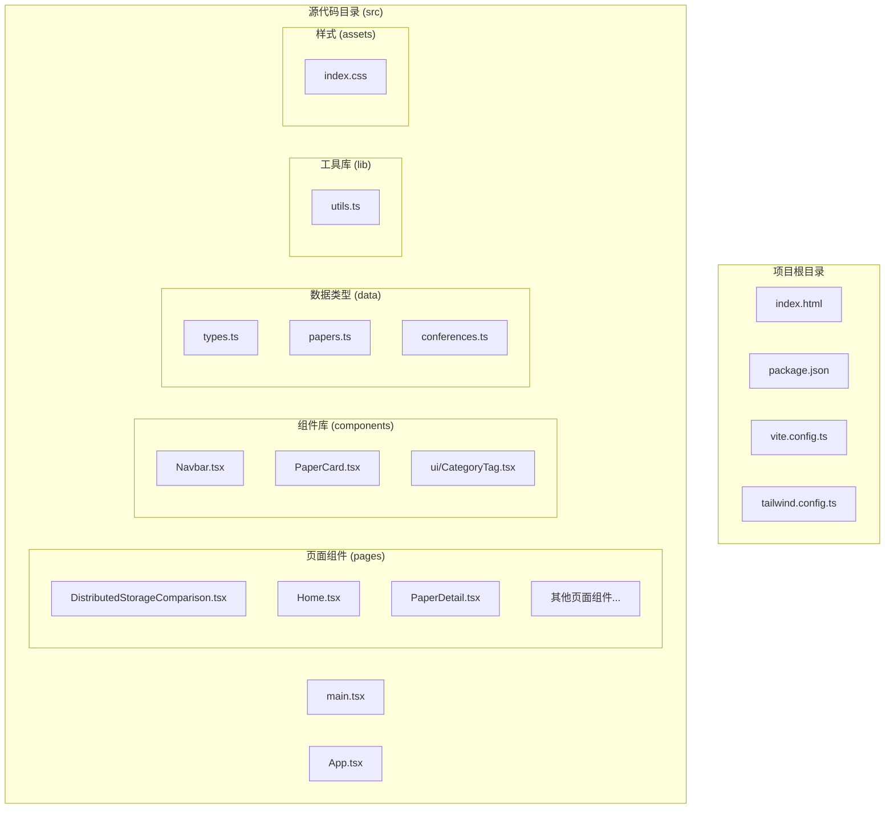
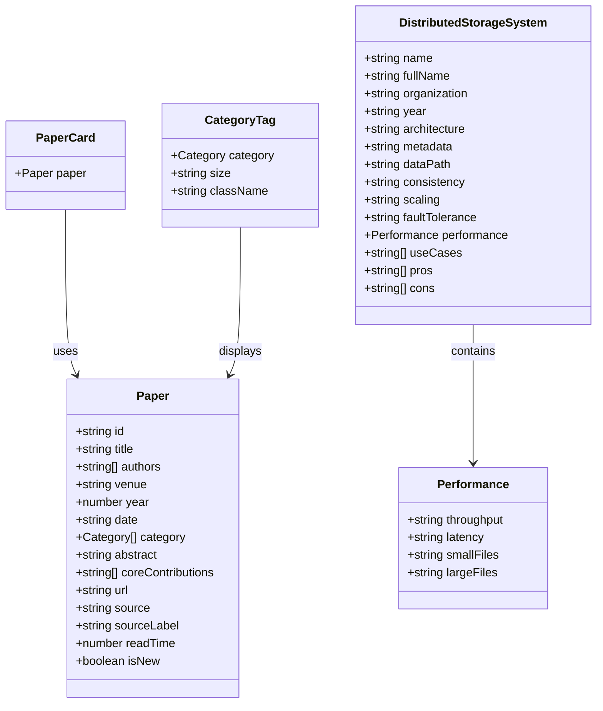
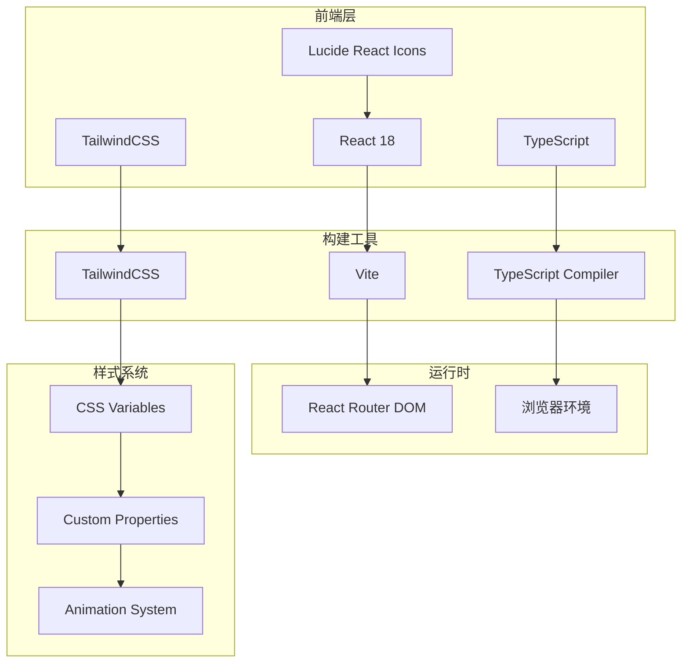
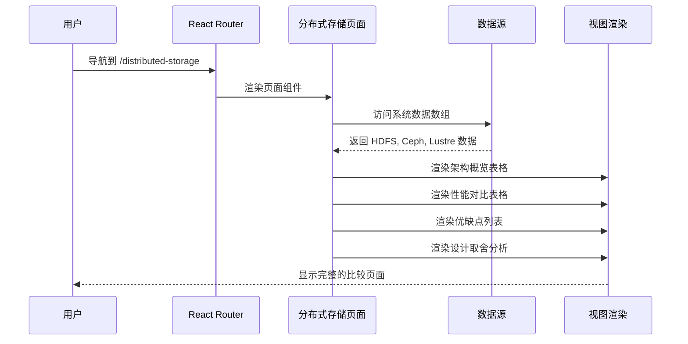
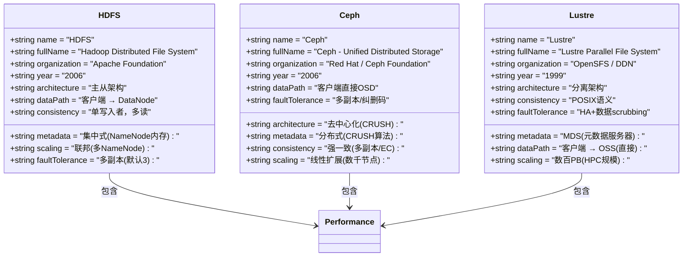
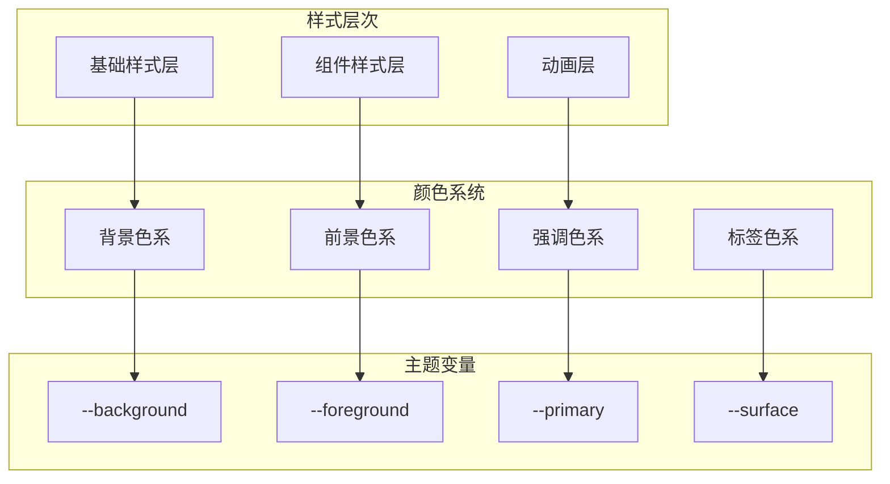
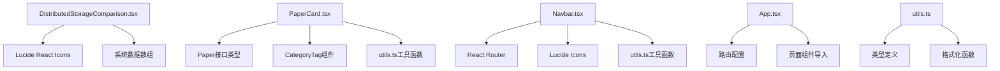

# 分布式存储比较页面

<cite>
**本文档引用的文件**
- [DistributedStorageComparison.tsx](file://src/pages/DistributedStorageComparison.tsx)
- [types.ts](file://src/data/types.ts)
- [PaperCard.tsx](file://src/components/PaperCard.tsx)
- [App.tsx](file://src/App.tsx)
- [Navbar.tsx](file://src/components/Navbar.tsx)
- [utils.ts](file://src/lib/utils.ts)
- [index.css](file://src/index.css)
- [tailwind.config.ts](file://tailwind.config.ts)
- [main.tsx](file://src/main.tsx)
- [package.json](file://package.json)
</cite>

## 目录
1. [简介](#简介)
2. [项目结构](#项目结构)
3. [核心组件](#核心组件)
4. [架构概览](#架构概览)
5. [详细组件分析](#详细组件分析)
6. [依赖关系分析](#依赖关系分析)
7. [性能考虑](#性能考虑)
8. [故障排除指南](#故障排除指南)
9. [结论](#结论)

## 简介

分布式存储比较页面是 StorageAI Reader 博客项目中的一个专门页面，用于对比分析三种主流分布式存储系统：HDFS（Hadoop 分布式文件系统）、Ceph（统一分布式存储）和 Lustre（并行文件系统）。该页面提供了深入的技术对比，包括架构设计、性能特征、使用场景和设计取舍等方面的全面分析。

该项目采用现代前端技术栈构建，使用 React 18、TypeScript 和 TailwindCSS，提供响应式设计和良好的用户体验。页面内容经过精心组织，以帮助读者理解不同分布式存储系统的特点和适用场景。

## 项目结构

该项目遵循现代化的 React 应用结构，主要目录组织如下：



**图表来源**
- [main.tsx:1-14](file://src/main.tsx#L1-L14)
- [App.tsx:1-55](file://src/App.tsx#L1-L55)
- [DistributedStorageComparison.tsx:1-393](file://src/pages/DistributedStorageComparison.tsx#L1-L393)

**章节来源**
- [main.tsx:1-14](file://src/main.tsx#L1-L14)
- [App.tsx:1-55](file://src/App.tsx#L1-L55)
- [package.json:1-32](file://package.json#L1-L32)

## 核心组件

### 主要数据结构

分布式存储比较页面的核心数据结构基于 TypeScript 接口定义，确保类型安全和开发体验：



**图表来源**
- [types.ts:13-48](file://src/data/types.ts#L13-L48)
- [DistributedStorageComparison.tsx:3-103](file://src/pages/DistributedStorageComparison.tsx#L3-L103)

### 页面路由配置

应用使用 React Router 进行页面导航，分布式存储比较页面通过以下路由配置：

| 路由路径 | 组件名称 | 功能描述 |
|---------|----------|----------|
| `/` | Home | 首页展示 |
| `/paper/:id` | PaperDetail | 论文详情页 |
| `/distributed-storage` | DistributedStorageComparison | 分布式存储比较页面 |
| `/fast2026` | Fast2026 | FAST 会议页面 |
| `/fast-archive` | FastArchive | FAST 历史归档 |
| `/osdi2025` | Osdi2025 | OSDI 会议页面 |

**章节来源**
- [App.tsx:24-52](file://src/App.tsx#L24-L52)
- [Navbar.tsx:6-25](file://src/components/Navbar.tsx#L6-L25)

## 架构概览

### 技术栈架构

该项目采用现代化的全栈技术架构，前端使用 React 18 和 TypeScript，构建工具使用 Vite：



**图表来源**
- [package.json:11-29](file://package.json#L11-L29)
- [tailwind.config.ts:18-98](file://tailwind.config.ts#L18-L98)

### 数据流架构

分布式存储比较页面的数据流采用声明式渲染模式：



**图表来源**
- [DistributedStorageComparison.tsx:105-392](file://src/pages/DistributedStorageComparison.tsx#L105-L392)

## 详细组件分析

### 分布式存储比较页面核心组件

#### 系统数据模型

页面包含三个主要分布式存储系统的详细数据模型：



**图表来源**
- [DistributedStorageComparison.tsx:3-103](file://src/pages/DistributedStorageComparison.tsx#L3-L103)

#### 性能对比表格

页面提供了详细的性能对比表格，涵盖四个关键性能指标：

| 存储系统 | 吞吐量 | 延迟 | 小文件 | 大文件 |
|---------|--------|------|--------|--------|
| HDFS | 高(顺序读写) | 高(秒级) | 差(NameNode内存限制) | 优秀 |
| Ceph | 高(TB/s级) | 中(毫秒-秒) | 一般 | 优秀 |
| Lustre | 极高(TB/s级) | 低(微秒-毫秒) | 一般 | 极致(HPC) |

#### 设计取舍分析

页面深入分析了三种存储系统的设计取舍：

1. **元数据管理：集中式 vs 分布式**
   - HDFS：NameNode集中管理元数据，简化设计但内存受限
   - Ceph：CRUSH算法计算数据位置，无元数据瓶颈
   - Lustre：MDS专门处理元数据，数据路径分离

2. **数据路径：客户端访问模式**
   - HDFS：客户端从NameNode获取块位置后直接访问DataNode
   - Ceph：客户端通过CRUSH算法直接计算数据位置
   - Lustre：元数据与数据路径完全分离

3. **一致性模型：CAP取舍**
   - HDFS：单写入者模型，适合批处理
   - Ceph：强一致性，支持多客户端并发写入
   - Lustre：完整POSIX语义，为HPC科学计算设计

**章节来源**
- [DistributedStorageComparison.tsx:105-392](file://src/pages/DistributedStorageComparison.tsx#L105-L392)

### 导航栏组件

导航栏组件提供了智能的导航体验，包含主要页面和下拉菜单功能：

```mermaid
flowchart TD
A[用户点击导航项] --> B{检查是否为活动页面}
B --> |是| C[保持当前样式]
B --> |否| D[更新URL路径]
D --> E[触发路由切换]
E --> F[重新渲染目标页面]
G[用户点击"更多"按钮] --> H[显示下拉菜单]
H --> I[用户选择子菜单项]
I --> J[关闭下拉菜单]
J --> K[导航到选中页面]
L[点击外部区域] --> M[自动关闭下拉菜单]
```

**图表来源**
- [Navbar.tsx:27-147](file://src/components/Navbar.tsx#L27-L147)

**章节来源**
- [Navbar.tsx:1-148](file://src/components/Navbar.tsx#L1-L148)

### 样式系统架构

项目采用基于 CSS 变量的样式系统，提供主题定制和动画效果：



**图表来源**
- [index.css:6-61](file://src/index.css#L6-L61)
- [tailwind.config.ts:23-58](file://tailwind.config.ts#L23-L58)

**章节来源**
- [index.css:1-158](file://src/index.css#L1-L158)
- [tailwind.config.ts:1-104](file://tailwind.config.ts#L1-L104)

## 依赖关系分析

### 外部依赖关系

项目的主要外部依赖包括：

```mermaid
graph LR
subgraph "核心依赖"
A[react ^18.3.1]
B[react-dom ^18.3.1]
C[react-router-dom ^7.1.1]
end
subgraph "UI库"
D[lucide-react ^0.468.0]
E[class-variance-authority ^0.7.1]
F[clsx ^2.1.1]
end
subgraph "样式系统"
G[tailwindcss ^3.4.17]
H[tailwind-merge ^2.6.0]
I[tailwindcss-animate ^1.0.7]
end
subgraph "开发工具"
J[@vitejs/plugin-react ^4.3.4]
K[typescript ~5.6.2]
L[vite ^6.0.5]
end
A --> C
D --> A
G --> A
H --> G
I --> G
```

**图表来源**
- [package.json:11-29](file://package.json#L11-L29)

### 内部模块依赖



**图表来源**
- [DistributedStorageComparison.tsx:1](file://src/pages/DistributedStorageComparison.tsx#L1)
- [PaperCard.tsx:1-73](file://src/components/PaperCard.tsx#L1-L73)
- [Navbar.tsx:1-148](file://src/components/Navbar.tsx#L1-L148)
- [App.tsx:1-55](file://src/App.tsx#L1-L55)
- [utils.ts:1-58](file://src/lib/utils.ts#L1-L58)

**章节来源**
- [package.json:1-32](file://package.json#L1-L32)

## 性能考虑

### 渲染性能优化

分布式存储比较页面在设计时考虑了多种性能优化策略：

1. **组件懒加载**：页面组件按需加载，减少初始包大小
2. **虚拟滚动**：对于大量数据的场景，可以考虑实现虚拟滚动
3. **图片优化**：使用现代图片格式和适当的尺寸
4. **CSS优化**：使用TailwindCSS的原子化样式，避免重复样式定义

### 内存使用优化

- **数据结构优化**：使用扁平化的数据结构，避免深层嵌套
- **状态管理**：页面状态简单，不需要复杂的全局状态管理
- **事件处理**：使用防抖和节流技术处理高频事件

### 网络性能

- **资源压缩**：使用Vite进行代码分割和压缩
- **缓存策略**：合理设置HTTP缓存头
- **CDN集成**：静态资源可以通过CDN加速

## 故障排除指南

### 常见问题及解决方案

#### 页面无法渲染

**症状**：页面空白或显示错误

**可能原因**：
1. 路由配置错误
2. 组件导入失败
3. 样式文件加载问题

**解决步骤**：
1. 检查路由配置是否正确
2. 验证组件文件路径
3. 确认样式文件编译成功

#### 图标显示异常

**症状**：Lucide图标不显示或显示为方框

**解决方法**：
1. 确认lucide-react包已正确安装
2. 检查图标导入语句
3. 验证字体文件加载

#### 样式不生效

**症状**：页面样式混乱或主题不正确

**解决步骤**：
1. 检查TailwindCSS配置
2. 确认CSS变量定义正确
3. 验证样式优先级

**章节来源**
- [DistributedStorageComparison.tsx:105-392](file://src/pages/DistributedStorageComparison.tsx#L105-L392)
- [Navbar.tsx:27-147](file://src/components/Navbar.tsx#L27-L147)

## 结论

分布式存储比较页面是一个设计精良的技术文档页面，成功地实现了以下目标：

### 设计成就

1. **信息架构清晰**：通过表格和分组的方式，有效地组织了复杂的存储系统对比信息
2. **视觉层次分明**：使用渐变色彩和卡片式布局，提供了良好的视觉体验
3. **响应式设计**：适配各种设备尺寸，确保移动端可用性
4. **类型安全**：使用TypeScript确保代码质量和开发效率

### 技术亮点

1. **现代化技术栈**：React 18 + TypeScript + TailwindCSS的组合提供了优秀的开发体验
2. **组件化设计**：良好的组件拆分便于维护和复用
3. **主题系统**：基于CSS变量的主题系统支持灵活的样式定制
4. **路由集成**：与整体应用的路由系统无缝集成

### 改进建议

1. **交互增强**：可以添加筛选和排序功能，让用户更好地探索数据
2. **数据可视化**：使用图表更直观地展示性能对比
3. **搜索功能**：添加全文搜索功能，方便查找特定信息
4. **多语言支持**：考虑添加国际化支持

这个页面为分布式存储领域的学习者和从业者提供了宝贵的参考资料，通过清晰的对比和深入的分析，帮助用户做出明智的技术选择。