# 团队信息页面

<cite>
**本文档引用的文件**
- [Teams.tsx](file://src/pages/Teams.tsx)
- [TeamDetail.tsx](file://src/pages/TeamDetail.tsx)
- [teams.ts](file://src/data/teams.ts)
- [types.ts](file://src/data/types.ts)
- [utils.ts](file://src/lib/utils.ts)
- [App.tsx](file://src/App.tsx)
- [index.css](file://src/index.css)
- [Navbar.tsx](file://src/components/Navbar.tsx)
</cite>

## 目录
1. [简介](#简介)
2. [项目结构](#项目结构)
3. [核心组件](#核心组件)
4. [架构概览](#架构概览)
5. [详细组件分析](#详细组件分析)
6. [依赖关系分析](#依赖关系分析)
7. [性能考虑](#性能考虑)
8. [故障排除指南](#故障排除指南)
9. [结论](#结论)

## 简介

本项目是一个专注于存储与系统研究领域的学术信息平台，特别关注中国顶级存储研究团队的信息展示。团队信息页面是该平台的核心功能模块之一，提供了研究团队的全面信息展示、团队成员管理以及团队论文统计等功能。

该页面系统采用React + TypeScript + TailwindCSS技术栈构建，实现了响应式设计和现代化的用户界面。页面主要包含两个核心组件：团队列表页面（Teams）和团队详情页面（TeamDetail），两者通过路由进行导航关联。

## 项目结构

项目采用按功能模块组织的目录结构，团队信息相关的核心文件分布如下：

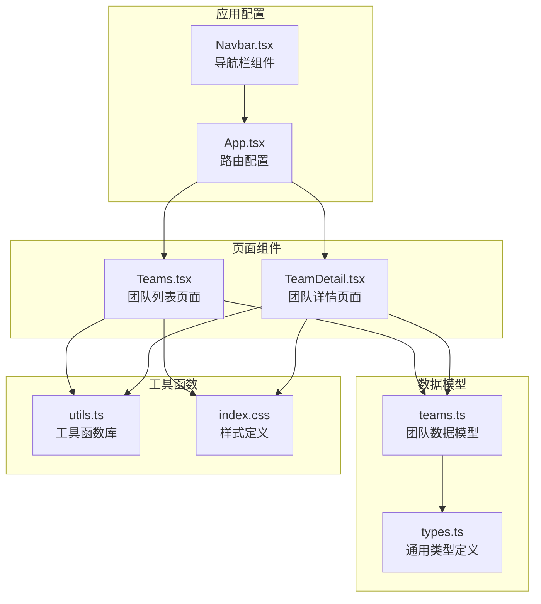

**图表来源**
- [Teams.tsx:1-134](file://src/pages/Teams.tsx#L1-L134)
- [TeamDetail.tsx:1-194](file://src/pages/TeamDetail.tsx#L1-L194)
- [teams.ts:1-168](file://src/data/teams.ts#L1-L168)
- [types.ts:1-49](file://src/data/types.ts#L1-L49)
- [utils.ts:1-58](file://src/lib/utils.ts#L1-L58)
- [App.tsx:1-45](file://src/App.tsx#L1-L45)

**章节来源**
- [Teams.tsx:1-134](file://src/pages/Teams.tsx#L1-L134)
- [TeamDetail.tsx:1-194](file://src/pages/TeamDetail.tsx#L1-L194)
- [teams.ts:1-168](file://src/data/teams.ts#L1-L168)
- [App.tsx:1-45](file://src/App.tsx#L1-L45)

## 核心组件

### 数据模型设计

团队信息页面的数据模型采用了清晰的层次化设计，确保了数据的一致性和可维护性：

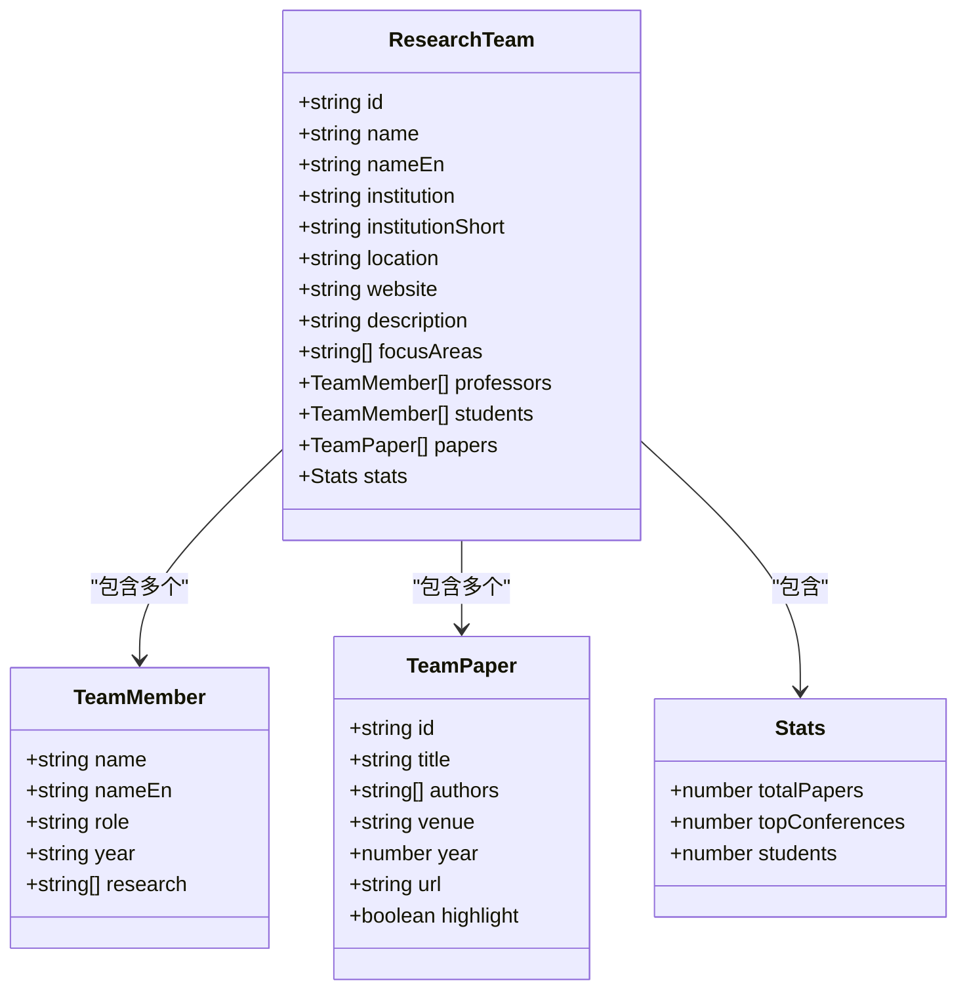

**图表来源**
- [teams.ts:19-37](file://src/data/teams.ts#L19-L37)
- [teams.ts:1-7](file://src/data/teams.ts#L1-L7)

### 组件架构

团队信息页面由两个主要组件构成，每个组件都有明确的职责分工：

1. **Teams组件**：负责团队列表的展示，提供团队的基本信息预览
2. **TeamDetail组件**：负责单个团队的详细信息展示，包括成员、论文等完整信息

**章节来源**
- [teams.ts:19-37](file://src/data/teams.ts#L19-L37)
- [teams.ts:1-7](file://src/data/teams.ts#L1-L7)

## 架构概览

团队信息页面的整体架构体现了清晰的关注点分离和模块化设计：

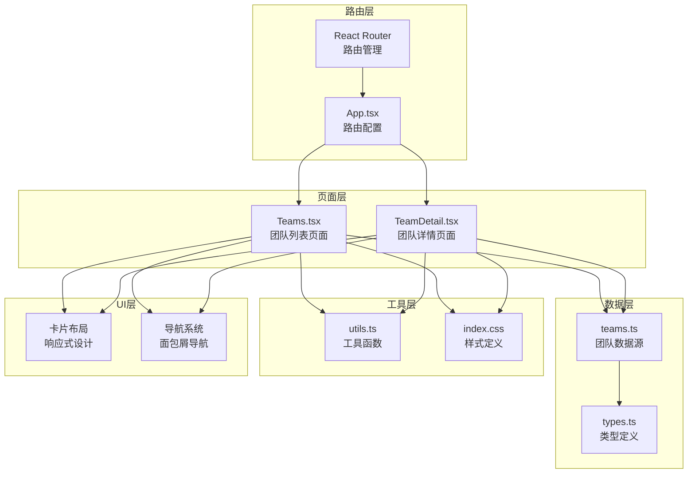

**图表来源**
- [App.tsx:19-42](file://src/App.tsx#L19-L42)
- [Teams.tsx:1-134](file://src/pages/Teams.tsx#L1-L134)
- [TeamDetail.tsx:1-194](file://src/pages/TeamDetail.tsx#L1-L194)

## 详细组件分析

### Teams组件分析

Teams组件作为团队信息页面的入口，负责展示所有研究团队的概览信息。

#### 核心功能特性

1. **团队卡片展示**：每个团队以卡片形式展示，包含基本信息、统计数据和快速预览
2. **响应式布局**：使用TailwindCSS实现自适应布局，支持不同屏幕尺寸
3. **导航集成**：每个团队卡片都包含到详情页的链接

#### 数据展示结构

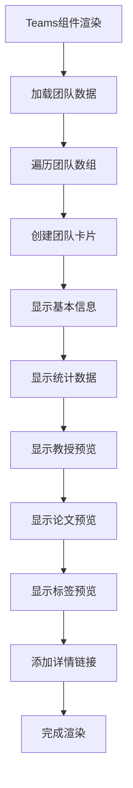

**图表来源**
- [Teams.tsx:23-123](file://src/pages/Teams.tsx#L23-L123)

#### 关键实现细节

- **统计数据展示**：使用三列网格展示论文总数、顶级会议数量和在读学生数
- **教授信息处理**：限制显示前3位教授，超过部分显示计数
- **论文预览功能**：展示最新的3篇论文及其关键信息
- **标签系统**：限制显示前4个研究方向标签

**章节来源**
- [Teams.tsx:22-124](file://src/pages/Teams.tsx#L22-L124)

### TeamDetail组件分析

TeamDetail组件提供单个研究团队的完整信息展示，是团队信息页面的核心组件。

#### 导航逻辑

组件实现了智能的导航逻辑，包括：

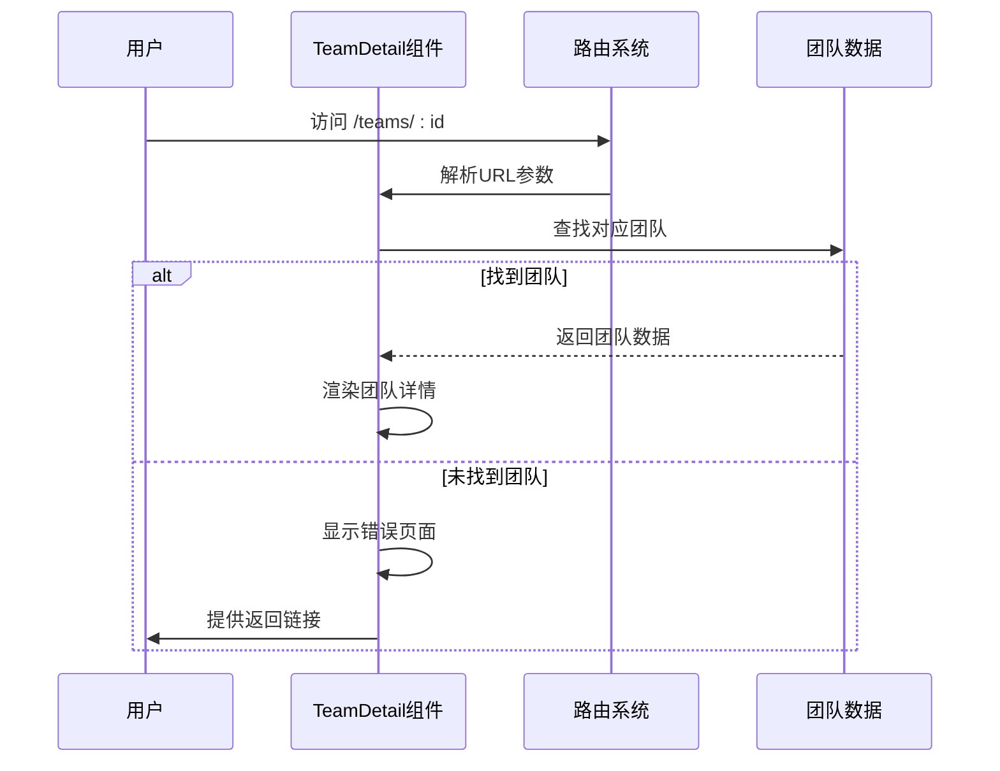

**图表来源**
- [TeamDetail.tsx:6-20](file://src/pages/TeamDetail.tsx#L6-L20)

#### 动态加载机制

组件实现了高效的动态加载策略：

1. **参数解析**：使用useParams获取团队ID参数
2. **数据查找**：通过teams.find方法查找匹配的团队
3. **错误处理**：当找不到团队时显示友好的错误页面
4. **数据分组**：将论文按年份分组，便于展示

#### 详细信息组织

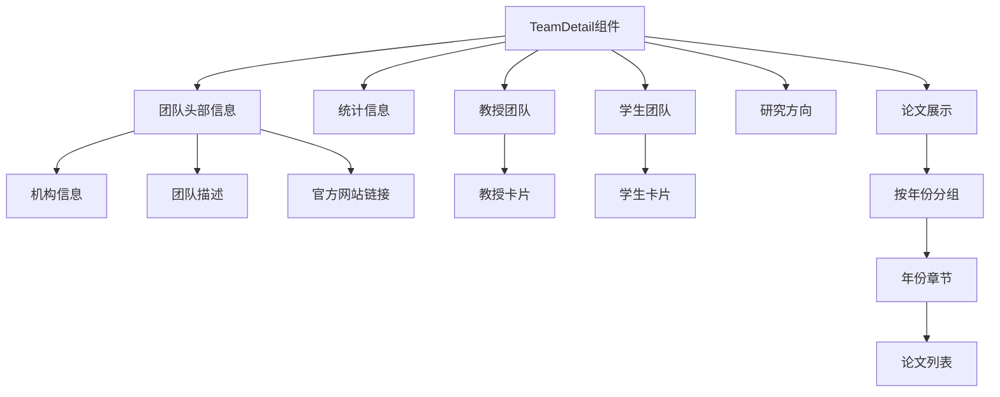

**图表来源**
- [TeamDetail.tsx:30-191](file://src/pages/TeamDetail.tsx#L30-L191)

**章节来源**
- [TeamDetail.tsx:1-194](file://src/pages/TeamDetail.tsx#L1-L194)

### 数据模型详解

团队数据模型采用了类型安全的设计，确保了数据的完整性和一致性。

#### 团队成员模型

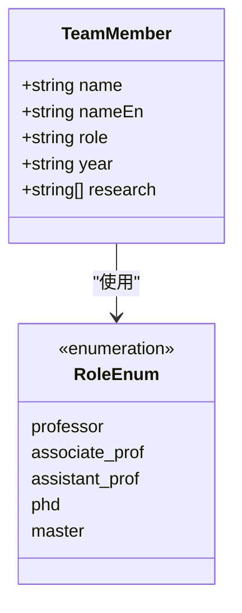

**图表来源**
- [teams.ts:1-7](file://src/data/teams.ts#L1-L7)

#### 论文模型设计

论文模型包含了丰富的元数据信息：

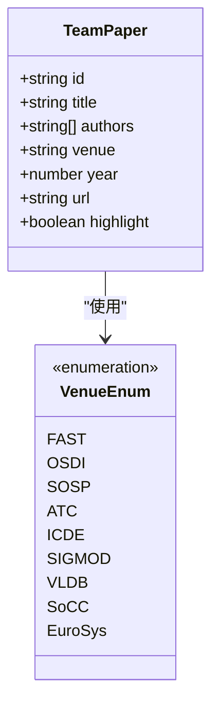

**图表来源**
- [teams.ts:9-17](file://src/data/teams.ts#L9-L17)

**章节来源**
- [teams.ts:1-168](file://src/data/teams.ts#L1-L168)

### 样式系统分析

团队信息页面采用了现代化的样式系统，结合了TailwindCSS和自定义CSS变量：

#### 主题设计

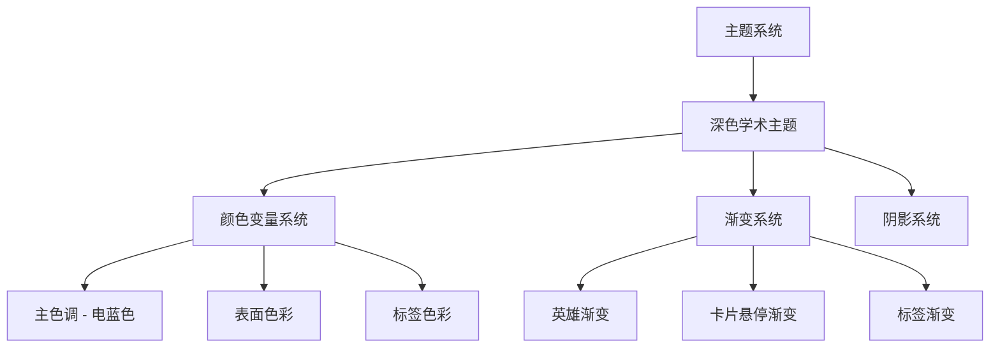

**图表来源**
- [index.css:5-61](file://src/index.css#L5-L61)

#### 响应式设计

页面实现了完整的响应式设计，支持从移动端到桌面端的各种设备：

- **移动端**：单列布局，适合触摸操作
- **平板端**：双列布局，平衡信息密度和可读性
- **桌面端**：多列布局，充分利用屏幕空间

**章节来源**
- [index.css:1-158](file://src/index.css#L1-L158)

## 依赖关系分析

团队信息页面的依赖关系体现了清晰的模块化架构：

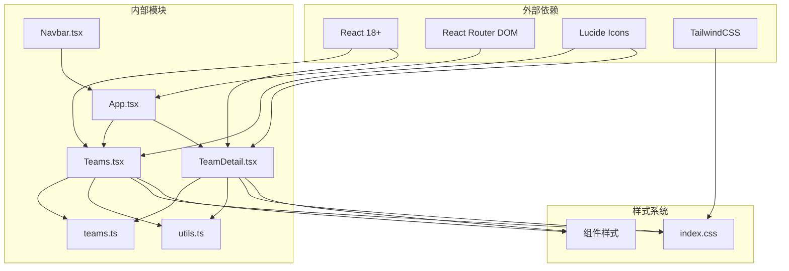

**图表来源**
- [App.tsx:1-18](file://src/App.tsx#L1-L18)
- [Teams.tsx:1-5](file://src/pages/Teams.tsx#L1-L5)
- [TeamDetail.tsx:1-5](file://src/pages/TeamDetail.tsx#L1-L5)

### 组件耦合度分析

团队信息页面展现了良好的低耦合设计：

- **Teams组件**：仅依赖teams数据源和基础UI组件
- **TeamDetail组件**：依赖teams数据源、路由参数和工具函数
- **数据模型**：独立于UI组件，便于测试和维护
- **工具函数**：提供通用功能，避免重复代码

**章节来源**
- [App.tsx:19-42](file://src/App.tsx#L19-L42)
- [utils.ts:1-58](file://src/lib/utils.ts#L1-L58)

## 性能考虑

团队信息页面在设计时充分考虑了性能优化：

### 数据加载优化

1. **静态数据加载**：团队数据作为静态导入，避免了网络请求开销
2. **内存缓存**：数据在应用启动时加载到内存中，后续访问无需重新加载
3. **懒加载策略**：页面组件按需加载，减少初始包大小

### 渲染性能优化

1. **虚拟滚动**：对于大量数据的场景，可以考虑实现虚拟滚动
2. **组件记忆化**：使用React.memo避免不必要的重渲染
3. **CSS动画优化**：使用transform属性替代position属性进行动画

### 缓存策略

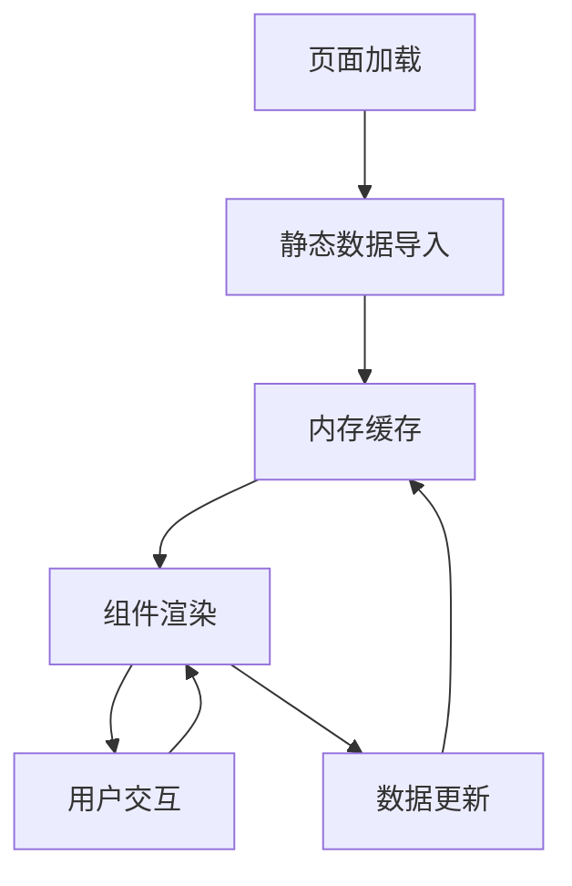

## 故障排除指南

### 常见问题及解决方案

#### 团队详情页面空白问题

**问题描述**：访问团队详情页面时显示空白或错误信息

**可能原因**：
1. 团队ID不正确或不存在
2. 数据源加载失败
3. 路由配置问题

**解决步骤**：
1. 检查URL中的团队ID是否正确
2. 验证teams数据源中是否存在该团队
3. 确认路由配置是否正确

#### 样式显示异常

**问题描述**：页面样式显示不符合预期

**可能原因**：
1. TailwindCSS配置问题
2. CSS变量未正确加载
3. 浏览器兼容性问题

**解决步骤**：
1. 检查index.css文件是否正确导入
2. 验证CSS变量定义是否完整
3. 测试不同浏览器的兼容性

#### 响应式布局问题

**问题描述**：在某些设备上布局显示异常

**解决步骤**：
1. 使用浏览器开发者工具检查断点设置
2. 验证TailwindCSS的响应式类名
3. 测试不同屏幕尺寸下的表现

**章节来源**
- [TeamDetail.tsx:10-20](file://src/pages/TeamDetail.tsx#L10-L20)
- [index.css:1-158](file://src/index.css#L1-L158)

## 结论

团队信息页面展现了现代Web应用的良好实践，具有以下特点：

### 设计优势

1. **清晰的架构**：组件职责明确，数据流清晰
2. **优秀的用户体验**：响应式设计，导航直观
3. **类型安全**：TypeScript提供完整的类型安全保障
4. **可维护性**：模块化设计，易于扩展和维护

### 技术亮点

1. **现代化技术栈**：React + TypeScript + TailwindCSS的组合
2. **性能优化**：静态数据加载和内存缓存策略
3. **设计系统**：完整的主题和样式系统
4. **无障碍设计**：考虑了不同用户的需求

### 改进建议

1. **数据验证**：增加更严格的数据验证机制
2. **国际化支持**：考虑添加多语言支持
3. **SEO优化**：增强搜索引擎优化功能
4. **性能监控**：添加性能监控和错误报告

该团队信息页面为存储与系统研究领域的信息展示提供了一个优秀的参考实现，其设计理念和实现方式值得其他类似项目借鉴。