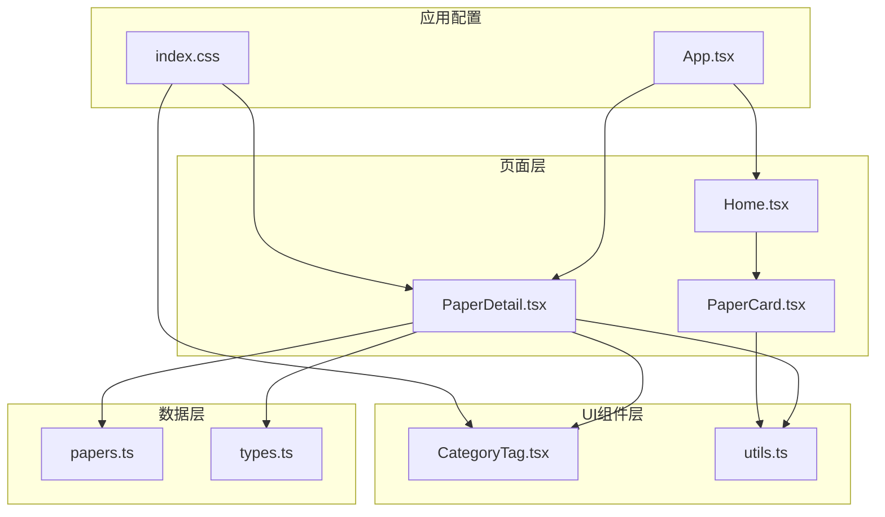
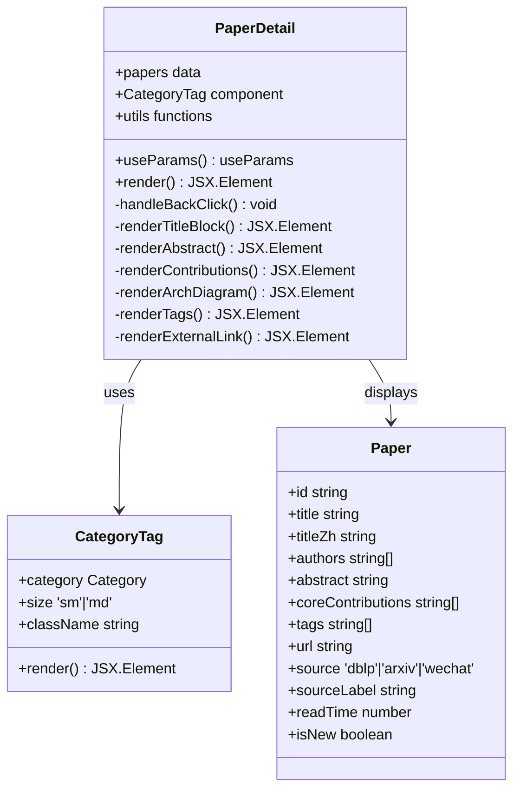
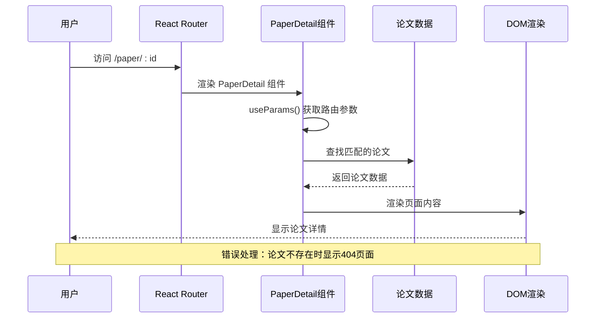
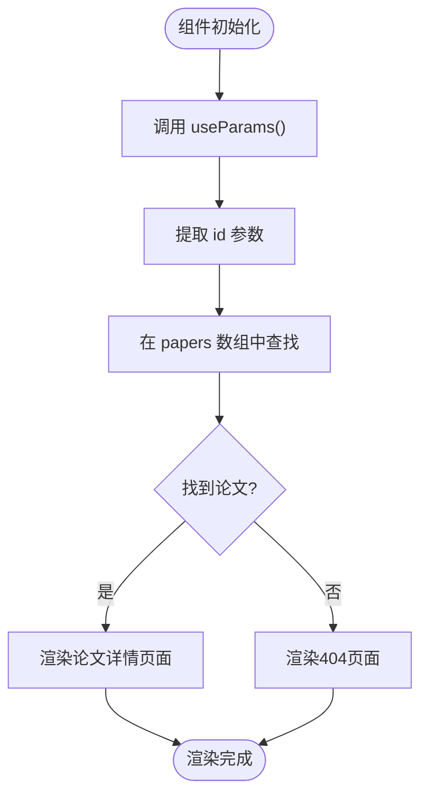
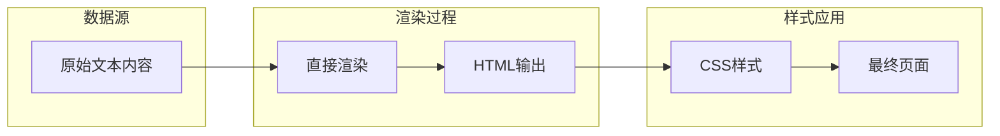
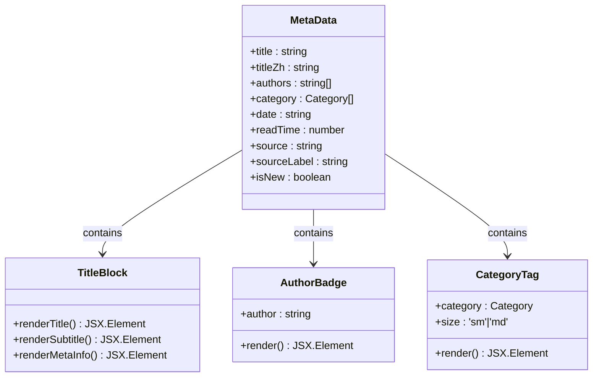
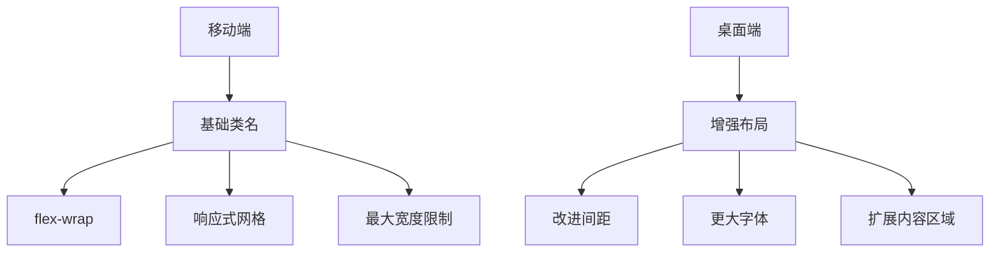
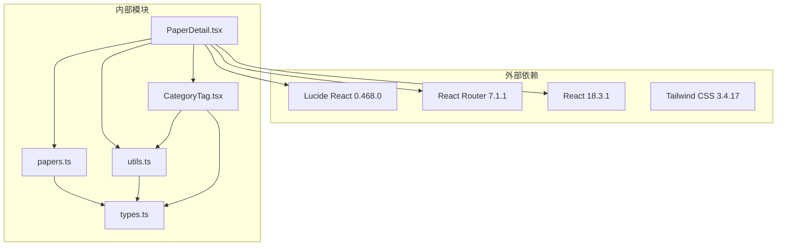
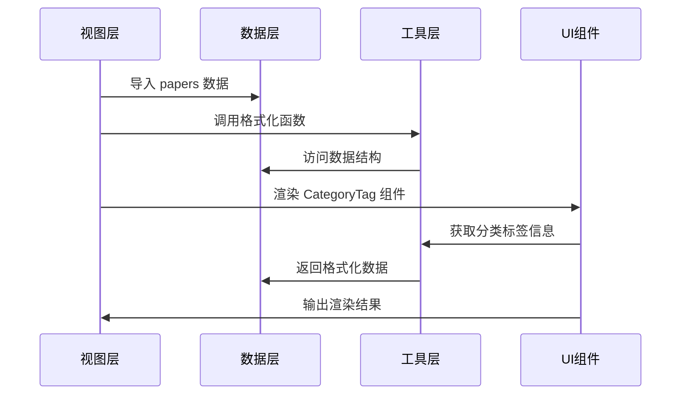
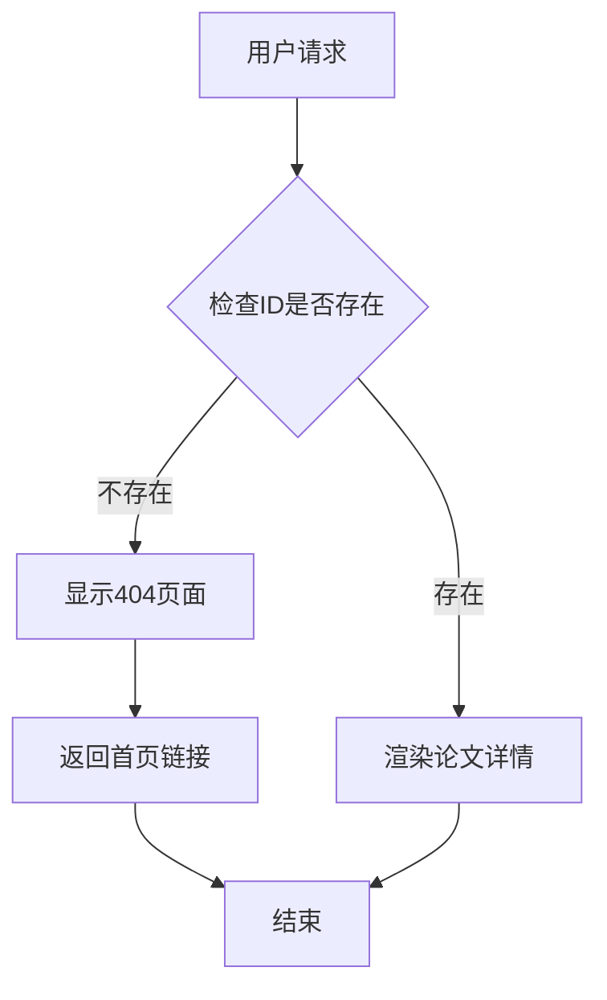

# 论文详情页面

<cite>
**本文档引用的文件**
- [PaperDetail.tsx](file://src/pages/PaperDetail.tsx)
- [papers.ts](file://src/data/papers.ts)
- [types.ts](file://src/data/types.ts)
- [utils.ts](file://src/lib/utils.ts)
- [CategoryTag.tsx](file://src/components/ui/CategoryTag.tsx)
- [App.tsx](file://src/App.tsx)
- [index.css](file://src/index.css)
- [Home.tsx](file://src/pages/Home.tsx)
- [PaperCard.tsx](file://src/components/PaperCard.tsx)
</cite>

## 目录
1. [简介](#简介)
2. [项目结构](#项目结构)
3. [核心组件](#核心组件)
4. [架构概览](#架构概览)
5. [详细组件分析](#详细组件分析)
6. [依赖关系分析](#依赖关系分析)
7. [性能考虑](#性能考虑)
8. [故障排除指南](#故障排除指南)
9. [结论](#结论)

## 简介

论文详情页面是 cs336 项目中的核心功能模块，负责展示学术论文的详细信息。该页面实现了完整的论文信息展示、作者信息展示、摘要内容渲染和引用文献处理等功能。本文档将深入解析 PaperDetail.tsx 组件的实现细节，包括路由参数获取机制、论文数据的获取和缓存策略、Markdown 内容渲染处理、论文元数据的展示格式、相关链接的生成规则和页面 SEO 优化策略。

## 项目结构

cs336 项目采用 React + Vite 架构，采用按功能组织的文件结构。论文详情页面位于 `src/pages/PaperDetail.tsx`，与数据模型、工具函数和 UI 组件紧密协作。

**图表来源**
- [PaperDetail.tsx:1-151](file://src/pages/PaperDetail.tsx#L1-L151)
- [papers.ts:1-815](file://src/data/papers.ts#L1-L815)
- [types.ts:1-49](file://src/data/types.ts#L1-L49)

**章节来源**
- [PaperDetail.tsx:1-151](file://src/pages/PaperDetail.tsx#L1-L151)
- [App.tsx:1-45](file://src/App.tsx#L1-L45)

## 核心组件

### PaperDetail 组件架构

PaperDetail 组件是一个纯函数组件，负责渲染单个论文的详细信息。组件采用函数式编程模式，使用 React Hooks 进行状态管理和副作用处理。

**图表来源**
- [PaperDetail.tsx:7-151](file://src/pages/PaperDetail.tsx#L7-L151)
- [CategoryTag.tsx:11-24](file://src/components/ui/CategoryTag.tsx#L11-L24)
- [types.ts:13-34](file://src/data/types.ts#L13-L34)

### 数据模型设计

项目使用 TypeScript 类型系统确保数据完整性。Paper 接口定义了论文的所有属性，包括国际化标题、作者列表、摘要、核心贡献、标签等。

**章节来源**
- [types.ts:13-34](file://src/data/types.ts#L13-L34)
- [papers.ts:3-815](file://src/data/papers.ts#L3-L815)

## 架构概览

论文详情页面采用客户端路由模式，通过 React Router 实现页面导航。数据通过静态导入的方式提供，无需额外的 API 调用。

**图表来源**
- [App.tsx:25](file://src/App.tsx#L25)
- [PaperDetail.tsx:8-21](file://src/pages/PaperDetail.tsx#L8-L21)

## 详细组件分析

### 路由参数获取机制

PaperDetail 组件使用 React Router 的 useParams Hook 获取路由参数。路由配置在 App.tsx 中定义，路径模式为 `/paper/:id`。

**图表来源**
- [PaperDetail.tsx:8](file://src/pages/PaperDetail.tsx#L8)
- [App.tsx:25](file://src/App.tsx#L25)

**章节来源**
- [PaperDetail.tsx:8-21](file://src/pages/PaperDetail.tsx#L8-L21)
- [App.tsx:25](file://src/App.tsx#L25)

### 论文数据获取和缓存策略

项目采用静态数据导入策略，所有论文数据通过 `papers.ts` 文件集中管理。这种设计具有以下特点：

1. **本地缓存**：数据在构建时就包含在打包文件中，无需运行时网络请求
2. **类型安全**：TypeScript 类型系统确保数据结构的一致性
3. **性能优化**：避免了 API 调用的延迟和错误处理复杂性
4. **离线支持**：页面可以在没有网络连接的情况下正常工作

**章节来源**
- [papers.ts:1-815](file://src/data/papers.ts#L1-L815)
- [PaperDetail.tsx:2](file://src/pages/PaperDetail.tsx#L2)

### Markdown 内容渲染处理

项目中使用纯文本而非 Markdown 格式存储内容。所有文本内容都是直接的字符串，不需要额外的解析处理。

**图表来源**
- [papers.ts:14-143](file://src/data/papers.ts#L14-L143)
- [PaperDetail.tsx:81-83](file://src/pages/PaperDetail.tsx#L81-L83)

**章节来源**
- [papers.ts:14-143](file://src/data/papers.ts#L14-L143)
- [PaperDetail.tsx:81-83](file://src/pages/PaperDetail.tsx#L81-L83)

### 论文元数据展示格式

论文元数据通过多种组件和样式进行展示，包括标题、作者、分类标签、日期和阅读时长等信息。

**图表来源**
- [PaperDetail.tsx:32-70](file://src/pages/PaperDetail.tsx#L32-L70)
- [utils.ts:29-57](file://src/lib/utils.ts#L29-L57)

**章节来源**
- [PaperDetail.tsx:32-70](file://src/pages/PaperDetail.tsx#L32-L70)
- [utils.ts:29-57](file://src/lib/utils.ts#L29-L57)

### 相关链接生成规则

外部链接通过 `url` 字段生成，使用 `ExternalLink` 图标和 `查看原始论文` 文本提示。链接采用新窗口打开，确保用户体验的连续性。

**章节来源**
- [PaperDetail.tsx:138-147](file://src/pages/PaperDetail.tsx#L138-L147)
- [papers.ts:23-143](file://src/data/papers.ts#L23-L143)

### 页面 SEO 优化策略

项目采用静态内容生成，具有良好的 SEO 基础。虽然没有专门的 SEO 配置文件，但以下特性有助于搜索引擎优化：

1. **语义化 HTML 结构**：使用适当的标题层级和语义标签
2. **内容丰富性**：包含论文标题、摘要、作者等结构化信息
3. **响应式设计**：适配各种设备尺寸
4. **快速加载**：静态数据无需网络请求

**章节来源**
- [PaperDetail.tsx:45-60](file://src/pages/PaperDetail.tsx#L45-L60)

### 响应式设计实现

项目使用 Tailwind CSS 实现响应式设计，采用移动优先的策略：

**图表来源**
- [index.css:1-158](file://src/index.css#L1-L158)
- [PaperDetail.tsx:24](file://src/pages/PaperDetail.tsx#L24)

**章节来源**
- [index.css:1-158](file://src/index.css#L1-L158)
- [PaperDetail.tsx:24](file://src/pages/PaperDetail.tsx#L24)

### 滚动行为控制

页面使用默认的浏览器滚动行为，没有特殊的滚动控制逻辑。主要内容区域设置最大宽度并居中显示，确保在不同屏幕尺寸下的良好可读性。

**章节来源**
- [PaperDetail.tsx:24](file://src/pages/PaperDetail.tsx#L24)

### 页面加载状态处理

由于采用静态数据加载，页面没有复杂的加载状态管理。组件在渲染时立即显示内容，如果找不到匹配的论文则显示 404 页面。

**章节来源**
- [PaperDetail.tsx:11-21](file://src/pages/PaperDetail.tsx#L11-L21)

## 依赖关系分析

### 组件依赖图

**图表来源**
- [PaperDetail.tsx:1-5](file://src/pages/PaperDetail.tsx#L1-L5)
- [package.json:11-30](file://package.json#L11-L30)

### 数据流分析

**图表来源**
- [PaperDetail.tsx:2-5](file://src/pages/PaperDetail.tsx#L2-L5)
- [utils.ts:9-57](file://src/lib/utils.ts#L9-L57)

**章节来源**
- [PaperDetail.tsx:1-5](file://src/pages/PaperDetail.tsx#L1-L5)
- [utils.ts:9-57](file://src/lib/utils.ts#L9-L57)

## 性能考虑

### 静态数据优化

项目采用静态数据导入策略，具有以下性能优势：

1. **零网络延迟**：数据在构建时就包含在包中
2. **类型检查**：编译时发现类型错误
3. **缓存友好**：浏览器可以缓存静态资源
4. **服务器压力小**：无需后端 API 调用

### 组件渲染优化

1. **纯函数组件**：避免不必要的状态管理
2. **条件渲染**：仅渲染存在的元素（如架构图）
3. **样式复用**：使用 Tailwind CSS 类名减少样式计算
4. **图标优化**：使用 SVG 图标库，体积小且可缩放

### 内存使用优化

1. **数据共享**：多个页面共享同一份数据引用
2. **无状态组件**：减少组件实例化开销
3. **事件委托**：使用简单的事件处理机制

## 故障排除指南

### 常见问题和解决方案

#### 404 页面处理

当访问不存在的论文 ID 时，组件会显示友好的 404 页面：

**图表来源**
- [PaperDetail.tsx:11-21](file://src/pages/PaperDetail.tsx#L11-L21)

**章节来源**
- [PaperDetail.tsx:11-21](file://src/pages/PaperDetail.tsx#L11-L21)

#### 数据格式错误

如果论文数据格式不正确，可能导致渲染异常：

1. **检查数据完整性**：确保所有必需字段都存在
2. **验证类型定义**：确认数据符合 TypeScript 接口
3. **调试输出**：在开发环境中添加 console.log 进行调试

#### 样式问题

样式问题通常由以下原因引起：

1. **Tailwind 配置**：检查 `tailwind.config.ts` 是否正确配置
2. **CSS 优先级**：确保自定义样式不会被覆盖
3. **响应式断点**：验证断点设置是否符合预期

**章节来源**
- [index.css:1-158](file://src/index.css#L1-L158)

### 性能监控

1. **构建分析**：使用 Vite 的构建分析工具检查包大小
2. **运行时监控**：使用浏览器开发者工具监控渲染性能
3. **内存泄漏检测**：定期检查组件卸载时的清理情况

## 结论

论文详情页面组件展现了现代 React 应用的最佳实践。通过静态数据导入、类型安全的 TypeScript 使用、响应式设计和简洁的组件架构，实现了高性能、可维护的论文展示功能。

主要优势包括：
- **简单可靠**：无需复杂的 API 集成
- **类型安全**：编译时发现潜在错误
- **性能优秀**：静态内容加载速度快
- **易于维护**：清晰的组件结构和数据模型

未来可以考虑的改进方向：
- 添加 Markdown 渲染支持
- 实现内容缓存机制
- 增强 SEO 功能
- 添加内容分享功能