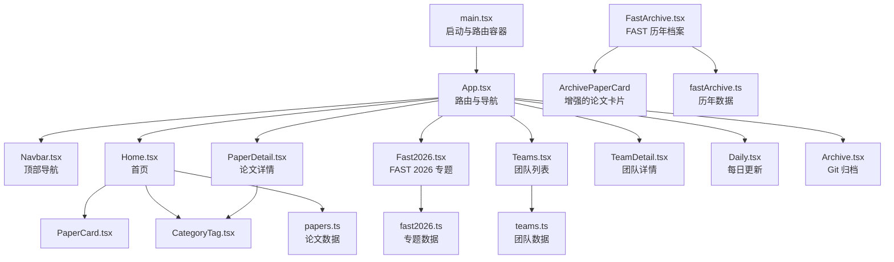
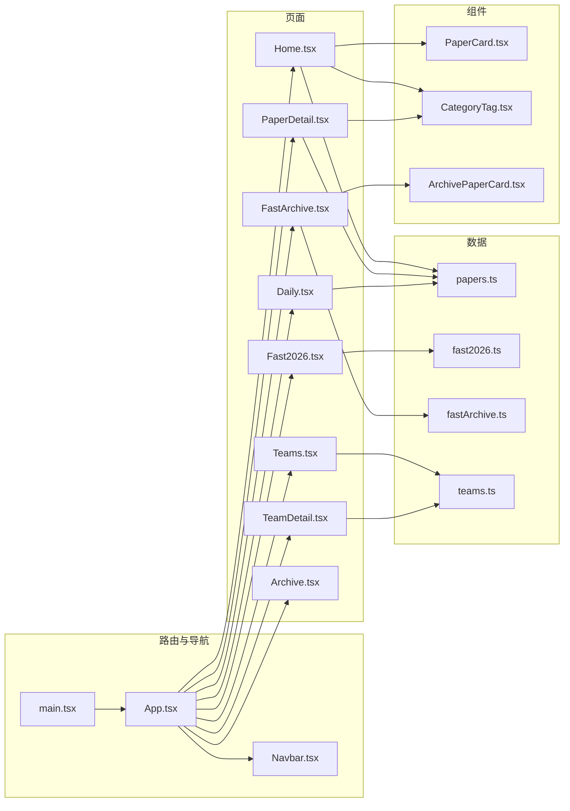
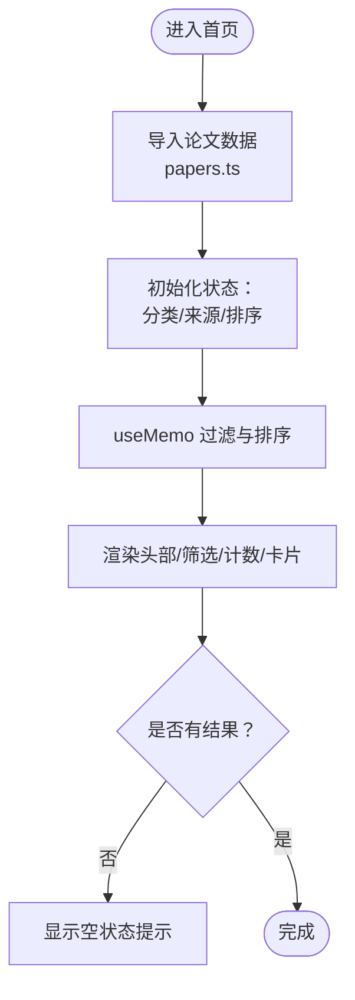
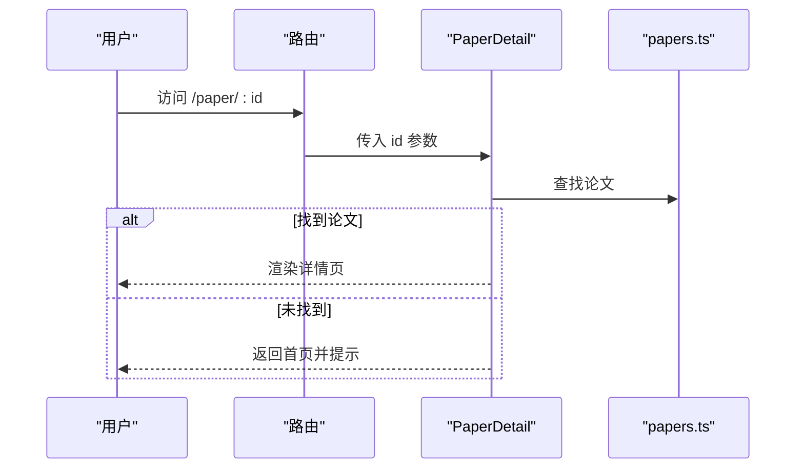
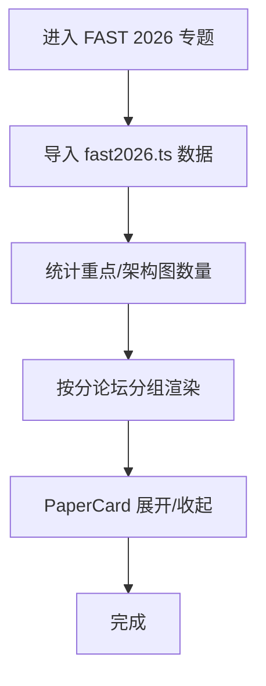
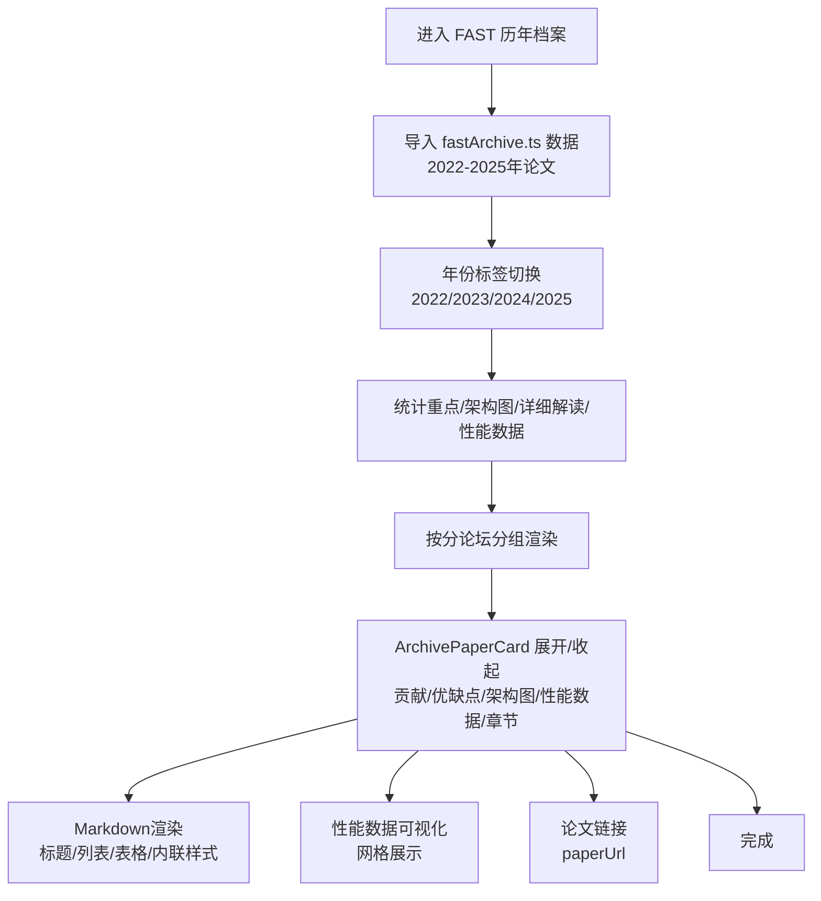
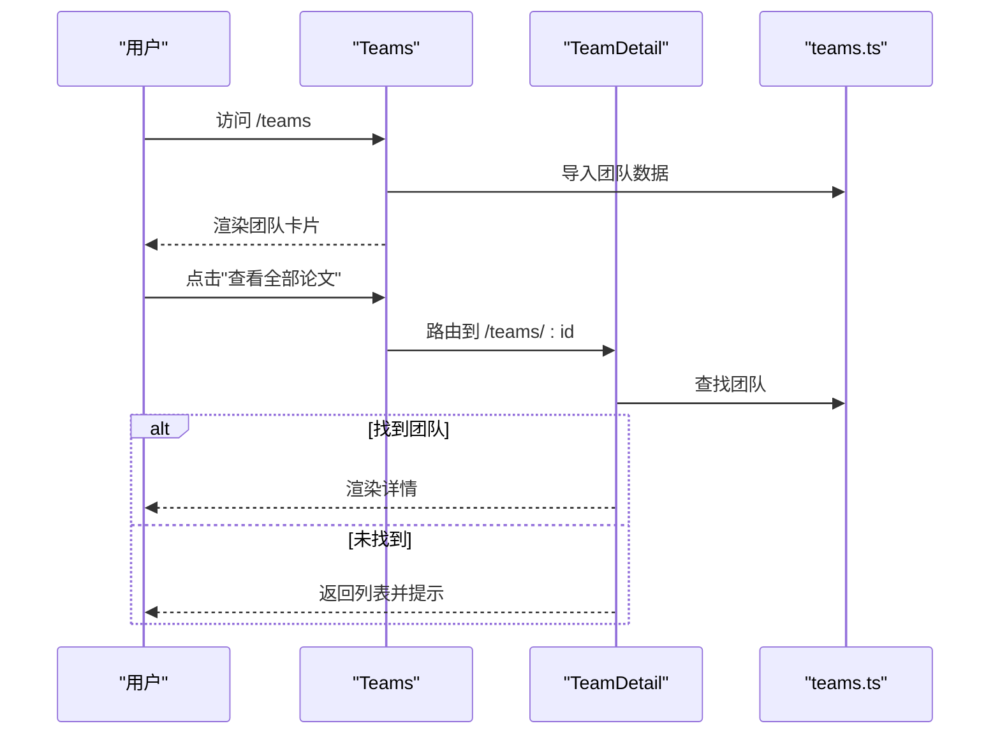
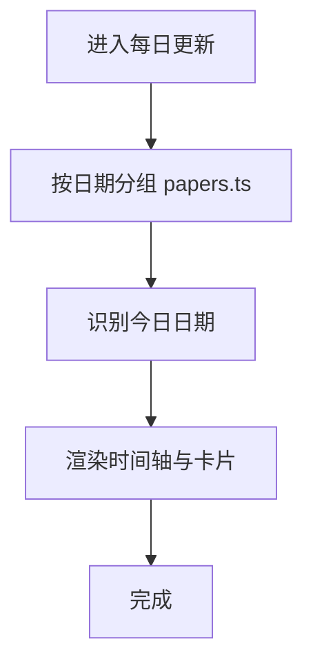
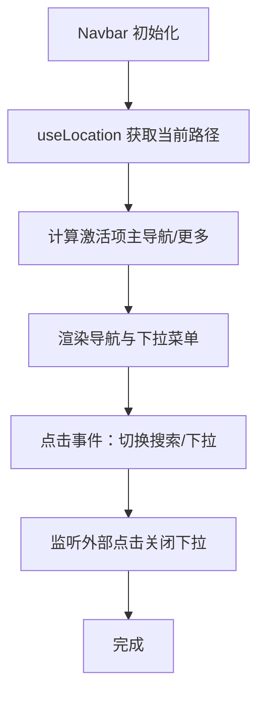
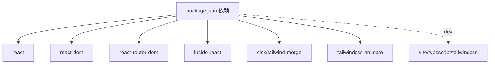

# 页面组件

<cite>
**本文引用的文件**
- [src/App.tsx](file://src/App.tsx)
- [src/main.tsx](file://src/main.tsx)
- [src/pages/Home.tsx](file://src/pages/Home.tsx)
- [src/pages/PaperDetail.tsx](file://src/pages/PaperDetail.tsx)
- [src/pages/Fast2026.tsx](file://src/pages/Fast2026.tsx)
- [src/pages/FastArchive.tsx](file://src/pages/FastArchive.tsx)
- [src/pages/Teams.tsx](file://src/pages/Teams.tsx)
- [src/pages/TeamDetail.tsx](file://src/pages/TeamDetail.tsx)
- [src/pages/Daily.tsx](file://src/pages/Daily.tsx)
- [src/pages/Archive.tsx](file://src/pages/Archive.tsx)
- [src/components/Navbar.tsx](file://src/components/Navbar.tsx)
- [src/components/PaperCard.tsx](file://src/components/PaperCard.tsx)
- [src/components/ui/CategoryTag.tsx](file://src/components/ui/CategoryTag.tsx)
- [src/data/papers.ts](file://src/data/papers.ts)
- [src/data/teams.ts](file://src/data/teams.ts)
- [src/data/fast2026.ts](file://src/data/fast2026.ts)
- [src/data/fastArchive.ts](file://src/data/fastArchive.ts)
- [src/lib/utils.ts](file://src/lib/utils.ts)
- [src/data/types.ts](file://src/data/types.ts)
- [package.json](file://package.json)
</cite>

## 更新摘要
**变更内容**
- 更新FastArchive页面组件功能，增强Markdown渲染能力和内容格式化
- 新增性能数据可视化功能，支持性能指标网格展示
- 新增paperUrl链接功能，支持论文原文访问
- 改进内容格式化能力，支持章节内容的Markdown渲染

## 目录
1. [简介](#简介)
2. [项目结构](#项目结构)
3. [核心组件](#核心组件)
4. [架构总览](#架构总览)
5. [详细组件分析](#详细组件分析)
6. [依赖分析](#依赖分析)
7. [性能考虑](#性能考虑)
8. [故障排查指南](#故障排查指南)
9. [结论](#结论)
10. [附录](#附录)

## 简介
本文件面向 cs336 页面组件，系统性梳理首页、论文详情、会议专题（如 FAST 2026、FAST 历年）、团队与团队详情等页面的功能实现、数据获取、状态管理、用户交互、导航与路由、响应式与 SEO、性能优化、生命周期与错误处理，并提供定制与扩展建议。

## 项目结构
- 路由入口位于应用根组件，集中声明所有页面路由与导航栏。
- 页面组件按功能分层组织，数据通过本地静态数据模块注入，部分页面包含子组件（如 PaperCard、CategoryTag）。
- 工具函数集中在 lib/utils 中，统一类名拼接、分类标签样式与文本、日期与来源图标等。

**图表来源**
- [src/main.tsx:1-14](file://src/main.tsx#L1-L14)
- [src/App.tsx:1-47](file://src/App.tsx#L1-L47)
- [src/components/Navbar.tsx:1-144](file://src/components/Navbar.tsx#L1-L144)
- [src/pages/Home.tsx:1-209](file://src/pages/Home.tsx#L1-L209)
- [src/pages/PaperDetail.tsx:1-151](file://src/pages/PaperDetail.tsx#L1-L151)
- [src/pages/Fast2026.tsx:1-236](file://src/pages/Fast2026.tsx#L1-L236)
- [src/pages/FastArchive.tsx:1-426](file://src/pages/FastArchive.tsx#L1-L426)
- [src/pages/Teams.tsx:1-134](file://src/pages/Teams.tsx#L1-L134)
- [src/pages/TeamDetail.tsx:1-194](file://src/pages/TeamDetail.tsx#L1-L194)
- [src/pages/Daily.tsx:1-107](file://src/pages/Daily.tsx#L1-L107)
- [src/pages/Archive.tsx:1-130](file://src/pages/Archive.tsx#L1-L130)
- [src/components/PaperCard.tsx:1-73](file://src/components/PaperCard.tsx#L1-L73)
- [src/components/ui/CategoryTag.tsx:1-25](file://src/components/ui/CategoryTag.tsx#L1-L25)
- [src/data/papers.ts:1-815](file://src/data/papers.ts#L1-L815)
- [src/data/teams.ts:1-168](file://src/data/teams.ts#L1-L168)
- [src/data/fast2026.ts:1-252](file://src/data/fast2026.ts#L1-L252)
- [src/data/fastArchive.ts:1-4074](file://src/data/fastArchive.ts#L1-L4074)

**章节来源**
- [src/main.tsx:1-14](file://src/main.tsx#L1-L14)
- [src/App.tsx:1-47](file://src/App.tsx#L1-L47)

## 核心组件
- 路由与导航
  - 应用根组件包裹路由容器，集中注册所有页面路由。
  - 导航栏组件提供主导航、下拉"更多"菜单、搜索展开区，支持外链访问与键盘快捷键提示。
- 页面组件
  - 首页：聚合论文列表、分类筛选、来源过滤、排序、新文章统计与卡片展示。
  - 论文详情：根据路由参数加载指定论文，缺失时回退到首页并提示。
  - FAST 2026 专题：按会议分论坛展示论文卡片，支持展开查看核心贡献、优缺点与架构图。
  - **FAST 历年档案**：**新增** 展示2022-2025年FAST会议论文的完整历史档案，支持年份切换、分论坛分组、详细解读与架构图展示。
  - 团队与团队详情：团队列表卡片与团队详情页，包含教师、学生、研究方向与论文年表。
  - 每日更新：按日期分组论文，展示来源与阅读时长。
  - Git 归档：展示自动化工作流步骤与提交历史。
- 子组件
  - PaperCard：论文卡片，支持跳转到详情页。
  - **ArchivePaperCard**：**增强** 增强的论文卡片组件，支持Markdown渲染、性能数据可视化、论文链接等功能。
  - CategoryTag：按分类映射标签样式与文案。
- 数据层
  - papers.ts：论文集合与字段定义。
  - teams.ts：团队数据结构与示例。
  - fast2026.ts：FAST 2026 专题论文数据与分论坛列表。
  - **fastArchive.ts**：**增强** FAST会议历年论文数据结构与2022-2025年论文集合，包含增强的PaperSection类型。

**章节来源**
- [src/components/Navbar.tsx:1-144](file://src/components/Navbar.tsx#L1-L144)
- [src/pages/Home.tsx:1-209](file://src/pages/Home.tsx#L1-L209)
- [src/pages/PaperDetail.tsx:1-151](file://src/pages/PaperDetail.tsx#L1-L151)
- [src/pages/Fast2026.tsx:1-236](file://src/pages/Fast2026.tsx#L1-L236)
- [src/pages/FastArchive.tsx:1-426](file://src/pages/FastArchive.tsx#L1-L426)
- [src/pages/Teams.tsx:1-134](file://src/pages/Teams.tsx#L1-L134)
- [src/pages/TeamDetail.tsx:1-194](file://src/pages/TeamDetail.tsx#L1-L194)
- [src/pages/Daily.tsx:1-107](file://src/pages/Daily.tsx#L1-L107)
- [src/pages/Archive.tsx:1-130](file://src/pages/Archive.tsx#L1-L130)
- [src/components/PaperCard.tsx:1-73](file://src/components/PaperCard.tsx#L1-L73)
- [src/components/ui/CategoryTag.tsx:1-25](file://src/components/ui/CategoryTag.tsx#L1-L25)
- [src/data/papers.ts:1-815](file://src/data/papers.ts#L1-L815)
- [src/data/teams.ts:1-168](file://src/data/teams.ts#L1-L168)
- [src/data/fast2026.ts:1-252](file://src/data/fast2026.ts#L1-L252)
- [src/data/fastArchive.ts:1-4074](file://src/data/fastArchive.ts#L1-L4074)

## 架构总览
- 路由与导航
  - main.tsx 使用 BrowserRouter 包裹 App。
  - App.tsx 使用 react-router-dom Routes/Route 声明路由，包含首页、论文详情、专题、团队、每日更新、归档等。
  - Navbar.tsx 提供导航链接与下拉菜单，支持外链访问。
- 数据与渲染
  - 页面组件直接从对应数据模块导入数据，首页与每日更新对数据进行筛选、排序与分组。
  - 子组件通过 props 接收数据，保持职责清晰。
- 样式与工具
  - utils.ts 提供类名合并、分类标签样式映射、日期格式化、来源图标等工具方法。

**图表来源**
- [src/main.tsx:1-14](file://src/main.tsx#L1-L14)
- [src/App.tsx:1-47](file://src/App.tsx#L1-L47)
- [src/components/Navbar.tsx:1-144](file://src/components/Navbar.tsx#L1-L144)
- [src/pages/Home.tsx:1-209](file://src/pages/Home.tsx#L1-L209)
- [src/pages/PaperDetail.tsx:1-151](file://src/pages/PaperDetail.tsx#L1-L151)
- [src/pages/Fast2026.tsx:1-236](file://src/pages/Fast2026.tsx#L1-L236)
- [src/pages/FastArchive.tsx:1-426](file://src/pages/FastArchive.tsx#L1-L426)
- [src/pages/Teams.tsx:1-134](file://src/pages/Teams.tsx#L1-L134)
- [src/pages/TeamDetail.tsx:1-194](file://src/pages/TeamDetail.tsx#L1-L194)
- [src/pages/Daily.tsx:1-107](file://src/pages/Daily.tsx#L1-L107)
- [src/pages/Archive.tsx:1-130](file://src/pages/Archive.tsx#L1-L130)
- [src/components/PaperCard.tsx:1-73](file://src/components/PaperCard.tsx#L1-L73)
- [src/components/ui/CategoryTag.tsx:1-25](file://src/components/ui/CategoryTag.tsx#L1-L25)
- [src/data/papers.ts:1-815](file://src/data/papers.ts#L1-L815)
- [src/data/teams.ts:1-168](file://src/data/teams.ts#L1-L168)
- [src/data/fast2026.ts:1-252](file://src/data/fast2026.ts#L1-L252)
- [src/data/fastArchive.ts:1-4074](file://src/data/fastArchive.ts#L1-L4074)

## 详细组件分析

### 首页 Home
- 功能要点
  - 状态：分类、来源、排序三个筛选条件，使用 useState 管理；使用 useMemo 基于依赖项进行稳定计算。
  - 数据：从 papers.ts 导入论文集合，按分类、来源过滤，再按日期或阅读时长排序。
  - 渲染：头部横幅、深度解读卡片、筛选条、计数与网格卡片；空状态提示。
  - 交互：点击分类标签切换、来源与排序下拉选择、卡片跳转详情。
- 生命周期与性能
  - 依赖稳定化：useMemo 依赖项包含分类、来源、排序，避免重复计算。
  - 渲染优化：Grid 仅渲染过滤后的列表，空状态时显示占位。
- 错误处理
  - 无显式错误边界；可通过骨架屏或加载指示优化体验（建议）。
- SEO 与可访问性
  - 图片提供 alt 文本；链接语义明确；页面标题与描述建议在 HTML 中补充（建议）。

**图表来源**
- [src/pages/Home.tsx:1-209](file://src/pages/Home.tsx#L1-L209)
- [src/data/papers.ts:1-815](file://src/data/papers.ts#L1-L815)

**章节来源**
- [src/pages/Home.tsx:1-209](file://src/pages/Home.tsx#L1-L209)
- [src/data/papers.ts:1-815](file://src/data/papers.ts#L1-L815)

### 论文详情 PaperDetail
- 功能要点
  - 路由参数：从 useParams 获取论文 id。
  - 数据：从 papers.ts 查找匹配论文。
  - 渲染：返回按钮、标题与作者、摘要、核心贡献、架构图、标签与外链。
  - 错误处理：找不到论文时返回首页提示。
- 用户交互
  - 返回列表、外链打开新窗口、图片懒加载。
- SEO 与可访问性
  - 建议在 head 中设置标题与描述（建议）。

**图表来源**
- [src/pages/PaperDetail.tsx:1-151](file://src/pages/PaperDetail.tsx#L1-L151)
- [src/data/papers.ts:1-815](file://src/data/papers.ts#L1-L815)

**章节来源**
- [src/pages/PaperDetail.tsx:1-151](file://src/pages/PaperDetail.tsx#L1-L151)
- [src/data/papers.ts:1-815](file://src/data/papers.ts#L1-L815)

### FAST 2026 专题
- 功能要点
  - 数据：从 fast2026.ts 导入论文与分论坛列表。
  - 组件：PaperCard 子组件支持展开查看核心贡献、优缺点与架构图。
  - 渲染：会议信息、统计卡片、按分论坛分段展示论文。
- 用户交互
  - 展开/收起详情、图片懒加载、外链访问 DBLP。
- SEO 与可访问性
  - 建议为专题页设置标题与描述（建议）。

**图表来源**
- [src/pages/Fast2026.tsx:1-236](file://src/pages/Fast2026.tsx#L1-L236)
- [src/data/fast2026.ts:1-252](file://src/data/fast2026.ts#L1-L252)

**章节来源**
- [src/pages/Fast2026.tsx:1-236](file://src/pages/Fast2026.tsx#L1-L236)
- [src/data/fast2026.ts:1-252](file://src/data/fast2026.ts#L1-L252)

### **FAST 历年档案** **增强**
- 功能要点
  - 数据：从 fastArchive.ts 导入2022-2025年FAST会议论文数据。
  - 组件：**增强** ArchivePaperCard 子组件，支持展开查看核心贡献、优缺点、架构图、性能数据与详细解读章节。
  - 渲染：年份标签切换、会议信息、统计卡片、按分论坛分段展示论文。
  - 年份支持：2022、2023、2024、2025年论文数据。
  - 统计功能：重点论文、架构图、详细解读、性能数据数量统计。
  - **新增功能**：Markdown渲染、性能数据可视化、论文链接功能。
- 用户交互
  - 年份切换标签、展开/收起详情、图片懒加载、外链访问。
- SEO 与可访问性
  - 建议为专题页设置标题与描述（建议）。

**更新** 增强的Markdown渲染功能，支持标题、列表、表格、内联样式等格式化；新增性能数据可视化网格；新增paperUrl链接功能。

**图表来源**
- [src/pages/FastArchive.tsx:1-426](file://src/pages/FastArchive.tsx#L1-L426)
- [src/data/fastArchive.ts:1-4074](file://src/data/fastArchive.ts#L1-L4074)

**章节来源**
- [src/pages/FastArchive.tsx:1-426](file://src/pages/FastArchive.tsx#L1-L426)
- [src/data/fastArchive.ts:1-4074](file://src/data/fastArchive.ts#L1-L4074)

### 团队与团队详情
- 团队列表 Teams
  - 数据：teams.ts。
  - 渲染：团队卡片、统计、教授、最新论文预览、标签与官网链接。
  - 交互：跳转到团队详情。
- 团队详情 TeamDetail
  - 数据：根据路由参数 id 查找团队。
  - 渲染：团队信息、教师、学生、研究方向、论文年表。
  - 错误处理：找不到团队时返回列表提示。
- SEO 与可访问性
  - 建议为团队详情页设置标题与描述（建议）。

**图表来源**
- [src/pages/Teams.tsx:1-134](file://src/pages/Teams.tsx#L1-L134)
- [src/pages/TeamDetail.tsx:1-194](file://src/pages/TeamDetail.tsx#L1-L194)
- [src/data/teams.ts:1-168](file://src/data/teams.ts#L1-L168)

**章节来源**
- [src/pages/Teams.tsx:1-134](file://src/pages/Teams.tsx#L1-L134)
- [src/pages/TeamDetail.tsx:1-194](file://src/pages/TeamDetail.tsx#L1-L194)
- [src/data/teams.ts:1-168](file://src/data/teams.ts#L1-L168)

### 每日更新 Daily
- 功能要点
  - 数据：从 papers.ts 导入并按日期分组。
  - 渲染：时间轴样式展示，今日标记高亮，每条显示分类标签、来源、摘要与阅读时长。
  - 交互：点击跳转详情。
- SEO 与可访问性
  - 建议为每日页设置标题与描述（建议）。

**图表来源**
- [src/pages/Daily.tsx:1-107](file://src/pages/Daily.tsx#L1-L107)
- [src/data/papers.ts:1-815](file://src/data/papers.ts#L1-L815)

**章节来源**
- [src/pages/Daily.tsx:1-107](file://src/pages/Daily.tsx#L1-L107)
- [src/data/papers.ts:1-815](file://src/data/papers.ts#L1-L815)

### Git 归档 Archive
- 功能要点
  - 渲染：自动化工作流步骤、提交历史列表。
  - 交互：展示每次更新的提交信息与文章数量。
- SEO 与可访问性
  - 建议为归档页设置标题与描述（建议）。

**章节来源**
- [src/pages/Archive.tsx:1-130](file://src/pages/Archive.tsx#L1-L130)

### 导航栏 Navbar
- 功能要点
  - 主导航：首页、FAST、FAST 历年、OSDI、ATC。
  - 下拉"更多"：开源存储库、Linux Bugfix、SPDK 更新、存储故障、研究团队、Git 归档。
  - 搜索：展开输入框，Esc 关闭。
  - 外链：使用外部链接图标与新窗口打开。
- 交互与状态
  - 使用 useState 管理搜索与下拉开关，useEffect 处理点击外部关闭。
  - 根据当前路径高亮激活项。

**图表来源**
- [src/components/Navbar.tsx:1-144](file://src/components/Navbar.tsx#L1-L144)

**章节来源**
- [src/components/Navbar.tsx:1-144](file://src/components/Navbar.tsx#L1-L144)

### 子组件
- PaperCard
  - 接收单篇论文，渲染标题、摘要、标签、作者、日期与阅读时长，支持跳转详情。
- **ArchivePaperCard** **增强**
  - **增强** 接收 ArchivePaperData 类型论文，支持展开查看核心贡献、优缺点、架构图、性能数据与详细解读章节。
  - 支持重点论文标识、架构图标签、展开/收起功能、性能数据网格展示、优缺点分栏展示、详细章节内容。
  - **新增** Markdown渲染功能，支持标题、列表、表格、内联样式等格式化。
  - **新增** 性能数据可视化网格，展示指标、数值和基准信息。
  - **新增** 论文链接功能，支持访问论文原文。
- CategoryTag
  - 根据分类映射标签样式与文案，支持尺寸与自定义类名。

**章节来源**
- [src/components/PaperCard.tsx:1-73](file://src/components/PaperCard.tsx#L1-L73)
- [src/components/ui/CategoryTag.tsx:1-25](file://src/components/ui/CategoryTag.tsx#L1-L25)
- [src/lib/utils.ts:1-58](file://src/lib/utils.ts#L1-L58)

## 依赖分析
- 运行时依赖
  - react、react-dom、react-router-dom：页面与路由。
  - lucide-react：图标。
  - class-variance-authority、clsx、tailwind-merge：样式工具。
  - tailwindcss-animate：动画。
- 开发依赖
  - @vitejs/plugin-react、typescript、tailwindcss、autoprefixer、vite 等。
- 组件耦合
  - 页面与数据模块松耦合，通过导入数据模块实现数据注入。
  - 子组件通过 props 接收数据，职责清晰，便于复用与测试。

**图表来源**
- [package.json:1-32](file://package.json#L1-L32)

**章节来源**
- [package.json:1-32](file://package.json#L1-L32)

## 性能考虑
- 渲染性能
  - 首页使用 useMemo 过滤与排序，避免不必要的重渲染。
  - 论文卡片与专题卡片采用展开/收起，减少一次性渲染量。
  - **FAST 历年档案** 使用年份标签切换，避免同时渲染所有年份数据。
  - **增强** ArchivePaperCard 使用性能数据网格展示，优化视觉呈现。
- 图片与网络
  - 首页横幅与详情页图片使用懒加载与预加载策略，提升首屏体验。
  - **FAST 历年档案** 的架构图支持图片与代码两种展示方式，优化加载性能。
  - **新增** 论文链接功能支持外部访问，提升用户体验。
- 路由与导航
  - 使用 Link 组件进行客户端导航，避免整页刷新。
- 内容渲染性能
  - **新增** Markdown渲染功能使用高效的格式化函数，支持复杂内容的快速渲染。
  - **新增** 性能数据网格使用CSS Grid布局，提升渲染效率。
- 可扩展建议
  - 引入骨架屏与加载指示器，改善空状态与数据加载体验。
  - 对大数据量页面（如每日更新、FAST 历年档案）可考虑分页或虚拟滚动。

## 故障排查指南
- 论文详情 404
  - 现象：访问 /paper/:id 时提示论文不存在并返回首页。
  - 排查：确认 papers.ts 中是否存在该 id；检查路由参数是否正确。
- 团队详情 404
  - 现象：访问 /teams/:id 时提示团队不存在并返回列表。
  - 排查：确认 teams.ts 中是否存在该 id；检查 teams 页面跳转逻辑。
- 导航高亮异常
  - 现象：下拉"更多"菜单或主导航未正确高亮。
  - 排查：检查 useLocation 当前路径与导航项 href 是否一致；确认下拉开关状态。
- 图片加载失败
  - 现象：图片未显示或闪烁。
  - 排查：检查图片路径是否正确；确认静态资源目录结构；使用懒加载属性。
- **FAST 历年档案数据缺失**
  - **新增** 现象：FAST 历年页面显示空白或数据不完整。
  - **新增** 排查：确认 fastArchive.ts 中对应年份数据是否存在；检查 ArchivePaperData 结构是否正确；验证论文 id 格式。
- **Markdown渲染异常**
  - **新增** 现象：章节内容未正确渲染或格式错误。
  - **新增** 排查：确认 PaperSection.content 字段格式是否符合Markdown语法；检查 formatContent 函数处理逻辑。
- **性能数据展示问题**
  - **新增** 现象：性能指标网格显示异常或数据不完整。
  - **新增** 排查：确认 performanceData 字段结构是否正确；检查数据格式和基准值设置。

**章节来源**
- [src/pages/PaperDetail.tsx:1-151](file://src/pages/PaperDetail.tsx#L1-L151)
- [src/pages/TeamDetail.tsx:1-194](file://src/pages/TeamDetail.tsx#L1-L194)
- [src/components/Navbar.tsx:1-144](file://src/components/Navbar.tsx#L1-L144)
- [src/pages/FastArchive.tsx:1-426](file://src/pages/FastArchive.tsx#L1-L426)
- [src/data/fastArchive.ts:1-4074](file://src/data/fastArchive.ts#L1-L4074)

## 结论
本项目采用清晰的页面分层与数据注入模式，首页与专题页面具备良好的筛选、排序与可读性；导航栏提供便捷的入口与外链访问；数据模块集中管理，便于维护与扩展。**增强的FAST 历年档案页面**为用户提供了完整的FAST会议历史查阅体验，支持年份切换、详细解读与架构图展示。**新增的Markdown渲染功能**显著提升了内容展示能力，**性能数据可视化**和**论文链接功能**进一步增强了用户体验。建议后续在加载体验、SEO 标题与描述、骨架屏与分页等方面进一步完善。

## 附录
- 页面与路由映射
  - /：首页
  - /paper/:id：论文详情
  - /deep-dive/rask：深度解读 RASK
  - /deep-dive/discogc：深度解读 DisCoGC
  - /fast2026：FAST 2026 专题
  - **/fast-archive**：**增强** FAST 历年档案
  - /osdi2025：OSDI 2025 专题
  - /atc2024：ATC 2024 专题
  - /linux-bugfix：Linux Bugfix
  - /spdk：SPDK 更新
  - /faults：存储故障
  - /opensource：开源项目
  - /teams：团队列表
  - /teams/:id：团队详情
  - /daily：每日更新
  - /archive：Git 归档

**章节来源**
- [src/App.tsx:1-47](file://src/App.tsx#L1-L47)