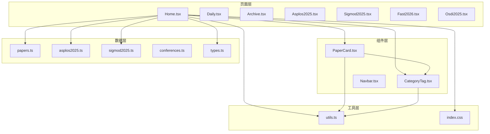
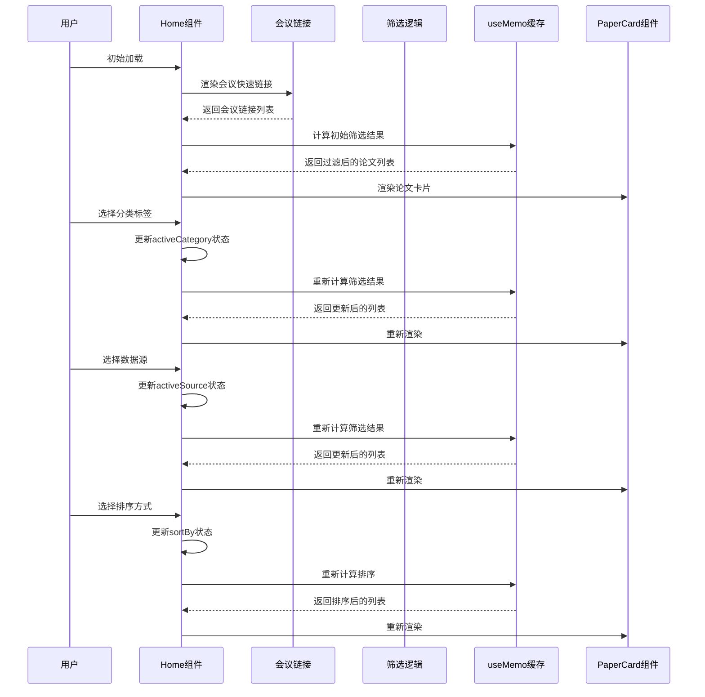
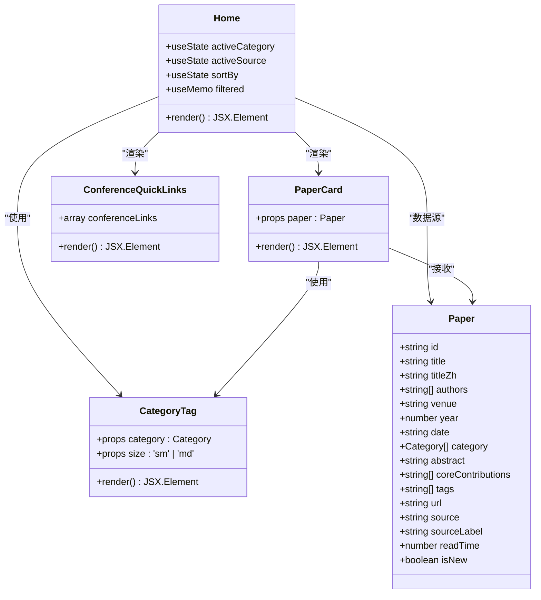
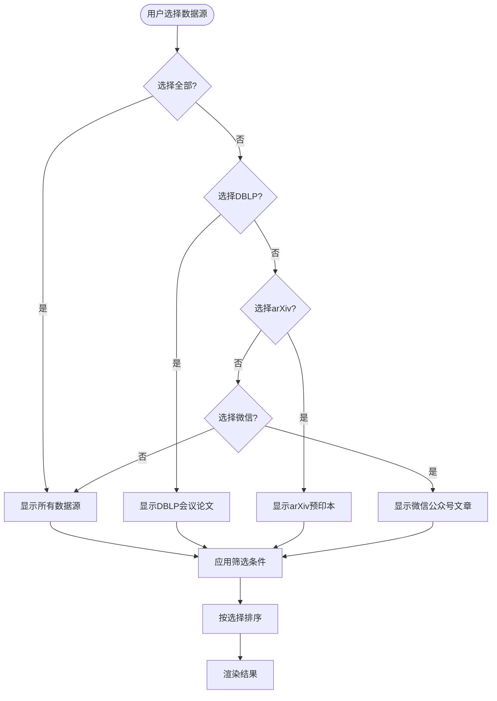
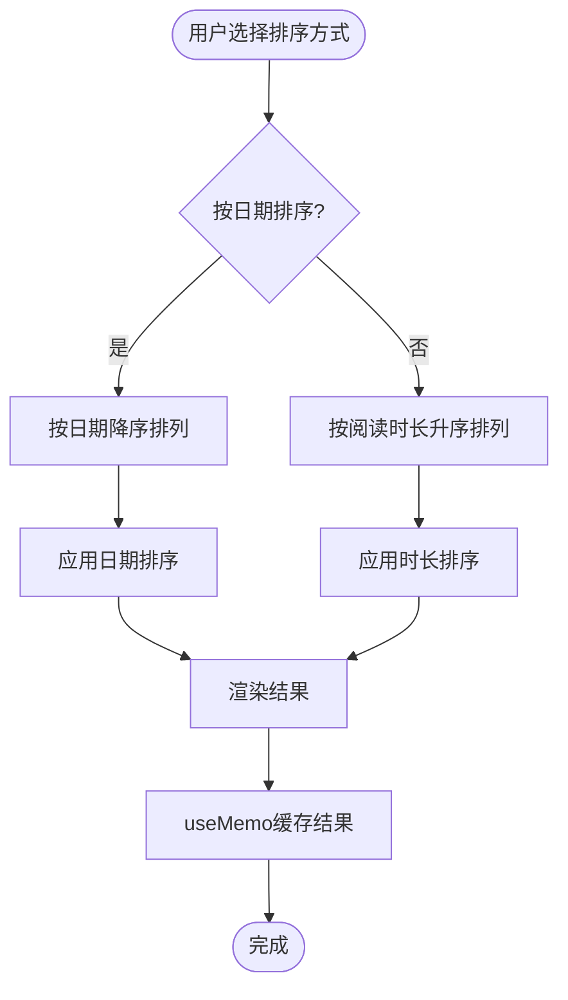
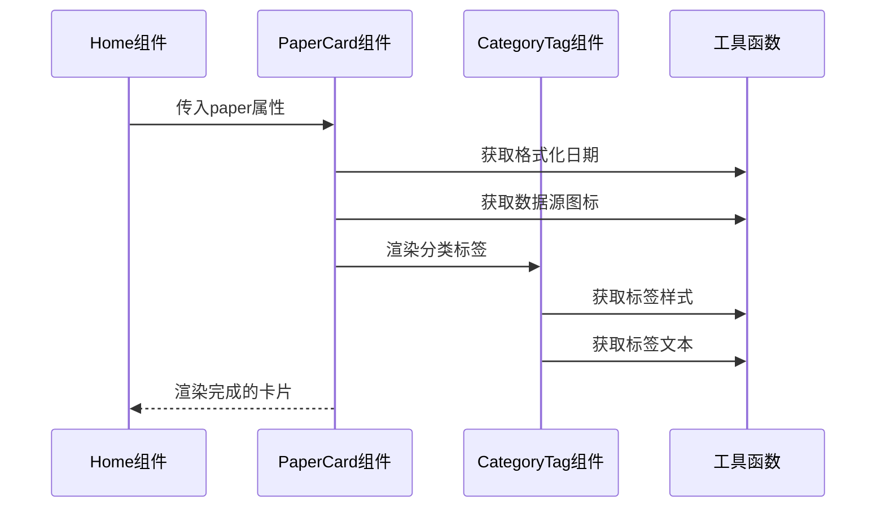
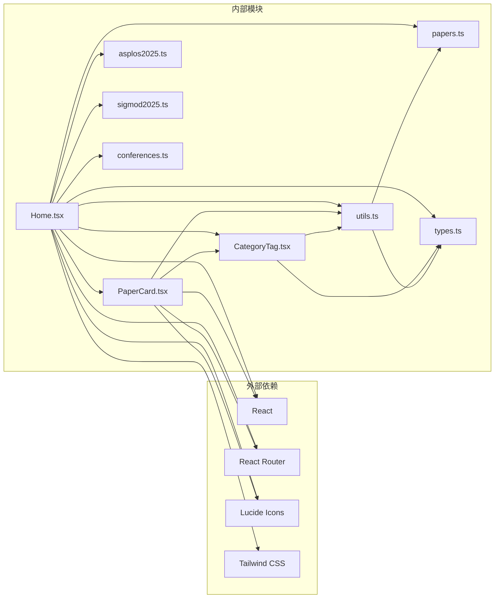

# 首页组件

<cite>
**本文档引用的文件**
- [Home.tsx](file://src/pages/Home.tsx)
- [PaperCard.tsx](file://src/components/PaperCard.tsx)
- [CategoryTag.tsx](file://src/components/ui/CategoryTag.tsx)
- [asplos2025.ts](file://src/data/asplos2025.ts)
- [sigmod2025.ts](file://src/data/sigmod2025.ts)
- [conferences.ts](file://src/data/conferences.ts)
- [papers.ts](file://src/data/papers.ts)
- [types.ts](file://src/data/types.ts)
- [utils.ts](file://src/lib/utils.ts)
- [index.css](file://src/index.css)
- [App.tsx](file://src/App.tsx)
- [Daily.tsx](file://src/pages/Daily.tsx)
- [Archive.tsx](file://src/pages/Archive.tsx)
- [Asplos2025.tsx](file://src/pages/Asplos2025.tsx)
- [Sigmod2025.tsx](file://src/pages/Sigmod2025.tsx)
- [Fast2026.tsx](file://src/pages/Fast2026.tsx)
- [Osdi2025.tsx](file://src/pages/Osdi2025.tsx)
</cite>

## 更新摘要
**所做更改**
- 新增 ASPLOS 2025 和 SIGMOD 2025 快速链接功能
- 首页布局从4列扩展到6列设计
- 新增专门的会议卡片导航系统
- 更新会议快速链接区域的响应式设计

## 目录
1. [简介](#简介)
2. [项目结构](#项目结构)
3. [核心组件](#核心组件)
4. [架构概览](#架构概览)
5. [详细组件分析](#详细组件分析)
6. [依赖关系分析](#依赖关系分析)
7. [性能考虑](#性能考虑)
8. [故障排除指南](#故障排除指南)
9. [结论](#结论)

## 简介

StorageAI Reader 是一个专注于 AI 训练系统、SSD、文件系统、HBM 存储领域的学术论文聚合平台。首页组件作为整个应用的核心入口，提供了论文浏览、筛选和深度解读功能。该组件实现了响应式设计，支持多种数据源（DBLP、arXiv、微信公众号）和分类标签系统，为用户提供个性化的论文发现体验。

**更新** 新增了 ASPLOS 2025 和 SIGMOD 2025 的快速链接功能，首页布局从4列扩展到6列，提供更好的用户导航体验。

## 项目结构

首页组件位于 `src/pages/Home.tsx`，采用模块化架构设计，与其他组件形成清晰的层次结构：

**图表来源**
- [Home.tsx:1-291](file://src/pages/Home.tsx#L1-L291)
- [PaperCard.tsx:1-73](file://src/components/PaperCard.tsx#L1-L73)
- [CategoryTag.tsx:1-25](file://src/components/ui/CategoryTag.tsx#L1-L25)

**章节来源**
- [Home.tsx:1-291](file://src/pages/Home.tsx#L1-L291)
- [App.tsx:1-45](file://src/App.tsx#L1-L45)

## 核心组件

首页组件由五个主要区域构成：

### 1. Hero 横幅区域
- **功能**：展示网站品牌信息和每日更新提示
- **设计**：渐变背景 + 图片覆盖 + 动态新文章计数
- **交互**：显示实时更新状态和新文章数量

### 2. 会议快速链接区域
- **功能**：提供主要会议的快速导航入口
- **设计**：6列网格布局，包含 FAST、FAST 历年、OSDI、ATC、ASPLOS、SIGMOD
- **交互**：卡片式设计，悬停效果，图标 + 文本组合

### 3. 特色深度解读卡片
- **功能**：展示精选的深度分析文章
- **内容**：包含 RASK 和 DisCoGC 两个深度解读
- **设计**：卡片式布局，悬停效果，标签系统

### 4. 论文筛选系统
- **分类标签**：AI、Storage、SSD、FileSystem、HBM、WeChat
- **数据源选择**：DBLP 会议、arXiv 预印本、微信公众号
- **排序功能**：按日期、阅读时长排序

### 5. 论文列表展示
- **布局**：响应式网格布局（2列）
- **组件**：PaperCard 组件集成
- **状态处理**：空状态显示

**章节来源**
- [Home.tsx:37-291](file://src/pages/Home.tsx#L37-L291)

## 架构概览

首页组件采用 React Hooks 和函数式组件设计，实现了高效的响应式筛选和排序功能：

**图表来源**
- [Home.tsx:15-33](file://src/pages/Home.tsx#L15-L33)
- [Home.tsx:194-198](file://src/pages/Home.tsx#L194-L198)

## 详细组件分析

### 主要组件结构

**图表来源**
- [Home.tsx:15-33](file://src/pages/Home.tsx#L15-L33)
- [PaperCard.tsx:7-9](file://src/components/PaperCard.tsx#L7-L9)
- [types.ts:13-34](file://src/data/types.ts#L13-L34)

### 会议快速链接系统实现

**更新** 新增了专门的会议快速链接区域，支持6个主要会议的快速访问：

| 会议 | 链接路径 | 图标 | 描述 |
|------|----------|------|------|
| FAST 2026 | `/fast2026` | 🏆 | 存储顶会最新论文 |
| FAST 历年 | `/fast-archive` | ⏰ | 2022-2025 论文解读 |
| OSDI 2025 | `/osdi2025` | 🏆 | 系统顶会精选 |
| ATC 2024 | `/atc2024` | 🏆 | USENIX 技术会议 |
| ASPLOS 2025 | `/asplos2025` | 🏆 | 体系结构系统顶会 |
| SIGMOD 2025 | `/sigmod2025` | 🏆 | 数据管理顶会 |

**章节来源**
- [Home.tsx:64-144](file://src/pages/Home.tsx#L64-L144)

### 分类标签系统实现

分类标签系统支持 7 种主要分类，每种分类都有独特的视觉标识：

| 分类 | 标签颜色 | 中文名称 | 英文名称 |
|------|----------|----------|----------|
| AI | `--tag-ai` | AI / ML | AI / Machine Learning |
| Storage | `--tag-storage` | 存储系统 | Storage Systems |
| SSD | `--tag-ssd` | SSD | Solid State Drive |
| FileSystem | `--tag-fs` | 文件系统 | File System |
| HBM | `--tag-ai` | HBM | High Bandwidth Memory |
| WeChat | `--tag-wechat` | 公众号 | WeChat Official Account |
| FAST | `--tag-ai` | FAST | FAST Conference |

**章节来源**
- [Home.tsx:10](file://src/pages/Home.tsx#L10)
- [utils.ts:9-27](file://src/lib/utils.ts#L9-L27)
- [index.css:43-58](file://src/index.css#L43-L58)

### 数据源选择器工作原理

数据源选择器支持三种数据源，每种都有对应的图标和标签：

**图表来源**
- [Home.tsx:11-13](file://src/pages/Home.tsx#L11-L13)
- [Home.tsx:20-33](file://src/pages/Home.tsx#L20-L33)

**章节来源**
- [Home.tsx:11-13](file://src/pages/Home.tsx#L11-L13)
- [Home.tsx:25-26](file://src/pages/Home.tsx#L25-L26)

### 排序功能实现机制

排序功能支持两种排序方式，使用 useMemo 进行性能优化：

**图表来源**
- [Home.tsx:18](file://src/pages/Home.tsx#L18)
- [Home.tsx:28-31](file://src/pages/Home.tsx#L28-L31)

**章节来源**
- [Home.tsx:18](file://src/pages/Home.tsx#L18)
- [Home.tsx:28-31](file://src/pages/Home.tsx#L28-L31)

### PaperCard 组件集成

PaperCard 组件作为论文展示的核心组件，接收 Paper 类型的数据并渲染完整的论文信息：

**图表来源**
- [PaperCard.tsx:11-72](file://src/components/PaperCard.tsx#L11-L72)
- [CategoryTag.tsx:11-24](file://src/components/ui/CategoryTag.tsx#L11-L24)

**章节来源**
- [PaperCard.tsx:11-72](file://src/components/PaperCard.tsx#L11-L72)
- [CategoryTag.tsx:11-24](file://src/components/ui/CategoryTag.tsx#L11-L24)

### 响应式布局设计

**更新** 首页布局已从原来的4列扩展到6列设计：

| 区域 | 移动端 | 平板端 | 桌面端 |
|------|--------|--------|--------|
| 会议快速链接 | 2列网格 | 3列网格 | 6列网格 |
| 特色深度解读 | 1列网格 | 2列网格 | 2列网格 |
| 论文筛选栏 | 1列网格 | 1列网格 | 1列网格 |
| 论文列表 | 1列网格 | 2列网格 | 2列网格 |

**章节来源**
- [Home.tsx:65](file://src/pages/Home.tsx#L65)
- [Home.tsx:276](file://src/pages/Home.tsx#L276)
- [index.css:105-115](file://src/index.css#L105-L115)

## 依赖关系分析

首页组件的依赖关系体现了清晰的分层架构：

**图表来源**
- [Home.tsx:1-8](file://src/pages/Home.tsx#L1-L8)
- [PaperCard.tsx:1-5](file://src/components/PaperCard.tsx#L1-L5)
- [CategoryTag.tsx:1-3](file://src/components/ui/CategoryTag.tsx#L1-L3)

**章节来源**
- [Home.tsx:1-8](file://src/pages/Home.tsx#L1-L8)
- [PaperCard.tsx:1-5](file://src/components/PaperCard.tsx#L1-L5)
- [CategoryTag.tsx:1-3](file://src/components/ui/CategoryTag.tsx#L1-L3)

## 性能考虑

首页组件采用了多项性能优化措施：

### 1. useMemo 缓存策略
- **作用**：避免不必要的重新计算
- **缓存条件**：activeCategory、activeSource、sortBy 状态变化时才重新计算
- **性能收益**：复杂筛选和排序逻辑只在必要时执行

### 2. useState 状态管理
- **分类状态**：activeCategory 控制分类筛选
- **数据源状态**：activeSource 控制数据源筛选  
- **排序状态**：sortBy 控制排序方式

### 3. 组件渲染优化
- **条件渲染**：空状态时显示占位符而非空列表
- **懒加载**：图片使用 `loading="eager"` 提升首屏体验
- **CSS 动画**：使用 Tailwind 动画类减少 JavaScript 开销

### 4. 数据结构优化
- **类型安全**：使用 TypeScript 确保数据完整性
- **枚举类型**：Category 和 Source 使用枚举确保值的有效性
- **默认值**：合理设置默认状态避免未定义错误

### 5. 会议链接优化
**更新** 新增的会议快速链接区域采用了优化的网格布局，支持响应式显示，减少了不必要的重渲染。

**章节来源**
- [Home.tsx:16-33](file://src/pages/Home.tsx#L16-L33)
- [Home.tsx:200-205](file://src/pages/Home.tsx#L200-L205)

## 故障排除指南

### 常见问题及解决方案

#### 1. 空状态显示问题
**症状**：筛选后出现空白页面
**解决方案**：
- 检查 `filtered.length === 0` 条件判断
- 验证数据源是否正确加载
- 确认筛选条件组合逻辑

#### 2. 分类标签样式异常
**症状**：分类标签颜色或字体显示错误
**解决方案**：
- 检查 `getCategoryTagClass` 函数映射
- 验证 CSS 变量定义
- 确认 Tailwind 配置正确

#### 3. 排序功能失效
**症状**：排序按钮点击无反应
**解决方案**：
- 检查 `setSortBy` 状态更新
- 验证排序逻辑实现
- 确认 useMemo 依赖数组包含 sortBy

#### 4. 性能问题
**症状**：页面加载缓慢或筛选响应慢
**解决方案**：
- 检查 useMemo 缓存是否生效
- 优化数据源大小
- 减少不必要的 re-render

#### 5. 会议链接显示问题
**更新** 新增的会议快速链接可能出现的问题：
- **症状**：会议链接不显示或布局错乱
- **解决方案**：
  - 检查 `grid-cols-6` 类名是否正确应用
  - 验证断点配置（lg:grid-cols-6）
  - 确认链接路径和图标正确加载

**章节来源**
- [Home.tsx:200-205](file://src/pages/Home.tsx#L200-L205)
- [utils.ts:9-27](file://src/lib/utils.ts#L9-L27)

## 结论

首页组件作为 StorageAI Reader 的核心入口，成功实现了以下目标：

### 技术成就
- **响应式设计**：完美适配各种设备尺寸，支持6列布局
- **性能优化**：useMemo 缓存和状态管理优化
- **用户体验**：直观的筛选系统、排序功能和会议快速链接
- **可维护性**：清晰的组件结构和类型定义

### 功能亮点
- **多维筛选**：支持分类、数据源、排序的组合筛选
- **深度解读**：精选的论文深度分析文章
- **实时更新**：动态显示新文章数量
- **会议导航**：新增的6个主要会议快速链接
- **个性化体验**：支持用户偏好设置

### 扩展潜力
- **国际化支持**：可添加多语言支持
- **高级筛选**：可扩展更多筛选条件
- **搜索功能**：可添加全文搜索能力
- **用户反馈**：可添加评分和评论系统
- **会议扩展**：可继续添加更多会议的快速链接

**更新** 本次更新显著提升了用户的导航体验，通过新增的会议快速链接和6列布局设计，用户可以更便捷地访问各个重要会议的论文解读内容。首页布局的优化确保了在不同设备上都能提供最佳的用户体验。

该组件展现了现代 React 应用的最佳实践，为后续功能扩展奠定了坚实的基础。