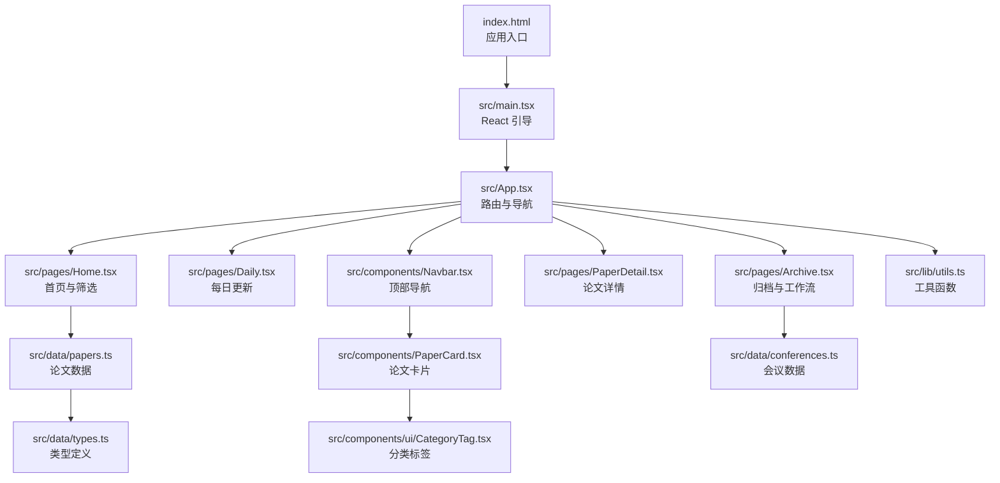
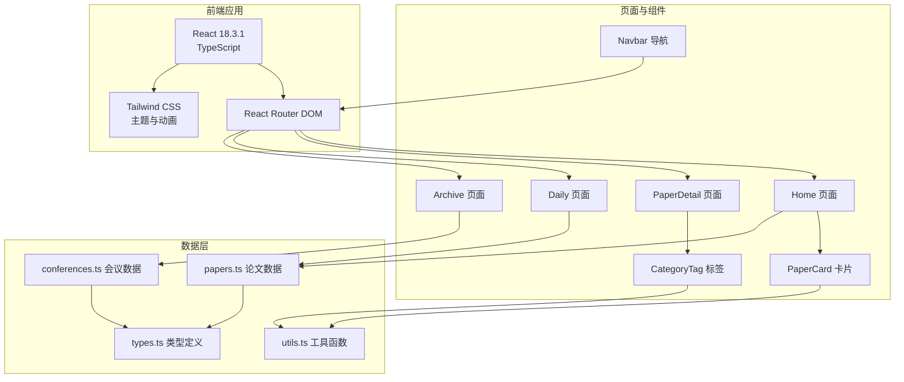
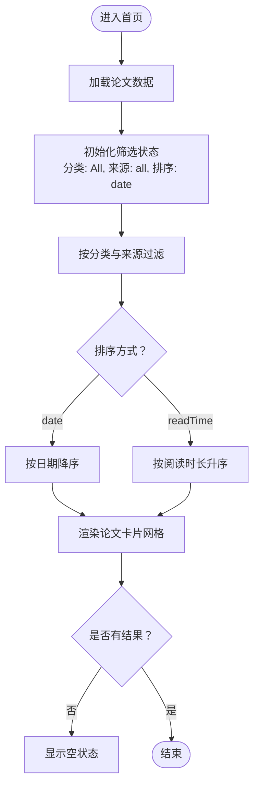
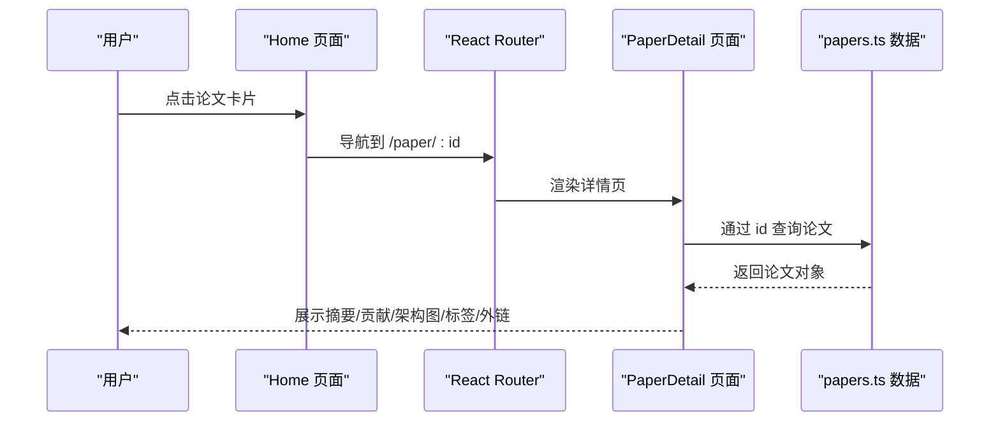
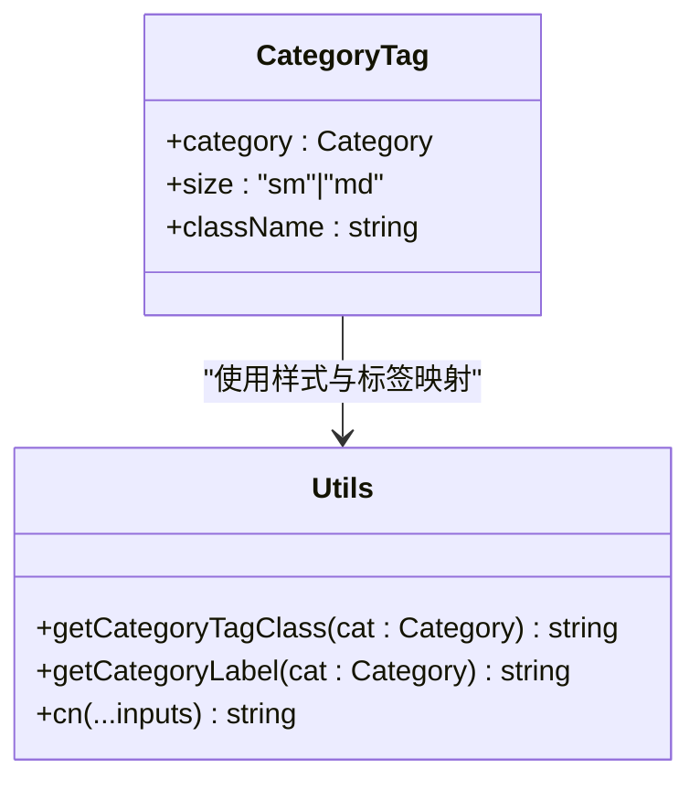
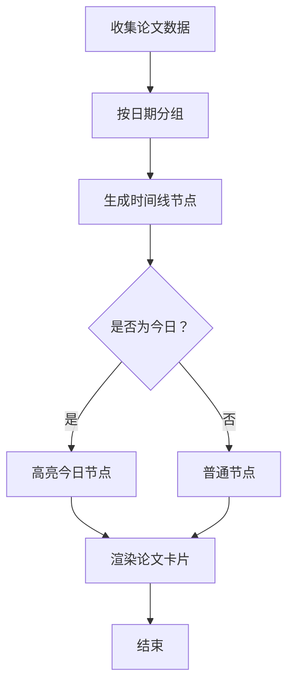
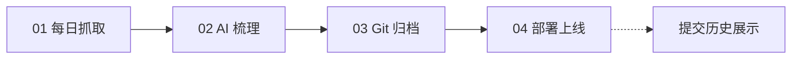
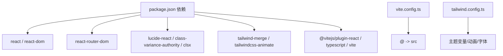

# 项目概述

<cite>
**本文引用的文件**
- [package.json](file://package.json)
- [vite.config.ts](file://vite.config.ts)
- [tailwind.config.ts](file://tailwind.config.ts)
- [index.html](file://index.html)
- [src/main.tsx](file://src/main.tsx)
- [src/App.tsx](file://src/App.tsx)
- [src/pages/Home.tsx](file://src/pages/Home.tsx)
- [src/pages/Daily.tsx](file://src/pages/Daily.tsx)
- [src/pages/Archive.tsx](file://src/pages/Archive.tsx)
- [src/pages/PaperDetail.tsx](file://src/pages/PaperDetail.tsx)
- [src/components/Navbar.tsx](file://src/components/Navbar.tsx)
- [src/components/PaperCard.tsx](file://src/components/PaperCard.tsx)
- [src/components/ui/CategoryTag.tsx](file://src/components/ui/CategoryTag.tsx)
- [src/lib/utils.ts](file://src/lib/utils.ts)
- [src/data/papers.ts](file://src/data/papers.ts)
- [src/data/conferences.ts](file://src/data/conferences.ts)
- [src/data/types.ts](file://src/data/types.ts)
</cite>

## 目录
1. [简介](#简介)
2. [项目结构](#项目结构)
3. [核心组件](#核心组件)
4. [架构总览](#架构总览)
5. [详细组件分析](#详细组件分析)
6. [依赖关系分析](#依赖关系分析)
7. [性能考虑](#性能考虑)
8. [故障排查指南](#故障排查指南)
9. [结论](#结论)
10. [附录](#附录)

## 简介
本项目是一个面向“AI与存储交叉领域”的知识聚合平台，旨在为研究人员与开发者提供统一入口，持续追踪并精读 AI 训练系统、SSD、文件系统、HBM 等前沿论文与公众号技术动态。平台通过 React 18.3.1 + TypeScript + Vite 技术栈构建，结合 Tailwind CSS 实现响应式与主题化设计，辅以自动化工作流保障内容更新与归档。

- 核心目标
  - 聚合 AI/存储相关论文与技术文章，提供中文摘要、标签与架构图解析
  - 以“分类筛选 + 来源过滤 + 排序”为核心体验，帮助用户快速定位感兴趣内容
  - 以“每日更新 + Git 归档”保障内容新鲜度与可追溯性
- 主要功能特性
  - 论文卡片列表与详情页，支持分类标签、作者、阅读时长、来源标识
  - 深度解读专题（如 RASK、DisCoGC）入口
  - 会议与期刊（FAST/OSDI/ATC）专题页面
  - 开源项目、Linux Bugfix、SPDK 更新、存储故障、研究团队等专题
  - “每日更新”时间线视图，按日期分组展示
  - 归档与自动化工作流展示，体现内容生产与发布流程
- 技术价值
  - 以轻量前端技术栈实现高可维护的知识门户
  - 通过主题变量与动画系统提升视觉一致性与交互体验
  - 以类型安全的数据模型与工具函数保证代码质量与扩展性

## 项目结构
项目采用按页面与功能模块组织的目录结构，核心入口为 React 应用，路由由 React Router DOM 管理，样式通过 Tailwind CSS 与自定义主题变量实现。

图表来源
- [index.html:1-17](file://index.html#L1-L17)
- [src/main.tsx:1-14](file://src/main.tsx#L1-L14)
- [src/App.tsx:1-45](file://src/App.tsx#L1-L45)
- [src/pages/Home.tsx:1-209](file://src/pages/Home.tsx#L1-L209)
- [src/pages/Daily.tsx:1-107](file://src/pages/Daily.tsx#L1-L107)
- [src/pages/Archive.tsx:1-130](file://src/pages/Archive.tsx#L1-L130)
- [src/pages/PaperDetail.tsx:1-151](file://src/pages/PaperDetail.tsx#L1-L151)
- [src/components/Navbar.tsx:1-143](file://src/components/Navbar.tsx#L1-L143)
- [src/components/PaperCard.tsx:1-73](file://src/components/PaperCard.tsx#L1-L73)
- [src/components/ui/CategoryTag.tsx:1-25](file://src/components/ui/CategoryTag.tsx#L1-L25)
- [src/lib/utils.ts:1-58](file://src/lib/utils.ts#L1-L58)
- [src/data/papers.ts:1-815](file://src/data/papers.ts#L1-L815)
- [src/data/conferences.ts:1-213](file://src/data/conferences.ts#L1-L213)
- [src/data/types.ts:1-49](file://src/data/types.ts#L1-L49)

章节来源
- [package.json:1-32](file://package.json#L1-L32)
- [vite.config.ts:1-13](file://vite.config.ts#L1-L13)
- [tailwind.config.ts:1-104](file://tailwind.config.ts#L1-L104)
- [index.html:1-17](file://index.html#L1-L17)
- [src/main.tsx:1-14](file://src/main.tsx#L1-L14)
- [src/App.tsx:1-45](file://src/App.tsx#L1-L45)

## 核心组件
- 应用入口与路由
  - React 引导：在 index.html 中挂载根节点，使用 BrowserRouter 包裹应用
  - 路由配置：集中声明首页、论文详情、专题页面、团队、归档等路由
- 导航栏
  - 顶部导航条，包含“论文”、“FAST/OSDI/ATC”等常驻入口与“更多”下拉菜单
  - 支持搜索展开与点击外部关闭，提供键盘快捷提示
- 首页与筛选
  - 支持分类（AI/存储/SSD/文件系统/HBM/公众号）与来源（DBLP/arXiv/公众号）筛选
  - 支持按日期或阅读时长排序，展示论文卡片网格
  - 展示“深度解读”专题入口与“每日更新”新文章计数
- 论文卡片与详情
  - 卡片：展示分类标签、来源图标、标题、摘要、标签、作者、日期与阅读时长
  - 详情：展示摘要、核心贡献、架构图、标签与外链
- 每日更新与归档
  - 每日更新：按日期分组的时间线视图，突出今日更新
  - 归档：展示自动化工作流步骤与 Git 提交历史，体现内容生产流程

章节来源
- [src/main.tsx:1-14](file://src/main.tsx#L1-L14)
- [src/App.tsx:1-45](file://src/App.tsx#L1-L45)
- [src/components/Navbar.tsx:1-143](file://src/components/Navbar.tsx#L1-L143)
- [src/pages/Home.tsx:1-209](file://src/pages/Home.tsx#L1-L209)
- [src/components/PaperCard.tsx:1-73](file://src/components/PaperCard.tsx#L1-L73)
- [src/pages/PaperDetail.tsx:1-151](file://src/pages/PaperDetail.tsx#L1-L151)
- [src/pages/Daily.tsx:1-107](file://src/pages/Daily.tsx#L1-L107)
- [src/pages/Archive.tsx:1-130](file://src/pages/Archive.tsx#L1-L130)

## 架构总览
平台采用前端单页应用（SPA）架构，以 React 组件为核心，通过路由实现页面切换；数据来源于本地 TypeScript 模块，首页与详情页分别消费论文与会议数据；样式通过 Tailwind CSS 与自定义主题变量实现一致的视觉风格与动画效果。

图表来源
- [src/App.tsx:1-45](file://src/App.tsx#L1-L45)
- [src/pages/Home.tsx:1-209](file://src/pages/Home.tsx#L1-L209)
- [src/pages/PaperDetail.tsx:1-151](file://src/pages/PaperDetail.tsx#L1-L151)
- [src/pages/Daily.tsx:1-107](file://src/pages/Daily.tsx#L1-L107)
- [src/pages/Archive.tsx:1-130](file://src/pages/Archive.tsx#L1-L130)
- [src/components/Navbar.tsx:1-143](file://src/components/Navbar.tsx#L1-L143)
- [src/components/PaperCard.tsx:1-73](file://src/components/PaperCard.tsx#L1-L73)
- [src/components/ui/CategoryTag.tsx:1-25](file://src/components/ui/CategoryTag.tsx#L1-L25)
- [src/lib/utils.ts:1-58](file://src/lib/utils.ts#L1-L58)
- [src/data/papers.ts:1-815](file://src/data/papers.ts#L1-L815)
- [src/data/conferences.ts:1-213](file://src/data/conferences.ts#L1-L213)
- [src/data/types.ts:1-49](file://src/data/types.ts#L1-L49)

## 详细组件分析

### 首页与筛选流程
首页提供“分类 + 来源 + 排序”的组合筛选，使用 useMemo 优化过滤与排序逻辑，确保在大数据量下仍保持流畅体验。

图表来源
- [src/pages/Home.tsx:20-33](file://src/pages/Home.tsx#L20-L33)
- [src/pages/Home.tsx:147-198](file://src/pages/Home.tsx#L147-L198)

章节来源
- [src/pages/Home.tsx:1-209](file://src/pages/Home.tsx#L1-L209)

### 论文详情页交互序列
从论文列表点击进入详情页，展示摘要、核心贡献、架构图与标签，并提供外链跳转。

图表来源
- [src/pages/Home.tsx:195-197](file://src/pages/Home.tsx#L195-L197)
- [src/App.tsx:25](file://src/App.tsx#L25)
- [src/pages/PaperDetail.tsx:7-21](file://src/pages/PaperDetail.tsx#L7-L21)
- [src/data/papers.ts:1-815](file://src/data/papers.ts#L1-L815)

章节来源
- [src/pages/PaperDetail.tsx:1-151](file://src/pages/PaperDetail.tsx#L1-L151)

### 分类标签与工具函数
分类标签组件通过工具函数映射分类到对应样式类与显示文本，统一标签外观与文案。

图表来源
- [src/components/ui/CategoryTag.tsx:1-25](file://src/components/ui/CategoryTag.tsx#L1-L25)
- [src/lib/utils.ts:9-47](file://src/lib/utils.ts#L9-L47)

章节来源
- [src/components/ui/CategoryTag.tsx:1-25](file://src/components/ui/CategoryTag.tsx#L1-L25)
- [src/lib/utils.ts:1-58](file://src/lib/utils.ts#L1-L58)

### 每日更新时间线
每日更新页面按日期分组展示论文，突出今日更新，支持按阅读时长快速浏览。

图表来源
- [src/pages/Daily.tsx:8-15](file://src/pages/Daily.tsx#L8-L15)
- [src/pages/Daily.tsx:56-101](file://src/pages/Daily.tsx#L56-L101)

章节来源
- [src/pages/Daily.tsx:1-107](file://src/pages/Daily.tsx#L1-L107)

### 归档与自动化工作流
归档页面展示自动化工作流的四个步骤与最近提交历史，体现“抓取→AI梳理→Git 归档→部署上线”的闭环。

图表来源
- [src/pages/Archive.tsx:14-43](file://src/pages/Archive.tsx#L14-L43)
- [src/pages/Archive.tsx:81-126](file://src/pages/Archive.tsx#L81-L126)

章节来源
- [src/pages/Archive.tsx:1-130](file://src/pages/Archive.tsx#L1-L130)

## 依赖关系分析
- 技术栈与构建
  - React 18.3.1 + React Router DOM：提供组件化与路由能力
  - Vite：快速开发与构建工具，配置别名 @ 指向 src
  - TypeScript：类型安全与更好的开发体验
  - Tailwind CSS：原子化样式与主题变量，结合 tailwindcss-animate 实现动画
- 样式与主题
  - Tailwind 配置启用暗色模式、内容扫描路径、字体族、颜色变量、圆角与阴影、关键帧与动画
  - 使用 cn（clsx + tailwind-merge）合并类名，避免冲突
- 数据与类型
  - 论文数据集中定义，包含字段如 id、title、authors、venue、year、date、category、abstract、coreContributions、tags、url、source、sourceLabel、readTime、isNew
  - 会议数据按会期与领域分组，便于专题页面展示

图表来源
- [package.json:11-29](file://package.json#L11-L29)
- [vite.config.ts:5-12](file://vite.config.ts#L5-L12)
- [tailwind.config.ts:3-101](file://tailwind.config.ts#L3-L101)

章节来源
- [package.json:1-32](file://package.json#L1-L32)
- [vite.config.ts:1-13](file://vite.config.ts#L1-L13)
- [tailwind.config.ts:1-104](file://tailwind.config.ts#L1-L104)
- [src/lib/utils.ts:1-7](file://src/lib/utils.ts#L1-L7)

## 性能考虑
- 前端性能
  - 使用 useMemo 优化首页筛选与排序，避免重复计算
  - 组件按需渲染，详情页仅在路由命中时加载
  - Tailwind 动画与过渡使用 CSS 关键帧，减少 JavaScript 动画开销
- 构建与打包
  - Vite 提供快速冷启动与热更新，TypeScript 编译与打包分离
  - 合理拆分页面组件，按需加载，减小首屏体积
- 数据访问
  - 论文与会议数据均为静态导入，减少网络请求；若数据量增长，可考虑分页或懒加载

## 故障排查指南
- 路由与导航
  - 若点击导航无反应，检查路由配置与 Link 的 href 是否正确
  - 搜索展开后点击外部未关闭，检查事件监听与 ref 使用
- 样式与主题
  - 若标签颜色或主题异常，检查 Tailwind 配置中的颜色变量与类名拼接
  - cn 合并类名时出现冲突，确认 tailwind-merge 的使用
- 数据与渲染
  - 论文详情页显示“论文不存在”，检查 papers.ts 中是否存在对应 id
  - 分类标签不显示或样式错乱，检查工具函数映射与组件传参
- 构建与开发
  - Vite 启动失败，检查 vite.config.ts 别名与插件配置
  - Tailwind 样式未生效，确认 content 路径与构建脚本

章节来源
- [src/components/Navbar.tsx:28-37](file://src/components/Navbar.tsx#L28-L37)
- [src/pages/PaperDetail.tsx:11-21](file://src/pages/PaperDetail.tsx#L11-L21)
- [src/lib/utils.ts:5-7](file://src/lib/utils.ts#L5-L7)
- [vite.config.ts:7-11](file://vite.config.ts#L7-L11)
- [tailwind.config.ts:5-8](file://tailwind.config.ts#L5-L8)

## 结论
本项目以简洁的前端技术栈与清晰的模块划分，构建了一个专注于“AI与存储交叉领域”的知识聚合平台。通过分类筛选、来源过滤、排序与标签体系，用户能够高效获取所需信息；通过每日更新与归档工作流，平台实现了内容的持续产出与可追溯性。Tailwind CSS 的主题化与动画系统提升了用户体验的一致性与流畅度。对于初学者，平台提供了明确的功能定位与直观的交互；对于有经验的开发者，类型安全的数据模型与模块化组件便于扩展与维护。

## 附录
- 项目定位说明
  - 面向人群：研究人员、工程师、学生与技术爱好者
  - 核心价值：统一入口、中文精读、深度解读、持续更新、可追溯
- 技术选型深度分析
  - React 18.3.1：成熟稳定的组件生态与并发特性
  - TypeScript：强类型保障，提升可维护性与协作效率
  - Vite：快速开发与构建，良好的 DX 与热更新体验
  - Tailwind CSS：原子化样式与主题变量，便于快速迭代与一致性设计
- 设计理念与用户体验
  - 以“分类 + 来源 + 排序”为核心交互，降低信息检索成本
  - 使用标签与颜色区分领域，增强视觉识别
  - 动画与过渡提升页面切换与交互反馈的自然感
  - 响应式布局适配多端访问